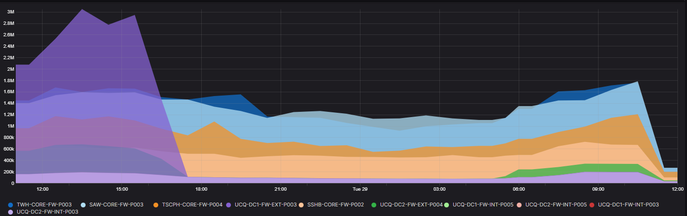
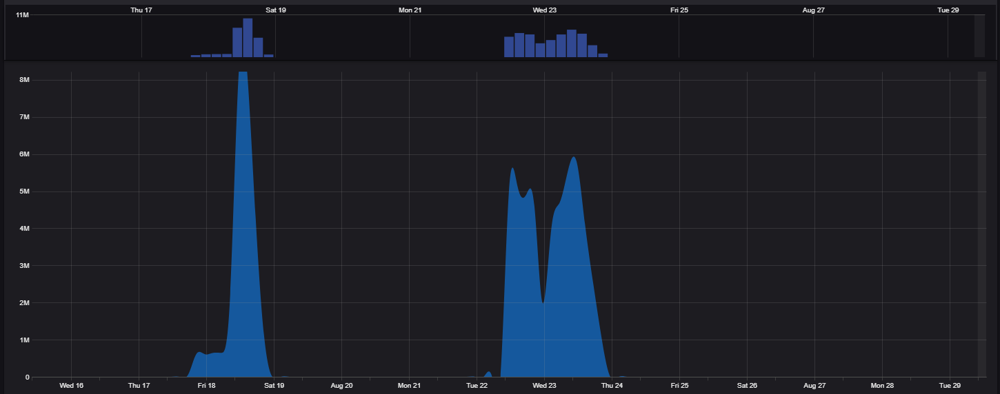
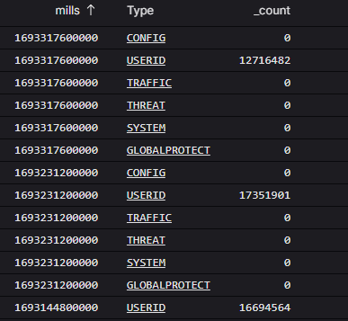
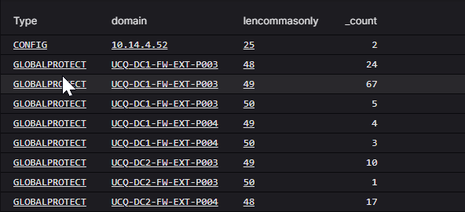
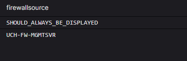
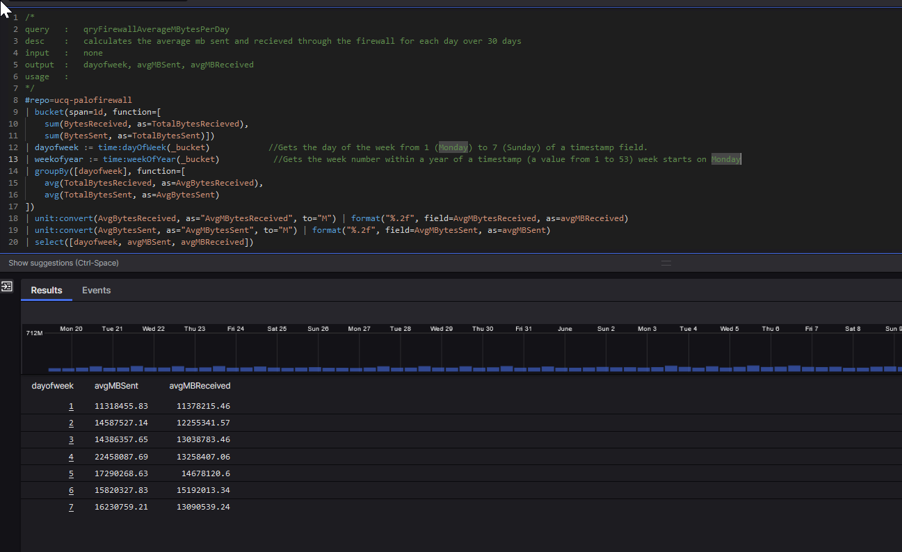

# Logscale

## timechart
```s
#repo=ucq-palofirewall
| timechart(series=domain, span=1h)
```


## matching data in file
```s
match(file="PaloIngestionRulesWhichShouldBeIgnored.csv", column=RuleName, field=RuleName, include=[])
| timechart()
```


## bucket 
```s
#repo=ucq-palofirewall
//| timechart(series=domain, function=count(User), span=1d, limit=50)
| bucket(field=Type, function=count(), span=1d, limit=500)
| parseTimestamp(field=_bucket,format=millis, as=mills)
| formatTime(format="%F", as="readabledate", field=mills)       // format it https://library.humio.com/data-analysis/functions-formattime.html
| table(fields=[mills, Type, _count], limit=500)
```


## count commas in rawstring
```s
#repo=ucq-palofirewall
| replace(regex="[^,]", field=@rawstring, as=commasonly)    //replace all the characters except commas
| length(field=commasonly, as=lencommasonly)                // get the length of the commasonly field
| groupBy(field=[Type,domain,lencommasonly])
```


## search for *.ru and *.cn domain names being requested
```s
in(fqdn,values=["*.ru", "*.cn"])
| groupby(field=[fqdn,srcipaddress,protocol])
```


## limit number of results using sort
```s
in(fqdn,values=["*.ru", "*.cn"])
| groupby(field=[fqdn,resolvedhostname], function=count()) | sort(field=_count, limit=20)
```

## get a count of all the repos
```
groupby(field=#repo)
```

## time chart of count of records in repos for every 5 minutes
```s
timeChart(span=15m, function=count(), series=#repo)
```

## custom output using case
```s
astein OR adm_astein
| case { 	
	#repo = ucq-palofirewall | format("%s from %s:%s to %s:%s",field=[Type,SourceIP,SourcePort, DestinationIP, DestinationPort],as=output) ; 
	#repo = ucq-ad | splitString(field=@rawstring, by = "\n") | format("eventid=%s | action=%s", field=[#windows.EventID , _splitstring[0]], as=output);
    "BOOO NOT HANDLED"
}
| table([@timestamp, #repo, output])
```

## worldmap 
tick the live view to refresh results automatically
```s
#repo = "ucq-palofirewall"
| worldMap(ip=DestinationIP)
```

## find firewall sources that have not sent traffic for a period of time
```s
createEvents([
    "firewallsource=SHOULD_ALWAYS_BE_DISPLAYED",            // THIS IS A TEST CASE AND SHOULD ALWAYS BE DISPLAYED
    "firewallsource=DC1-FW-MGMTSVR",            "firewallsource=SAW-CORE-FW-P003",
    "firewallsource=SAW-CORE-FW-P004",          "firewallsource=SSHB-CORE-FW-P001",
    "firewallsource=SSHB-CORE-FW-P002",         "firewallsource=TWH-CORE-FW-P003",
    "firewallsource=TWH-CORE-FW-P004",          "firewallsource=UCQ-DC1-FW-EXT-P003",
    "firewallsource=UCQ-DC1-FW-EXT-P004",       "firewallsource=UCQ-DC1-FW-INT-P003",
    "firewallsource=UCQ-DC1-FW-INT-P004",       "firewallsource=TSCPH-CORE-FW-P003",
    "firewallsource=TSCPH-CORE-FW-P004",        //"firewallsource=UCH-FW-MGMTSVR",
    "firewallsource=UCQ-DC1-FW-INT-P005",       "firewallsource=UCQ-DC1-FW-INT-P006",
    "firewallsource=UCQ-DC2-FW-INT-P003",       "firewallsource=UCQ-DC2-FW-INT-P004",
    "firewallsource=UCQ-DC2-FW-INT-P005",       "firewallsource=UCQ-DC2-FW-INT-P006",
    "firewallsource=UCQ-DC2-FW-EXT-P003",       "firewallsource=UCQ-DC2-FW-EXT-P004"
]) 
| kvParse()
| join(
    query={ groupBy([domain]) },
    field=firewallsource,                           //pk in primary query
    key=domain,                                 	//pk in sub query
    include=[domain, _count],    
    mode=left
)
| table(fields=[firewallsource, _count])
| _count != *

```



### Upgrade of custom logs from Palo

#### Current traffic format in palos
```s
$sender_sw_version,$receive_time,$serialnumber,$type,$app,$category,$rule,$src,$dst,$natsrc,$natdst,$sport,$dport,$natsport,$natdport,$proto,$action
```

#### New traffic format for palos
```s
$sender_sw_version,$receive_time,$serialnumber,$type,$app,$category,$rule,$src,$dst,$natsrc,$natdst,$sport,$dport,$natsport,$natdport,$proto,$action,$srcuser,$dstuser,$from,$to,$bytes,$bytes_sent,$bytes_received,$category_of_app,$subcategory_of_app,$start,$sessionid

```

#### Updated parser script
``` s
/*  20230905 AdamS This is the original rule put in place by SilasB
    Type="TRAFFIC"
      | parseCSV(csv_data, columns=[
          _fu1, ReceiveTime, SerialNumber, Type, Application, Category, RuleName, SourceIP, DestinationIP, NATSourceIP, NATDestinationIP, SourcePort, DestinationPort, NATSourcePort, NATDestinationPort, Protocol, Action
        ])
      | parseTimestamp(field="ReceiveTime", format="yyyy/MM/dd HH:mm:ss", timezone="UTC") ; 
 */
//  20230905 AdamS New parsing rule for additional fields being added to the Palo custom log format.
    Type="TRAFFIC"
      | parseCSV(csv_data, columns=[
          _fu1, ReceiveTime, SerialNumber, Type, Application, Category, RuleName, SourceIP, DestinationIP, NATSourceIP, NATDestinationIP, SourcePort, DestinationPort, NATSourcePort, NATDestinationPort, Protocol, Action, SourceUser, DestinationUser, SourceZone, DestinationZone, BytesTotal, BytesSent, BytesReceived, ApplicationCategory, ApplicationSubCategory, StartTime, SessionID
        ])
      | parseTimestamp(field="ReceiveTime", format="yyyy/MM/dd HH:mm:ss", timezone="UTC"); 
```


## count records
```s
| #repo!=unitingcare-queensland
| bucket(function=count(), span=1d, limit=500)
| parseTimestamp(field=_bucket,format=millis, as=mills)
| formatTime(format="%F", as="readabledate", field=mills)   
```


## AD activity for a user
```s
#repo = "ucq-ad"                                                        //ad repo
| in(field=@rawstring, values=["*twhmlcl*"], ignoreCase=true)           //only these account names
| ! in(field=@rawstring, values=["*twhmlcltechusr*", "*twhmlclmgr*"])   //exclude these accounts
| splitString(field=@rawstring, by = "\n")                              //split the rawstring field on newlines
| formatTime(format="%F", as="readabledate", field=@timestamp)
//| formatTime(format="%Y/%m/%d %H:%M:%S ", as="readabledate", field=@timestamp, timezone="Australia/Brisbane")
```


## format numbers, format to 2 decimal points
```s
| unit:convert(_sum, as="MB", to="M")
| format("%.2f", field=MB, as=MB)
```

## split rawstring by newline
```s
| splitString(field=@rawstring, by = "\n")                                  //split the rawstring field on newlines 
| "_splitstring[0]" = "A member was removed*"                               //first field must 
```


## palo ingestion nasty validator
```s
/*PALO NASTY VALIDATOR */
| createEvents(["fieldname=SourceUser", "fieldname=DestinationUser", "fieldname=ApplicationCategory", "fieldname=ApplicationSubCategory", "fieldname=SourceZone", "fieldname=DestinationZone"])
| kvParse()
| join(query = { 
        #repo = ucq-palofirewall | Type = TRAFFIC | SourceUser != "" | fieldname := "SourceUser"
        | groupBy(field=fieldname, function={selectLast(@timestamp)}) | age := now() - @timestamp| age > 3000000 | formatDuration(field=age, as=age)
    }, include=[fieldname, age],    field=fieldname,    key=fieldname,    mode=left)
| join(query = { 
        #repo = ucq-palofirewall | Type = TRAFFIC | DestinationUser != "" | fieldname := "DestinationUser"
        | groupBy(field=fieldname, function={selectLast(@timestamp)}) | age := now() - @timestamp| age > 3000000 | formatDuration(field=age, as=age)
    }, include=[fieldname, age],    field=fieldname,    key=fieldname,    mode=left)
| join(query = { 
        #repo = ucq-palofirewall | Type = TRAFFIC | ApplicationCategory != "" | fieldname := "ApplicationCategory"
        | groupBy(field=fieldname, function={selectLast(@timestamp)}) | age := now() - @timestamp| age > 3000000 | formatDuration(field=age, as=age)
    }, include=[fieldname, age],    field=fieldname,    key=fieldname,    mode=left
)
| join(
    query = { 
        #repo = ucq-palofirewall | Type = TRAFFIC  | ApplicationSubCategory != "" | fieldname := "ApplicationSubCategory"
        | groupBy(field=fieldname, function={selectLast(@timestamp)}) | age := now() - @timestamp| age > 3000000 | formatDuration(field=age, as=age)
    }, include=[fieldname, age],    field=fieldname,    key=fieldname,    mode=left
)
| join(
    query = { 
        #repo = ucq-palofirewall | Type = TRAFFIC | SourceZone != "" | fieldname := "SourceZone"
        | groupBy(field=fieldname, function={selectLast(@timestamp)}) | age := now() - @timestamp| age > 3000000 | formatDuration(field=age, as=age)
    }, include=[fieldname, age],    field=fieldname,    key=fieldname,    mode=left
)
| join(
    query = { 
        #repo = ucq-palofirewall | Type = TRAFFIC | DestinationZone != "" | fieldname := "DestinationZone"
        | groupBy(field=fieldname, function={selectLast(@timestamp)}) | age := now() - @timestamp| age > 3000000 | formatDuration(field=age, as=age)
    }, include=[fieldname, age],    field=fieldname,    key=fieldname,    mode=left
)
| length(age) | _length > 0
| table(fields=[fieldname, age])


```

## top 
```s
#repo = ucq-palofirewall
| Type = TRAFFIC    
| domain = "UCQ-DC*-FW-EXT-*"
//| SourceUser != ""
| dom := time:dayOfMonth(@timestamp)
| top(field=[dom, SourceUser], limit=50, rest=others)

```


## monitor firewalls
```s
#repo = ucq-palofirewall
// do we care which node it is coming from?
| case {
    domain = "UCQ-*-FW-EXT-*"   | domaingroup := "UCQ-FW-EXT";               
    domain = "UCQ-*-FW-INT-*"   | domaingroup := "UCQ-FW-INT";
    domain = "TWH-CORE-FW-*"    | domaingroup := "TWH-CORE-FW";
    domain = "SAW-CORE-FW-*"    | domaingroup := "SAW-CORE-FW";
    domain = "SSHB-CORE-FW-*"   | domaingroup := "SSHB-CORE-FW";
    domain = "TSCPH-CORE-FW-*"  | domaingroup := "TSCPH-CORE-FW";
    *                           | domaingroup := domain
}
| domain != "syslogtest.ps1"                        //exclude my test case
//| !in(Type,values=["CONFIG", "SYSTEM"])            // do we need CONFIG or SYSTEM
| groupBy(field=[domaingroup, Type], function={selectLast(@timestamp)}) // the last time we saw a record based on the fields
| age := now() - @timestamp
| age > 3000000 // 3000000 = 50 minutes in milliseconds
| formatDuration(field=age, as=age)
| rename(age, as="Time Since Seen")


```


## rich colors
```
| case {
    Severity = critical     | icon:="🔴";
    Severity = high         | icon:="🟠";
    Severity = medium       | icon:="🟡";       //      🟣
    Severity = low          | icon:="🟢";       //      ⚪
    *                       | icon:="🔵";       //      ⚫
}


🟥
U+1F7E5
🟦
U+1F7E6
🟧
U+1F7E7
🟨
U+1F7E8
🟩
U+1F7E9
🟪
U+1F7EA
🟫
U+1F7EB
⬛
U+2B1B
⬜
U+2B1C
🔲
U+1F532
🔳


```


## format strings
```s
#repo = ucq-palofirewall
// do we care which node it is coming from?
| case {
    domain = "UCQ-*-FW-EXT-*"   | domaingroup := "UCQ-FW-EXT";               
    domain = "UCQ-*-FW-INT-*"   | domaingroup := "UCQ-FW-INT";
    domain = "TWH-CORE-FW-*"    | domaingroup := "TWH-CORE-FW";
    domain = "SAW-CORE-FW-*"    | domaingroup := "SAW-CORE-FW";
    domain = "SSHB-CORE-FW-*"   | domaingroup := "SSHB-CORE-FW";
    domain = "TSCPH-CORE-FW-*"  | domaingroup := "TSCPH-CORE-FW";
    *                           | domaingroup := domain
}
| domain != "syslogtest.ps1"                        //exclude my test case
| !in(Type,values=["CONFIG", "SYSTEM"])            // do we need CONFIG or SYSTEM
| groupBy(field=[domaingroup, Type], function={selectLast(@timestamp)}) // the last time we saw a record based on the fields
| age := now() - @timestamp
// to see all domains, comment out the below line
//| age > 3000000 // 3000000 = 50 minutes in milliseconds
| case {
    age > 3000000 | ageicon := "🔴";
    * | ageicon:="🟢"
}
| format(format="%s%s", field=[ageicon,domaingroup], as=domaingroup)
| formatDuration(field=age, as=age)
| rename(age, as="Time Since Seen")
| table(fields=[domaingroup, Type, @timestamp, "Time Since Seen"])

```


## filter records in parser 
```sh 
      | case {
         domain="UCQ-*-FW-INT-*" | match(file="RulesWhichShouldBeIgnored.csv", column=RuleName, field=RuleName, include=[])  | ignoredRuleName:=true;
          * | ignoredRuleName:=false
      }
```


## cidr query
```sh
| #repo = ucq-palofirewall
| cidr(SourceIP, subnet=["10.0.0.0/8"])

// CERNER
| SourceZone = Prod_Transit | DestinationZone = Cerner_VPN | cidr(DestinationIP, subnet=["68.65.229.0/24", "68.65.229.0/24", "68.65.229.0/24", "68.65.228.0/24","159.140.120.0/24","159.140.110.0/27"]) 

// INTERNET
//| SourceZone = Prod_Transit | DestinationZone = External_Prod


| timeChart(function=[sum(BytesReceived, as=SumReceived), sum(BytesSent, as=SumSent)])

```


## searching dns records
```
| #repo = ucq-dns
//| !in(field=fqdn, values=["*.ucq.com.au", "*.uhc.com.au", "*.uhc.uc.com.au", "*.int.ucq.com.au", "*domainkey*", "*.sophosxl.net", "*.arpa"], ignoreCase=true)
//| in(field=fqdn, values=["*.ru", "*.cn"], ignoreCase=true)            // fqdn ends in ru (russia) or cn (china)
//| length:=length(fqdn) | length > 100 | groupby(fqdn)                 // really long fqdn
//| groupby(field=questype)                                             // strange questypes
//| groupby(field=[srcipaddress, fqdn])                                 // looking for sources making multiple requests to the same domain. [ 86400 seconds in day ]
//| groupby(field=[fqdn], function=count(srcipaddress, distinct=true))  // number of machines connecting to the same fqdn 
//| in(field=fqdn, values=["*.top","*.gq","*.ga","*.cf","*.cn","*.tk","*.zw","*.bd","*.ke","*.am","*.date","*.pw","*.quest","*.cd","*.bid","*.ga","*.xyz","*.cf","*.tk","*.ml", "*.cyou"], ignoreCase=true)         // malicious, phishing, malware
//| groupby(fqdn)
//| in(field=questype, values=["TXT*", "NULL", "CNAME"])                //popular dns tunneling records

```


## JOIN TO CROWDSTRIKE TO GET COMPUTERNAME
```sh
/* 
JOIN TO CROWDSTRIKE TO GET COMPUTERNAME
*/
#repo = ucq-palofirewall
| in(field=Category, values=["hacking", "malicious", "malware", "phishing", "scanning-activity"])


/* JOIN to CROWDSTRIKE BASED ON IP ADDRESS */
| join(
    query={ 
        kvParse()
        | UserName=* // wildcard means must contain a value
        | Username!="*$" // Managed service accounts are identified by ending in a dollar sign ($) so exclude them
    },
    field=SourceIP,                                 //pk in outer query
    key=LocalAddressIP4,                            //pk in this query
    include=[ComputerName, UserName],    
    mode=left,
    max=1,
    repo="unitingcare-queensland"
)
| table(fields=[@timestamp, ComputerName, SourceIP, SourceUser, UserName, Category, domain, RuleName])
```


# Hospital appid upgrade


| top(desc, limit=2, percent=true)
| format("%.2f", field=percent, as=percent)
| desc = "AppIds"
| select(fields=[desc,percent])


## NMAP scan from cyber01 to work laptop
https://ucareqld.logscale.us-2.crowdstrike.com/ucqv-overview/search?end=1711327020000&live=false&query=%2F%2Fnmap%20-sC%20-sV%20-oA%20c%3A%5Ctemp%5Cnmapscan%2010.14.212.95%0A%23repo%3Ducq-palofirewall%0A%7C%20SourceIP%20%3D%20%2010.14.12.90%20%20%20%20%20%20%20%20%20%20%20%2F%2FUCQ-CYBER-P001%0A%7C%20DestinationIP%20%3D%2010.14.212.95%20%20%20%20%20%20%2F%2Fucl-gw5hzh3.int.ucq.com.au&start=1711326840000&tz=Australia%2FBrisbane

//nmap -sC -sV -oA c:\temp\nmapscan 10.14.212.95
#repo=ucq-palofirewall
| SourceIP =  10.14.12.90           //UCQ-CYBER-P001
| DestinationIP = 10.14.212.95      //ucl-gw5hzh3.int.ucq.com.au

2024-03-25 10:34:00.000 - 2024-0325 10:37:00.000


# bucket with timestamp converted
```s
#repo=ucq-palofirewall
| case {
    domain = "TSCPH-CORE-FW-*"      | domaingroup := "TSCPH [Buderim]"    | match(file="appIdRuleNamesBuderim.csv", field=RuleName, column=csvRuleName, include=[csvRuleName,csvDesc]);                //BUDERIM
    domain = "SSHB-CORE-FW-*"       | domaingroup := "SSHB [StStephens]"     | match(file="appIdRuleNamesStStephens.csv", field=RuleName, column=csvRuleName, include=[csvRuleName,csvDesc]);           //ST STEPHENS
    domain = "TWH-CORE-FW-*"        | domaingroup := "TWH [Wesley]"      | match(file="appIdRuleNamesWesley.csv", field=RuleName, column=csvRuleName, include=[csvRuleName,csvDesc]);               //WESLEY
    domain = "SAW-CORE-FW-*"        | domaingroup := "SAW [StAndrews]"      | match(file="appIdRuleNamesStAndrews.csv", field=RuleName, column=csvRuleName, include=[csvRuleName,csvDesc]);            //ST ANDREWS

    *                               | domaingroup := "excluded"         //catch all
}
| domaingroup = "SSHB [StStephens]"
| case {
    csvDesc = "Used"            | csvDesc:="Existing RuleName";
    csvDesc = "Partially Used"  | csvDesc:="Existing RuleName";
    csvDesc = "New Rule"        | csvDesc:="AppId";
}
| bucket(2m, field=[RuleName, csvDesc, Application, ApplicationCategory, ApplicationSubCategory], limit=500, function=[collect([SourceIP, DestinationIP], separator=","), count(as=_count)])
| time := formatTime("%Y/%m/%d %H:%M:%S", field=_bucket, timezone="Australia/Brisbane") 
| select(fields=[time,RuleName, _count, csvDesc, Application, ApplicationCategory, ApplicationSubCategory])

```


# NOT INTERNAL IP RANGES

```sh
| #repo = "ucq-palofirewall"
| RuleName="ENP-UNMANAGED_access_in_37"
| !cidr(field=DestinationIP, subnet=["10.0.0.0/8", "172.16.0.0/12", "192.168.0.0/16"])  
| groupby(field=[SourceIP, DestinationIP], limit=max, function=[collect(Application)])
| unit:convert(TBR, as="MBR", to="M") | format("%.2f", field=MBR, as=TotalMBReceived)

```


# crowdstrike
add username to results
`| join({#event_simpleName=UserLogon}, field=aid, include=UserName, mode=left)`

add computer name to results
`| match(file="fdr_aidmaster.csv", field=aid, include=ComputerName, ignoreCase=true, strict=false)`


https://github.com/CrowdStrike/logscale-community-content/blob/main/Queries-Only/Helpful-CQL-Queries/Leveraging%20the%20aidmaster%20repo.md 
`
#repo=sensor_metadata #data_source_name=aidmaster
| groupBy([cid, aid], function=([selectFromMax(field="@timestamp", include=[AgentLoadFlags, AgentLocalTime, AgentTimeOffset, AgentVersion, BiosManufacturer, BiosVersion, ChassisType, City, ComputerName, ConfigBuild, ConfigIDBuild, Continent, Country, FalconGroupingTags, FirstSeen, HostHiddenStatus, MachineDomain, OU, PointerSize, ProductType, SensorGroupingTags, ServicePackMajor, SiteName, SystemManufacturer, SystemProductName, @timezone, Timezone, Version, aid, aip, cid, event_platform])]))
| lastSeen:=@timestamp
| formatTime(format="%F %T", as="lastSeen", field=lastSeen)
| timeDelta:=now()-@timestamp
| timeDeltaDays:=timeDelta/1000/60/60/24
| round(timeDeltaDays)
  
// Edit this line to set your "days since last seen" treshold
//| timeDeltaDays<4
  
| ipLocation(aip)
| drop([aip.lat, aip.lon, timeDelta, @timestamp])
`


## split ioc
`
client_ip:="15.235.66.162"
|ioc:lookup(field=[client_ip],type="ip_address",confidenceThreshold=unverified)
| split("ioc")
`


```
/*
| join({
    join({
        //start inside out
        #event_simpleName = SensorTampering 
        | triggerEvent := #event_simpleName 
        | triggerCmd := SourceCommandLine
    }, field=TargetProcessId, key=SourceProcessId, include=[triggerEvent, triggerCmd])
}, field=TargetProcessId, key=ParentProcessId, include=[triggerEvent, triggerCmd])
| select([@timestamp,ComputerName,Username,triggerEvent,triggerCmd,CommandLine])
//| !CommandLine = "sh -c \\u000a        /usr/bin/pkill -HUP falcon-sensor\\u000a logrotate_script /var/log/falcon-sensor.log " //log rotation, exclude from alert
*/
// groupBy([#event_simpleName])
//groupby([Tactic, #event_simpleName])
//#event_simpleName = ProcessRollup2 

//ContextProcessId = UPID of process originating this event. 
// #event_simpleName = InstalledUpdates | RebootRequired = 1 | select([ComputerName, RebootRequired, InstalledUpdateIds])
// #event_simpleName = SuspiciousDnsRequest | join({#event_simpleName=UserLogon}, field=aid, include=UserName, mode=left) | select([ComputerName, Username, DomainName])
// #event_simpleName=UserLogon | //password lastset > policy
// #event_simpleName = ScreenshotTakenEtw | groupBy([ComputerName,Username])
// #event_simpleName = SmbServerV1AuditEtw | groupBy(field=[ComputerName], function=[collect([SmbClientName]), count()])       //smbv1 sweep?
//  #event_simpleName = *File* | groupBy([#event_simpleName])
// RansomwareOpenFile 
// #event_simpleName = ScriptControlDetectInfo
#event_simpleName = ActiveDirectoryAuthentication
```


# password spray
```
#repo=ucq-palofirewall|Type=GLOBALPROTECT|ipLocation(field=PublicIP,as=location)|location.country!="AU"|Status=failure 
| groupBy([PublicIP, Status], function=[count(), collect([SourceUser], separator=", ")])

```


# enriching results for
```
#repo=ucq-palofirewall
| ApplicationSubCategory = /artificial-intelligence/i
| groupBy([SourceIP], function=[count(as=HitCount)])
| join(query={ #event_simpleName = UserLogon }, field=SourceIP, key=LocalAddressIP4, mode=inner, include=[aid])
| groupBy([SourceIP, HitCount], function=[count(), collect([aid])])
| match(file="fdr_aidmaster.csv", field=aid, include=ComputerName, ignoreCase=true, strict=false)
| join({#event_simpleName=UserLogon}, field=aid, include=UserName, mode=left)

```


# add domain sids information to query results

get domain sids and output to file
```
$domains = @("int.ucq.com.au", "lccq.org.au", "qld.bluecare.org.au", "uhc.uc.com.au"); foreach ($domain in $domains){get-adgroup -filter * -server $domain -properties * | Select-Object -Property @{Name='Domain';Expression={$domain}}, ObjectClass, DistinguishedName, SID, SamAccountName, Description | Export-Csv -Path c:\temp\domainsids.csv -append -NoTypeInformation}
```
upload to logscale

```
#repo=ucq-ad
| #windows.EventID = 4627           // Group membership information.
//ENSURE YOU ONLY GET ONE RESULT!
| @collect.id = "56847e61-0402-4e75-bf7c-f5be48056cb1"  | /tshi1/i  | @collect.timestamp = 1715145538142
//THEN MATCH
| regex(field=@rawstring, regex="{(?<SID>[^\\{*}]*)}", repeat=true)
| match(file="domainsids.csv", field="SID")
| groupby(field=[@collect.id], function=[collect([SamAccountName])])

```


https://ucareqld.logscale.us-2.crowdstrike.com/ucqv-overview/search?tz=Australia/Brisbane&query=%23repo%3Ducq-ad%0A%7C+%23windows.EventID+%3D+4627+++++++++++//+Group+membership+information.%0A//%7C+@collect.id+%3D+%2232b89c81-f15a-4195-af4f-e916a16bc3c0%22%0A%7C+/adm_astein/i%0A%7C+@collect.timestamp+%3D+1713164969166%0A//%7C+/QLD.BLUECARE.ORG.AU/i%0A//%7C+@collect.timestamp+%3D+1715230492400%0A%7C+regex(field%3D@rawstring,+regex%3D%22%7B(?%3CSID%3E%5B%5E%5C%5C%7B*%7D%5D*)%7D%22,+repeat%3Dtrue)%0A//%7C+match(file%3D%22sids.csv%22,+field%3D%22SID%22)%0A//%7C+groupby(field%3D%5B@collect.id%5D,+function%3D%5Bcollect(%5BSamAccountName%5D)%5D)%0A%7C+select(SID)%0A%0A&live=false&end=1713191623850&start=1713133582282


https://ucareqld.logscale.us-2.crowdstrike.com/ucqv-overview/search?live=false&query=%23repo%3Ducq-palofirewall%7CType%3DGLOBALPROTECT%7CipLocation(field%3DPublicIP%2Cas%3Dlocation)%7Clocation.country!%3D%22AU%22%7CStatus%3Dfailure%0A%7C%20PublicIP%20!%3D%200.0.0.0%0A%7C%20groupBy(%5BPublicIP%5D%2C%20function%3D%5Bcount(as%3DCount)%2C%20count(field%3DSourceUser%2C%20as%3DSourceUserCount%2C%20distinct%3Dtrue)%5D)%0A%7C%20sort(field%3DCount)%0A%7C%20Count%20%3E%20100&start=1d&tz=Australia%2FBrisbane


https://ucareqld.logscale.us-2.crowdstrike.com/ucqv-overview/search?live=false&query=%2F*%20%0A%20%20%20%20Every%20Falcon%20sensor%20is%20given%20a%20unique%20identifier%20called%20an%20aid.%20Every%20event%20emitted%20from%20the%20Falcon%20Sensor%20contains%20this%20field%2C%20and%20should%20be%20considered%20the%20primary%20key%20for%20looking%20up%20events%20from%20a%20given%20sensor%2Fmachine.%0A%20%20%20%20users%20who%20have%20logged%20on%0A%20%20%20%20%23event_simpleName%3DUserLogon%20event_platform%3DMac%0A*%2F%0A%2F%2F%20%23event_simpleName%3DSuspiciousDnsRequest%0A%2F%2F%20%7C%20groupBy(aid%2C%20function%3Dcollect(DomainName)%2C%20limit%3Dmax)%0A%0A%23event_simpleName%3DProcessRollup2%20%0A%7C%20!in(UserName%2C%20values%3D%5B%22*%24%22%2C%20%22SYSTEM%22%5D)%0A%7C%20ImageFileName%3D%2F(%5C%2F%7C%5C%5C)(%3F%3CFileName%3E%5Cw*%5C.%3F%5Cw*)%24%2F%0A%7C%20FileName%20%3D%20%2F%5E(net%7Cipconfig%7Cwhoami%7Cquser%7Cping%7Cnetstat%7Ctasklist%7Chostname%7Cat)%5C.exe%24%2Fi%0A%7C%20case%20%7B%0A%20%20%20%20aid%3D*%20AND%20ComputerName!%3D*%0A%20%20%20%20%20%20%7C%20match(file%3D%22fdr_aidmaster.csv%22%2C%20field%3Daid%2C%20include%3DComputerName%2C%20ignoreCase%3Dtrue%2C%20strict%3Dtrue)%3B%0A%20%20%20%20*%20%7C%20default(field%3DComputerName%2C%20value%3DNotMatched)%3B%0A%20%20%7D%0A%7C%20table(%5Baid%2C%20UserName%2C%20ComputerName%2C%20ParentBaseFileName%2C%20ImageFileName%2C%20CommandLine%5D%2C%20limit%3D1000)%0A%0A%2F%2F%7C%20groupby(UserName)&start=2d&tz=Australia%2FBrisbane


https://ucareqld.logscale.us-2.crowdstrike.com/ucqv-overview/search?live=false&query=%0A%23repo%3Ducq-palofirewall%0A%7C%20ApplicationSubCategory%20%3D%20%2Fartificial-intelligence%2Fi%0A%7C%20groupBy(%5BSourceIP%5D%2C%20function%3D%5Bcount(as%3DHitCount)%5D)%0A%7C%20join(query%3D%7B%0A%20%20%20%20%20%20%20%20%23event_simpleName%20%3D%20UserLogon%0A%20%20%20%20%7D%2C%20field%3DSourceIP%2C%20key%3DLocalAddressIP4%2C%20mode%3Dinner%2C%20include%3D%5Baid%5D)%0A%7C%20groupBy(%5BSourceIP%2C%20HitCount%5D%2C%20function%3D%5Bcount()%2C%20collect(%5Baid%5D)%5D)%0A%7C%20match(file%3D%22fdr_aidmaster.csv%22%2C%20field%3Daid%2C%20include%3DComputerName%2C%20ignoreCase%3Dtrue%2C%20strict%3Dfalse)%0A%7C%20join(%7B%23event_simpleName%3DUserLogon%7D%2C%20field%3Daid%2C%20include%3DUserName%2C%20mode%3Dleft)%0A&start=30d&tz=Australia%2FBrisbane


# heatmap to show drop in count over time
```

#repo=ucq-palofirewall
| case {
    domain = "TSCPH-CORE-FW-*"      | domaingroup := "TSCPH [Buderim]"    | match(file="appIdRuleNamesBuderim.csv", field=RuleName, column=csvRuleName, include=[csvRuleName,csvDesc]);                //BUDERIM
    domain = "SSHB-CORE-FW-*"       | domaingroup := "SSHB [StStephens]"     | match(file="appIdRuleNamesStStephens.csv", field=RuleName, column=csvRuleName, include=[csvRuleName,csvDesc]);           //ST STEPHENS
    domain = "TWH-CORE-FW-*"        | domaingroup := "TWH [Wesley]"      | match(file="appIdRuleNamesWesley.csv", field=RuleName, column=csvRuleName, include=[csvRuleName,csvDesc]);               //WESLEY
    domain = "SAW-CORE-FW-*"        | domaingroup := "SAW [StAndrews]"      | match(file="appIdRuleNamesStAndrews.csv", field=RuleName, column=csvRuleName, include=[csvRuleName,csvDesc]);            //ST ANDREWS

    *                               | domaingroup := "excluded"         //catch all
}
| domaingroup = "SSHB [StStephens]"
| case {
    csvDesc = "Used"            | csvDesc:="Existing RuleName";
    csvDesc = "Partially Used"  | csvDesc:="Existing RuleName";
    csvDesc = "New Rule"        | csvDesc:="AppId";
}


///// MAGIC HERE
| bucket(field=RuleName, minSpan=1m, limit=500)
| parseTimestamp(field=_bucket,format=millis)
| formatTime(format="%R", as="newtime", field=@timestamp, timezone="Australia/Brisbane")
| formatTime("H:M", field=@timestamp, as=minute)
| _count > 500

```


# match on two different fields, same .csv file
```s
#repo=ucq-palofirewall
| domain like "UCQ-DC*-FW-EXT-*"
| match(file="enrichIPs.csv", field="SourceIP", column="ip", mode="cidr", include=[name], strict=false)
| rename(field=name, as="srcName")
| select([RuleName, SourceIP, srcName, DestinationIP])   
| match(file="enrichIPs.csv", field="DestinationIP", column="ip", mode="cidr", include=[name], strict=false)
| rename(field=name, as="dstName")
| select([RuleName, SourceIP, srcName, DestinationIP,dstName])  

```


# parentbasefilename
```s
#repo=unitingcare-queensland
| #event_simpleName=ProcessRollup2
| aid = a7aa650d77a64ef285258d3924840aa5    //lachy
| ParentBaseFileName = /outlook|winword|excel/i
| join({#event_simpleName=ProcessRollup2 | aid=aid}, field=[ContextProcessId], key=TargetProcessId, include=[FileName, CommandLine,ComputerName], mode=left)
| select([@timestamp, refdomain, #event_simpleName, UserName, ParentBaseFileName, CommandLine])

```


# qryFirewallAverageMBytesPerDay

```
/* 
query   :   qryFirewallAverageMBytesPerDay
desc    :   calculates the average mb sent and recieved through the firewall for each day over 30 days
input   :   none
output  :   dayofweek, avgMBSent, avgMBReceived
usage   :   
*/
#repo=ucq-palofirewall
| bucket(span=1d, function=[
    sum(BytesReceived, as=TotalBytesRecieved), 
    sum(BytesSent, as=TotalBytesSent)])
| dayofweek := time:dayOfWeek(_bucket)            //Gets the day of the week from 1 (Monday) to 7 (Sunday) of a timestamp field. 
| weekofyear := time:weekOfYear(_bucket)           //Gets the week number within a year of a timestamp (a value from 1 to 53) week starts on Monday
| groupBy([dayofweek], function=[
    avg(TotalBytesRecieved, as=AvgBytesReceived),
    avg(TotalBytesSent, as=AvgBytesSent)
])
| unit:convert(AvgBytesReceived, as="AvgMBytesReceived", to="M") | format("%.2f", field=AvgMBytesReceived, as=avgMBReceived)
| unit:convert(AvgBytesSent, as="AvgMBytesSent", to="M") | format("%.2f", field=AvgMBytesSent, as=avgMBSent)
| select([dayofweek, avgMBSent, avgMBReceived])

```


# compare sent received traffic with the average per day over the last 30 days 
```s
#repo=ucq-palofirewall
| aadayofweek := time:dayOfWeek(@timestamp)
| join( 
    { 
/* START JOIN QUERY */
        bucket(span=1d, function=[
            sum(BytesReceived, as=TotalBytesReceived), 
            sum(BytesSent, as=TotalBytesSent)])
        | dayofweek := time:dayOfWeek(_bucket)            //Gets the day of the week from 1 (Monday) to 7 (Sunday) of a timestamp field. 
        | weekofyear := time:weekOfYear(_bucket)           //Gets the week number within a year of a timestamp (a value from 1 to 53) week starts on Monday
        | year := time:year(_bucket)
        | groupBy([year,weekofyear,dayofweek], function=[
            sum(TotalBytesReceived, as=totalBytesReceived),
            sum(TotalBytesSent, as=totalBytesSent)
        ])
        | groupBy([year, dayofweek], function=[
            avg(field=totalBytesReceived, as=avgBytesReceived),
            avg(field=totalBytesSent, as=avgBytesSent)
        ])
/* END JOIN QUERY */
    }, 
    field=aadayofweek, 
    key=dayofweek, 
    include=[year, dayofweek, avgBytesReceived, avgBytesSent], 
    start="30d", 
    mode=left)

/*sum bytes */
| groupBy([aadayofweek, year, dayofweek, avgBytesReceived, avgBytesSent], function=[
    sum(BytesReceived, as=totalBytesReceived),
    sum(BytesSent, as=totalBytesSent)])

/*calculations */
| unit:convert(totalBytesReceived, as="totalMBytesReceived", to="M") | format("%.2f", field=totalMBytesReceived, as=totalMBytesReceived)
| unit:convert(avgBytesReceived, as="avgMBytesReceived", to="M") | format("%.2f", field=avgMBytesReceived, as=avgMBytesReceived)
| prcntReceived := (totalMBytesReceived/avgMBytesReceived)*100 | format("%,.0f", field=prcntReceived, as=prcntReceived)

| unit:convert(totalBytesSent, as="totalMBytesSent", to="M") | format("%.2f", field=totalMBytesSent, as=totalMBytesSent)
| unit:convert(avgBytesSent, as="avgMBytesSent", to="M") | format("%.2f", field=avgMBytesSent, as=avgMBytesSent)
| prcntSent := (totalMBytesSent/avgMBytesSent)*100 | format("%,.0f", field=prcntSent, as=prcntSent)

| select([aadayofweek, year, dayofweek, 
      totalMBytesReceived, avgMBytesReceived, prcntReceived
    , totalMBytesSent, avgMBytesSent, prcntSent
])

/* need to combine to get a single number for prcnt, another average? 
| groupBy([year], function=[
      sum(totalMBytesReceived, as="totalMBytesReceived")
    , sum(totalMBytesSent, as="totalMBytesSent")
    , avg(avgMBytesReceived, as="avgMBytesReceived")
    , avg(avgMBytesSent, as="avgMBytesSent")
    , avg(prcntReceived, as="prcntReceived")
    , avg(prcntSent, as="prcntSent")
])*/


```
v2
```sh

#repo=ucq-palofirewall
| now(as=n) 
| aadayofweek := time:dayOfWeek(n)      //time:dayOfWeek(now)
/*get yesterdays full results */
| case {
      aadayofweek = 1 | aadayofweek := 7;    //monday back to sunday
    * |                 aadayofweek := aadayofweek - 1;
}
| join( 
    { 
/* START JOIN QUERY */
        bucket(span=1d, function=[
            sum(BytesReceived, as=TotalBytesReceived), 
            sum(BytesSent, as=TotalBytesSent)])
        | dayofweek := time:dayOfWeek(_bucket)            //Gets the day of the week from 1 (Monday) to 7 (Sunday) of a timestamp field. 
        | weekofyear := time:weekOfYear(_bucket)           //Gets the week number within a year of a timestamp (a value from 1 to 53) week starts on Monday
        | year := time:year(_bucket)
        | groupBy([year,weekofyear,dayofweek], function=[
            sum(TotalBytesReceived, as=totalBytesReceived),
            sum(TotalBytesSent, as=totalBytesSent)
        ])
        | groupBy([year, dayofweek], function=[
            avg(field=totalBytesReceived, as=avgBytesReceived),
            avg(field=totalBytesSent, as=avgBytesSent)
        ])
/* END JOIN QUERY */
    }, 
    field=aadayofweek, 
    key=dayofweek, 
    include=[year, dayofweek, avgBytesReceived, avgBytesSent], 
    start="30d", 
    mode=inner)

/*sum bytes */
| groupBy([dayofweek, year, dayofweek, avgBytesReceived, avgBytesSent], function=[
    sum(BytesReceived, as=totalBytesReceived),
    sum(BytesSent, as=totalBytesSent)])

/*calculations */
| unit:convert(totalBytesReceived, as="totalMBytesReceived", to="M") | format("%.2f", field=totalMBytesReceived, as=totalMBytesReceived)
| unit:convert(avgBytesReceived, as="avgMBytesReceived", to="M") | format("%.2f", field=avgMBytesReceived, as=avgMBytesReceived)
| prcntReceived := (totalMBytesReceived/avgMBytesReceived)*100 | format("%,.0f", field=prcntReceived, as=prcntReceived)

| unit:convert(totalBytesSent, as="totalMBytesSent", to="M") | format("%.2f", field=totalMBytesSent, as=totalMBytesSent)
| unit:convert(avgBytesSent, as="avgMBytesSent", to="M") | format("%.2f", field=avgMBytesSent, as=avgMBytesSent)
| prcntSent := (totalMBytesSent/avgMBytesSent)*100 | format("%,.0f", field=prcntSent, as=prcntSent)

| select([aadayofweek, year, dayofweek, 
      totalMBytesReceived, avgMBytesReceived, prcntReceived
    , totalMBytesSent, avgMBytesSent, prcntSent
])
| sort(dayofweek, limit=1)

/* need to combine to get a single number for prcnt, another average? 
| groupBy([year], function=[
      sum(totalMBytesReceived, as="totalMBytesReceived")
    , sum(totalMBytesSent, as="totalMBytesSent")
    , avg(avgMBytesReceived, as="avgMBytesReceived")
    , avg(avgMBytesSent, as="avgMBytesSent")
    , avg(prcntReceived, as="prcntReceived")
    , avg(prcntSent, as="prcntSent")
])*/


```
digging further
```s
/* SPIKE IN TRAFFIC */
#repo=ucq-palofirewall
| now(as=n) 
| bucket(span=1d, function=[sum(BytesSent, as=BytesSentDay)])           //      , sum(BytesReceived, as=BytesReceivedDay)
| dayOfWeek := time:dayOfWeek(_bucket)
| currentWeekOfYear := time:weekOfYear(_bucket)
| formattime("%A %d %B %Y, %R", as=fmttime, field=_bucket, timezone="Australia/Brisbane")
| lastweekday := (_bucket - (7*24*60*60*1000))
| dayOfWeek = 3

```


# execution chain
```sh

#event_simpleName=*

//| /grandparent/i
//| /treeid/i
//| aid = a7aa650d77a64ef285258d3924840aa5    //lachy
| GrandParentBaseFileName !=/PanGpHip/i
//| DomainName = * 
| select(fields=[GrandParentBaseFileName, ParentBaseFileName, ImageFileName, DomainName])
//| /winword|excel|outlook/i

| ExecutionChain:=format(format="%s\n\t└ %s \n\t\t└ %s", field=[GrandParentBaseFileName, ParentBaseFileName, CommandLine])
| select([CommandLine,ExecutionChain])


```


## function query (it worked once)
```sh
/* 
query   :   qryEnrichCS-ip
desc    :   returns known information about an ip based on the crowdstrike data 
input   :   ip
output  :   ip,name, datasource,lastupdated
usage   :   $qryEnrichCS-ip(ip=SourceIP)
*/
//| SourceIP = ?ip
#repo=unitingcare-queensland
| LocalAddressIP4 = ?ip
| select([LocalAddressIP4, ComputerName, aid, description])
| match(file="enrich_ip.csv", column=ip, field=LocalAddressIP4, include=[ip,description, datasource,lastupdated], mode=cidr, strict=false)


```

## it worked twice
```s

#repo=ucq-palofirewall
| SourceIP = 10.98.11.7
| join(query={
    "#event_simpleName"=LocalIpAddressIP4
    | !in(field=InterfaceDescription, values=["*Hyper*"])
    | select([@timestamp, ComputerName, LocalAddressIP4, aid])
    | groupBy([ComputerName], function=(selectLast([LocalAddressIP4, aid])))
}, field=SourceIP, key=LocalAddressIP4, repo="unitingcare-queensland", include=[ComputerName, aid, LocalAddressIP4])
| select([ComputerName, aid, LocalAddressIP4, DestinationIP])

```
l


# DO NOT DELETE!!!
```s
#repo=ucq-palofirewall
| SourceIP = 10.98.11.7
| join(query={
    "#event_simpleName"=LocalIpAddressIP4
    | !in(field=InterfaceDescription, values=["*Hyper*"])
    | select([@timestamp, ComputerName, LocalAddressIP4, aid])
    | groupBy([ComputerName], function=(selectLast([LocalAddressIP4, aid])))
}, field=SourceIP, key=LocalAddressIP4, repo="unitingcare-queensland", include=[ComputerName, aid, LocalAddressIP4])
| select([@timestamp, ComputerName, aid, LocalAddressIP4, DestinationIP])
| join({#event_simpleName=UserLogon}, field=aid, include=UserName, mode=left)
| match(file=enrich_ip.csv, field=LocalAddressIP4, column=ip, mode=cidr, include=[description])
```


# difference from last week
```
| bucket(span=1d, function=[
    sum(BytesSent, as=prvTotalBytesSent), 
    sum(BytesReceived, as=prvTotalBytesReceived)])
| prv := (_bucket - (7*24*60*60*1000))  | formattime("%A %d %B %Y, %R", as=prvTimeFormat, field=prv, timezone="Australia/Brisbane")
| cur := _bucket                        | formattime("%A %d %B %Y, %R", as=curTimeFormat, field=cur, timezone="Australia/Brisbane")
| select([cur, curTimeFormat, prv, prvTimeFormat, prvTotalBytesSent, prvTotalBytesReceived])
| rename(prvTotalBytesSent, as="EVENTprvTotalBytesSent")
| rename(prvTotalBytesReceived, as="EVENTprvTotalBytesReceived")
| match(file="prv.csv", field=cur, column=prv)
| difference := (EVENTprvTotalBytesSent / prvTotalBytesSent) * 100
| select([cur, curTimeFormat, EVENTprvTotalBytesSent, EVENTprvTotalBytesReceived, prv, prvTimeFormat, prvTotalBytesSent, prvTotalBytesReceived, difference])


```
```sh

#repo=ucq-palofirewall
| domain = /ext/i                   //external firewalls 
| Type = TRAFFIC                    //only want traffic
/* 
| bucket(span=1d, 
    function=[
        sum(BytesSent, as=prvTotalBytesSent), 
        sum(BytesReceived, as=prvTotalBytesReceived)
    ]
)
| prv := (_bucket - (7*24*60*60*1000))  | formattime("%A %d %B %Y, %R", as=prvTimeFormat, field=prv, timezone="Australia/Brisbane")         // prv is exactly one week earlier
| cur := _bucket                        | formattime("%A %d %B %Y, %R", as=curTimeFormat, field=cur, timezone="Australia/Brisbane")         // cur is the bucket
| prvTotalBytesSent > 0             // ignore anything that is less than zero
| select([
            cur, 
            curTimeFormat,       // not used in generating file
            prv, prvTimeFormat, prvTotalBytesSent, prvTotalBytesReceived            //export prv in friendly time cause I cant convert to epoch in my head 
])
*/
////////////////// up to here is what generates the file as well
| $qryGet-BytesSentReceivedTotal()          //using a saved query

| rename(prv, as=EVENTprv)
| rename(curTimeFormat, as="EVENTTimeFormat") 
| rename(prvTotalBytesSent, as="EVENTTotalBytesSent")
| rename(prvTotalBytesReceived, as="EVENTTotalBytesReceived")

| match(file="fw-external-sendreceivehistory.csv", field=EVENTprv, column=cur, strict=false)         // the prv field in the event query maps to the cur field in the csv
| diffSent := (EVENTTotalBytesSent / prvTotalBytesSent) * 100 
| diffReceived:= (EVENTTotalBytesReceived / prvTotalBytesReceived) * 100

| select([cur, EVENTTimeFormat, EVENTTotalBytesSent, EVENTTotalBytesReceived, EVENTprv, 
    curTimeFormat, prvTotalBytesSent, prvTotalBytesReceived, diffSent, diffReceived])


| sort(cur, order=desc)

```


# rulename difference from last week.
```sh
#repo=ucq-palofirewall
| bucket(span=1d, 
    field=RuleName, limit=500,
    function=[
        sum(BytesSent, as=prvTotalBytesSent), 
        sum(BytesReceived, as=prvTotalBytesReceived)
    ]
)
| prv := (_bucket - (7*24*60*60*1000))  | formattime("%A %d %B %Y, %R", as=prvTimeFormat, field=prv, timezone="Australia/Brisbane")         // prv is exactly one week earlier
| cur := _bucket                        | formattime("%A %d %B %Y, %R", as=curTimeFormat, field=cur, timezone="Australia/Brisbane")         // cur is the bucket
| prvTotalBytesSent > 0             // ignore anything that is less than zero
| select([
            RuleName,
            cur, 
            curTimeFormat,       // not used in generating file
            prv, prvTimeFormat, prvTotalBytesSent, prvTotalBytesReceived            //export prv in friendly time cause I cant convert to epoch in my head 
])

```


# sqqpoint01
https://ucareqld.logscale.us-2.crowdstrike.com/mitre-poc/search?%24alpha-2=AU&%24alpha2=CN&end=1718891999999&live=false&query=%23repo%20%3D%20ucq-ad%0A%7C%20%2FSQPPOINT01%2Fi%20%2F%2F%7C%20%2FBLUECARE%2Fi%0A%7C%20splitString(field%3D%40rawstring%2C%20by%20%3D%20%22New%20Logon%3A%22)%0A%7C%20regex(field%3D%22_splitstring%5B1%5D%22%2C%20regex%3D%22(%3F%3CNewAC%3E%5E%5CtAccount%20Name%3A(%5C%5Cs.*))%22%2C%20repeat%3Dtrue)%0A%7C%20regex(field%3D%22_splitstring%5B0%5D%22%2C%20regex%3D%22(%3F%3CFirstLine%3E%5E(.*))%22%2C%20flags%3Dm)%0A%2F%2F%7C%20!%20in(field%3DAC%2C%20values%3D%5B%22*%24%22%5D%2C%20ignoreCase%3Dtrue)%20%20%20%20%20%20%20%20%20%20%2F%2Fremove%20noise%0A%7C%20formattime(%22%25A%20%25d%20%25B%20%25Y%2C%20%25R%22%2C%20as%3Dfmttime%2C%20field%3D%40timestamp%2C%20timezone%3D%22Australia%2FBrisbane%22)%0A%7C%20select(%5Bfmttime%2C%20%40collect.id%2C%20%40collect.timestamp%2C%20NewAC%2C%20FirstLine%5D)%0A&start=1718546400000&tz=Australia%2FBrisbane
```sh
#repo = ucq-ad
| /SQPPOINT01/i //| /BLUECARE/i
| splitString(field=@rawstring, by = "New Logon:")
| regex(field="_splitstring[1]", regex="(?<NewAC>^\tAccount Name:(\\s.*))", repeat=true)
| regex(field="_splitstring[0]", regex="(?<FirstLine>^(.*))", flags=m)
//| ! in(field=AC, values=["*$"], ignoreCase=true)          //remove noise
| formattime("%A %d %B %Y, %R", as=fmttime, field=@timestamp, timezone="Australia/Brisbane")
| select([fmttime, @collect.id, @collect.timestamp, NewAC, FirstLine])


```


# average traffic against todays sum
```sh
#repo=ucq-palofirewall
| Type=TRAFFIC                      //only traffic data
// make friendly names
| case {
    domain = "TSCPH-CORE-FW-*"      | grpDomain := "TSCPH[Buderim]";                    //BUDERIM
    domain = "SSHB-CORE-FW-*"       | grpDomain := "SSHB[StStephens]";                  //ST STEPHENS
    domain = "TWH-CORE-FW-*"        | grpDomain := "TWH[Wesley]";                       //WESLEY
    domain = "SAW-CORE-FW-*"        | grpDomain := "SAW[StAndrews]";                    //ST ANDREWS
    domain = "*-*-FW-EXT*"          | grpDomain := "EXTERNAL";                          //EXTERNAL
    domain = "*-*-FW-INT*"          | grpDomain := "INTERNAL";                          //INTERNAL
    *                               | grpDomain := "excluded"                           //EXCLUDED
}
/****************************/
// group into 1d sum BytesSent
| bucket(
    span=1d,
    field=grpDomain, 
    function=[
        sum(BytesSent, as=sumBytesSent)
    ]
)
// get average and max bucket (this will be todays sum)
| groupBy(grpDomain,
    function=[
        avg(sumBytesSent, as=DailyAverage),                                     // get daily average
        selectFromMax(field="_bucket", include=[sumBytesSent,grpDomain]),       // get sum last _bucket aka today
        count(as=DayCount)                                                      // number of days checked for average
])
| rename(field=_avg, as=DailyAverage)
| rename(field=sumBytesSent, as=DailyTotal)
| DailyPercentage := DailyTotal/DailyAverage * 100
| format("%,.2f", field=DailyPercentage, as=DailyPercentage)
| case {
    DailyPercentage > 130   | icon:="🔴" | status:="ALERT";
    DailyPercentage > 100   | icon:="🟠" | status:="WARN";      
    DailyPercentage < 100   | icon:="🟢" | status:="OK";
}
| select(fields=[icon,status,grpDomain,DailyPercentage,DayCount])
```


## AD first line
```sh
#repo=ucq-ad
| regex(field=@rawstring, regex="(?<FirstLine>^(.*))")
| select(fields=[@timestamp, windows.EventData.TargetUserName, FirstLine, @rawstring])
| /dburgess2/i

```

## friendly messages
```sh
#repo=unitingcare-queensland
| UserName = *
| UserName = ?user
| in(field=#event_simpleName, values=["ScreenshotTakenEtw", "*FileWritten*", "UserLogon", "UserLogoff"])
| case{
    #event_simpleName = *FileWritten*       | 
        case {
            IsOnRemovableDisk=1 | usb := "USB DRIVE";
            usb := ""
        }
        |format("wrote file to %s %s",field=[usb, TargetFileName],as=msg);
    #event_simpleName=UserLogon             | format("logged in to %s",field=[ComputerName],as=msg);
    #event_simpleName=UserLogoff            | format("logged out of %s",field=[ComputerName],as=msg);
    #event_simpleName=ScreenshotTakenEtw    | format("took screenshot on %s",field=[ComputerName],as=msg);
}
| groupBy([@timestamp, ComputerName, UserName, msg])
| select(fields=[@timestamp, ComputerName, UserName,msg]) | tail(1000) | sort(field=@timestamp, order=asc, limit=1000)
 /* */


```


# qryMitre-Persistence-ScheduledTask
```sh

/* 
query   :   qryMitre-Persistence-ScheduledTask
mitre   :   https://attack.mitre.org/techniques/T1053/
desc    :   returns if there is registration of a scheduled task
input   :   none
output  :   UserName, ComputerName, TaskName, TaskExecCommand
usage   :   $qryMitre-Persistence-ScheduledTask
notes   :   
20240715 AS modifed to check for any changes to scheduled tasks, not just new ones. query renamed from -ScheduledTaskRegistered to -ScheduledTask. Thanks Mel!
*/
#repo = unitingcare-queensland
| #event_simpleName=/ScheduledTask*/i                           
| concat([TaskName, TaskExecCommand, TaskExecArguments], as=TaskCommand)

/* exclusions */
| TaskExecCommand = *
| UserName != "*$"          // local service account
| TaskCommand != /User_Feed_Synchronization-{[0-9A-Fa-f]{8}(?:-[0-9A-Fa-f]{4}){3}-[0-9A-Fa-f]{12}}C:\\Windows\\system32\\msfeedssync.exesync/i
| TaskCommand != /Microsoft\\Windows\\InstallService\\SmartRetry/i
| TaskCommand != /Microsoft\\Windows\\EnterpriseMgmtNonCritical\\[0-9A-Fa-f]{8}(?:-[0-9A-Fa-f]{4}){3}-[0-9A-Fa-f]{12}\\Queued Schedule created for queued alerts%windir%\\system32\\deviceenroller.exe\/o "[0-9A-Fa-f]{8}(?:-[0-9A-Fa-f]{4}){3}-[0-9A-Fa-f]{12}" \/c \/[q|y]/i
| TaskCommand != /Microsoft\\Windows\\GroupPolicy\\{[0-9a-fA-F]{8}-([0-9a-fA-F]{4}-){3}[0-9a-fA-F]{12}}gpupdate.exe \/target:computer/i
| TaskCommand != /Microsoft\\Windodws\\EnterpriseMgmt\\[0-9a-fA-F]{8}-([0-9a-fA-F]{4}-){3}[0-9a-fA-F]{12}\\PushRenewal%windir%\\system32\\deviceenroller.exe\/o "[0-9a-fA-F]{8}-([0-9a-fA-F]{4}-){3}[0-9a-fA-F]{12}" \/c \/y/i
| TaskCommand != /OneDrive Reporting Task-S-1-[0-59]-\d{2}-\d{8,10}-\d{8,10}-\d{8,10}-[1-9]\d{4}C:\\Program Files\\Microsoft OneDrive\\OneDriveStandaloneUpdater.exe\/reporting/i
| groupby(TaskCommand) | sort(_count)

//| rename(#event_simpleName, as=SimpleName)
//| groupBy([SimpleName, UserName, ComputerName, TaskName, TaskExecCommand])
//| sort(_count,order=desc, limit=10000)


```


# match windows events 
```sh
#repo=ucq-ad
| /domain admins/i
| match(file="Windows-WinEventCodes.csv", field=#windows.EventID, column=EventID)
| windows.EventData.MemberName = *
| select([@timestamp, Description, windows.EventData.SubjectUserName, windows.EventData.MemberName])

```


# join firewall source and destination ip data to crowdstrike
```sh
| domain = /int|ext/i
| RuleName = "UCQ_LAN_FBAU_Cloud_Follow_me_Print_Test Policy_App addition"
//| count()       //  547251                          doing counts after each join means we can very getting the same number of results
| join(
    query={ 
        kvParse()
        | UserName=* // wildcard means must contain a value
        | Username!="*$" // Managed service accounts are identified by ending in a dollar sign ($) so exclude them
    },
    field=SourceIP,                                 //pk in outer query
    key=LocalAddressIP4,                            //pk in this query
    include=[ComputerName, UserName, event_platform],    
    mode=left,
    max=1,
    repo="unitingcare-queensland"
) | rename(field="ComputerName", as="srcComputerName") | rename(field="UserName", as="srcUserName") | rename(field="event_platform", as="srcEventplatform")
| formattime("%A %d %B %Y, %R", as=friendlyTimestamp, field=@timestamp, timezone="Australia/Brisbane")
//| count()       //  547251                          doing counts after each join means we can very getting the same number of results
//destination ip
| join(
    query={ 
        kvParse()
        | UserName=* // wildcard means must contain a value
        | Username!="*$" // Managed service accounts are identified by ending in a dollar sign ($) so exclude them
    },
    field=DestinationIP,                                 //pk in outer query
    key=LocalAddressIP4,                            //pk in this query
    include=[ComputerName, UserName, event_platform],    
    mode=left,
    max=1,
    repo="unitingcare-queensland"
) | rename(field="ComputerName", as="dstComputerName") | rename(field="UserName", as="dstUserName") | rename(field="event_platform", as="dstEventplatform")
| formattime("%A %d %B %Y, %R", as=friendlyTimestamp, field=@timestamp, timezone="Australia/Brisbane")
//| count()       //  547251                          doing counts after each join means we can very getting the same number of results
| select([friendlyTimestamp,srcComputerName, srcEventplatform, dstComputerName, dstEventplatform, @rawstring]) | tail(10000)
 

```


# RDP CONNECTION FROM INTERNAL TO EXTERNAL 
```sh
| #repo=ucq-palofirewall
| Protocol = tcp
| DestinationPort = 135 
| cidr(SourceIP, subnet=["10.0.0.0/8", "172.16.0.0/12", "192.168.0.0/16"])
| NOT cidr(DestinationIP, subnet=["127.0.0.0/8", "10.0.0.0/8", "172.16.0.0/12", "192.168.0.0/16", "::1"])
```


# INSTALLED APPLICATIONS
```sh
#repo=unitingcare-queensland
| ComputerName = /UCL-GT7BSV3|UCQ-CYBER-P002/i
| /InstalledApplication/i
| case {
    UpdateFlag=0 | updateflagmsg:= "UPDATE_INVALID";
    UpdateFlag=1 | updateflagmsg:= "UPDATE_ENUMERATION";
    UpdateFlag=2 | updateflagmsg:= "UPDATE_REMOVED";
    UpdateFlag=3 | updateflagmsg:= "UPDATE_ADDED";
    UpdateFlag=4 | updateflagmsg:= "UPDATE_OBSOLETE";    
    UpdateFlag=5 | updateflagmsg:= "UPDATE_REVISED";
    * | updateflagmsg:="unspecified"
}
| join({#event_simpleName=UserLogon}, field=aid, include=UserName, mode=left)
| select([@timestamp, AppName, ComputerName, UserName, UpdateFlag, updateflagmsg])


```


# HUNTING FOR -encodedCommand IN POWERSHELL
```sh
// finds commandline arguments containing "-encodedCommand" and decodes them from base64
#repo=unitingcare-queensland
//| #event_simpleName = ProcessRollup2
| CommandLine = /-encodedCommand/i
| regex(field=CommandLine, regex="(?i)-EncodedCommand\\s+(?P<enc>\\S+)", repeat=false)
| decoded := base64Decode(field=enc, charset="UTF-16LE")
| select(fields=[@timestamp, UserName, ComputerName, decoded])

```

# qryEnrich
```sh
/* 
query   :   qryEnrich
desc    :   enriches with ucq data 
input   :   type[domain OR ip_range]
            expects a field named matchOn containing the data to match on
output  :   domain OR ip_range
usage   :   $qryEnrich(ip=SourceIP)
*/
| enrichType:= ?type
| case {
    enrichType = /domain/i      
        | match(file="ucq-fqdn.json", column=fqdn, field=matchOn, strict=false, include=[ucqEntityGuid, matchOn], mode=glob)
        | ioc:lookup(field=matchOn,type="domain",confidenceThreshold=low)
    ;
    enrichType = /ip_address/i  
        | match(file="ucq-cidr.json", column=cidr, field=matchOn, strict=false, include=[ucqEntityGuid], mode=cidr)
        | ioc:lookup(field=matchOn, type="ip_address", confidenceThreshold=low)
    ;
}
| match(file="ucq-entity.json", field=ucqEntityGuid, strict=false, include=[ucqEntityName, ucqEntityDescription, ucqEmailRisk, ucqBrowseRisk, ucqNotes])
| case {
    ioc.detected = true | 
        case {
            ioc[0].malicious_confidence = "high"        | iocIcon:="🔴";        //high
            ioc[0].malicious_confidence = "medium"      | iocIcon:="🟠";        //medium
            ioc[0].malicious_confidence = "low"         | iocIcon:="🟡";        //low
            *                                           | iocIcon:="⚫";        //unconfirmed
        };
    *                                                   | iocIcon:="🟢";
}


```

# browser extensions
```sh
#repo=unitingcare-queensland
| #event_simpleName = /InstalledBrowserExtension/i
| BrowserExtensionId!="no-extension-available"
| case{
    BrowserName="3" | BrowserName:="Chrome";
    BrowserName="4" | BrowserName:="Edge";
    * | BrowserName:="not chrome or edge";
}
| BrowserName="Chrome"
//| groupBy([BrowserName, BrowserExtensionName], function=[count(), collect([ComputerName], separator=",", limit=5000), collect(UserName, separator=";", limit=5000)], limit=5000)
// full list for export to excel 
//| select(fields=[BrowserName, BrowserExtensionName, ComputerName, UserName])

```


# matching on in memory table

```sh

defineTable(
    query={
        #event_simpleName="UserLogon" LogonType=10
        | bucket(field=["UserName", "LogonServer"], span=1h, function=count(as=hourly_login_count), limit=500)
        | hourly_login_count > 0
        | groupBy(["UserName", "LogonServer"], function=[
            avg(hourly_login_count, as=hourly_average_login_count),
            stdDev(hourly_login_count, as=hourly_stddev_login_count)
        ])
    },
    include=[*],
    name="user_login_baseline",
    start=7d,
    end=1h
)
// | readfile("user_login_baseline")
| #event_simpleName=UserLogon LogonType=10
| groupBy(["UserName", "LogonServer"], function=[count(field="AuthenticationId", as=total_logins, distinct=true)])
| match(file="user_login_baseline", field=["UserName", "LogonServer"], strict=false)        //MATCHING ON IN MEMORY TABLE
| threshold := hourly_average_login_count + (2.5 * hourly_stddev_login_count)
| case {
    threshold!=* | threshold := "0"; // User not in baseline
    *;
}
| test(total_logins>threshold)


```


# falcon helper
```sh
#event_simpleName=UserLogon
| $falcon/helper:enrich(field=LogonType)
| table([@timestamp, aid, ComputerName, UserName, LogonType], limit=100)
```
https://www.reddit.com/r/crowdstrike/comments/18off35/20231222_cool_query_friday_new_feature_in_raptor/


# $ucq-repo-palofirewall()

```sh
| Type=TRAFFIC 
| in(field=domain, values=["*-INT*"]) 
| RuleName = "FujifilmAD_to_UCQ_INT_AD_OnewayTrus"           //"{ruleName}" 
| case {
    cidr(DestinationIP, subnet=["10.0.0.0/8", "172.16.0.0/12", "192.168.0.0/16"]) | direction:="internal";
    * | direction:="external"    
}
| groupBy(field=[direction, SourceZone, SourceIP, DestinationZone, DestinationIP, NATSourceIP, NATDestinationIP, Application, DestinationPort, Protocol], limit=350000)
```


# read a file and do stuff with it
```sh

readfile(file="ucq-fle-vulnerablities.csv")
| parseTimestamp(field="Last patched", "yyyy-MM-dd'T'HH:mm:ss'Z'", timezone="Zulu", as=LastPatchedTimestamp)
| age := now() -LastPatchedTimestamp
| formatDuration(field=age, as=age,precision=0)
| splitString(age, by="d", as=workingDays)
| yearsdays := workingDays[0]
| case {
    yearsdays = /y/i 
        | splitString(yearsdays, by="y", as=tempYears) | daysSincePatched:= (tempYears[0] * 365) + tempYears[1];
    * | daysSincePatched:= (yearsdays);
}
| drop([tempYears[0], tempYears[1], workingDays[0], workingDays[1], yearsdays])
| select([Domain, Hostname, "Last patched", "Local IP", "OS Build", "OS version", daysSincePatched])

```


# csv containing tags separated by ;
```sh

/* 
ucq-fle-tags.csv
--------------------------
url,tags,notes
t.co,phishing;c&c,20250219 added from lots-project
appdomain.cloud,phishing;download;c&c;exfiltration,20250219 added from lots-project
*/
readfile(file="ucq-fle-tags.csv")
//  can split
//| splitString(field=tags, by=";", as=tags)
//  can search
//| tags = /download/i
//  can group?
| splitString(field=tags, by=";", as=tags)
| split(tags)
| groupBy([tags], function=[count(), collect(url)])  


```

# mimecast emails sent by user
```sh
$ucq-repo-mimecast()
| email.sender.address = "asunta.keny@uccommunity.org.au" //17
| email.direction = outbound
| select(["@timestamp","email.sender.address", "email.to.address[0]", "email.subject"])
| formatTime(format="%F", as="readabledate", field=@timestamp)


```


# wip 
```sh
| readfile(file="ucq-fle-watchlist.csv")
    | rename(field="DisplayName", as="displayname") 
    | rename(field="Domain", as="domain") | lower(domain, as=domain)
    | rename(field="Name", as="ntlm") | lower(ntlm, as=ntlm)
    | splitString(as=newstring, by="\\\\", field=ntlm) | username:=newstring[1]
    | case {
        ntlm = /lccq.org.au/i           | replace(field=ntlm, regex="lccq.org.au", flags="i", with="lccq");
        ntlm = /int.ucq.com.au/i        | replace(field=ntlm, regex="int.ucq.com.au", flags="i", with="int");
        ntlm = /uhc.uc.com.au/i         | replace(field=ntlm, regex="uhc.uc.com.au", flags="i", with="uhc");
        ntlm = /uc.com.au/i             | replace(field=ntlm, regex="uc.com.au", flags="i", with="uc");
        ntlm = /ext.ucq.com.au/i        | replace(field=ntlm, regex="ext.ucq.com.au", flags="i", with="ext");
        ntlm = /qld.bluecare.org.au/i   | replace(field=ntlm, regex="qld.bluecare.org.au", flags="i", with="bluecare");
        *;
    } 
| select(fields=[domain, username, ntlm, displayname])

```


# nested join 
```sh
//| $ucq-repo-palofirewall()
| readfile(file="ucq-fle-ad.csv") | email=~wildcard(?email, ignoreCase=true) | join({ readfile(file="ucq-fle-ad.csv") }, field=uid, include=ntusername, max=100)
//| SourceUser = /adm_astein/i
//| groupBy([SourceUser])

```


# working version
```sh
| $ucq-repo-palofirewall()
| rename(field=SourceUser, as=ntusername)
| join(
    {   readfile(file="ucq-fle-ad.csv")
        | format(format="%s,%s", field=[email, userPrincipalName], as=searchField)
        | in(values=?email,field=searchField)
        //| text:contains(string=searchField,substring=?email)
        //| searchField=~wildcard(?email, ignoreCase=true)     // read in file and filter on email
        | join(         // nested join back on itself on uid field
            {   readfile(file="ucq-fle-ad.csv") 
            }, field=uid, include=[sid,objectClass,name,samAccountName,description,userPrincipalName,manager,uid,email,type,ntusername,searchField], max=10) 
    }, field=ntusername, include=[sid,objectClass,name,samAccountName,description,userPrincipalName,manager,uid,email,type,ntusername,searchField]
)

| groupby([ntusername, domain, sid, manager], function=[sum(BytesSent, as=totalBytesSent), sum(BytesReceived, as=totalBytesReceived)])

//
//| groupBy([SourceUser])
```


# age
```sh
groupBy(field=[#repo], function=[selectLast([(@timestamp)])])
| age := now() - @timestamp
| case{
    #repo = "3pi_auto_raptor_1738630807520" | name:="on prem dhcp";
    #repo = "3pi_auto_raptor_1738631587857" | name:="on prem netscaler";    
    #repo = "3pi_auto_raptor_1738632052179" | name:="on prem ise";
    #repo = "3pi_auto_raptor_1738632217780" | name:="on prem dns";
    #repo = "3pi_auto_raptor_1738632865669" | name:="on prem palofirewall";
    #repo = "3pi_auto_raptor_1738633381490" | name:="on prem active directory";
    * | name:=#repo
}
// exclude 
| !in(name, values=["xdr_eventsarchive", "sensor_backup", "3pi_connection_errors", "sensor_metadata" //, "xdr_indicatorsrepo", "base_sensor", "detections", "fcs_csp_events"
    , "abnormal_security"       //abnormal may only send results if something is detected and that may not occur every hour
])
| test(age > (60000*60))        //last 60 minutes
| formatDuration(field=age, as=age)
| rename(age, as="TimeSinceSeen")
| formatTime(format="%Y-%m-%e %H:%M:%S", as="DateTime", field=@timestamp, timezone="Australia/Brisbane")
| select([name, DateTime, TimeSinceSeen])

```


# working on get previous bucket counts
```sh
/* */

$ucq-repo-palofirewall()
| Type=GLOBALPROTECT
| Status=failure
| !in(PublicIP, values=[0.0.0.0])
| ipLocation(field=PublicIP,as=location)
| location.country!="AU"
| bucket(span=6h, field=[PublicIP,location.country], function=([count(as="hitsThisBucket")]), limit=100)
| hitsThisBucket > 10

| join(
    query={

        $ucq-repo-palofirewall()
        | Type=GLOBALPROTECT
        | Status=failure
        | ipLocation(field=PublicIP,as=location)
        //| location.country!="AU"
        | bucket(span=6h, field=PublicIP, function=([count()]), limit=100)
        | _count > 10
        | groupBy([PublicIP], function=[count(as="innerCount"),sum(_count, as="previousSum")]) 
                
//| _count < 1
    }, field=[PublicIP], include=[PublicIP, innerCount, previousSum], start=24h)


//| groupBy([PublicIP])


| formatTime(format="%Y-%m-%e %H:%M:%S", as="DateTime", field=_bucket, timezone="Australia/Brisbane")


/* 
$falcon/ngsiem-content:ngsiem_detections_base_search() | report_name = /ucq/i
*/


//[count(RemoteAddressIP4.country, distinct=true, as=CountryCount), collect([RemoteAddressIP4.country])]), limit=500)
//| PublicIP != 0.0.0.0
//| groupBy([PublicIP], function=[count(as=Count), count(field=SourceUser, as=SourceUserCount, distinct=true)])
/* 
groupBy(field=[#repo], function=[selectLast([(@timestamp)])])
| age := now() - @timestamp
//| test(age > (60000*60))        //last 60 minutes
| formatDuration(field=age, as=age)
| rename(age, as="TimeSinceSeen")
| formatTime(format="%Y-%m-%e %H:%M:%S", as="DateTime", field=@timestamp, timezone="Australia/Brisbane")
| select([name, DateTime, TimeSinceSeen])
*/

```


# testing neighbor 
```sh
//get brute force attempts from globalprotect, outside AU and have > 500 hits in the last 6 hours
$ucq-repo-palofirewall()
| Type=GLOBALPROTECT
| Status=failure
| !in(PublicIP, values=[0.0.0.0])
| ipLocation(field=PublicIP,as=location)
| location.country!="AU"
| bucket(span=6h, field=[PublicIP,location.country], function=([count(as="hitCount"), count(SourceUser, as="userCount")]), limit=500)
| neighbor([hitCount,userCount], distance=1, prefix="prev")
//if the current bucket hitCount doesnt break our limit, no point continuing
| hitCount > 500
//check if our logic would have created a previous by checking hitcount in the previous block
| prev.hitCount < 500   
//no we would not have raised a ticket, these are the ip addresses we should be blocking.
| select([PublicIP, location.country, hitCount, prev.hitCount, userCount, prev.userCount])
//lets raies a ticket in service now and assign to us. go go gadget workflow 

```
15:42
"_bucket","PublicIP","location.country","hitCount","prev.hitCount"
"1741737600000","94.102.49.29","NL","587","8"


# enrich all
```sh
//$ucq-repo-crowdstrike() | UserName = /astein/i | matchOn:=UserSid       //  sid
//$ucq-repo-crowdstrike() | matchOn:=DomainName       //  domain
$ucq-repo-palofirewall() | domain=/-EXT-/i | splitString(by="@", field=SourceUser) | matchOn:=_splitstring[0]
//| select(matchOn)


| enrichType:= ?type        // build capability for more
| case {
    enrichType = /domain/i
            //crowdstrike DomainName 
        | ioc:lookup(field=[matchOn], type="domain", confidenceThreshold="unverified", prefix="_ioc", strict=false)
        | match(file="ucq-fle-urls-livingOffTrustedSites.json", field=matchOn, column="url", strict=false)
    ;
    enrichType = /ipaddress|ip_address/i
        | ioc:lookup(field=[matchOn], type=ip_address, prefix="_ioc", strict=false)
        | match(file="ucq-fle-ips-rumbleSites.json", field=matchOn, column="subnet", mode="cidr", strict=false)
    ;
    enrichType = /url/i
        | ioc:lookup(field=[matchOn], type=url)
    ;

    enrichType = /sid|ntusername/i |
        case {
            enrichType = /sid/i             | match(file="ucq-fle-ad-users.csv", field=matchOn, column=sid, strict=false, ignoreCase=true);
            enrichType = /ntusername/i      | match(file="ucq-fle-ad-users.csv", field=matchOn, column=ntusername, strict=false, ignoreCase=true);
            *;
        }
        | rename(field=description, as=_description)
        | rename(field=email, as=_email)
        | rename(field=manager, as=_manager)
        | rename(field=ntusername, as=_ntusername)
        | rename(field=objectclass, as=_objectclass)
        | rename(field=samAccountName, as=_samAccountName)
        | rename(field=sid, as=_sid)    
        | rename(field=type, as=_type)
        | rename(field=uid, as=_uid)
        | rename(field=userPrincipalName, as=_userPrincipalName)
    ;


    enrichType = /applipedia/i
        | match(file="ucq-fle-palofirewalls-applipedia.csv", field=matchOn, column=name, strict=false)
    ;
    *;
}
//| select([SourceUser, _sid])
| groupBy([SourceUser, matchOn, _sid], function=[sum(BytesSent, as=totalBytesSent)])


//| matchOn:=UserSid | match(file="ucq-fle-ad-users.csv", field=matchOn, column=sid, strict=false) 


//| table([@timestamp, matchOn, enrichType, #event_simpleName, UserName,ComputerName, _email, _manager,_ntusername], limit=10000)


//    enrichType = /sid/i
//        | 


```

# ###########################################################################################
# falcon enrich
```
| $falcon/helper:enrich(field=LogonType)
```


# timestamp

```
| #repo = 3pi_microsoft_entra_id
| bucket(span=1d)
| formatTime(format="%F %T", as="time", field=_bucket)
| select([time, _count])
```


# percentage of total
```sh

$ucq-repo-abnormal()
| attType := Vendor.messages.attackType
| attType != /Spam/i
//| vendor:=vendor
| [count(attType, as="total"), groupBy([attType], function=count(attType, as="count"))]
| percent := (count/total)*100 | format(format="%,.2f", field=[percent], as=percent)
| rename(field=attType, as="attacktype")
| drop(fields=[total])
| sort(field="percent")
| vendor:="abnormal"
| select(fields=[vendor,attacktype,count,percent])  //percent if wanted


abnormal    Phishing: Credential        439
abnormal    Social Engineering (BEC)    34
abnormal    Other                       28
abnormal    Scam                        22
abnormal    Malware                     18
abnormal    Invoice/Payment Fraud (BEC) 2

```


# rohan activity in korea
```
$ucq-repo-entra()
| Vendor.properties.userPrincipalName = "rohan.ferris@ucareqld.com.au"
| host.os.name = ios
| Vendor.properties.appDisplayName = *
| Vendor.resultSignature = SUCCESS
| Vendor.category = "SignInLogs"

| select([
    @timestamp,
    Vendor.category,
    Vendor.properties.appDisplayName,
    Vendor.properties.riskDetail,
    Vendor.properties.riskEventTypes[0],
    Vendor.properties.riskLevelDuringSignIn,
    Vendor.properties.location.city])

```

# palo split firewall name
```sh
| splitstring(field=domain, by="0", index=0, as=domain) | replace(field=domain, regex="-P", with="")
```


# entra successful authentication by country
```sh
$ucq-repo-entra()
| Vendor.operationName = "Sign-in activity"
| Vendor.resultSignature = SUCCESS
| in("source.geo.country_name", values=[
   "HK"        //hongkong
  ,"IN"       //india
  ,"NZ"       //newzealand
  ,"PH"       //phillipines
  ,"SG"       //singapore
  ,"GB"       //uk
  ,"US"       //land of the free
  ,"KR"
])
// SUMMARY
//| groupby(field=[source.geo.country_name, Vendor.properties.resourceDisplayName], function=[count(Vendor.properties.userPrincipalName, as=UniqueUserPrincipalNames)]) //, )
// BREAKDOWN WITH UNIQUE USERS
//| groupby(field=[source.geo.country_name, Vendor.properties.resourceDisplayName], function=[count(Vendor.properties.userPrincipalName, as=UniqueUserPrincipalNames), collect(Vendor.properties.userPrincipalName, separator=";")])
// DONT CARE ABOUT APPS, JUST USERS
| groupby(field=[Vendor.properties.userPrincipalName], function=[collect(source.geo.country_name, separator="; ")])

```


# firwalls dropbox traffic
```sh

$ucq-repo-palofirewall()
| domain = /ext/i
| Application = /dropbox-base/i
| ApplicationSubCategory="file-sharing"
| SourceUser=* and SourceUser != ""
| !cidr(field=DestinationIP, subnet=["10.0.0.0/8", "172.16.0.0/12 ","192.168.0.0/16"])      //exclude internal destinations
| !in(field=Application, values=["sharefile-base","*onedrive-business*"])                   //sharefile-base and onedrive-business are approved
| groupBy([SourceUser, Application], function=[sum(BytesSent, as=totalBytesSent)], limit=200000)
| match(file="ucq-fle-ad-users.csv", column=ntusername, field=SourceUser)
| unit:convert(totalBytesSent, as="totalMBytesSent", to="M") | format("%.2f", field=totalMBytesSent, as=totalMBytesSent)
//| sort(TotalFileSizeMB, limit=10000)
//| select([SourceUser, Application, totalMBytesSent]) | sort(totalMBytesSent)
| select(fields=[SourceUser, Application, totalMBytesSent, email, name, manager])

```


# dhcp logs
```sh
$ucq-repo-dhcp()
| 10.39.106.43
| splitstring(field=@rawstring, as=fields, by=",")
| record_id := fields[0]
| date := fields[1]
| time := fields[2]
| message := fields[3]
| ip_address := fields[4]
| hostname := fields[5]
| select(fields=[date, time, hostname,ip_address])

```


# palo join to dhcp logs
```sh
//contains SourceIP,hostname of dhcp registrations
defineTable(query={
        $ucq-repo-dhcp()
        | splitstring(field=@rawstring, as=fields, by=",")
        | record_id := fields[0]
        | date := fields[1]
        | time := fields[2]
        | message := fields[3]
        | SourceIP := fields[4]
        | hostname := fields[5]
        | length(hostname, as=lenhostname)
        | lenhostname > 0
        | groupBy(field=[SourceIP, hostname], limit=max)
        | drop(fields=[_count])
}, include=[SourceIP,hostname], name="dhcp", start=30d)

// find all suspicious traffic over the firewalls where the source or destination ip address is flagged as HIGH maliciousnesss
| $ucq-repo-palofirewall()
| Action = allow
| case {
    //Inbound Traffic
    cidr(DestinationIP, subnet=["10.0.0.0/8", "172.16.0.0/12", "192.168.0.0/16", "fe80::/10", "169.254.0.0/16"])
    | !cidr(SourceIP, subnet=["10.0.0.0/8", "172.16.0.0/12", "192.168.0.0/16", "fe80::/10", "169.254.0.0/16"])
    | direction := "Inbound"
    ;    
    //Outbound Traffic
    !cidr(DestinationIP, subnet=["10.0.0.0/8", "172.16.0.0/12", "192.168.0.0/16", "fe80::/10", "169.254.0.0/16"])
    | cidr(SourceIP, subnet=["10.0.0.0/8", "172.16.0.0/12", "192.168.0.0/16", "fe80::/10", "169.254.0.0/16"])
    | direction := "Outbound"
    ;
    *
}

// ioc lookup confidence level is HIGH by default
| ioc:lookup(field=[SourceIP], type="ip_address", include=["malicious_confidence", "labels"])
| ioc:lookup(field=[DestinationIP], type="ip_address", include=["malicious_confidence", "labels"])
| ioc.detected=true         //either sourceip or destinationip
| splitstring(field=domain, by="0", index=0, as=domain) | replace(field=domain, regex="-P", with="")
| splitstring(field="ioc[0].labels", by=",", as=labels)
| select([@timestamp, SessionID, domain, direction, SourceIP, SourceZone, DestinationIP, DestinationZone, RuleName, BytesSent, BytesReceived, ioc[0].labels, "labels[0]"])
| match(table=dhcp, field=SourceIP, column=SourceIP)
| domain = /TWH-CORE-FW/i
//| groupby(hostname, function=[sum(BytesSent, as=totalbytessent), sum(BytesReceived, as=totalbytesreceived)])


```


# dhcp logs
```sh
$ucq-repo-dhcp()
| splitstring(field=@rawstring, as=fields, by=",")
| record_id := fields[0]
| date := fields[1]
| time := fields[2]
| message := fields[3]
| SourceIP := fields[4]
| hostname := fields[5]
| macaddress := fields[6]
| length(hostname, as=lenhostname)
| lenhostname > 0
| message = /assign/i

```

# dns logs
```sh
#repo=base_sensor 
| #event_simpleName=DnsRequest 
| groupby([DomainName])

```


# file open
```
$ucq-repo-crowdstrike()
//| groupBy([#event_simpleName])
| #event_simpleName = /FileOpenInfo/i
| groupby([TargetFileName])

```

# changed password
```
$ucq-repo-crowdstrike()
| #event_simpleName = /password/i
//| groupBy([#event_simpleName])
| groupBy([SamAccountName, #event_simpleName])

```

# entra and AD password change
```
/* 
$ucq-repo-entra()
| event.action = "change-user-password"
| Vendor.properties.result = success
| source.user.email != "Sync_UCQ-AADCON-P001_cb0ae5d5e4c8@ucq.onmicrosoft.com"    //exclude sync job
//| groupBy([user.target.name])
//| sort(field=_count, order=desc)
//| _count > 1
*/

$ucq-repo-ad()
| windows.EventID = 4723
| windows.EventData.TargetUserName != "*$" and windows.EventData.SubjectUserName != "*$"
| groupBy([windows.EventData.TargetDomainName, windows.EventData.TargetUserName])

```


# service accounts logging into servers
```
$ucq-repo-ad()
| windows.EventID = 4624        //A user successfully logged on to a computer. For information about the type of logon
| windows.EventData.TargetUserName = /svc_/i      // *svc*
| windows.EventData.WorkstationName != "-"
| groupBy([windows.EventData.TargetUserName], function=[
  count(windows.EventData.WorkstationName, distinct=true),
  collect(windows.EventData.WorkstationName)
])
| drop(_count)


```


# active directory password expiry enabled or disabled
```
$ucq-repo-ad()
| windows.EventID = 5136                      //5136:   A directory service object was modified https://www.ultimatewindowssecurity.com/securitylog/encyclopedia/event.aspx?eventid=5136
| windows.EventData.AttributeValue = 66048    //66048:  Password Doesn't Expire https://jackstromberg.com/2013/01/useraccountcontrol-attributeflag-values/
| case {
    //https://jackstromberg.com/2013/01/useraccountcontrol-attributeflag-values/
    windows.EventData.OperationType = %%14674 | windows.EventData.OperationTypeString := "added"; // Value Added – new value added ('%%14674')
    windows.EventData.OperationType = %%14675 | windows.EventData.OperationTypeString := "deleted"; // Value Deleted – value deleted ('%%14675', typically “Value Deleted” is a part of change operation).
    * | windows.EventData.OperationTypeString = "unknown"; 
}
| groupBy([@timestamp, windows.EventData.DSName, windows.EventData.ObjectDN, windows.EventData.SubjectDomainName, windows.EventData.SubjectUserName, windows.EventData.OperationTypeString])
| drop([_count])


```


# used csv file as config for centralised location for setting values

```
// ALERT
$ucq-repo-crowdstrike()
| #event_simpleName=/FileWritten$/ 
| ((event_platform=Win DiskParentDeviceInstanceId="USB*") OR (event_platform=Mac IsOnRemovableDisk=1))
| case {
    match(file="ucq-fle-ad-groupusers.csv", field=UserName, column=Name, include=[group]) | authorised:=true | group:=group;
    * | authorised:=false | group:="-"
}
| groupBy(field=[UserName, ComputerName, authorised, group, DistinguishedName],
  function=(
    [count(TargetFileName, as=FileCount) , 
    sum(Size, as=SumSize), 
    collect([TargetFileName])]
  ))
| unit:convert(SumSize, as="TotalFileSize", to="M") | format("%.2f", field=TotalFileSize, as=TotalFileSizeMB)
// CHECK AGAINST VALUE IN CSV FILE 
| drop(TargetFileName) //so much data, dropping
| key:="usbTotalMBExfil" | match(file="ucq-fle-test-adamconfig.csv", field=key, include=[value])
| test(TotalFileSizeMB >= value)
```