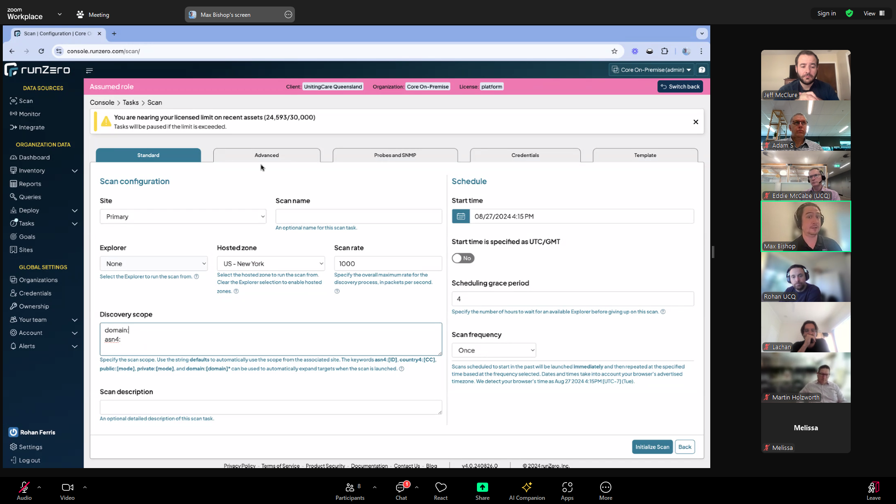
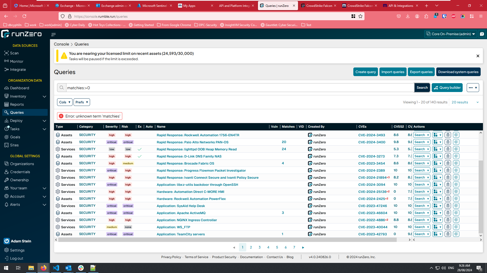
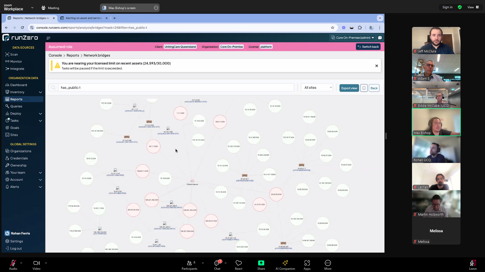

- setting the explorer to none allows you to scan from an external hosted zone
    - 
- query
    - `matchies:>0`







# curl commands
```sh
orgid = https://console.rumble.run/organizations/396db092-921e-4087-ab2c-8bf53a94ad35/details <- its actually in the url 
token = https://console.rumble.run/account

curl -X "GET" "https://console.runzero.com/api/v1.0/export/org/software.jsonl?_oid=<orgid>" -H "accept: application/json" -H "Authorization: Bearer <token> " -o software.jsonl

```