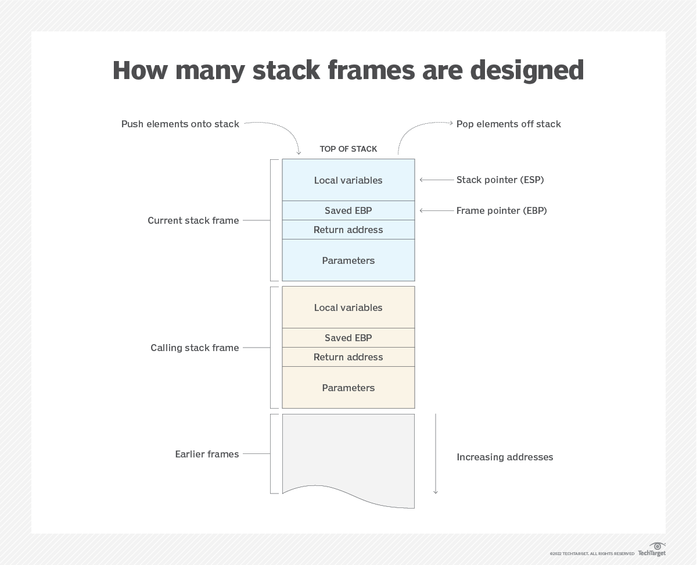
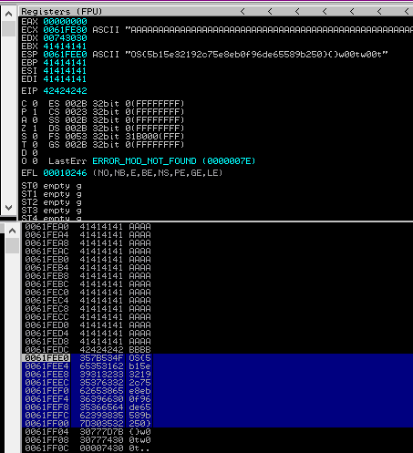

# offsec labs

backlinks: [[snippets-bash]]

sources:

---

## PEN-200: 10.2.5 Introduction to Buffer Overflows

Resources
Some of the exercises require you to start the target machine(s) below.

(To be performed on your own Kali and Windows lab client machines - Reporting is required for these exercises)

1. Repeat the steps shown in this section to see the 12 A's copied onto the stack.
2. Supply at least 80 A's and verify that EIP after the strcpy will contain the value 41414141.
(To be performed with the Topic Exercises VMs under “Resources”- Reporting is not required for these exercises)

3. To solve this challenge, you need to overflow the buffer of the bof-101 binary and cause a segmentation fault (you do not need to exploit this overflow). This binary is a slightly modified version of the "Sample Vulnerable Code" from section 10.2.1, and you can access the source code of this binary once connected via SSH into VM #1.
```
./bof-101 "AAAAAAAAAAAAAAAAAAAAAAAAAAAAAAAAAAAAAAAAAAAAAAAAAAAAAAAAAAAAAAAAAAAAAAAAAAAAAAAAAAAAAAAAAAAAAAAAAAAAAAAAAAAAAAAAAAAAAAAAAAAAAAAAAAAAAAAAAAAAAAAAAAAAAAAAAAAAAAAAAAAAAAAAAAAAAAAAAAAAAAAAAAAAAAAAAAAAAAAA"

┌──(stud./bof-101 "AAAAAAAAAAAAAAAAAAAAAAAAAAAAAAAAAAAAAAAAAAAAAAAAAAAAAAAAAAAAAAAAAAAAAAAAAAAAAAAAAAAAAAAAAAAAAAAAAAAAAAAAAAAAAAAAAAAAAAAAAAAAAAAAAAAAAAAAAAAAAAAAAAAAAAAAAAAAAAAAAAAAAAAAAAAAAAAAAAAAAAAAAAAAAAAAAAAAAAAA"AAAAAAAAAAAAAAAAAAAAAAAAAAAAAAAAAAAAAAAAAAAAAAAAAAAAAAAAAAAAAAAAAAAAAAAAAAAAAAAAAAAAAAAAAAAAAAAAAAAAAAAAAAAAAAAAAAAAAAAAAAAAAAAAAAAAAAAAAAAAAAAAAAAAAAAAA
Great job. Here is your flag: 
OS{607a52b286d3f1e587c83c9ed7f3f505}
Nothing to see here
*** stack smashing detected ***: terminated
Aborted (core dumped)


```

1. To solve this challenge, you need to find the flag inside navigating-code.exe available on VM #2. Once downloaded the Windows executable, to find the flag, use the skills learned in this module to debug the code on your Windows client machine.
```

┌──(student㉿ba0ce5042bc7)-[~]
└─$ cat navigating-code.exe 
MZ����@���      �!�L�!This program cannot be run in DOS mode.
$PEL���c��
          %t�
             ��@�B@ �<0��▒(��.text�rt``.dataX�z@�.rdata�
                                                        �
                                                         |@@/4��@@.bsst
���.idata<�@�.CRT4��@�.tl��@�.reloc0�@B/14P�@B/29�
                                                   �@B/41,002�@B/55Uvpx�@B/67��\@B/80p@B/91�� �x@B/102▒
�
 @BÍ�&��&���1�f�=@MZ�d�@�`�@�\�@�T�@u▒�<@��@PE��@t`��@�p�@��tB�$��g��g���@���g�l�@����=�@tN1���Í�&��$�dg��f��Q▒f��
                                                                                                                  t=f��
                                                                                                                       u����v����1������s����v�$`▒@��
                                                                                                                                                     1�����yt�N������1������<�����&�t&���,�X�@�D$
      �@�
         �@�P�@�D�@�D$
                      �D$ �@�$$�@��f��,�f��L$���1��q�U��WV�U�S��Q���x�5p�@������d�▒�5`�@�x1���t&�9��▒�$��փ�����=H�@��uޡL�@1ۃ���L�@���y��@�L�@����������@��t�D�D$�$�Ѓ�
                                                                                                                                                                     ��$�@�\�@�����@�$@��k�y�@@��e1ɋ��u�M��tD��t'������ ~��˃���"D��荴&�v��t�t&�P����t�� ~���@�p�@��t�
�@�▒�@������@�����e�Y[^_]�a�Ít&��E�������&�L�@���������$�d�L�@���O��t�L$�$�Od9}�uʋE�E���E�� �@����@�|�@��D� �@�D$�$�@�$�v�
����D�@�$�@��c�L�@��������H�@�������&�v�$�D�@���O�����&��c�▒�@�e�Y[^_]�a��f��D$▒�@�$
                                                                                    �@�L�@�jc�n����E�������$�5c��&���p�@�������p�@���������D$ �$�c����������Ð��U��WVS���$�@�8�@����ts���$�@�T�@�=@�@���(�@�D$�@�$�׃���D$)�@�$�ף�@���t�D$,�@�$�@���$�@�^����e�[^_]Í���@�����&��&�U����▒��@��t        �$�@�С(�@��t
                                                                                                                    �$�0�@���ÐU��S��$�E
                                                                                                                                       �E��]��$�<�@�Љ\��T$�$���E��E��]���U�������P���$D�@�������C�E
       ����D@�D$�D$�$�a�y▒�$t�@�k����$��@�_������f�f�f�f��@���t%��
                                                                  f���@�P�@�@��u���
                                                                                   Ít&�Í�&��&�S��▒���@���t)��t�t&�����@��u��$�@�������▒[Ív1����Ã�����@��u�뽍�&��&�D�@��tÍ��D�@널����%��@����������1�Ð���������������D$$��t��t����
                                     �t&��D$�T$(�D$ �T�$�8      ����
                                                                    ��&��VS���=▒�@�D$$t
�▒�@��t��tJ���[^�
                 �t&��0�@�0�@9�t���&�v���t�Ѓ�9�u����[^�
                                                       �t&�D$(�D$�D�D$ �$����[^�
                                                                                ��&1�Ð������������VS�ؠ@��T�D$`�Q���w����@�@▒�p�\$H�@�\$@��$�\$8�]e�D$H�t$
                                                                                                                                                         �\�D$��@�\$ �D$@�$�\$▒�D$8�\$��^��T1�[^Ð������Ð������������S��▒�$�\$$��d�DD$
                                         �D$�$
                                              �@��^�$��d�T$ �\�$�T$�$^��^��&WVS��0�5x�@���
�|�@1Ƀ�
       �9�w�x9�������9�u��$�:   �Dž����|�@����؉x��U
�|�@G
     �D▒
        �T$�D�T$�$�l�@��
                        �����D$(�P�����P����u�x�@��0[^_�f����@��L$ ET$|�@��S�\$
                                                                               �D�L$�$�h�@����u��4�@�$|�@�D$�������&�v1������|�@�D▒
�e�[^_]Ít&��t�@����������                                                                                                          �D��$H�@�D$�Y����\$�$(�@�I�����&f�U��WVS��<�=t�@��t
�x�@)čD$����|�@���@-��@��~����@��
                                 �����@���>�C���3�������
                                                        ����@�f����}��%���}�)lj�>������>��
                                                                                         ����@���
                                                                                                 �S��@��@��@�M����tV�� t�����L$�$آ@�(�����&��������@��
                                                                                                                                                      5�@�$��@��@�4����t&���@�UЉ�����f��H���
)lj�}��)����U�f��@����@�J����}��r���>�����������H�)lj�}���������� �������@����@�B����}ԍt&�s����@��@��������@����@r׋}ԡx�@�������h�@�u䍶�|�@�������t▒�t$
                                                                                                                                                    �T��T$�@�$�Ӄ���;=x�@|ɍe�[^_]û��@�!����D$��&������<Í�&��&�D$���@�zZ��S��▒�\$ ��=��tw[=�����s��?��w%�D$���Y����������
                                                                        ���@�����\$ ��▒[���t&=��uy�D$��eY��u��D$��LY�������f�=�u��D$�$
                                                                                                                                      �%Y�������y����$
                                                                                                                                                      �и�����F�t&=���Z����D$�$��X��tu���9����$�и������t&1���▒[���&�D$���X��������������и�������D$�$
                                                       �lX������D$�$�SX���됐�������������UWVS���$��@�,�@���@����t4�-d�@�=4�@�v��$�Ճ�����u
                                                                                                                                         ���C�4$�Ћ��u��$��@�P�@����[^_]Ív���@��uÍ�S��▒�D$
                                                                                                                                                                                         �$��W�Å�tB�D$ �$��@��D$$�C�,�@���@���@����$��@�P�@1�����▒[Ã������&�t&S��▒���@�\$ ��u��▒1�[Í�&��$��@�,�@���@����t'1��
                                                                                                                 �v����t▒�Ћ9ڋu���t+��$� W�$��@�P�@1�����▒[Í�&f����@�Ѝ�&�S��▒�D$$��tCw)��tM���@�������@��▒�[Ít&��u����@��t��5����ݍv�������▒�[Ð���@��uW���@��u����@��t�v�؋�$�cV��u����@���@�$��@�(�@���p����������뢍�&f��$��@�H�@���;���������������D$1�f�8MZu
                                                                                                                                                                @<�8PE��Ít&�1�f�x▒
                                                                                                                                                                                  ���f�VS�T$
�\$R<�B�r�D▒��tɐ�P
                  9�w9�w
                        ����(9�u�1�[^ÍvUWVS1ۃ��|$0�<$�;U�whf�=@MZu]�<@��@PE��@uEf��▒@
                                                                                     u:��@�h�\▒��t51��
<@��@PE��@t                                                                                           �����(9�t&��|$�$��T��uރ���[^_]Ít&��1ۉ�[^_]Ít&1�f�=@MZu▒�
           Í�&�vf��▒@
                     u�V��@S��@�\$
                                  �D▒��@��tɐ�P
                                              9�r9�r
                                                    ����(9�u�1�[^Ív1�f�=@MZu�<@��@PEt�f��▒@
                                                                                           u���@Í�&��1�S�Lf�=@MZu▒�<@��@PE��@t[Ít&f��▒@
                                                                                                                                       u���@��@�D▒��t1ҍt&��@' t��tȃ�����(9�u�1�[Í�&��1�f�=@MZu�<@��@PEt�f��▒@
                 �@D��&��&1�f�=@MZu�<@��@PE��@t
                                                ��Í�&f�f��▒@
                                                            u�V��@S�\$
                                                                      �q�D▒��@��t 1ɍt&�P
[��^_Í�&f��▒@                                                                           9�r9�r����(9�u�1�[^Ð�P$[^������Ív1�Wf�=@MZVS�\$u�<@��@PE��@t
             u苀�@��t��V�~�T▒��t�1���J
                                      9�r9�r����(9�u�1�[^��_�@���&f������H��u�P
                                                                               ��tԅ���H
                                                                                       [^_��@����������QP=�L$
                                                                                                              r���      -=w�)�� XY�f�f�VS��$�t$0�4$�OX�D$8�t$�D�D$�D$4�$`�D$
                                                                                                                                                                             ��4$����X��$��[^Ð����S��H�D$P�D$ �D$T�D$$�D$X�D$(�D$\�l$ �D$,���������t▒�����D$8�L$(1���L$(��u^�D$81ۉ�%��L$h��D$<�D$�D$d�\$�D$▒�D$`�T$�D$�D$8�D$
                                                                                                                                 �D$ �D�$ �@��)��H[Í���@t#�D$8�ÿ��똍t&�D$81�1���f����D$8f���f��>@���h����t&S�Ӊ���▒�R��@�C 9C$~��� u�S �
                                           �C ���C ��▒[Ít&��D$�
                                                               $�dP�C ���C ��▒[Í�&��&UWV��S�˃�L�D$▒�|$0�D$(�D�D$�<$��T�C
                                                                                                                        ��x9�O��9������������t$�v�D$▒�D$▒�L$(�L�@��<$�D$��T��~�,����t&�S ��C ���C 9�t7�S����@�C 9C$~��F��
                             �� tωL$�$��O�C ���C 9�uɃl$�{�����P����~���ڸ �������P�������L[^_]�)���Cu*������ڸ �l�����P����u���������������������몐W��V��S�˃��A
                                                                                                                                                             ��x9�O��9�������������C�|>���t&��C ��S ���S 9�tE�C����@�S 9S$~���
�������u�����&��V��S�Ã�����@D؋B   �� tЉ$�L$�lN�S �ȍ�&�C � �S ���S ��P����~3�C��@�S 9S$~݋�� tT$�$ �N�S ���������[^_Ð)���C��u1�B���v�ڸ �<�����P����u�������&�v���
                               ��x&�$�D$��L������[^�������&�v�$�▒M������[^�h�����&�U��W��VS���A
                                                                                               �����Y��t?�D$
�t$                                                                                                         -�L$
   �� 1�����    ؈����u��Q����)�������[^_]Ív��t�D$
�t$                                              +�L$
   뺍t&��@t�D$
�t$            �L$
   뢍t&�t$
          ����U��W��VS��\�Eċ�]▒�E؋E
                                   �U؉E܋E�M܉U��E��E�M��E���o�r�C
                                                                ��{���E�Iȃ������9ȉE�MȍA��������)��E��D$���EȋE��U�       ���EċuȈMЉ]▒�� �}����}��Eu��v�EЃ�!��H0��7
Eʀ�:�M�B����C���1��� E�E���     �uɉދ}��]▒;u����E���~��+U�)Ѕ����}�o����+Eȋ}�9����}�o������<�E���������U�9����EЋ{�H��M��t&��{ �9�C ���C 9�vB�{����@�C 9C$~��� ��
                                                                                                                                                              tʉL$�$�U���J�C �Uԃ��C 9�w��uЋM�~_�{���f��S � �C ���C �F���~?�{����@�C 9C$~ށ� �tʉD$�$ ��J�C ���C �F�����e�[^_]�f�f�{�E��n�Ⱥ��������E���щ�9���L��������)čD$���}�o�E��l��E��U�   �������uȋM�����+UȀ���C��)Ѕ��^����4$O��D$0����I;u��;����V�}��0��+Eȉ�9��3����v)ǃ}�o�}Љ���{�!��E���EЅ�~
                                                        �U����0�E��F0���F��}Ѕ������EЋ{�H�����ϸ ��������������;u������������{�U��E������M��������&��C
                                                                                                                                                    ��{���E�Iȃ�▒�����9ȉE�MȍA��������)��E��D$���Eȹ�������&���
                ����0��;u�������U�1��������������v�M������EЍH�������;u�w0���������&�E������EЍH��������9u�sЉMU�������vf�{���E��������&f����9щU�L����������)čD$���E��������&�E��F0���F��O�����%=�.����EЉ4$�D$0���EEЉD�E��HG�U�u�+UЃ}�o�U�������������������&f���%=t���������������9щU�L�<�����&�t&�U���WVS��L��]▒�E؋E
                                                                                                                       �s�E܋E�U܉E��E�UE��E؉EȋC
                                                                                                                                              ���E�Iȃ���t
                                                                                                                                                         f�{���9ȉE�MȍA����n���)č|$����}��ƀt�UEȅ��|������s�}uȉ�      ��[�Uԉ]▒�Ѓ��Uĉ������E▒�K�@tf�xt��+E�%����rf��ȉى��D$
�D$
   �4$�|$�M��kO�Mȃ�0��D$
�D$
   �4$�|$�7N�   9���s�Ɖ�9]��r����Mԋ]���f��E��߉ދ]▒����+}�)���~*����4$O��D$0�T�U��<E�Uȉ�Љ�9u����}Ѕ�����+E�)EЋEЋS���~*���t �EЃ���M��������-�t&�����-�N�}�9�vS������S ��C ���C 9�t6�S����@�C 9C$~���
    �� tЉL$�$��D�C ���C 9�uʋ���&�v�S � �S ����S �����~1�K��@�S 9S$~ދ�� tʉD$�$ �RD�S ���f��e�[^_]Í�&���t#�+�N�'����Ⱥ����������g���������@����� �������f������ډ��������H�����������&�ڸ ������P������S�������&�,��������t&�9}��5����E���u �EЋS���j�������<����K�������0������������%=�(�����A�����%����L�4$�D$0�UЉM���B�Mȉ��U������ȉ�������v�Eԋ}��Ɖ����a����Z����U��WVS�Ã�<�x����Pf�����C�eԃ����������)čE��E��t$�E��D�T$�4$�SG�����<����C ��S ���S 9�t7�C����@�S 9S$~��V��
                                                                               �� tω$�L$�;B�S ���S 9�uɋeԍe�[^_]Ív�ڸ.�l����e�[^_]Ít&�E��u��E���A�t$
                                                                                                                                                  �D��D$�Eމ$��C��~1�U�f�S�C�������&f��ڸ.�����e��y����t&�S��f�U��W��V��S���\$0����9��������������CtJf�{��F������������T$
                                                                           ��)ʃ|$
                                                                                 u���t&�������1����t&���)�C�����@�����~�S�������k�����t&���0��t�������������Ct�f�{t�iƫ���=UUUUwĉٺ���>���봍t&�C
  )�9������)�����������~�C�������&�v���(��������C���������������������&�ڸ �T�����P�������������ڸ-�3�����������C
                                                                                                               ���u���C
                                                                                                                       ��[^_]Ít&��������� ��&��0��t����������C
                                                                                                                                                              �P��S
                                                                                                                                                                   ��ڃ�[^_]Í�&�v���H���C
                                                                                                                                                                                        9������������.���������M����C�����ڸ-�s����▒������0���\����C
                                                       ���u��u�+���������������R����C
                                                                                     ��C
                                                                                        ��&f��ڸ0������u��+�����&�v�C��6������T������K���f�{�@����$����v�ڸ+������k�����&���f��ڸ0�������P������Z���f����"�����J�������������������������������ڸ �L���������������UW��VS�Y��gfff��L�D$,�؋t$`���\$0�D$4����������)ٻt▒�gfff�ȃ�����������)�u��F(���u
                                                                                                                                                  �F(�9ËL؉ȍS)�9Ѻ�����N�����D$,�4$������F(�F
                                                                                                                                                                                           �F�� �����E�V��������D$0�t$�$�D$4�D$�D$8�D�D$<�D$
                                                �������L[^_]ÐVS�Ã�D�@
                                                                     ��xr���l$P�D$�T$(�T$▒�T$,�T$�|$0�D$0�$�D$4�D$�D$8�D�D$<�D$
                                                                                                                               �������L$,�Ɓ����t,�$�D$(������4$�6��D[^��C
                                                                                                                                                                         ���f��D$(�������4$�
��D[^Ít&�VS�Ã�D�@
                 ��y
                    �C
                      ��l$P�D$�T$(�T$▒�T$,�T$�|$0�D$0�$�D$4�D$�D$8�D�D$<�D$
                                                                           ��A����L$,�Ɓ����tc�$�D$(�5������S � �S ����S �����~>�K��@�S 9S$~ދ�� tʉD$�$ ��;�S ���f��D$(���#����4$��D[^Ít&�WVS�Ã�@�@
     ������l$P�D$�T$(�T$▒�T$,�T$�|$0�D$0�$�D$4�D$�D$8�D�D$<�D$
                                                              ��R����|$,�Ɓ�������C���|S�S
                                                                                         9�L����)��S
                                                                                                    �$�D$(����������t&��ڸ �������P������4$�G��@[^_Å�u4�4$�4:���C
                                                                                                                                                                �D$(�����$�~����4$���@[^_�&�C
  �����C
        ��������&�C
                   ��������&�D$(��������4$����@[^_Ít&�4$��9)��C
                                                               �����������Љ�    �����&�UWVS�Á��$������f%Ef=�:���|$P�T$Xf���������f%Ef=�f����|$@�|$@�l$Df�T$0����        ����C
                                                                                                                                                                             �D$$�����C�D$,�D$x�D$(�S
         ���K�D$x.�D$y�0�p��D$4���W�S
                                     ��+D$(�|$0�ҍ
                                                 �T$,O��gfff�|$$���������ʼn�������������)����t$0��&��gfff�����ȍw��)���)�u����t$0�D$49��)��D$,�P��D$,����D$,��D$,@��ڸ0������C�ڃ� ��X��������~/�Ct)�����&�v�ڸ0�d�����P������|$(;t$(w'����&��Cf�D$hf����9����F�����.�>��,tщ��
����ڍ�&��K������t&�C
                    f�l$0�?�D$$��vC��   ��D$,ux�5����v�����y��+L$$�1���1������� E�EƉ���������������+L$$1��������� E�E������C�D$,�D$x�\$$�D$(�ƋD$,�� ��D$4�T$<�T$0�)�t&1�;t$(w
                                                                                                                                                                             �D$$�X
                                                                                                                                                                                   ���A0�����       ��������������  ��'�\$$�����K
                                     ��~���K
                                            ��t�����    v���7
D$4뱍v�Ĝ�ٺ
          �@1�[^_]�������ڸ0������C
                                  �P��S
                                       ����C�ڃ� ��P�w����D$$�K���D$h�T$l�щ$�D$l���\$�L$p�L$t�D$�L�L$
                                                                                                    ������Ĝ[^_]Ít&���   �����v���������y�f�T$0�C
                                                                                                                                                �D$$��������1�����&f�D$0�^����t&��������������t&;t$(w▒�\$<��u�L$$�I
��&�.�������L$0�J�f�L$:�L$0     ��=�L$:�t$0�ƍ�&�v�����ʉ����J��� �u���1��t$01��t����v�ٺ�D$h����������vf�T$0�\$$;t$(�������D$4��������D$0��D$$�D$,��3����ڸ-������;����t&����������t&�Ĝ�Љٺ�@[%�^_]������ڸ+������������&�ڸ ������������&�P���������f��ڸ �d�����P������C�D$,�~����v1�1��h�����&�D$(�D$������������+�������f�D$0������&�UWV1�S�����$���$���31ɋ�D$l�����D$p�����D$8��$��D$t�����D$d��$�f�L$x%`�D$|�D$,�D$h��$�f��$���$��DŽ$�DŽ$����������k���Z��&�\$h��@u��$�9�$�~�T$d�� ����$��
                                                                                               ��$�����$��M����������%u��D$,�D$p�����D$l�����D$h�E��tp�\$l�D$(��1ɉ\$0�l$4�P��^����Zwb���$�$�@��&��T$�$�<2��$��o����D$(�F��ލt&���u��t&��$��Ĝ[^_]Í���0<       ������������D$0���[�T$0����A�T$0���DEЉ�F��됃|$(�����|$(�G�:�|$(����|$(u�T$P���D$T�D$d��u�D$�D$P�$�D$T�D$�D$X�D�D$\�D$
                                                                                                                                                                                     ���ȉ��w����s����L$h��|$(���|$(��Ot�|$(�s�|$(u����D$P�ωT$T��������D$X�D$d�D$�D$P�T$\�$�D$T�L�D$�D$\�D$
                                                                                              �������������T$(��w�����5�T$d���������������D$(�D$p�����w�����|��L$d����D$P�D$P�f���������D$h�� �D$h���/�w
            �D$d���<$�Y����e��������F�L$h��������F<6��<3��D$(�޹������F�L$h�޹������F<h���D$(�޹������F�D$(�޹�t����F<l���D$(�޹�T����D$8�$�/�T$d�����������D$h�� �D$h����/�w
                                                                                                                                                                        �D$d���<$������l����D$h�� �D$h����/�w
                 �D$d���<$������?�������|$(��$����|$(�w�|$(��|$(��      ����։����p������t&��D$h�� �D$h����/�w
                                                                                                             �D$d���<$������������u�D$,9D$h����D$T�w���D$\���D$P�D$d�D$�D$P�D$X�$�D$T�D�D$�D$\�D$
     �x�[����W����T$d�%���V����B����D$p�����w��L$d�����f�D$P�D$P����������D$h��+������D$d���<$�����������D$h��]������D$d���<$�=���������D$h��d������D$d���<$������������*�F�L$h���'����D$h���������D$d���<$�V����b��������F�������������F�L$h@���������ut�F�L$��������T$0��t�����������W�|$0����l�F�D$0�׉��}�����u!�F�L$h���f����������F���M����w�?��@��D��D$p�����D$�<$��+�L$d������������q�����w�0���D��7����T$d�%�l$4�T����@����F�D$0�޹������~2u��F�D$(�����������D$�D$h�C��������������D$T�ljT$P�%�����ϙ�D$P�T$T�������0�*�����L$p�F�D$p�މL$0��:����~4�:����F�D$(���������W��D$P�T$T�/�����W��D$P�T$T���������E����F�D$(���������F�D$(���������<$�Z*�����L$<�l$P�L$h�D$P��*�l$
�T$Nf��$��D$|�F���E���f���������?�D$T�|$P���������u!�F�\$l�׉ށL$h�D$0�����D$p�����b�������S1ۃ�▒�L$ ��~��t&����P9�|��$���▒��▒��[Í�&�vWVS���L$(�t$ �\$$��~Y�1�f�����P9���<$�L�V�8��x�H����t��&��
������u���t�����[^_�f�1�븍�&�t&��D$��H������H��D$��UWVS��\�D$t�|$p�X1��\$D9_���D$t1ҍx�C��\$p�D$8���s�
                                                                                                     �|$H��L$,�▒�D$L��t$@�H�D$▒�����D$<��9����D$0�����D$4�D$▒�D$��&�����t$0�|$4�c��D$$Ƌ�1t$ �t$ �T$41�t$▒�|$0�|$$|$)��D$������A��T$▒9\$,s��\$L���uN�C�9D$@s:�|$D��+D$p�����W��
                                                                                  �)�)ȋL$8�     f���9�t�<���t��L$8�D$p�|$8�x�D$t�D$�D$p�$�?"�����E1�1��t$@�D$<�|$▒�l$�l$H�t&���1�1ۋM�L$▒\$)��D$ڃ����F��T$▒9l$,sL$@�\$8���2��uB�B�9�s0+T$p�C�����)Љ����&�v��9��\����t��T$8�D$p�|$8�x�D$<��\[^_]Ð�����UWVS�����$���$���$���$��D$(��$��t$▒��$��D$$��$��t$4��$��D$H�t$�0�L$ �����|$0��ω�������������L$,u"���J��1ۃ�vX�Ĭ��[^_]Ív1ۃ�u��D$�����D$ DŽ$���$�DŽ$���@�Ĭ[^_]�W�����&�?1Ҹ �� ~  ���9���$�_�������▒�\$8�ŋD$$�U�
                                                                                                                      ▒��&��▒�����Z�9�s��D$$�\$8������9��B����  ��������T���t��T��E����)ЉÉ,$��@��ټ$���$����5����~�T$@�D$@��D$�<"�L$`�\$8�T$<�D$8ىD$8��%���L$P��
              f��$�٬$��T$L٬$������*�؉���ЋT$L�D$<��)ȍH��L$X������ �@�T$@�D$8�����������D$t�T$L�����,$���D$��D$ �D�D$�$��@�B����Ĭ�É�[^_]Ív�D$�����D$ DŽ$��$�DŽ$���@�Ĭ[^_]��������E�+����t&�D$�,$���D$(�$��D$`+�$�������&f��D$t�T$X�D$d�����D$L�����D$L)D$d�D$L�D$l�ډT$p�D$▒��   �������D$P�=������D$x�D$▒����
                                                                                                             ����       �����D$h�L$4���O���$��D$|�D$@�D$4�$������|$@�D$\�D$0�@
                                                                                                                                                                              �D$P��"D$x�l$P�D$xt(�T$P���I�D$P�����)ЉD$P�|$x���D$P
                                      D$l���D$t�D$8DŽ$���t
�����������ܤ@�\$P�D$P�T$T�D$P��-@�D$T�D$@���(DŽ$��t$@�D$h�D$P��▒�@���|
                                                                     ��ټ$��L$\��$���
                                                                                    f��$��A٬$��T$P٬$����=��@�T$P��0����D$P����va���;�t&���$��Q��$�9����Ԥ@��������٬$��T$P٬$��D$P�T$P��0���ɈP�Ȥ@٬$��\$4٬$��D$4���$��$��J����D$\�D$0�@�����t$4��&�A���9��9����P������t&�T$X�D$t�D$d���,�L$L�D$pL$X�L$l�_����v�D$▒�|$4�D$4�
�D$0�t$l9p�     �D$4�D$|�����D$@������&f��D$0�T$`)ߍO�@)���$�9����t$▒�V�������L$`)������t$@��$�������9����D$dL$X�|$p�D$`ȉD$d�$�r�D$h�ƋL$`��~&�T$X��~9щ�N�)D$d)�)�$��L$`�T$X�D$p��tF�D$h������~*�4$�|$�v�l$�$�����,$�D$8���l$8�D$p)����$�����|$L�Ã|$▒�D$8����!Å��.1����

                                                                         �D$L����-+\$X�T$d����ډ�$���~�,$�T$���ŋ�$�D$X��~�D$�D$8�$���D$8�D$t�|$▒�����D$@���������D$@���l�D$8�D�D$�$�%�,$�D$�D$8�u▒���8�D$l�\$\���D$4�D$\�1�D$, �D$8�$�r���4$�f�,$�^�t$�D$\�|$4��>�t$ ��t��D$H�t$,    0�Ĭ��[^_]Ít&��D$X)T$d�
                                                                                                              ����D$L��z
                                                                                                                        ����������
                                                                                                                                  ���؍�&��l$L����������D$x�D$▒�����D$4�D$x�D$h�D$|�����D$@�����j��������ܤ@�\$P�D$P�T$T�D$P��-@�D$T�%��@�D$P�����*
�����������
��@�D$8������s}���D$8�\$\�D$4�F����t&��������D$h�D$4D$l�D$|���D$@������$��2�����&��D$h��������D$d�|$p1��D$`�Y������D$81��D$4�\$\�D$,�؉D$4�������&�v�|$�
                                                                                                                                                       $���D$8���U1��\$8�C�\��������f��D$l���D$4�D$h���!\$`��~�4$�\$�u�Ɖ����DŽ$��D$\�D$0����$�������
�|$$����|$0����~                                       |$▒u
                �|$P��D$(�G��D$@9�$���,$�D�D$
���D�D$
�ʼn4$9��D���$�D���D$
����$��|$0�D$8�,$�D$�'����t$�,$�H0�L$(�D$L���\$�NjD$8�$���@
�D$▒                                                       �������T$�,$�T$`���T$`�D$X�$��
    D$X�
T$$�
�ʉL$X��
       T$P������T$0�|$(9���z�����       �D$L��1�D$(� �L$(�T$0�D$,�
���R�L$▒����▒�$�(
�Ɖ������f��D$h�����D$0�@��9D$(������D$d��D$X�G����v�|$▒�Y����D$@�t$p��9���)Ɖ��D$@���k�t$dD$X��$���t$`�D$d�.����t&�D$8�,$�T$(�D$��T$(���F����,$�D$l�D�D$
���D$0��
        �T$(�L$h�ŋD$|����!��u�����D$l�D$4�D$|�D$@���|$\�\$@�t$▒DŽ$��t$8�%�v�,$�D�D$
�
 ��$��ʼnt$���,$�������0�G�9�$�|��D$(�t$▒1ɋ\$P�����U�G�������U��t<�\$\�9����B��׍W�<9t����D$, ��������&f��G��׍W�<0t�������D$p�,$�D$�����K�����&�D$h�L���DŽ$���X����D$l�D$@������ �@ټ$��D$8�L$lDŽ$��t$\��$������L$4����
Ԥ@������$�����٬$��\$▒٬$��D$▒�t$▒�V0�ʈP�����������z�u����؋\$\�D$\�h����\$\�|$\�[�����1�+T$p�D$pT$L�&����D$\�D$4�D$, �1�[����,$�D$�L$▒��ŋD$8�,$�D$�=�L$▒���G�����u
                                                                                                                                                                �D$(�
����U����D$,�-����t$P���x�������\$\�D$\������D$,�����ټ$���1ɉ�$��D$\��$�����$��l$xDŽ$���
Ԥ@�$�٬$��T$P٬$��T$P���D$P��������0�P���$�9�u�����$���$����������@���������������������������\$\��z��
                                                                                                   �����i����؋�$��D$,�N���@��z�0t��T$\�L$4������|$0�L$P�W���Q�}���|$P�������g�D$(�F��$�D�D$
�,$9��DD��D$
�D$▒���ŋD$8�,$�D$������L$▒�t$0����0�D$(�ˋD$8�\$�$�������D$(���σ�9�
ؤ@�ܤ@�\$P�D$P�T$T�D$P��-@�D$T�����F�$���H                         ���D$, ���މD$(�\$0�D$(������DŽ$��D$d+D$@�D$`������D$@���E����t$|��������
                                         �ËF�
                                             $��F
                                                 �T�D$���$�D$��
                                                               �������D$0�@��;D$(���������������D$4�\$\1��D$8������|$(9���D$(�T$0���D$, �ރ����������������L$\����D$, �q����D$0)��D$4�O)��D$@�����@��$��D$|����9��#����Y����D$4�1�L$\�0뤅�~D�,$�D$�
                                                      �ŋD$8�,$�D$�4
                                                                   �����|$(9t.�D$L�D$P ��1�D$(�}�:���D$,������D$0���ދ\$\�9�9������D$0�D$l�D$|�D$@�����\$\�|$\�~����؋�$����\$\�D$\�����t$4���u�����������D$,�M������P��������؋\$\z
 �D$▒�����D$,�y����4$�D�D$
�T$(���T$(�Ƅ��H����D$l�D$4�D$|�D$@�H����]���DT$,�T$,�����P��\$\��������M���>����������������������ދ]��tM�D$,��������؋\$\���G���u
                                                                                                                                �D$(�n����D$P �{�����$��D$,�N������D$P�D$,�z����}~
��;����}�E��*����D$X��������������������UWVS���|$,�t$(���^���D�\$9�~}�n�\��t������ ���V)��D$
                                                                                            ���9����$���l$�l$
                                                                                                             �▒����������       ؉F��B���9$w��l$�T$+T�T�����tN���I��&��D$(�@�D$(�@��[^_]�f���9�vڍ�&�v�9�w��D$+D�T��Ћ|$()����G9�t���[^_]Ít&��|$(�G��t���널S�T�B�R��1�9�r�$��&�v���� 9�v��t�9�v���ʉ�[Ð�V��S���@��tz��t3��u!�`�@�$��@����t���tP��[^Í�&��@��uY�H�@�$ �@�Ӄ��$8�@�Ӄ��$@j@�����@�v�� �@�$�,�@����[^Í�&f����@���W����n�����&��@믍t&��@��Í�&S��▒�(�@�$ �@�Ӄ��$8�@�Ӄ���▒[ÐW1�VS�� �\$0�������      ~J����������$��
                                                                                                                               ��t��@�X�t9�@�@
                                                                                                                                              �� [^_Í�&����@��t5���@����@uljD$�$ �@�P�@���D$뭍�&f��١8�@����
8�@�R�����&��S��▒�\$ ��t7�{�� �C~��▒[�5�
��▒[Í�&��$ �@�P�@���፴&��&U1�WVS��,�\$@�t$H�C�����D$�D$D�D$���D$�t&�l$�D$�l��d�����D�1�����9L$؉���       �t�D$9~�D$�t����C��,��[^_]Ít&��C���$�
����Ņ�tݍH
         �C�
            $��C
                �T�D$�
                      �$����������D$�t����C롍�&�1���,��������@��t-���@���@t^�T$0�@
                                                                                  �@�P��,Ív�8�@����@������ vE�$ ��
��t΃�@�@�u��D$�$ �@�P�@���D$눍t&�P �8�@���t&�UWVS��L�|$`�\$d�w�k9�|
                                                                   �����Ɖ؉��ǍD59�D$,����C�$������D$0�����M�D$,���L$4��9�s)+D$0�D$�������D�D$4�$��       �C�D$8���D$ �G�<��D$▒�|$(9����|$ ���)�����9ߍ�CЋD$4�T$<�D$$�f��D$$�|$▒9|$(vv�D$▒�D$▒�h���t��\$8�L$$�l$1�1��\$�v�D$�D$�M�ËD$�c�1�����\$���1��։E�9\$ wD$$�L$<�D$$�|$▒9|$(w��t$,��~$�T$4�D$,���&f����L����t��D$,�D$0�|$,�x�D$0��L[^_]Í�&�UWVS��,�\$D�|$@�������tb�5��@���2�P�@���D$��u���t?�>��tF����t��t$�,$������Dž��������}       ~K�,$�����u���,��[^_]Ív�������>��tp��@u��$8�@�D$���Ѓ�돍v1��y����E��@����@�,���@�U���V����$ �@�P�@���A�������9�����&f��t$�4$�4�����Dž�t1��q��������@�<$�D�D$�u����Dž��������,1�[��^_]ø������5��@��t"��@������$8�@�P�@��������$������ƅ�t@q�@���@������@1��������&�t&UWVS��<�D$P�l$T�NjP���@���t&���9���$�?����D$�����x��~���<$�t��D$�+�D$P���p�@������� �\$,��)ȉL$▒�D$$1��|$(�|$$�t&��L$▒��������    ؉E��F���9�w��ыt$P+L$P���|$(�\$,����9��
                                                                                                                                              ��Bʅ�D\$ ��\$ �D$�|$ �x�D$P�$�X����D$��<[^_]Ít&�9�vԥ9�w���&�t&�VS�L$
��&f�9�s�����290t�ۃ���[^Í�UWVS��L�t$`�D$d�^�@)����|$d���N��T�
                                                             �t&9��������:98t����F�$������D$,�Dž��N�X
                                                                                                    �F�^1��\$8�D$4���D$0�D$d�\$▒�h�@�D��D$(�G1��D$<�D$$��&��D$▒�D$▒��1ҋM��@�)��1�)�ډ��D$$�D$$��1��։H���9l$(wŋl$(�D$d�H��+D$d���Ã����9ͽBŋl$<���9L$(�BL$8�L$$9L$0vP�l$(���l$0��&�v���1�)���D$▒��1��T$���֋T$▒�S�9�w؋D$0�l$(��+D$$������u�|$4��)Љ�����
                                                                                                                                                      ���t��T$4�D$,�|$4�x�D$,��L[^_]Ív���������t$d�D$d�k�����&f��$������D$,��t��D$,�@�@�D$,��L[^_]Í�&��&UW� VS��
                                                                    �D$ �L$$�p�@���S��k���)lj9��
~N��
    9�s'�{����|���?�T$�<$�$��
                             [^_]Ít&1���tމ��$1������?�T$�ϐ�
                                                           ���$)������?�|$1�9�s�{����H��        ��$�$��
                                                                                                       [^_]Ít&� )��������$�����ы$�$     ʉ��C����?���T$9��Q����C�����    ��C����t&�UWVS��,�D$@�$�\$▒�������t}�D$�t$▒���������ف�%�Eم�th1����������t� ��)����� ������Z▒�����r�Z��uO�D$H��2�8�D�����)ËD$L�▒��,��[^_]Í�&�1��B������y �Z���t��t$H��8������5)��|$L���,��[^_]Í�&��&�L�D$�Q� ��t�t&�
������u�Ð�������S�\1ҋL$
                       ��u��t&�����)�9�s�8u���[����T�L$1���u   ���9�t  f�<Au����������������%
                                                                                               �@����@���%�@���%�@���%��@���%��@���%��@���%��@���%��@���%��@���%��@���%��@���%��@���%��@���%��@���%��@���%��@���%��@���%��@���%��@���%��@���%��@���%��@���%��@���%��@���%��@���%��@���%��@���%x�@��f�f�f�f�VS��4�\$D�t$L���K�L$H���G����T$,�����|$Tvy�����D$�D$P�$�L�@���tY�|$H��D$@�D$�D$
  �D$�\�D$P�D�$�X�@��▒������4�[^Í�&�D$P��u`��L$@f���4�[^Ív�D$@1�f�1���4[^Í�&�D$-�D$@�D$�D$�D$,�D$
                                                                                                 �D�m�����&�D$@�D$�D$
                                                                                                                     �D$�D$P�\�D�$�X�@��▒��t▒�널��41�[^ø�����q����9����*������\�����������M�����&�vW1�VS��0�\$@�t$Lf�D$.�D$.��D����������h�@�|$�D$�D$HD��$�D�D$D�t$
                                                                       �D$�����0[^_ÐU�d�@WVS��L�t$l�\$d�l$`��ED$l�D$l�x�D$(�������Ƌ���������L$h1���tk�\$d�����l$d�t$,�t$h��v�Mǃ���M9�vA�D$,�L$�$�D$�D$(�D$�D$l�D$
                     ��)��D�S������9|$hv
                                        ��u�E��L��[^_]Ít&1�1\$d�l$>��f�T$>���|$d�       �t&�Ƌ�T$(��\$�\�T$�T$l�D$�T$
                                                                                                                    �,$��������L��[��^_]Í���L1�[��^_]Ít&V1�S��4�\$Hf�D$.�k���D�ۺ`�@�t$�D$�D$DDډD�D$@�\$
           �D$�D$.�$�r�����4[^Ð�������������L�D$T�T$Xf�D$,��uf=�wn�L$P����LÍ�&�D$<�D$<�D$�D$\�D$▒�D$�D$P�D$
                                                                                                           �D$�D$,�D�D$�$�p�@�� ���T$<��t�������*�������LÍt&WVS�� �\$0�t$4�D$���D��a���:�|$
                                                                                                                                                                                           �t$�$�D�&����� [^_Í�&��&�UWVS1ۃ�<�t$P���D$��NjD$T�(��t\��te�D$X�����؉��������&�ǀ~�����9|$Xvq�D$�l$
                                                                                                �D��4$�D$�������ʻ������<��[^_]Ív���t$+������t&À|*t_���D$�l$
                                                                                                                                                           �D��4$�D$�I������뱍v���D$T�(��<��[^_]Ít&�D$T�������<��[^_]Í�&��<����[^_]Ð�����������D$����@Ð��l�@Í�&�v�D$�l�@Ð����S��▒�$�\$ �����9�r�$�����9�v▒�� �$�,�@����▒[Ít&�$�������)������$���K
                                                                                                                                                     ���▒[Ít&S��▒�$�\$ �L���9�r�$�<���9�v▒�� �$�P�@����▒[Ít&�c
���$���Ѓ��VS���$`�@�<�@����t/�$�5@�@���D$v�@�փ��t+�T�@��[^����&�0@�T�@��[^����&�D$��@�$�p�@���tϸ @���%T�@�����������%��@���%��@���%��@���%��@���%��@��f�f�f�f�UWVS���T$<�l$0�t$4�\$8��u9�vQ1�����������[^_]Í�&9�v1�1�����[^_]Í�����uH9�r1�9�w޸�׍�&�م�u
                                                          �1�����1����Ɖ���������[^_]Í�&��� )����T�������L$      щ��L�����������\$
                                                                                                                                 ��������       މ��t�։��d$
                                                                                                                                                          9�r����9�s9�t ��1��@����C�1��6���������UWVS���D$<�t$0�\$4�|$8��u9�va��������1�[^_]Í�&��9�v���ڃ�[^_]Í�����uP9�����9����Љʃ�[^_]Í�&�v����u
                                                                                                     �1����ʼn�1���������1�눍�&��� )����D�щ����L�T$�T$    ��؉L�����������|$
                                                                                                                                                                         ���ljщ��������� ���щ��d$
    �Ɖ�9�ru9�s
              +D$
                 �׉Ɖ��L$)������������   �[^_]Í�&�v�ى�)����������[��������������������@����
��@�������������@ÿ���?��@~@~@ ~@�~@0~@@p@libgcc_s_dw2-1.dll__register_frame_info__deregister_frame_infoError - You must supply at least one argument
Great job. Here is your flag: 
OS{8d387db22e5cb838ece12836de8f1477}
�@�@�@h�@ �@Unknown error_matherr(): %s in %s(%g, %g)  (retval=%g)
Argument domain error (DOMAIN)Argument singularity (SIGN)Overflow range error (OVERFLOW)The result is too small to be represented (UNDERFLOW)Total loss of significance (TLOSS)Partial loss of significance (PLOSS)�@3�@P�@p�@��@@Mingw-w64 runtime failure:
Address %p has no image-section  VirtualQuery failed for %d bytes a


OS{8d387db22e5cb838ece12836de8f1477}


```

5. On VM #3 you will find the get-flag binary located in the challenge folder which is going ask you four questions about CPU Registers. The flag to this challenge is will be returned if all the four questions are correctly answered with the 3-digit letters (AAA, BBB, CCC, etc.) corresponding to the 32-bit registers. These answers must all be capitalized.
```

└─$ ./get-flag                                                                                                                                                                              
Which register allows a function to keep track of required arguments, local variables, and the return address?
EBP
Which register is a general purpose register that is often used to store the results of logical instructions?
EAX
Which register controls the execution flow of the program by storing the address of the next instruction to be executed?
EIP
Which register stores the lowest memory address (top) of the stack and is dynamic based on how much memory a function needs to store data, arguments, and pointers?
ESP
Correct! The flag is: OS{1538b7596ae08f3cf4ae6c9fb02afad3}



```

1. Log in to the target machine #4 using RDP with the provided credentials. On this user's desktop, you will find a binary named overflowing-eip.exe. If we were to execute this binary, it would simply crash. Why it crashes is rather interesting. The program allocates a 64-byte buffer in memory for storage of a string. Then, it uses an insecure built-in C function to copy a specific string to that memory location, while failing to check the length of the string. The length of this string exceeds the pre-allocated 64 bytes, and this results in a classic example of a buffer overflow. For this exercise, you'll need to open the binary in the Immunity Debugger, which is already installed on the target machine. Once the program opens and pauses, resume its execution and observe the crash. Next, take a look at the state of the registers at the point of the crash. The EIP register would be overwritten by four 'B' characters (0x42424242 in hex). At the point of the crash, the flag you need to collect is located on the stack in memory, and the ESP register points to that memory location. To retrieve the flag, right-click on the address stored in the ESP register and select 'Follow in Dump'. The flag is comprised of the first twenty (20) bytes on the stack at that memory location.
```

0061FEE0   357B534F  OS{5
0061FEE4   65353162  b15e
0061FEE8   39313233  3219
0061FEEC   35376332  2c75
0061FEF0   62653865  e8eb
0061FEF4   36396630  0f96
0061FEF8   35366564  de65
0061FEFC   62393835  589b
0061FF00   7D303532  250}

OS{5b15e32192c75e8eb0f96de65589b250}




```

1. This challenge will assess your understanding of the stack in program memory. Log in to the target machine VM #5 via RDP with the provided credentials. On this user's desktop, you will find a binary named example.exe and two text files with C source code snippets: example.c.txt and push_and_pop.c.txt. To solve this challenge, first study the example code and then observe its execution by running the example.exe program from a Command Prompt window. With a good understanding of how the stack works in memory, turn your attention to the push_and_pop.c.txt file. The flag is the value that would be printed when this program is executed. You can assume that stack, push and pop are appropriately defined functions and work as expected. NOTE: the flag's hexadecimal values present in the push_and_pop.c.txt file do not require any further conversion prior to submission.
```Answer```
