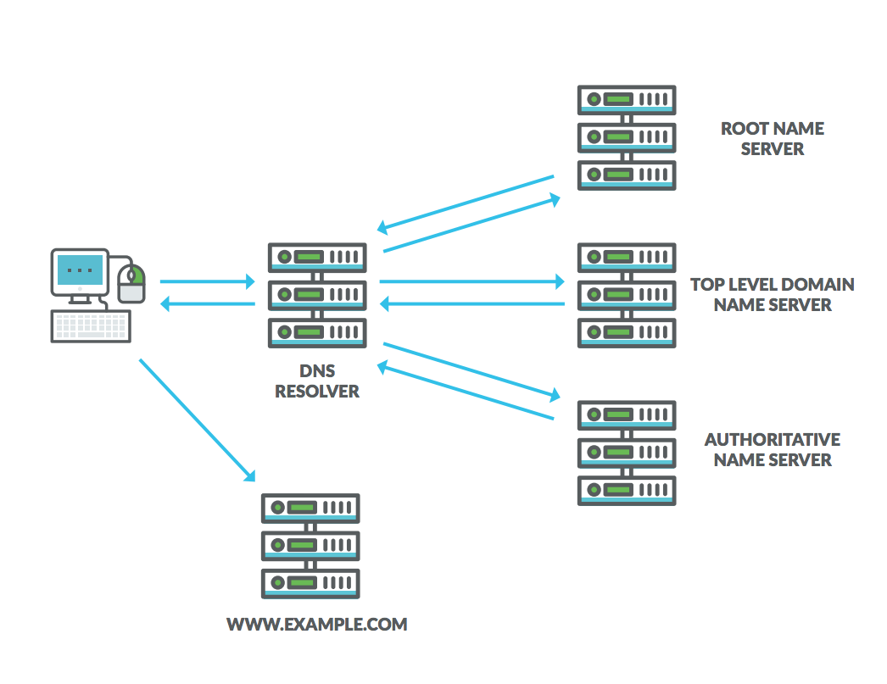

# tools-dns

backlinks: [[]]

sources:

---

## DNS Enumeration

The Domain Name System (DNS)1 is one of the most critical systems on the Internet and is a distributed database responsible for translating user-friendly domain names into IP addresses.

This is facilitated by a hierarchical structure that is divided into several zones, starting with the top-level root zone. Let's take a closer look at the process and servers involved in resolving a hostname like www.megacorpone.com.

The process starts when a hostname is entered into a browser or other application. The browser passes the hostname to the operating system's DNS client and the operating system then forwards the request to the external DNS server it is configured to use. This first server in the chain is known as the DNS recursor and is responsible for interacting with the DNS infrastructure and returning the results to the DNS client. The DNS recursor contacts one of the servers in the DNS root zone. The root server then responds with the address of the server responsible for the zone containing the Top Level Domain (TLD),2 in this case, the .com TLD.

Once the DNS recursor receives the address of the TLD DNS server, it queries it for the address of the authoritative nameserver for the megacorpone.com domain. The authoritative nameserver is the final step in the DNS lookup process and contains the DNS records in a local database known as the zone file. It typically hosts two zones for each domain, the forward lookup zone that is used to find the IP address of a specific hostname and the reverse lookup zone (if configured by the administrator), which is used to find the hostname of a specific IP address. Once the DNS recursor provides the DNS client with the IP address for www.megacorpone.com, the browser can contact the correct web server at its IP address and load the webpage.

To improve the performance and reliability of DNS, DNS caching is used to store local copies of DNS records at various stages of the lookup process. It is for this reason that some modern applications, such as web browsers, keep a separate DNS cache. In addition, the local DNS client of the operating system also maintains its own DNS cache along with each of the DNS servers in the lookup process. Domain owners can also control how long a server or client caches a DNS record via the Time To Live (TTL) field of a DNS record.



## Interacting with a DNS Server

Each domain can use different types of DNS records. Some of the most common types of DNS records include:

- NS - Nameserver records contain the name of the authoritative servers hosting the DNS records for a domain.
- A - Also known as a host record, the "a record" contains the IP address of a hostname (such as www.megacorpone.com).
- MX - Mail Exchange records contain the names of the servers responsible for handling email for the domain. A domain can contain multiple MX records.
- PTR - Pointer Records are used in reverse lookup zones and are used to find the records associated with an IP address.
- CNAME - Canonical Name Records are used to create aliases for other host records.
- TXT - Text records can contain any arbitrary data and can be used for various purposes, such as domain ownership verification.

Due to the wealth of information contained within DNS, it is often a lucrative target for active information gathering.

## DNS Zone Transfers

A zone transfer is basically a database replication between related DNS servers in which the zone file is copied from a master DNS server to a slave server. The zone file contains a list of all the DNS names configured for that zone. Zone transfers should only be allowed to authorized slave DNS servers but many administrators misconfigure their DNS servers, and in these cases, anyone asking for a copy of the DNS server zone will usually receive one.

This is equivalent to handing a hacker the corporate network layout on a silver platter. All the names, addresses, and functionality of the servers can be exposed to prying eyes.

We have seen organizations whose DNS servers were misconfigured so badly that they did not separate their internal DNS namespace and external DNS namespace into separate, unrelated zones. This allowed us to retrieve a complete map of the internal and external network structure. It is not uncommon for DNS servers to be misconfigured in this way.1

A successful zone transfer does not directly result in a network breach, although it does facilitate the process.

A failed attempt would look like this

```shell
kali@kali:~$ host -l megacorpone.com ns1.megacorpone.com
Using domain server:
Name: ns1.megacorpone.com
Address: 38.100.193.70#53
Aliases: 

Host megacorpone.com not found: 5(REFUSED)
; Transfer failed.

```

A succesful attempt would look like this

```shell
kali@kali:~$ host -l megacorpone.com ns2.megacorpone.com
Using domain server:
Name: ns2.megacorpone.com
Address: 38.100.193.80#53
Aliases:

megacorpone.com name server ns1.megacorpone.com.
megacorpone.com name server ns2.megacorpone.com.
megacorpone.com name server ns3.megacorpone.com.
admin.megacorpone.com has address 38.100.193.83
beta.megacorpone.com has address 38.100.193.88
fs1.megacorpone.com has address 38.100.193.82
intranet.megacorpone.com has address 38.100.193.87
mail.megacorpone.com has address 38.100.193.84
mail2.megacorpone.com has address 38.100.193.73
ns1.megacorpone.com has address 38.100.193.70
...


```

This server allows zone transfers and provides a full dump of the zone file for the megacorpone.com domain, delivering a convenient list of IP addresses and corresponding DNS hostnames!

The megacorpone.com domain has very few DNS servers to check. However, some larger organizations might host many DNS servers, or we might want to attempt zone transfer requests against all the DNS servers in a given domain. Bash scripting can help with this task.

To attempt a zone transfer with the host command, we need two parameters: a nameserver address and a domain name. We can get the nameservers for a given domain with the following command.

```shell

kali@kali:~$ host -t ns megacorpone.com | cut -d " " -f 4
ns1.megacorpone.com.
ns2.megacorpone.com.
ns3.megacorpone.com.

```


```

dns borked?
sudo nano -ilm /etc/resolv.conf
nameserver 8.8.8.8
```