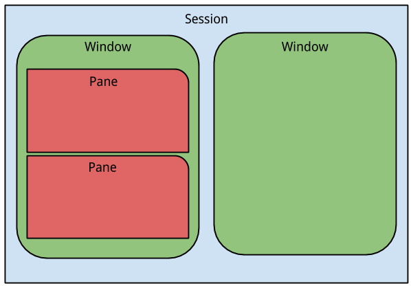

# tools-tmux

backlinks: [[]]

sources:
 
- https://github.com/tmux/tmux/wiki
- https://www.redhat.com/sysadmin/introduction-tmux-linux
- https://www.kali.org/tools/tmux/

---

tmux enables a number of terminals (or windows) to be accessed and controlled from a single terminal like screen. tmux runs as a server-client system. A server is created automatically when necessary and holds a number of sessions, each of which may have a number of windows linked to it. Any number of clients may connect to a session, or the server may be controlled by issuing commands with tmux. Communication takes place through a socket, by default placed in /tmp. Moreover tmux provides a consistent and well-documented command interface, with the same syntax whether used interactively, as a key binding, or from the shell. It offers a choice of vim or Emacs key layouts.




## install
```shell
apt install tmux
```

to start a new session
```shell
#start a new session
tmux new -s mynewsession

#detach from session
tmux detatch

#list all sessions
tmux list-sessions

#attach to session by name or index
tmux attach -t mynewssion 
tmux attach -t 0


```


## usage


<p>I think this deserves a clear <strong>visible</strong> answer which is hidden in form of a <a href="https://superuser.com/questions/266725/tmux-ctrl-b-not-working#comment277752_267317">comment</a> under the first answer.</p>

<p>Assuming the default tmux configuration is being used, novice tmux users please follow the instructions below to split the pane </p>


<p><strong>To split the pane horizontally</strong></p>

<ol>
<li>Press <kbd>Ctrl</kbd>+<kbd>B</kbd></li>
<li>Release pressed keys in Step 1</li>
<li>Press <kbd>"</kbd>&nbsp;
(on many keyboards, this is <kbd>Shift</kbd>+<kbd>'</kbd>)</li>
</ol>

<p><strong>To split the pane vertically</strong></p>

<ol>
<li>Press <kbd>Ctrl</kbd>+<kbd>B</kbd> </li>
<li>Release pressed keys in Step 1</li>
<li>Press <kbd>%</kbd>&nbsp;
(on many keyboards, this is <kbd>Shift</kbd>+<kbd>5</kbd>)</li>
</ol>

<p>The articles I found and referenced below mention <code>[CTRL B] + [%]</code> or <code>[CTRL B] + ["]</code> or <code>Ctrl+b "</code> which implies that we have to press all the keys together but none mentions the important part of releasing the pressed <code>Ctrl + whatever key</code> before pressing the another key in sequence in the command to see the desired action.</p>

<ul>
<li><a href="https://blogs.msdn.microsoft.com/commandline/2016/06/08/tmux-support-arrives-for-bash-on-ubuntu-on-windows/" rel="noreferrer">Tmux support arrives for Bash on Ubuntu on Windows</a></li>
<li><a href="http://lukaszwrobel.pl/blog/tmux-tutorial-split-terminal-windows-easily" rel="noreferrer">tmux Tutorial - Split Terminal Windows Easily</a></li>
</ul>
    