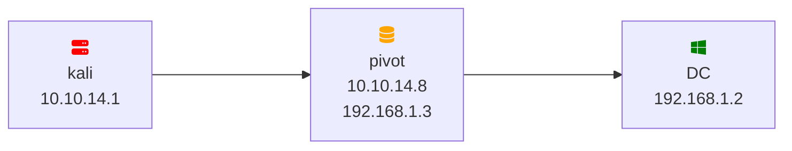
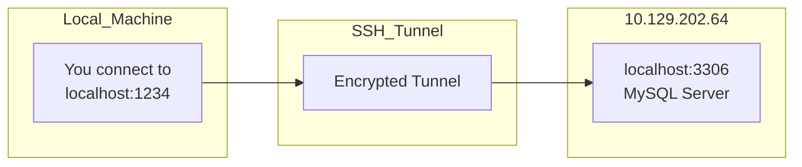
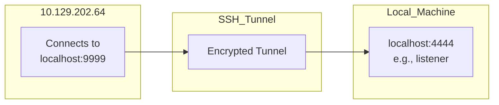
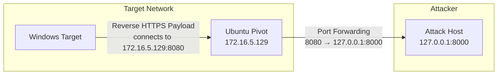
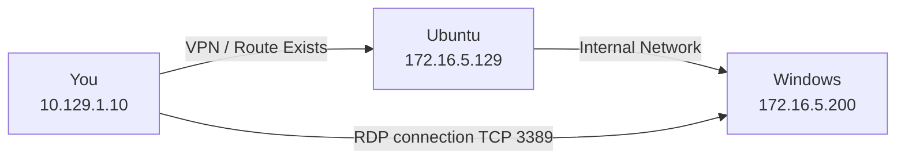

<i class="fas fa-server" style="color:red"></i>

```mermaid
flowchart LR
        A[      <i class="fas fa-server" style="color:red"></i>
                        kali \n 10.10.14.1]
        B[      <i class="fa-solid fa-database" style="color:orange"></i> 
                        pivot \n 10.10.14.8\n192.168.1.3]
        C[      <i class="fab fa-windows" style="color:green"></i>
                        DC\n192.168.1.2]

        A ----> B ----> C

```

```mermaid

flowchart LR
    subgraph Local_Machine
        A[You connect to<br>localhost:1234]
    end

    subgraph SSH_Tunnel
        T[Encrypted Tunnel]
    end

    subgraph Remote_Host[10.129.202.64]
        B[localhost:3306<br> MySQL Server]
    end

    A --> T --> B


```

```mermaid
flowchart LR
    subgraph Remote_Host[10.129.202.64]
        B[Connects to<br>localhost:9999]
    end

    subgraph SSH_Tunnel
        T[Encrypted Tunnel]
    end

    subgraph Local_Machine
        A[localhost:4444<br>e.g., listener]
    end

    B --> T --> A


```

```mermaid

flowchart LR
    subgraph Target Network
        WIN[Windows Target]
        UBUNTU[Ubuntu Pivot<br>172.16.5.129]
    end

    subgraph Attacker
        ATTACK[Attack Host<br>127.0.0.1:8000]
    end

    WIN -- "Reverse HTTPS Payload<br>connects to 172.16.5.129:8080" --> UBUNTU
    UBUNTU -- "Port Forwarding<br>8080 → 127.0.0.1:8000" --> ATTACK


```

```mermaid
flowchart LR
    YOU[You<br>10.129.1.10]
    UBUNTU[Ubuntu<br>172.16.5.129]
    WIN[Windows<br>172.16.5.200]

    YOU -- "VPN / Route Exists" --> UBUNTU
    UBUNTU -- "Internal Network" --> WIN
    YOU -- "RDP connection TCP 3389" --> WIN


```