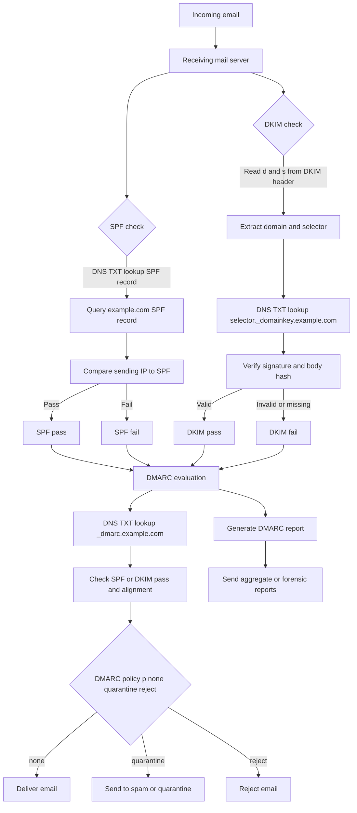

---
aliases:
tags:
source:
  - https://drive.google.com/file/d/1XqZeBOM6JeR83Nce-k9aUkAZQV2denWs/view
desc:
---


- 1 General security concepts
	-  Security controls
		-   Security risks are out there
		    -   Many different categories and types to consider
		-   Assets are also varied
		    -   Data, physical property, computer systems
		-   Prevent security events, minimize the impact, and limit the damage
		    -   Security controls
	- Control categories
		-   Technical controls
		    -   Controls implemented using systems
		    -   Operating system controls
		    -   Firewalls, anti-virus
		-   Managerial controls
		    -   Administrative controls associated with security design and implementation
		    -   Security policies, standard operating procedures
		-   Operational controls
		    -   Controls implemented by people instead of systems
		    -   Security guards, awareness programs
		-   Physical controls
		    -   Limit physical access
		    -   Guard shack
		    -   Fences, locks
		    -   Badge readers
	- Preventive control types
		-   Preventive
		    -   Block access to a resource
		    -   You shall not pass
			-   Prevent access
		    -   Firewall rules
		    -   Follow security policy
		    -   Guard shack checks all identification
		    -   Enable door locks
		-   Deterrent
		    -   Discourage an intrusion attempt
		    -   Does not directly prevent access
			-   Make an attacker think twice
			-   Application splash screens
		    -   Threat of demotion
		    -   Front reception desk
		    -   Posted warning signs
		-   Detective
		    -   Identify and log an intrusion attempt
		    -   May not prevent access
			-   Find the issue
			    -   Collect and review system logs
		    -   Review login reports
		    -   Regularly patrol the property
		    -   Enable motion detectors
		-   Corrective
		    -   Apply a control after an event has been detected
		    -   Reverse the impact of an event
		    -   Continue operating with minimal downtime
			-   Correct the problem
			-   Restoring from backups can mitigate a ransomware infection
		    -   Create policies for reporting security issues
		    -   Contact law enforcement to manage criminal activity
		    -   Use a fire extinguisher
		-   Compensating
		    -   Control using other means
		    -   Existing controls aren't sufficient
		    -   May be temporary
			-   Prevent the exploitation of a weakness
			    -   Firewall blocks a specific application instead of patching the app
			-   Implement a separation of duties
		    -   Require simultaneous guard duties
		    -   Generator used after power outage
		-   Directive
		    -   Direct a subject towards security compliance
		    -   A relatively weak security control
			-   Do this, please
			-   Store all sensitive files in a protected folder
		    -   Create compliance policies and procedures
		    -   Train users on proper security policy
		    -   Post a sign for "Authorized Personnel Only"
	- Managing security controls
		-   These are not inclusive lists
		    -   There are many categories of control
		    -   Some organizations will combine types
		-   There are multiple security controls for each category and type
		    -   Some security controls may exist in multiple types or categories
		    -   New security controls are created as systems and processes evolve
		    -   Your organization may use very different controls
		- Examples			  
			<table>
			  <thead>
			    <tr>
			      <th rowspan="2">Categories</th>
			      <th colspan="6">Control Type Examples</th>
			    </tr>
			    <tr>
			      <th>Preventive</th>
			      <th>Deterrent</th>
			      <th>Detective</th>
			      <th>Corrective</th>
			      <th>Compensating</th>
			      <th>Directive</th>
			    </tr>
			  </thead>
			  <tbody>
			    <tr>
			      <td>Technical</td>
			      <td>Firewall</td>
			      <td>Splash screen</td>
			      <td>System logs</td>
			      <td>Backup recovery</td>
			      <td>Block instead of patch</td>
			      <td>File storage policies</td>
			    </tr>
			    <tr>
			      <td>Managerial</td>
			      <td>On-boarding policy</td>
			      <td>Demotion</td>
			      <td>Review login reports</td>
			      <td>Policies for reporting issues</td>
			      <td>Separation of duties</td>
			      <td>Compliance policies</td>
			    </tr>
			    <tr>
			      <td>Operational</td>
			      <td>Guard shack</td>
			      <td>Reception desk</td>
			      <td>Property patrols</td>
			      <td>Contact authorities</td>
			      <td>Require multiple security staff</td>
			      <td>Security policy training</td>
			    </tr>
			    <tr>
			      <td>Physical</td>
			      <td>Door lock</td>
			      <td>Warning signs</td>
			      <td>Motion detectors</td>
			      <td>Fire extinguisher</td>
			      <td>Power generator</td>
			      <td>Sign: Authorized Personnel Only</td>
			    </tr>
			  </tbody>
			</table>
	- The CIA Triad
		- Combination of principles
		    -   The fundamentals of security
		    -   Sometimes referenced as the AIC Triad
		-   Confidentiality
			-   Prevent disclosure of information to unauthorized individuals or systems
			-   Certain information should only be known to certain people
				-   Prevent unauthorized information disclosure
			-   Encryption
				-   Encode messages so only certain people can read it
			-   Access controls
				-   Selectively restrict access to a resource
			-   Two-factor authentication
				-   Additional confirmation before information is disclosed
		-   Integrity
		    -   Messages can't be modified without detection
			-   Data is stored and transferred as intended
			    -   Any modification to the data would be identified
			-   Hashing
			    -   Map data of an arbitrary length to data of a fixed length
			-   Digital signatures
			    -   Mathematical scheme to verify the integrity of data
			-   Certificates
			    -   Combine with a digital signature to verify an individual
			-   Non-repudiation
			    -   Provides proof of integrity, can be asserted to be genuine
		-   Availability
		    -   Systems and networks must be up and running
			-   Information is accessible to authorized users
			    -   Always at your fingertips
			-   Redundancy
			    -   Build services that will always be available
			-   Fault tolerance
			    -   System will continue to run, even when a failure occurs
			-   Patching
			    -   Stability
			    -   Close security holes
	- Non-repudiation
		- You can't deny what you've said
		    - There's no taking it back
		- Sign a contract
		    - Your signature adds non-repudiation
		    - You really did sign the contract
		    - Others can see your signature
			- Adds a different perspective for cryptography
		- Proof of integrity
		    - Proof of origin, with high assurance of authenticity
			- Verify data does not change
			    - The data remains accurate and consistent
			- In cryptography, we use a hash
			    - Represent data as a short string of text
			    - A message digest, a fingerprint
			- If the data changes, the hash changes
			    - If the person changes, you get a different fingerprint
			- Doesn't necessarily associate data with an individual
			    - Only tells you if the data has changed
		- Proof of origin
			- Prove the message was not changed
		    - Integrity
				- Prove the source of the message
		    - Authentication
				- Make sure the signature isn't fake
		    - Non-repudiation
				- Sign with the private key
			    - The message doesn't need to be encrypted
			    - Nobody else can sign this (obviously)
			- Verify with the public key
			    - Any change to the message will invalidate the signature
		- Create a digital signature 
		  ![[assets/attachments/kb/training/isc2-cissp/image-4.png]]
		- Verifying a digital signature
		  ![[assets/attachments/kb/training/isc2-cissp/image-5.png]]
	- Authentication, Authorization, and Accounting
		- AAA framework
			-   Identification
			    -   This is who you claim to be
			    -   Usually your username
			-   Authentication
			    -   Prove you are who you say you are
			    -   Password and other authentication factors
			-   Authorization
			    -   Based on your identification and authentication, what access do you have?
			-   Accounting
			    -   Resources used: Login time, data sent and received, logout time
		- Authenticating systems
			-   You have to manage many devices
		    -   Often devices that you'll never physically see
			-   A system can't type a password
			    -   And you may not want to store one
			-   How can you truly authenticate a device?
			    -   Put a digitally signed certificate on the device
			-   Other business processes rely on the certificate
		    -   Access to the VPN from authorized devices
		    -   Management software can validate the end device
		- Certificate authentication
			- ![[assets/attachments/kb/training/isc2-cissp/image-6.png]]
			-   An organization has a trusted Certificate Authority (CA)
			    -   Most organizations maintain their own CAs
			-   The organization creates a certificate for a device
		    -   And digitally signs the certificate with the organization's CA
			-   The certificate can now be included on a device as an authentication factor
		    -   The CA's digital signature is used to validate the certificate
		- Using an Authorization Model
		- The user or device has now authenticated
		    -   To what do they now have access?
		    -   Time to apply an authorization model
		-   Users and services -> data and applications
	    -   Associating individual users to access rights does not scale
		-   Put an authorization model in the middle
		    -   Define by Roles, Organizations, Attributes, etc.
		- No authorization model
			-   A simple relationship
			    -   User -> Resource
			-   Some issues with this method
			    -   Difficult to understand why an authorization may exist
			    -   Does not scale
		- Using an authorization model
			-   Add an abstraction
			    -   Reduce complexity
			    -   Create a clear relationship between the user and the resource
				-   Administration is streamlined
			    -   Easy to understand the authorizations
			    -   Support any number of users or resources
	- Gap Analysis
		- Where you are compared with where you want to be
		    - The “gap” between the two
		- This may require extensive research
		    - There’s a lot to consider
		- This can take weeks or months
		    - An extensive study with numerous participants
		    - Get ready for emails, data gathering, and technical research
		- Choosing the framework
			- Work towards a known baseline
			    - This may be an internal set of goals
			    - Some organizations should use formal standards
			- Determine the end goal
			    - NIST Special Publication 800-171 Revision 2,
			    - Protecting Controlled Unclassified Information in Nonfederal Systems and Organizations
				- ISO/IEC 27001
				    - Information security management systems
		- Evaluate people and processes
			- Get a baseline of employees
			    - Formal experience
			    - Current training
			    - Knowledge of security policies and procedures
		- Examine the current processes
			    - Research existing IT systems
			    - Evaluate existing security policies
		- Compare and contrast
			- The comparison
			    - Evaluate existing systems
			- Identify weaknesses
			    - Along with the most effective processes
			- A detailed analysis
			    - Examine broad security categories
			    - Break those into smaller segments
		- The analysis and report
			- The final comparison
			- Detailed baseline objectives
			- A clear view of the current state
			- Need a path to get from the current security to the goal
			    - This will almost certainly include time, money, and lots of change control
		- Time to create the gap analysis report
		    - A formal description of the current state
		    - Recommendations for meeting the baseline
		- example gap analysis overview
		  ![[assets/attachments/kb/training/isc2-cissp/image-7.png]]
	- Zero Trust
		- ![[assets/attachments/kb/training/isc2-cissp/image-9.png]]
		- Many networks are relatively open on the inside
		- Once you’re through the firewall, there are few security controls
		- Zero trust is a holistic approach to network security
		    - Covers every device, every process, every person
		- Everything must be verified
		- Nothing is inherently trusted
	    - Multi-factor authentication, encryption, system permissions, additional firewalls, monitoring and analytics, etc
		- Planes of operation
			- Split the network into functional planes
			    - Applies to both physical, virtual, and cloud components
			      ![[assets/attachments/kb/training/isc2-cissp/image-8.png]]
			- Data plane
			    - Process the frames, packets, and network data
			    - Processing, forwarding, trunking, encrypting, NAT
			- Control plane
				- Manages the actions of the data plane
				- Define policies and rules
				- Determines how packets should be forwarded
				- Routing tables, session tables, NAT tables
		- Controlling trust
			- Adaptive identity
			    - Consider the source and the requested resources
			    - Multiple risk indicators - relationship to the organization, physical location, type of connection, IP
		- Policy enforcement point
			- Subjects and systems
		    - End users, applications, non-human entities
			- Policy enforcement point (PEP)
			    - The gatekeeper
					- Allow, monitor, and terminate connections
				    - Can consist of multiple components working together
			-   Policy Decision Point
			    -   There's a process for making an authentication decision
			-   Policy Engine
			    -   Evaluates each access decision based on policy and other information sources
			    -   Grant, deny, or revoke
		-   Policy Administrator
		    -   Communicates with the Policy Enforcement Point
		    -   Generates access tokens or credentials
		    -   Tells the PEP to allow or disallow access address, etc.
		    -   Make the authentication stronger, if needed
		-   Threat scope reduction
		    -   Decrease the number of possible entry points
		-   Policy-driven access control
		    -   Combine the adaptive identity with a predefined set of rules
	- Security zones
		-   Security is more than a one-to-one relationship
	    -   Broad categorizations provide a security-related foundation
		-   Where are you coming from and where are you going
		    -   Trusted, untrusted
		    -   Internal network, external network
		    -   VPN 1, VPN 5, VPN 11
		    -   Marketing, IT, Accounting, Human Resources
		-   Using the zones may be enough by itself to deny access
		    -   For example, Untrusted to Trusted zone traffic
		-   Some zones are implicitly trusted
		    -   For example, Trusted to Internal zone traffic
	- Physical Security
		- Barricades / bollards
			- Prevent access - There are limits to the prevention
			- Channel people through a specific access point
			- Allow people, prevent cars and trucks
			- Identify safety concerns - And prevent injuries
			- Can be used to an extreme
			- Concrete barriers / bollards, moats
		- Access control vestibules
			- All doors normally unlocked
			- Opening one door causes others to lock
			- All doors normally locked
			- Unlocking one door prevents others from being unlocked
				- One door open / other locked
				- When one is open, the other cannot be unlocked
			- One at a time, controlled groups
			- Managed control through an area
		- Fencing
			- Build a perimeter - Usually very obvious
			- May not be what you're looking for
			- Transparent/opaque - See through the fence (or not)
			- Robust - Difficult to cut the fence
			- Prevent climbing - Razor wire - Build it high
		- Video surveillance
			- CCTV (Closed circuit television)
				- Can replace physical guards
			- Camera features are important
			- Motion recognition can alarm and alert
			- Object detection can identify a license plate or face
			- Often many different cameras
			- Networked together and recorded over time
		- Guards and access badges
			- Security guard
			- Physical protection at the reception area of a facility
			- Validates identification of existing employees
			- Two-person integrity/control
				- Minimize exposure to an attack
				- No single person has access to a physical asset
		- Access badge
			- Picture, name, other details
			- Must be worn at all times - Electronically logged
		- Lighting
			- More light means more security
			- Attackers avoid the light - Easier to see when lit
			- Non IR cameras can see better
			- Specialized design
			- Consider overall light levels
			- Lighting angles may be important
			- Important for facial recognition
			- Avoid shadows and glare
		- Sensors
			- Infrared
				- Detects infrared radiation in both light and dark
				- Common in motion detectors
			- Pressure
				- Detects a change in force - Floor and window sensors
			- Microwave
				- Detects movement across large areas
			- Ultrasonic
				- Send ultrasonic signals, receive reflected sound waves
				- Detect motion, collision detection, etc.
	- Deception and Disruption
		- Honeypots
			- Attract the bad guys - And trap them there
			- The "attacker" is probably a machine
			    - Makes for interesting recon
		- Honeypots - Create a virtual world to explore
			- Many different options
			- Most are open source and available to download
			- Constant battle to discern the real from the fake
		- Honeynets
			- A real network includes more than a single device
			- Servers, workstations, routers, switches, firewalls
		    - Build a larger deception network with
	        - one or more honeypots
			- More than one source of information
		- Honeyfiles
			- Attract the attackers with more honey
			- Create files with fake information
		    - Something bright and shiny
		    - Bait for the honeynet (passwords.txt)
		    - Add many honeyfiles to file shares
			- An alert is sent if the file is accessed
				- A virtual bear trap
		- Honeytokens
			- Track the malicious actors
		    - Add some traceable data to the honeynet
			- If the data is stolen, you'll know where it came from
			- API credentials
			    - Does not actually provide access
			    - Notifications are sent when used
			- Fake email addresses
			    - Add it to a contact list
		    - Monitor the Internet to see who posts it
			- Many other honeytoken examples
			    - Database records, browser cookies, web page pixels
	- Impact analysis
		- Determine a risk value
		    -   i.e., high, medium, low
		-   The risks can be minor or far-reaching
		-   The "fix" doesn't actually fix anything
	    -   The fix breaks something else
	    -   Operating system failures
	    -   Data corruption
		-   What's the risk with NOT making the change?
		    -   Security vulnerability
		    -   Application unavailability
			-   Unexpected downtime to other services
	- Test results
		-   Sandbox testing environment
		    -   No connection to the real world or production system
		    -   A technological safe space
		-   Use before making a change to production
		    -   Try the upgrade, apply the patch
		    -   Test and confirm before deployment
		-   Confirm the backout plan
		    -   Move everything back to the original
		    -   A sandbox can't consider every possibility
		- Backout plan
			-   The change will work perfectly and nothing will ever go bad
			    -   Of course it will
			-   You should always have a way to revert your changes
		    -   Prepare for the worst, hope for the best
			-   This isn't as easy as it sounds
			-   Some changes are difficult to revert
			-   Always have backups
		    -   Always have good backups
		- Maintenance window
			-   When is the change happening?
		    -   This might be the most difficult part of the process
			-   During the workday may not be the best option
			    -   Potential downtime would affect a large part of production
			-   Overnights are often a better choice
				-   Challenging for 24-hour production schedules
			-   The time of year may be a consideration
		    -   Retail networks are frozen during the holiday season
		- Standard operating procedure
			-   Change management is critical
		    -   Affects everyone in the organization
			-   The process must be well documented
		    -   Should be available on the Intranet
		    -   Along with all standard processes and procedures
		-   Changes to the process are reflected in the standards
		    -   A living document
	- Change approval process
		-   A formal process for managing change
	    -   Avoid downtime, confusion, and mistakes
		-   A typical approval process
		    -   Complete the request forms
		    -   Determine the purpose of the change
		    -   Identify the scope of the change
		    -   Schedule a date and time of the change
		    -   Determine affected systems and the impact
		    -   Analyze the risk associated with the change
		    -   Get approval from the change control board
		    -   Get end-user acceptance after the change is complete
		- Ownership
			-   An individual or entity needs to make a change
			    -   They own the process
			    -   They don't (usually) perform the actual change
			-   The owner manages the process
			    -   Process updates are provided to the owner
			    -   Ensures the process is followed and acceptable
				-   Address label printers needs to be upgraded
			    -   Shipping and Receiving department owns the process
			    -   IT handles the actual change
		- Stakeholders
			-   Who is impacted by this change?
			    -   They'll want to have input on the change management process
			-   This may not be as obvious as you might think
			    -   A single change can include one individual or the entire company
			-   Upgrade software used for shipping labels
			    -   Shipping / receiving
			    -   Accounting reports
			    -   Product delivery timeframes
			    -   Revenue recognition - CEO visibility
	- Technical change management
		-   Put the change management process into action
	    -   Execute the plan
		-   There's no such thing as a simple upgrade
		    -   Can have many moving parts
		    -   Separate events may be required
		-   Change management is often concerned with "what" needs to change
		    -   The technical team is concerned with "how" to change it
	- Allow list / deny list
		-   Any application can be dangerous
		    -   Vulnerabilities, trojan horses, malware
		-   Security policy can control app execution
		    -   Allow list, deny/block list
		-   Allow list
		    -   Nothing runs unless it's approved
		    -   Very restrictive
		-   Deny list
		    -   Nothing on the "bad list" can be executed
		    -   Anti-virus, anti-malware
	- Restricted activities
		-   The scope of a change is important
		    -   Defines exactly which components are covered
		-   A change approval isn't permission to make any change
		    -   The change control approval is very specific
		-   The scope may need to be expanded during the change window
		    -   It's impossible to prepare for all possible outcomes
		-   The change management process determines the next steps
		    -   There are processes in place to make the change successful
	- Downtime
		-   Services will eventually be unavailable
		    -   The change process can be disruptive
		    -   Usually scheduled during non-production hours
		-   If possible, prevent any downtime
		    -   Switch to secondary system, upgrade the primary, then switch back
		-   Minimize any downtime events
		    -   The process should be as automated as possible
		    -   Switch back to secondary if issues appear
	    -   Should be part of the backout plan
		-   Send emails and calendar updates
	- Restarts
		-   It's common to require a restart
		    -   Implement the new configuration
		    -   Reboot the OS, power cycle the switch, bounce the service
		    -   Can the system recover from a power outage?
	-   Services
	    -   Stop and restart the service or daemon
	    -   May take seconds or minutes
	-   Applications
	    -   Close the application completely
	    -   Launch a new application instance
	- Legacy applications
		-   Some applications were here before you arrived
		    -   They'll be here when you leave
		-   Often no longer supported by the developer
		    -   You're now the support team
		-   Fear of the unknown
		    -   Face your fears and document the system
		    -   It may not be as bad as you think
		-   May be quirky
		    -   Create specific processes and procedures
		-   Become the expert
	- Dependencies
		-   To complete A, you must complete B
		    -   A service will not start without other active services
		    -   An application requires a specific library version
		-   Modifying one component may require changing or restarting other components
		    -   This can be challenging to manage
		-   Dependencies may occur across systems
		    -   Upgrade the firewall code first
		    -   Then upgrade the firewall management software
	- Documentation
		-   It can be challenging to keep up with changes
		    -   Documentation can become outdated very quickly
		    -   Require with the change management process
		-   Updating diagrams
		    -   Modifications to network configurations
		    -   Address updates
		-   Updating policies/procedures
	    -   Adding new systems may require new procedures
	- Version control
		-   Track changes to a file or configuration data over time
		    -   Easily revert to a previous setting
		-   Many opportunities to manage versions
		    -   Router configurations
		    -   Windows OS patches
		    -   Application registry entries
		-   Not always straightforward
		-   Some devices and operating systems provide version control features
		-   May require additional management software
	- Public Key Infrastructure (PKI)
		- Policies, procedures, hardware, software, people
	    - Digital certificates: create, distribute, manage, store, revoke
		- This is a big, big, endeavor
		    - Lots of planning
		- Also refers to the binding of public keys to people or devices
		    - The certificate authority
		    - It's all about trust
		- Symmetric encryption
			- A single, shared key
			  - 128-bit or larger symmetric keys are common
				- These numbers get larger and larger as time goes on
			- Encrypt with the key
			- Decrypt with the same key
			- If it gets out, you'll need another key
			- Secret key algorithm
			    - A shared secret
			- Doesn't scale very well
		    - Can be challenging to distribute
			- Very fast to use
		    - Less overhead than asymmetric encryption
		    - Often combined with asymmetric encryption
		- Asymmetric encryption
			- Public key cryptography
			- Complex calculations of prime numbers
			- Longer keys than symmetric encryption
			- Common to see key lengths of 3,072 bits or larger
			- ![[assets/attachments/kb/training/isc2-cissp/image-10.png]]
			- Two (or more) mathematically related keys
			- Private key
				- Keep this private
			- Public key
				- Anyone can see this key
				- Give it away
			- The private key is the only key that can decrypt data encrypted with the public key
			- You can't derive the private key from the public key
			 - The key pair
			 - Public Key Cryptography
			- Key generation
			    - Build both the public and private key at the same time
			    - Lots of randomization
			    - Large prime numbers
			    - Lots and lots of math
			- Everyone can have the public key
			    - Only Alice has the private key
		- Key escrow
			- Someone else holds your decryption keys
			- Your private keys are in the hands of a 3rd-party
			- This may be within your own organization
			- This can be a legitimate business arrangement
				- A business might need access to employee information
				- Government agencies may need to decrypt partner data
			- Controversial?
				- Of course
				- But may still be required
			- Need clear process and procedures
		    - Keys are incredibly important pieces of information
			- You must be able to trust your 3rd-party
			    - Access to the keys is at the control of the 3rd-party
			- Carefully controlled conditions
			    - Legal proceedings and court orders
	 - Encrypting Data
		- Encrypting stored data
			- Protect data on storage devices
			    - SSD, hard drive, USB drive, cloud storage, etc.
			    - This is data at rest
			- Full-disk and partition/volume encryption
			    - BitLocker, FileVault, etc.
			- File encryption
			    - EFS (Encrypting File System), third-party utilities
		- Database encryption
			- Protecting stored data
			    - And the transmission of that data
			- Transparent encryption
		    - Encrypt all database information with a symmetric key
			- Record-level encryption
			    - Encrypt individual columns
			    - Use separate symmetric keys for each column
		- Transport encryption
			- Protect data traversing the network
			    - You’re probably doing this now
			- Encrypting in the application
			    - Browsers can communicate using HTTPS
			- VPN (Virtual Private Network)
			    - Encrypts all data transmitted over the network, regardless of the application
			    - Client-based VPN using SSL/TLS
			    - Site-to-site VPN using IPsec
		- Encryption algorithms
			- There are many, many different ways to encrypt data
			    - The proper “formula” must be used during encryption and decryption
			- Both sides decide on the algorithm before encrypting the data
			    - The details are often hidden from the end user
			- There are advantages and disadvantages between algorithms
			    - Security level, speed, complexity of implementation, etc.
		- Cryptographic keys
			- There’s very little that isn’t known about the cryptographic process
			    - The algorithm is usually a known entity
			    - The only thing you don’t know is the key
			- The key determines the output
			    - Encrypted data
			    - Hash value
		    - Digital signature
			- Keep your key private!
			    - It’s the only thing protecting your data
			- Key lengths
				- Larger keys tend to be more secure
				    - Prevent brute-force attacks
			    - Attackers can try every possible key combination
		- Key stretching
				- A weak key is a weak key
				    - By itself, it’s not very secure
				- Make a weak key stronger by performing multiple processes
				- Hash a password. Hash the hash of the password. And continue...
			    - Key stretching, key strengthening
				- Brute force attacks would require reversing each of those hashes
				    - The attacker has to spend much more time, even though the key is small
		- Key exchange
			- A logistical challenge
			    - How do you share an encryption key across an insecure medium without physically transferring the key?
			- Out-of-band key exchange
			    - Don’t send the symmetric key over the ‘net
			    - Telephone, courier, in-person, etc.
			- In-band key exchange
			    - It’s on the network
		    - Protect the key with additional encryption
		    - Use asymmetric encryption to deliver a symmetric key
		- Real-time encryption/decryption
			- There’s a need for fast security
			    - Without compromising the security part
			- Share a symmetric session key using asymmetric encryption
			- Client encrypts a random (symmetric) key with a server’s public key
		    - The server decrypts this shared key and uses it to encrypt data
		    - This is the session key
			- Implement session keys carefully
			    - Need to be changed often (ephemeral keys)
			    - Need to be unpredictable
		- Symmetric key from asymmetric keys
			- Use public and private key cryptography to create a symmetric key
		    - Math is powerful
		    - ![[assets/attachments/kb/training/isc2-cissp/image-11.png]]
		- Encryption Technologies
			- Trusted Platform Module (TPM)
				-   A specification for cryptographic functions
			    -   Cryptography hardware on a device
				-   Cryptographic processor
			    -   Random number generator, key generators
				-   Persistent memory
			    -   Unique keys burned in during manufacturing
				-   Versatile memory
				-   Storage keys, hardware configuration information
			    -   Securely store BitLocker keys
				-   Password protected
			    -   No dictionary attacks
			- Hardware Security Module (HSM)
				-   Used in large environments
			    -   Clusters, redundant power
			    -   Securely store thousands of cryptographic keys
				-   High-end cryptographic hardware
			    -   Plug-in card or separate hardware device
				-   Key backup
				    -   Secure storage in hardware
				-   Cryptographic accelerators
			    -   Offload that CPU overhead from other devices
		- Key management system
			-   Services are everywhere
			    -   On-premises, cloud-based
			-   Many different keys for many different services
			-   Manage all keys from a centralized manager
			-   Often provided as third-party software
		    -   Separate the encryption keys from the data
		    - All key management from one console
		    -   Create keys for a specific service or cloud provider (SSL/TLS, SSH, etc.)
		    -   Associate keys with specific users
		    -   Rotate keys on regular intervals
		    -   Log key use and important events
		- Keeping data private
			-   Our data is located in many different places
			    -   Mobile phones, cloud, laptops, etc.
			-   The most private data is often physically closest to us
			-   Attackers are always finding new techniques
			    -   It's a race to stay one step ahead
			-   Our data is changing constantly
			    -   How do we keep this data protected?
			- Secure enclave
				-   A protected area for our secrets
				    -   Often implemented as a hardware processor
				-   Isolated from the main processor
			    -   Many different technologies and names
				-   Provides extensive security features
				    -   Has its own boot ROM
				    -   Monitors the system boot process
				    -   True random number generator
				    -   Real-time memory encryption
				    -   Root cryptographic keys
				    -   Performs AES encryption in hardware
	    -  Obfuscation
			- The process of making something unclear
			    - It's now much more difficult to understand
			- But it's not impossible to understand
			    - If you know how to read it
			- Hide information in plain sight
			    - Store payment information without storing a credit card number
			- Hide information inside of an image
			- Steganography
				- Greek for “concealed writing”
				- Security through obscurity
				- Message is invisible - But it’s really there
				- The covertext - The container document or file
				- Common steganography techniques
					- Network based - Embed messages in TCP packets
					- Use an image - Embed the message in the image itself
					- Invisible watermarks - Yellow dots on printers
					- Audio steganography
					    - Modify the digital audio file
					    - Interlace a secret message within the audio
						- Similar technique to image steganography
					- Video steganography
					    - A sequence of images
					    - Use image steganography on a larger scale
						- Manage the signal to noise ratio
					    - Potentially transfer much more information
			- Tokenization
				- ![[assets/attachments/kb/training/isc2-cissp/image-12.png]]
				- Replace sensitive data with a non-sensitive placeholder
				    - SSN 266-12-1112 is now 691-61-8539
				- Common with credit card processing
			    - Use a temporary token during payment
				    - An attacker capturing the card numbers can’t use them later
				- This isn’t encryption or hashing
			    - The original data and token aren’t mathematically related
			    - No encryption overhead
			- Data masking
				- Data obfuscation
				    - Hide some of the original data
				- Protects PII and other sensitive data
				- May only be hidden from view
			    - The data may still be intact in storage
			    - Control the view based on permissions
				- Many different techniques
				    - Substituting, shuffling, encrypting, masking out, etc.
		- Hashing and Digital Signatures
			- Hashes
				- Represent data as a short string of text
				    - A message digest, a fingerprint
				- One-way trip
				    - Impossible to recover the original message from the digest
				    - Used to store passwords / confidentiality
				- Verify a downloaded document is the same as the original
			    - Integrity
					- Can be a digital signature
				    - Authentication, non-repudiation, and integrity
				- Different inputs should never create the same hash, this is a collision
				- Hash functions
				    - Take an input of any size
				    - Create a fixed size string
				    - Message digest, checksum
				- The hash should be unique
			    - MD5 has a collision problem
				    - Found in 1996 - Don't use MD5 for anything important
				- Practical hashing
					- Verify a downloaded file
				    - Hashes may be provided on the download site
				    - Compare the downloaded file hash with the posted hash value
				- Password storage
				    - Instead of storing the password, store a salted hash
				    - Compare hashes during the authentication process
				    - Nobody ever knows your actual password
				- Salt
				    - Random data added to a password when hashing
					- Every user gets their own random salt
					    - The salt is commonly stored with the password
					- Rainbow tables won't work with salted hashes
				    - Additional random value added to the original password
					- This slows things down the brute force process
					- It doesn't completely stop the reverse engineering
					- Salting the hash
						- Each user gets a different random hash
					    - The same password creates a different hash
			- Digital signatures
				- Prove the message was not changed
				    - Integrity Prove the source of the message
				    - Authentication Make sure the signature isn't fake
				    - Non-repudiation Sign with the private key
			    - The message doesn't need to be encrypted
			    - Nobody else can sign this (obviously)
				- Verify with the public key
			    - Any change in the message will invalidate the signature
			 - Blockchain Technology
			- Blockchain
				- ![[assets/attachments/kb/training/isc2-cissp/image-13.png]]
				-   A distributed ledger
				-   Keep track of transactions
			-   Everyone on the blockchain network maintains the ledger
			    -   Records and replicates to anyone and everyone
			-   Many practical applications
			    -   Payment processing
			    -   Digital identification
			    -   Supply chain monitoring
			    -   Digital voting
			 - Certificates
			- Digital certificates
			- A public key certificate
			- Binds a public key with a digital signature
			- And other details about the key holder
			- A digital signature adds trust
		    - PKI uses Certificate Authorities for additional trust
		    - Web of Trust adds other users for additional trust
			- Certificate creation can be built into the OS
			    - Part of Windows Domain services
		    - Many 3rd-party options
			 - X.509
			    - Standard format
				- Certificate details
				    - Serial number
				    - Version
				    - Signature Algorithm
				    - Issuer
				    - Name of the cert holder
				    - Public key
				    - Extensions
			- Root of trust
			- Everything associated with IT security requires trust
			    - A foundational characteristic
			- How to build trust from something unknown?
		    - Someone/something trustworthy provides their approval
			- Refer to the root of trust
			    - An inherently trusted component
			    - Hardware, software, firmware, or other component
			    - Hardware security module (HSM), Secure Enclave, Certificate Authority, etc.
			- Certificate Authorities
			- You connect to a random website
			    - Do you trust it?
			- Need a good way to trust an unknown entity
			- Use a trusted third-party
		    - An authority
			- Certificate Authority (CA) has digitally signed the website certificate
			- You trust the CA, therefore you trust the website
		    - Real-time verification
			- Third-party certificate authorities
			- Built-in to your browser
			    - Any browser
			- Purchase your web site certificate
			    - It will be trusted by everyone's browser
			- CA is responsible for vetting the request
			    - They will confirm the certificate owner
			    - Additional verification information may be required by the CA
			- Certificate signing request (CSR)
					- ![[assets/attachments/kb/training/isc2-cissp/image-17.png]]
					- Create a key pair, then send the public key to the CA to be signed
					- The CA validates the request
				    - Confirms DNS emails and website ownership
					- CA digitally signs the cert
				    - Returns to the applicant
			- Private certificate authorities
				- You are your own CA
				    - Build it in-house
				    - Your devices must trust the internal CA
				- Needed for medium-to-large organizations
				    - Many web servers and privacy requirements
				- Implement as part of your overall computing strategy
				    - Windows Certificate Services, OpenCA
				- Self-signed certificates
					- Internal certificates don't need to be signed by a public CA
			    - Your company is the only one going to use it
					- No need to purchase trust for devices that already trust you
			- Build your own CA
			    - Issue your own certificates signed by your own CA
				- Install the CA certificate/trusted chain on all devices
			    - They'll now trust any certificates signed by your internal CA
			    - Works exactly like a certificate you purchased
			- Wildcard certificates
				- Subject Alternative Name (SAN)
			    - Extension to an X.509 certificate
			    - Lists additional identification information
			    - Allows a certificate to support many different domains
			- Wildcard domain
			    - Certificates are based on the name of the server
			    - A wildcard domain will apply to all server names in a domain
			    - `*.example.com`
			- Certificate Revocation List (CRL)
			    - Maintained by the Certificate Authority (CA)
			    - Can contain many revocations in a large file
				- Many different reasons
				    - Changes all the time
			-  OCSP stapling Online Certificate Status Protocol
			    -   Provides scalability for OCSP checks
				-   The CA is responsible for responding to all client OCSP requests
				    -   This may not scale well
				-   Instead, have the certificate holder verify their own status
			    -   Status information is stored on the certificate holder's server
				-   OCSP status is "stapled" into the SSL/TLS handshake
			    -   Digitally signed by the CA
				- Getting revocation details to the browser
					-   OCSP (Online Certificate Status Protocol)
					    -   The browser can check certificate revocation
						-   Messages usually sent to an OCSP responder via HTTP
					    -   Easy to support over Internet links
						-   More efficient than downloading a CRL
				-   Not all browsers/apps support OCSP
			    -   Early Internet Explorer versions did not support OCSP
			    -   Some support OCSP, but don't bother checking
- 2 Threats, vulnerabilities, Mitigations
	- Threat Actors
		- The entity responsible for an event that has an impact on the safety of another entity
		    - Also called a malicious actor
		- Threat actor attributes
		    - Describes characteristics of the attacker
		- Useful to categorize the motivation
		    - Why is this attack happening?
		    - Is this directed or random?
		- Attributes of threat actors
			- Internal/external
			    - The attacker is inside the house
			    - They're outside and trying to get in
			- Resources/funding
			    - No money
			    - Extensive funding
			- Level of sophistication/capability
			    - Blindly runs scripts or automated vulnerability scans
			    - Can write their own attack malware and scripts
		- Motivations of threat actors
			- What makes them tick?
			    - There's a purpose to this attack
			- Motivations include
			    - Data exfiltration
				- Espionage
			    - Service disruption
			    - Blackmail
			    - Financial gain
			    - Philosophical/political beliefs
			    - Ethical
			    - Revenge
			    - Disruption/chaos
			    - War
		- Types
			- 
			<table>
				  <thead>
				    <tr>
				      <th rowspan="2">Threat actor</th>
				      <th colspan="3">Attributes</th>
				      <th rowspan="2">Possible motivations</th>
				    </tr>
				    <tr>
				      <th>Location</th>
				      <th>Resources</th>
				      <th>Sophistication</th>
				    </tr>
				  </thead>
				  <tbody>
				    <tr>
				      <td>Nation state</td>
				      <td>External</td>
				      <td>Extensive</td>
				      <td>Very high</td>
				      <td>Data exfiltration, philosophical, revenge, disruption, war</td>
				    </tr>
				    <tr>
				      <td>Unskilled</td>
				      <td>External</td>
				      <td>Limited</td>
				      <td>Very low</td>
				      <td>Disruption, data exfiltration, philosophical beliefs</td>
				    </tr>
				    <tr>
				      <td>Hacktivist</td>
				      <td>External</td>
				      <td>Some funding</td>
				      <td>Can be high</td>
				      <td>Philosophical beliefs, revenge, disruption/chaos</td>
				    </tr>
				    <tr>
				      <td>Insider threat</td>
				      <td>Internal</td>
				      <td>Many resources</td>
				      <td>Medium</td>
				      <td>Revenge, financial gain</td>
				    </tr>
				    <tr>
				      <td>Organized crime</td>
				      <td>External</td>
				      <td>Often extensive</td>
				      <td>Very high</td>
				      <td>Financial</td>
				    </tr>
				    <tr>
				      <td>Shadow IT</td>
				      <td>Internal</td>
				      <td>Many resources</td>
				      <td>Limited</td>
				      <td>Philosophical beliefs, revenge</td>
				    </tr>
				  </tbody>
				</table>
			- Nation states
				- External entity
				    - Government and national security
				- Many possible motivations
				    - Data exfiltration, philosophical, revenge, disruption, war
				- Constant attacks, massive resources
				    - Commonly an Advanced Persistent Threat (APT)
				- Highest sophistication
				    - Military control, utilities, financial control
				    - United States and Israel destroyed 1,000 nuclear centrifuges with the Stuxnet worm
			- Unskilled attackers
				- Runs pre-made scripts without any knowledge of what's really happening
				- Anyone can do this
				- Motivated by the hunt
				    - Disruption, data exfiltration, sometimes philosophical
			    - Can be internal or external
			        - But usually external
				- Not very sophisticated
				    - Limited resources, if any
				- No formal funding
				    - Looking for low hanging fruit
			- Hacktivist
				- A hacker with a purpose
				    - Motivated by philosophy, revenge, disruption, etc.
				- Often an external entity
				    - Could potentially infiltrate to also be an insider threat
				- Can be remarkably sophisticated
				    - Very specific hacks
				    - DoS, web site defacing, private document release
				- Funding may be limited
				    - Some organizations have fundraising options
			- Insider threat
				- More than just passwords on sticky notes
				    - Motivated by revenge, financial gain
				- Extensive resources
				    - Using the organization's resources against themselves
				- An internal entity
				    - Eating away from the inside
				- Medium level of sophistication
				    - The insider has institutional knowledge
				    - Attacks can be directed at vulnerable systems
				    - The insider knows what to hit
			- Organized crime
				- Professional criminals
				    - Motivated by money
			    - Almost always an external entity
				- Very sophisticated
				    - Best hacking money can buy
				- Crime that's organized
			    - One person hacks, one person manages the exploits, another person sells the data, another handles customer support
				- Lots of capital to fund hacking efforts
			- Shadow IT
				- Going rogue
				    - Working around the internal IT organization
				    - Builds their own infrastructure
				- Information Technology can put up roadblocks
			    - Shadow IT is unencumbered
				- Use the cloud
			    - Might also be able to innovate
				- Limited resources
				    - Company budget
				- Medium sophistication
				    - May not have IT training or knowledge
	- Common Threat Vectors
		- Threat vectors
			- A method used by the attacker
			- Gain access or infect to the target
		    - Also called "attack vectors"
			- A lot of work goes into finding vulnerabilities in these vectors
			    - Some are more vulnerable than others
			- IT security professional spend their career watching these vectors
		    - Protect existing vectors
		    - Find new vectors
		- Message-based vectors
			- Phishing attacks
			    - People want to click links
			    - Links in an email, links send via text or IM
				- Deliver the malware to the user
			- Attach it to the email
		    - Scan all attachments, never launch untrusted links
			- Social engineering attacks
			    - Invoice scams, cryptocurrency scams
		- Image-based vectors
			- Easy to identify a text-based threat
		    - It's more difficult to identify the threat in an image
			- Some image formats can be a threat
			    - The SVG (Scalable Vector Graphic) format
			    - Image is described in XML (Extensible Markup Language)
			- Significant security concerns
		    - HTML injection
			    - Javascript attack code
			- Browsers must provide input validation
			    - Avoids running malicious code
		- File-based vectors
			- More than just executables
			    - Malicious code can hide in many places
				- Adobe PDF
				    - A file format containing other objects
				- ZIP/RAR files (or any compression type)
				    - Contains many different files
				- Microsoft Office
				    - Documents with macros
				    - Add-in files
		- Voice call vectors
			- Vishing
			    - Phishing over the phone
			- Spam over IP
			    - Large-scale phone calls
			- War dialing
			    - It still happens
			- Call tampering
			    - Disrupting voice calls
		- Removable device vectors
			- Get around the firewall
			    - The USB interface
			- Malicious software on USB flash drives
			    - Infect air gapped networks
			    - Industrial systems, high-security services
			- USB devices can act as keyboards
			- Hacker on a chip
			- Data exfiltration
			    - Terabytes of data walk out the door
			    - Zero bandwidth used
		- Vulnerable software vectors
			-   Client-based
			    -   Infected executable
			    -   Known (or unknown) vulnerabilities
			    -   May require constant updates
			-   Agentless
			    -   No installed executable
			    -   Compromised software on the server would affect all users
			    -   Client runs a new instance each time
		- Unsupported systems vectors
			-   Patching is an important prevention tool
			    -   Ongoing security fixes
			-   Unsupported systems aren’t patched
			    -   There may not even be an option
			-   Outdated operating systems
			    -   Eventually, even the manufacturer won’t help
			-   A single system could be an entry
			    -   Keep your inventory and records current
		- Unsecure network vectors
			-   The network connects everything
			    -   Ease of access for the attackers
			    -   View all (non-encrypted) data
			-   Wireless
			    -   Outdated security protocols (WEP, WPA, WPA2)
			    -   Open or rogue wireless networks
			-   Wired
			    -   Unsecure interfaces - No 802.1X
			-   Bluetooth
			    -   Reconnaissance, implementation vulnerabilities
			- Open service ports
				-   Most network-based services connect over a TCP or UDP port
				    -   An “open” port
				-   Every open port is an opportunity for the attacker
				    -   Application vulnerability or misconfiguration
				-   Every application has their own open port
				    -   More services expand the attack surface
				-   Firewall rules
				    -   Must allow traffic to an open port
		- Default credentials
			-   Most devices have default usernames and passwords
				-   Change yours!
			-   The right credentials provide full control
				-   Administrator access
			-   Very easy to find the defaults for your access point or router
				-   https://www.routerpasswords.com
		- Supply chain vectors
			-   Tamper with the underlying infrastructure
			    -   Or manufacturing process
			-   Managed service providers (MSPs)
			    -   Access many different customer networks from one location
			-   Gain access to a network using a vendor
			-   Suppliers
			    -   Counterfeit networking equipment
			    -   Install backdoors, substandard performance and availability
	- Phishing
		- Phishing
			-   Social engineering with a touch of spoofing
			    -   Often delivered by email, text, etc.
			    -   Very remarkable when well done
			-   Don’t be fooled
			    -   Check the URL
			-   Usually there’s something not quite right
			    -   Spelling, fonts, graphics
		- Business email compromise
			-   We trust email sources
			    -   The attackers take advantage of this trust
			-   Spoofed email addresses
			    -   Not really a legitimate email address
			-   Financial fraud
			    -   Sends emails with updated bank information
			    -   Modify wire transfer details
			-   The recipient clicks the links
			    -   The attachments have malware
		- Tricks and misdirection
			-   How are they so successful?
		    -   Digital slight of hand - It fools the best of us
		-   Typosquatting
		    -   A type of URL hijacking - https://professormessor.com
		-   Pretexting - Lying to get information
		    -   Attacker is a character in a situation they create
		    -   Hi, we’re calling from Visa regarding an automated payment to your utility service...
		-   Vishing (Voice phishing) is done over the phone or voicemail
		    -   Caller ID spoofing is common
		    -   Fake security checks or bank updates
		-   Smishing (SMS phishing) is done by text message
		    -   Spoofing is a problem here as well
		    -   Forwards links or asks for personal information
	- Impersonation
		- Attackers pretend to be someone they aren't
		    - Halloween for the fraudsters
		- Use some of those details from reconnaissance
		    - You can trust me, I'm with your help desk
		- Attack the victim as someone higher in rank
		    - Office of the Vice President for Scamming
		- Throw tons of technical details around
		    - Catastrophic feedback due to the depolarization of the differential magnetometer
		- Be a buddy - How about those Cubs?
		- Before the attack, the trap is set - There's an actor and a story
			- "Hello sir, my name is Wendy and I'm from Microsoft Windows. This is an urgent check up call for your computer as we have found several problems with it."
			- Voice mail: "This is an enforcement action executed by the US Treasury intending your serious attention."
			- "Congratulations on your excellent payment history! You now qualify for 0% interest rates on all of your credit card accounts."
		- Eliciting information
		- Extracting information from the victim
		    - The victim doesn't even realize this is happening
		    - Hacking the human
		- Often seen with vishing (Voice Phishing)
		    - Can be easier to get this information over the phone
		- These are well-documented psychological techniques
			- They can't just ask, "So, what's your password?"
		- Identity fraud
		- Your identity can be used by others
		    - Keep your personal information safe!
		- Credit card fraud
		    - Open an account in your name, or use your credit card information
		- Bank fraud
		    - Attacker gains access to your account or opens a new account
		- Loan fraud
		    - Your information is used for a loan or lease
		- Government benefits fraud
		    - Attacker obtains benefits on your behalf
		- Protect against impersonation
		- Never volunteer information
	    - My password is 12345
		- Don't disclose personal details
		- The bad guys are tricky
		- Always verify before revealing info
		    - Call back, verify through 3rd parties
		- Verification should be encouraged
		    - Especially if your organization owns valuable information
	- Watering Hole Attacks
		- What if your network was really secure?
		    - You didn't even plug in that USB key from the parking lot
		- The attackers can't get in
		    - Not responding to phishing emails
		    - Not opening any email attachments
		- Have the mountain come to you
		    - Go where the mountain hangs out
		    - The watering hole
		    - This requires a bit of research
		- Executing the watering hole attack
			- Determine which website the victim group uses
			- Educated guess - Local coffee or sandwich shop
				- Industry-related sites
			- Infect one of these third-party sites
				- Site vulnerability
				- Email attachments
			- Infect all visitors
				- But you're just looking for specific victims
		- Watching the watering hole
			- Defense-in-depth
			    - Layered defense
			    - It's never one thing
			- Firewalls and IPS
			    - Stop the network traffic before things get bad
			- Anti-virus / Anti-malware signature updates
			    - The Polish Financial Supervision Authority attack code was recognized and stopped by generic signatures in Symantec's anti-virus software
	- Misinformation/disinformation
		- Disseminate factually incorrect information
		    - Create confusion and division
			- Influence campaigns
		- Sway public opinion on political and social issues
		- Nation-state actors
		- Divide, distract, and persuade
		- Advertising is an option
		    - Buy a voice for your opinion
		- Enabled through Social media
		    - Creating, sharing, liking, amplifying
		- Brand impersonation
			- Pretend to be a well-known brand
			    - Coca-cola, McDonald's, Apple, etc.
			- Create tens of thousands of impersonated sites
			    - Get into the Google index, click an ad, get a WhatsApp message
			- Visitors are presented with a pop-up
			    - You won! Special offer! Download the video!
			- Malware infection is almost guaranteed
			    - Display ads, site tracking, data exfiltration
	 - Memory Injections
		 - Finding malware
	- Memory contains running processes
	    - DLLs (Dynamic Link Libraries)
	    - Threads
	    - Buffers
	    - Memory management functions
	    - And much more
	- Malware is hidden somewhere
	    - Malware runs in its own process
	    - Malware injects itself into a legitimate process
	- Memory injection
		- Add code into the memory of an existing process
		    - Hide malware inside of the process
		- Get access to the data in that process
		    - And the same rights and permissions
	    - Perform a privilege escalation
		 - DLL injection
			 - ![[assets/attachments/kb/training/isc2-cissp/image-18.png]]
			- Dynamic-Link Library
			- A Windows library containing code and data
			- Many applications can use this library
			- Attackers inject a path to a malicious DLL
			    - Runs as part of the target process
			- One of the most popular memory injection methods
			    - Relatively easy to implement
		- Buffer overflows
			-   Overwriting a buffer of memory
		    -   Spills over into other memory areas
			-   Developers need to perform bounds checking
			    -   The attackers spend a lot of time looking for openings
			-   Not a simple exploit
			    -   Takes time to avoid crashing things
			    -   Takes time to make it do what you want
			-   A really useful buffer overflow is repeatable
			    -   Which means that a system can be compromised
		- Race Conditions
			-   A programming conundrum
			    -   Sometimes, things happen at the same time
			    -   This can be bad if you've not planned for it
			-   Time-of-check to time-of-use attack (TOCTOU)
			    -   Check the system
			    -   When do you use the results of your last check?
			    -   Something might happen between the check and the use
			- Race condition example
				-   Two bank accounts with $100
				    -   User 1 and User 2 transfer $50 from Account A to Account B
				    -   Expected outcome:
				        Account A has $50, Account B has $150 (or A has $0 and B has $200)
				-   What if you don't perform proper validation?
				    -   User 1 and User 2 check the account balances ($100 in each account)
				    -   User 1 transfers $50 from Account A (now at $50) to Account B (now at $150)
				    -   At about the same time, user 2 transfers $50 from Account A (still has $100, right?), so now at $50) to Account B (now at $200)
				    -   Outcome: Account A has $50, Account B has $200
	- Malicious Updates
		- Software updates
			- Always keep your operating system and applications updated
		    - Updates often include bug fixes and security patches
			- This process has its own security concerns
		    - Not every update is equally secure
			- Follow best practices
			    - Always have a known-good backup
			    - Install from trusted sources
		    - Did I mention the backup?
			- Downloading and updating
				- Install updates from a downloaded file
				    - Always consider your actions
				    - Every installation could potentially be malicious
				- Confirm the source
				    - A random pop-up during web browsing may not be legitimate
				- Visit the developer's site directly
				    - Don't trust a random update button or random downloaded file
				- Many operating systems will only allow signed apps
				    - Don't disable your security controls
			- Automatic updates
				- The app updates itself
					- Often includes security checks / digital signatures
				- Relatively trustworthy
				    - Comes directly from the developer
	- Operating System Vulnerabilities
		- Operating systems
			- A foundational computing platform
			    - Everyone has an operating system
			    - This makes the OS a very big target
			- Remarkably complex
			    - Millions of lines of code
			    - More code means more opportunities for a security issue
			- The vulnerabilities are already in there
			    - We've just not found them yet
			- A month of OS updates
				- A normal month of Windows updates
			    - Patch Tuesday - 2nd Tuesday of each month
		    - Other companies have similar schedules
		- Best practices for OS vulnerabilities
			- Always update
		    - Monthly or on-demand updates
		    - It's a race between you and the attackers
			- May require testing before deployment
			    - A patch might break something else
			- May require a reboot
			    - Save all data
			- Have a fallback plan
		    - Where's that backup?
	 -  Injection
		- Code injection
			- Adding your own information into a data stream
			-   Enabled because of bad programming
		    -   The application should properly handle input and output
			-   So many different data types
			    -   HTML, SQL, XML, LDAP, etc.
		- SQL injection
			-   SQL - Structured Query Language
			    -   The most common relational database management system language
			-   SQL injection (SQLi)
			    -   Put your own SQL requests into an existing application
			    -   Your application shouldn't allow this
			-   Can often be executed in a web browser
			    -   Inject in a form or field
		-  Cross-site scripting
			-   XSS
			    -   Cascading Style Sheets (CSS) are something else entirely
			-   Originally called cross-site because of browser security flaws
			    -   Information from one site could be shared with another
			-   One of the most common web app vulnerabilities
			    -   Takes advantage of the trust a user has for a site
			    -   Complex and varied
			-   XSS commonly uses JavaScript
			    -   Do you allow scripts? Me too.
			- Non-persistent (reflected) XSS attack
				-   Web site allows scripts to run in user input
				    -   Search box is a common source
				-   Attacker emails a link that takes advantage of this vulnerability
				    -   Runs a script that sends credentials/ session IDs/cookies to the attacker
				-   Script embedded in URL executes in the victim's browser
				    -   As if it came from the server
				-   Attacker uses credentials/session IDs/cookies to steal victim's information without their knowledge
				    -   Very sneaky
			- Persistent (stored) XSS attack
				-   Attacker posts a message to a social network
				    -   Includes the malicious payload
				-   It's now "persistent"
				    -   Everyone gets the payload
				-   No specific target
				    -   All viewers to the page
				-   For social networking, this can spread quickly
				    -   Everyone who views the message can have it posted to their page
				    -   Where someone else can view it and propagate it further...
			- Protecting against XSS
				-   Be careful when clicking untrusted links
				    -   Never blindly click in your email inbox. Never.
				-   Consider disabling JavaScript
				    -   Or control with an extension
				    -   This offers limited protection
				-   Keep your browser and applications updated
				    -   Avoid the nasty browser vulnerabilities
				-   Validate input
				    -   Don't allow users to add their own scripts to an input field
	 - Virtualization Vulnerabilities
		- Virtualization security
		- Quite different than non-virtual machines
		    - Can appear anywhere
		- Quantity of resources vary between VMs
		    - CPU, memory, storage
		- Many similarities to physical machines
		    - Complexity adds opportunity for the attackers
		- Virtualization vulnerabilities
		    - Local privilege escalations
		    - Command injection
		    - Information disclosure
		- VM escape protection
			- The virtual machine is self-contained
			    - There's no way out
			    - Or is there?
			- Virtual machine escape
			    - Break out of the VM and interact with the host operating system or hardware
			- Once you escape the VM, you have great control
			    - Control the host and control other guest VMs
			- This would be a huge exploit
			    - Full control of the virtual world
		- Resource reuse
			- The hypervisor manages the relationship between physical and virtual resources
			    - Available RAM, storage space, CPU availability, etc.
			- These resources can be reused between VMs
			    - Hypervisor host with 4 GB of RAM
			    - Supports three VMs with 2 GB of RAM each
				- RAM is allocated and shared between VMs
			- Data can inadvertently be shared between VMs
			    - Time to update the memory management features
			    - Security patches can mitigate the risk
	- Cloud-specific Vulnerabilities
		- Security in the cloud
		- Cloud adoption has been nearly universal
		    - It's difficult to find a company NOT using the cloud
		- We've put sensitive data in the cloud
		    - The attackers would like this data
		- We're not putting in the right protections
		    - 76% of organizations aren't using
		        - MFA for management console users
		- Simple best-practices aren't being used
		    - 63% of code in production are unpatched
		    - Vulnerabilities rated high or critical (CVSS >= 7.0)
		- Attack the service
			- Denial of Service (DoS)
			    - A fundamental attack type
			- Authentication bypass
			    - Take advantage of weak or faulty authentication
			- Directory traversal
			    - Faulty configurations put data at risk
			- Remote code execution
			    - Take advantage of unpatched systems
			    - Attack the application
				- Web application attacks have increased
				- Log4j and Spring Cloud Function
			    - Easy to exploit, rewards are extensive
			- Cross-site scripting (XSS)
			    - Take advantage of poor input validation
			- Out of bounds write
			    - Write to unauthorized memory areas
			    - Data corruption, crashing, or code execution
			- SQL injection
			    - Get direct access to a database
	- Supply Chain Vulnerabilities
		-  Supply chain risk
			- The chain contains many moving parts
			    - Raw materials, suppliers, manufacturers, distributors, customers, consumers
			- Attackers can infect any step along the way
			    - Infect different parts of the chain without suspicion
			    - People trust their suppliers
			- One exploit can infect the entire chain
			    - There's a lot at stake
	- Service providers
		- You can control your own security posture
			- You can't always control a service provider
		- Service providers often have access to internal services
			- An opportunity for the attacker
		- Many different types of providers
			- Network, utility, office cleaning, payroll/accounting, cloud services, system administration, etc.
		- Consider ongoing security audits of all providers
			- Should be included with the contract
		-  Hardware providers
			- Can you trust your new server/router/switch/firewall/software?
			    - Supply chain cyber security
			- Use a small supplier base
			    - Tighter control of vendors
			- Strict controls over policies and procedures
			    - Ensure proper security is in place
			- Security should be part of the overall design
			    - There's a limit to trust
		- Software providers
			- Trust is a foundation of security
			    - Every software installation questions our trust
			- Initial installation
		    - Digital signature should be confirmed during installation
				- Updates and patches
		    - Some software updates are automatic
			    - How secure are the updates?
			- Open source is not immune
			    - Compromising the source code itself
	- Misconfiguration Vulnerabilities
		- Open permissions
			- Very easy to leave a door open
			    - The hackers will always find it
			- Increasingly common with cloud storage
			    - Statistical chance of finding an open permission
		    - Secure your permissions!
		- Unsecured admin accounts
			- The Linux root account
			- The Windows Administrator or superuser account
			- Can be a misconfiguration
			    - Intentionally configuring an easy-to-hack password
			        - 123456, ninja, football
			- Disable direct login to the root account
			    - Use the su or sudo option
			- Protect accounts with root or administrator access
		    - There should not be a lot of these
		- Insecure protocols
			- Some protocols aren’t encrypted
			    - All traffic sent in the clear
			    - Telnet, FTP, SMTP, IMAP
			- Verify with a packet capture
			    - View everything sent over the network
			- Use the encrypted versions - SSH, SFTP, IMAPS, etc.
		- Default settings
			- Every application and network device has a default login
			    - Not all of these are ever changed
			- Mirai botnet
		- Open ports and services
			- Services will open ports
			    - It’s important to manage access
			- Often managed with a firewall
				    - Manage traffic flows
	-  Malware
		-   Malicious software
		    -   These can be very bad
		-   Gather information
		    -   Keystrokes
		-   Show you advertising
		    -   Big money
		-  Viruses and worms
		    -   Encrypt your data
		    -   Ruin your day
		- Malware types and methods
			-   Viruses
			-   Worms
			-   Ransomware
			-   Trojan Horse
			-   Rootkit
			-   Keylogger
			-   Spyware
			-   Bloatware
			-   Logic bomb
		- How you get malware
			-   These all work together
			    -   A worm takes advantage of a vulnerability
			    -   Installs malware that includes a remote access backdoor
			    -   Additional malware may be installed later
			-   Your computer must run a program
			    -   Email link - Don't click links
			    -   Web page pop-up
			    -   Drive-by download
			    -   Worm
			-   Your computer is vulnerable
			    -   Operating system - Keep your OS updated!
			    -   Applications - Check with the publisher
		- Your data is valuable
			-   Personal data
			    -   Family pictures and videos
			    -   Important documents
			-   Organization data
			    -   Planning documents
			    -   Employee personally identifiable information (PII)
			    -   Financial information
			    -   Company private data
			-   How much is it worth?
			    -   There's a number
		- Ransomware
			-   A particularly nasty malware
			    -   Your data is unavailable until you provide cash
			-   Malware encrypts your data files
			    -   Pictures, documents, music, movies, etc.
			    -   Your OS remains available
			    -   They want you running, but not working
			-   You must pay the attackers to obtain the decryption key
			    -   Untraceable payment system
			    -   An unfortunate use of public-key cryptography
			- Protecting against ransomware
				-   Always have a backup
				    -   An offline backup, ideally
			    -   Keep your operating system up to date
			    -   Patch those vulnerabilities
				-   Keep your applications up to date
				    -   Security patches
				-   Keep your anti-virus/anti-malware signatures up to date
				    -   New attacks every hour
				-   Keep everything up to date
		 - Viruses and Worms
			 - Virus
				-   Malware that can reproduce itself
				    -   It needs you to execute a program
				-   Reproduces through file systems or the network
				    -   Just running a program can spread a virus
				-   May or may not cause problems
				    -   Some viruses are invisible, some are annoying
				-   Anti-virus is very common
				    -   Thousands of new viruses every week
				    -   Is your signature file updated?
				- Virus types
					-   Program viruses - It's part of the application
					-   Boot sector viruses - Who needs an OS?
					-   Script viruses - Operating system and browser-based
					-   Macro viruses - Common in Microsoft Office
					- Fileless virus
					-   A stealth attack
					    -   Does a good job of avoiding anti-virus detection
					-   Operates in memory
				    -   But never installed in a file or application
			- Worms
				-   Malware that self-replicates
				    -   Doesn't need you to do anything
				    -   Uses the network as a transmission medium
				    -   Self-propagates and spreads quickly
				-   Worms are pretty bad things
				    -   Can take over many systems very quickly
				-   Firewalls and IDS/IPS can mitigate many worm infestations
				    -   Doesn't help much once the worm gets inside
		 - Other Malware Types
			- Keyloggers
				- Your keystrokes contain valuable information
				    - Web site login URLs, passwords, email messages
				- Save all of your input and send it to the bad guys
					- Circumvents encryption protections
				    - Your keystrokes are in the clear
				- Other data logging
				    - Clipboard logging, screen logging, instant messaging, search engine queries
			- Logic bomb
				- Waits for a predefined event
				    - Often left by someone with grudge
				- Time bomb - Time or date
				- User event - Logic bomb
				- Difficult to identify - Difficult to recover if it goes off
				- Preventing a logic bomb
					- Difficult to recognize
					    - Each is unique
					    - No predefined signatures
					- Process and procedures
					    - Formal change control
					- Electronic monitoring
					    - Alert on changes
					    - Host-based intrusion detection, Tripwire, etc.
					- Constant auditing
					    - An administrator can circumvent existing systems
			- Rootkits
				- Originally a Unix technique
				    - The "root" in rootkit
				- Modifies core system files
				    - Part of the kernel
				- Can be invisible to the operating system
				    - Won't see it in Task Manager
				- Also invisible to traditional anti-virus utilities
				    - If you can't see it, you can't stop it
				- Finding and removing rootkits
					- Look for the unusual
					    - Anti-malware scans
					- Use a remover specific to the rootkit
				    - Usually built after the rootkit is discovered
				- Secure boot with UEFI
				    - Security in the BIOS
	 - Physical Attacks
		- Old-school security
		    - No keyboard, no mouse, no command line
		- Many different ways to circumvent digital security
		    - A physical approach must be considered
		- If you have physical access to a server, you have full control
		    - An operating system can't stop an in-person attack
		- Door locks keep out the honest people
		    - There's always a way in
		- Brute force
			- The physical version - No password required
			- Push through the obstruction - Brawn beats brains
			- Check your physical security
			    - Check the windows, try the doors
			- Attackers will try everything
			    - You should be prepared for anything
		- RFID cloning
			- RFID is everywhere - Access badges, key fobs
			- Duplicators are on Amazon - Less than $50
			- The duplication process takes seconds
			    - Read one card, copy to another
			- This is why we have MFA
			    - Use another factor with the card
		- Environmental attacks
			- Attack everything supporting the technology
		    - The operating environment
			- Power monitoring
			    - An obvious attack
			- HVAC (Heating, Ventilation, and Air Conditioning) and humidity controls
			    - Large data centers must be properly cooled
			- Fire suppression
				    - Watch for smoke or fire
	 - Denial of Service
		-   Force a service to fail
		    -   Overload the service
		-   Take advantage of a design failure or vulnerability
		    -   Keep your systems patched!
		-   Cause a system to be unavailable
		    -   Competitive advantage
		-   Create a smokescreen for some other exploit
		    -   Precursor to a DNS spoofing attack
		-   Doesn't have to be complicated
		    -   Turn off the power
		- A "friendly" DoS
		-   Unintentional DoSing
		    -   It's not always a ne'er-do-well
		-   Network DoS - Layer 2 loop without STP
		-   Bandwidth DoS
		    -   Downloading multi-gigabyte
		    -   Linux distributions over a DSL line
		-   The water line breaks
		    -   Get a good shop vacuum
		- Distributed Denial of Service (DDoS)
			-   Launch an army of computers to bring down a service
			    -   Use all the bandwidth or resources - traffic spike
			-   This is why the attackers have botnets
			    -   Thousands or millions of computers at your command
			    -   At its peak, Zeus botnet infected over 3.6 million PCs
			    -   Coordinated attack
			-   Asymmetric threat
			    -   The attacker may have fewer resources than the victim
		- DDoS reflection and amplification
			-   Turn your small attack into a big attack
			    -   Often reflected off another device or service
			-   An increasingly common network DDoS technique
			    -   Turn Internet services against the victim
			-   Uses protocols with little (if any) authentication or checks
			    -   NTP, DNS, ICMP A common example of protocol abuse
	- DNS Attacks
		- DNS poisoning
			-   Modify the DNS server
			-   Requires some crafty hacking
			-   Modify the client host file
				-   The host file takes precedent over DNS queries
			-   Send a fake response to a valid DNS request
				-   Requires a redirection of the original request or the resulting response
				-   Real-time redirection
				-   This is an on-path attack
		- Domain hijacking
			-   Get access to the domain registration, and you have control where the traffic flows
			-   You don't need to touch the actual servers
			-   Determines the DNS names and DNS IP addresses
			-   Many ways to get into the account
				-   Brute force
				-   Social engineer the password
				-   Gain access to the email address that manages the account
		-   URL hijacking
			-   Make money from your mistakes
				-   There's a lot of advertising on the 'net
			-   Sell the badly spelled domain to the actual owner
				-   Sell a mistake
			-   Redirect to a competitor
				-   Not as common, legal issues
			-   Phishing site
				-   Looks like the real site, please login
			-   Infect with a drive-by download
				-   You've got malware!
			- Types of URL hijacking
				-   Typosquatting / brandjacking
					-   Take advantage of poor spelling
				-   Outright misspelling
					-   professormesser.com vs. professormessor.com
				-   A typing error
					-   professormeser.com
				-   A different phrase
					-   professormessers.com
				-   Different top-level domain
					-   professormesser.org
	 - Wireless Attacks
		- Wireless deauthentication
			- A significant wireless denial of service (DoS) attack
			- 802.11 management frames
				- 802.11 wireless includes a number of management features
				    - Frames that make everything work
				    - You never see them
				- Important for the operation of 802.11 wireless
			    - How to find access points, manage QoS, associate/disassociate with an access point, etc.
				- Original wireless standards did not add protection for management frames
				    - Sent in the clear
				    - No authentication or validation
			- Protecting against deauth attacks
				- IEEE has already addressed the problem
				    - 802.11w - July 2014
				- Some of the important management frames are encrypted
				    - Disassociate, deauthenticate, channel switch announcements, etc.
					- Not everything is encrypted
			    - Beacons, probes, authentication, association
				- 802.11w is required for 802.11ac compliance
				    - This will roll out going forward
		- Radio frequency (RF) jamming
			- Denial of Service
			    - Prevent wireless communication
			- Transmit interfering wireless signals
			    - Decrease the signal-to-noise ratio at the receiving device
			    - The receiving device can't hear the good signal
			- Sometimes it's not intentional
			    - Interference, not jamming
			    - Microwave oven, fluorescent lights
			- Jamming is intentional
			    - Someone wants your network to not work
		- Wireless jamming
			- Many different types
			    - Constant, random bits / Constant, legitimate frames
			    - Data sent at random times - random data and legitimate frames
			    - Reactive jamming - only when someone else tries to communicate
			- Needs to be somewhere close
			    - Difficult to be effective from a distance
			- Time to go fox hunting
			    - You'll need the right equipment to hunt down the jam
			    - Directional antenna, attenuator
	- On-path Attacks
		- On-path network attack
		- Formerly known as man-in-the-middle
		- Redirects your traffic
			- Then passes it on to the destination
			- You never know your traffic was redirected
		- ARP poisoning
			- On-path attack on the local IP subnet
			- 			  ![[image-19-20260102113936523.png]]
			- ARP has no security
		- On-path browser attack
			- What if the middleman was on the same computer as the victim?
				- Malware/Trojan does all of the proxy work
				- Formerly known as man-in-the-browser
				- Huge advantages for the attackers
				- Relatively easy to proxy encrypted traffic
				- Everything looks normal to the victim
				- The malware in your browser waits for you to login to your bank
				- And cleans you out
	- Replay Attacks
		- Useful information is transmitted over the network
		- A crafty hacker will take advantage of this
		- Need access to the raw network data
			- Network tap, ARP poisoning,
		    - Malware on the victim computer
		- The gathered information may help the attacker
		    - Replay the data to appear as someone else
		- This is not an on-path attack
		    - The actual replay doesn't require the original workstation
	- Browser cookies and session IDs
		- Cookies
			- Information stored on your computer by the browser
		- Used for tracking, personalization, session management
		    - Not executable, not generally a security risk
		    - Unless someone gets access to them
		- Could be considered be a privacy risk
		    - Lots of personal data in there
		- Session IDs are often stored in the cookie
		    - Maintains sessions across multiple browser sessions
	- Pass the Hash
		-  process
		  ![[image-19-20260106125821061.png]]
			1.  Client authenticates to the server with a username and hashed password
			2.  During authentication, the attacker captures the username and password hash
			3.  Attacker sends his own authentication request using the captured credentials
	- Session hijacking (Sidejacking)
		- process
		  ![[image-19-20260106125821175.png]]
			1.  Victim authenticates to the server
			2.  Server provides a session ID to the client
			3.  Attacker intercepts the session ID and uses it to access the server with the victim's credentials
		- Header manipulation
			-   Information gathering
			    -   Wireshark, Kismet
			-   Exploits
			    -   Cross-site scripting
			-   Modify headers
			    -   Tamper, Firesheep, Scapy
			-   Modify cookies
			    -   Cookies Manager+ (Firefox add-on)
		- Prevent session hijacking
			-   Encrypt end-to-end
			    -   They can't capture your session ID if they can't see it
			    -   Additional load on the web server (HTTPS)
			    -   Firefox extension: HTTPS Everywhere, Force-TLS
			    -   Many sites are now HTTPS-only
			-   Encrypt end-to-somewhere
			    -   At least avoid capture over a local wireless network
			    -   Still in-the-clear for part of the journey
					-   Personal VPN
	 - Malicious Code
		- Exploiting a vulnerability
			-   An attacker can use many techniques
			    -   Social engineering
			    -   Default credentials
			    -   Misconfiguration
			-   These don't require technical skills
			    -   The door is already unlocked
				-   There are still ways to get into a well-secured system
			-   Exploit with malicious code
			    -   Knock the pins out of a door hinge
		- Malicious code
			-   The attackers use any opportunity
		    -   The types of malicious code are varied and many
				-   Many different forms
			    -   Executable, scripts, macro viruses, worms, Trojan horse, etc.
			-   Protection comes from many different sources
				-   Anti-malware
				-   Firewall
				-   Continuous updates and patches
			    -   Secure computing habits
	 - Application Attacks
		- Injection attacks
			- Code injection
			    -   Adding your own information into a data stream
				-   Enabled because of bad programming
			    -   The application should properly handle input and output
				-   So many different injectable data types
				    -   HTML, SQL, XML, LDAP, etc.
			- SQL injection
				-   SQL - Structured Query Language
				    -   The most common relational database management system language
				-   SQL injection (SQLi)
				    -   Put your own SQL requests into an existing application
				    -   Your application shouldn't allow this
					-   Can often be executed in a web browser
				    -   Inject in a form or field
			- Buffer overflows
				-   Overwriting a buffer of memory
				    -   Spills over into other memory areas
				-   Developers need to perform bounds checking
				    -   The attackers spend a lot of time looking for openings
				-   Not a simple exploit
				    -   Takes time to avoid crashing things
				    -   Takes time to make it do what you want
				-   A really useful buffer overflow is repeatable
				    -   Which means that a system can be compromised
			- Replay attack
				-   Useful information is transmitted over the network
			    -   A crafty hacker will take advantage of this
				-   Need access to the raw network data
			    -   Network tap, ARP poisoning,
			    -   Malware on the victim computer
				-   The gathered information may help the attacker
				    -   Replay the data to appear as someone else
				-   This is not an on-path attack
				    -   The actual replay doesn't require the original workstation
			- Privilege escalation
				- Gain higher-level access to a system
				    - Exploit a vulnerability
				    - Might be a bug or design flaw
				- Higher-level access means more capabilities
				    - This commonly is the highest-level access
				    - This is obviously a concern
				- These are high-priority vulnerability patches
				    - You want to get these holes closed very quickly
				    - Any user can be an administrator
				- Horizontal privilege escalation
				    - User A can access user B resources
				- Mitigating privilege escalation
					- Patch quickly - Fix the vulnerability
					- Updated anti-virus/anti-malware software
					- Block known vulnerabilities
					- Data Execution Prevention
					    - Only data in executable areas can run
					- Address space layout randomization
					    - Prevent a buffer overrun at a known memory address
					    - Elevation of privilege vulnerability
			- Cross-site requests
				- Cross-site requests are common and legitimate
				    - You visit ProfessorMesser.com
					- Your browser loads text from ProfessorMesser.com
					- Your browser loads a video from YouTube
				    - Your browser loads pictures from Instagram
					- HTML on ProfessorMesser.com directs requests from your browser
				    - This is normal and expected
				    - Most of these are unauthenticated requests
				- The client and the server
					- Website pages consist of client-side code and server-side code
				    - Many moving parts
					- Client side
					    - Renders the page on the screen (HTML, JavaScript)
					- Server side
					    - Performs requests from the client (HTML, PHP)
					    - Transfer money from one account to another
					    - Post a video on YouTube
				- Cross-site request forgery
					- One-click attack, session riding
				    - XSRF, CSRF (sea surf)
						- Takes advantage of the trust that a web application has for the user
					    - The web site trusts your browser
					    - Requests are made without your consent or your knowledge
					    - Attacker posts a Facebook status on your account
					- Significant web application development oversight
					    - The application should have anti-forgery techniques added
					    - Usually a cryptographic token to prevent a forgery
			- Directory traversal
				- Directory traversal / path traversal
				    - Read files from a web server that are outside of the website's file directory
				    - Users shouldn't be able to browse the Windows folder
					- Web server software vulnerability
					    - Won't stop users from browsing past the web server root
					- Web application code vulnerability
					    - Take advantage of badly written code
			- Cryptographic attacks
				- You've encrypted data and sent it to another person
				- Is it really secure?
				    - How do you know?
				- The attacker doesn't have the combination (the key)
				    - So they break the safe (the cryptography)
				- Finding ways to undo the security
			    - There are many potential cryptographic shortcomings
				- The problem is often the implementation
		- Birthday attack
			- In a classroom of 23 students, what is the chance of two students sharing a birthday?
			    - About 50%
			    - For a class of 30, the chance is about 70%
			- In the digital world, this is a hash collision
			    - A hash collision is the same hash value for two different plaintexts
			    - Find a collision through brute force
			- The attacker will generate multiple versions of plaintext to match the hashes
			    - Protect yourself with a large hash output size
			- Collisions
				- Hash digests are supposed to be unique
				    - Different input data should not create the same hash
				- MD5 hash
				    - Message Digest Algorithm 5
				    - First published in April 1992
				    - Collisions identified in 1996
		- Downgrade attack
			- Instead of using perfectly good encryption, use something that's not so great
			- Force the systems to downgrade their security
		- SSL stripping
			- ![[image-19-20260106125822790.png]]
	 - Password Attacks
		- Plaintext / unencrypted passwords
		- Some applications store passwords “in the clear”
		    - No encryption. You can read the stored password.
		    - This is rare, thankfully
		- Do not store passwords as plaintext
		    - Anyone with access to the password file or database has every credential
		- What to do if your application saves passwords as plaintext:
		    - Get a better application
		- Hashing a password
			- Hashes represent data as a fixed-length string of text
			    - A message digest, or “fingerprint”
			- Will not have a collision (hopefully)
			    - Different inputs will not have the same hash
			- One-way trip
			    - Impossible to recover the original message from the digest
			    - A common way to store passwords
			- A hash example
				- SHA-256 hash
				    - Used in many applications
			- The password file
			- Different across operating systems and applications
		    - Different hash algorithms
		- Spraying attack
			- Try to login with an incorrect password
			    - Eventually you’re locked out
				- There are some common passwords
			- Attack an account with the top three (or more) passwords
			    - If they don’t work, move to the next account
			    - No lockouts, no alarms, no alerts
		- Brute force
			- Try every possible password combination until the hash is matched
			- This might take some time
			    - A strong hashing algorithm slows things down
			- Brute force attacks - Online
			    - Keep trying the login process
			    - Very slow
			    - Most accounts will lockout after a number of failed attempts
			- Brute force the hash - Offline
			    - Obtain the list of users and hashes
			    - Calculate a password hash, compare it to a stored hash
			    - Large computational resource requirement
	- Indicators of compromise (IOC)
		- An event that indicates an intrusion
		- Confidence is high
	    - He’s calling from inside the house
		- Indicators
		    - Unusual amount of network activity
		    - Change to file hash values
		    - Irregular international traffic
		    - Changes to DNS data
		    - Uncommon login patterns
		    - Spikes of read requests to certain files
			- Account lockout
				- Credentials are not working
			    - It wasn’t you this time
				- Exceeded login attempts
			    - Account is automatically locked
				- Account was administratively disabled
					- This would be a larger concern
					- This may be part of a larger plan
			    - Attacker locks account
				    - Calls support line to reset the password
		- Concurrent session usage
			- It’s challenging to be two places at one time
			    - Laws of physics
			- Multiple account logins from multiple locations
			    - Interactive access from a single user
		    - You don’t have a clone
			- This can be difficult to track down
			    - Multiple devices and desktops
			    - Automated processes
			- An attacker wants to stay as long as possible
			    - Your system has been unlocked
			    - Keep the doors and windows open
			- There’s probably a security patch available
			    - Time to play keep-away
		- Impossible travel
			- Authentication logs can be telling
			    - Logon and logoff
			- Login from Omaha, Nebraska, United States
			    - The company headquarters
			- Three minutes later, a login from Melbourne, Australia
			    - Alarm bells should be ringing
			- This should be easy to identify
			    - Log analysis and automation
		- Resource consumption
			- Every attacker's action has an equal and opposite reaction
			    - Watch carefully for significant changes
			- File transfers use bandwidth
				- An unusual spike at 3 AM
			- Firewall logs show the outgoing transfer
			    - IP addresses, timeframes
			- Often the first real notification of an issue
			    - The attacker may have been here for months
		- Resource inaccessibility
			- The server is down - Not responding
			- Network disruption - A cover for the actual exploit
			- Server outage - Result of an exploit gone wrong
			- Encrypted data - A potential ransomware attack begins
			- Brute force attack - Locks account access
		- Operating system patch logs
		    - Occurring outside of the normal patch day
		    - Keep that exploited system safe from other attackers!
		- Firewall log activity
		    - Timestamps of every traffic flow
		    - Protocols and applications used
	- Missing logs
		- Log information is evidence
		    - Attackers will try to cover their tracks by removing logs
		- Information is everywhere
		    - Authentication logs
		    - File access logs
		    - Firewall logs
		    - Proxy logs
		    - Server logs
		- The logs may be incriminating
		    - Missing logs are certainly suspicious
		    - Logs should be secured and monitored
		- Published/document
			- The entire attack and data exfiltration may go unnoticed
			    - It happens quite often
			- Company data may be published online
			- The attackers post a portion or all data
		    - This may be in conjunction with ransomware
			- Raw data may be released without context
			    - Researchers will try to find the source
	 - Segmentation and Access Control
	- Segmenting the network
		- Physical, logical, or virtual segmentation
		    - Devices, VLANs, virtual networks
		- Performance
		    - High-bandwidth applications
		- Security
		    - Users should not talk directly to database servers
		    - The only applications in the core are SQL and SSH
		- Compliance
		    - Mandated segmentation (PCI compliance)
		    - Makes change control much easier
		- Access control lists (ACLs)
			- Allow or disallow traffic
			    - Groupings of categories
			    - Source IP, Destination IP, port number, time of day, application, etc.
			- Restrict access to network devices
			    - Limit by IP address or other identifier
			    - Prevent regular user / non-admin access
			- Be careful when configuring these
			    - You can accidentally lock yourself out
			- List the permissions
			    - Bob can read files
			    - Fred can access the network
			    - James can access network 192.168.1.0/24 using tcp ports 80, 443, and 8088
			- Many operating systems use ACLs to provide access to files
			    - A trustee and the access rights allowed
			    - Application allow list / deny list
			- Examples of allow and deny lists
				- Decisions are made in the operating system
				    - Often built-in to the operating system management
				- Application hash
				    - Only allows applications with this unique identifier
				- Certificate
				    - Allow digitally signed apps from certain publishers
				- Path
				    - Only run applications in these folders
				- Network zone
				    - The apps can only run from this network zone
		 - Mitigation Techniques
		- Patching
			-   Incredibly important
			    -   System stability, security fixes
			-   Monthly updates
			    -   Incremental (and important)
			-   Third-party updates
			    -   Application developers, device drivers
			-   Auto-update
			    -   Not always the best option
			-   Emergency out-of-band updates
			    -   Zero-day and important security discoveries
		- Encryption
			-   Prevent access to application data files
			    -   File system encryption
			-   Full disk encryption (FDE)
			    -   Encrypt everything on the drive
			    -   BitLocker, FileVault, etc.
			-   File level encryption
			    -   Windows EFS
			-   Application data encryption
			    -   Managed by the app
			    -   Stored data is protected
		- Monitoring
			-   Aggregate information from devices
			    -   Built-in sensors, separate devices
			    -   Integrated into servers, switches, routers, firewalls, etc.
			-   Sensors
			    -   Intrusion prevention systems, firewall logs, authentication logs, web server access logs, database transaction logs, email logs
			-   Collectors
			    -   Proprietary consoles (IPS, firewall),
			    -   SIEM consoles, syslog servers
			    -   Many SIEMs include a correlation engine to compare diverse sensor data
			- Least privilege
				-   Rights and permissions should be set to the bare minimum
				    -   You only get exactly what's needed to complete your objective
				-   All user accounts must be limited
				    -   Applications should run with minimal privileges
				-   Don't allow users to run with administrative privileges
				    -   Limits the scope of malicious behavior
			- Configuration enforcement
				-   Perform a posture assessment
				    -   Each time a device connects
				-   Extensive check
				    -   OS patch version
				    -   EDR (Endpoint Detection and Response) version
				    -   Status of firewall and EDR
				    -   Certificate status
				-   Systems out of compliance are quarantined
				    -   Private VLAN with limited access
				    -   Recheck after making corrections
			- Decommissioning
				-   Should be a formal policy
				    -   Don't throw your data into the trash
				    -   Someone will find this later
				-   Mostly associated with storage devices
				    -   Hard drive
				    -   SSD
				    -   USB drives
				-   Many options for physical devices
				    -   Recycle the device for use in another system
			    -   Destroy the device
		- Hardening Techniques
			- System hardening
				-   Many and varied
				    -   Windows, Linux, iOS, Android, et al.
			-   Updates
			    -   Operating system updates/service packs, security patches
			-   User accounts
			    -   Minimum password lengths and complexity
			    -   Account limitations
			-   Network access and security
			    -   Limit network access
				-   Monitor and secure
		    -   Anti-virus, anti-malware
			- Encryption
				-   Prevent access to application data files
			    -   File system encryption
			    -   Windows Encrypting File System (EFS)
				-   Full disk encryption (FDE)
				    -   Encrypt everything on the drive
				    -   Windows BitLocker, Apple FileVault, etc.
			-   Encrypt all network communication
			    -   Virtual Private Networking (VPN)
			    -   Application encryption
			- The endpoint
				-   The user's access - Applications and data
				-   Stop the attackers - Inbound attacks, outbound attacks
				-   Many different platforms - Mobile, desktop
				-   Protection is multi-faceted - Defense in depth
					- Endpoint detection and response (EDR)
						-   A different method of threat protection
						-   Scale to meet the increasing number of threats
						-   Detect a threat
							-   Signatures aren't the only detection tool
							-   Behavioral analysis, machine learning, process monitoring
							-   Lightweight agent on the endpoint
						-   Investigate the threat - Root cause analysis
						-   Respond to the threat
							-   Isolate the system, quarantine the threat, rollback to a previous config
							-   Control by application process
						    -   View all data
						-   Identify and block unknown processes
					    -   Stop malware before it can start
						-   Manage centrally
					- Host-based firewall
						-   Software-based firewall
						    -   Personal firewall, runs on every endpoint
						-   Allow or disallow incoming or outgoing application traffic
						- Finding intrusions
							-   Host-based Intrusion
							    -   Prevention System (HIPS) Recognize and block known attacks
							    -   Secure OS and application configs, validate incoming service requests
								-   Often built into endpoint protection software
							-   HIPS identification
							    -   Signatures, heuristics, behavioral
							    -   Buffer overflows, registry updates, writing files to the Windows folder
							    -   Access to non-encrypted data
		- Open ports and services
			-   Every open port is a possible entry point
			    -   Close everything except required ports
			-   Control access with a firewall
			    -   NGFW would be ideal
			-   Unused or unknown services
			    -   Installed with the OS or from other applications
			-   Applications with broad port ranges
			    -   Open port 0 through 65,535
			-   Use Nmap or similar port scanner to verify
			    -   Ongoing monitoring is important
		- Default password changes
			-   Every network device has a management interface
			    -   Critical systems, other devices
			-   Many applications also have management or maintenance interfaces
			    -   These can contain sensitive data
			-   Change default settings
			    -   Passwords
			-   Add additional security
			    -   Require additional logon
		    -   Add 3rd-party authentication
		- Removal of unnecessary software
			-   All software contains bugs
			    -   Some of those bugs are security vulnerabilities
			-   Every application seems to have a completely different patching process
			    -   Can be challenging to manage ongoing updates
			-   Remove all unused software
			    -   Reduce your risk
			-   An easy fix
- 3 Cloud Infrastructures
	- Cloud responsibility matrix
		- ![[image-19-20260106125823986.png]]
			-  Who is responsible for security?
		-   Security should be well documented
		-   Most cloud providers provide a matrix of responsibilities
		-   Everyone knows up front
		-   These responsibilities can vary
		    -   Different cloud providers
		    -   Contractual agreements
		    -   Responsibility matrix example
		- Hybrid considerations
			-   Hybrid cloud
			    -   More than one public or private cloud
				-   This adds additional complexity
			-   Network protection mismatches
			    -   Authentication across platforms
			    -   Firewall configurations
			    -   Server settings
			-   Different security monitoring
			    -   Logs are diverse and cloud-specific
			-   Data leakage
			    -   Data is shared across the public Internet
		- Third-party vendors in the cloud
			-   You, the cloud provider, and third parties
			    -   Infrastructure technologies
			    -   Cloud-based appliances
			-   Ongoing vendor risk assessments
			    -   Part of an overall vendor risk management policy
			-   Include third-party impact for incident response
			    -   Everyone is part of the process
			-   Constant monitoring
			    -   Watch for changes and unusual activity
		- Infrastructure as code
			- ![[image-19-20260106125824963.png]]
			- written in yaml
				- ![[image-19-20260106125826000.png]]
			- Describe an infrastructure
			    -   Define servers, network, and applications as code
			-   Modify the infrastructure and create versions
			    -   The same way you version application code
			-   Use the description (code) to build other application instances
			    -   Build it the same way every time based on the code
			-   An important concept for cloud computing
			    -   Build a perfect version every time
		- Serverless architecture
			- ![[image-19-20260106125826952.png]]
			-   Function as a Service (FaaS)
			    -   Apps are separated into individual, autonomous functions
			    -   Remove the operating system from the equation
			-   Developer still creates the server-side logic
			    -   Runs in a stateless compute container
			-   May be event triggered and ephemeral
			    -   May only run for one event
			-   Managed by a third-party
			    -   All OS security concerns are at the third-party
		- Microservices and APIs
			-   Monolithic applications
			    -   One big application that does everything
			-   Application contains all decision making processes
			    -   User interface, business logic, data input and output
			-   Code challenges
			    -   Large codebase, change control challenges
			-   APIs - Application Programming Interfaces
			-   API is the “glue” for the microservices
			    -   Work together to act as the application
			-   Scalable - Scale just the microservices you need
			-   Resilient - Outages are contained
			-   Security and compliance - Containment is built-in
	- Network Infrastructure Concepts
		-  Physical isolation
			- Devices are physically separate
			    - Air gap between Switch A and Switch B
			- Must be connected to provide communication
			    - Direct connect, or another switch or router
			- Web servers in one rack
			    - Database servers on another
			- Customer A on one switch, customer B on another
			    - No opportunity for mixing data
		- Physical segmentation
			- Separate devices
				- Multiple units, separate infrastructure
		- Logical segmentation with VLANs
			- Virtual Local Area Networks (VLANs)
			    - Separated logically instead of physically
			    - Cannot communicate between VLANs without a Layer 3 device / router
		- SDN (Software Defined Networking)
			- Networking devices have different functional planes of operation
			- Data, control, and management planes
			- Split the functions into separate logical units
			    - Extend the functionality and management of a single device
			- Perfectly built for the cloud
			- Infrastructure layer / Data plane
			    - Process the network frames and packets
			    - Forwarding, trunking, encrypting, NAT
			- Control layer / Control plane
			    - Manages the actions of the data plane
			    - Routing tables, session tables, NAT tables
			    - Dynamic routing protocol updates
			- Application layer / Management plane
				- Configure and manage the device
			    - SSH, browser, API
		 - Other Infrastructure Concepts
			- Attacks can happen anywhere
				- Two categories for IT security
				    - The on-premises data is more secure!
						- On-premises puts the security burden on the client
							- Data center security and infrastructure costs
					- The cloud-based data is more secure!
						- Cloud-based security is centralized and costs less
						    - No dedicated hardware, no data center to secure
						    - A third-party handles everything
			- Attackers want your data - They don't care where it is
	- On-premises security
		- Customize your security posture
		- Full control when everything is in-house
		- On-site IT team can manage security better
			- The local team can ensure everything is secure
		    - A local team can be expensive and difficult to staff
		- Local team maintains uptime and availability
			- System checks can occur at any time
		    - No phone call for support
		- Security changes can take time
		    - New equipment, configurations, and additional costs
		- Centralized vs. decentralized
			- Most organizations are physically decentralized
			    - Many locations, cloud providers, operating systems, etc.
			- Difficult to manage and protect so many diverse systems
			    - Centralize the security management
			- A centralized approach
			    - Correlated alerts
			    - Consolidated log file analysis
			    - Comprehensive system status and maintenance/patching
			- It's not perfect
			    - Single point of failure, potential performance issues
	- Virtualization
		- Virtualization
			- ![[image-19-20260106125827858.png]]
		    - Run many different operating systems on the same hardware
		- Each application instance has its own operating system
		    - Adds overhead and complexity
		    - Virtualization is relatively expensive
		- Application containerization
			- ![[image-19-20260106125829201.png]]
			- Container
			    - Contains everything you need to run an application
				- Code and dependencies
			    - A standardized unit of software
			- An isolated process in a sandbox
			    - Self-contained
			    - Apps can't interact with each other
			- Container image
			    - A standard for portability
			    - Lightweight, uses the host kernel
			    - Secure separation between applications
		- IoT (Internet of Things)
			- Sensors
			    - Heating and cooling, lighting
			- Smart devices
			    - Home automation, video doorbells
			- Wearable technology
			    - Watches, health monitors
			- Facility automation
			    - Temperature, air quality, lighting
			- Weak defaults
			    - IOT manufacturers are not security professionals
		- SCADA / ICS
			-   Supervisory Control and Data Acquisition System
			-   Large-scale, multi-site Industrial Control Systems (ICS)
			-   PC manages equipment
			    -   Power generation, refining, manufacturing equipment
			    -   Facilities, industrial, energy, logistics
			-   Distributed control systems
			    -   Real-time information
			    -   System control
			-   Requires extensive segmentation
			    -   No access from the outside
		- RTOS (Real-Time Operating System)
			-   An operating system with a deterministic processing schedule
				-   No time to wait for other processes
			    -   Industrial equipment, automobiles,
			    -   Military environments
			-   Extremely sensitive to security issues
			    -   Non-trivial systems
			    -   Need to always be available
			    -   Difficult to know what type of security is in place
		- Embedded systems
			-   Hardware and software designed for a specific function
			    -   Or to operate as part of a larger system
			-   Is built with only this task in mind
			    -   Can be optimized for size and/or cost
			-   Common examples
			    -   Traffic light controllers
			    -   Digital watches
			    -   Medical imaging systems
		- High availability
			-   Redundancy doesn't always mean always available
			    -   May need to be powered on manually
			-   HA (high availability)
			    -   Always on, always available
			-   May include many different components working together
			    -   Active/Active can provide scalability advantages
			-   Higher availability almost always means higher costs
			    -   There's always another contingency you could add
			    -   Upgraded power, high-quality server components, etc.
	 - Infrastructure Considerations
		- Availability
			-   System uptime
			    -   Access data, complete transactions
			    -   A foundation of IT security
			-   A balancing act with security
			    -   Available, but only to the right people
			-   We spend a lot of time and money on availability
			    -   Monitoring, redundant systems
			-   An important metric
			    -   We are often evaluated on total available time
		- Resilience
			-   Eventually, something will happen
			    -   Can you maintain availability?
			    -   Can you recover? How quickly?
			-   Based on many different variables
			    -   The root cause
			    -   Replacement hardware installation
			    -   Software patch availability
			    -   Redundant systems
			-   Commonly referenced as MTTR
			    -   Mean Time to Repair
		- Cost
			- How much money is required?
			    - Everything ultimately comes down to cost
			    - Initial installation
			    - Very different across platforms
			- Ongoing maintenance
			    - Annual ongoing cost
			- Replacement or repair costs
			    - You might need more than one
			- Tax implications
			    - Operating or capital expense
		- Responsiveness
			- Request information
			    - Get a response
			    - How quickly did that happen?
			- Especially important for interactive applications
			    - Humans are sensitive to delays
			- Speed is an important metric
			    - All parts of the application contribute
			    - There's always a weakest link
		- Scalability
			- How quickly and easily can we increase or decrease capacity?
			    - This might happen many times a day
			- Elasticity
				- There's always a resource challenge
			    - What's preventing scalability?
			- Needs to include security monitoring
			    - Increases and decreases as the system scales
		- Ease of deployment
			- An application has many moving parts
			    - Web server, database, caching server, firewall, etc.
			- This might be an involved process
			    - Hardware resources, cloud budgets, change control
			- This might be very simple
			- Orchestration / automation
				- Important to consider during the product engineering phase
			    - One missed detail can cause deployment issues
		- Risk transference
			- Many methods to minimize risk
			    - Transfer the risk to a third-party
			- Cybersecurity insurance
			    - Attacks and downtime can be covered
			    - Popular with the rise in ransomware
			- Recover internal losses
			    - Outages and business downtime
			- Protect against legal issues from customers
			    - Limit the costs associated with legal proceedings
		- Ease of recovery
			- Something will eventually go wrong
			    - Time is money
			    - How easily can you recover?
			- Malware infection
			    - Reload operating system from original media - 1 hour
			    - Reload from corporate image - 10 minutes
			- Another important design criteria
			    - This may be critical to the final product
		- Patch availability
			- Software isn't usually static
			    - Bug fixes, security updates, etc.
			- This is often the first task after installation
			    - Make sure you're running the latest version
			- Most companies have regular updates
			    - Microsoft's monthly patch schedule
			- Some companies rarely patch
			    - This might be a significant concern
		- Inability to patch
			- What if patching wasn't an option?
			    - This happens more often than you might think
			- Embedded systems
			    - HVAC controls
			    - Time clocks
			- Not designed for end-user updates
			    - This is a bit short sighted
			    - Especially these days
			- May need additional security controls
			    - A firewall for your time clock
		- Power
			- A foundational element
				- This can require extensive engineering
			- Overall power requirements
				- Data center vs. office building
			- Primary power
				- One or more providers
			- Backup services
				- UPS (Uninterruptible Power Supply)
				- Generators
		- Compute
			- An application's heavy lifting
				- More than just a single CPU
			- The compute engine
				- More options available in the cloud
			- May be limited to a single processor
				- Easier to develop
			- Use multiple CPUs across multiple clouds
				- Additional complexity
				- Enhanced scalability
		 - Secure Infrastructures
			- Device placement
				-   Every network is different
				-   There are often similarities
			-   Firewalls
				-   Separate trusted from untrusted
				-   Provide additional security checks
			-   Other services may require their own security technologies
			-   Honeypots, jump server, load balancers, sensors
		- Security zones
			- 
				```mermaid
				
				graph TD
					subgraph Internet
						A[Internet]
					end
				
					subgraph Screened
						B[Screened]
					end
				
					subgraph Inside
						C[Inside]
					end
				
					A --- B
					B --- C
				
					A -->|Internet| A1[Cloud]
				
					A1 --> A2[Firewall]
				
					A2 --> A3[Router]
				
					A3 --> A4[Database Server]
					A3 --> A5[FTP Server]
					A3 --> A6[Mail Server]
				
					A3 -->|Normal traffic| B1[Firewall]
					A3 -->|Anomalous traffic| B2[Firewall]
				
					B1 --> B3[Database Server]
					B1 --> B4[FTP Server]
					B1 --> B5[Mail Server]
					B1 --> B6[Honeypots]
				
					C -->|Internal Devices| C1[Computer]
					C -->|Directory Server| C2[Server]
					C -->|RADIUS| C3[Server]
				
					C1 -->|Firewall| C4[Firewall]
					C2 -->|Firewall| C5[Firewall]
					C3 -->|Firewall| C6[Firewall]
				
					C4 --> C7[Directory Server]
					C5 --> C8[RADIUS]
					C6 --> C9[Database Server]
					C6 --> C10[FTP Server]
					C6 --> C11[Mail Server]
					C6 --> C12[Honeypots]
				```
				-   Zone-based security technologies
				    -   More flexible (and secure) than IP address ranges
				-   Each area of the network is associated with a zone
				    -   Trusted, untrusted
				    -   Internal, external
				    -   Inside, Internet, Servers, Databases, Screened
				-   This simplifies security policies
				    -   Trusted to Untrusted
				    -   Untrusted to Screened
				    -   Untrusted to Trusted
		- Attack surface
			-   How many ways into your home?
			-   Doors, windows, basements
			-   Everything can be a vulnerability
			    -   Application code
			    -   Open ports
				-   Authentication process
				    -   Human error
				-   Minimize the surface
				    -   Audit the code
				    -   Block ports on the firewall
				    -   Monitor network traffic in real-time
		- Connectivity
			-   Everything contributes to security
				-   Including the network connection
			-   Secure network cabling
				-   Protect the physical drops
			-   Application-level encryption
				-   The hard work has already been done
			-   Network-level encryption
				-   IPSec tunnels, VPN connections
		 - Intrusion Prevention
			- Failure modes
				- We hope for 100% uptime
			    - This obviously isn't realistic
			    - Eventually, something will break
			- Fail-open
			    - When a system fails, data continues to flow
			- Fail-closed
			    - When a system fails, data does not flow
		- Device connections
			- Active monitoring
			    - System is connected inline
			    - Data can be blocked in real-time as it passes by
			    - Intrusion prevention is commonly active
			- Passive monitoring
			    - A copy of the network traffic is examined using a tap or port monitor
			    - Data cannot be blocked in real-time
			    - Intrusion detection is commonly passive
	- Intrusion Prevention System (IPS)
		- ![[image-19-20260106125831099.png]]
		- Intrusion Prevention System
		    - Watch network traffic
		- Intrusions
		    - Exploits against operating systems, applications, etc.
		    - Buffer overflows, cross-site scripting, other vulnerabilities
		- Detection vs. Prevention
		    - Intrusion Detection System (IDS) – Alarm or alert
			- Prevention – Stop it before it gets into the network
		- active vs passive monitoring
			- active is able to block
			- passive is not able to block
	- Network Appliances
		- Jump server
			- Access secure network zones
			    - Provides an access mechanism to a protected network
			- Highly-secured device
			    - Hardened and monitored
			- SSH / Tunnel / VPN to the jump server
			    - RDP, SSH, or jump from there
			- A significant security concern
			    - Compromise of the jump server is a significant breach
		- Proxies
			- Sits between the users and the external network
			- Receives the user requests and sends the request on their behalf (the proxy)
			- Useful for caching information, access control, URL filtering, content scanning
			- Applications may need to know how to use the proxy (explicit)
			- Some proxies are invisible (transparent)
			- Forward Proxy
				- ![[image-19-20260106125832606.png]]
					- The client initially connects to the proxy server, specifying the real service address to connect to, and then accesses the target service through the proxy server using the HTTPS protocol. The presence of the proxy server ensures the client's identity remains hidden, while the use of an encrypted protocol guarantees that the proxy server cannot steal data during this process.
				- An “internal proxy”
				- Commonly used to protect and control user access to the Internet
			- Reverse Proxy
				- ![[image-19-20260106125832606.png]]
				- Inbound traffic from the Internet to your internal service
				- a reverse proxy is used to prevent clients from directly communicating with web servers, and a forward proxy is used to prevent a single server from directly communicating with a client.
			- Open Proxy
				- A third-party, uncontrolled proxy
				- Can be a significant security concern
				- Often used to circumvent existing security controls
			- Application proxies
				- One of the simplest “proxies” is NAT
				    - A network-level proxy
				- Most proxies in use are application proxies
				    - The proxy understands the way the application works
				- A proxy may only know one application
				    - HTTP
				- Many proxies are multipurpose proxies
				    - HTTP, HTTPS, FTP, etc.
		- Balancing the load
			- Distribute the load
			    - Multiple servers
			    - Invisible to the end-user
			- Large-scale implementations
			    - Web server farms, database farms
			- Fault tolerance
			    - Server outages have no effect
			    - Very fast convergence
			- Active/active load balancing
				- Configurable load - Manage across servers
				- TCP offload - Protocol overhead
				- SSL offload - Encryption/Decryption
				- Caching - Fast response
				- Prioritization - QoS
				- Content switching - Application-centric balancing
			- Active/passive load balancing
				- Some servers are active
					- Others are on standby
				- If an active server fails, the passive server takes its place
		- Sensors and collectors
			- Aggregate information from network devices
			    - Built-in sensors, separate devices
			    - Integrated into switches, routers, servers, firewalls, etc.
			- Sensors
			    - Intrusion prevention systems, firewall logs, authentication logs, web server access logs, database transaction logs, email logs
			- Collectors
			    - Proprietary consoles (IPS, firewall),
			    - SIEM consoles, syslog servers
			    - Many SIEMs include a correlation engine to compare diverse sensor data
		 - Port Security
			- We've created many authentication methods through the years
				- A network administrator has many choices
			- Use a username and password
			    - Other factors can be included
			- Commonly used on wireless networks
			    - Also works on wired networks
			- EAP
				- Extensible Authentication Protocol (EAP)
			    - An authentication framework
				- Many different ways to authenticate based on RFC standards
				    - Manufacturers can build their own EAP methods
				- EAP integrates with 802.1X
				    - Prevents access to the network until the authentication succeeds
			- IEEE 802.1X
				- ![[image-19-20260106125833970.png]]
			    - Port-based Network Access Control (NAC)
				    - You don't get access to the network until you authenticate
				- EAP (Extensible Authentication Protocol)
				    - 802.1X prevents access to the network until the authentication succeeds
				- Used in conjunction with an authentication database
				    - RADIUS, LDAP, TACACS+, Kerberos, etc.
			- IEEE 802.1X and EAP
				- Supplicant - the client
				- Authenticator - The device that provides access
				- Authentication server - Validates the client credentials
		 - Firewall Types
			- The universal security control
			- Standard issue
			    - Home, office, and in your operating system
			- Control the flow of network traffic
			    - Everything passes through the firewall
			- Corporate control of outbound and inbound data
			    - Sensitive materials
			- Control of inappropriate content
			    - Not safe for work, parental controls
			- Protection against evil
			    - Anti-virus, anti-malware
		- Network-based firewalls
			- Filter traffic by port number or application
		    - OSI layer 4 vs. OSI layer 7
		    - Traditional vs. NGFW firewalls
			- Encrypt traffic
			    - VPN between sites
			- Most firewalls can be layer 3 devices (routers)
			    - Often sits on the ingress/egress of the network
			    - Network Address Translation (NAT) functionality
			    - Authenticate dynamic routing communication
		- UTM / All-in-one security appliance
			-   Unified Threat Management (UTM) / Web security gateway
			-   URL filter / Content inspection
			    -   Malware inspection
			-   Spam filter
			    -   CSU/DSU
			-   Router, Switch
			    -   Firewall
			-   IDS/IPS
		    -   Bandwidth shaper
		    -   VPN endpoint
		- Next-generation firewall (NGFW)
			-   The OSI Application Layer
			    -   All data in every packet
			-   Can be called different names
			    -   Application layer gateway
		    -   Stateful multilayer inspection
			    -   Deep packet inspection
			-   Requires some advanced decodes
			    -   Every packet must be analyzed and categorized before a security decision is determined
			- NGFWs
				-   Network-based Firewalls
				    -   Control traffic flows based on the application
				    -   Microsoft SQL Server, Twitter, YouTube
				-   Intrusion Prevention Systems
				    -   Identify the application
				    -   Apply application-specific vulnerability signatures to the traffic
				-   Content filtering
				    -   URL filters
				    -   Control website traffic by category
		- Web application firewall (WAF)
			-   Not like a “normal” firewall
			    -   Applies rules to HTTP/HTTPS conversations
			-   Allow or deny based on expected input
			    -   Unexpected input is a common method of exploiting an application
			-   SQL injection
			    -   Add your own commands to an application’s SQL query
			-   A major focus of Payment Card Industry Data Security Standard (PCI DSS)
		- Secure Communication
			- VPNs
				-   Virtual Private Networks
				    -   Encrypted (private) data traversing a public network
				-   Concentrator
				    -   Encryption/decryption access device
				    -   Often integrated into a firewall
				-   Many deployment options
				    -   Specialized cryptographic hardware
				    -   Software-based options available
					-   Used with client software - Sometimes built into the OS
				- Encrypted tunnel
					-   Keep data private across the public Internet
				    -   Encryption is the key
					-   Encrypt your data - Add new headers and trailers
					-   Decrypt on the other side - Original data is delivered
			- SSL/TLS VPN (Secure Sockets Layer VPN)
				- ![[image-19-20260106125835237.png]]
				-   Uses common SSL/TLS protocol (tcp/443)
				    -   (Almost) No firewall issues!
				-   No big VPN clients
				    -   Usually remote access communication
				-   Authenticate users
				    -   No requirement for digital certificates or shared passwords (like IPSec)
				-   Can be run from a browser or from a (usually light) VPN client
				    -   Across many operating systems
				-   On-demand access from a remote device
				    -   Software connects to a VPN concentrator
					-   Some software can be configured as always-on
			- Site-to-site IPsec VPN
				- ![[image-19-20260106125836364.png]]
				- ![[image-19-20260106125837549.png]]
				- Always-on
				    -   Or almost always
				-   Firewalls often act as VPN concentrators
				    -   Probably already have firewalls in place
			- SD-WAN
				-   Software Defined Networking in a Wide Area Network
				    -   A WAN built for the cloud
					-   The data center used to be in one place
				    -   The cloud has changed everything
					-   Cloud-based applications communicate directly to the cloud
					    -   No need to hop through a central point
			- Secure Access Service Edge (SASE)
				- ![[image-19-20260106125839548.png]]
				-   Update secure access for cloud services
				    -   Securely connect from different locations
				-   Secure Access Service Edge (SASE)
				    -   A “next generation” VPN
				-   Security technologies are in the cloud
				    -   Located close to existing cloud services
				-   SASE clients on all devices
				    -   Streamlined and automatic
			- Selection of effective controls
				-   Many different security options
				    -   Selecting the right choice can be challenging
				-   VPN
				    -   SSL/TLS VPN for user access
				    -   IPsec tunnels for site-to-site access
				-   SD-WAN
				    -   Manage the network connectivity to the cloud
				    -   Does not adequately address security concerns
				-   SASE
				    -   A complete network and security solution
				    -   Requires planning and implementation
	- Data Types and Classifications
		- Data types
			-   Regulated
				    -   Managed by a third-party
				    -   Government laws and statutes
			-   Trade secret
				    -   An organization's secret formulas
				    -   Often unique to an organization
			-   Intellectual property
				    -   May be publicly visible
				    -   Copyright and trademark restrictions
			-   Legal information
				-   Court records and documents, judge and attorney information, etc.
			-   PII and other sensitive details
			    -   Usually stored in many different systems
			-   Financial information
			    -   Internal company financial details
			    -   Customer financials
			    -   Payment records
			    -   Credit card data, bank records, etc.
			-   Human-readable
			    -   Humans can understand the data
			    -   Very clear and obvious
			-   Non-human readable
			    -   Not easily understood by humans
			    -   Encoded data
			    -   Barcodes
			    -   Images
			-   Some formats are a hybrid
			    -   CSV, XML, JSON, etc.
		- Classifying sensitive data
			-   Not all data has the same level of categorization
			    -   License tag numbers vs. health records
			-   Different levels require different security and handling
			    -   Additional permissions
			    -   A different process to view
				    -   Restricted network access
		- Data classifications
			-   Proprietary
			    -   Data that is the property of an organization
			    -   May also include trade secrets
			    -   Often data unique to an organization
			-   PII - Personally Identifiable Information
			    -   Data that can be used to identify an individual
			    -   Name, date of birth, mother's maiden name, biometric information
			-   PHI - Protected Health Information
			    -   Health information associated with an individual
			    -   Health status, health care records, payments for health care, and much more
			-   Sensitive - Intellectual property, PII, PHI
			-   Confidential - Very sensitive, must be approved to view
			-   Public / Unclassified - No restrictions on viewing the data
			-   Private / Classified / Restricted
		    -   Restricted access, may require an NDA
				-   Critical - Data should always be available
	- States of Data
		- Data at rest
			-   The data is on a storage device
		    -   Hard drive, SSD, flash drive, etc.
			-   Encrypt the data
		    -   Whole disk encryption
		    -   Database encryption
		    -   File- or folder-level encryption
			-   Apply permissions
		    -   Access control lists
		    -   Only authorized users can access the data
		- Data in transit
			-   Data transmitted over the network
		    -   Also called data in-motion
			-   Not much protection as it travels
		    -   Many different switches, routers, devices
			-   Network-based protection
		    -   Firewall, IPS
			-   Provide transport encryption
		    -   TLS (Transport Layer Security)
		    -   IPsec (Internet Protocol Security)
		- Data in use
			-   Data is actively processing in memory
			-   System RAM, CPU registers and cache
			-   The data is almost always decrypted
			-   Otherwise, you couldn't do anything with it
			-   The attackers can pick the decrypted information out of RAM
			    -   A very attractive option-
	- Data sovereignty
		-   Data sovereignty
		    -   Data that resides in a country is subject to the laws of that country
		    -   Legal monitoring, court orders, etc.
		-   Laws may prohibit where data is stored
		    -   GDPR (General Data Protection Regulation)
		    -   Data collected on EU citizens must be stored in the EU
	    -   A complex mesh of technology and legalities
		-   Where is your data stored?
		    -   Your compliance laws may prohibit moving data out of the country
	- Geolocation
		-   Location details
		    -   Tracks within a localized area
		-   Many ways to determine location
		    -   802.11, mobile providers, GPS
		-   Can be used to manage data access
		    -   Prevent access from other countries
			-   Limit administrative tasks unless secure area is used
		    -   Permit enhanced access when inside the building
	- Protecting Data
		-   A primary job task
		    -   An organization is out of business without data
		-   Data is everywhere
		    -   On a storage drive, on the network, in a CPU
		-   Protecting the data
		    -   Encryption, security policies
		-   Data permissions
		    -   Not everyone has the same access
		- Geographic restrictions
			-   Network location
			    -   Identify based on IP subnet
			    -   Can be difficult with mobile devices
		-   Geolocation - determine a user's location
			-   GPS - mobile devices, very accurate
			-   802.11 wireless, less accurate
			-   IP address, not very accurate
		-   Geofencing
		    -   Automatically allow or restrict access when the user is in a particular location
		    -   Don't allow this app to run unless you're near the office
	- Hashing
		-   Represent data as a short string of text
		    -   A message digest, a fingerprint
		-   One-way trip
		    -   Impossible to recover the original message from the digest
		    -   Used to store passwords / confidentiality
			-   Verify a downloaded document is the same as the original
		-   Integrity
			-   Can be a digital signature
		    -   Authentication, non-repudiation, and integrity
		    -   Will not have a collision (hopefully)
		    -   Different messages will not have the same hash
	- Obfuscation
		-   Obfuscate
		    -   Make something normally understandable very difficult to understand
		-   Take perfectly readable code and turn it into nonsense
		    -   The developer keeps the readable code and gives you the chicken scratch
		    -   Both sets of code perform exactly the same way
		-   Helps prevent the search for security holes
		    -   Makes it more difficult to figure out what's happening
	    -   But not impossible
	- Masking
		-   A type of obfuscation
		-   Hide some of the original data
		-   Protects PII
	    -   And other sensitive data
		-   May only be hidden from view
		-   The data may still be intact in storage
		-   Control the view based on permissions
		-   Many different techniques
		    -   Substituting, shuffling, encrypting, masking out, etc.
	- Tokenization
		-   Replace sensitive data with a non-sensitive placeholder
		    -   SSN 266-12-1112 is now 691-61-8539
		-   Common with credit card processing
		    -   Use a temporary token during payment
		    -   An attacker capturing the card numbers can't use them later
		-   This isn't encryption or hashing
		    -   The original data and token aren't mathematically related
		    -   No encryption overhead
	- Segmentation
		-   Many organizations use a single data source
		    -   One large database
		-   One breach puts all of the data at risk
		    -   You're making it easy for the attacker
		-   Separate the data
		    -   Store it in different locations
		-   Sensitive data should have stronger security
		    -   The most sensitive data should be the most secure
	- Permission restrictions
		-   Control access to an account
		    -   It's more than just username and password
		    -   Determine what policies are best for an organization
		-   The authentication process
		    -   Password policies
			-   Authentication factor policies
		    -   Other considerations
		-   Permissions after login
		    -   Another line of defense
		    -   Prevent unauthorized access
	- Resiliency
		- High availability
			-   Redundancy doesn't always mean always available
			    -   May need to be powered on manually
			-   HA (high availability)
			    -   Always on, always available
			-   May include many different components working together
			    -   Active/Active can provide scalability advantages
			-   Higher availability almost always means higher costs
			-   There's always another contingency you could add
		    -   Upgraded power, high-quality server components, etc.
		- Server clustering
			-   Combine two or more servers
			    -   Appears and operates as a single large server
			    -   Users only see one device
			-   Easily increase capacity and availability
			    -   Add more servers to the cluster
			-   Usually configured in the operating system
			    -   All devices in the cluster commonly use the same OS
		- Load balancing
			-   Load is distributed across multiple servers
			    -   The servers are often unaware of each other
			-   Distribute the load across multiple devices
			    -   Can be different operating systems
			-   The load balancer adds or removes devices
			    -   Add a server to increase capacity
			    -   Remove any servers not responding
		- Site resiliency
			-   Recovery site is prepped
			-   Data is synchronized
			-   A disaster is called
		    -   Business processes failover to the alternate processing site
			-   Problem is addressed
		    -   This can take hours, weeks, or longer
			-   Revert back to the primary location
		    -   The process must be documented for both directions
		- Hot site
			-   An exact replica
			    -   Duplicate everything
			-   Stocked with hardware
			    -   Constantly updated
			-   You buy two of everything
				-   Applications and software are constantly updated
			-   Automated replication
				-   Flip a switch and everything moves
			    -   This may be quite a few switches
		- Cold site
			-   No hardware
			    -   Empty building
			-   No data
			    -   Bring it with you
			-   No people
			    -   Bus in your team
		- Warm site
		-   Somewhere between cold and hot
		    -   Just enough to get going
		-   Big room with rack space
		    -   You bring the hardware
		-   Hardware is ready and waiting
		    -   You bring the software and data
		-   Geographic dispersion
			-   These sites should be physically different than the organization’s primary location
		    -   Many disruptions can affect a large area
		    -   Hurricane, tornado, floods, etc.
		-   Can be a logistical challenge
		    -   Transporting equipment
		    -   Getting employee’s on-site
		    -   Getting back to the main office
		- Platform diversity
			-   Every operating system contains potential security issues
			    -   You can’t avoid them
			-   Many security vulnerabilities are specific to a single OS
			    -   Windows vulnerabilities don’t commonly affect Linux or macOS
		    -   And vice versa
			-   Use many different platforms
		    -   Different applications, clients, and OSes
		    -   Spread the risk around
		- Multi-cloud systems
			-   There are many cloud providers
			    -   Amazon Web Service, Microsoft Azure, Google Cloud, etc.
			-   Plan for cloud outages
			    -   These can sometimes happen
			-   Data is both geographically dispersed and cloud service dispersed
			    -   A breach with one provider would not affect the others
		    -   Plan for every contingency
			-   Not everything goes according to plan
			    -   Disasters can cause a disruption to the norm
			-   We rely on our computer systems
			    -   Technology is pervasive
			-   There needs to be an alternative
			    -   Manual transactions
			    -   Paper receipts
			    -   Phone calls for transaction approvals
			-   These must be documented and tested before a problem occurs
	- Capacity Planning
		-   Match supply to the demand
		    -   This isn’t always an obvious equation
		-   Too much demand
		    -   Application slowdowns and outages
		-   Too much supply
		    -   You’re paying too much
		-   Requires a balanced approach
		    -   Add the right amount of people
		    -   Apply appropriate technology
		    -   Build the best infrastructure
	- People
		-   Some services require human intervention
		    -   Call center support lines
		    -   Technology services
			-   Too few employees
		    -   Recruit new staff
			    -   It may be time consuming to add more staff
		-   Too many employees
		    -   Redeploy to other parts of the organization
		    -   Downsize
	- Technology
		-   Pick a technology that can scale
			-   Not all services can easily grow and shrink
		-   Web services
		    -   Distribute the load across multiple web services
		-   Database services
		    -   Cluster multiple SQL servers
		    -   Split the database to increase capacity
		-   Cloud services
		    -   Services on demand
		    -   Seemingly unlimited resources (if you pay the money)
	- Infrastructure
		-   The underlying framework
		    -   Application servers, network services, etc.
		    -   CPU, network, storage
		-   Physical devices
		    -   Purchase, configure, and install
		-   Cloud-based devices
		    -   Easier to deploy
		    -   Useful for unexpected capacity changes
	- Recovery Testing
		- Test yourselves before an actual event
		    - Scheduled update sessions (annual, semi-annual, etc.)
		- Use well-defined rules of engagement
		    - Do not touch the production systems
		- Very specific scenario
		    - Limited time to run the event
		- Evaluate response
		    - Document and discuss
	- Tabletop exercises
		- Performing a full-scale disaster drill can be costly
		    - And time consuming
		- Many of the logistics can be determined through analysis
		    - You don't physically have to go through a disaster or drill
		- Get key players together for a tabletop exercise
		    - Talk through a simulated disaster
	- Fail over
		- A failure is often inevitable
		    - It's "when," not "if"
		- We may be able to keep running
		    - Plan for the worst
		- Create a redundant infrastructure
		    - Multiple routers, firewalls, switches, etc.
		- If one stops working, fail over to the operational unit
		    - Many infrastructure devices and services can do this automatically
	- Backups
		- ![[assets/attachments/kb/training/comptia-securityplus-701/image-1.png]]
		- Incredibly important duh
		- Recover important and valuable data
	    - Plan for disaster
		- Many different implementations
		    - Total amount of data
		    - Type of backup
		    - Backup media
		    - Storage location
		    - Backup and recovery software
		    - Day of the week
		- Onsite vs. offsite backups
			- On site backups
			    - No Internet link required
			    - Data is immediately available
			    - Generally less expensive than off site
			- Off site backups
			    - Transfer data over Internet or WAN link
			    - Data is available after a disaster
			    - Restoration can be performed from anywhere
			- Organizations often use both
			    - More copies of the data
		    - More options when restoring
		- Simulation
			- Test with a simulated event
			    - Phishing attack, password requests, data breaches
			- Going phishing
			    - Create a phishing email attack
			    - Send to your actual user community
			    - See who bites
			- Test internal security
			    - Did the phishing get past the filter?
			- Test the users
			    - Who clicked?
			    - Additional training may be required
		- Parallel processing
			- Split a process through multiple (parallel) CPUs
			    - A single computer with multiple CPU cores or multiple physical CPUs
			    - Multiple computers
			- Improved performance
			    - Split complex transactions across multiple processors
			- Improved recovery
			    - Quickly identify a faulty system
			    - Take the faulty device out of the list of available processors
			    - Continue operating with the remaining processors
		- Frequency
			- How often to backup
			    - Every week, day, hour?
			- This may be different between systems
			    - Some systems may not change much each day
			- May have multiple backup sets
			    - Daily, weekly, and monthly
			- This requires significant planning
			    - Multiple backup sets across different days
			    - Lots of media to manage
		- Encryption
			- A history of data is on backup media
			    - Some of this media may be offsite
				- This makes it very easy for an attacker
				- All of the data is in one place
			- Protect backup data using encryption
			    - Everything on the backup media is unreadable
			    - The recovery key is required to restore the data
				- Especially useful for cloud backups and storage
			    - Prevent anyone from eavesdropping
		- Snapshots
			-   Became popular on virtual machines
			    -   Very useful in cloud environments
			-   Take a snapshot
			    -   An instant backup of an entire system
			    -   Save the current configuration and data
			-   Take another snapshot after 24 hours
			    -   Contains only the changes between snapshots
			-   Take a snapshot every day
			    -   Revert to any snapshot
			    -   Very fast recovery
		- Recovery testing
			-   It’s not enough to perform the backup
			    -   You have to be able to restore
			-   Disaster recovery testing
			    -   Simulate a disaster situation
			    -   Restore from backup
				-   Confirm the restoration
			    -   Test the restored application and data
			-   Perform periodic audits
			    -   Always have a good backup
			    -   Weekly, monthly, quarterly checks
		- Replication
			-   An ongoing, almost real-time backup
			    -   Keep data synchronized in multiple locations
			-   Data is available
			    -   There’s always a copy somewhere
				-   Data can be stored locally to all users
			    -   Replicate data to all remote sites
			-   Data is recoverable
			    -   Disasters can happen at any time
		- Journaling
			-   Power goes out while writing data to storage
			    -   The stored data is probably corrupted
			-   Recovery could be complicated
			    -   Remove corrupted files, restore from backup
			-   Before writing to storage, make a journal entry
			    -   After the journal is written, write the data to storage
			-   After the data is written to storage, update the journal
			    -   Clear the entry and get ready for the next
	- Power Resiliency
		-   Power is the foundation of our technology
		    -   It’s important to properly engineer and plan for outages
		-   We usually don’t make our own power
		    -   Power is likely provided by third-parties
		    -   We can’t control power availability
		-   There are ways to mitigate power issues
		    -   Short power outages
		    -   Long-term power issues
		- UPS
			-   Uninterruptible Power Supply
			    -   Short-term backup power
			    -   Blackouts, brownouts, surges
			- UPS types
				-   Offline/Standby UPS
				-   Line-interactive UPS
				-   On-line/Double-conversion UPS
			- Generators
				-   Long-term power backup
				    -   Fuel storage required
				-   Power an entire building
				    -   Some power outlets may be marked as generator-powered
				-   It may take a few minutes to get the generator up to speed
				    -   Use a battery UPS while the generator is starting
- 4 Operation and incident response
	- Secure baselines
		- The security of an application environment should be well defined
		- All application instances must follow this baseline
		- Firewall settings, patch levels, OS file versions
	    - May require constant updates
		- Integrity measurements check for the secure baseline
		- These should be performed often
		- Check against well-documented baselines
	    - Failure requires an immediate correction
		- Establish baselines
			- Create a series of baselines
				- Foundational security policies
			- Security baselines are often available from the manufacturer
				- Application developer
				- Operating system manufacturer
				- Appliance manufacturer
			- Many operating systems have extensive options
			- There are over 3,000 group policy settings in Windows 10
			- Only some of those are associated with security
		- Deploy baselines
			- We now have established detailed security baselines
		    - How do we put those baselines into action?
			- Deploy the baselines
			    - Usually managed through a centrally administered console
			- May require multiple deployment mechanisms
		    - Active Directory group policy, MDM, etc.
			- Automation is the key
		    - Deploy to hundreds or thousands of devices
		- Maintain baselines
			- Many of these are best practices
			    - They rarely change
			- Other baselines may require ongoing updates
			- A new vulnerability is discovered
		    - An updated application has been deployed
		    - A new operating system is installed
			- Test and measure to avoid conflicts
		    - Some baselines may contradict others
		    - Enterprise environments are complex
	- Hardening targets
		- No system is secure with the default configurations
	    - You need some guidelines to keep everything safe
		- Hardening guides are specific to the software or platform
		    - Get feedback from the manufacturer or Internet interest group
		    - They'll have the best details
		- Other general-purpose guides are available online
		- Mobile devices
			- Always-connected mobile technologies
		    - Phones, tablets, etc.
		    - Hardening checklists are available from manufacturers
			- Updates are critical
			    - Bug fixes and security patches
			    - Prevent any known vulnerabilities
			- Segmentation can protect data
		    - Company and user data are separated
			- Control with an MDM - Mobile Device Manager
		- Workstations
			- User desktops and laptops - Windows, macOS, Linux, etc.
			- Constant monitoring and updates
		    - Operating systems, applications, firmware, etc.
			- Automate the monthly patches
			    - There's likely an existing process
			- Connect to a policy management system
		    - Active Directory group policy
			- Remove unnecessary software - Limit the threats
		- Network infrastructure devices
			- Switches, routers, etc.
			    - You never see them, but they're always there
				- Purpose-built devices
			    - Embedded OS, limited OS access
				- Configure authentication
				    - Don't use the defaults
				- Check with the manufacturer
				    - Security updates
				    - Not usually updated frequently
				    - Updates are usually important
		- Cloud infrastructure
			- Secure the cloud management workstation
		    - The keys to the kingdom
			- Least privilege
			    - All services, network settings, application rights and permissions
			- Configure Endpoint Detection and Response (EDR)
			    - All devices accessing the cloud should be secure
			- Always have backups
			    - Cloud to Cloud (C2C)
		- Servers
		    -   Windows, Linux, iOS, Android, etc.
			-   Updates
			    -   Operating system updates/service packs, security patches
			-   User accounts
			    -   Minimum password lengths and complexity
			    -   Account limitations
			-   Network access and security
				-   Limit network access
			-   Monitor and secure
			    -   Anti-virus, anti-malware
		 - SCADA / ICS
			-   Supervisory Control and Data Acquisition System
			-   Large-scale, multi-site Industrial Control Systems (ICS)
			-   PC manages equipment
				-   Power generation, refining, manufacturing equipment
				-   Facilities, industrial, energy, logistics
			-   Distributed control systems
			-   Real-time information
			-   System control
			-   Requires extensive segmentation
			-   No access from the outside
		- Embedded systems
			-   Hardware and software designed for a specific function
			-   Or to operate as part of a larger system
			-   Can be difficult to upgrade
		    -   Watches and televisions are relatively easy
		    -   Other devices may not be easily modified
			-   Correct vulnerabilities
		    -   Security patches remove potential threats
			-   Segment and firewall
		    -   Prevent access from unauthorized users
		- RTOS (Real-Time Operating System)
			-   An operating system with a deterministic processing schedule
		    -   No time to wait for other processes
		    -   Industrial equipment, automobiles, military environments
			-   Isolate the system
			-   Prevent access from other areas
			-   Run with the minimum services
		    -   Prevent the potential for exploit
			-   Use secure communication
		    -   Protect with a host-based firewall
		- IoT devices
			-   Heating and cooling, lighting, home automation, wearable technology, etc.
			-   Weak defaults
		    -   IOT manufacturers are not security professionals
		    -   Change those passwords
			-   Deploy updates quickly
		    -   Can be a significant security concern
			-   Segmentation - Put IoT devices on their own VLAN
		- Securing Wireless and Mobile
			- Site surveys
				-   Determine existing wireless landscape
			    -   Sample the existing wireless spectrum
				-   Identify existing access points
				-   You may not control all of them
				-   Work around existing frequencies
			    -   Layout and plan for interference
				-   Plan for ongoing site surveys
				    -   Things will certainly change
				-   Heat maps
				    -   Identify wireless signal strengths
			- Wireless survey tools
				-   Signal coverage
				-   Potential interference
				-   Built-in tools
				-   3rd-party tools
				-   Spectrum analyzer
		- Mobile Device Management (MDM)
			-   Manage company-owned and user-owned mobile devices
			-   Centralized management of the mobile devices
			    -   Specialized functionality
			-   Set policies on apps, data, camera, etc.
				-   Control the remote device
		        -   The entire device or a “partition”
			-   Manage access control
				-   Force screen locks and PINs on these single user devices
			- BYOD Bring Your Own Device or Bring Your Own Technology
			-   Employee owns the device
				-   Need to meet the company’s requirements
			-   Difficult to secure
			    -   It’s both a home device and a work device
			    -   How is data protected?
			    -   What happens to the data when a device is sold or traded in?
			- COPE Corporate owned, personally enabled
			    -   Company buys the device
			    -   Used as both a corporate device and a personal device
				-   Organization keeps full control of the device
			    -   Similar to company-owned laptops and desktops
			    -   Information is protected using corporate policies
			    -   Information can be deleted at any time
			- CYOD - Choose Your Own Device
		    -   Similar to COPE, but with the user's choice of device
		-  Cellular networks
			-   Mobile devices
		    -   "Cell" phones
		    -   4G, 5G
			-   Separate land into "cells"
			    -   Antenna coverages a cell with certain frequencies
			-   Security concerns
			    -   Traffic monitoring
			    -   Location tracking
			    -   Worldwide access to a mobile device
		- Wi-Fi
			-   Local network access
			    -   Local security problems
			-   Same security concerns as other Wi-Fi devices
			-   Data capture
			    -   Encrypt your data!
			-   On-path attack
			    -   Modify and/or monitor data
			-   Denial of service
			    -   Frequency interference
		- Bluetooth
			-   High speed communication over short distances
		    -   PAN (Personal Area Network)
			-   Connects our mobile devices
			    -   Smartphones
			    -   Tethering
			    -   Headsets and headphones
			    -   Health monitors
			    -   Automobile and phone integration
			    -   Smartwatches
			    -   External speakers
	- Wireless Security Settings
		- Securing a wireless network
			-   An organization's wireless network can contain confidential information
			    -   Not everyone is allowed access
			-   Authenticate the users before granting access
			    -   Who gets access to the wireless network?
				-   Username, password, multi-factor authentication
			-   Ensure that all communication is confidential
			    -   Encrypt the wireless data
			-   Verify the integrity of all communication
			    -   The received data should be identical to the original sent data
		    -   A message integrity check (MIC)
		- The WPA2 PSK problem
			-   WPA2 has a PSK brute-force problem
			    -   Listen to the four-way handshake
			    -   Some methods can derive the PSK hash without the handshake
			    -   Capture the hash
				-   With the hash, attackers can brute force the pre-shared key (PSK)
			-   This has become easier as technology improves
			    -   A weak PSK is easier to brute force
			    -   GPU processing speeds
			    -   Cloud-based password cracking
				-   Once you have the PSK, you have everyone's wireless key
			    -   There's no forward secrecy
		- WPA3 and GCMP
			-   Wi-Fi Protected Access 3 (WPA3)
		    -   Introduced in 2018
			-   GCMP block cipher mode
			    -   Galois/Counter Mode Protocol
		    -   A stronger encryption than WPA2
			-   GCMP security services
		    -   Data confidentiality with AES
		    -   Message Integrity Check (MIC) with Galois Message Authentication Code (GMAC)
			- Simultaneous Authentication of Equals (SAE)
				-   WPA3 changes the PSK authentication process
				    -   Includes mutual authentication
			    -   Creates a shared session key without sending that key across the network
			    -   No more four-way handshakes, no hashes, no brute force attacks
			    -   A Diffie-Hellman derived key exchange with an authentication component
			    -   Everyone uses a different session key, even with the same PSK
			    -   An IEEE standard - the dragonfly handshake
		- Wireless authentication methods
			- Gain access to a wireless network
		    - Mobile users, temporary users
			- Credentials
			    - Shared password / pre-shared key (PSK)
			    - Centralized authentication (802.1X)
			- Configuration
			    - Part of the wireless network connection
		    - Prompted during the connection process
			- Wireless security modes
				- Open System
				    - No authentication password is required
				- WPA3-Personal / WPA3-PSK
				    - WPA2 or WPA3 with a pre-shared key
				    - Everyone uses the same 256-bit key
				- WPA3-Enterprise / WPA3-802.1X
				    - Authenticates users individually with an authentication server (i.e., RADIUS)
	- AAA framework
			- Identification
			    - This is who you claim to be - Usually your username
			- Authentication
			    - Prove you are who you say you are
		        - Password and other authentication factors
			- Authorization
			    - Based on your identification and authentication, what access do you have?
			- Accounting
			    - Resources used: Login time, data sent and received, logout time
	- RADIUS (Remote Authentication Dial-in User Service)
			- One of the more common AAA protocols
		    - Supported on a wide variety of platforms and devices
		    - Not just for dial-in
			- Centralize authentication for users
		    - Routers, switches, firewalls
		    - Server authentication
		    - Remote VPN access
			- 802.1X network access
			- RADIUS services available on almost any server operating system
	- IEEE 802.1X
		- Port-based Network Access Control (NAC)
			- You don't get access to the network until you authenticate
		- Used in conjunction with an access database
			- RADIUS, LDAP, TACACS+
		- EAP
			- Extensible Authentication Protocol (EAP)
			    - An authentication framework
			- Many different ways to authenticate based on RFC standards
				- Manufacturers can build their own EAP methods
			- EAP integrates with 802.1X
		    - Prevents access to the network until the authentication succeeds
			- IEEE 802.1X and EAP
				- ![[assets/attachments/kb/training/isc2-cissp/image-14.png]]
				- Supplicant - the client
				- Authenticator - The device that provides access
			- Authentication server - Validates the client credentials
	- Application Security
		- Secure coding concepts
			- A balance between time and quality
			- Programming with security in mind is often secondary
			- Testing, testing, testing
		    - The Quality Assurance (QA) process
			- Vulnerabilities will eventually be found
			    - And exploited
		- Input validation
			- What is the expected input?
			    - Validate actual vs. expected
			- Document all input methods - Forms, fields, type
			- Check and correct all input (normalization)
		    - A zip code should be only X characters long with a letter in the X column
		    - Fix any data with improper input
			- The fuzzers will find what you missed
			    - Don't give them an opening
		- Secure cookies
		- Information stored on your computer by the browser
		- Used for tracking, personalization, session management
		    - Not executable, not generally a security risk
		    - Unless someone gets access to them
		- Secure cookies have a Secure attribute set
		    - Browser will only send it over HTTPS
		- Sensitive information should not be saved in a cookie
	    - This isn't designed to be secure storage
		- Static code analyzers
			-   Static Application Security Testing (SAST)
			    -   Help to identify security flaws
				-   Many security vulnerabilities found easily
				    -   Buffer overflows, database injections, etc.
				-   Not everything can be identified through analysis
					-   Authentication security, insecure cryptography, etc.
				-   Don't rely on automation for everything
				-   Still have to verify each finding
				    -   False positives are an issue
		- Code signing
			-   An application is deployed
			    -   Users run application executable or scripts
			-   So many security questions
			    -   Has the application been modified in any way?
			    -   Can you confirm that the application was written by a specific developer?
				-   The application code can be digitally signed by the developer
			-  Asymmetric encryption
		    -   A trusted CA signs the developer's public key
		    -   Developer signs the code with their private key
		    -   For internal apps, use your own CA
		- Sandboxing
			-   Applications cannot access unrelated resources
			    -   They play in their own sandbox
			-   Commonly used during development
			    -   Can be a useful production technique
			-   Used in many different deployments
		    -   Virtual machines
		    -   Mobile devices
		    -   Browser iframes (Inline Frames)
		    -   Windows User Account Control (UAC)
	- Application security monitoring
		-   Real-time information
		    -   Application usage, access demographics
		-   View blocked attacks
		    -   SQL injection attempts, patched vulnerabilities
		-   Audit the logs
		    -   Find the information gathering and hidden attacks
		-   Anomaly detection
		    -   Unusual file transfers
			    -   Increase in client access
	- Asset Management
		- Acquisition/procurement process
			-   The purchasing process
	    -   Multi-step process for requesting and obtaining goods and services
		-   Start with a request from the user
		    -   Usually includes budgeting information and formal approvals
		-   Negotiate with suppliers
		    -   Terms and conditions
		-   Purchase, invoice, and payment
		    -   The money part
	- Assignment/accounting
		-   A central asset tracking system
		    -   Used by different parts of the organization
		-   Ownership
		    -   Associate a person with an asset
		    -   Useful for tracking a system
		-   Classification
		    -   Type of asset
			    -   Hardware (capital expenditure)
			    -   Software (operating expenditure)
	- Monitoring / asset tracking
		-   Inventory every asset
		    -   Laptops, desktops, servers, routers, switches, cables, fiber modules, tablets, etc.
		-   Associate a support ticket with a device make and model
		    -   Can be more detailed than a user's description
		-   Enumeration
		    -   List all parts of an asset
		    -   CPU, memory, storage drive, keyboard, mouse
		-   Add an asset tag
		    -   Barcode, RFID, visible tracking number, organization name
	    -   Media sanitization
			-   System disposal or decommissioning
			-   Completely remove data
		    -   No usable information remains
			-   Different use cases
			    -   Clean a hard drive for future use
				-   Permanently delete a single file
					-   A one-way trip
				    -   Once it's gone, it's really gone
				    -   No recovery with forensics tools
				-   Reuse the storage media
				    -   Ensure nothing is left behind
				- Physical destruction
					-   Shredder / pulverizer
					    -   Heavy machinery - complete destruction
					-   Drill / Hammer
					    -   Quick and easy
					    -   Platters, all the way through
					-   Electromagnetic (degaussing)
					    -   Remove the magnetic field
					    -   Destroys the drive data and renders the drive unusable
					-   Incineration
					    -   Fire hot.
			- Certificate of destruction
				-   Destruction is often done by a 3rd party
			    -   How many drills and degaussers do you have?
				-   Need confirmation that your data is destroyed
			    -   Service should include a certificate
			-   A paper trail of broken data
			    -   You know exactly what happened
	- Data retention
		-   Backup your data
		    -   How much and where?
		    -   Copies, versions of copies, lifecycle of data, purging old data
		-   Regulatory compliance
		    -   A certain amount of data backup may be required
		    -   Emails, corporate financial data
		-   Operational needs
		    -   Accidental deletion
		    -   Disaster recovery
		-   Differentiate by type and application
		    -   Recover the data you need when you need it
	- Vulnerability Scanning
		-   Usually minimally invasive
		    -   Unlike a penetration test
		-   Port scan
		    -   Poke around and see what's open
		-   Identify systems
		    -   And security devices
		-   Test from the outside and inside
		-   Don't dismiss insider threats
		-   Gather as much information as possible
	    -   We'll separate wheat from chaff later
	- Dynamic analysis (fuzzing)
		-   Send random input to an application
		    -   Fault-injecting, robustness testing, syntax testing, negative testing
		-   Looking for something out of the ordinary
		    -   Application crash, server error, exception
		-   1988 class project at the University of Wisconsin
		    -   "Operating System Utility Program Reliability"
		    -   Professor Barton Miller
		    -   The Fuzz Generator
		- Fuzzing engines and frameworks
			-   Many different fuzzing options
			    -   Platform specific, language specific, etc.
			-   Very time and processor resource heavy
			    -   Many, many different iterations to try
			    -   Many fuzzing engines use high-probability tests
			-   Carnegie Mellon Computer
			    -   Emergency Response Team (CERT)
			    -   CERT Basic Fuzzing Framework (BFF)
	-  Package monitoring
		-   Some applications are distributed in a package
		    -   Especially open source
		    -   Supply chain integrity
		-   Confirm the package is legitimate
		    -   Trusted source
		    -   No added malware
		    -   No embedded vulnerabilities
		-   Confirm a safe package before deployment
		    -   Verify the contents
	- Threat intelligence
		- Research the threats
		    - And the threat actors
		- Data is everywhere
		    - Hacker group profiles, tools used by the attackers, and much more
		- Make decisions based on this intelligence
		    - Invest in the best prevention
		- Used by researchers, security operations teams, and others
	- Open-source intelligence (OSINT)
		- Open-source
		    - Publicly available sources - A good place to start
		- Internet - Discussion groups, social media
		- Government data
		    - Mostly public hearings, reports, websites, etc.
		- Commercial data
		    - Maps, financial reports, databases
	- Proprietary/third-party intelligence
		- Someone else has already compiled the threat information - You can buy it
		- Threat intelligence services
		    - Threat analytics
		    - Correlation across different data sources
		- Constant threat monitoring
		    - Identify new threats
		    - Create automated prevention workflows
	- Information-sharing organization
		- Public threat intelligence
			- Often classified information
		- Private threat intelligence
		    - Private companies have extensive resources
			- Need to share critical security details
			    - Real-time, high-quality cyber threat information sharing
				- Cyber Threat Alliance (CTA)
	    - Members upload specifically formatted threat intelligence
	    - CTA scores each submission and validates across other submissions
	    - Other members can extract the validated data
	- Dark web intelligence
		- Dark web
		    - Overlay networks that use the Internet
		    - Requires specific software and configurations to access
		- Hacking groups and services
		    - Activities
		    - Tools and techniques
		    - Credit card sales
		    - Accounts and passwords
		- Monitor forums for activity
		    - Company names, executive names
	- Penetration testing
		- Pentest - Simulate an attack
		- Similar to vulnerability scanning
		    - Except we actually try to exploit the vulnerabilities
		- Often a compliance mandate
		    - Regular penetration testing by a 3rd-party
			- National Institute of Standards and Technology
			    - Technical Guide to Information Security
			    - Testing and Assessment
		- Rules of engagement
			- An important document
		    - Defines purpose and scope
		    - Makes everyone aware of the test parameters
		- Type of testing and schedule
		    - On-site physical breach, internal test, external test
		    - Normal working hours, after 6 PM only, etc.
		- The rules
		    - IP address ranges
		    - Emergency contacts
		    - How to handle sensitive information
		    - In-scope and out-of-scope devices or applications
		- Exploiting vulnerabilities
			- Try to break into the system
		    - Be careful; this can cause a denial of service or loss of data
		    - Buffer overflows can cause instability
		    - Gain privilege escalation
				- You may need to try many different vulnerability types
				    - Password brute-force
				    - Social engineering
				    - Database injections
				    - Buffer overflows
				- You'll only be sure you're vulnerable if you can bypass security
			    - If you can get through, the attackers can get through
		- The process
			-   Initial exploitation
			    -   Get into the network
			-   Lateral movement
			    -   Move from system to system
			    -   The inside of the network is relatively unprotected
			-   Persistence
			    -   Once you're there, you need to make sure there's a way back in
			    -   Set up a backdoor, build user accounts, change or verify default passwords
			-   The pivot
			    -   Gain access to systems that would normally not be accessible
			    -   Use a vulnerable system as a proxy or relay
		- Responsible disclosure program
			-   It takes time to fix a vulnerability
		    -   Software changes, testing, deployment, etc.
		-   Bug bounty programs
		    -   A reward for discovering vulnerabilities
		    -   Earn money for hacking a system
		    -   Document the vulnerability to earn cash
			-   A controlled information release
		    -   Researcher reports the vulnerability
		    -   Manufacturer creates a fix
		    -   The vulnerability is announced publicly
	- Analyzing Vulnerabilities
		- Dealing with false information
			-   False positives
	    -   A vulnerability is identified that doesn't really exist
		-   This is different than a low-severity vulnerability
		-   It's real, but it may not be your highest priority
		-   False negatives
		    -   A vulnerability exists, but you didn't detect it
		-   Update to the latest signatures
	    -   If you don't know about it, you can't see it
		-   Work with the vulnerability detection manufacturer
		    -   They may need to update their signatures for your environment
	- Prioritizing vulnerabilities
		-   Not every vulnerability shares the same priority
		    -   Some may not be significant
		    -   Others may be critical
		-   This may be difficult to determine
		    -   The research has probably already been done
		-   Refer to public disclosures and vulnerability databases
		    -   The industry is well versed
		    -   Online discussion groups, public disclosure mailing lists
	- CVSS
		-   National Vulnerability Database: http://nvd.nist.gov/
		    -   Synchronized with the CVE list
		    -   Enhanced search functionality
		-   Common Vulnerability Scoring System (CVSS)
		    -   Quantitative scoring of a vulnerability - 0 to 10
		    -   The scoring standards change over time
		    -   Different scoring for CVSS 2.0 vs CVSS 3.x
		-   Industry collaboration
		    -   Enhanced feed sharing and automation
	- CVE
		-   The vulnerabilities can be cross-referenced online
		    -   Almost all scanners give you a place to go
		-   National Vulnerability Database: http://nvd.nist.gov/
		    -   Common Vulnerabilities and Exposures (CVE):
	        -   https://cve.mitre.org/cve/
		-   Microsoft Security Bulletins:
		    -   https://www.microsoft.com/technet/security/current.aspx
		-   Some vulnerabilities cannot be definitively identified
		    -   You'll have to check manually to see if a system is vulnerable
		    -   The scanner gives you a heads-up
	- Vulnerability classification
		-   The scanner looks for everything
		    -   Well, not everything - The signatures are the key
		-   Application scans
		    -   Desktop, mobile apps
		-   Web application scans
		    -   Software on a web server
		-   Network scans
		    -   Misconfigured firewalls, open ports, vulnerable devices
	- Exposure factor
		-   Loss of value or business activity if the vulnerability is exploited
		    -   Usually expressed as a percentage
		-   A small DDoS may limit access to a service
		    -   50% exposure factor
		-   A buffer overflow may completely disable a service
		    -   100% exposure factor
		-   A consideration when prioritizing
	    -   Worst possible outcome probably gets priority
		- Environmental variables
			-   What type of environment is associated with this vulnerability?
			    -   Internal server, public cloud, test lab
			-   Prioritization and patching frequency
		    -   A device in an isolated test lab
		    -   A database server in the public cloud
		    -   Which environment gets priority?
			-   Every environment is different
			    -   Number and type of users (internal, external)
			    -   Revenue generating application
			    -   Potential for exploit
			- Industry/organizational impact
				-   Some exploits have significant consequences
				    -   The type of organization is an important consideration
	- Vulnerability Remediation
		- Patching
			-   The most common mitigation technique
			    -   We know the vulnerability exists
			    -   We have a patch file to install
			-   Scheduled vulnerability/patch notices
			    -   Monthly, quarterly
			-   Unscheduled patches
			    -   Zero day, often urgent
			-   This is an ongoing process
			    -   The patches keep coming
			    -   An easy way to prevent most exploits
		- Insurance
			-   Cybersecurity insurance coverage
			    -   Lost revenue
			    -   Data recovery costs
			    -   Money lost to phishing
			    -   Privacy lawsuit costs
			-   Doesn’t cover everything
			    -   Intentional acts, funds transfers, etc.
			-   Ransomware has increased popularity of cybersecurity liability insurance
			    -   Applies to every organization
	- Risk tolerance
		-   The amount of risk acceptable to an organization
		    -   It’s impractical to remove all risk
		-   The timing of security patches
		    -   Patching immediately doesn’t allow for proper testing
		-   Testing takes time
		    -   While you’re testing, you’re also vulnerable
		-   There’s a middle ground
		    -   May change based on the severity
	- Segmentation
		-   Limit the scope of an exploit
		    -   Separate devices into their own networks/VLANs
		-   A breach would have limited scope
		    -   It’s not as bad as it could be
		-   Can’t patch?
		    -   Disconnect from the world
		    -   Air gaps may be required
		-   Use internal NGFWs
	    -   Block unwanted/unnecessary traffic between VLANs
	    -   Identify malicious traffic on the inside
		- Physical segmentation
			-   Separate devices - Multiple units, separate infrastructure
		- Logical segmentation with VLANs
			-   Virtual Local Area Networks (VLANs)
		    -   Separated logically instead of physically
		    -   Cannot communicate between VLANs without a Layer 3 device / router
	- Compensating controls
		-   Optimal security methods may not be available
		    -   Can’t deploy a patch right now
		    -   No internal firewalls
		-   Compensate in other ways
		    -   Disable the problematic service
		    -   Revoke access to the application
		    -   Limit external access
		-   Modify internal security controls and software firewalls
		-   Provide coverage until a patch is deployed
		    -   Or similar optimal security response
	- Exceptions and exemptions
		- Removing the vulnerability is optimal
			- But not everything can be patched
		- A balancing act
			- Provide the service, but also protect the data and systems
		- Not all vulnerabilities share the same severity
			- May require local login, physical access, or other criteria
		- An exception may be an option
			- Usually a formal process to approve
		- Validation of remediation
			- The vulnerability is now patched
				- Does the patch really stop the exploit?
				- Did you patch all vulnerable systems?
		- Rescanning
			- Perform an extensive vulnerability scan
		- Audit
		    - Check remediated systems to ensure the patch was successfully deployed
		- Verification
		    - Manually confirm the security of the system
	- Reporting
		- Ongoing checks are required
		    - New vulnerabilities are continuously discovered
		- Difficult (or impossible) to manage without automation
		    - Manual checks would be time consuming
		- Continuous reporting
		    - Number of identified vulnerabilities
		    - Systems patched vs. unpatched
		    - New threat notifications
		    - Errors, exceptions, and exemptions
		- Analyze the collected data
		    - Create “actionable” reports
		- Status information
		    - Number of devices up to date/in compliance
		    - Devices running older operating systems
		- Determine best next steps
		    - A new vulnerability is announced
		    - How many systems are vulnerable?
		- Ad hoc information summaries
		    - Prepare for the unknown 
	 - Security Monitoring
		- The attackers never sleep - 24/7/365
		- Monitor all entry points
		    - Logins, publicly available services, data storage locations, remote access
		- React to security events
		    - Account access, firewall rulebase, additional scanning
		- Status dashboards
		    - Get the status of all systems at a glance
		- Monitoring computing resources
			- Systems
			    - Authentication - logins from strange places
			    - Server monitoring - Service activity, backups, software versions
			- Applications
			    - Availability - Uptime and response times
			    - Data transfers - increases or decreases in rates
			    - Security notifications - From the developer/ manufacturer
			- Infrastructure
			    - Remote access systems - Employees, vendors, guests
			    - Firewall and IPS reports - Increase or type of attack
	- Log aggregation
		- SIEM or SEM (Security Information and Event Manager)
		    - Consolidate many different logs to a central database
		    - Servers, firewalls, VPN concentrators, SANs, cloud services
		- Centralized reporting
		    - All information in one place
		- Correlation between diverse systems
		- View authentication and access
	    - Track application access
	    - Measure and report on data transfers
	- Scanning
		- A constantly changing threat landscape
		    - New vulnerabilities discovered daily
		    - Many different business applications and services
		    - Systems and people are always moving
		- Actively check systems and devices
		    - Operating system types and versions
		    - Device driver versions
		    - Installed applications
		    - Potential anomalies
		- Gather the raw details
		    - A valuable database of information
	- Archiving
		- It takes an average of about 9 months for a company to identify and contain a breach
		    - IBM security report, 2022
		- Access to data is critical
		    - Archive over an extended period
		- May have a mandate
		    - State or federal law
		    - Or organizational requirements
	- Alerting
		-   Real-time notification of security events
		    -   Increase in authentication errors
		    -   Large file transfers
		-   Actionable data
		    -   Keep the right people informed
		    -   Enable quick response and status information
		-   Notification methods
		    -   SMS/text
		    -   Email
		    -   Security console / SOC
	- Alert response and remediation
		-   Quarantine
		    -   A foundational security response
		    -   Prevent a potential security issue from spreading
		-   Alert tuning
		    -   A balancing act
		    -   Prevent false positives and false negatives
		-   An alert should be accurate
		    -   This is an ongoing process
		    -   The tuning gets better as time goes on
	- Security Content Automation Protocol (SCAP)
		-   Many different security tools on the market
		    -   NGFWs, IPS, vulnerability scanners, etc.
		    -   They all have their own way of evaluating a threat
		-   Managed by National Institute of Standards and Technology (NIST) http://scap.nist.gov
		-   Allows tools to identify and act on the same criteria
		-   Validate the security configuration
	    -   Confirm patch installs
	    -   Scan for a security breach
		- Using SCAP
			-   SCAP content can be shared between tools
			-   Focused on configuration compliance
			-   Easily detect applications with known vulnerabilities
			-   Especially useful in large environments
		    -   Many different operating systems and applications
			-   This specification standard enables automation
		    -   Even between different tools
			-   Automation types
			    -   Ongoing monitoring
			    -   Notification and alerting
			    -   Remediation of noncompliant systems
	- Benchmarks
		-   Apply security best-practices to everything
		    -   Operating systems, cloud providers, mobile devices, etc.
		    -   The bare minimum for security settings
		-   Example: Mobile device
		    -   Disable screenshots, disable screen recordings, prevent voice calls when locked, force encryption backups, disable additional VPN profiles, configure a “lost phone” message, etc.
		-   Popular benchmarks - Center for Internet Security (CIS)
		    -   https://www.cisecurity.org/cis-benchmarks/
	- Agents/agentless
		-   Check to see if the device is in compliance
		    -   Install a software agent onto the device
		    -   Run an on-demand agentless check
		-   Agents can usually provide more detail
		    -   Always monitoring for real-time notifications
	    -   Must be maintained and updated
		-   Agentless runs without a formal install
		    -   Performs the check, then disappears
		    -   Does not require ongoing updates to an agent
		    -   Will not inform or alert if not running
	- SIEM
		-   Security Information and Event Management
		    -   Logging of security events and information
		-   Log collection of security alerts
		    -   Real-time information
		-   Log aggregation and long-term storage
		    -   Usually includes advanced reporting features
		-   Data correlation
		    -   Link diverse data types
		-   Forensic analysis
		    -   Gather details after an event
	- Anti-virus and anti-malware
		-   Anti-virus is the popular term
		    -   Refers specifically to a type of malware
		    -   Trojans, worms, macro viruses
		-   Malware refers to the broad malicious software category
		    -   Anti-malware stops spyware, ransomware, fileless malware
		-   The terms are effectively the same these days
		    -   The names are more of a marketing tool
	    -   Anti-virus software is also anti-malware software now
	    -   Make sure your system is using a comprehensive solution
	- Data Loss Prevention (DLP)
		- Where's your data?
		    - Social Security numbers, credit card numbers, medical records
		- Stop the data before the attacker gets it
		    - Data "leakage"
		- So many sources, so many destinations
		    - Often requires multiple solutions
		    - Endpoint clients
		    - Cloud-based systems
		    - Email, cloud storage, collaboration tools
	- SNMP
		- Simple Network Management Protocol
		    - A database of data (MIB) - Management Information Base
		    - The database contains OIDs - Object Identifiers
		    - Poll devices over udp/161
		- Request statistics from a device
		    - Server, firewall, workstation, switch, router, etc.
		- Poll devices at fixed intervals
		    - Create historical performance graphs
		- SNMP traps
			- Most SNMP operations expect a poll
			    - Devices then respond to the SNMP request
			    - This requires constant polling
			- SNMP traps can be configured on the monitored device
		    - Communicates over udp/162
			- Set a threshold for alerts
		    - If the number of CRC errors increases by 5, send a trap
		    - Monitoring station can react immediately
	- NetFlow
		- Gather traffic statistics from all traffic flows
		    - Shared communication between devices
		- Standard collection method
	    - Many products and options
	- Probe and collector
	    - Probe watches network communication
	    - Summary records are sent to the collector
		- Usually a separate reporting app
		    - Closely tied to the collector
	 - Firewalls
		- Network-based firewalls
		- Filter traffic by port number or application
		- Traditional vs. NGFW
		- Encrypt traffic
		    - VPN between sites
		- Most firewalls can be layer 3 devices (routers)
		- Often sits on the ingress/egress of the network
	    - Network Address Translation (NAT)
	    - Dynamic routing
	- Next-generation Firewalls (NGFW)
		- The OSI Application Layer
		    - Layer 7 firewall
		- Can be called different names
		    - Application layer gateway
		    - Stateful multilayer inspection
		    - Deep packet inspection
		- Requires some advanced decodes
		    - Every packet must be analyzed, categorized, and a security decision determined
	- Ports and protocols
		- Make forwarding decisions based on protocol (TCP or UDP) and port number
		    - Traditional port-based firewalls
		    - Add to an NGFW for additional security policy options
		- Based on destination protocol and port
		    - Web server: tcp/80, tcp/443
		    - SSH server: tcp/22
		    - Microsoft RDP: tcp/3389
		    - DNS query: udp/53
		    - NTP: udp/123
	- Firewall rules
		-   A logical path
		    -   Usually top-to-bottom
		-   Can be very general or very specific
		    -   Specific rules are usually at the top
		-   Implicit deny
		    -   Most firewalls include a deny at the bottom
		    -   Even if you didn’t put one
		-   Access control lists (ACLs)
		    -   Allow or disallow traffic
		    -   Groupings of categories -
		    -   Source IP, Destination IP, port number, time of day, application, etc.
	- Screened subnet
		-   An additional layer of security between the you and the Internet
		    -   Public access to public resources
		    -   Private data remains inaccessible
	- IPS rules
		-   Intrusion Prevention System
		    -   Usually integrated into an NGFW
		-   Different ways to find malicious traffic
		    -   Look at traffic as it passes by
		-   Signature-based - Look for a perfect match
		-   Anomaly-based
		    -   Build a baseline of what’s “normal”
		    -   Unusual traffic patterns are flagged
		-   You determine what happens when unwanted traffic appears
		    -   Block, allow, send an alert, etc.
			-   Thousands of rules - Or more
		-   Rules can be customized by group
		    -   Or as individual rules
		-   This can take time to find the right balance
	    -   Security / alert “noise” / false positives
	- Web Filtering
		- Content filtering
		-   Control traffic based on data within the content
			-   URL filtering, website category filtering
		-   Corporate control of outbound and inbound data
			-   Sensitive materials
		-   Control of inappropriate content
			-   Not safe for work
			-   Parental controls
		-   Protection against evil
			-   Anti-virus, anti-malware
	- URL scanning
		-   Allow or restrict based on Uniform Resource Locator
	    -   Also called a Uniform Resource Identifier (URI)
	    -   Allow list / Block list
		-   Managed by category
		    -   Auction, Hacking, Malware,
		    -   Travel, Recreation, etc.
		-   Can have limited control
		    -   URLs aren’t the only way to surf
		-   Often integrated into an NGFW
		-   Filters traffic based on category or specific URL
	- Agent based
		-   Install client software on the user’s device
		    -   Usually managed from a central console
		-   Users can be located anywhere
		    -   The local agent makes the filtering decisions
		    -   Always-on, always filtering
		-   Updates must be distributed to all agents
		    -   Cloud-based updates
	    -   Update status shown at the console
	- Proxies
		-   Sits between the users and the external network
		-   Receives the user requests and sends the request on their behalf (the proxy)
		-   Useful for caching information, access control, URL filtering, content scanning
		-   Applications may need to know how to use the proxy (explicit)
		-   Some proxies are invisible (transparent)
		- Forward proxy
			-   A centralized “internal proxy”
			    -   Commonly used to protect and control user access to the Internet
		- Block rules
			-   Based on specific URL
			    -   -.professormesser.com: Allow
			-   Category of site content
			    -   Usually divided into over 50 different topics
			    -   Adult, Educational, Gambling, Government, Home and Garden, Legal, Malware, News, etc.
				-   Different dispositions
				    -   Educational: Allow
				    -   Home and Garden: Allow and Alert
				    -   Gambling: Block
		- Reputation
			- Filter URLs based on perceived risk
			    - A good reputation is allowed
			    - A bad reputation is blocked
			- Risk: Trustworthy, Low risk, Medium risk, Suspicious, High risk
			- Automated reputation
			    - Sites are scanned and assigned a reputation
			- Manual reputation
			    - Managers can administratively assign a rep
				- Add these dispositions to the URL filter
			    - High risk: Block, Trustworthy: Allow
		- DNS filtering
			- Before connecting to a website, get the IP address
			    - Perform a DNS lookup
			- DNS is updated with real-time threat intelligence
			    - Both commercial and public lists
			- Harmful sites are not resolved
			    - No IP address, no connection
			- This works for any DNS lookup
			    - Not just web filtering
	- Operating System Security
		- Active Directory
		- A database of everything on the network
		    - Computers, user accounts, file shares, printers, groups, and more
		- Primarily Windows-based
		- Manage authentication
		    - Users login using their AD credentials
		- Centralized access control
		    - Determine which users can access resources
		- Commonly used by the help desk
		    - Reset passwords, add and remove accounts
		- Group Policy
			- Manage the computers or users with Group Policies
		    - Local and Domain policies
		    - Group Policy Management Editor
		- A central console
		    - Login scripts
	    - Network configurations (QoS)
	    - Security parameters
		- Comprehensive control
		    - Hundreds of configuration options
	- Security-Enhanced Linux (SELinux)
		- Security patches for the Linux kernel
		    - Adds mandatory access control (MAC) to Linux
		    - Linux traditionally uses Discretionary Access Control (DAC)
		- Limits application access
		    - Least privilege
		    - A potential breach will have limited scope
		- Open source
		    - Already included as an option with many Linux distributions
	- Secure Protocols
		- Unencrypted network data
			- Network traffic is important data
		    - Everything must be protected
			- Some protocols aren’t encrypted
		    - All traffic sent in the clear
			- Telnet, FTP, SMTP, IMAP
			- Verify with a packet capture
		    - View everything sent over the network
		- Protocol selection
			- Use a secure application protocol
		    - Built-in encryption
				- A secure protocol may not be available
			    - This may be a deal-breaker
		- Port selection
			- Secure and insecure application connections may be available
		    - It’s common to run secure and insecure on different ports
			- HTTP and HTTPS
			    - In-the-clear and encrypted web browsing
			    - HTTP: Port 80
			    - HTTPS: Port 443
			- The port number does not guarantee security
			    - Confirm the security features are enabled
			    - Packet captures may be necessary
				<table>
				<thead>
				<tr>
				<th>Application</th>
				<th>Insecure Protocol</th>
				<th>Secure Protocol</th>
				</tr>
				</thead>
				<tbody>
				<tr>
				<td>Remote console</td>
				<td>Telnet</td>
				<td>SSH</td>
				</tr>
				<tr>
				<td>Web browsing</td>
				<td>HTTP</td>
				<td>HTTPS</td>
				</tr>
				<tr>
				<td>Email client access</td>
				<td>IMAP</td>
				<td>IMAPS</td>
				</tr>
				<tr>
				<td>File Transfer</td>
				<td>FTP</td>
				<td>SFTP</td>
				</tr>
				</tbody>
				</table>
		- Transport method
		-   Don't rely on the application
	    -   Encrypt everything over the current network transport
		-   802.11 Wireless
		    -   Open access point: No transport-level encryption
		    -   WPA3: All user data is encrypted
		-   Virtual Private Network (VPN)
		    -   Create an encrypted tunnel
		    -   All traffic is encrypted and protected
		    -   Often requires third-party services and software
	- Email Security
		- Email security challenges
			-   The protocols used to transfer emails include relatively few security checks
			    -   It's very easy to spoof an email
				-   Spoofing happens all the time
			    -   Check your spam folder
			-   The email looks as if it originated from bob@example.com
		    -   But did it? How can you tell?
			-   A reputable sender will configure email validation
			    -   Publicly available on the sender's DNS server
		- Mail gateway
			-   The gatekeeper
			    -   Evaluates the source of inbound email messages
			    -   Blocks it at the gateway before it reaches the user
			    -   On-site or cloud-based
		- Sender Policy Framework (SPF)
		    -   Sender configures a list of all servers authorized to send emails for a domain
		    -   List of authorized mail servers are added to a DNS TXT record
		    -   Receiving mail servers perform a check to see if incoming mail really did come from an authorized host
		- Domain Keys Identified Mail (DKIM)
			-   A mail server digitally signs all outgoing mail
		    -   The public key is in the DKIM TXT record
			-   The signature is validated by the receiving mail servers
			    -   Not usually seen by the end user
		- DMARC
			-   Domain-based Message Authentication, Reporting, and Conformance (DMARC)
		    -   An extension of SPF and DKIM
			-   The domain owner decides what receiving email servers should do with emails not validating using SPF and DKIM
		    -   That policy is written into a DNS TXT record
			    -   Accept all, send to spam, or reject the email
			-   Compliance reports are sent to the email administrator
			    -   The domain owner can see how emails are received
	- Monitoring Data
		- FIM (File Integrity Monitoring)
			-   Some files change all the time
		    -   Some files should NEVER change
			-   Monitor important operating system and application files
		    -   Identify when changes occur
			-   Windows - SFC (System File Checker)
			-   Linux - Tripwire
		- Data Loss Prevention (DLP)
			-   Where's your data?
			    -   Social Security numbers, credit card numbers, medical records
			-   Stop the data before the attackers get it
			    -   Data "leakage"
			-   So many sources, so many destinations
			    -   Often requires multiple solutions in different places
		- Data Loss Prevention (DLP) systems
			-   On your computer
			    -   Data in use
			    -   Endpoint DLP
				    - Allow or deny certain tasks
			    - USB blocking
			-   On your network
			    -   Data in motion
			-   On your server
			    -   Data at rest
		- Cloud-based DLP
			-   Located between users and the Internet
			    -   Watch every byte of network traffic
			    -   No hardware, no software
			-   Block custom defined data strings
			    -   Unique data for your organization
			-   Manage access to URLs
			    -   Prevent file transfers to cloud storage
		- DLP and email
			- Email continues to be the most critical risk vector
		    -   Inbound threats, outbound data loss
			-   Check every email inbound and outbound
			    - Inbound
				    -   Block keywords, identify impostors, quarantine email messages
				-   Outbound
				    -   Fake wire transfers, W-2 transmissions, employee information
		 - Endpoint Security
			 - endpoint
				-   The user's access
				-   Applications and data
			-   Stop the attackers
			    -   Inbound attacks
			    -   Outbound attacks
			-   Many different platforms
			    -   Mobile, desktop
			-   Protection is multi-faceted
			    -   Defense in depth
			- Edge vs. access control
				-   Control at the edge
				    -   Your Internet link
				    -   Managed primarily through firewall rules
				    -   Firewall rules rarely change
				-   Access control
				    -   Control from wherever you are
				    -   Inside or outside
				    -   Access can be based on many rules
			        -   By user, group, location, application, etc.
				    -   Access can be easily revoked or changed
				    -   Change your security posture at any time
			- Posture assessment
				-   You can't trust everyone's computer
			    -   BYOD (Bring Your Own Device)
				    -   Malware infections / missing anti-malware
				    -   Unauthorized applications
				-   Before connecting to the network, perform a health check
				    -   Is it a trusted device?
				    -   Is it running anti-virus? Which one? Is it updated?
				    -   Are the corporate applications installed?
				    -   Is it a mobile device? Is the disk encrypted?
				    -   The type of device doesn't matter - Windows, Mac, Linux, iOS, Android
			- Health checks/posture assessment
				-   Persistent agents
				    -   Permanently installed onto a system
				    -   Periodic updates may be required
				-   Dissolvable agents
				    -   No installation is required
				    -   Runs during the posture assessment
				    -   Terminates when no longer required
				-   Agentless NAC
				    -   Integrated with Active Directory
				    -   Checks are made during login and logoff
					-   Can't be scheduled
			- Failing your assessment
				-   What happens when a posture assessment fails?
			    -   Too dangerous to allow access
				-   Quarantine network, notify administrators
				    -   Just enough network access to fix the issue
				-   Once resolved, try again
				    -   May require additional fixes
		- Endpoint detection and response (EDR)
			-   A different method of threat protection
		    -   Scale to meet the increasing number of threats
			-   Detect a threat
			    -   Signatures aren't the only detection tool
			    -   Behavioral analysis, machine learning, process monitoring
		    -   Lightweight agent on the endpoint
			-   Investigate the threat
			    -   Root cause analysis
			-   Respond to the threat
			    -   Isolate the system, quarantine the threat, rollback to a previous config
			    -   API driven, no user or technician intervention required
		- Extended Detection and Response (XDR)
			- An evolution of EDR
			    - Improve missed detections, false positives, and long investigation times
		    - Attacks involve more than just the endpoint
			- Add network-based detection
			    - Investigate and respond to network anomalies
			- Correlate endpoint, network, and cloud data
		    - Improve detection rates
		    - Simplify security event investigations
			-  User behavior analytics
				- XDR commonly includes user behavior analytics
				    - Extend the scope of anomaly detection
			- Watch users, hosts, network traffic, data repositories, etc.
		    - Create a baseline or normal activity
		    - Requires data analysis over an extended period
			- Watch for anything unusual
			    - Use a set of rules, pattern matching, statistical analysis
			- Real-time detection of unusual activity
			- Catch the threat early
	- Identity and access management
		- Identity and Access Management (IAM)
		- Applications are available anywhere
		    - Desktop, browser, mobile device, etc.
		- Data can be located anywhere
		    - Cloud storage, private data centers, etc.
		- Many different application users
		    - Employees, vendors, contractors, customers
		- Give the right permissions to the right people at the right time
		    - Prevent unauthorized access
		- Identify lifecycle management
		    - Every entity (human and non-human) gets a digital identity
		- Access control
		    - An entity only gets access to what they need
		- Authentication and authorization
		    - Entities must prove they are who they claim to be
		- Identity governance
		    - Track an entity's resource access
		    - May be a regulatory requirement
		- Provisioning/de-provisioning user accounts
		- The user account creation process
	    - And the account removal process
		- Provisioning and de-provisioning occurs for certain events
		    - Hiring, transfers, promotions, job separation
		- Account details
		    - Name, attributes, group permissions, other permissions
		- An important part of the IAM process
		    - An initial checkpoint to limit access
		    - Nobody gets Administrator access
		- Permission assignments
			- Each entity gets limited permissions
			    - Just enough to do their job
			    - Group assignments are common
			- Storage and files can be private to that user
			    - Even if another person is using the same computer
			- No privileged access to the operating system
		    - Specifically not allowed on a user account
		- Identity proofing
			- I could be anyone
			    - The IAM process should confirm who I am
			- Resolution
			    - Who the system thinks you are
			- Validation
				- Gathering information from the user (password, security questions, etc.)
			- Verification / Attestation
			    - Passport, in-person meeting, etc.
		    - Automated verification is also an option
		- Single sign-on (SSO)
			- Provide credentials one time
			    - Get access to all available or assigned resources
			    - No additional authentication required
			- Usually limited by time
			    - A single authentication can work for 24 hours
			    - Authenticate again after the timer expires
			- The underlying authentication infrastructure must support SSO
			    - Not always an option
		- LDAP (Lightweight Directory Access Protocol)
			-   Protocol for reading and writing directories over an IP network
			    -   An organized set of records, like a phone directory
			-   X.500 specification was written by the International Telecommunications Union (ITU)
		    -   They know directories!
			-   DAP ran on the OSI protocol stack
			    -   LDAP is lightweight
			-   LDAP is the protocol used to query and update an X.500 directory
			    -   Used in Windows Active Directory, Apple OpenDirectory, Novell eDirectory, etc.
		- X.500 Directory Information Tree
			-   Hierarchical structure
			    -   Builds a tree
			-   Container objects
			    -   Country, organization, organizational units
			-   Leaf objects
			    -   Users, computers, printers, files
		- Security Assertion Markup Language (SAML)
			-   Open standard for authentication and authorization
			    -   You can authenticate through a third-party to gain access
			-   One standard does it all, sort of
			-   Not originally designed for mobile apps
			    -   This has been SAML's largest roadblock
		- OAuth
			-   Authorization framework
			    -   Determines what resources a user will be able to access
			-   Created by Twitter, Google, and many others
			    -   Significant industry support
			-   Not an authentication protocol
			    -   OpenID Connect handles the single sign-on authentication
			    -   OAuth provides authorization between applications
			-   Relatively popular
			    -   Used by Twitter, Google, Facebook, LinkedIn, and more
		- Federation
			-   Provide network access to others
				-   Not just employees - Partners, suppliers, customers, etc.
			    -   Provides SSO and more
			-   Third-parties can establish a federated network
			    -   Authenticate and authorize between the two organizations
			    -   Login with your Facebook credentials
			-   The third-parties must establish a trust relationship
			    -   And the degree of the trust
		- Interoperability
			-   Many different ways to communicate with an authentication server
		    -   More than a simple login process
			-   Often determined by what is at hand
			    -   VPN concentrator can talk to a LDAP server
			    -   We have an LDAP server
				-   A new app uses OAuth
				    -   Need to allow authentication API access
				-   The interoperability is dependent on the environment
			    -   This is often part of a much larger IAM strategy
		- Access control
			-   Authorization
			    -   The process of ensuring only authorized rights are exercised
				    -   Policy enforcement
			    -   The process of determining rights
				    -   Policy definition
				-   Users receive rights based on
				    -   Access Control models
				    -   Different business needs or mission requirements
		- Least privilege
			-   Rights and permissions should be set to the bare minimum
			    -   You only get exactly what's needed to complete your objective
			-   All user accounts must be limited
			    -   Applications should run with minimal privileges
			-   Don't allow users to run with administrative privileges
			    -   Limits the scope of malicious behavior
		- Mandatory Access Control (MAC)
			-   The operating system limits the operation on an object
		    -   Based on security clearance levels
			-   Every object gets a label
			    -   Confidential, secret, top secret, etc.
			-   Labeling of objects uses predefined rules
			    -   The administrator decides who gets access to what security level
		    -   Users cannot change these settings
		- Discretionary Access Control (DAC)
			-   Used in most operating systems
			-   A familiar access control model
				-   You create a spreadsheet
			    -   As the owner, you control who has access
			    -   You can modify access at any time
			-   Very flexible access control
			    -   And very weak security
		- Role-based access control (RBAC)
			-   You have a role in your organization
			    -   Manager, director, team lead, project manager
				-   Administrators provide access based on the role of the user
		    -   Rights are gained implicitly instead of explicitly
			-   In Windows, use Groups to provide role-based access control
			    -   You are in shipping and receiving, so you can use the shipping software
			    -   You are the manager, so you can review shipping logs
		- Rule-based access control
			-   Generic term for following rules
			-   Conditions other than who you are
			-   Access is determined through system-enforced rules
			    -   System administrators, not users
			-   The rule is associated with the object
		    -   System checks the ACLs for that object
			-   Rule examples
			    -   Lab network access is only available between 9 AM and 5 PM
			    -   Only Chrome browsers may complete this web form
		- Attribute-based access control (ABAC)
			-   Users can have complex relationships to applications and data
			    -   Access may be based on many different criteria
			-   ABAC can consider many parameters
		    -   A "next generation" authorization model
			-   Aware of context
			-   Combine and evaluate multiple parameters
			    -   Resource information, IP address, time of day, desired action, relationship to the data, etc.
		- Time-of-day restrictions
			-   Almost all security devices include a time-of-day option
			    -   Restrict access during certain times or days of the week
			    -   Usually not the only access control
			-   Can be difficult to implement
			    -   Especially in a 24-hour environment
			-   Time-of-day restrictions
			    -   Training room network is inaccessible between midnight and 6 AM
			    -   Conference room access is limited after 8 PM
			    -   R&D databases are only after between 8 AM and 6 PM
		- Multifactor Authentication
	- Multifactor authentication
		- Prove who you are
		    - Use different methods
		        - A memorized password
		        - A mobile app
		        - Your GPS location
		- Factors
		    - Something you know
			      - Password
					- Secret word/phrase, string of characters
					- Very common authentication factor
				- PIN
					- Personal identification number
					- Not typically contained anywhere on a smart card or ATM card
				- Pattern
					- Complete a series of patterns
					- Only you know the right format
		    - Something you have
				- Smart card
				    - Integrates with devices
				    - May require a PIN
				- USB security key - Certificate is on the USB device		      
				- Hardware or software tokens
					- Generates pseudo-random authentication codes
					- Your phone
				    - SMS a code to your phone
		    - Something you are
				- Biometric authentication
				    - Fingerprint, iris scan, voice print
				- Usually stores a mathematical representation of your biometric
				    - Your actual fingerprint isn't usually saved
				- Difficult to change
				    - You can change your password
				    - You can't change your fingerprint
				- Used in very specific situations
				    - Not foolproof
		    - Somewhere you are
				- Provide a factor based on your location
				    - The transaction only completes if you are in a particular geography
				- IP address
				    - Not perfect, but can help provide more info
				    - Works with IPv4, not so much with IPv6
				- Mobile device location services
				    - Geolocation to a very specific area
				    - Must be in a location that can receive GPS information or near an identified mobile or 802.11 network
				    - Still not a perfect identifier of location		      
			- There are other factors as well
	- Password Security
		- Password complexity and length
			- Make your password strong
		    - Resist guessing or brute-force attack
			- Increase password entropy
			- No single words, no obvious passwords
		    - Mix upper and lower case, letters, and special characters
			- Stronger passwords are commonly at least 8 characters
			    - These requirements change as processing speed gets faster
		    - Consider a phrase or set of words
		- Password age and expiration
			- Password age
			    - How long since a password was modified
			- Password expiration
			    - Password works for a certain amount of time
		        - 30 days, 60 days, 90 days, etc.
		    - After the expiration date, the password does not work
		    - System remembers password history, requires unique passwords
			- Critical systems might change more frequently
			    - Every 15 days or every week
		- Password managers
			- Important to use different passwords for each account
		    - Remembering all of them would be impractical
			- Store all of your passwords in a single database
			    - Encrypted, protected
			- Can include multifactor tokens
			- Built-in to many operating systems
		    - And some browsers
			- Enterprise password managers
			    - Centralized management and recovery options
		- Passwordless authentication
			- Many breaches are due to poor password control
		    - Weak passwords, insecure implementation
			- Authenticate without a password
			    - This solves many password management issues
			- You may already be passwordless
			    - Facial recognition, security key, etc.
			- Passwordless may not be the primary authentication method
		    - Used with a password or additional factors
		- Just-in-time permissions
			-   In many organizations, the IT team is assigned administrator/root elevated account rights
		    -   This would be a great account to attack
		-   Grant admin access for a limited time
		    -   No permanent administrator rights
		    -   The principle of least privilege
		-   A breached user account never has elevated rights
		    -   Narrow the scope of a breach
		-   Request access from a central clearinghouse
		    -   Grants or denies based on predefined security policies
		-   Password vaulting
		    -   Primary credentials are stored in a password vault
		    -   The vault controls who gets access to credentials
		-   Accounts are temporary
		-   Just-in-time process creates a time-limited account
	    -   Administrator receives ephemeral credentials
	    -   Primary passwords are never released
	    -   Credentials are used for one session then deleted
	 - Scripting and Automation
		-   Automate and orchestrate
		    -   You don’t have to be there
		    -   Solve problems in your sleep
		    -   Monitor and resolve problems before they happen
			-   The need for speed
			    -   The script is as fast as the computer
			    -   No typing or delays
			    -   No human error
			-   Automate mundane tasks
			    -   You can do something more creative
		- Automation benefits
			-   Save time - No typing required
		    -   Run multiple times, over and over
			-   Enforce baselines
			    -   Missing an important security patch
			    -   Automatically install when identified
			-   Standard infrastructure configurations
			    -   Use a script to build a default router configuration
			    -   Add firewall rules to a new security appliance
			    -   IP configurations, security rules, standard configuration options
			-   Secure scaling
			-   Orchestrate cloud resources
			    -   Quickly scale up and down
			    -   Automation ensures proper security also scales
			-   Employee retention
			    -   Automate the boring stuff
			    -   Ease the workload
			    -   Minimize the mundane tasks
			    -   Employees work is rewarding instead of repetitive
			-   Reaction time
			    -   The computer is much faster than you
				-   An event can be addressed immediately
			    -   A script doesn’t need a wake-up call
			-   Workforce multiplier
			    -   Scripting works 24/7
		    -   Allows the smart people to do smarter work somewhere else
		- Cases for automation
			-   User and resource provisioning
			    -   On-boarding and off-boarding
		    -   Assign access to specific resources
				-   Guard rails
			    -   A set of automated validations
			    -   Limit behaviors and responses
			    -   Constantly check to ensure proper implementation
			    -   Reduce errors
			-   Security groups
			    -   Assign (or remove) group access
			    -   Constant audits without human intervention
			-   Ticket creation
				-   Automatically identify issues
			    -   Script email submissions into a ticket
			-   Escalation
			    -   Correct issues before involving a human
			    -   If issue isn’t resolved, contact the on-call tech
			-   Controlling services and access
			    -   Automatically enable and disable services
		    -   No set and forget
			-   Continuous integration and testing
			    -   Constant development and code updates
			    -   Securely test and deploy
			-   Integrations and application programming interfaces (APIs)
			    -   Interact with third-party devices and services
			    -   Cloud services, firewalls, operating systems
			    -   Talk their language
		- Scripting considerations
			-   Complexity
			    -   Many moving parts
			    -   All of the parts have to reliably work together
			-   Cost
			    -   It takes money to create the script
			    -   It takes money to implement the automation
			-   Single point of failure
				-   What happens if the script stops working?
			    -   This could be a significant deal-breaker
			-   Technical debt
			    -   Patching problems may push the issue down the road
			    -   It’s going to be more expensive to fix later
			-   Ongoing supportability
			    -   The script works great today
			    -   The script may not work great tomorrow
			    -   Plan for changes and updates
	 - Incident Response
		- Security incidents
			-   User clicks an email attachment and executes malware
		    -   Malware then communicates with external servers
		-   DDoS
		    -   Botnet attack
		-   Confidential information is stolen
			-   Thief wants money or it goes public
		-   User installs peer-to-peer software and allows external access to internal servers
		- NIST SP800-61
			-   National Institute of Standards and Technology
			-   NIST Special Publication 800-61 Revision 2
		    -   Computer Security Incident Handling Guide
		- [ ] The incident response lifecycle:
			- ![[assets/attachments/kb/training/isc2-cissp/image-16.png]]
		    -   Preparation
				- Preparing for an incident
					-   Communication methods
					    -   Phones and contact information
					-   Incident handling hardware and software
					    -   Laptops, removable media, forensic software, digital cameras, etc.
					-   Incident analysis resources
					    -   Documentation, network diagrams, baselines, critical file hash values
					-   Incident mitigation software
					    -   Clean OS and application images
					-   Policies needed for incident handling
					    -   Everyone knows what to do		      
		    -   Detection and Analysis
				  - The challenge of detection
					-   Many different detection sources
					    -   Different levels of detail, different levels of perception
					-   A large amount of “volume”
					    -   Attacks are incoming all the time
					    -   How do you identify the legitimate threats?
					-   Incidents are almost always complex
					    -   Extensive knowledge needed
					    -   Analysis
					-   An incident might occur in the future
					    -   This is your heads-up
					-   Web server log
					    -   Vulnerability scanner in use
					-   Exploit announcement
					    -   Monthly Microsoft patch release,
					    -   Adobe Flash update
					-   Direct threats - A hacking group doesn’t like you
				- Analysis
					-   An attack is underway - Or an exploit is successful
					-   Buffer overflow attempt
						-   Identified by an intrusion detection/prevention system
					-   Anti-virus software identifies malware
						-   Deletes from OS and notifies administrator
					-   Host-based monitor detects a configuration change
						-   Constantly monitors system files
					-   Network traffic flows deviate from the norm
						-   Requires constant monitoring
		    -   Containment, Eradication, and Recovery
				- Isolation and containment
					-   Generally a bad idea to let things run their course
					    -   An incident can spread quickly
					    -   It’s your fault at that point
					-   Sandboxes
					    -   An isolated operating system
					    -   Run malware and analyze the results
					    -   Clean out the sandbox when done
					-   Isolation can be sometimes be problematic
					    -   Malware or infections can monitor connectivity
					    -   When connectivity is lost, everything could be deleted/encrypted/damaged
				- Recovery after an incident
					-   Get things back to normal
					    -   Remove the bad, keep the good
					-   Eradicate the bug
					    -   Remove malware
					    -   Disable breached user accounts
					    -   Fix vulnerabilities
					-   Recover the system
					    -   Restore from backups
					    -   Rebuild from scratch
					    -   Replace compromised files
					    -   Tighten down the perimeter
		    -   Post-incident Activity
				- Lessons learned
					-   Learn and improve
					    -   No system is perfect
					-   Post-incident meeting
					    -   Invite everyone affected by the incident
					-   Don’t wait too long
					    -   Memories fade over time
					    -   Some recommendations can be applied to the next event
				- Answer the tough questions
					-   What happened, exactly?
					    -   Timestamp of the events
					-   How did your incident plans work?
					    -   Did the process operate successfully?
					-   What would you do differently next time?
					    -   Retrospective views provide context
					-   Which indicators would you watch next time?
					    -   Different precursors may give you better alerts
		- Training for an incident
			-   There’s limited on-the-job training when a security event occurs
			    -   Be ready when an incident is identified
			-   Train the team prior to an incident
			    -   Initial response
			    -   Investigation plans
			    -   Incident reporting
			    -   And more
			-   This can be an expensive endeavor
			    -   Especially with larger response teams
		- Incident Planning
			- Exercising
			-   Test yourselves before an actual event
			    -   Scheduled update sessions (annual, semi-annual, etc.)
			-   Use well-defined rules of engagement
			    -   Do not touch the production systems
			-   Very specific scenario
			    -   Limited time to run the event
			-   Evaluate response
			    -   Document and discuss
		- Tabletop exercises
			-   Performing a full-scale disaster drill can be costly
			    -   And time consuming
			-   Many of the logistics can be determined through analysis
			    -   You don’t physically have to go through a disaster or drill
			-   Get key players together for a tabletop exercise
			    -   Talk through a simulated disaster
		- Simulation
			-   Test with a simulated event
		    -   Phishing attack, password requests, data breaches
			-   Going phishing
			    -   Create a phishing email attack
			    -   Send to your actual user community
			    -   See who bites
				-   Test internal security
				    -   Did the phishing get past the filter?
				-   Test the users
				    -   Who clicked?
			    -   Additional training may be required
		- Root cause analysis
			-   Determine the ultimate cause of an incident
			    -   Find the root cause by asking “why”
			-   Create a set of conclusions regarding the incident
			    -   Backed up by the facts
			-   Don’t get tunnel vision
			    -   There can be more than a single root cause
			-   Mistakes happen
			    -   The response to the mistake is the difference
	- Threat hunting
		-   The constant game of cat and mouse
		    -   Find the attacker before they find you
		-   Strategies are constantly changing
		    -   Firewalls get stronger, so phishing gets better
		-   Intelligence data is reactive
		    -   You can’t see the attack until it happens
		-   Speed up the reaction time
		    -   Use technology to fight
	- Digital forensics
		-   Collect and protect information relating to an intrusion
		    -   Many different data sources and protection mechanisms
		-   RFC 3227 - Guidelines for
		    -   Evidence Collection and Archiving
		    -   A good set of best practices
		-   Standard digital forensic process
		    -   Acquisition, analysis, and reporting
		-   Must be detail oriented
		    -   Take extensive notes
	- Legal hold
		-   A legal technique to preserve relevant information
		-   Prepare for impending litigation
			-   Initiated by legal counsel
			-   Hold notification
		    -   Custodians are instructed to preserve data
		-   Separate repository for electronically stored information (ESI)
		-   Many different data sources and types
	    -   Unique workflow and retention requirements
		-   Ongoing preservation
		    -   Once notified, there's an ongoing obligation to preserve data
	- Chain of custody
		-   Control evidence
		    -   Maintain integrity
		-   Everyone who contacts the evidence
		    -   Use hashes and digital signatures
		    -   Avoid tampering
		-   Label and catalog everything
		    -   Digitally tag all items for ongoing documentation
		    -   Seal and store
	- Acquisition
		-   Obtain the data
		    -   Disk, RAM, firmware, OS files, etc.
		-   Some of the data may not be on a single system
		    -   Servers, network data, firewall logs
		-   For virtual systems, get a snapshot
	    -   Contains all files and information about a VM
		-   Look for any left-behind digital items
		    -   Artifacts
		    -   Log information, recycle bins, browser bookmarks, saved logins, etc.
	- Reporting
		-   Document the findings
		    -   For Internal use, legal proceedings, etc.
		-   Summary information
		    -   Overview of the security event
			-   Detailed explanation of data acquisition
		    -   Step-by-step method of the process
		-   The findings
		    -   An analysis of the data
		-   Conclusion
		    -   Professional results, given the analysis
	- Preservation
		-   Handling evidence
		    -   Isolate and protect the data
		    -   Analyze the data later without any alterations
		-   Manage the collection process
		    -   Work from copies
		    -   Manage the data collection from mobile devices
		-   Live collection has become an important skill
		    -   Data may be encrypted or difficult to collect after powering down
		-   Follow best practices to ensure admissibility of data in court
		    -   What happens now affects the future
	- E-discovery
		-   Electronic discovery
		    -   Collect, prepare, review, interpret, and produce electronic documents
		-   E-discovery gathers data required by the legal process
		    -   Does not generally involve analysis
		    -   There's no consideration of intent
		-   Works together with digital forensics
		    -   The e-discovery process obtains a storage drive
		    -   Data on the drive is smaller than expected
		    -   Forensics experts determine that data was deleted and attempt to recover the data
	- Log Data
		- Security log files
			- Detailed security-related information
			    - Blocked and allowed traffic flows
			    - Exploit attempts
			    - Blocked URL categories
			    - DNS sinkhole traffic
			- Critical security information
		    - Documentation of every traffic flow
		    - Summary of attack info
		    - Correlate with other logs
		- Firewall logs
			- Traffic flows through the firewall
			    - Source/destination IP, port numbers, disposition
			- Next Generation Firewalls (NGFW)
			    - Logs the application used,
			    - URL filtering categories, anomalies and suspicious data
		- Application logs
			- Specific to the application
			    - Information varies widely
			- Windows
			    - Event Viewer / Application Log
			- Linux / macOS/
			    - var/log
			- Parse the log details on the SIEM
		    - Filter out unneeded info
		- Endpoint logs
			- Attackers often gain access to endpoints
			    - Phones, laptops, tablets, desktops, servers, etc.
			- There's a lot of data on the endpoint
				- Logon events, policy changes, system events, processes, account management, directory services, etc.
			- Everything rolls up to the SIEM
			    - Security Information and Event Manager
			- Use with correlation of security events
			    - Combine IPS events with endpoint status
		- OS-specific security logs
			- OS security events
			    - Monitoring apps
			    - Brute force, file changes
			    - Authentication details
			- Find problems before they happen
			    - Brute force attacks
			    - Disabled services
			- May require filtering
			    - Don't forward everything
		- IPS/IDS logs
			- Intrusion prevention system/Intrusion detection system
			    - Usually integrated into an NGFW
			- Logs contain information about predefined vulnerabilities
			    - Known OS vulnerabilities, generic security events
			- Common data points
			    - Timestamp
				- Type or class of attack
			    - Source and destination IP
			    - Source and destination port
		- Network logs
			- Switches, routers, access points, VPN concentrators
			    - And other infrastructure devices
			- Network changes
			    - Routing updates
			    - Authentication issues
			    - Network security issues
		- Metadata
			- Data that describes other data sources
			- Email
			    - Header details, sending servers, destination address
			- Mobile
			    - Type of phone, GPS location
			- Web
			    - Operating system, browser type, IP address
			- Files
			    - Name, address, phone number, title
		- Vulnerability scans
			- Lack of security controls
			    - No firewall
			    - No anti-virus
			    - No anti-spyware
			- Misconfigurations
			    - Open shares
			    - Guest access
			- Real vulnerabilities
			    - Especially newer ones
			    - Occasionally the old ones
		- Automated reports
			- Most SIEMs include a report generator
			    - Automate common security reports
			- May be easy or complex to create
			    - The SIEM may have its own report generator
			    - Third-party report generators may be able to access the database
			- Requires human intervention
			    - Someone has to read the reports
			- These can be involved to create
			    - Huge data storage and extensive processing time
		- Dashboards
			- Real-time status information
				- Get summaries on a single screen
			- Add or remove information
		    - Most SIEMs and reporting systems allow for customization
			- Shows the most important data
			    - Not designed for long-term analysis
		- Packet captures
			- Solve complex application issues
			    - Get into the details
			- Gathers packets on the network
			    - Or in the air
			    - Sometimes built into the device
			- View detailed traffic information
			    - Identify unknown traffic
			    - Verify packet filtering and security controls
			    - View a plain-language description of the application data
- 5 Goverance, Risk, Compliance
	- Security Policies
		- Security policy guidelines
			- What rules are you following to provide CIA?
			    - Confidentiality, Integrity, and Availability
			- High level strategies
				- Data storage requirements, security event procedures
			- Detailed security goals
				- Appropriate Wi-Fi usage, requirements for remote access
			- Security policies answer the “what” and “why”
			- Technical security controls answer the “how”
		- Information security policies
			- The big list of all security-related policies
			    - A centralized resource for processes
			- Compliance requirements
		    - Can be critical to an organization
		    - Detailed security procedures
		    - What happens when...?
			- A list of roles and responsibilities
			- This is just words and letters
			    - An organization must enforce the policy
		- Acceptable use policies (AUP)
			- What is acceptable use of company assets?
			    - Detailed documentation
			    - May be documented in the Rules of Behavior
			- Covers many topics
			    - Internet use, telephones, computers, mobile devices, etc.
			- Used by an organization to limit legal liability
			    - If someone is dismissed, these are the well-documented reasons why
		- Business continuity
			- Not everything goes according to plan
			    - Disasters can cause a disruption to the norm
			- We rely on our computer systems
			    - Technology is pervasive
			- There needs to be an alternative
			    - Manual transactions
			    - Paper receipts
			    - Phone calls for transaction approvals
			- These must be documented and tested before a problem occurs
		- Disaster recovery plan
			- If a disaster happens, IT should be ready
			    - Part of business continuity planning
			    - Keep the organization up and running
			- Disasters are many and varied
			    - Natural disasters
			    - Technology or system failures
			    - Human-created disasters
			- A comprehensive plan
			    - Recovery location
			    - Data recovery method
			    - Application restoration
			    - IT team and employee availability
		- Security incidents
			- User clicks an email attachment and executes malware
			    - Malware then communicates with external servers
			- DDoS - Botnet attack
				- Confidential information is stolen
			    - Thief wants money or it goes public
			- User installs peer-to-peer software and allows external access to internal servers
			- Incident response roles
				- Incident response team
				    -   Specialized group, trained and tested
				- IT security management
				    -   Corporate support
				- Compliance officers
				    -   Intricate knowledge of compliance rules
				- Technical staff
				    -  Your team in the trenches
				- User community
				    -   They see everything
			- NIST SP800-61
				-   National Institute of Standards and Technology
			    -   NIST Special Publication 800-61 Revision 2
			    -   Computer Security Incident Handling Guide
			-   The incident response lifecycle:
			    -   Preparation
			    -   Detection and Analysis
			    -   Containment, Eradication, and Recovery
			    -   Post-incident Activity
		- Software development lifecycle (SDLC)
			-   Systems development life cycle
		    -   Or application development life cycle
			-   Many ways to get from idea to app
			    -   And many moving parts
		    -   Customer requirements
		    -   Keep the process on schedule
		    -   Stay in budget
			-   There's no "best way"
			    -   But it helps to have a framework
			    -   There are many options
	- Change management
		-   How to make a change
		    -   Upgrade software, change firewall configuration, modify switch ports
		-   One of the most common risks in the enterprise
		    -   Occurs very frequently
		-   Often overlooked or ignored - Did you feel that bite?
		-   Have clear policies
		    -   Frequency, duration, installation process, fallback procedures
		-   Sometimes extremely difficult to implement
		    -   It's hard to change organizational culture
	- Security standards
		-   A formal definition for using security technologies and processes
		-   Complete documentation reduces security risk
	    -   Everyone understands the expectations
		-   These may be written in-house
		    -   Your requirements may be unique
		-   Many standards are already available
		    -   ISO (International Organization for Standardization)
		    -   NIST (National Institute of Standards and Technology)
		- Password
			-   What makes a good password?
			    -   Every organization has their own requirements
		    -   Create a formal password complexity policy
			-   Define acceptable authentication methods
			    -   No local accounts, only LDAP to the AD database, etc.
			-   Create policies for secure password resets
		    -   Avoid unauthorized resets and access
			-   Other password policies
			    -   Password change frequency, secure password storage requirements, password manager options, etc.
		- Access control
			-   How does an organization control access to data?
				    -   Determine which information, at what time
				    -   And under which circumstances
			-   Define which access control types can be used
		    -   No discretionary, mandatory only, etc.
			-   Determine how a user gets access
		    -   Require privilege documentation
			-   Document how access may be removed
		    -   Security issue, expiration, contract renewals, etc.
		- Physical security
			-   Rules and policies regarding physical security controls
			    -   Doors, building access, property security
			-   Granting physical access
			    -   Different for employees vs. visitors
			-   Define specific physical security systems
			    -   Electronic door locks, ongoing monitoring, motion detection, etc.
			-   Additional security concerns
			    -   Mandatory escorts, off-boarding, etc.
		- Encryption
			-   Define specific standards for encrypting and securing data
			    -   All things cryptographic
			    -   Can include implementation standards
			-   Password storage
			    -   Methods and techniques
				-   Data encryption minimums
			    -   Algorithms for data in use, data in transit, data at rest
		    -   Will probably be different for each state
	- Change management
		-   How to make a change
		    -   Upgrade software, change firewall configuration, modify switch ports
		-   One of the most common risks in the enterprise
		    -   Occurs very frequently
			-   Often overlooked or ignored
	    -   Did you feel that bite?
		-   Have clear policies
		    -   Frequency, duration, installation process, fallback procedures
		-   Sometimes extremely difficult to implement
		    -   It's hard to change corporate culture
	- Change control
		-   A formal process for managing change
		    -   Avoid downtime, confusion, and mistakes
		-   Nothing changes without the process
		    -   Determine the scope of the change
	    -   Analyze the risk associated with the change
	    -   Create a plan
	    -   Get end-user approval
	    -   Present the proposal to the change control board
	    -   Have a backout plan if the change doesn't work
	    -   Document the changes
	- Onboarding
		-   Bring a new person into the organization
		    -   New hires or transfers
		-   IT agreements need to be signed
		    -   May be part of the employee handbook or a separate AUP
		-   Create accounts
		    -   Associate the user with the proper groups and departments
		-   Provide required IT hardware
		    -   Laptops, tablets, etc.
		    -   Preconfigured and ready to go
	- Offboarding
		-   All good things...
	    -   But you knew this day would come
		-   This process should be pre-planned
		    -   You don't want to decide how to do things at this point
		-   What happens to the hardware?
		-   What happens to the data?
		-   Account information is usually deactivated
		    -   But not always deleted
	- Playbooks
		-   Conditional steps to follow; a broad process
		-   Investigate a data breach, recover from ransomware
		-   Step-by-step set of processes and procedures
		    -   A manual checklist
		    -   Can be used to create automated activities
		-   Often integrated with a SOAR platform
		    -   Security Orchestration, Automation, and Response
		    -   Integrate third-party tools and data sources
		    -   Make security teams more effective
	- Monitoring and revision
		-   IT security is constantly changing
	    -   Processes and procedures also must change
		-   Update to security posture
	    -   Tighter change control, additional playbooks
		-   Change to an individual procedure
		    -   Update the playbooks, include additional checks
		-   New security concerns
		    -   Protect against emerging threats
	- Governance structures
		-   Boards
		    -   A panel of specialists
		    -   Often responsible for gathering information for a committee
		-   Committees
		    -   Primary decision makers
		    -   Considers the input from a board
		    -   Determines next steps for a topic at hand
		-   Government entities
		    -   A different kind of machine
		    -   Legal concerns, administrative requirements, political issues
		    -   Often open to the public
			-   Centralized/decentralized
		    -   The source of the processes and procedures
		    -   Centralized governance is located in one location with a group of decision makers
		    -   Decentralized governance spreads the decision-making process around to other individuals or locations
		- Regulatory
			- Regulations are often mandated
			    - Security processes are usually a foundational consideration
			    - Logging, data storage, data protection, and retention
			- Sarbanes-Oxley Act (SOX)
			    - The Public Company Accounting Reform and Investor Protection Act of 2002
			- The Health Insurance Portability and Accountability Act (HIPAA)
			    - Extensive healthcare standards for storage, use, and transmission of health care information
	- Legal
		- The security team is often tasked with legal responsibilities
		    - Reporting illegal activities
		    - Holding data required for legal proceedings
		- Security breach notifications
		    - A legal requirement in many jurisdictions
		- Cloud computing can make this challenging
		    - Data moves between jurisdictions without human intervention
		    - The security team must follow legal guidelines
	- Industry
		- The industry may require specific security considerations
		- Every market is a bit different
		- Electrical power and public utilities
		    - Isolated and protected system controls
		- Medical
		    - Highly secure data storage and access logs
	    - Data encryption and protection
	- Geographical security
		- Local/regional
		    - City and state government records
		    - Uptime and availability of end-user services
		- National
		    - Federal governments and national defense
		    - Multi-state organizations
		    - State secrets remain secret
		- Global
		    - Large multinational companies
		    - Global financial markets
		    - Legal concerns will vary widely
	- Data Roles and Responsibilities 
		- https://youtu.be/gxNi-04yP8Q?si=sFxakK2talvDajhV
		- Data responsibilities
			- High-level data relationships
		    - Organizational responsibilities, not always technical
		- Data roles
			- Data owner
			    - Accountable for specific data, often a senior officer
			    - VP of Sales owns the customer relationship data
			    - Treasurer owns the financial information
			- Data controller
			    - Manages the purposes and means by which personal data is processed
			    - Payroll department (data controller) defines payroll amounts and timeframes
			- Data processor
			    - Processes data on behalf of the data controller
			    - Often a third-party or different group
			    - Payroll company (data processor) processes payroll and stores employee information
			- Data custodian/steward
			    - Responsible for data accuracy, privacy, and security
			    - Works directly with the data
				    - Associates sensitivity labels to the data
				    - Ensures compliance with any applicable laws and standards
				    - Manages the access rights to the data
				    - Implements security controls
			- Data subject
				- the user
	- Risk Management
		- Risk management helps to understand potential risks
	    - Identify weaknesses before they become an issue
		- Manage potential risk
		- Qualify internal and external threats
		- Risk analysis helps plan for contingencies
		- Risk identification
			- The only certainty is uncertainty
			- An important part of any organization
		    - Growth brings risk
		    - It's useful to get ahead of any potential problems
		- Performing a risk assessment
			- Not all risk requires constant evaluation
		    - Or it might be required to always assess the amount of risk
			- One-time
			    - The assessment may be part of a one-time project
			    - Company acquisition, new equipment installation, unique new security threats, etc.
			- Continuous assessments
			    - May be part of an existing process
			    - Change control requires a risk assessment as part of the change
			- Ad hoc assessments
				- An organization may not have a formal risk assessment process
			    - Perform an assessment when the situation requires
					- CEO is back from a conference
					- Wants to know if the organization is protected from a new attack type
					- A committee is created and the risk assessment proceeds
				    - Once the assessment is complete, the committee is disbanded
				    - There may not be a need to investigate this specific risk again
			- Recurring assessments
			    - The evaluation occurs on standard intervals
				- An internal assessment
				    - Performed every three months at the beginning of the quarter
				- A mandated risk assessment
				    - Required by certain organizations
				    - Some legal requirements will mandate an assessment
				    - PCI DSS requires annual risk assessments
			- Qualitative risk assessment
				- ![[assets/attachments/kb/training/isc2-cissp/image-15.png]]
				- Identify significant risk factors
			    - Ask opinions about the significance
				- Display visually with traffic light grid or similar method
		    - Quantitative risk assessment
				- ARO (Annualized Rate of Occurrence)
				    - How likely is it that a hurricane will hit?
			        - In Montana? In Florida?
				- Asset value (AV)
				    - The value of the asset to the organization
				    - Includes the cost of the asset, the effect on company sales, potential regulatory fines, etc.
				- Exposure factor (EF)
				    - The percentage of the value lost due to an incident
				    - Losing a quarter of the value is .25
				    - Losing the entire asset is 1.0
				- SLE (Single Loss Expectancy)
				    - What is the monetary loss if a single event occurs?
				    - Asset value (AV) x Exposure factor (EF)
				    - Laptop stolen = $1,000 (AV) x 1.0 (EF) = $1,000 (SLE)
				- ALE (Annualized Loss Expectancy)
				    - ARO x SLE
				    - Seven laptops stolen a year (ARO) x $1,000 (SLE) = $7,000
		- Impact
			- Life
			    - The most important consideration
			- Property
			    - The risk to buildings and assets
			- Safety
			    - Some environments are too dangerous to work
			- Finance
			    - The resulting financial cost
			- Reputation
			    - An event can cause status or character problems
		- Likelihood and probability
			- Risk likelihood
			    - A qualitative measurement of risk
			    - Rare, possible, almost certain, etc.
			- Risk probability
			    - A quantitative measurement of risk
			    - A statistical measurement
			    - Can be based on historical performance
				- Often considered similar in scope
	    - Risk appetite and tolerance
			- Risk appetite
			    -   A broad description of risk-taking deemed acceptable
			    -   The amount of accepted risk before taking any action to reduce that risk
				- A highway's speed limit
			    -   Government authorities have set the speed limit
			    -   The limit is an acceptable balance between safety and convenience
			-   Risk appetite posture
			    -   Qualitative description for readiness to take risk
			    -   Conservative, neutral, and expansionary
			-   Risk tolerance
			    -   An acceptable variance (usually larger) from the risk appetite
			    -   Drivers will be ticketed when the speed limit is violated
			    -   Ticketing usually occurs well above the posted limit
			    -   This tolerance can change with road conditions, weather, traffic, etc.
		- Risk register
			-   Every project has a plan, but also has risk
		    -   Identify and document the risk associated with each step
		    -   Apply possible solutions to the identified risks
		    -   Monitor the results
			-   Key risk indicators
			    -   Identify risks that could impact the organization
			-   Risk owners
			    -   Each indicator is assigned someone to manage the risk
			-   Risk threshold
			    -   The cost of mitigation is at least equal to the value gained by mitigation
		- Risk management strategies
			-   Transfer
			    -   Move the risk to another party
			    -   Buy some cybersecurity insurance
			-   Accept
			    -   A business decision; we'll take the risk!
			    -   This is often the usual course
			-   Accept with exemption
			    -   A security policy or regulation cannot be followed
			    -   May be based on available security controls, size of the organization, total assets, etc.
			    -   Exemption may need approval
			-   Accept with exception
			    -   Internal security policies are not applied
			    -   Monthly security updates must be applied within 3 calendar days
			    -   The monthly updates cause a critical software package to crash
			    -   An exception is made to the update timeframe
			-   Avoid
			    -   Stop participating in a high-risk activity
			    -   This effectively removes the risk
			-   Mitigate
			    -   Decrease the risk level
			    -   Invest in security systems
		- Risk reporting
			-   A formal document
			    -   Identifies risks
			    -   Detailed information for each risk
				-   Usually created for senior management
			    -   Make decisions regarding resources, budgeting, additional security tasks
				-   Commonly includes critical and emerging risks
			    -   The most important considerations
	- Business Impact Analysis
		 - Recovery
			 - Recovery time objective (RTO)
			    -   Get up and running quickly
			    -   Get back to a particular service level
			    -   You're not up and running until the database and web server are operational
			    -   How long did that take?
			-   Recovery point objective (RPO)
			    -   How much data loss is acceptable?
				-   Bring the system back online; how far back does data go?
			    -   The database is up, but only provides the last twelve months of data
			-   Mean time to repair (MTTR)
			    -   Average time required to fix an issue
			    -   This includes time spent diagnosing the problem
			    -   An important metric for determining the cost and time associated with unplanned outages
			-   Mean time between failures (MTBF)
			    -   The time between outages
			    -   Can be used as a prediction or calculated based on historical performance
			    -   Total uptime / number of breakdowns
			    -   Statistically plan for possible outages
	 - Third-party Risk Assessment
	- Third-party risk
		- Every organization works with vendors
		- Payroll, customer relationship management, email marketing, travel, raw materials
		- Important company data is often shared
		    - May be required for cloud-based services
		- Perform a risk assessment
		    - Categorize risk by vendor and manage the risk
		- Use contracts for clear understanding
		    - Make sure everyone understands the expectations
		    - Use the contract to enforce a secure environment
		- Penetration testing
			- Pentest
			    - Simulate an attack
				- Similar to vulnerability scanning
			    - Except we actually try to exploit the vulnerabilities
				- Often a compliance mandate
			    - May include a legal requirement
				- Regular penetration testing by a 3rd-party
			    - Very specialized
			    - Third-party experts are well-versed
		- Right-to-audit clauses
			- Common to work with business partners
			    - Data sharing
			    - Outsourcing
			- Third-party providers
			    - Can hold all of the data
			    - Manage Internet access
			    - Are they secure?
			- Right-to-audit should be in the contract
			    - A legal agreement to have the option to perform a security audit at any time
			    - Everyone agrees to the terms and conditions
			    - Ability to verify security before a breach occurs
			- Evidence of internal audits
				- Evaluate the effectiveness of security controls
			    - Have a third-party perform an audit
				- May be required for compliance
			    - It's a good idea, even without industry standards
			- Check for security controls and processes
			    - Access management, off boarding, password security, VPN controls, etc.
				    - There's always an opportunity for improvement
			- Perform at a reasonable frequency
			    - A single audit isn't very helpful in the long-term
		- Supply chain analysis
			- The system involved when creating a product
		    - Involves organizations, people, activities, and resources
		    - Get a product or service from supplier to customer
		    - Evaluate coordination between groups
		    - Identify areas of improvement
		    - Assess the IT systems supporting the operation
		    - Document the business process changes
		- Independent assessments
			- Bring in a smart person or team to evaluate security and provide recommendations
			    - An outside firm
			- Specialists in their field
			    - They do this all day, every day
			    - They've seen it all
			    - And can provide options you may not have considered
		- Vendor selection process
			- Due diligence
			    - Check a company out before doing business
			    - Investigate and verify information
			    - Financial status, pending or past legal issues, etc.
			    - Background checks, personnel interviews
			- Conflict of interest
			    - A personal interest could compromise judgment
			    - A potential partner also does business with your largest competitor
			    - A third-party employs the brother of the CFO
			    - A third-party offers gifts if a contract is signed
		- Vendor monitoring
			- Ongoing management of the vendor relationship
		    - This doesn't end when the contract is signed
			- Reviews should occur on a regular basis
			    - Financial health check, IT security reviews, news articles, social media posts
			- Different vendors may be checked for different indicators
		    - Quantitative and qualitative analysis
			- Assign a person to be in charge of the vendor relationship
		    - They'll manage the monitoring process
		- Questionnaires
			-   An important part of due diligence and ongoing vendor monitoring
		    -   Get answers directly from the vendor
			-   Security-related questions
			    -   What is the vendor's due diligence process?
			    -   What plans are in place for disaster recovery?
			    -   What secure storage method is used for company data?
			    -   And more
			-   Results are used to update a vendor risk analysis
			    -   Updated during the life of the vendor relationship
		- Rules of engagement
			-   An important document
			    -   Defines purpose and scope
			    -   Makes everyone aware of the test parameters
			-   Type of testing and schedule
		    -   On-site physical breach, internal test, external test
		    -   Normal working hours, after 6 PM only, etc.
			-   The rules
			    -   IP address ranges
			    -   Emergency contacts
			    -   How to handle sensitive information
			    -   In-scope and out-of-scope devices or applications
	- Agreement Types
		- Common agreements
			-   Service Level Agreement (SLA)
			    -   Minimum terms for services provided
			    -   Uptime, response time agreement, etc.
			    -   Commonly used between customers and service providers
				-   Contract with an Internet provider
			    -   SLA is no more than four hours of unscheduled downtime
				-   Technician will be dispatched
			    -   May require customer to keep spare equipment on-site
			-   Memorandum of Understanding (MOU)
			    -   Both sides agree in general to the contents of the memorandum
			    -   Usually states common goals, but not much more
			    -   May include statements of confidentiality
			    -   Informal letter of intent; not a signed contract
			-   Memorandum of Agreement (MOA)
			    -   The next step above a MOU
			    -   Both sides conditionally agree to the objectives
			    -   Can also be a legal document, even without legal language
			    -   Unlike a contract, may not contain legally enforceable promises
			-   Master Service Agreement (MSA)
			    -   Legal contract and agreement of terms
			    -   A broad framework to cover later transactions
			    -   Many detailed negotiations happen here
			    -   Future projects will be based on this agreement
			-   Work order (WO) / Statement of Work (SOW)
			    -   Specific list of items to be completed
			    -   Used in conjunction with a MSA
			    -   Details the scope of the job, location, deliverables schedule, acceptance criteria, and more
			    -   Was the job done properly? Let's refer to the SOW.
			- Non-disclosure agreement (NDA)
				-   Confidentiality agreement between parties
				-   Information in the agreement should not be disclosed
				-   Protects confidential information
			    -   Trade secrets
			    -   Business activities
			    -   Anything else listed in the NDA
				-   Unilateral or bilateral (or multilateral)
			    -   One-way NDA or mutual NDA
			-   Formal contract
			    -   Signatures are usually required
			-   Business Partners Agreement (BPA)
			    -   Going into business together
			    -   Owner stake
			    -   Financial contract
				-   Decision-making
				    -   Who makes the business decisions?
				    -   The BPA lists specific individuals and scope
				-   Prepare for contingencies
				    -   Financial issues
				    -   Disaster recovery
		- Compliance
			-   Meeting the standards of laws, policies, and regulations
			-   A healthy catalog of rules
			-   Across many aspects of business and life
			-   Many are industry-specific or situational
			-   Penalties
			    -   Fines, loss of employment, incarceration
			-   Scope
			    -   Domestic and international requirements
		- Compliance reporting
			-   Internal
			    -   Monitor and report on organizational compliance efforts
			    -   Large organizations have a Central Compliance Officer (CCO)
			    -   Also used to provide details to customers or potential investors
			-   External
			    -   Documentation required by external or industry regulators
			    -   May require annual or ongoing reporting
			    -   Missing or invalid reporting could result in fines and/or sanctions
	- Regulatory compliance
		-   Sarbanes-Oxley Act (SOX)
		    -   The Public Company Accounting Reform and Investor Protection Act of 2002
		-   The Health Insurance Portability and Accountability Act (HIPAA)
		    -   Extensive healthcare standards for storage, use, and transmission of health care information
			- HIPAA non-compliance fines and sanctions
				-   Fine of up to $50,000, or up to 1 year in prison, or both; (Class 6 Felony)
				-   Under false pretenses; a fine of up to $100,000, up to 5 years in prison, or both; (Class 5 Felony)
				-   Intent to sell, transfer, or use individually identifiable health information for commercial advantage, personal gain, or malicious harm, a fine up to $250,000, or up to 10 years in prison, or both. (Class 4 Felony)
				-   Civil fines; maximum is $100 for each violation, with the total amount not to exceed $25,000 for all violations of an identical requirement or prohibition during a calendar year. (Class 3 Felony)
		-   The Gramm-Leach-Bliley Act of 1999 (GLBA)
		    -   Disclosure of privacy information from financial institutions
	-  Damage
		-   Reputation, Getting hacked isn't a great look
		-   Organizations are often required to disclose
	    -   Stock prices drop, at least for the short term
		-   Loss of license
		-   Significant economic sanction
	    -   Organization cannot sell products
	    -   Others cannot purchase from a sanctioned company
	    -   May be expensive to re-license
		-   Contractual impacts
		    -   Some business deals may require a minimum compliance level
		    -   Without compliance, the contract may be in breach
		    -   May be resolved with or without a court of law
	-   Compliance monitoring
	    -   Ensure compliance in day-to-day operations
		-   Due diligence/care
		    -   A duty to act honestly and in good faith
		    -   Investigate and verify
		    -   Due care tends to refer to internal activities
		    -   Due diligence is often associated with third-party activities
		-   Attestation and acknowledgment
		    -   Someone must "sign off" on formal compliance documentation
		    -   Ultimately responsible if the documentation is incorrect
		-   Internal and external
		    -   Monitor compliance with internal tools
		    -   Provide access or information to third-party participants
		    -   May require ongoing monitoring of third-party operations
	-   Automation
	    -   A must-have for large organizations
	    -   Can be quite different across vertical markets
	    -   Many third-party monitoring systems
	    -   Collect data from people and systems
	    -   Compile the data and report
	- Privacy 
		- Legal implications
			- A constantly evolving set of guidelines
			    - We're all concerned about privacy
			- Local/regional
			    - State and local governments set privacy limits
			    - Legal information, vehicle registration details, medical licensing
			- National
			    - Privacy laws for everyone in a country
			    - HIPAA, online privacy for children under 13, etc.
			- Global - Many countries are working together for privacy
			- GDPR - General Data Protection Regulation
				- European Union regulation
			    - Data protection and privacy for individuals in the EU
			    - Name, address, photo, email address, bank details, posts on social networking websites, medical information, a computer's IP address, etc.
				- Controls export of personal data
			    - Users can decide where their data goes
			    - Can request removal of data from search engines
				- Gives "data subjects" control of their personal data
				- A right to be forgotten
		- Data subject
			- Any information relating to an identified or identifiable natural person
			- This includes everyone
		    - Name, ID number, address information, genetic makeup, physical characteristics, location data, etc.
		    - You are the data subject
			- Laws and regulations
			    - Privacy is ideally defined from the perspective of the data subject
		- Data inventory and retention
			- What data does your organization store?
			    - You should document your data inventory
			- Data inventory
			    - A listing of all managed data
			    - Owner, update frequency, format of the data
				- Internal use
				    - Project collaboration, IT security, data quality checks
				- External use
				    - Select data to share publicly
				    - Follow existing laws and regulations
	- Audits and assessments
		- Not just for taxes
		- There are good reasons to audit your technology
		- Cybersecurity audit
		    - Examines the IT infrastructure, software, devices, etc.
		    - Checks for effectiveness of policies and procedures
		    - Find vulnerabilities before the attackers
		    - Can be performed internally or by a third-party
		- Attestation
		    - Provides an opinion of truth or accuracy of a company's security positioning
		    - An auditor will attest to a company's cybersecurity posture
		- Internal audits
			- Audits aren't just for third-parties
			- You should also have internal audits
		- Compliance
		    - Is your organization complying with regulatory or industry requirements?
		- Audit committee
		    - Oversees risk management activities
		    - All audits start and stop with the committee
		- Self-assessments
		    - Have the organization perform their own checks
		    - Consolidate the self-assessments into ongoing reports
		- External audits
			-   Regulatory requirements
			    -   An independent third-party may be required to perform the audit
			    -   Audit type and frequency are often based on the regulation
		-   Examinations
			-   Audits will often require hands-on research
		    -   View records, compile reports, gather additional details
		-   Assessment
		    -   Audit will assess current activities
		    -   May also provide recommendation for future improvements
	- Physical penetration testing
		-   Operating system security can be circumvented by physical means
		    -   Modify the boot process
		    -   Boot from other media
		    -   Modify or replace OS files
		-   Physical security is key
		    -   Prevent access by unauthorized individuals
		-   Assess and test physical security
	    -   Can you enter a building without a key?
		    -   What access is available inside?
		-   Doors, windows, elevators, physical security processes
		- Pentesting perspectives
			-   Offensive
			    -   The red team
				    -   Attack the systems and look for vulnerabilities to exploit
			-   Defensive
			    -   The blue team
				    -   Identify attacks in real-time
				    -   Prevent any unauthorized access
					-   Integrated
				    -   Create an ongoing process
				    -   Identify and patch exploitable systems and services
				    -   Test again
					- Working knowledge
						-   How much do you know about the test?
		-   Many different approaches
			-   Known environment
		    -   Full disclosure
			-   Partially known environment
		    -   A mix of known and unknown
		    -   Focus on certain systems or applications
			-   Unknown environment
			    -   The pentester knows nothing about the systems under attack
			    -   "Blind" test
		- Reconnaissance
			-   Need information before the attack
			    -   Can't rush blindly into battle
			-   Gathering a digital footprint
		    -   Learn everything you can
			-   Understand the security posture
			    -   Firewalls, security configurations
			-   Minimize the attack area
		    -   Focus on key systems
			-   Create a network map
			    -   Identify routers, networks, remote sites
		- Passive reconnaissance
			-   Learn as much as you can from open sources
		    -   There's a lot of information out there
		    -   Remarkably difficult to protect or identify
			-   Social media
			-   Corporate web site
			-   Online forums, Reddit
			-   Social engineering
			-   Dumpster diving
			-   Business organizations
		- Active reconnaissance
			-   Trying the doors
			    -   Maybe one is unlocked
			    -   Don't open it yet
		    -   Relatively easy to be seen
			-   Visible on network traffic and logs
			-   Ping scans, port scans
			-   DNS queries
			-   OS scans, OS fingerprinting
			-   Service scans, version scans
	 - Security Awareness
	- Phishing campaigns
		- How many employees would click a link in a phishing email?
		    - There's a way to find out
		- Many companies will perform their own phishing campaign
		- Send a phishing email to your employees
		- An automated process
	    - Centralized reporting for incorrect clicks
	    - Users can receive immediate feedback and security training
	    - Some organizations will schedule in-person training
		- Recognize a phishing attempt
		    - Spelling and grammatical errors
		    - Domain name and email inconsistencies
		    - Unusual attachments
		    - Request for personal information
		- Respond to reported suspicious messages
		    - Email filtering can get the worst offenders
		    - Never click a link in an email
		    - Never run an attachment from an email
			- All organizations should have a process for reporting phishing
	- Anomalous behavior recognition
		- Risky behavior
		    - Modifying hosts file
		    - Replacing a core OS file
		    - Uploading sensitive files
		- Unexpected behavior
		    - Logon from another country
		    - Increase in data transfers
		- Unintentional behavior
		    - Typing the wrong domain name
		    - Misplacing USB drives
		    - Misconfiguring security settings
	- Reporting and monitoring
		- Track and analyze security awareness metrics
	    - Automated
	    - Phishing click rates
	    - Password manager adoption, MFA use, password sharing
		- Initial
		    - First occurrence is an opportunity for user training
		    - Work towards avoiding the issue in the future
		- Recurring
		    - The value of long-term monitoring
		    - Identify high-frequency security issues
		    - Help users with multiple occurrences
		- Development
			- Create a Security Awareness team
			    - Determine roles for training, monitoring, policy creation, etc.
			- Establish a minimum awareness level
			    - Information delivery (emails, posters, notices, training)
			    - Depth of training based on job function
			- Integrate compliance mandates
			    - PCI DSS, HIPAA, GDPR, etc.
			- Define metrics
			    - Assess the performance of security awareness programs
		    - Make updates in lower-performing areas
		- Execution
			- Create the training materials
			- Provided to users in different forms
			- Document success measurements
			- How will we know the awareness is working?
		- Identify the stakeholders
		    - Provide ongoing metrics and performance data
		- Deploy the training materials
		    - Classroom training, posters, weekly emails, etc.
		- Track user training efforts
		    - Ongoing monitoring, usually with an automated reporting system
	- Security awareness training
		- Before providing access, train your users
		    - Detailed security requirements
		- Specialized training
		    - Each user role has unique security responsibilities
		- Also applies to third-parties
		    - Contractors, partners, suppliers
		- Detailed documentation and records
		    - Problems later can be severe for everyone
	- User guidance and training
		- Policy/handbooks
		    - Document all security requirements
		    - Provide access online in policy guidelines
		    - Reference the policies in the employee handbook
		- Situational awareness
		    - Users should always be looking for threats
		    - Software attacks: Email links, attachments, unusual URLs, text messages, etc.
		    - Physical attacks: USB drives in a FedEx envelope, unlocked building doors, etc.
		    - Be ready for anything
		- Insider threat
		    - Difficult to guard against
		    - Add multiple approvals for critical processes
		    - Monitor files and systems as much as possible
		    - It should be very difficult to make an unauthorized change
		- Password management
		    - Many standards to choose from
		    - Guide users with standard requirements (length, complexity, etc.)
		    - This is often controlled using technology (Group Policy)
		- Removable media and cables
		    - Unknown USB drives can contain malware
		    - Unknown cables can be connected to a malicious system
		- Social engineering
		    - Extensive and ongoing training
		    - The attackers are very good
		    - The users are your front line defense
		- Operational security
		    - View security from the attacker's perspective
		    - Users need to identify sensitive data
		    - Keep the sensitive data private
		- Hybrid/remote work environments
		    - Working at home brings unusual security risks
		    - No access to family and friends
	    - Additional endpoint security
		    - Security policies for VPN access


# appendum


# sso vs federation

- **SSO** is like a **master key for all doors in your house**.
    
- **Federation** is like **your house key working in a trusted neighbor’s house**.

| Feature           | SSO                                                | Federation                                                 |
| ----------------- | -------------------------------------------------- | ---------------------------------------------------------- |
| Scope             | Single organization or domain                      | Multiple organizations or domains                          |
| User experience   | One login for multiple apps within the same domain | One login from home domain to access external/partner apps |
| Trust             | Implicitly trusted apps within org                 | Explicit trust established between domains                 |
| Identity provider | Internal (corporate IdP)                           | External + internal (federated IdPs)                       |
| Example           | Logging into company apps: SharePoint, Slack, Jira | Logging into partner SaaS apps with your corporate account |


- email
	- dmarc
	- dkim
	- 
- oauth
	- ![[assets/attachments/kb/training/isc2-cissp/image-3.png]]
		1. The user visits the client app and selects logging via a certain resource server.
		2. The client redirects the user to the authorization server.
		3. The authorization server provides an interface (a consent page) to approve the authorization request.
		4. The authorization server redirects the user back to the client’s app via a pre-registered redirect URL with the authorization code.
		5. The client extracts the code from the redirect URL and forwards it alongside the app’s Client ID and Client Secret to the authorization server.
		6. The authorization server checks credentials and responds with the access token.
		7. The client presents the access token to the resource server.
		8. The resource server verifies the access token itself or with the authorization server and shares the required protected resources with the client.
- data governance
	- simple

# data Roles

- data owner
	- 


- Data Owner
	- Ultimately responsible for the data
	- Liable for negligence
	- Identifies data classification
	- Roles
		- Determine acceptable use policy
		- Determine security controls policy
		- Determine access and privilege policy
	- e.g. President, CEO, etc.
- System Owner
	- Owns the system that processes data
	- Roles
		- Craft system security plan w/ data owner
		- Manage system security plan
		- Train users and personnel on acceptable use policy
		- Implement system security plan
	- e.g. IT department
- Business/Mission Owner
	- Owns a business process that leverages systems
	- Leverages on systems to provide value to organization
	- Goals may sometimes conflict with system owners
	- e.g. Sales department
- Data Processor
	- Processes data for a data controller (business/mission owner?)
	- Must not use data for anything else aside from intended purpose
	- e.g. 3rd party payroll processor
- Administrator
	- Grants access to personnel
	- Follows principle of least privilege
	- Uses role-based access control model
	- Adds and removes users from roles
- Data Custodian
	- Implements data security controls
	- Implements safe backup and storage of data based on policy
	- e.g. IT department
- User
	- Accesses data to accomplish work tasks
	- e.g. employees, end users


# phishing types

| Phishing Type                   | Also Known As            | Description                                                                      | Common Target                | Typical Indicators                              |
| ------------------------------- | ------------------------ | -------------------------------------------------------------------------------- | ---------------------------- | ----------------------------------------------- |
| Phishing                        | Bulk phishing            | Mass emails attempting to trick users into clicking links or opening attachments | General users                | Generic greeting, urgent tone, suspicious links |
| Spear Phishing                  | Targeted phishing        | Highly targeted messages using personal or organizational info                   | Specific individuals         | Personal details, believable context            |
| Whaling                         | Executive phishing       | Spear phishing targeting senior executives                                       | Executives, board members    | Authority abuse, financial urgency              |
| Business Email Compromise (BEC) | CEO fraud, invoice fraud | Impersonates executives or vendors to request payments or data                   | Finance, payroll, executives | Payment requests, no malware, email-only        |
| Clone Phishing                  | —                        | Legitimate email is copied and malicious content is substituted                  | Existing email recipients    | Familiar message with altered link/attachment   |
| Smishing                        | SMS phishing             | Phishing delivered via text messages                                             | Mobile users                 | Shortened links, delivery or account alerts     |
| Vishing                         | Voice phishing           | Social engineering via phone calls                                               | Employees, help desks        | Urgent requests, spoofed caller ID              |
| Pharming                        | DNS poisoning            | Redirects users to fake websites without their knowledge                         | Website users                | Correct URL but fake site                       |
| Angler Phishing                 | Social media phishing    | Fake customer support or brand accounts on social platforms                      | Social media users           | Public replies, fake support links              |
| QR Phishing                     | Quishing                 | Malicious QR codes redirecting to phishing sites                                 | Mobile users                 | QR codes in emails, posters                     |
| OAuth Phishing                  | Consent phishing         | Tricks users into granting app permissions                                       | Cloud/SaaS users             | Legit login but excessive permissions           |

# threat actors

| Threat Actor | Who They Are | What They Do | Primary Goals |
|-------------|-------------|--------------|---------------|
| Script Kiddies | Inexperienced attackers using existing tools | Run prebuilt exploits, scanners, and scripts | Curiosity, reputation, learning |
| Cybercriminals | Individuals or organized crime groups | Malware, phishing, ransomware, fraud | Financial gain |
| Organized Crime | Professional criminal syndicates | Large-scale fraud, extortion, data theft | Profit at scale |
| Hacktivists | Ideologically motivated attackers | Defacement, DDoS, data leaks | Political or social change |
| Insider Threats | Employees, contractors, partners | Abuse legitimate access | Revenge, profit, negligence |
| Nation-State Actors | Government-backed attackers | Advanced persistent threats (APTs), espionage | Intelligence, geopolitical advantage |
| Terrorist Groups | Ideological extremist groups | Disruption, propaganda, fear campaigns | Psychological impact, destabilization |
| Competitors | Rival organizations | Industrial espionage | Competitive advantage |
| Supply Chain Actors | Compromised vendors or suppliers | Backdoor insertion, trusted access abuse | Access to downstream targets |
| Botnet Operators | Controllers of infected systems | DDoS, spam, credential stuffing | Monetization, disruption |
| Hack-for-Hire | Mercenary attackers | Targeted intrusions for clients | Payment |
| Shadow IT Users | Unauthorized internal users | Deploy unapproved systems | Convenience, speed |


-  An on-path attack, also known as a man-in-the-middle attack, occurs when an attacker intercepts communications between two parties to capture or manipulate the data. The high number of ARP requests suggests the attacker might be trying to reroute traffic to gain access to information. MAC spoofing is a type of attack, where the attacker uses the MAC address of an authorized machine or device in order to gain access to a system. Port scanning is an activity where an attacker probes a server for open ports to find potential vulnerabilities. It does not involve ARP requests or traffic interception. Packet sniffing involves capturing packets of data as they traverse a network. While it can be a part of on-path attacks, it does not specifically involve the alteration of ARP messages.

# gdpr

Under the EU's GDPR, sensitive personal data refers to specific categories of personal information that could harm an individual if made public. This includes, but is not limited to, religious beliefs, political opinions, trade union membership, gender, sexual orientation, racial or ethnic origin, genetic data, and health information. The intention behind categorizing such data as sensitive is to ensure its protection and prevent its misuse. Preferences like favorite movies or hobbies, while personal, are not considered as sensitive under the GDPR's specific criteria. Online purchase history is a form of personal data, but it isn't classified as sensitive in the context of the GDPR's specialized categories. While employment history and salary details are personal data, they are not specifically categorized as sensitive under the GDPR. However, they should still be protected, but they don't fall under the specially protected categories.

# SCAP (Security Content Automation Protocol) 

is a cybersecurity framework that combines various security standards, enabling automated vulnerability assessment, and compliance checking. It provides a structured approach for evaluating and managing security vulnerabilities and configurations. While firewalls are essential for network security, SCAP is not a firewall technology but a cybersecurity framework. SCAP is not a network protocol for data transmission; rather, it serves a different purpose related to security automation. While intrusion detection systems are valuable for monitoring network traffic for security breaches, SCAP is not an intrusion detection system itself but rather a cybersecurity framework focused on security automation.


# Netflow 

is a network monitoring and analysis tool that provides visibility into network traffic, allowing administrators to understand and analyze the flow of data across the network. This helps identify potential security threats and abnormal behavior. Netflow is not a firewall, but it serves a different function related to network monitoring. While secure data transmission and encryption are essential, Netflow is not specifically a protocol used for these purposes. Netflow is not a hardware-based security appliance but rather a network monitoring and analysis tool.


# file integrity monitoring

File Integrity Monitoring (FIM) is a detective security control that uses hashes to detect unauthorized changes to critical files, primarily protecting data integrity.
- OBJ 4.5: Scheduling FIM checks during off-peak hours can optimize resources by focusing on low-activity periods, reducing the chance of missing critical changes. 
- Real-time alerts for all file changes may overwhelm teams in large enterprises, making it difficult to spot real threats. 
- A robust FIM should monitor critical application files and sensitive data, not just system files, as attackers may target these areas. 
- Relying on a single server for FIM creates a single point of failure and limits scalability, so distributing FIM across multiple servers is recommended for redundancy and efficiency.


- OBJ 4.7: Having team members with the necessary expertise to manage, troubleshoot, and update the tool is vital to ensure its ongoing supportability and secure operations. While a tool's market popularity might hint at its effectiveness, it doesn't directly ensure the tool's ongoing supportability in a specific organizational environment. Although integration capabilities can enhance the functionality of a tool, they don't primarily address the tool's ongoing support considerations. A vendor's market status might provide insights into the tool's reliability, but it doesn't directly address the tool's supportability.


| Agreement | Full Name | What It Is | When It’s Used | Primary Purpose |
|-----------|-----------|------------|---------------|-----------------|
| MOU | Memorandum of Understanding | Non-binding agreement defining intent and cooperation | Early collaboration or partnership | Clarify roles and expectations |
| MOA | Memorandum of Agreement | Binding agreement defining responsibilities | When formal commitment is required | Enforce agreed actions |
| BPA | Business Partnership Agreement | Agreement defining business partnership terms | Long-term business relationships | Govern shared operations |
| SLA | Service Level Agreement | Contract defining service performance metrics | Ongoing service delivery | Ensure service quality |
| SOW | Statement of Work | Detailed description of work to be performed | Project-based engagements | Define scope and deliverables |
| NDA | Non-Disclosure Agreement | Legal agreement to protect confidential info | Before sharing sensitive data | Protect confidentiality |
| ISA | Interconnection Security Agreement | Security requirements for connected systems | System-to-system connections | Ensure secure interconnection |
| BAA | Business Associate Agreement | HIPAA-required agreement for PHI handling | Healthcare data sharing | Protect patient data |
| DPA | Data Processing Agreement | GDPR-related data handling contract | Personal data processing | Privacy & compliance |
| TOS | Terms of Service | Rules governing service usage | Public services / SaaS | Define acceptable use |


OBJ 4.2: Assigning ownership to specific individuals or departments is of utmost importance in the accounting process of hardware, software, and data assets. Assigning ownership to individuals or departments is crucial for accountability, as it encourages responsible asset use and reduces insider threat risks by making individuals accountable for security measures. Physical security is related to asset location, but it isn’t the main purpose of ownership in security accountability. Asset identification supports inventory management but doesn’t directly enhance security or accountability. Budget allocation through ownership documentation is essential for financial planning but does not address security implications directly.

OBJ: 4.4 - NetFlow allows for the visualization of flow patterns. &nbsp;It is up to the security analyst to interpret the data and identify a type of network attack. NetFlow can assist with capacity planning and diagnosing network performance problems, making this statement true. NetFlow does indeed provide critical insights into network traffic, helping security teams identify unusual traffic patterns that could signify a potential security issue. The ability to identify the source and destination of traffic is a core aspect of NetFlow. This information can be critical in identifying potential threats and sources of security breaches.


OBJ: 2.5 - Access control lists (ACL) are a mitigation technique that involves using a list of rules to limiting access to resources on a network. ACLs can restrict access based on various criteria, such as IP addresses, port numbers, applications, and protocols. If a user isn't on the list, they can't view files form the server. Configuration enforcement is a mitigation technique that can help prevent unauthorized or improper changes that increase a system or device’s vulnerability to attack. By creating predefined security standards and policies, and enforcing them, configuration enforcement helps prevent the inadvertent or purposeful creation of vulnerabilities and security risks. Patching is a technique that can help prevent exploitation of known vulnerabilities on systems and devices by updating them with the latest security fixes and enhancements. Patching involves applying patches or updates to software and systems, but it does not use a list of rules to prevent unauthorized access to resources on a web server. Least privilege is a mitigation technique that limits users to the level of access and privilege they need to do their work. This can limit the extent of an attack by limiting the attacker’s access and privilege to those of the compromised user. Least privilege involves applying predefined rules and permissions, such as roles, groups, and functions and enforcing the rules and permissions through mechanisms such as passwords, tokens, and biometrics. Least privilege does limit access, but it does so by establishing permissions, not using a list of acceptable IP address, port numbers, applications, and protocols.

OBJ: 3.1 - High availability systems prioritize uptime, however they can sometimes introduce risks such as vulnerabilities in their failover and redundancy systems. Embedded systems' primary concerns revolve around their inability to quickly update or patch, which doesn't relate to uptime concerns. Limits on permissions for role based access refers to Role-Based Access Control (RBAC), which manages system access based on user roles within an organization and isn't directly tied to uptime issues. High availability wouldn't produce limits on permissions for role based access. Vulnerabilities of all cloud native environments refers to cloud-native applications, which are tailored for cloud platforms and don't inherently carry risks associated with constant uptime.

OBJ: 3.1 - Real-time Operating Systems (RTOS)s prioritize performance, sometimes at the expense of security features like buffer overflow protections, potentially leaving the system susceptible to certain attacks. RTOSs aren't primarily concerned with supporting legacy protocols, and this isn't a direct security risk associated with them. RTOSs are designed for efficiency and generally don't involve the overheads from virtualization layers. While cloud access can pose risks, it's not an inherent security implication of using an RTOS.

OBJ: 5.4 - National legal implications are laws and regulations set at the country level that outline the requirements and boundaries for data protection and privacy. The GDPR is a regulation enacted by the European Union to ensure data protection and privacy for all its citizens. Data encryption is a method used to protect data from unauthorized access by converting it into a code. Consent management is a process that ensures organizations obtain and manage the consent of individuals before collecting or processing their personal data.

OBJ: 5.1 - Committees are specialized groups that include subject matter experts who support the governance board with expert analysis and recommendations. While Advisory Councils may also provide advice, they are not solely responsible for in-depth analysis and recommendations for the governance board. Executive Teams individuals are part of the governance board with ultimate decision-making authority but may not focus on specific issues like committees do. Management Groups typically handle day-to-day operational decisions rather than providing specialized support to the governance board.

- Governance structures
	-   Boards
		-   A panel of specialists
		-   Often responsible for gathering information for a committee
	-   Committees
		-   Primary decision makers
		-   Considers the input from a board
		-   Determines next steps for a topic at hand
	-   Government entities
		-   A different kind of machine
		-   Legal concerns, administrative requirements, political issues
		-   Often open to the public
		-   Centralized/decentralized
		-   The source of the processes and procedures
		-   Centralized governance is located in one location with a group of decision makers
		-   Decentralized governance spreads the decision-making process around to other individuals or locations
	- Regulatory
		- Regulations are often mandated
			- Security processes are usually a foundational consideration
			- Logging, data storage, data protection, and retention
		- Sarbanes-Oxley Act (SOX)
			- The Public Company Accounting Reform and Investor Protection Act of 2002
		- The Health Insurance Portability and Accountability Act (HIPAA)
			- Extensive healthcare standards for storage, use, and transmission of health care information


## email authentication

DKIM, SPF, and DMARC each contribute to effective email authentication, with the three technologies working together to ensure email is both safe and fully deliverable. Below, we look at SPF, DKIM, and DMARC in more detail:

### What is DKIM?

DKIM (DomainKeys Identified Mail) is an email authentication technology that uses cryptographic signatures to verify the authenticity of email messages. When an email message is sent, DKIM adds a digital signature to the message header, which the recipient's email server can verify to ensure that the message has not been tampered with in transit and that it originated from the claimed sender domain.

### What is SPF?

SPF (Sender Policy Framework) is an email authentication technology that allows the owner of a domain to specify which IP addresses are authorized to send email on behalf of that domain. When an email message is received, the recipient's email server checks the SPF record for the sender domain to ensure that the message is coming from an authorized IP address. If the SPF check fails, the message may be marked as spam or rejected.

### What is DMARC?

DMARC (Domain-based Message Authentication, Reporting, and Conformance) is an email authentication technology that provides policy and reporting mechanisms for DKIM and SPF. DMARC allows the domain owner to specify how email messages that fail DKIM and SPF checks should be handled, and it provides feedback on the results of those checks. DMARC helps to prevent email spoofing and phishing by ensuring that email messages are only accepted if they meet the authentication policies specified by the domain owner.


## How do DKIM, SPF, and DMARC differ?

While DKIM, SPF, and DMARC are all email authentication technologies that help prevent email fraud and improve email deliverability, they differ in several ways. Here, we list some of the main differences between DKIM vs SPF vs DMARC -

### DKIM

- Uses cryptographic signatures to verify the authenticity of email messages.
- Adds a digital signature to the message header that the recipient's email server can verify.
- Helps prevent email spoofing and phishing attacks by ensuring that the email message has not been tampered with in transit.
- Can be used to verify the integrity of the message content and to authenticate the sender's domain.

### SPF

- Uses DNS records to verify which IP addresses are authorized to send emails on behalf of a particular domain.
- Helps prevent email spoofing and phishing attacks by ensuring that the email message comes from an authorized IP address.
- Can help prevent email messages from being marked as spam or rejected by the recipient's email server.

### DMARC

- Provides policy and reporting mechanisms for DKIM and SPF.
- Helps ensure that email messages are only accepted if they meet the authentication policies specified by the domain owner.
- Can help prevent email spoofing and phishing attacks by providing feedback on the results of DKIM and SPF checks.




| Acronym | Full Name                     | Definition |
|---------|-------------------------------|------------|
| RPO     | Recovery Point Objective       | Maximum acceptable amount of data loss measured in time. |
| RTO     | Recovery Time Objective        | Maximum acceptable time to restore a system or service after an outage. |
| MTTR    | Mean Time to Repair / Recovery | Average time to repair a system or restore it to full functionality. |
| MTBF    | Mean Time Between Failures     | Average time a system operates before failing; indicates reliability. |
| MTTF    | Mean Time To Failure           | Average time a non-repairable component operates before failure. |
| MTTA    | Mean Time To Acknowledge       | Average time to acknowledge an incident. |
| MTTI    | Mean Time To Identify          | Average time to identify a problem or failure. |
| MTTD    | Mean Time To Detect            | Average time to detect an incident (often security related). |
| MTBCF   | Mean Time Between Critical Failures | Average time between critical or major failures. |

# glossary

**AAA (Authentication, Authorization, and Accounting)** - a security framework that ensures only authorized individuals are able to access resources.
**ABAC (Attribute Based Access Control)** - evaluates attributes to determine the access.
**ACL (Access Control List)** - list of rules that specifies which users or systems are granted or denied access to a particular object or system resource.
**AES (Advanced Encryption Standard)** - a specification for the encryption of electronic data established by the U.S National Institute of Standards and Technology (NIST) in 2001. AES is widely used today as it is a much stronger than DES and triple DES despite being harder to implement.
**AIS (Automated Indicator Sharing)** - service provided by CISA that enables real-time exchange of machine-readable cyber threat indicators and defensive measures between public and private sector organizations.
**APT (Advanced Persistent Threat)** - a type of cyber attack in which an unauthorized user gains access to a system or network and remains undetected for an extended period of time.
**ARP (Address Resolution Protocol)** - a protocol used to map an IP address to a physical MAC address.
**ASLR (Address Space Layout Randomization)** - a technique used to prevent attackers from exploiting vulnerabilities in software by randomizing the location of key data areas in memory.
**BCP (Business Continuity Planning)** - detailed strategy and set of systems for ensuring an organization’s ability to prevent or rapidly recover from a significant disruption to its operations. The plan is essentially a playbook for how any type of organization—such as a private-sector company, a government agency or a school will continue its day-to-day business during a disaster scenario or otherwise abnormal conditions.
**BDPU Guard (Bridge Protocol Data Units)** - BDPU guard is a feature that defends the layer 2 STP topology against BDPU-related threats.
**BIA (Business Impact Analysis)** - the BIA should identify the operational and financial impacts resulting from the disruption of business functions and processes.
**BIOS (Basic Input/Output System)** - BIOS, or Basic Input/Output System, is software stored on a small memory chip, also known as firmware. BIOS is found on the motherboard. BIOS instructs the computer on how to perform basic functions like booting and keyboard control; it is also used to identify and configure the hardware in a computer such as the hard drive, CPU, memory, and related equipment. Finally, it manages data flow between the computer's operating system (OS) and attached devices.
**BLOB (Binary Large Object Storage)** - used by cloud providers as a database for large amounts of text or binary data.
**BPA (Business Partnership Agreement)** - agreement between 2 companies that are doing business together in which it is confirmed how much each company should contribute as well as their responsibility and how the profit will be split.
**BYOD (Bring Your Own Device)** - a policy that allows employees to use their personal devices, such as smartphones or laptops, to access company resources.
**CA (Certificate Authority)** - trusted entity that issues digital certificates used to verify the identities of individuals, organizations, websites or devices.
**CAC (Common Access Card)** - smart card about the size of a credit card. It is the standard identification for Active Duty United States Defense personnel.
**CASB (Cloud Access Security Broker)** - software/hardware that sits between users and their cloud service to enforce security policies.
**CAPTCHA (Completely Automated Public Turing test to tell Computers and Humans Apart)** - a challenge-response test used to distinguish between human and automated users.
**CBC (Cipher Block Chaining)** - a mode of operation for a block cipher -- one in which a sequence of bits are encrypted as a single unit, or block, with a cipher key applied to the entire block. Cipher block chaining uses what is known as an initialization vector (IV) of a certain length. By using this along with a single encryption key, organizations and individuals can safely encrypt and decrypt large amounts of plaintext.
**CER (Certificate)** - security files provided and generated by an Certificate Authority. These files help a browser to verify if a website is secure and save to enter, verifying its authenticity. These CER security certificates are usually installed on a web server.
**CER (Crossover Error Rate)** - point where FAR and FRR are equal.
**CHAP (Challenge Handshake Authentication Protocol)** - challenge-response identity authentication protocol. It depends on a combination of CHAP security credentials and a “shared secret” between the requestor (client) and the authenticator (server), and it does not expose a password.
**CIA (Confidentiality, Integrity, and Availability)** - the three core principles of information security.
**CIRT (Computer Incident Response Team)** - a team responsible for responding to and mitigating cyber security incidents.
**COPE (Corporate-Owned, Personally-Enabled)** - a policy that allows employees to use company-owned devices for personal use.
**CRC (Cyclic Redundancy Check)** - a mathematical algorithm used to detect errors in data transmission.
**CRL (Certificate Revocation List)** - first phase of checking if certificate is valid.
**CSA (Cloud Security Alliance)** - non-profit organization that provides different resources to help Cloud Security Providers (CSPs).
**CSRF (Cross-Site Request Forgery)** - is a web security vulnerability that allows an attacker to induce users to perform actions that they do not intend to perform.
**CSO (Chief Security Officer)** - a senior-level executive responsible for overseeing an organization's security program.
**CSP (cloud service provider)** - is a third-party company that provides scalable computing resources that businesses can access on demand over a network, including cloud-based compute, storage, platform, and application services.
**CSR (Certificate Signing Request)** - a request made by a user or device to a certificate authority for a digital certificate.
**CSRF (Cross Site Request Forgery)** - attack that forces an end user to execute unwanted actions on a web application in which they are currently authenticated.
**CSV (Comma Separated Values)** - a file format used to store data in a table-like format, with each row separated by a comma.
**CVE (Common Vulnerabilities and Exposure)** - list of vulnerabilities created by MITRE.
**CVSS (Common Vulnerabilities Scoring System)** - ranking of vulnerabilities and their severity.
**CYOD (Choose Your Own Device)** - company has set of devices that employees can choose to use for work.
**DAC (Discretionary Access Control)** - restricting access to objects based on the identity of subject.
**DDoS (Distributed Denial of Service)** - a type of cyber attack in which multiple systems are used to flood a target server or network with traffic, causing it to become unavailable.
**DES (Data Encryption Standard)** - is a symmetric-key block cipher published by the National Institute of Standards and Technology (NIST) that was widely used in the past but is now considered insecure.
**DHCP (Dynamic Host Configuration Protocol)** - a protocol used to automatically assign IP addresses and other network settings to devices on a network.
**DMZ (Demilitarized Zone)** - a network segment that is isolated from the internal network and is used to provide public-facing services, such as web servers or email servers.
**DNS (Domain Name System)** - a system that translates domain names into IP addresses.
**DoS (Denial of Service)** - a type of cyber attack in which a server or network is overwhelmed with traffic, causing it to become unavailable.
**DPO (Data Protection Officer)** - DPO makes sure that the organization is correctly protecting individuals personal data according to current legislation.
**DRP (Disaster Recovery Plan)** - preparing for any type of disaster that could occur.
**EAP (Extensible Authentication Protocol)** - architectural framework that provides extensibility for authentication methods for commonly used protected network access technologies such as IEEE 802.1X-based wireless access, IEEE 802.1X-based wired access and Point-to-Point Protocol (PPP).
**EFS (Encrypting File System)** - a feature in Windows that allows files and folders to be encrypted using a user's public key. Windows' EFS feature allows you to easily encrypt and decrypt files on your Windows NTFS drives. Once you’ve encrypted files with this tool, other people won’t be able to access them unless they have your password.
**EMI (Electromagnetic Interference)** - interference caused by electromagnetic waves, which can disrupt the functioning of electronic devices.
**EMP (Electromagnetic Pulse)** - a burst of electromagnetic radiation that can cause damage to electronic devices.
**ESP (Encapsulating Security Payload)** - is security payload is an individual protocol in IPSec. ESP is responsible for the CIA triad of security (Confidentiality, Integrity, Availability), which is considered significant only when encryption is carried along with them. Securing all payload/ packets/ content in IPv4 and IPv6 is the responsibility of ESP.
**FAR (False Acceptance Rate)** - metric used to measure the likelihood of granting access to an unauthorized user.
**FDE (Full Disk Encryption)** - security technique that encrypts all data stored on a disk or storage device, including the operating system, applications, and user data.
**FISMA (Federal Information Security Management Act)** - FISMA requires federal agencies to develop, document, and implement an agency-wide program to provide information security for the information and systems that support the operations and assets of the agency, including those provided or managed by another agency, contractor, or other source.
**FRR (False Rejection Rate)** - metric used to measure the likelihood of denying access to an authorized user.
**FTP (File Transfer Protocol)** - a protocol used to transfer files between computers over a network. Port 21.
**GDPR (General Data Protection Regulation)** - regulation in European Union (EU) law on data protection and privacy for individuals within the EU and the European Economic Area (EEA). It came into effect on May 25, 2018 and is enforced by the EU Data Protection Authorities.
**GPS (Global Positioning System)** - a system of satellites used to determine the location of a device.
**GRE (Generic Routing Encapsulation)** - a protocol used to encapsulate one type of packet within another.
**GBAC (Group Based Access Control)** - gives access to a group of individuals to the resources that they need.
**HMAC (Hash-based Message Authentication Code)** - is a cryptographic authentication technique that uses a hash function and a secret key. With HMAC, you can achieve authentication and verify that data is correct and authentic with shared secrets, as opposed to approaches that use signatures and asymmetric cryptography.
**HIDS (Host Intrusion Detection System)** - HIDS stands for host-based intrusion detection system and represents an application that is monitoring a computer or network for suspicious activities.
**HIPAA (Health Insurance Portability And Accountability Act)** - federal law that was enacted in 1996 to protect the privacy and security of patients' personal health information (PHI).
**HOTP (HMAC-based One-Time Password)** - algorithm used to generate one-time passwords that are used for authentication purposes.
**HSM (Hardware Security Module)** - type of specialized hardware device designed to securely store and manage digital keys and perform cryptographic operations. It can be used to store encryption keys, digital certificates, and other sensitive data.
**HSTS (HTTP Strict Transport Security)** - web security policy mechanism used to protect against protocol downgrade attacks and cookie hijacking.
**HTML (Hypertext Markup Language)** - is the standard markup language for creating Web pages.
**HTTP (Hypertext Transfer Protocol)** - HTTP is the foundation of the World Wide Web, and is used to load webpages using hypertext links. HTTP is an application layer protocol designed to transfer information between networked devices and runs on top of other layers of the network protocol stack. A typical flow over HTTP involves a client machine making a request to a server, which then sends a response message. HTTP uses port 80.
**HTTPS (Hypertext Transfer Protocol Secure)** - a secure version of HTTP that uses encryption to protect data in transit. HTTPS uses port 443.
**IaaS (Infrastructure as a Service)** - a cloud computing model in which infrastructure resources, such as servers and storage, are provided by a third-party provider.
**IAM (Identity and Access Management)** - a cybersecurity practice that enables IT administrators to restrict access to organizational resources so that only the people who need access have access.
**ICMP (Internet Control Message Protocol)** - a network layer protocol used by network devices to diagnose network communication issues. ICMP is mainly used to determine whether or not data is reaching its intended destination in a timely manner.
**IDS (Intrusion Detection System)** - a monitoring system that detects suspicious activities and generates alerts when they are detected. Based upon these alerts, a security operations center (SOC) analyst or incident responder can investigate the issue and take the appropriate actions to remediate the threat.
**IPS (Intrusion Prevention System)** - a network security technology that goes beyond the capabilities of an IDS (Intrusion Detection System) by actively preventing identified threats from being carried out. An IPS monitors network traffic, just like an IDS, but it can also take action to prevent attacks.
**IEEE (Institute of Electrical and Electronics Engineers)** - The IEEE describes itself as the world's largest technical professional society -- promoting the development and application of electrotechnology and allied sciences for the benefit of humanity, the advancement of the profession, and the well-being of our members.
**IKE (Internet Key Exchange)** - a standard protocol used to set up a secure and authenticated communication channel between two parties via a virtual private network (VPN).
**IMAP (Internet Message Access Protocol)** - an Internet standard protocol used by email clients to retrieve email messages from a mail server over a TCP/IP connection. IMAP uses port 143.
**IoT (Internet Of Things Devices)** - physical devices that are connected to the internet and that can exchange data with each other.
**IP (Internet Protocol)** - a protocol, or set of rules, for routing and addressing packets of data so that they can travel across networks and arrive at the correct destination.
**IPv4 (Internet Protocol version 4)** - an IPv4 address is a 32-bit address that is usually represented in dotted decimal notation, with a decimal value representing each of the four octets (bytes) that make up the address.
**IPv6 (Internet Protocol version 6)** - a network protocol that serves as the successor to IPv4. The purpose of IPv6 is to provide a larger address space for the internet as the number of connected devices continues to grow. One of the main differences between IPv6 and IPv4 is the size of the address space. IPv4 uses 32-bit addresses, allowing for approximately 4.3 billion unique addresses. In contrast, IPv6 uses 128-bit addresses, which allows for an almost unlimited number of unique addresses.
**ISA (Interconnection Security Agreement)** - a document that regulates security-relevant aspects of an intended connection between an agency and an external system. It regulates the security interface between any two systems operating under two different distinct authorities.
**ISO (International Organization for Standardization)** - an international standard-setting organization.
**ISP (Internet Service Provider)** - a company that provides Internet access to customers.
**JSON (JavaScript Object Notation)** - a lightweight data interchange format.
**LDAP (Lightweight Directory Access Protocol)** - is a software protocol for enabling anyone to locate data about organizations, individuals and other resources such as files and devices in a network -- whether on the public internet or a corporate intranet. LDAP is a "lightweight" version of Directory Access Protocol (DAP), which is part of X.500, a standard for directory services in a network. LDAP is considered lightweight because it uses a smaller amount of code than other protocols.
**MAC (Media Access Control)** - a unique identifier assigned to a network interface controller (NIC).
**MAC (Mandatory Access Control)** - limiting access to resources based on the sensitivity of information.
**MCSP (Managed Cloud Service Provider)** - provides managed cloud services to customers. Managed cloud services are a type of cloud computing service in which a third-party provider manages and delivers cloud computing resources and services to customers over the internet.
**MFA (Multi-Factor Authentication)** - a security feature that requires multiple forms of authentication to access a resource.
**MITB (Man In The Browser)** - an MITB attack injects malicious software (malware) into a victim's web browser. The malware typically exploits vulnerabilities in the browser or its plugins to intercept and manipulate data exchanged between the browser and the websites the user visits.
**MITM (Man-in-the-Middle)** - a type of cyber attack in which an attacker intercepts communications between two parties in order to either steal or change the data in transit.
**MSSP (Managed Security Service Provider)** - provides managed security services to customers, typically on a subscription basis.
**MTBF (Mean Time Between Failures)** - average amount of time between system failure which shows how reliable a system is.
**MTTD (Mean Time To Detect)** - average time it takes for an organization to detect a security incident or breach after it occurs.
**MTTR (Mean Time To Repair)** - average time that it takes to fix a system.
**NAC (Network Access Control)** - a system used to control access to a network based on the identity of the user or device.
**NAT (Network Address Translation)** - a technique used to map private IP addresses to public IP addresses.
**NDA (Non Disclosure Agreement)** - contract that prevents any side of the business to give away the secrets to others.
**NFC (Near Field Communication)** - short-range wireless communication technology that enables data exchange between devices that are within close proximity to each other, typically within a few centimeters.
**NIDS (Network Intrusion Detection System)** - a system used to detect unauthorized activity on a network.
**NIPS (Network Intrusion Prevention System)** - type of security system that is used to detect and prevent unauthorized access, attacks, and other malicious activity on a network.
**NIST (National Institute of Standards and Technology)** - a U.S. government agency that develops standards for technology and engineering.
**NTFS (New Technology File System)** - a file system used in Windows operating systems.
**OAuth (Open Authorization)** - open standard protocol that is used for authorization and authentication between applications or services. It allows users to grant access to their private resources stored on one website to another website or application, without sharing their credentials, such as passwords.
**OCSP (Online Certificate Status Protocol)** - a protocol used to check the validity of a digital certificate.
**OSI (Open Systems Interconnection)** - conceptual framework that is used to standardize and describe the communication functions of a telecommunication or computing system. The OSI model is divided into seven layers, each with a specific function, that define the communication process between two devices in a network.
**PaaS (Platform as a Service)** - a cloud computing model in which a third-party provider offers a platform for developing and deploying applications.
**PAM (Privileged Access Management)** - type of security solution that helps organizations manage and control access to privileged accounts and systems.
**PCI DSS (Payment Card Industry Data Security Standard)** - a set of security standards for protecting credit card data.
**PGP (Pretty Good Privacy)** - an encryption program that provides cryptographic privacy and authentication for data communication. PGP is used for signing, encrypting, and decrypting texts, e-mails, files, directories, and whole disk partitions and to increase the security of e-mail communications.
**PMF (Protected Management Frames)** - security feature used in Wi-Fi networks to protect against certain types of attacks that can be carried out against wireless management frames.
**POP3 (Post Office Protocol version 3)** - a protocol used to retrieve email messages from a mail server.
**PPP (Point-to-Point Protocol)** - a protocol used to establish a direct connection between two devices.
**RAID (Redundant Array of Inexpensive Disks)** - a technique used to increase the reliability and performance of data storage.
**RADIUS (Remote Authentication Dial-In User Service)** - networking protocol that is used to provide centralized authentication, authorization, and accounting (AAA) management for users who connect and use network services. RADIUS is commonly used in enterprise and service provider environments, such as Wi-Fi networks, virtual private networks (VPNs), and dial-up services.
**RAM (Random Access Memory)** - computer's short-term memory, where the data that the processor is currently using is stored. Your computer can access RAM memory much faster than data on a hard disk, SSD, or other long-term storage device, which is why RAM capacity is critical for system performance.
**RAT (Remote Access Trojan)** - a type of malware that allows an attacker to remotely control a victim's computer.
**RDP (Remote Desktop Protocol)** - a protocol used to remotely access and control a desktop computer.
**REST (Representational State Transfer)** - software architectural style that describes the architecture of the web.
**RFID (Radio Frequency Identification)** - a technology used for tracking and identifying objects using radio waves.
**RIPEMD (RACE Integrity Primitives Evaluation Message Digest)** - a cryptographic hash function.
**RTO (Recovery Time Objective)** - the maximum amount of time it takes to recover data after a disaster.
**RTOS (Real Time Operating System)** - an operating system commonly found in Internet of Things Devices.
**RBAC (Rule Based Access Control)** - high level rules that determine how, where and when employees can access spaces or resources.
**S/MIME (Secure/Multipurpose Internet Mail Extensions)** - standard for secure email messaging that provides encryption and digital signing capabilities.
**SAN (Storage Area Network)** - specialized, high-speed network that provides network access to storage devices. SANs are typically composed of hosts, switches, storage elements, and storage devices that are interconnected using a variety of technologies, topologies, and protocols.
**SaaS (Software as a Service)** - a cloud computing model in which a third-party provider offers software applications.
**SAE (Simultaneous Authentication of Equals)** - key exchange protocol that provides stronger security and that replaced PSK in WPA2.
**SATCOM (Secure Satellite Communications)** - refers to the use of satellite technology for communication purposes, including voice, data, and video transmission.
**SCADA (Supervisory Control and Data Acquisition)** - a system used to control and monitor industrial processes.
**SCP (Secure Copy Protocol)** - a protocol used to securely transfer files between two devices.
**SFTP (Secure File Transfer Protocol)** - a protocol used to securely transfer files between two devices.
**SHA (Secure Hash Algorithm)** - SHA stands for secure hashing algorithm. SHA is a modified version of MD5 and used for hashing data and certificates. A hashing algorithm shortens the input data into a smaller form that cannot be understood by using bitwise operations, modular additions, and compression functions.
**SID (Security Identifier)** - a unique identifier used to identify a user or group in Windows operating systems.
**SIEM (Security Information and Event Management)** - type of security solution that provides real-time analysis of security alerts and events generated by network hardware and applications.
**SMTP (Simple Mail Transfer Protocol)** - a protocol used to send email messages between servers.
**SNMP (Simple Network Management Protocol)** - a protocol used to manage and monitor network devices.
**SOAR (Security Orchestration, Automation and Response)** - security technology that helps organizations automate and streamline their security operations and incident response processes.
**SoC (System on Chip)** - integrated circuit (IC) that combines various components of a computer or electronic system into a single chip.
**SQL (Structured Query Language)** - a programming language used for managing and manipulating data in relational databases.
**SSH (Secure Shell)** - a protocol used for secure remote access to a device. Uses Port 22.
**SSL (Secure Sockets Layer)** - SSL, or Secure Sockets Layer, is an encryption-based Internet security protocol. It was first developed by Netscape in 1995 for the purpose of ensuring privacy, authentication, and data integrity in Internet communications. SSL is the predecessor to the modern TLS encryption used today. A website that implements SSL/TLS has "HTTPS" in its URL instead of "HTTP".
**STP (Spanning Tree Protocol)** - a protocol used to prevent loops in a network topology.
**STIX (Structured Threat Information Exchange)** - designed to support the sharing of cybersecurity threat intelligence between different organizations and cybersecurity technologies.
**TACACS+ (Terminal Access Controller Access Control System Plus)** - protocol used for providing centralized authentication, authorization, and accounting (AAA) services for network devices such as routers, switches, and firewalls.
**TAXII (Trusted Automated Exchange of Indicator Information)** - application protocol for exchanging Cyber Threat Intelligence over HTTPS. It works with STIX.
**TCP (Transmission Control Protocol)** - a protocol used to establish a reliable connection between two devices. Uses three way handshake.
**TOTP (Time Based One Time Password)** - TOTP uses a timestamp and a time-based factor to generate the password. Specifically, TOTP calculates the message authentication code based on the current time and a time interval (usually 30 seconds).
**TPM (Trusted Platform Module)** - chip on motherboard that can be used to store critical information such as encryption keys. TPM can be used for FDE (Full Disk Encryption).
**UBA (User Behaviour Analysis)** - checks whether user activity sticks out from their usual activity.
**UDP (User Datagram Protocol)** - a protocol used for sending datagrams over a network. Connectionless.
**UEFI (Unified Extensible Firmware Interface)** - modern version of BIOS. UEFI can be used for securely starting a device.
**URL (Uniform Resource Locator)** - a unique identifier used to locate a resource on the Internet. It is also referred to as a web address.
**VLAN (Virtual Local Area Network)** - a logical grouping of devices on a network that are grouped together based on factors such as function, department, or location, rather than physical location.
**VM (Virtual Machine)** - a software environment that emulates a physical computer.
**VPN (Virtual Private Network)** - a virtual private network, or VPN, is an encrypted connection over the Internet from a device to a network. The encrypted connection helps ensure that sensitive data is safely transmitted. It prevents unauthorized people from eavesdropping on the traffic and allows the user to conduct work remotely. VPN technology is widely used in corporate environments.
**VTP (VLAN Trunking Protocol)** - proprietary protocol used by Cisco switches to exchange VLAN information. With VTP, you can synchronize VLAN information (such as VLAN ID or VLAN name) with switches inside the same VTP domain.
**WAF (Web Application Firewall)** - firewall used to protect web applications.
**WAP (Wireless Access Point)** - network device that receives and transmits data over WLAN.
**WEP (Wired Equivalent Privacy)** - wired equivalent privacy is meant to protect Wi-Fi transmissions by encrypting the data so outsiders who are not inside the encrypted network will not be able to read the messages or data contained within. WEP is better than no security at all, and it is still used on older devices that do not support WPA or WPA2.
**WIDS (Wireless Intrusion Detection System)** - a system used to detect unauthorized access to a wireless network.
**WPA (Wi-Fi Protected Access)** - a security protocol used for wireless networks. There is WPA, WPA2, WPA3.
**X.509** - a standard for public key certificates used for authentication in network communication.
**XML (Extensible Markup Language)** - a markup language used for encoding documents in a format that is both human-readable and machine-readable.
**XSS (Cross-Site Scripting)** - a type of attack in which an attacker injects malicious code into a web page viewed by other users. Usually this code is javascript code. There are 3 main versions of XSS: DOM Based, Stored and Reflected XSS.