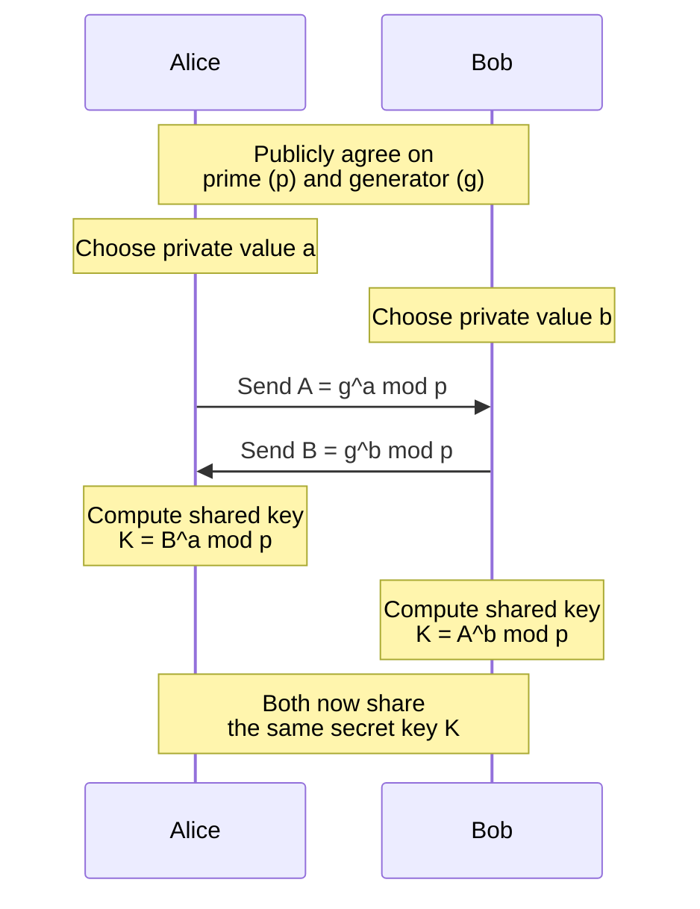
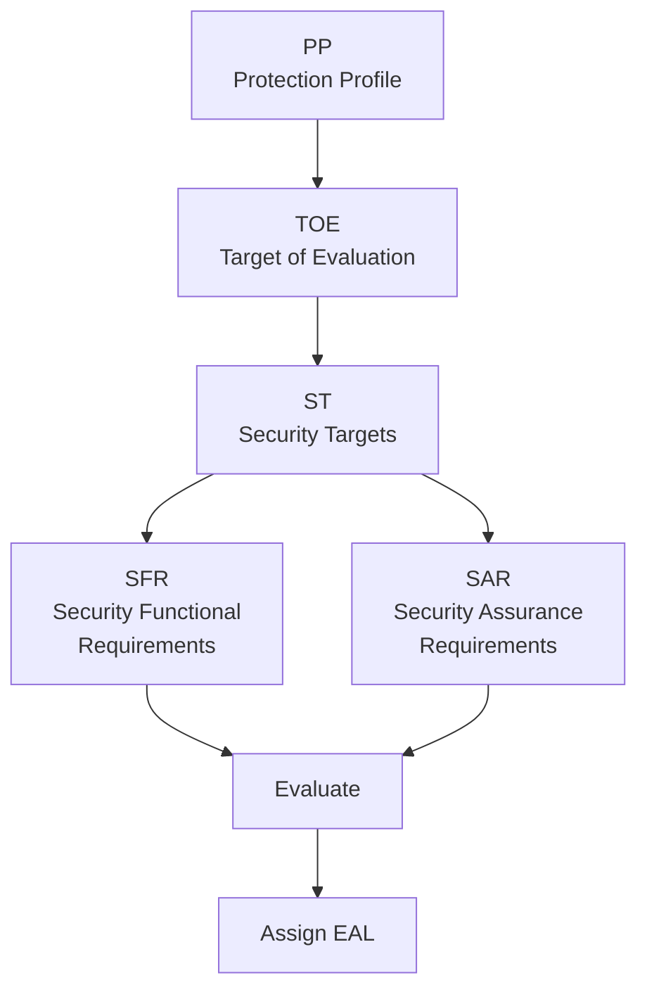
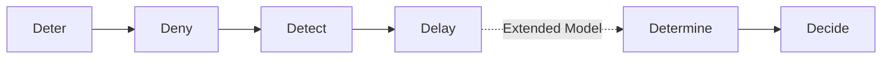
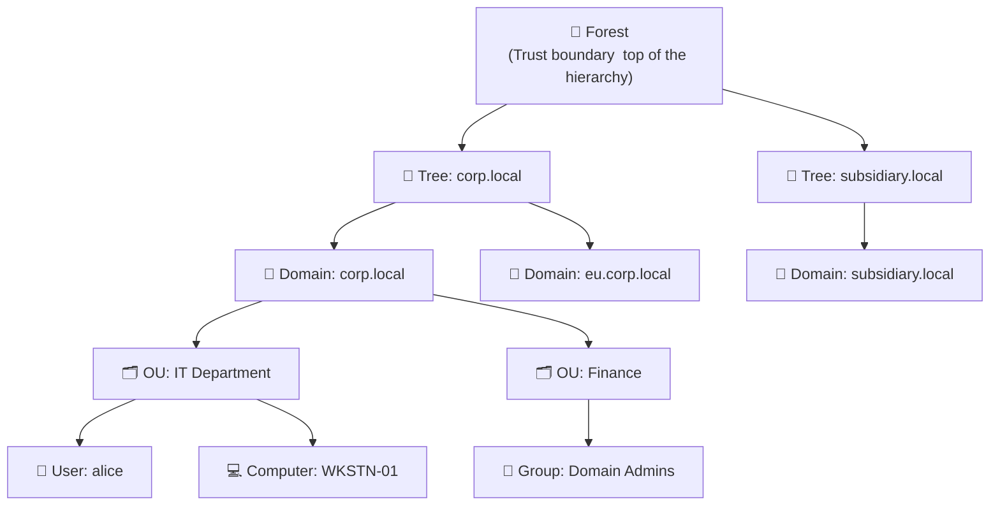
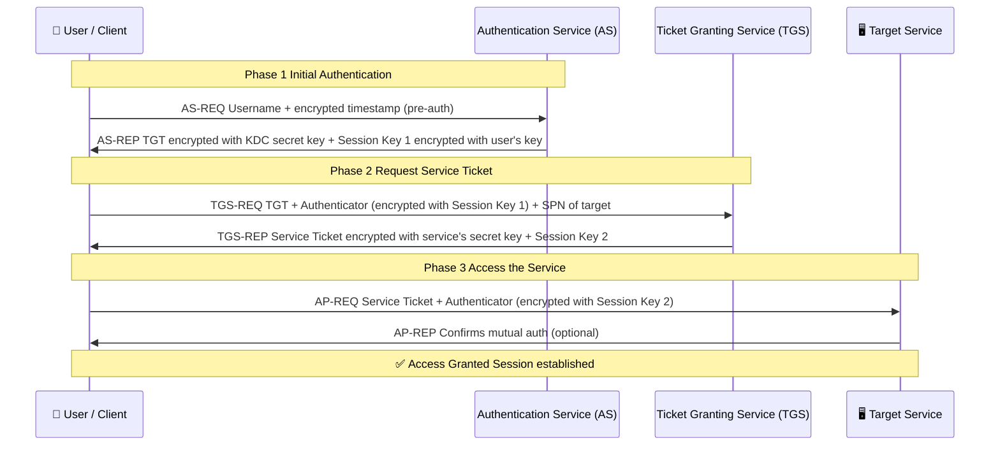
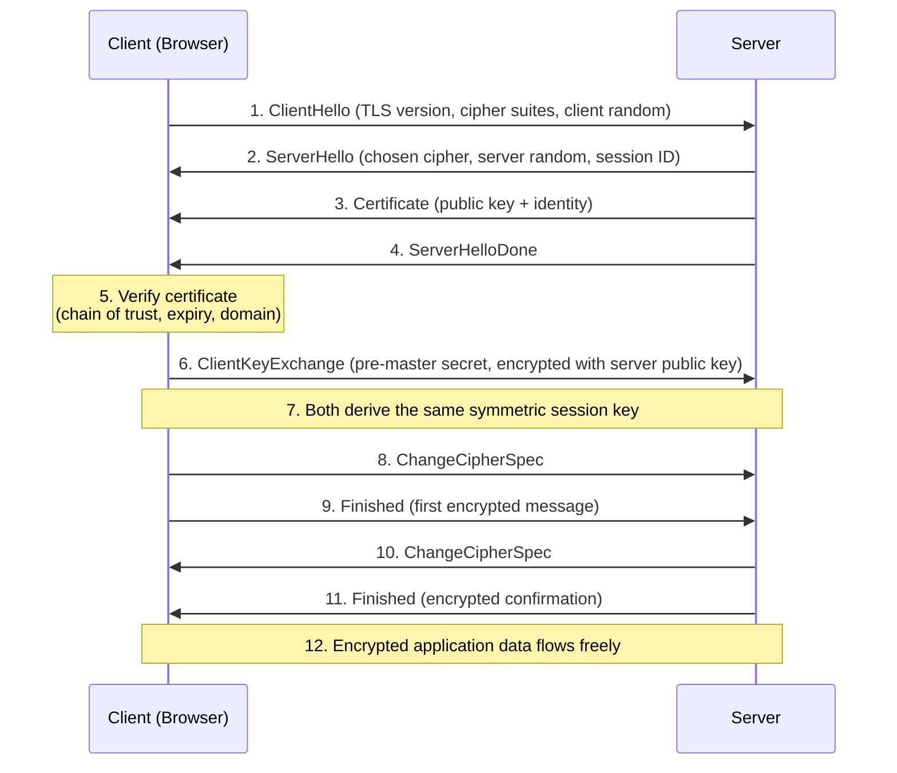

---
aliases:
tags:
source:
desc: CISSP notes based on Pete Zerger's youtube channel
references:
  - https://www.youtube.com/playlist?list=PL7XJSuT7Dq_XPK_qmYMqfiBjbtHJRWigD
title:
templateVersion: 1.1
---


- **YOU ARE NOT DOING THE WORK, YOU ARE MAKING THE RECOMMENDATIONS**
-  **Think Like a Manager**
- **During the exam, think of yourself as an outside security consultant**
- **You - advise- , you do not “do”**
- **Focus on**
    - **Strategy**
    - **Priorities**
    - **Human safety**
    - **Business continuity**
    - **Protecting profits**
    - **Reducing liability and risk**
# How to "Think like a Manager" for the CISSP Exam 
- Due diligence **DO DETECT**
	- practising the activities that maintain the due care effort.
	- research, planning, evaluation, best practices, laws, regulations
	- **THINK**
- Due care **DO CORRECT**
	- doing what a reasonable person would do in a given situation. It is sometimes called the “prudent man” rule.
	- implementation, operation, reasonable measures, security awareness training, reporting, maintenance
	- **ACT**
- Together, these will reduce senior management’s culpability & (downstream) liability when a loss occurs.
- **Know your priorities**
	- **CISO <-- THIS IS YOU!!!**
		- human safety, business continuity, protect profits, reduce liability and risk
	- - IT Manager
		- policy and planing
	- IT Engineer
		- implement and operation
- **Cost vs Value**
	- GDPR requirements will cost **$10k** to implement
	- If we dont we could potentially loose **$100K** from non-compliance
	- **$1 million fine** for non-compliance
- **Management sets direction and makes decisions**
- ![[assets/attachments/kb/training/isc2-cissp/image-1-20260307133329924.png]]
- 
# Study Notes

- Domain 1 - Security and Risk Management
	- [ ] **Documentation Types**
		- **Policies** are high-level overview of the company's security program. A policy must contain:
			- *Purpose* of the policy.
			- *Scope* of the policy.
			- *Responsibility* of the people involved.
			- *Compliance* of the policy, how to measure it, and clear consequences of non-compliance.
			- Make them short, understandable, and use clear, authoritative language, like *must* and *will*.
		- **Standards** define hardware and software that are required for use.
		- **Procedure** s explain in detail how to achieve a task, step-by-step.
		- **Guidelines** are discretionary, recommended advice to users.
		- **Baseline** s provide a security minimum, automating standards.
	- CIA Triad
		- CIA triad Confidentiality, Integrity, Availability
		- Confidentiality
			- Ensures that only authorized subjects can access objects
			- Typical mechanism access control
		- Integrity
			- Ensures data and system configurations are not modified without authorization
		-  Availability
			- Authorized requests must be granted within a reasonable amount of time
	-  [ ] ISC² Code of Ethics (PAPA)
		1. **Protect** society, the commonwealth, and the infrastructure
		2. **Act** honorably, honestly, justly, responsibly, and legally
		3. **Provide** diligent and competent service to principals
		4. **Advance** and protect the profession
	- [ ] **Security Policy Development**
		1. **Acceptable Use Policy (AUP)** : Assigns roles and responsibilities
		2. **Security Baselines**: Define minimum security levels. Implementing new safeguards = establishing a new baseline, Compliance with old baselines is not a valid decision constraint
		3. **Security Guideline**:  Offer recommendations (suggested)
		4. **Security Procedures**: Detailed step‑by‑step instructions (mandatory)
		- **WHEN DEVELOPING NEW SAFEGUARDS, YOU ARE ESTABLISHING A NEW BASELINE SO COMPLIANCE WITH EXISTING BASELINES IS NOT A VALID CONSIDERATION POINT**
	- [ ] **Due Diligence vs Due Care**
		- **Due Diligence (Do Detect)** Doing appropriate research, planning, and evaluation before decisions. “Think before you act” Activities largely before the decision is made.
		- **Due Care (Do Correct)** Doing what a reasonable person would do in a given situation (“prudent man” rule). Actions that maintain and enforce security after decisions “Actions speak louder than words”
		- Together they reduce senior management's culpability and downstream liability when a loss occurs.
		- Management Roles and Planning Horizons
		-  [ ] Roles and Risks
			- IT Engineer short-term, operational focus
			- IT Director/Manager midrange, tactical focus
			- CISO long-term, strategic focus, risk escalation point
	- [ ] Risk
		- [ ] Security Planning Horizons
			- **Strategic plan:** Long term (~5-year horizon, updated annually). Stable, includes risk assessment. **THIS IS YOU CISO!**
			- **Tactical plan:** Midterm (about 1 year), adds detail to strategic goals. IT director or manager
			- **Operational plan**: Short term (monthly/quarterly). Highly detailed, based on strategic and tactical plans, it engineers, the doers.
		- [ ] Responses to Risk
			- **Acceptance**: Do nothing; accept the risk and potential loss
			- **Mitigation**: Implement countermeasures; accept residual risk
			- **Assignment (Transfer)** : Transfer risk to a third party (e.g., insurance)
			- **Avoidance**: Stop or change an activity when mitigation/acceptance cost > benefit (If the cost is higher than the benefits of the service it doesnt make business sense)
			- **Deterrence**: Implement deterrents to discourage policy violations (audit policies, security cameras, warning signage)
			- **Rejection (Ignore)**: Ignoring risk or refusing to acknowledge it - not acceptable
			- Risk handling is an ongoing process, not one‑time.
		- [ ] Risk Categories
			- **Damage**: results in the physical loss of an asset or the inability to access the asset
			- **Disclosure** disclosing critical information regardless of where or how it was disclosed
			- **Losses**  These might be permanent or temporary and may include altered data or inaccessible data
		- [ ] Risk factors
			- **Physical** such as natural disaster, power loss or vandalism
			- **Malfunctions** like  failure of systems, networks or peripherals
			- **Attacks** such as purposeful acts whether from the inside or the outside such as authorized disclosure
			- **Human errors** such as accidental incidents
			- **Application errors** include failures of the application including the operating system
		- Risk Management Frameworks
			- [ ] **NIST SP 800‑37 - Risk Management Framework (RMF)**
				- **People Can See I Am Always Monitoring**
				  - ![[assets/attachments/kb/training/isc2-cissp/image-2.png]]
					1. **Prepare** (Get Ready) *Sometimes ignored* : Set the stage Define goals, roles, risk limits, and strategies for the organisation and specific system, like packing your toolbox before a project.
					2. **Categorize** (Classify Risks):  Label the system's info by impact if something goes wronglow, moderate, or high for confidentiality, integrity, or availabilitylike rating a bridge as minor road or highway.
					3. **Select** (Pick Controls) : Choose security measures (from NIST SP 800-53) tailored to your system's risks, environment, and needs, then document themlike selecting locks and alarms for that house.
					4. **Implement** (Put in Place) : Install those controls and record how you did it, noting any shared parts or ongoing checkslike actually building the house with those locks.
					5. **Assess** (Check It Works):  Test independently if controls do their job right, spotting gapslike an inspector verifying the house is sturdy.
					6. **Authorize** (Approve to Use): A leader reviews risks and green-lights operation, owning any leftover issueslike a homeowner signing off after inspection.
					7. **Monitor** (Keep Watching): Track changes, threats, and control performance over time, fixing issues as they pop uplike regular home maintenance to stay safe.
			- Other Risk Management Frameworks (Real-World) **(NOT IN THE EXAM)**
				- **OCTAVE** - Operationally Critical Threat, Asset, and Vulnerability Evaluation
				- **FAIR** - Factor Analysis of Information Risk
				- **TARA** - Threat Agent Risk Assessment
		- **Not every risk can be mitigated**
		- **Management must decide how risk is handled**
		- **When priorities conflict, human safety is most important**
		- **When legal issues arise, “call an attorney” is a valid answer**
		-  [ ] **Types of Risk**
			- **Residual Risk** : Risk that remains after safeguards are applied, Often what management chooses to accept
			- **Inherent Risk**: Risk that exists in the absence of controls. Newly identified, not yet addressed
			- **Total Risk**: Risk if no safeguards were implemented
			- **Residual risk** : after  controls have been applied
			- **Inherent risk**: before controls have been applied
			- **Total risk**: without any safeguards
			-  Simple Risk Formula: **Risk = Threat x Vulnerability**
			- Total Risk Formula:  **Total Risk = Threats x Vulnerabilities  x Asset Value**
		- [ ] Risk analysis
			-  Quantitative vs Qualitative
				- **Quantitative Risk Analysis** assigns dollar values to evaluate countermeasure effectiveness
					1. Inventory assets and assign a value (**asset value (AV)**).
						- **Asset Value (AV)** = $10000
					2. Identify threats. Research each asset and produce a list of all possible threats of each asset (and calculate  **Exposure Factor (EF)** and **Single Loss Expectancy (SLE)**).
						- **Exposure Factor (EF)**
							- Percentage of loss an organisation would experience if a specific asset were compromised in one incident it is expressed as a percentage!!! eg. **30% loss = 0.3**
						- **Single Loss Expectancy (SLE)**
							- Cost associated with a single realised risk against a specific asset
							- **Single Loss Expectancy (SLE) = Asset Value (AV) x Exposure Factor (EF)** 
							- Example Asset Value (AV) = $100,000, Exposure Factor (EF)** = 30% (as a decimal 0.30) → SLE = $30,000
					3. Perform a threat analysis to calculate the likelihood of each threat being realised within a single year (the **Annualised Rate of Occurrence (ARO)**).
						-  **Annualised Rate of Occurrence (ARO)**
							- Expected frequency with which a threat will occur in a single year. Once every 10 years **1 time / 10 years = 0.10**. Once a year **1 time / 1 year = 1** 
							- **BE AWARE OF AROs longer than a year!**
					4. Estimate the potential loss by calculating the annualised loss expectancy (**Annualised Loss Expectancy (ALE)**).
						- **Annualised Loss Expectancy (ALE)**
							- Possible yearly cost of all instances of a specific realised threat against an asset
							- **Annualised Loss Expectancy (ALE) = Single Loss Expectancy (SLE) x Annualised Rate of Occurrence (ARO)**
							- AV = $200,000; EF = 50% ⇒ SLE = $100,000
							- ARO = 0.10 (once every 10 years)
							- ALE = $100,000 × 0.10 = $10,000
							- The safeguards we put in place better not cost more than $10,000.
					5. Research countermeasures for each threat, and then calculate the changes to **Annualised Rate of Occurrence (ARO)** and **Annualised Loss Expectancy (ALE)** based on an applied countermeasure.
						- **Annual Cost of Safeguard (ACS)** the annual cost of the safeguard we are putting in place
					6. Perform a cost/benefit analysis of each countermeasure for each threat for each asset.
						- **Total Risk**: Risk if no safeguards were implemented
						- **Controls Gap** Amount of risk reduced by implementing safeguards, its the money we are going save. 
						- **Residual risk** is the risk that remains even after we have applied all the controls.
						- **Total risk - Controls gap = Residual risk**
							- The company buys a $500,000 insurance policy to cover risk of loss. The policy has a $75,000 deductible.
							- **(Residual Risk $75,000 deductible)= (Total Risk $500,000) - (Control Gap $425,000 is how much we save on risk due to controls)**
						- **Safeguard Evaluation
							- Good security controls mitigate risk, are transparent to users, are difficult to bypass, are cost‑effective
							- **Value of Safeguard** must always greater than zero if it is to be cost effective
								- **Value = Annualised Loss Expectancy (ALE1) - Annualised Loss Expectancy (ALE2) - Annual Cost of Safeguard (ACS)**
								- A company risks a web server breach costing **$12, 000 annually. ALE1 = $12,000**. We install a firewall which reduces our **risk to $3000 = ALE2**. The cost of the firewall is $650 per year **ACS = $650**
								- Value of safeguard = **12,000 (ALE1) - $3000 (ALE2) - $650 (ACS)** = $8, 350 value in saved costs
				- **Qualitative Risk Analysis**
					- Uses scoring systems to rank threats and controls
					- Subjective approach, it involves opinions
					- Delphi Technique-  - anonymous feedback-and-response process used to reach consensus
			-  Other Considerations
				- **Loss potential** what would be lost if a threat successfully exploits a vulnerability
				- **Delayed loss** losses that unfold over time
				- **Threat agents** cause threats by exploiting vulnerabilities
	- [ ] Supply Chain Security
		-  **Supply Chain Basics** Most services are delivered via a chain of multiple entities. A secure supply chain uses vendors who are secure, reliable, trustworthy, and reputable
		-  **Evaluating Third Parties**
			- On-site assessment visit organisation, interview staff, observe operations
			- Document exchange and review examine shared data sets and process documentation
			- Process/policy review request and review security policies and procedures
			- Third-party audit independent audit of security infrastructure
	-  [ ] **Security Controls**
		- **Safeguards** = proactive
		- **Countermeasures** = reactive
		-  **Categories of Security Controls**
			- **Technical (Logical)** : Hardware/software mechanisms (e.g., access controls, encryption)
			- **Administrative (Managerial)**: Policies, procedures, standards, guidelines
			- **Physical** :  Tangible protections (e.g., locks, fences, guards)
				- **Perimeter** : Fencing (anti-climb, 8ft+), Vehicle barriers (bollards, crash gates), Lighting (motion activated)
				- **Building Entry**: Mantraps: Two interlocking doors, Turnstiles, badging, biometrics + PIN (multi-factor)
				- **Interior**: Cipher locks, Proximity cards, Shoulder surfing protection
		-  **Types of Controls**
			- **Deterrent** - Discourage violation of security policies, audit policies, security badges, user training
			- **Preventative** - Stop unwanted or unauthorized activity from occurring, firewalls, fences, mantraps (access control vestibules)
			- **Detective** - Discover or detect unwanted or unauthorized activity, motion detectors, honey pots, mandatory job rotation
			- **Compensating** - Provide alternative mechanisms to enforce policy when primary controls are not feasible. PII is encrypted in the database but the data is transferred in plain text. Answer is to encrypt in transit as well.
			- **Corrective** - Modify environment to return systems to normal after incidents. Backup software that restores missing files automatically or antimalware which automatically removes malicious
			- **Recovery** - Extension of corrective controls with more advanced capabilities for restoration, server clustering, hot/warm sites
			- **Directive** - Direct, confine, or control actions of subjects to encourage compliance, exit signs, security policy requirements
	-  [ ] **Threat Modelling** goal eliminate or reduce threats and can be proactive or reactive
		- Focus on 
			- **Asset** - Use asset valuation to identify threats to valuable assets
			- **Attacker** - Identify potential attackers and their goals
			- **Software** - Consider threats to applications the organisation develops
		-  **STRIDE (Microsoft)**
			- ![[#STRIDE]]
		-  **PASTA (Process for Attack Simulation and Threat Analysis)**
			- ![[#PASTA]]
		-  **VAST (Visual, Agile, Simple Threat)**
			- ![[#VAST]]
		-  **DREAD**
			- ![[#DREAD]]
		-  **STRIKE**
			- Focused on acceptable risk
			- Open-source threat modelling process with a requirements model
			- Ensures risk assigned to each asset is “acceptable” to stakeholders
		-  **COBIT**
			- ![[#COBIT]]
		-  **Potential Attacks from**
			- Trust boundaries - where trust or security level changes
			- Data flow paths - movement of data between locations
			- Input points - where external input enters the system
			- Privileged operations - activities requiring higher privileges than standard users
			- Security stance and assumptions - declared security policies and foundations
		- **Intelligence in Threat Modeling**
			- **User and Entity Behavior Analytics (UEBA)**
				- Entity behaviour is collected and input into a threat model.
				- The model establishes a baseline of “normal” based on historical data.
				- Enables analysis to uncover more details around anomalous events.
				- Some platforms provide automated investigation capabilities.
			- **Threat Feeds** Often feeds of malicious entities ingested by cybersecurity tools. A single feed may be comprised of many sources, including open‑source intelligence. Entity examples IP address, website, threat actor, file hash, and more.
	- [ ] Legal and Regulatory Issues
		- **Criminal law** - prohibits acts like murder, assault, robbery, arson
		- **Civil law** - contract disputes, real estate, employment, estate, probate
		- **Administrative law** - agency-level rules with delegated authority
		-  Key US Laws and Regulations
			- **Computer Fraud and Abuse Act (CFAA)** - first major US cybercrime law
			- **Federal Sentencing Guidelines** - guidance on penalties, including for computer crimes
			- **Federal Information Security Management Act (FISMA)** - formal information security for US federal government
			- **Copyright and DMCA** - protect literary, musical, dramatic works
		- Intellectual Property and Licensing
			- **Trademarks** - words, slogans, logos identifying company or products
			- **Patents** - protection for inventions
			- **Trade secrets** - critical confidential business information
		- Licensing types
			- **Contractual** - License created through a signed, negotiated contract. Example Enterprise software agreement.
			- **Shrink-wrap** - License accepted by opening the software package. Example Boxed retail software.
			- **Click-through** - License accepted by clicking “I agree.” Example Software installation EULA.
			- **Cloud services** - License governing use of hosted, subscription services. Example SaaS agreement for Microsoft 365.
	-  [ ] Export and Privacy Regulations
		- Computer export controls - US restrictions on exports to some countries (e.g., Cuba, Iran, North Korea, Sudan, Syria)
		- Encryption export controls - Department of Commerce controls on export of encryption products
		- Privacy (US) - rooted in the Fourth Amendment (search and seizure, expectation of privacy)
		- Privacy (EU) - General Data Protection Regulation (GDPR)
		    - Not a US law
		    - Applies to companies with customers in the EU
	-  [ ] **Business Continuity Planning (BCP)**
		- BCP issues related to information security typically include
			1. Strategy development
			2. Provisions and processes
			3. Plan approval
			4. Plan implementation
			5. Training and education
	- [ ] **Disaster Recovery Plan (DRP)** the plan for recovering from a disaster impacting IT and returning the IT infrastructure to operation
	- [ ] BCP vs DRP
		- **BCP** focuses on the whole business. It covers communications and process more broadly
		- **DRP** focuses more on the technical aspects of recovery. It falls under the BCP umbrella.
	- [ ] **Continuity of Operations Plan (COOP)** the plan for continuing to do business until the IT infrastructure can be restored
	-  **Security Awareness, Education, and Training** Methods and techniques to present awareness and training, periodic content reviews, program effectiveness evaluation, goal establish and maintain a comprehensive security awareness program
	- [ ] Consequences of breaches
		- **Reputational** can result in loss of customer trust and loss of revenue, can last for many years see LastPass
		- **Identify theft** using a persons private information to impersonate that individual usually for financial gain
		- **intellectual property IP theft** might quickly cost customers, credit ratings, brand reputation. Losing IP could mean forfeiture of first-to-market advantage, loss of profitability
		- **Fines** may lead to lawsuits, failing to report a breach can result in fines that can reach in the millions of dollars, GDPR outlines fines of up to 4% of a company's annual global revenues or 20 million euros for failing to report a breach. ANY company with a customer in the EU is subject to GDPR
	- **GDPR standard breach notifications** must be reported within 72 hours. Escalations to external sources, like law enforcement or outside experts to stop/investigate breach. Other countries have their own reporting deadlines but delays are sometimes allowed for criminal investigations
	- [ ] **Security Models**
		-  ![[#Security Models]]
- Domain 2 - Asset Security
	-  [ ] **Information Life-cycle**
		- ![[#INFORMATIONLIFECYCLE]]
	- [ ] **Data Classification**
		- ![[#DATACLASSIFICATION]]
		- Data Security Controls
			- **Marking, labeling, handling, classification** - **Classification** is the most important.
			- **Data handling**  - Includes shipping, chain of custody; “don’t open boxes!”
			- **Data destruction**  - Erasing, clearing (overwriting with unclassified data).
			- **Record retention**  - If retention policy is 1 year, data is destroyed when >1 year old. Keeping the data longer than necessary can cause legal issues
			- **Tape backup security**  - Secure facility; clearly labeled tapes so everyone understands data classification.
		- Data Destruction Methods
			- **Erasing**  - A delete operation on files/media; data is typically recoverable.
			- **Clearing (Overwriting)**  - Preparing media for reuse so data cannot be recovered with standard tools.
			- **Purging**  - More intense clearing to allow reuse in less secure environments.
			- **Degaussing**   - Strong magnetic field erases data on compatible media.
			- **Destruction**  - Final lifecycle stage; most secure method of media sanitization.
		- Asset Classifications and Baselines
			- **Security Control Baseline**  A listing of controls an organisation can apply as a baseline.
			- **Asset Classifications** Asset classifications should **match** the data classifications.
		- Data Protection
			- Confidentiality is often protected through encryption (at rest and in transit).
		- Defining Sensitive Data
			- **Sensitive data** any information that is not public or unclassified.
			- **Personally Identifiable Information (PII)** Any data that can identify an individual name, SSN, birthdate/place, biometric records, etc.
			- **Protected Health Information (PHI)** Health‑related information tied to a specific person; covered by **HIPAA**
		- [ ] Data Ownership and Roles
			- ![[#DATAROLES]]
		- **GDPR Terms and Concepts**
			- GDPR Roles and Requirements
				- **Data Processor**  Person/organisation processing personal data solely on behalf of the data controller.
				- **Data Controller** - Person/organisation that determines purposes and means of processing.
				- **Data Transfer**  - GDPR restricts transfers of personal data to countries outside the EU.
			- Reducing GDPR Exposure
				- **Anonymization** Remove all relevant data so the original subject cannot be identified. If effective, GDPR no longer applies to the anonymized data.
				- **Pseudonymization** Use pseudonyms/aliases to represent data. Can lead to less stringent GDPR requirements.  Best when you still need the data but want to reduce exposure.
- [ ] Domain 3 - Security Architecture and Engineering
	- [ ] Secure Design Principles
		* **Threat Modeling** – A process for identifying, assessing, and prioritizing potential security threats to a system before they occur.
		* **Least Privilege** – Granting users or systems only the minimum access rights necessary to perform their tasks.
		* **Defense in Depth** – Implementing multiple layers of security controls to protect systems and data, so that failure of one layer doesn’t compromise the whole system.
		* **Secure Defaults** – Configuring systems and applications with the most secure settings out-of-the-box to reduce risk.
		* **Fail Securely** – Designing systems so that, if they fail, they do so in a way that preserves security rather than exposing vulnerabilities.
		* **Separation of Duties** – Dividing responsibilities among multiple people or systems to prevent fraud or misuse.
		* **Keep It Simple** – Designing systems in a straightforward, easy-to-understand way to reduce mistakes and vulnerabilities.
		* **Zero Trust** – A security model where no user or system is trusted by default, requiring verification for every access attempt. Assumes compromise; every request is verified. Treats user identity as the control plane.
		* **Privacy by Design** – Incorporating privacy and data protection measures into system design from the very beginning.
		* **Trust but Verify** – Relying on controls or claims but continuously monitoring and validating them to ensure compliance and security.
		* **Shared Responsibility** – Defining clear security responsibilities between multiple parties, often seen in cloud services where both provider and customer have roles.
	 - [ ] Cryptanalytic Attacks
		* **Threat Modeling** – A process for identifying, assessing, and prioritizing potential security threats to a system before they occur.
		* **Least Privilege** – Granting users or systems only the minimum access rights necessary to perform their tasks.
		* **Defense in Depth** – Implementing multiple layers of security controls to protect systems and data, so that failure of one layer doesn’t compromise the whole system.
		* **Secure Defaults** – Configuring systems and applications with the most secure settings out-of-the-box to reduce risk.
		* **Fail Securely** – Designing systems so that, if they fail, they do so in a way that preserves security rather than exposing vulnerabilities.
		* **Separation of Duties** – Dividing responsibilities among multiple people or systems to prevent fraud or misuse.
		* **Keep It Simple** – Designing systems in a straightforward, easy-to-understand way to reduce mistakes and vulnerabilities.
		* **Zero Trust** – A security model where no user or system is trusted by default, requiring verification for every access attempt.
		* **Privacy by Design** – Incorporating privacy and data protection measures into system design from the very beginning.
		* **Trust but Verify** – Relying on controls or claims but continuously monitoring and validating them to ensure compliance and security.
		* **Shared Responsibility** – Defining clear security responsibilities between multiple parties, often seen in cloud services where both provider and customer have roles.
	- [ ] Privacy by Design (IAPP 7 Principles)
		* **Proactive, Not Reactive; Preventative, Not Remedial** – Emphasizes anticipating and preventing privacy-invasive events before they occur, rather than reacting afterward. Organizations should proactively identify potential privacy risks.
		* **Privacy as the Default Setting** – Personal information should be automatically protected without requiring action from the user. Users should not have to adjust settings to secure their data.
		* **Privacy Embedded into Design** – Privacy must be integrated into the design and architecture of systems, services, and business practices, ensuring it is part of core functionality.
		* **Full Functionality: Positive-Sum, Not Zero-Sum** – Advocates for a balanced approach that accommodates all legitimate interests without forcing trade-offs, showing that privacy and security can coexist.
		* **End-to-End Security – Full Lifecycle Protection** – Strong security measures should be applied throughout the information lifecycle, including secure processing and secure destruction when data is no longer needed.
		* **Visibility and Transparency – Keep it Open** – Organizations should operate transparently, ensuring practices are open and verifiable. Individuals should know what personal information is collected and why.
		* **Respect for User Privacy – Keep it User-Centric** – Individuals’ interests should be prioritized in the design and implementation of systems and services, emphasizing user privacy in all decisions.
	- Keep It Simple
		- Complexity is the worst enemy of security.
		- Best‑in‑suite solutions may simplify defense‑in‑depth.
		- Simplicity reduces configuration mistakes and enables incremental improvement.
	-  [ ] Shared Responsibility (Cloud)
		- ![[#CLOUDSHAREDRESPONSIBILITY]]
				- **FaaS / Serverless** are event-driven functions where you only manage the functions and the business logic. Examples AWS Lambda, Azure Functions, Google Cloud Functions. You pay **per execution**
				- **Containerization (Simple)**
					- Containerization packages an app **with everything it needs to run**
					- That package is called a **container**, the app runs the **same everywhere** Laptop, Server, Cloud, they share the host operating system using Linux, need isolation at host, process, network and storage levels, this is dev ops security
				- **APIs (SOAP or REST)** is a set of exposed interfaces that allow programmatic interaction between services. REST is the most used now
				- **Embedded systems** IOT devices, a full computer system embedded inside another system. Watches, medical devices, cameras, 
				- **High performance performing** - an alternative to client server computing model for computer intensive operations with large data sets, example SETI
				- **Edge computing** some compute operations require processing activities to occur locally and not in the cloud, common in various internet of things like agriculture, military, science
				- **Fog computing**  places gateway devices in the field to collect and correlate data centrally at the edge.
			  - Cloud Deployment Models
				- **Public cloud**  provider hardware; scalability, agility, pay‑as‑you‑go, minimal maintenance.
				- **Private cloud**  hosted in your own data center; strong control, compliance, legacy support.
				- **Hybrid cloud**  mix of public and private; flexibility for legacy, compliance, and scaling scenarios.
		- **Cloud Access Security Broker  (CASB)**  policy enforcement point on‑prem or in cloud;  helps control shadow IT
		- **Security‑as‑a‑Service (Security‑aaS)** cloud‑provided security delivered via online provider.
		- **Security Information Event Management (SIEM)** system that collects data from many other sources within the network; provides real time monitoring, traffic analysis & notification of potential attacks
		- **Security Orchestration Automation and Response (SOAR)** centralized alert and response automation with threat specific playbooks, response may be fully automated or single-click
	- Post‑Quantum Cryptography
		- New cryptographic approaches that run on classical computers but resist attacks from quantum computers.
		- [ ] **Symmetric vs Asymmetric Under Quantum**
			- **Symmetric (shared key, bulk encryption)**
			    - Grover’s algorithm halves effective key length.
			    - 256‑bit symmetric ≈ 128‑bit security against quantum.
			    - Doubling symmetric key length greatly increases brute‑force cost.
			- **Asymmetric (public key key exchange, signatures)**
			    - Shor’s algorithm breaks schemes based on factoring and discrete logs.
			    - RSA and ECC are vulnerable.
			    - Lattice‑based schemes offer resistance.
			- **Lattice‑Based Cryptography**
				- Based on shortest/closest vector problems in a mathematical lattice (3D grid of points).
				- Candidates to replace endangered public‑key schemes.
				- Represent most current research in post‑quantum cryptography.
			- **Elliptic Curve** 
				- ECC is a newer form of asymmetric encryption. 
				- The benefit is you can use smaller keys, which is great for mobile devices. Quantum computing would put a hurtin' on this implementation.
			- **Exam tip** If asked which public‑key type is “quantum‑resistant,” answer lattice‑based.
	- [ ] Cryptography
		- **Code** symbol system operating on words/phrases; may not always provide confidentiality.
		- **Cipher** always intended to hide meaning of a message (confidentiality).
		- **Stream cipher**  Symmetric; encrypts one digit/bit at a time with a pseudorandom keystream.
		- **Block cipher** Symmetric; encrypts fixed‑size data blocks as units.
		- **Substitution cipher** Replace each character/bit with another (e.g., Caesar cipher).
		- **Transposition cipher** Rearranges characters of plaintext to form ciphertext.
		- **Initialization Vector (IV)**  - Random nonce XORed with data to reduce predictability/repeatability; usually same size as block or key.
		- **Caesar, Vigenère, One‑Time Pad**  - main difference is key length. Caesar key length 1. Vigenère key is word/sentence. One‑time pad key as long as message; theoretically unbreakable if used correctly.
		- **One-Time Pad (OTP)**
				- Symmetric encryption method, uses a **truly random key**, key is **as long as the message**, key is **used only once**, Perfectly secure if used correctly
				- Impractical due to key management
				- One‑Time Pad Success Conditions (all must be true) Key truly random, no pattern. Key at least as long as message. Key kept secret (protected from disclosure). Each pad/key used once and discarded.
				- rarely used due to key generation, Secure key distribution, Key storage, Rarely used in practice due to these limitations
		- **Zero‑Knowledge Proof** Prove knowledge of a secret without revealing the secret itself (similar conceptual use as with signatures/certificates).
		- **Split Knowledge** Information/privilege is divided so no single person can complete a sensitive operation alone.
		- **Work Factor / Work Function**  Measure of effort (time/cost) to break a cryptosystem via brute force eg. how long to brute force password
		- **Key Security**  Keys provide secrecy; modern systems typically use **≥128‑bit keys.** Key length needs may change as technology (including quantum) advances.
		- **Symmetric vs Asymmetric Cryptography**
			- **Symmetric (shared secret)**: **faster** good for bulk encryption. Poor scalability and distribution; no built‑in nonrepudiation.
			- **Asymmetric (public/private key pairs)**: **stronger** Supports scalability, easier key distribution, and nonrepudiation. Slower; often used for key exchange and signatures. Public keys are shared among communicating parties, private keys are kept secret
			- **Data encrypt/decrypt**
				- to encrypt a message you use the senders public key
				- to decrypt a message you use your own private key
			- **Digital Signatures**
				- To sign a message you use your private key. To validate a signature you use the senders public key
					- 
					  ```mermaid
						sequenceDiagram
						participant Franco
						participant Maria
						
						Franco->>Maria: Requests public key
						Maria->>Franco: Sends public key
						Franco->>Maria: Encrypts message with Maria's public key and sends it
						Maria->>Maria: Decrypts message using her private key
					  ```
		- **Confidentiality** keep data secret at rest and in transit.
		- **Integrity** assure data not altered between creation and access.
		- **Nonrepudiation** prove sender actually authored a message and cannot credibly deny it.
		- **XOR Cipher Basics**  XOR (exclusive‑OR) flips bits based on key. if bits match → 0, otherwise → 1. eg 0 ⊕ 0 = 0  |  0 ⊕ 1 = 1  | - 1 ⊕ 0 = 1  | - 1 ⊕ 1 = 0  
		- **DES / 3DES Modes**
			- **Electronic Codebook (ECB)** simplest; identical plaintext blocks create identical ciphertext blocks which is bad! least secure.
			- **Cipher Block Chaining (CBC)** XOR each plaintext block with prior ciphertext block.
			- **Cipher Feedback (CFB)** streaming version of CBC; uses buffers; **chaining so errors propagate**.
			- **Output Feedback (OFB)** like CFB but uses seed; no chaining; errors don’t propagate.
			- **Counter Mode (CTR)** uses incrementing counter as input; errors don’t propagate.
			- **3DES is DES x 3 using two or three keys to length of 112 168 bits**
		- **Key clustering**  a weakness in cryptography where a plain text message generates identical ciphertext messages using the same algorithm but using different keys. its a collision
		- **Cryptographic Salts** Salts random data added before hashing (e.g., to passwords). Defeat rainbow tables and reduce hash precomputation attack effectiveness.
		- **Hash** Input of any length generates fixed‑length output. Easy to compute, one‑way and should be **Collision‑free (two different inputs generates the same output)**
		- **Digital Signature Standard (DSS)**
			- Use public‑key cryptography + hash functions.
			- FIPS 186‑4 DSS requires SHA‑2 hash functions.
			- Approved algorithms
			    - **Digital Signature Standard (DSA)**
			    - **Rivest, Shamir, Aldeman (RSA)** (for signatures)
			    - **Elliptic Curve Digital Signature Algorithm (DSA) (ECDSA)** (elliptic curve DSA)
		- **Public Key Infrastructure (PKI)** 
			- ![[#PKI Public Key Infrastructure]]
		- **Protocols and Traffic Security**
			- Web HTTP over TLS is the standard (SSL largely replaced).
			- Email **S/MIME** and **Pretty Good Privacy (PGP)**.
			- Network 
				- ![[#IPSEC]]
		- Common Cryptographic Attacks and DRM
			- **Brute force** (search key space).
			- **Known plaintext, chosen plaintext, chosen ciphertext.**
			- **Meet‑in‑the‑middle** (two‑round encryption).
			- **Man‑in‑the‑middle**
			- **Birthday attack (hash collisions).**
			- **Replay attacks (reuse authentication data)**
		- **Digital Rights Management (DRM)** Enforces content usage restrictions and is common for media music, movies, e‑books. Sometimes used in enterprises to protect sensitive documents.
		- Algorithms
		    ![[#ALGORITHMS]]
		- **Rivest, Shamir, Aldeman (RSA)** depends on the difficult of factoring the product of prime numbers
		- **El Gamal** extension of the Diffie-Hellman key exchange algorithm that dpends on modular arithmetic (less common now)
		- **Elliptic curve**  depends on the elliptic curve discrete logarithm problem and provides more security than other algorithms when both are used with keys of the same length
		- [ ] Diffie-Hellman
		      ![[#Diffie-Hellman]]
	- [ ] **Security Modes of Operation**
		- **Dedicated mode** all users need clearance, approval, and need‑to‑know for **all** data.
		- **System high** all users cleared/approved for all data, but need‑to‑know for only some.
		- **Multilevel** supports multiple levels even when not all users cleared for all data.
		- **Compartmented** like system high plus need‑to‑know for each compartment accessed.
	- Trusted Computing Base and Evaluation
		- **Trusted Computing Base (TCB)** 
			-The set of all hardware, software, and firmware critical to enforcing a system’s security policy.
			![[assets/attachments/kb/training/isc2-cissp/image-47.png]]
			- If the TCB is trusted and correct, the system’s security can be trusted
			- Think of a conditional access request, is the hardware trusted, is the software up to date, and you have permissions you can access that file
			- **Reference Monitor Concept** Subject accessing an object through some sort of mediation based on a set of rules and all this is logged and monitored. 
			  ![[assets/attachments/kb/training/isc2-cissp/image-54.png]]
				- **Security kernel** controls that access.
					- **Completeness**: a subject is never able to bypass
					- **Isolation**: the rules are tamper proof
					- **Verifiably**: logging and monitoring to that the mediation is working correctly
				- **Security perimeter** conceptual boundary separating TCB from rest of system.
			- TCB must provide secure channels **"trusted paths"** for subject interaction
		- **Trusted Platform Module (TPM)**
			- Hardware chip storing cryptographic keys, certificates, passwords.
			- Provides **secure boot**, **measured boot**, **remote attestation**.
			- *Example*: Laptop TPM measures boot components; if tampered, won't decrypt BitLocker data.
		- **Hardware Security Module (HSM)**
			- Dedicated crypto appliance for key generation, storage, and operations.
			- Used for CA operations, payment processing (PCI HSM).
			- *Example*: Bank's HSM generates unique PIN encryption keys for every ATM card.
		- **Secure Enclaves**
			- Intel SGX, ARM TrustZone: Isolated CPU regions for sensitive computations.
			- *Example*: Apple Touch ID processes fingerprint data inside Secure Enclave, never exposing raw biometric data.
	- [ ] **Evaluation Standards**
		- ![[#EvaluationCriteria]]
	- **Covert Channels**
		- Unintended communication paths not normally used or controlled. Types include  **covert timing** and **covert storage** and are hard to detect because outside normal comms. Example steganography
	- [ ] **Access Control Types and Models**
	 ![[#Access Control Types]]
	- **Open systems** standards‑based, easier to integrate.
	- **Closed systems** proprietary, harder to integrate.
	- **Ensuring CIA at System Level**
		- **Confinement** process can access only its own memory.
		- **Bounds** memory limits process cannot exceed.
		- **Isolation** process confined within defined bounds.
	- **MFA Factors**
		- **Something you know** – Password, PIN, passphrase.
		- **Something you have** – Smart card, OTP token, phone, FIDO2 key.
		- **Something you are** – Biometric (fingerprint, iris, face).
		- **Somewhere you are** – Location, IP range, GPS.
		- **Something you do** – Keystroke dynamics, behavioral patterns.
	- **Authentication** and **Authorization**
		- **AuthN** checks credentials (passwords, biometrics) to confirm identity. OpenID Connect, SAML, LDAP
		- **AuthZ** checks policies (RBAC, ACLs) to enforce permissions. OATH 2.0, RBAC, ABAC
	- **OS / Hardware Concepts**
		- **Multitasking** OS runs multiple applications concurrently.
		- **Multithreading** multiple tasks within one process.
		- **Multiprocessing** multiple CPUs used for performance.
		- **Multiprogramming** mainframe style multi‑app execution.
		- **Processor States** Single‑state vs multistate processors (one vs multiple security levels at once).
		- Operating Modes
			- **User mode** limited instructions for applications.
			- **Privileged mode** kernel/system/supervisory - full control
		- **Memory Types**
			- **ROM** read‑only, factory‑burned.
			- **RAM** SRAM (flip‑flops), DRAM (capacitors).
			- **PROM** programmable once.
			- **EPROM** erasable via **UV light (UVEPROM)** or **electric voltage (EEPROM)**
			- **Flash** EEPROM‑derived, nonvolatile and rewritable.
		- **Storage Security**
			- **Primary storage** = memory.
			- **Secondary storage** magnetic/flash/optical; must be read into memory to use.
			- **Issues**
				- Removable media can exfiltrate data.
				- Need access controls and encryption.
				- Data remnants persist after delete/format.
				- Input/output devices can be tapped, used for data theft, or become covert channels.
		- **Firmware** ROM‑stored software that starts a system and drives peripherals (e.g., printer firmware).
	- **vulnerabilities, threats countermeasures**
		- **Process isolation** ensures that individual processes can access only their own data
		- **Layering** creates different realms of security within a process and limits communication between them.
		- **Abstraction** creates "black-box" interfaces for programmers to use without requiring knowledge of an algorithms or device's inner workings.
		- **Data hiding** prevents information from being read om a different security level. Hardware segmentation enforces process Isolation with physical controls.
	- **Security Policy Role** Guides design, implementation, testing, maintenance of systems.
	- **Cloud Computing Risks** Processing and storage in provider infra (Azure, AWS, GCP). Data risk if provider’s security doesn’t match organisational standards.
	- **Hypervisors**
		- **Type I** bare‑metal; installed directly on hardware.
		- **Type II** hosted; runs on top of an OS.
	- **Smart devices** customisation mobile devices with app installs and local/cloud AI.
	- **IoT** internet‑connected devices enabling automation, remote control, and AI.
	- **Mobile and BYOD**
		- **Mobile device security** encryption, remote wipe, lockouts, GPS,  app control
		- **Mobile app security** key/credential management,  auth, geotagging,  encryption, whitelisting, transitive trust
		- **BYOD** uses personal devices at work;  boosts productivity but increases risk.
	- **Embedded Systems and Static Environments**
		- **Embedded** limited‑function components in larger systems.
		- **Static** fixed configurations for specific purposes.
		- **Security measures** segmentation, layers, app firewalls, manual updates, firmware control, redundancy/diversity.
	- **Functional Order of Security Controls**
	  ![[#Order of Security Controls]]
			- **Deter** → **Deny** → **Detect** → **Delay** (plus **Determine** → **Decide** in extended model)
	- **Physical Security** If attackers gain physical access, they can do almost anything therefore **NO SECURITY WITHOUT PHYSICAL SECURITY**
		- Control Categories
			- **Administrative (management)** facility selection, site management, personnel, awareness, emergency plans, policies
				- **Site selection and facility design** consider visibility, surroundings, access, natural disasters. Design for required security before construction (place high‑value assets centrally; restricted access areas around them)
			- **Logical (technical)** access control, IDS, alarms, CCTV, HVAC, power, fire detection/suppression.
			- **Physical** fences, lights, locks, construction, mantraps (access control vestibules), guards, dogs.
				- **Fence heights**  3-4 ft deter casual; 6-7 ft hard to climb; **8 ft + barbed wire deters intruders**
				- **Lighting** standard is illumination of 2 feet of candlepower at a height of 8 feet
				- **Temperature** ideal 60-75°F; storage media damaged near 100°F; electronics damaged at higher temps.
				- **Humidity** 40-60% to avoid corrosion and static (static can reach 20,000 V).
				- **Threats to Physical Controls**
					- **Propped doors**, bypassing locks.
					- **Masquerading** (using someone else’s ID).
					- **Piggybacking** (tailgating through doors).
					- Mitigation guards, monitoring.
				- **Locks and Entry Controls**
					- Electronic/cipher locks - something you **know**.
					- Key cards - something you **have**.
					- Biometrics - something you **are**.
					- **Conventional locks** Standard locks that can be opened with the correct key but are vulnerable to picking, bumping, or unauthorized manipulation.
					- **Pick- and bump-resistant locks** Designed with mechanisms (e.g., spool pins, security pins, reinforced cylinders) to resist lock picking and key bumping attacks.
	- **Fire Classes and Suppression**
	  ![[#Fire Classes and Suppression]]
	- **Voltage and noise** 
		- **Electromagnetic interference**
			• **Common mode noise**. Generated by the difference in power between the hot and ground wires of a power source operating electrical equipment 
			• **Traverse mode noise**. Generated by a difference in power in the hot and neutral wires of a power source operating electrical equipment
		- **Radio frequency interference (RFI)** is the source of interference that is generated by electrical appliances, light sources, electrical cables and circuits, and so on.
		- **Uninterruptible Power Supply (UPS)** an electrical device providing emergency backup power via batteries during mains failures, protecting equipment from surges, brownouts, and shutdowns
	- **Wiring Closet Security** Need strong physical protection due to central point for cables, switches, routers. Theft, cable cutting, bugging
	- **Visitor and Media Handling**
		- **Visitors** escorts, monitoring, logging.
		- **Media storage** lockable storage, custodians, check‑in/out, sanitation.
		- **Evidence storage** secure, isolated, offline, with access control and hash/encryption controls.
	- **Audit Trails and Clean Power** are critical to reconstructing the events of an incident
			- Audit logs and access logs (manually or automatically generated) plus CCTV help reconstruct incidents.
			- UPS  smooths noise, provides temporary power in failures.
- [ ] Domain 4 - Communication and Network Security
    - [ ] **Micro-segmentation**
        - **Software Defined Networks (SDN)**
	        - a network approach that enables the network to be intelligently and centrally controlled or programmed using software
	        - ![[assets/attachments/kb/training/isc2-cissp/image-18.png]]
	        - can reprogram the data plane at anytime
	        - separating the control plane from the data plane opens a number of security challenges
		        - man in the middle attacks
		        - denial of service
		        - **SECURE WITH TLS**
        - **Virtual eXtensible Local Area Network (VXLAN)**
	        - network virtualisation enabling network segmentation at high scale
	        - overcomes vlan scale limitations
	        - tunning protocol
	        -  Network virtualization enabling network **segmentation** at high scale.
		    - Overcomes VLAN scale limitations VLAN limit is 4096 versus millions of VXLANs.
			- Tunneling protocol that encapsulates an Ethernet frame (layer 2) in a UDP packet.
		    - Layer 2 can generally only be attacked from within (for example, MAC spoofing or flooding to cause DoS) by a rogue host.
		    - Explained in RFC 7348, the VXLAN RFC.
        - **Software-Defined Wide Area Network (SD-WAN)**
	        - enables users in branch offices to remotely connect to an enterprise's network enables use of many network services  to securely connect users to applications. Security is based largely on IP security (IPsec), VPN tunnels, next-gen firewalls (NGFWs), and the micro-segmentation of application traffic
	           ![[assets/attachments/kb/training/isc2-cissp/image-17.png]]
    - [ ] **Wireless Networks**
		- **LiFi – Light Fidelity (network architectures)** Uses modulation of light intensity (LED) to transmit data. Can safely function in areas susceptible to electromagnetic interference. Can theoretically transmit at speeds up to 100 Gbit/s. Requires working LED lights. Visible light cannot penetrate opaque walls.
		- **Zigbee – Personal Area Network (PAN) (network architectures)** Short‑range wireless PAN technology for automation, M2M communication, remote control, and monitoring of IoT devices. Supports both centralized and distributed security models and mesh topology. Assumes symmetric keys are transmitted securely (encrypted in transit). During pre‑configuration, a single key might be sent unprotected, creating brief vulnerability. Example IoT smart home hub.
		- **5G (5th Generation Cellular)** Faster speeds and lower latency than 4G. Unlike 4G, 5G does not identify each user solely through a SIM; can assign identities to each device. Some air interface threats (for example, session hijacking) are addressed in 5G. 5G works alongside older tech (3G/4G), so old vulnerabilities may be targeted.
			    - **Standalone (SA) 5G** is more secure than non‑standalone (NSA) 5G.
			    - **Non-Standalone (NSA) 5G** anchors to the 4G core by using the existing 4G Evolved Packet Core (EPC) to manage control signaling and mobility, while utilizing the 5G New Radio (NR) for enhanced user data throughput. This architecture, often referred to as Option 3, allows operators to deploy 5G services rapidly by leveraging existing infrastructure
		    -**THREAT** Massive IoT scale on 5G makes DDoS a concern.
	- **Content Delivery Networks (CDN)** Geographically distributed network of proxy servers and data centers. Goal fast, highly available content delivery by distributing content close to users. CDN vendors often offer DDoS protection and web application firewalls (WAF).
		- **THREAT** - CDNs serving JavaScript have been targeted to inject malicious content into pages.
	- [ ] **OSI model**
		- ![[#OSI TCP/IP Model]]
	- [ ] **Common TCP/UDP ports**
		- ![[#Common Ports]]
	- [ ] **TCP vs UDP**
		- **Transmission Control Protocol (TCP)**: Connection-oriented; ensures data is delivered reliably, in order, and retransmits lost packets. Has error detection. Each unit is called a segment
		- **User Datagram Protocol (UDP)**: Connectionless; sends data without guarantees, making it faster but less reliable. Limited error detection. Each unit is called a datagram
	- [ ] **Cabling types & throughput**
	    - **UTP** = unshielded twisted pair.
	    - **UTP** categories (CAT3–CAT6a) with increasing data rates and typical Ethernet use.
	- [ ] **Network topologies**
		- ![[#Network Topologies]]
	   - **Analog vs digital communication**
	    - **Analog**
	        - Continuous signal varying in frequency, amplitude, phase, voltage, etc.
	        - Produces wave‑shaped signal.
	        - Susceptible to attenuation and interference over long distances.
	    - **Digital**
	        - Discontinuous electrical signal with on/off pulses.
	        - More reliable over distance and interference due to definitive state storage.
	        - Voltage “on” = 1, “off” = 0; creates binary data stream.
	- [ ] **Synchronous vs asynchronous**
	    - **Synchronous** Uses timing/clocking mechanism or timestamp in data stream. Supports high data transfer rates.
	    - **Asynchronous** Uses start and stop delimiter bits. Best for smaller amounts of data. Many communications (PSTN modems, networking) may operate synchronous or asynchronous.
	- [ ] **Baseband** Single communication channel. uses direct current; high level = 1, low level = 0. Digital signal. Example Ethernet (baseband).
	- [ ] **Broadband** Multiple simultaneous signals via frequency modulation. Each channel supports a distinct communication session.Analog signal, suitable for high throughput and multiplexing. Examples TV, cable modem, ISDN, DSL, T1, T3.
	- [ ] **Broadcast, multicast, unicast**
	    - **Broadcast** one sender, all possible recipients.
	    - **Multicast** one sender, multiple specific recipients.
	    - **Unicast** one sender to a single specific recipient.
	- [ ] **CSMA, CSMA/CA, CSMA/CD (Carrier Sense Multiple Access)**
		- **CSMA** stations sense medium before transmitting, reducing collision chance; does not directly address collisions.
	    - **CSMA/CA (Collision Avoidance)** attempts to avoid collisions by granting only a single permission to transmit at a time; common in wireless (802.11). think ring
	    - **CSMA/CD (Collision Detection)**  detects collisions and requires stations to wait random time before retransmitting; used in wired Ethernet (802.3).
	    - **CSMA/CD vs CSMA/CA**
	        - CSMA/CD effective after collision; CSMA/CA effective before collision.
	        - Wired vs wireless usage, recovery vs prevention, efficiency differences.
	- [ ] **Token passing vs polling**
	    - **Token passing** Uses a digital token; holder transmits and then passes token.**Prevents collisions in ring networks.**
		- **Polling** master–slave configuration. Primary system polls each secondary to see if it needs to transmit. Used by **synchronous data link controlling (SLDC)**
	- [ ] **Network segmentation**
		    - **Intranet** private network hosting same information services as Internet.
		    - **Extranet** section of internal network that also serves info to public Internet.
		    - **DeMilitarised Zone (DMZ)** extranet for public consumption, between Internet and intranet; used to control traffic and isolate static/sensitive environments.
			- Reasons for network segmentation
			    - Boosting performance place frequently communicating systems in same segment.
			    - Reducing communication problems contain congestion and broadcast storms.
			    - Providing security isolate traffic and user access to authorized segments.
	- [ ] **Bluetooth (IEEE 802.15)**
	    - Personal area network (PAN) technology; security concern.
	    - Connects headsets, mice, keyboards, GPS, other devices.
	    - Uses pairing device scans 2.4 GHz frequencies.
	    - Pairing uses 4‑digit code (often 0000), reducing accidental pairing but not secure.
		- Mobile system attacks (Bluetooth)
			- [Bluebugging](https://en.wikipedia.org/wiki/Bluebugging): the process to infect a device and allow the attacker to listen in.
			- [Bluejacking](https://en.wikipedia.org/wiki/Bluejacking): the sending of unsolicited messages via Bluetooth.
			- [Bluesnarfing](https://en.wikipedia.org/wiki/Bluesnarfing): the unauthorized access of information from a device through.
	- [ ] **Wireless technologies – 
		- 802.11 variants

	| Standard      | Wi-Fi Generation | Frequency Band(s)     | Max Theoretical Data Rate | Key Features / Notes                                 |
	| ------------- | ---------------- | --------------------- | ------------------------- | ---------------------------------------------------- |
	| 802.11 (1997) | Legacy           | 2.4 GHz               | 2 Mbps                    | Original Wi-Fi standard                              |
	| 802.11a       | Wi-Fi 2          | 5 GHz                 | 54 Mbps                   | OFDM, less interference than 2.4 GHz                 |
	| 802.11b       | Wi-Fi 1          | 2.4 GHz               | 11 Mbps                   | DSSS, longer range than 11a                          |
	| 802.11g       | Wi-Fi 3          | 2.4 GHz               | 54 Mbps                   | OFDM in 2.4 GHz                                      |
	| 802.11n       | Wi-Fi 4          | 2.4 GHz & 5 GHz       | 600 Mbps                  | MIMO, channel bonding (40 MHz)                       |
	| 802.11ac      | Wi-Fi 5          | 5 GHz                 | 6.9 Gbps                  | MU-MIMO, 80/160 MHz channels                         |
	| 802.11ax      | Wi-Fi 6 / 6E     | 2.4 GHz, 5 GHz, 6 GHz | 9.6 Gbps                  | OFDMA, MU-MIMO uplink/downlink, better efficiency    |
	| 802.11be      | Wi-Fi 7          | 2.4 GHz, 5 GHz, 6 GHz | ~46 Gbps                  | 320 MHz channels, Multi-Link Operation (MLO), 4K QAM |
	| 802.11ad      | WiGig            | 60 GHz                | 7 Gbps                    | Very short range, high throughput                    |
	| 802.11ay      | Enhanced WiGig   | 60 GHz                | 20–40 Gbps                | Channel bonding at 60 GHz                            |
	| 802.11ah      | HaLow            | Sub-1 GHz             | ~347 Mbps                 | Long range, IoT focus                                |
	| 802.11af      | White-Fi         | TV White Space        | ~400 Mbps                 | Uses unused TV spectrum                              |
	| 802.11p       | WAVE             | 5.9 GHz               | 27 Mbps                   | Vehicle-to-vehicle communication                     |
	
	- [ ] **Wireless Security Standards**
		- **WEP**: Broken, uses RC4, insecure. Fails due to poor key management, short 24-bit IV reuse, static shared keys, and weak integrity protection (CRC-32). Easily cracked in minutes. Provides no real confidentiality today.
		- **WPA** : Transitional replacement for WEP. Uses TKIP (still RC4-based). Vulnerable to packet injection and MIC attacks. Deprecated and not compliant with modern security standards.
		- **WPA2**: Based on 802.11i (RSN). Uses AES-CCMP for strong encryption. Secure when configured properly. WPA2-PSK is vulnerable to offline dictionary attacks if weak passwords are used. Widely deployed but gradually being replaced by WPA3.
		- **WPA3**: Replaces PSK handshake with SAE (Simultaneous Authentication of Equals). Resists offline brute-force attacks, provides forward secrecy, mandates Protected Management Frames, and supports stronger cryptography (GCMP-256 in Enterprise mode). Preferred modern standard.
		- **PSK** vs **Enterprise**
			- **PSK** = single shared password, no individual accountability, difficult key rotation.
			- **Enterprise** = 802.1X with RADIUS, per-user credentials, centralized authentication, better auditing, scalable and more secure for business environments.
		- **802.1X:** Port-based Network Access Control (PNAC). Uses a supplicant (client), authenticator (AP/switch), and authentication server (RADIUS). Enables per-user authentication before granting network access. Foundation of Enterprise Wi-Fi security.
		- **EAP: Extensible Authentication Protocol** framework used within 802.1X. Supports multiple methods (EAP-TLS, PEAP, EAP-TTLS). Allows certificate-based or credential-based authentication and provides strong identity verification options.
		- **Management Frame Protection (802.11w):** Protects management frames (deauthentication, disassociation) from spoofing attacks. Prevents common Wi-Fi denial-of-service techniques. Mandatory in WPA3, optional in WPA2.
		- **Service Set Identifier (SSID)** Wireless networks announce SSID regularly with beacon frames. When SSID is broadcast, devices can auto‑detect and connect. Hiding SSID is “security through obscurity” and detectable via client traffic.
		- **TKIP – Temporal Key Integrity Protocol** Replacement for WEP without hardware replacement. Implemented in 802.11 as **WPA (Wi‑Fi Protected Access)**.
		- **Counter Mode with Cipher Block Chaining Message Authentication Code Protocol (CCMP)** Created to replace WEP and TKIP/WPA. Uses AES with 128‑bit key. Used with WPA2, which replaced WEP and WPA.
		- **WPA2** Uses CCMP as new encryption scheme based on AES.
	    - **Fibre Channel** network data storage (SAN/NAS) for high‑speed file transfers.
		- **FCoE (Fibre Channel over Ethernet)**  encapsulates Fibre Channel over Ethernet.
		- **Internet Small Computer System Interface (iSCSI)** Networking storage standard based on IP.
		- **Site survey (wireless)** Process of investigating presence, strength, reach of wireless access points. Typically walk environment with portable wireless device, note signal strength, map onto building schematic.
	    - **Extensible Authentication Protocol (EAP)** authentication framework, allowing new methods across existing wireless or point‑to‑point links.
		- **PEAP (Protected EAP)** encapsulates EAP within a TLS tunnel for authentication and possible encryption.
		- **LEAP (Lightweight EAP)** Cisco proprietary alternative to TKIP for WPA, created to address TKIP deficiencies before 802.11i/WPA2 standard.
		- **MAC filtering**  List of authorised wireless client interface MAC addresses. Wireless AP uses list to block non‑authorized devices.
		- **Captive portals**  Authentication technique redirecting a newly connected wireless web client to an access control page.
	- [ ] **Antenna types**
		- [[assets/attachments/kb/training/isc2-cissp/image-24.png]]
	    - **Loop** reaches multiple frequencies; used for TV and RFID; omnidirectional if horizontally mounted.
	    - **Monopole** omnidirectional around its axis.
	    - **Dipole** essentially two monopoles; omnidirectional; powerful signal in limited space.
	    - **Panel** flat device focusing signals from one side.
	    - **Parabolic** focuses signals from very long distances or weak sources.
	    - **Yagi** straight bar with cross sections to catch specific frequencies in bar direction.
	    - **Cantenna** tube with one sealed end, focusing along open end direction.
	- [ ] **Network devices**
	    - **Firewalls** network devices filtering traffic
		    - **Static Packet‑Filtering** filters by header fields;  operates at layer 3+.
			- **Application‑Level** filters per Internet service/protocol/application; operates at layer 7.
		    - **Host‑based firewall** software on servers/workstations.
		    - **Virtual firewall** cloud‑implemented virtual network appliances (VNA) from CSP or third‑party vendors.
			- **Circuit‑Level** establish sessions between trusted partners; operate at Session layer (layer 5); SOCKS is an example.
			- **Stateful Inspection** evaluates state/session/context of traffic.
		    - **Deep packet inspection** inspects header and payload, can detect protocol non‑compliance, spam, viruses, intrusions.
		    - **Stateful firewall** aware of paths, can enforce IPsec functions (tunnels, encryption), better at detecting unauthorised/forged communications.
			- **Stateless firewall** inspect static values (source/destination, etc.), unaware of patterns/flows; typically faster with heavy traffic.
			- **Web Application Firewall (WAF)** Protect web applications by filtering and monitoring HTTP traffic between a web application and the Internet. Protect against Cross-Site Scripting (XSS), Cross-Site Request Forgery (CSRF), SQL injection. Some WAFs come pre‑configured with OWASP rulesets.
			- **Next Generation Firewall (NGFW)** Deep-packet inspection firewalls that move beyond port/protocol inspection and blocking.  - Add application-level inspection and intrusion prevention. Bring external intelligence into the firewall decision process.
		    - **Open source firewalls**: license freely available, source accessible, optional donations; no vendor support (third‑party support common)
		    - **Proprietary**: more expensive; typically more protection/features/support; vendors include Cisco, Check Point, Palo Alto, Barracuda; no source code access.
		    - **Hardware firewalls** purpose‑built appliances; more configurable LAN/WAN support; often higher throughput.
		    - **Software firewalls** installed on general‑purpose hardware; flexible placement (servers, workstations); host‑based firewalls can be more vulnerable due to host‑level attack vectors.
	    - **Switches** A switch connects devices on a local network and intelligently forwards traffic only to the intended recipient. Operates at Layer 2 (Data Link layer). Uses MAC addresses, Reduces collisions compared to hubs and can support VLANs (network segmentation)
	      ![[assets/attachments/kb/training/isc2-cissp/image-25.png]]
	    - **Router**  a router connects networks together and decides the best path for data to travel between them. Operates at Layer 3 (Network layer) of the OSI model. Uses IP addresses to forward traffic, provides routing between LAN and WAN / Internet, Often includes firewall and security features 
	      ![[assets/attachments/kb/training/isc2-cissp/image-26.png]]
	      <!-- [[assets/attachments/kb/training/isc2-cissp/image-27.png]] -->
	    - **Hubs** are a simple device that connects multiple devices and broadcasts all network traffic to everyone on the network. Operates at Layer 1 (Physical) of the OSI model
	    - **Hub** vs **Switch** vs **Router**
			
			| Device     | OSI Layer           | How It Works                             | Addressing    | Traffic Behavior                                   | Typical Use / Notes                                                 |
			| ---------- | ------------------- | ---------------------------------------- | ------------- | -------------------------------------------------- | ------------------------------------------------------------------- |
			| **Hub**    | Layer 1 (Physical)  | Forwards electrical signals to all ports | None          | Broadcasts all traffic to every port               | Very basic, inefficient, mostly obsolete                            |
			| **Switch** | Layer 2 (Data Link) | Forwards frames to the correct device    | MAC addresses | Sends data only to the intended recipient          | Reduces collisions, can support VLANs, port security                |
			| **Router** | Layer 3 (Network)   | Forwards packets between networks        | IP addresses  | Routes traffic between networks; decides best path | Connects LAN to WAN / Internet, supports NAT, firewall, and routing |
						

		- **Gateways**: A gateway is a network device that connects two different networks that use different protocols and translates between them. Typically Layer 3–7 (Network to Application), can include filtering, inspection, firewalling, NAT. Can be hardware or software. Network gateways operate at layer 3.
		- **Repeaters/Concentrators/Amplifiers**: network device that amplifies or regenerates a sigdnal so it can travel longer distances without degrading. Operates at Layer 1 (Physical) of the OSI model
		- **Bridges** A bridge is a network device that connects two or more LAN segments and filters traffic based on MAC addresses to reduce unnecessary traffic. Operates at Layer 2 (Data Link layer) of the OSI model. Looks at MAC addresses to decide whether to forward or block a frame
		- **LAN extenders** remote access multi-layer switches to connect distant networks over WAN.
		- **Private circuits**: think “always-on, predictable, more expensive”
		- **Packet-switched**: think “shared network, efficient, cheaper”
		- how https works
			  - ![[assets/attachments/kb/training/isc2-cissp/image-37.png]]
			  - ![[#ssl handshake]]
		- **Unified Threat Management (UTM)** A single network device or platform that integrates multiple security functions to protect a network. Can cover Firewall, Intrusion Detection/Prevention (IDS/IPS), Antivirus / Antimalware, Content Filtering / Web Filtering, VPN (Virtual Private Network) support, Anti-spam, Application control (optional in some UTMs).  “security all-in-one appliance”  it’s about consolidation and simplicity, not necessarily maximum performance for each security function.
	    - **NAT Gateway**: a device that performs Network Address Translation (NAT) to allow multiple internal devices to share a single public IP address when accessing external networks (like the Internet). Hides internal network structure from external networks (adds a layer of security). 
	    - **Content/URL filter** inspects requested web content and blocks based on filters; used to block inappropriate content. Often associated with deep packet inspection.
		- **Knowledge‑based**: uses signatures like anti‑malware definitions; only effective for known attacks.
		- **Behaviour‑based** builds baseline of normal activity and detects deviations; can detect unknown attacks.
	    - **Intrusion Detection System (IDS)** analyzes full packets (header+payload); on known event, “I See Danger” (alerts only). Uses knowledge and behaviour based detections. 
		    - **Host-based Intrusion Detection System (HIDS)**: Monitors a single host or endpoint for suspicious activity. Checks log files, system calls, file integrity, and configuration changes. Attackers can discover them though and disable them
			- **Network-based Intrusion Detection System (NIDS)**: Monitors network traffic to detect suspicious activity, but does not prevent it. “detects attacks on the network”
	    - **Intrusion Prevention System (IPS)** A security device that monitors and actively blocks or prevents malicious activity in real-time “I Prevent Sabotage” (blocks it). Uses knowledge and behaviour based detections. 
		    - **Host-based Intrusion Prevention System (HIPS)**: Monitors and prevents malicious activity on a single host in real-time. Monitors system calls, files, processes, and configuration changes. Can block or terminate malicious actions immediately. “prevents attacks on the host”
		    - **Network-based Intrusion Prevention System (NIPS)**: Monitors network traffic to detect and prevent attacks in real-time. Usually hardware devices at network perimeter.
		- **IDS/IPS modes of operation**
		    - **Inline (in‑band)** NIDS/NIPS placed on or near firewall; traffic passes through device.
		    - **Passive (out‑of‑band)** traffic does not traverse device; sensors/collectors forward alerts to NIDS.
		    - Sensors and collectors can be placed on Internet side to see all inbound/outbound traffic.
	- [ ] **Secure network design**
	    - **Bastion host** a **hardened** system exposed to Internet; unnecessary services/programs/protocols/ports removed
	    - **Screened host** firewall‑protected system just inside private network. **THE MOST SECURE**
	    - **Screened subnet** a subnet between two routers/firewalls, with bastion hosts inside; most secure of the three.
	    - **Proxy server** acts on behalf of client, masking client origin.
	    - **Honeypot** decoy system to lure attackers, distract from real assets, and observe behavior; **must entice, not entrap (for example, fake payroll downloads may be entrapment)**
	- [ ] **Network attacks**
		- **Teardrop attack** DoS using malformed fragmented packets that overlap during reassembly, causing system crash.
		- **Fraggle attack** DoS using large amounts of spoofed UDP traffic to router broadcast address; similar to Smurf (which uses spoofed ICMP).
		- **Land attack** layer 4 DoS where TCP segment has same source and destination; vulnerable host crashes/freezes from repeated processing.
		- **SYN flood** DoS using many SYNs to exhaust server resources and prevent legitimate connections.
		- **Ping of Death** oversized ping packets larger than 65,535 bytes; crash vulnerable systems.
	- [ ] **TCP 3‑way handshake** - **SYN → SYN‑ACK → ACK**
- Domain 5 - Identity and Access Management 
	- [ ] **authentication**, **authorisation**, and **accounting** (AAA)
		- **Identification** + **authentication** + **auditing** = **accountability**
		- **Identification** subjects claim an identity, and identification can be as simple as a username
		- **Authentication** is the process of verifying the identity of a subject attempting to access a system. It involves proving that the claimed identity of a subject, which can be a user or a service, is genuine. This process can involve various methods, including password verification, biometric checks, or database lookups. 
		- **Authorisation** is the subsequent process that defines what an authenticated subject is allowed to do. Once the identity is verified, a set of rights or privileges is assigned to the user or service. These permissions dictate the actions that the subject can perform on certain resources or objects.
			- **mechanisms**
				- **Implicit Deny** Access is denied unless explicitly granted. **Example:** Firewall with no rule for port 8080  traffic is dropped by default.
				- **Explicit Deny** Explicitly blocks a subject from accessing an object, **overriding any allow rules**. **Example:** Bob is a member of the `Managers` group which has Read access to File A. However, Bob has an explicit deny on File A  Bob is **still blocked** despite the group permission.
				- **Access Control Matrix** a table mapping subjects, objects, and privileges. **Example:** Bob has Read on File A but no Write  write attempt is denied.
				- **Capability Tables** Privileges assigned to a subject, subject-focused rather than object-focused. **Example:** Alice's login token lists her permissions  no object lookup needed.
				- **Constrained Interface** UI limits what users can see or do based on privileges. **Example:** Junior analyst sees no admin buttons  they simply don't render.
				- **Content-Dependent Control** Access restricted based on the data inside an object. **Example:** A DB view limits employees to querying only their own salary row.
				- **Context-Dependent Control** Access requires a specific state or sequence of events. **Example:** Download link only unlocks after payment transaction is confirmed.
		- **Accounting** involves recording the actions performed by the subject and reviewing these records to ensure compliance and to hold subjects accountable for their actions. This process is crucial for tracking the use of resources and detecting any anomalies. Auditing logs and audit trails record events, including identity of subject performing actions.
		- centralised AAA services 
		  ![[#Centralised AAA services]]
		- **Active Directory / Kerberos** 
			-  ![[#Active Directory and Kerberos]]
			- ![[#Kerberos Authentication Steps]]
	- [ ]  **Multi-factor authentication** includes two or more authentication factors; 
			  
		| Factor Type | Factor             | Name                   | Examples                                                           |
		| ----------- | ------------------ | ---------------------- | ------------------------------------------------------------------ |
		| **1**       | Something **you know** | Knowledge              | Passwords, passphrases, Personal Identification Number (PIN)       |
		| **2**       | Something **you have** | Possession             | ID, Passport, Smart Card, Hardware Token, browser cookie           |
		| **3**       | Something **you are**  | Inherence / Biometrics | Fingerprint, Iris scan, facial geometry                            |
		| **4**       | **Somewhere you are**  | Location               | Internet Protocol (IP) address, Media Access Control (MAC) address |
		| **5**       | Something **you do**   | Behavioural            | Signature, pattern unlock, typing rhythm                           |

	- [ ] **Biometrics** identify s users using an individuals physical characteristics such as fingerprints or unique physical characteristics
		- types
		    - **Fingerprint scanner** Common, used in MFA and travel, financial, legal contexts.
			- **Retina scanner** Uses retinal blood vessel pattern (absorbs light more readily than surrounding tissue).
			- **Iris scanner** Confirms identity by scanning iris; with retina scanner, considered physical biometric devices.
			- **Voice recognition** Uses stored voice patterns in a database for authentication.
			- **Facial recognition** Analyzes facial shape and features (mouth, jaw, cheekbone, nose); lighting and angle affect software. Windows Hello uses a special USB infrared camera to improve reliability over standard camera‑based facial recognition.
			- **Vein recognition** Uses blood vessels in the palm as biometric factor.
			- **Gait analysis** Uses the way an individual walks; works even with lower‑resolution video
		- **error types
			- **False Rejection Rate (FRR)**  The system locks out someone it **should let in**. Your own fingerprint fails to unlock your phone. Bad for usability. Also called **Type I error****
			- **False Acceptance Rate (FAR)**  The system lets in someone it **shouldn't**. This is the **WORST**** A stranger's fingerprint unlocks your phone. Bad for security. Also called **Type II error**
			- **Crossover Error Rate (CER)**  The point where **FAR and FRR are equal**. Used to compare biometric systems against each other  the **lower the CER, the better the system**. To 
	- [ ] **Single sign‑on (SSO)** Mechanism allowing subjects to authenticate once and access multiple objects without reauthenticating. Increases convenience but also increases risk  a **compromised account has access to all federated systems**
	    - **Security Assertion Markup Language (SAML)** XML‑based open standard for exchanging authentication and authorization data, especially between an identity provider and a service provider; 
		- **OAuth 2.0**   Open standard for authorization; used so Internet users can log into third‑party sites using accounts from providers like Microsoft, Google, Facebook, Twitter, etc., without exposing passwords. Sign in with Google, Microsoft, FaceBook, etc
		- **OpenID** Open standard for decentralized authentication; lets users log into multiple unrelated websites with one set of credentials maintained by an OpenID provider; common in federation; developed via IETF RFCs and managed by the OpenID Foundation.
		- **Federation** is a form of **transitive trust**  if A trusts B and B trusts C, A may transitively trust C.  Federation does **not** mean the organisations share their identity databases  only **assertions** are shared
	- [ ] **Access control models**
	    - ![[#Access Control Types]]
	- [ ] **Security controls** 
		- **Physical controls** Physical (prevent physical attacks on facilities and devices).Examples guards, fences, motion detectors, locked doors, sealed windows, lighting, cable protections, laptop locks, swipe cards, guard dogs, cameras, mantraps (access control vestibules), alarms.
		- **Technical controls** logical/technical (protect against technical attacks and exploits).Examples encryption, smart cards, passwords, biometrics, constrained interfaces, ACLs, protocols, firewalls, routers, IDS, clipping levels.
		- **Administrative controls** are policies and procedures from security policy, focused on personnel and business practices. Examples policies, procedures, hiring practices, background checks, data classification, security training, vacation history, reviews, supervision, personnel controls, testing.
		- **Types of security controls**
		    - **Preventative controls** Deployed to stop unwanted/unauthorised activity. Examples fences, locks, biometrics, mantraps (access control vestibules), alarm systems, job rotation, data classification, penetration testing, access control methods.
		    - **Detective controls** Deployed to discover unwanted/unauthorized activity; often after‑the‑fact, not real‑time. Examples security guards, guard dogs, motion detectors, job rotation, mandatory vacations, audit trails, IDS, violation reports, honeypots, incident investigations.
		    - **Compensating controls** Provide alternatives to support/enforce security policy when primary controls cannot fully meet requirements. Examples IDS, antivirus, alarms, mantraps (access control vestibules), business continuity planning, security policies.
		    - **Corrective controls** Restore systems to normal after an incident. Examples DRP with alternate office location if fire suppression fails; other remedial actions.
		    - **Recovery controls** Repair or restore resources, functions, and capabilities after a policy violation; more advanced than corrective. Examples backups and restores, fault‑tolerant drives, server clustering, antivirus, database shadowing.
		    - **Directive controls** direct, confine, or control subject actions to enforce compliance. Examples security policy, posted notifications, escape route signage, monitoring, supervision, work procedures, awareness training.
		    - **Deterrent controls** discourage policy violations; pick up where prevention leaves off. Examples locks, fences, badges, guards, mantraps (access control vestibules), cameras, intrusion alarms, separation of duties, awareness training, encryption, auditing, firewalls.
	- **Basic elements of risk**
	    - **Risk**  Likelihood that a threat exploits a vulnerability and damages assets.
	    - **Asset valuation** Identifies value of assets;  threat modeling identifies threats against those assets.
	    - **Vulnerability analysis** Identifies weaknesses in valuable assets.
	- [ ] **Attacks**
		- **Access control attacks**
		    - **Dictionary attacks** Use built‑in dictionaries to try common words as passwords, assuming users choose dictionary words.
		    - **Brute force attacks** Attempt to break passwords by trying all possible combinations; effectiveness depends on password complexity and attacker resources.
		    - **Spoofed logon screens** Fake logon screen captures usernames and passwords and sends them to attacker when user attempts to log in.
			- **Preventing access control attacks** Passwords should be long, complex, and changed periodically. Enforce a strong password policy. Implement controls such as account lockout after X failed logon attempts. Best prevention for spoofed logon screens is secure endpoints where fake login screens cannot be installed.
		- **Network‑based access control attacks**
		    - **Sniffer attacks** Attacker uses packet‑capturing tools to capture and read data sent over the network in cleartext; encrypting data in transit prevents this.
		    - **Spoofing attacks** Attacker pretends to be something/someone else, often to obtain user credentials and spoof identities; includes email spoofing, phone number spoofing, IP spoofing; many phishing attacks use spoofing.
		- **Social engineering and phishing attacks**
		    - **Social engineering** Attacker convinces someone to provide information (such as a password) or perform an unusual action (such as clicking a malicious link); often aims to gain access to IT infrastructure or facilities; best defense is user security awareness training.
			- **Phishing** - Mass unsolicited emails sent to large numbers of recipients impersonating a trusted entity (bank, service provider) to harvest credentials or deliver malware. Untargeted and sent at scale
			- **Spear Phishing** A **targeted** phishing attack aimed at a **specific individual or organisation**. The attacker researches the target to make the email highly convincing and personalised
			- **Whaling** Spear phishing aimed specifically at **high-value targets** such as **C-Suite executives, CFOs, or board members**. Often impersonates legal, regulatory, or board-level communications
			- **Business Email Compromise (BEC)** **** Attacker compromises or spoofs a **legitimate business email account** to conduct fraud  commonly used to redirect payments or wire transfers
			- **Clone Phishing**  A legitimate previously delivered email is **cloned**, its attachments or links replaced with malicious ones, and resent appearing to come from the original sender
			- **Vishing (Voice Phishing)**  Phishing conducted over **phone calls**. Attackers impersonate banks, government agencies, or **IT support** to extract credentials or personal information
			- **Smishing (SMS Phishing)**  Phishing via **text message**, typically containing a malicious link or requesting a callback to a fraudulent number. Commonly impersonates delivery services or banks
			- **Robocalling**  Automated voice calls delivering phishing messages at scale, often combined with urgency tactics such as fake fraud alerts or government impersonation
			- - **Pharming**  Redirects users to a **fraudulent website without any user interaction**  achieved via **Domain Name System (DNS)** poisoning or host file manipulation. Dangerous because no malicious link needs to be clicked
			- **Typosquatting**  Registering domain names that are **common misspellings** of legitimate sites (e.g. `gooogle.com`) to capture users who mistype the address
			- **Homograph Attack**  Using **lookalike Unicode characters** in domain names to create URLs that appear identical to legitimate ones (e.g. using a Cyrillic `а` instead of a Latin `a`)
			- **Watering Hole Attack**  Attacker compromises a **website frequently visited by the target group** and injects malware  victims are infected simply by visiting a site they trust
			- **Search Engine Phishing (SEO Poisoning)**  Malicious sites are **optimised to appear in search engine results** for common queries, tricking users into visiting them organically
			- **Angler Phishing**  Attackers create **fake social media customer service accounts** and respond to users publicly complaining about a brand, redirecting them to fraudulent support pages
			- **Social Media Phishing**  Fake profiles or compromised accounts used to send malicious links or harvest personal information via **direct messages (DMs)**
			- **Quishing (QR Code Phishing)**  Malicious **Quick Response (QR) codes** embedded in emails, posters, or physical locations that redirect victims to phishing sites  bypasses traditional link scanning
			- **Multi-Channel Phishing**  Combines multiple methods, e.g. an email directs the victim to call a number (**vishing**) or reply via **SMS (smishing)**  harder to detect and block
			- **Spear Phishing with Pretexting**  Combines spear phishing with a **fabricated scenario (pretext)**  attacker builds a believable backstory to lower the victim's defences before the attack
			- **Vendor Email Compromise (VEC)**  A subset of **Business Email Compromise (BEC)** targeting the **supplier/vendor relationship**  attacker impersonates a vendor to redirect payments
			- **Thread Hijacking**  Attacker inserts themselves into an **existing legitimate email thread** by compromising an account or spoofing, making the malicious message appear as a trusted reply
		- **Access aggregation** Combines non‑sensitive information to infer sensitive information; used in reconnaissance attacks.
	    - **TEMPEST** Allows electronic emanations from monitors to be read from a distance (effective on CRT monitors); shoulder surfing targets monitor displays.
		- **White noise** Broadcasting false traffic at all times to mask/hide presence of real emanations.
		- **SYN Floods** attacks that do not require completion of the TCP three-way handshake. Attempts to exhaust the destination SYN queue or the server bandwidth. Can be from a single source or multiple different sources.
		- **Smurf Attacks** spoof the IP of the target and send a large number of ICMP packets to a broadcast address. By default, the network device will reply to spoofed ICMP packets. This is an older attack that is no longer as big of a threat.
		- **Fraggle Attacks** are a variation of *smurf attacks* where an attacker sends a large amount of UDP traffic to ports 7 (Echo) and 19 (CHARGEN) on a broadcast address. The intended victim is the spoofed source IP address.
		- **[Teardrop Attacks](https://en.wikipedia.org/wiki/Denial-of-service_attack#Teardrop_attacks)** consist of sending a large amount of TCP packets with an overlapping payload. It can crash the TCP stack of a remote OS. It's not necessarily a distributed attack. It's an older attack that is no longer as big of a threat.
		- **Pharming** is a DNS attack that tries to send a lot of bad entries to a DNS server. If a bad record, one that is under attack, is requested by a user, the DNS server may *think* the attacker packets are in fact a reply to the user's request.
		- **Phreaking** boxes are devices used by phone phreaks to perform various functions normally reserved for operators and other telephone company employees. Most phreaking boxes are named after colors, due to folklore surrounding the earliest boxes which suggested that the first ones of each kind were housed in a box or casing of the particular color. However, very few phreaking boxes are actually the color from which they are actually named. Today, most phreaking boxes are obsolete due to changes in telephone technology. The colors are below:
			- **Green box** - tone generator, emits ‘coin accept', ‘coin return' and ‘ringback' tones at the remote end of an Automated Coin Toll Service payphone call. This box is obsolete.
			- **Blue box** - Tone generator, emitted 2600 Hz tone to disconnect a long-distance call while retaining control of a trunk. Generated multi-frequency tones are then able to make another toll call which was not detected properly by billing equipment. This box is obsolete.
			- **White box** - *DTMF* tone dial pad.
			- **Black box** - a resistor bypassed with a capacitor and placed in series within the line to limit DC current on received calls. The black box was intended to trip one, but not both relays. This allows ringing to stop but not show the call as answered for billing purposes. This box is obsolete.
			- **Red box** - tone generator, emitted an Automated Coin Toll Service tone pair (1700 Hz and 2200 Hz) to signal coins dropping into a payphone. This box is obsolete.
	- **RFID, barcoding, and inventory** Help prevent and identify device theft, reducing risk.
	- [ ] **Identity Life Cycle**
		- **Provisioning**  The identity is **created** and assigned to a user, system, or service. Accounts are created, roles assigned, and initial access granted. Poor provisioning controls lead to **excessive privilege from day one**
		- **Maintenance**  The ongoing management of an identity throughout its active life. Includes **password resets, role changes, privilege modifications, and access reviews**. The longest and most complex phase
		- **Entitlement Review (Recertification)**  Periodic review of what access an identity holds to ensure it is still **appropriate and necessary**. Addresses **privilege creep**  the gradual accumulation of unnecessary access over time
		- **Suspension**  Temporarily **disabling an identity** without deleting it  commonly used for employees on leave, under investigation, or during offboarding transitions
		- **Deprovision / Termination**  The identity is **fully disabled and access revoked** when no longer needed. Failure to deprovision promptly is one of the most common and dangerous **IAM failures**
		- **Joiner, Mover, Leaver (JML)** is the common enterprise framework that maps directly to the identity lifecycle — joining triggers **provisioning**, moving triggers **maintenance**, leaving triggers **deprovisioning**
		- The **most dangerous phase** from a security perspective is **deprovisioning** — delayed or missed deprovisioning leaves **ghost accounts** that can be exploited
		- **Automated provisioning and deprovisioning** via **Identity Governance and Administration (IGA)** tools is considered best practice — manual processes are too slow and error-prone
		- **Human Resources (HR)** systems should be the **authoritative source** that triggers identity lifecycle events — security teams should receive **immediate notification** of terminations
- [ ] Domain 6 - Security Assessment and Testing
	- **Security assessment and testing programs** Provide a mechanism for validating the ongoing effectiveness of security controls. Important, it is a point in time check. Including vulnerability assessments, penetration tests, software testing, audits, and security management tasks. Every organisation should have such a program defined and operational.
    - **Vulnerability assessments** Use automated tools to search for known vulnerabilities in systems, applications, and networks. Flaws may include missing patches, misconfigurations, or faulty code that expose the organisation to risks.
	- **Penetration tests**  Use the same tools but supplement them with attack techniques where an assessor attempts to exploit vulnerabilities and gain access.
		- **Penetration test strategies** include 
			- War dialing – **bank of modems (legacy)**.
			- Sniffing – monitor the network.
			- Eavesdropping – listening.
			- Dumpster diving – just like it sounds.
			- Social engineering – human manipulation.
			- Tests involving human interaction and analysis are more thorough but increase cost.
	- **Security process data – people and process controls**
	    - Employment policies and practices, including termination processes and background checks.
	    - Management sets standards and verbalises policy
	    - Security awareness training prevents social engineering and helps with phishing
	- **Software testing** Perform software testing to validate code moving into production. Verifies that code functions as designed and does not contain security flaws.
	- **Code review** Peer review process (formal or informal) to validate code before production.
	- **Interface testing** Assesses interactions between components and users via API testing, user interface testing, and physical interface testing. user experience testing
    - **Static software testing** Evaluates security **without running the software** by analysing source code or compiled application (includes code reviews).
	- **Dynamic software testing**  evaluates security **in a runtime environment** often the only option for organisations deploying third‑party applications, though “written by someone else” is not a requirement.
	- **Fuzzing** Testing technique using unexpected or synthetic inputs. Uses modified inputs to test software performance under unexpected circumstances. Modifies known inputs to generate synthetic inputs that may trigger unexpected behaviour. Generational fuzzing develops inputs based on models of expected inputs to perform the same task.
	- **Security management oversight**
	    - **Log reviews** Especially for administrator activities, to ensure systems are not misused.
	    - **Account management reviews** ensure only authorised users retain access.
	    - **Backup verification** Ensures data protection processes function properly. **THE MOST IMPORTANT BIT IS TO VERIFY**
	    - **Key performance and risk indicators** Provide high‑level view of security program effectiveness (the most important).
		- **Internal and external audits** Assume “audit” means third‑party unless the question states otherwise.
		- **Security audits** occur when a third party assesses security controls protecting information assets.
	    - **Internal audits** Performed by internal staff; intended for management use.
	    - **External audits** Performed by third‑party audit firm;  generally intended for the organisation's governing body.
- [ ] Domain 7 - Security Operations Chapters
	- **Limiting Access and Damage**
	    - **Access limitation goals** Users and subjects have only the access they require. Helps prevent security incidents. Helps limit the scope of incidents when they occur.
	    -  **Need-to-know** is the concept that a user should only have access to information that is **directly required to perform their specific job function**. Even if a user holds a high security clearance, they are **not entitled to access all information at that level** unless their role specifically requires it Example is a **Top Secret (TS)** cleared analyst who should not have access to a **Top Secret (TS)** project they are not working on simply because their clearance permits it
		- **Principle of Least Privilege (PoLP)** states that a user, system, or process should only hold the **minimum permissions required to perform their function** and nothing more. It applies not just to **users** but also to **applications, services, and system processes**.  A finance employee needs access to the **finance system** but should not have access to **HR records, source code repositories, or infrastructure systems** Least privilege is primarily concerned with **what actions** a user or system can perform and is a **permission-centric** control focused on **limiting the blast radius** of a compromised account or insider threat. 
	    - **Separation of duties**  No single person controls all elements of a critical function or system.
	    - **Job rotation** Employees are rotated into different jobs or tasks are assigned to different employees.
	    - **Fraud and collusion** Collusion is an agreement among multiple persons to perform unauthorized or illegal actions. policies help prevent fraud by limiting actions individuals can perform alone.
		- **Monitoring Privileged Operations** Privileged entities are trusted but may abuse privileges. Monitor all assignment and use of privileges. Goal ensure trusted employees do not abuse special privileges. Monitoring privileged operations can detect many attacks, since attackers often seek special privileges.
	- **Service-Level Agreements (SLAs)** Stipulate performance expectations such as maximum downtime. Often include penalties when vendors do not meet expectations.
	- **Secure Provisioning** ensures resources are deployed in a secure manner and are maintained securely throughout their lifecycles. Example deploy a PC from a secure image.
    - **Hypervisors**

		| Feature              | Type 1 Hypervisor                                                                                 | Type 2 Hypervisor                                                                        |
		| -------------------- | ------------------------------------------------------------------------------------------------- | ---------------------------------------------------------------------------------------- |
		| **Also Known As**    | Bare-metal hypervisor                                                                             | Hosted hypervisor                                                                        |
		| **Runs On**          | Directly on physical hardware                                                                     | On top of a host operating system                                                        |
		| **Performance**      | High, direct hardware access with no host **Operating System (OS)** overhead                      | Lower, must pass through the host **OS** layer                                           |
		| **Common Examples**  | VMware ESXi, Microsoft Hyper-V, Citrix XenServer                                                  | VMware Workstation, Oracle VirtualBox, Parallels                                         |
		| **Primary Use Case** | Enterprise data centres, cloud infrastructure, production workloads                               | Developer workstations, labs, testing environments                                       |
		| **Security Posture** | Smaller attack surface, no host **OS** to compromise                                              | Larger attack surface, host **OS** vulnerabilities affect all **Virtual Machines (VMs)** |
		| **Key Risk**         | **Hyperjacking**, attacker compromises the hypervisor and gains control of all **VMs**            | **VM Escape**, malicious code breaks out of the **VM** and accesses the host **OS**      |
		| **CISSP Note**       | Compromise of a Type 1 hypervisor is catastrophic, all hosted **VMs** are affected simultaneously | Patching the host **OS** is critical, a vulnerable host **OS** puts every **VM** at risk |

	- **Cloud data storage** increases risk; requires additional protection based on data value. Must understand who is responsible for maintenance and security. IaaS Cloud Service Provider (CSP) provides the least amount of maintenance and security.
	- **Shared Responsibility Model** On‑premises customer responsible for applications, data, runtime, middleware, OS, virtualization, servers, storage, networking. Cloud Service Provider managers more from IaaS -> PaaS -> SaaS
    - **Configuration Management** Ensures systems are configured similarly. Configurations are known and documented.
	- **Baselining** Systems deployed from a common baseline or starting point. Imaging is a common baselining method.
	- **Change Management** Helps reduce outages or weakened security from unauthorised changes. Requires changes to be requested, approved, tested, and documented. Can prevent incidents and outages.
	- **Versioning** uses labels or numbering to track changes in updated software versions.
	- **Patch Management (Update Management)** Ensures systems are up-to-date with security patches.
		- Evaluate patches --> Test patches --> Approve patches --> Deploy patches --> Verify patches are deployed. --> System audits verify deployment of approved patches. --> Integrated with configuration and change management to keep documentation accurate.
	- **Vulnerability Management** Can detect known security vulnerabilities and weaknesses, absence of patches, weak passwords.
	- **Incident Response Steps**
		- ![[assets/attachments/kb/training/isc2-cissp/image-36-20260307133343389.png]]
		 - Official Study Guide model
	
		| **DRMRRRL Step**    | **CISSP Official Phase**                            | **Explanation**                                                                  |
		| ------------------- | --------------------------------------------------- | -------------------------------------------------------------------------------- |
		| **Detect**          | **Detection and Analysis**                          | Identify suspicious activity using alerts, logs, help desk or user reports.                |
		| **Respond**         | **Detection and Analysis**                          | Perform initial investigation and validate whether the event is a real incident. **Limit damage** |
		| **Mitigate**        | **Detection and Analysis / Containment**            | Assess severity and take immediate actions to reduce impact.      **contain**               |
		| **Report**          | **Detection and Analysis / Post-Incident Activity** | Notify **management**, SOC, legal teams, or the help desk as required.               |
		| **Recover**         | **Containment, Eradication, and Recovery**          | Restore systems and return operations to normal. **management decisions**                                |
		| **Remediate**       | **Containment, Eradication, and Recovery**          | Remove the root cause and apply permanent fixes.                                 |
		| **Lessons Learned** | **Post-Incident Activity**                          | Review what happened and improve controls and processes.                         |
	
		- **NIST 800‑61r2 model**
			- ![[assets/attachments/kb/training/isc2-cissp/image-32.png]]
	        - Preparation
	        - Detection and analysis
	        - Containment, eradication, and recovery
	        - Post‑incident activity
	    - **SANS model**
		      - Preparation --> Identification --> Containment --> Eradication --> Recovery --> Lessons learned
	- **Command and Control**
		- ![[#Common Command and Control Ports]]
	- **Denial-of-Service (DoS) Attacks** Goal prevent a system from responding to legitimate requests. Newer attacks are often variations of older methods.
        - **SYN flood** disrupts TCP three‑way handshake.
		- **Smurf attack** : is a distributed denial-of-service (DDoS) attack in which an attacker attempts to flood a targeted server with Internet Control Message Protocol (ICMP) packets. By making requests with the spoofed IP address of the targeted device to one or more computer networks, the computer networks then respond to the targeted server, amplifying the initial attack traffic and potentially overwhelming the target, rendering it inaccessible.
		- **Ping‑of‑death** sends oversized ping packets causing freeze, crash, or reboot.
    - **Botnet** Collection of compromised devices (bots or zombies). Botnets represent significant threats due to massive scale.
	- **Bot herder** Criminal who uses a command‑and‑control server to control bots. Uses botnet to launch attacks or send spam/phishing emails
    - **Honeypot** System with pseudo flaws and fake data designed to lure intruders, attackers engaged in honeypot are not in the live network.
	- **Padded cell** Some IDSs transfer attackers into a padded cell environment after detection 
	- **Blocking Malicious Code**
	    - **Anti‑malware software** Install with up‑to‑date definitions on each system, network boundaries, and email servers.
	    - **Policies** Enforce principle of least privilege. Prevent regular users from installing potentially malicious software.
	    - **Education** Teach users risks and common malware propagation methods to avoid dangerous behavior.
	- **Penetration Testing**  Begins with discovering vulnerabilities, then mimics attacks to see what can be exploited. Must have express consent and management knowledge. Can result in damage; should be done on isolated systems when possible.
		- **Black‑box** zero knowledge.
		- **White‑box** full knowledge.
		- **Gray‑box** - partial knowledge.
	- **Espionage (external)** When a competitor tries to steal information, possibly via an internal employee.
	- **Sabotage (insider)** Malicious insiders can perform sabotage if disgruntled.
	- **Zero-day Exploits** Attack using a vulnerability unknown to anyone but attacker, or known only to a limited group. Often preventable with basic security practices.
	- **Audit Trails** Records of events and occurrences in logs or databases. Used to reconstruct events and extract incident information. Used to prove or disprove culpability. Passive detective security control. Essential evidence for prosecution of criminals.
    - **Sampling** Extracting elements from a large data set to create a meaningful representation or summary.
	- **Statistical sampling** Uses precise mathematical functions to extract meaningful information from large data volumes.
	- **Clipping** Non‑statistical sampling recording only events exceeding a threshold.
	- **Maintaining Accountability**  Achieved through auditing, logs record user activities, enabling accountability. Promotes good user behaviour and policy compliance. Is a deterrent control
	- **Security Audits and Reviews** Ensure management programs are effective and followed. Commonly associated with account management to prevent least‑privilege and need‑to‑know violations.
    - **Audit** Methodical examinations for compliance and detection of abnormalities, unauthorised events, or crimes. Serve as primary detective controls. Based on risk level, the frequency is higher if the risk is higher. Secure environments rely heavily on auditing; many regulations require it.
	- **Concept of Due Care – Auditing and Effectiveness Reviews**  Security audits and effectiveness reviews display due care. due care - act with common sense, prudent management, responsible action. actions are louder than words. Without them, senior management is likely to be held accountable and liable for asset losses.
	- **Controlling Access to Audit Reports** audit reports need to be restricted to those with sufficient privilege as they may include Purpose and scope, Findings and results, sensitive information (problems, standards, causes, recommendations).
    - **Access reviews** Ensure object access and account management support security policy.
	- **User entitlement audits** Ensure principle of least privilege is followed and are often focus on privileged accounts.
	- **Auditing Access Controls** Can track Logon success and failure for any account and resource access and actions performed on resources. IDS can monitor logs to identify attacks and notify admins. Effectiveness of access controls should be reviewed/audited regularly. Often automated, with auto‑reporting and AI support.
	- **Computer Crime** Defined as a crime or legal violation directed against or directly involving a computer and can be categorised as Military and intelligence attacks, Business attacks,  Financial attacks, Terrorist attacks, Grudge attacks, thrill attacks
	- **eDiscovery (Electronic Discovery)**  Organisations expecting lawsuits must preserve digital evidence via eDiscovery. Often uses tagging, classification, and targeting specific custodians.
	    - eDiscovery process
	        - Information identification and governance
	        - Preservation and collection
	        - Processing, review, and analysis
	        - Production and presentation
	- **Gathering Information in Investigations **
	    - **Possession** Must have physical or logical possession of equipment, software, or data to analyse and use it as evidence.
	    - **Modification** Evidence must be acquired without modification.
	    - **Chain of evidence (chain of custody)** Documents all handlers of the evidence.
	    - Use cryptographic hashes before and after handling.
	    - Store evidence in tamper‑evident bags or secure lockers.
	- **Alternatives to Confiscating Evidence**
	    - **Voluntary surrender** Owner voluntarily surrenders evidence for investigation.
	    - **Subpoena** Court order compelling subject to surrender evidence.
	    - **Search warrant** Used to confiscate evidence without giving subject an opportunity to alter it.
	- **Retaining Investigatory Data**
	    - Must retain critical log files for a reasonable period or evidence may be lost.
	    - Log files and system status information can be retained in‑place or archived.
	    - Some incidents are discovered after occurrence, so retention durations must be defined in security policies.
	- **Evidence** must be relevant to a fact at issue, material to the case, competent (ccomplies with traditional notions of reliability) or legally collected.
		- **Evidence Quality** Evidence must be Relevant, Complete, Sufficient, Reliable
		- **Best** (original).
		- **Secondary** (copy).
		- **Direct** proves or disproves an act using the five senses.
		- **Conclusive** incontrovertible and overrides other evidence types.
		- **Circumstantial** implies facts through inference.
		- **Corroborative** supports other evidence but cannot stand alone.
		- **Opinions** expert and non‑expert.
		- **Hearsay** not based on first‑hand knowledge.
	    - **Real evidence** Physical objects brought into court.
		- **Documentary evidence** Written documents that provide insight to facts.
		- **Testimonial evidence** Verbal or written statements from witnesses.
		- **Requirements for Evidence Admissibility**
		- **Collecting Evidence – Importance and Use** As soon as an incident is discovered, begin collecting evidence and information about the incident.
	- **Disasters**
		- **Natural Disasters** such as earthquakes, floods, storms, tsunamis, volcanic erruptions are all threats to the organisation
		- **Man-made Disasters** are Explosions, Electrical fires, Terrorist acts, Power outages, Other utility failures
	- **Recovery Site Types**
		- **Cold site (“recovery” site)** Provides data centre space, power, and network connectivity, Hardware moved into the site after disaster, Cost is low but effort is high.
		- **Warm site (“preventative” site)** Hardware pre‑installed, bandwidth pre‑configured. After disaster, load software and data. Cost is medium; Effort is medium.
		- **Hot site (“proactive” site)** Live backup site with replicated production environment. Immediate cutover in case of disaster. Essential for mission‑critical systems. Cost is high; Effort is low.
		- **Mobile site** Non‑mainstream alternative; self‑contained trailers or relocatable units.
		- **Service bureau** Company leasing computer time;  large server farms and workstation fields.
		- **Multiple sites** Mix‑and‑match of previous options. May be onsite or remote.
	- **Recovery Point Objective (RPO)** Age of files that must be recovered from backup for operations to resume.
	- **Recovery Time Objective (RTO)** Duration and service level within which a business process must be restored to avoid unacceptable consequences.
	- **Mutual Assistance Agreements (MAAs)** Provide inexpensive alternative to dedicated recovery sites but participating organisations may be affected by the same disaster. There are also confidentiality concerns.
	- **Business Continuity Planning (BCP) – Four Main Steps**
		- ![[assets/attachments/kb/training/isc2-cissp/image-34.png]]
		- goal is to efficient response to enhance a company's ability to recover from a disruptive event promptly
		    - Project scope and planning
		    - Business impact assessment
		    - Continuity planning
		    - Approval and implementation
	    - Business impact assessment occurs within BCP.
	    - Goal enable efficient response and rapid recovery from disruptive events.
    - **Business Continuity Plan (BCP)** overall plan for how to continue business.
	- **Continuity of Operations Plan (COOP)** plan for continuing business until IT infrastructure is restored.
	- **Disaster Recovery Plan (DRP)** plan to recover from IT disaster and restore IT operations.
	- **Business Resumption Plan (BRP)** plan to move from disaster recovery site back to normal operations.
	- **Mean Time Between Failures (MTBF)** time infrastructure is expected to operate before failing.
	- **Mean Time to Repair (MTTR)** time to repair hardware/software and restore online status.
	- **Maximum Tolerable Downtime (MTD)** time an asset can be unavailable before a disaster must be declared and DRP initiated.
	- **Goals of Disaster Recovery and Business Continuity** are to minimise disaster effects by improving employee responsiveness in various situations, easing confusion via written procedures and drills, helping make logical decisions during crises.
	- **Five Types of Disaster Recovery Plan Tests**
	    - **Read‑through test** Distribute copies of DR plans to team for review.
	    - **Structured walk‑through (table‑top exercise)** Team meets, role‑plays scenario, and discusses responses.
	    - **Simulation test** Like structured walk‑through but some response measures are tested (non‑critical functions).
	    - **Parallel test** Personnel relocate to alternate site and perform DR responsibilities while primary site still operational.
	    - **Full interruption test** Operations at primary site are shut down and shifted to recovery site.
	- **Recovery and Salvage Teams**
	    - **Recovery team** Gets critical business functions running at alternate site.
	    - **Salvage team** Returns primary site to normal processing conditions.
	- **Backup Strategies**
	    - **Electronic vaulting** Bulk transfer of database backups to remote site.
	    - **Remote journaling** Transmit journal or transaction logs to off‑site facility, not full files.
	    - **Remote mirroring** Maintain a live database server at backup site.
	        - Most advanced and typically most expensive approach.
	- **Categories of Disruption (from CISSP CBK)**
	    - **Non‑disaster** Service disruption from device malfunction or user error.
	    - **Disaster** Entire facility unusable for a day or longer.
	    - **Catastrophe** - Major disruption destroying the facility. Requires short‑term and long‑term solutions.
- [ ] Domain 8 - Software Development Security
	- **Code Repositories**  Code repositories store source code and related artifacts (e.g., libraries). Do not commit sensitive information. Protect access to code repositories. Sign your work. Keep development tools (IDE) up to date. Most code repositories use Git, the world’s most widely used modern version control system.
	- **Code Libraries** Certain languages are prone to particular attack types. Using robust code libraries for important core functions can improve application security and reduce risk. Other important library use cases: encryption, handling secrets, bulk data transfer
	- **Continuous Integration, Continuous Delivery (CI/CD)**
		- Security practices in CI/CD:
			- Implement identity and access management (including MFA).
			- Store secrets securely and scan code to ensure no hard-coded secrets.
			- Implement role-based access control and least privilege to the environment.
			- Automate vulnerability scanning in the CI/CD pipeline.
			- Use release versioning to improve recoverability and issue tracking.
    - **Baselining** A baseline is a snapshot of a system/application at a specific point in time.
	- **Artifacts** Create artefacts to help understand system configuration.
    - **Service Configuration Management (SCM)**  tracks how systems are set up Hardware configuration, software configuration (OS and applications).
    - **Static Application Security Testing (SAST):** Analysis performed without executing programs. Tester has access to framework, design, and implementation. Requires source code. Tests “inside out.”
	- **Dynamic Application Security Testing (DAST):** Uses a program to communicate with a web application (executes app). Tester has no knowledge of underlying technologies/frameworks. Does not require source code. Tests “outside in.”
	- **Relational Database Management Systems (RDBMS) – Basics**
	    - **Tables (relations)**: Contain attributes/fields; each attribute corresponds to a column.
	    - **Rows (records/tuples)**: Each row is a data record representing a complete item.
	    - **Columns (fields/attributes)**: Data values of a particular type, one per row.
		- **Candidate keys** Subset of attributes that uniquely identify any record in a table. No two records share the same values for all candidate-key attributes. One or more candidate keys per table.
		- **Primary key** selected from the candidate keys, uniquely identifies records in a table, one primary key per table, chosen by the designer.
		- **Foreign key** enforces relationships between tables (referential integrity). Ensures foreign key values correspond to existing primary key values in related table. Used to maintain referential integrity.
		- **Threats**
			- **Inference**: Ability to deduce or assume sensitive information from non-sensitive pieces of information. Mitigation: need-to-know and least-privilege controls.
		    - **Aggregation**: Ability to create sensitive information by combining non-sensitive data from multiple sources. Mitigation: blurring data and database partitioning.
	- **Primary (real) memory/storage:** Main memory directly available to CPU. Typically volatile RAM, high performance.
	- **Secondary storage**: Inexpensive, nonvolatile storage for long-term use. Examples: tapes, disks, hard drives, flash drives, CD/DVD.
	- **Virtual memory**: Simulates additional primary memory using secondary storage. Example: system low on RAM uses hard disk for CPU-addressable space. Very fast but no persistence for recovery.
    - **Volatile storage:** Loses contents when power is removed. Example: RAM.
    - **Nonvolatile storage:** Retains contents without power. Examples: magnetic/optical media, NVRAM.
    - **Machine learning:** Techniques to algorithmically discover knowledge from datasets.
	- **Expert systems:** Two components: knowledge base (“if/then” rules) and inference engine. Use rules to draw conclusions about data.
	- **Neural networks:** Simulate human mind function via layered calculations. Require extensive training on a specific problem before providing solutions.
	- **Systems Development Models**
	    - **Waterfall**: Sequential development process leading to finished product.
		    - Process
		        - **System requirements**
		        - **Software requirements**
		        - **Preliminary design**
		        - **Detailed design**
		        - **Code and debug**
		        - **Testing**
		        - **Operations and maintenance**
	 	    - **Agile**: Software development model  that emphasizes customer needs. Quickly develops new functionality in an iterative fashion. Four key principals
				- Individuals and interactions over processes and tools.
				- Working software over comprehensive documentation.
				- Customer collaboration over contract negotiation.
		        - Responding to change over following a plan.
	    - **Spiral**: Uses several iterations of waterfall. Known as a metamodel (“model of models”). Each loop of the spiral produces a new system prototype. Addresses waterfall criticism by allowing return to planning as demands change. Key concept: iterative development.
	- [ ] **Software Development Maturity Models**
	    - Purpose: help organisations improve maturity and quality of software processes.
	    - Path: evolve from ad hoc, chaotic processes to mature, disciplined processes.
	    - Know SW-CMM and IDEAL models for exam.
		- **Capability Maturity Model Integration (CMMI)** is a process improvement framework that helps organisations measure and improve the **maturity and capability of their processes**
			- ![[assets/attachments/kb/training/isc2-cissp/image-39.png]]
		    - Five levels:
		        - Level 1 – Initial: no plan.
		        - Level 2 – Repeatable: basic life-cycle management.
		        - Level 3 – Defined: formal, documented software development processes.
		        - Level 4 – Managed: quantitative measures to deeply understand processes.
		        - Level 5 – Optimised: continuous process improvement with feedback loops.
		- **IDEAL Model** Software development model implementing many SW-CMM attributes:
		        - **Initiating**: outline business reasons; put support and infrastructure in place.
		        - **Diagnosing**: analyse current state and recommend changes.
		        - **Establishing**: develop plan to implement recommended changes.
		        - **Acting**: implement, test, refine, and deploy solutions.
		        - **Learning**: continuously analyse results and propose new improvements.
	- **Change and Configuration Management in Software Development**
	    - **Request control:** Framework for users to request modifications. Supports cost/benefit analysis by managers. Helps developers prioritise tasks.
	    - **Change control:** Developers recreate user’s situation. Analyse needed changes to remediate issues.
	    - **Release control:** Approve finalised changes for release. Include acceptance testing to confirm changes are understood and functional.
	- **Antivirus Software – Software Testing**  Thoroughly test software before internal distribution or market release.
	- **Virus Propagation Techniques**
	    - **File infection:** Infects executable files (e.g., `.exe`, `.com` on Windows) and triggers on execution.
	    - **Service injection:** Injects into trusted runtime OS processes (e.g., `svchost.exe`, `winlogin.exe`, `explorer.exe`) to evade detection.
	    - **Boot sector infection:** Infects boot sector; loads into memory during OS boot.
	    - **Macro infection:** Spreads via macro code (e.g., VBA in Office documents).
	- **Antivirus Detection Approaches**
	    - **Signature-based detectio**n: Looks for known virus patterns. Requires frequent signature updates.
	    - **Behavior-based detection**: Monitors systems for unusual activity. Blocks or flags suspicious behavior even without known signature.
	- **Techniques to Compromise Password Security**
	    - **Password crackers**: Use stolen credential data to extract passwords.
	    - **Dictionary attacks**: Use large word lists and run encryption to generate encrypted equivalents.
	    - **Social engineering**: Obtain credentials by calling users or posing as support/authority.
	    - **Rootkits (privilege escalation)**: Freely available; exploit OS vulnerabilities to elevate privileges.
	- **Application Attacks**
	    - **Buffer overflow:** Occurs when input is not size-validated and overflows a memory buffer.
	    - **Backdoor:** Undocumented command sequences that bypass normal access restrictions.
	    - **Time-of-check to time-of-use (TOC/TOU):** Timing vulnerability where permission check occurs too early relative to use.
	    - **Rootkit (privilege escalation):** Exploits OS vulnerabilities to gain elevated privileges. Commonly used to exploit poorly written software; often appear during development/debugging.
	- **Web Application Vulnerabilities**
	    - **Cross-site scripting (XSS):** Injection of malicious scripts into trusted websites. Attacker uses web app to send malicious code to another user.
	    - **SQL injection:** Uses unexpected input to gain unauthorized database access. Used to compromise web front ends and back-end databases. Often occur when web apps contain “reflected input.”
	- **Network Reconnaissance Techniques**
	    - **IP probes:** Automated ping of address ranges; responders logged for further analysis.
	    - **Port scans:** Identify open/listening ports; servers (web, file, etc.) are common targets.
	    - **Vulnerability scans:** Discover specific system vulnerabilities. Popular tools: Nessus, OpenVAS, Qualys, Core Impact.
	- **Software Development Lifecycle (SDLC)** “Real Developers Ideas Take Effort.”
	    - Five phases:
	        - **Requirements analysis**
	        - **Design**
	        - **Implementation**
	        - **Testing**
	        - **Evolution**
	- **Concentric Circle Security** is a visual and conceptual model for understanding **Defence in Depth (DiD)** by imagining security controls arranged as **concentric rings** around a central protected asset.  The model illustrates that an attacker must **penetrate multiple layers** of security before reaching the most sensitive core asset, with each layer acting as an independent barrier. Also referred to as the **Onion Model** of security due to its layered structure.  No single layer is expected to be impenetrable, the value comes from the **cumulative effect of multiple overlapping controls**
	- **Acquired Software Security Impact – Attack Types**
	    - **Operating system attacks:** Exploit OS vulnerabilities such as buffer overflows, OS bugs, unpatched systems.
	    - **Application-level attacks:**  Overflow, active content abuses, XSS, DoS, SQL injection, session hijacking, phishing.
	    - **Shrink-wrap code attacks:** Exploit holes in unpatched or poorly configured off-the-shelf software. May leverage sample scripts/code included in products.
	    - **Misconfiguration attacks:** Target poorly configured services/devices or those left with default settings (e.g., default Wi-Fi router config).
	- **Protection rings**
		- ![[assets/attachments/kb/training/isc2-cissp/image-55.png]]
		- **Ring 0** is the highest privilege level. It’s where the operating system kernel operates, handling core functions like memory management, process scheduling, and hardware control. Code running in Ring 0 has full access to the hardware, which means it can execute any CPU instruction and interact directly with memory and devices.
		- **Ring 1** sits just below Ring 0 and was originally intended for device drivers or other system-level software that needed more access than user applications but less than the kernel. However, most modern operating systems bypass Ring 1 and Ring 2 entirely, consolidating their privileged operations in Ring 0.
		- **Ring 2** was designed for middleware — software that bridges applications and the operating system. Like Ring 1, it’s rarely used today, as the distinction between these intermediate rings has become less relevant in contemporary OS design.
		- **Ring 3** is the lowest privilege level and is where user-mode applications run — things like web browsers, word processors, and games. Code in Ring 3 cannot directly access hardware or execute sensitive CPU instructions. Instead, it must make system calls to the kernel in Ring 0 to perform privileged operations.


# Appendum

- [ ] **[NIST 800-30](https://en.wikipedia.org/wiki/IT_risk_management#NIST_SP_800_30_framework_2)** is a systematic methodology used by senior management to reduce mission risk. Risk mitigation can be achieved through any of the following risk mitigation options:
	- **Risk Assumption** - to accept the potential risk and continue operating the IT system or to implement controls to lower the risk to an acceptable level.
	- **Risk Avoidance** - to avoid the risk by eliminating the risk cause and/or consequence (not use certain system functions or power system down when something is identified).
	- **Risk Limitation** - to limit the risk by implementing controls that minimize the adverse impact of a threat's exercising a vulnerability (use of *supporting*, *preventive*, and/or *detective* controls).
	- **Risk Planning** - to manage risk by developing a risk mitigation plan that prioritizes, implements, and maintains controls.
	- **Research and Acknowledgement** - to lower the risk of loss by acknowledging the vulnerability or flaw and researching controls to correct the vulnerability.
	- **Risk Transfer** - to transfer the risk by using other options to compensate for the loss, such as purchasing insurance.
- [ ] **Governance**: High‑level direction and control to align security with business goals. Board and executives define risk appetite and approve policies. example Board decides that the organisation will not tolerate > 1 hour of downtime for critical customer services.
- [ ] **Management**: Planning, building, operating, and monitoring security controls and processes within the governance framework. example  IT and security teams design a DR plan and redundancy to meet that 1‑hour expectation.
- [ ] Policy Hierarchy
	1. **Policies**
	    - High‑level statements of management intent (e.g., “All customer data must be protected according to its classification”).
	    - Mandatory, broad; do not describe specific tools or steps.
	2. **Standards**
	    - Define specific, mandatory requirements to support policies.
	    - Example: “Passwords must be at least 14 characters, include upper, lower, number, special char, and expire every 180 days.”
	3. **Procedures**
	    - Step‑by‑step instructions for implementing standards.
	    - Example: “How to onboard a new user in Active Directory with the correct roles.”
	4. **Guidelines**
	    - Recommended best practices; optional and flexible.
	    - Example: “Developers should consider using OWASP ASVS as a reference during design.”
	5. **Baselines**
	    - Minimum level of security that must be present.
	    - Example: “All Windows servers must have CIS Level 1 benchmark settings as a baseline.”
- [ ] 2.3 Security Roles and Responsibilities
		- **Senior Management (Executives/Board)** Ultimately accountable for security. Approve policies, define risk appetite, allocate budget.
		- **Chief Information Security Officer (CISO)** Leads the security program, translates business objectives into security strategy. Oversees risk management, governance, and incident response.
		- **Security Manager** Runs daily security operations and projects.
		- **Security Architect:** designs the high‑level security architecture.
		- **Security Engineer** Implements and maintains technical controls.
		- **Data (Information) Owner** Usually a business leader who decides classification and usage rules for data. Example: Head of HR is the data owner for employee HR records.
		- **System Owner** Responsible for a specific system or application (e.g., CRM owner). Ensures required controls are implemented and maintained.
		- **Data Custodian**  Handles the technical/operational protection of data (backup, patching, access provisioning) under the data owner’s guidance.
		- **User (Subject)** Uses information and systems according to policies. Must complete training and report suspicious activity.
		- **Auditor** Independent role assessing compliance and effectiveness of controls.
- [ ] 3.1 Key Risk Concepts
	- **Asset**: Anything of value (data, systems, reputation, people).
	- **Threat**: Potential cause of unwanted impact (e.g., hacker, natural disaster).
	- **Vulnerability**: Weakness that can be exploited by a threat (e.g., unpatched server).
	- **Risk**: The likelihood that a threat will exploit a vulnerability and the resulting impact.
	- **Exposure**: Being subject to possible loss or harm.
- [ ] **3.4 Risk Response Strategies**
	- **Avoid** Eliminate the risk source, e.g., stop offering a high‑risk service. Example: An online feature that exposes sensitive data is permanently removed.
	- **Mitigate (Reduce)** Implement controls to reduce likelihood or impact. Example: Apply WAF rules and secure coding practices to prevent SQL injection attacks.
	- **Transfer** Shift financial impact to a third party (e.g., insurance, outsourcing). Example: Cyber insurance covers breach response costs.
	- **Accept** Acknowledge the risk without additional controls; must be documented and approved. Example: A low‑impact legacy system with minimal data might be left as‑is.
	- **Share** (often grouped with transfer) Distribute risk across multiple parties (e.g., joint venture agreements).
	- - **Risk rejection**: Ignoring the risk or denying its existence without analysis; **this is not a valid CISSP response.**
- [ ] **4.1 Legal Systems and Types of Law**
	- **Common Law**  Based on precedent and case decisions (e.g., Australia, US, UK).
	- **Civil (Code) Law** Based on comprehensive written codes (e.g., many European and Latin American countries).
	- **Criminal law** Offenses against society, penalties may include imprisonment and fines. Example: Unauthorized access to systems, cyber fraud.
	- **Civil law (Tort)**  Disputes between individuals or organisations. Example: A customer sues a company for negligence after a data breach.
	- **Administrative/Regulatory law** Rules set by government agencies. Example: Data protection authority enforcement actions.
- **Security Awareness, Training, and Education (SETA)**
	- **Awareness**
	    - Goal: Change behavior by keeping security “top of mind.”
	    - Methods: Posters, short videos, intranet banners, phishing simulations.
	    - Example: Monthly “Security Tip” emails highlighting common phishing red flags.
	- **Training**
	    - Goal: Teach specific skills for job roles.
	    - Example:
	        - Helpdesk training on identity verification process.
	        - Developers trained on secure coding and OWASP‑style vulnerabilities.
	- **Education**
	    - Long‑term, formal instruction (degrees, extended courses).
	    - Example: A postgraduate program in cybersecurity or a multi‑month CISSP course.
- [ ] **Business Impact Analysis (BIA)** purpose is to identify critical business functions, determine impacts of disruption (financial, legal, reputational, safety) AND Establish **Recovery Time Objective (RTO)** and **Recovery Point Objective (RPO)**. BIA outcome drives investment in redundancy, backup frequency, and DR architecture.
		- **RTO**: Maximum acceptable downtime for a process or system.
		- **RPO**: Maximum acceptable data loss in time (e.g., “no more than 15 minutes of data”).
	 - Example:
		- Payment processing system:
		    - RTO = 1 hour (beyond this, losing sales and customer trust becomes serious).
		    - RPO = 5 minutes (transactions must not lose more than 5 minutes of data).
		- Email system:
		    - RTO = 8 hours.
		    - RPO = 1 hour.
- [ ] **High‑Level BCP/DR Responsibilities**
	- Senior management approves the BCP and provides funding.
	- BCP Coordinator leads the program, ensures plans are updated and tested.
	- Each business unit identifies critical processes and staff.
- [ ] **Data Classification Objectives**
	- Data classification is the process of **categorizing information** based on its sensitivity, value, and potential impact if disclosed, modified, or destroyed.
	- Goals: Align protection level with sensitivity. Guide access control, labeling, handling, and retention. Support regulatory and contractual requirements.
	- **Data Classification Process**
		1. **Identify** data types and sources (HR, finance, customer, R\&D, logs, etc.).
		2. **Define classification levels** and criteria (what qualifies as Highly Confidential, etc.).
		3. **Classify** data sets and repositories.
		4. **Label** assets appropriately (physical and digital).
		5. **Implement** handling, storage, and access rules based on classification.
		6. **Periodically** review and update classifications.
- **Data Lifecycle Phases**
	1. **Create / Capture** Ensure data is classified from the start (default classification rules). Enforce secure input channels and validation Example: Online forms that collect customer data label all records as “Confidential” by default, and records are stored only in approved systems.
	2. **Store** Apply encryption at rest aligned with sensitivity. Use access controls, separation of duties, and secure configurations. Maintain integrity through checksums, hashing, or database constraints. Example: Customer PII stored in a database with Transparent Data Encryption (TDE), restricted to specific application roles; backups are encrypted too.
	3. **Use / Process**  Enforce least privilege in applications and tools. Mask or tokenize sensitive fields, especially in non‑production environments. Example: In a test environment, production data is masked so developers see fake names and card numbers even if the structure is realistic.
	4.  **Share / Transmit / Distribute** Use secure channels (TLS, VPNs). Apply data loss prevention (DLP) controls for outbound traffic. Define rules for sharing with third parties (contracts, encryption, access logging). Example: Sending a data extract to a vendor requires using an SFTP channel, PGP encryption, and prior approval from the data owner.
	5. **Archive** Long‑term storage of data that is no longer actively used but may be needed for compliance or historical reasons. Encryption, strict access, and well‑defined retention periods. Example: Financial records archived to offline encrypted tape storage for 7 years to comply with legal requirements, then automatically scheduled for destruction.
	6. **Destroy / Dispose** Use secure destruction methods appropriate to the media and sensitivity. Ensure documentation and verification of destruction. Example: When decommissioning a storage array that held “Highly Confidential” data, drives are sanitized using a NIST‑approved method or destroyed physically (shredding).
- [ ] **Data Handling Requirements by Classification**
		- **Public** Can be shared without restriction. Minimal security controls (integrity still matters to avoid defacement).
		- **Internal** Accessible only to employees and authorized contractors. Stored on internal systems with authentication; not posted publicly.
		- **Confidential** Require encryption at rest and in transit. Access strictly controlled on a need‑to‑know basis, logged and reviewed.
		- **Highly Confidential / Restricted** Strongest access controls, including strict MFA and dedicated secure environments. Limited printing or copies; strict export controls; enhanced monitoring.
- [ ] **Data Masking, Tokenization, and Anonymization**
	- **Masking** hiding parts of data for specific use cases. Example: Displaying only last 4 digits of a card number to customer support.
	- **Tokenization** Replacing sensitive data with random tokens. The token has no meaning without a tokenization system. Example: A payment processor stores card data; the merchant only holds tokens, so a breach of the merchant reveals no real card numbers.
	- **Anonymization** Irreversibly removing personal identifiers so individuals cannot be re‑identified. Must be done carefully to avoid re‑identification via combination of attributes.
- [ ] **Data in the Cloud** Key concerns include Loss of direct control over infrastructure, multi‑tenancy and co‑residency risks, Data location and cross‑border transfer issues.
- [ ] **Fundamental Security Design Principles**
	- **Zero Trust** Never trust; always verify. No implicit trust based on network location, user role, or asset location. *Example*: Even internal servers must authenticate and authorize every access request, regardless of source IP.
	- **Defense in Depth** Multiple layers of controls so failure of one layer doesn't compromise the system. *Example*: Firewall → IDS → application firewall → input validation → stored procedure.
	- **Least Privilege** Grant only the minimum permissions necessary to perform a task. *Example*: A web server process runs with limited filesystem access; only database admin accounts have DROP TABLE privileges.
	- **Fail Secure** When a system fails, it defaults to a secure state (not allowing access). *Example*: VPN concentrator power failure → all tunnels drop; no unauthorized access during reboot.
	- **Separation of Duties** Critical tasks require multiple people to prevent fraud or error. *Example*: Developer cannot deploy to production; separate deployment team required.
	- **Keep It Simple (Economy of Mechanism)** Simpler systems have fewer vulnerabilities and are easier to secure. *Example*: Avoid overly complex custom authentication when standard SAML works.
- [ ] **Operating System Security**
- [ ] **Process Isolation** Each process has separate **address space**, preventing interference. *Example*: Chrome sandbox: Each tab runs in isolated process; compromise of one tab doesn't affect others.
- [ ] **Memory Protection**
		- **ASLR (Address Space Layout Randomization)**: Randomizes memory locations.
		- **DEP/NX (Data Execution Prevention)**: Marks data pages as non-executable. *Example*: Buffer overflow exploit fails because shellcode lands in DEP-protected memory region.
- **Crime Prevention Through Environmental Design (CPTED)**:
	- Natural surveillance: Clear sightlines
	- Natural access control: Fences, gates
	- Territorial reinforcement: Distinct property lines
	- Maintenance: Well-kept appearance
- [ ] **Secure Network Architecture**
	- **Segmentation** Splitting networks into smaller segments (VLANs/subnets) with controlled traffic between them. Reduces blast radius of compromises and improves performance.
	- **Security Zones** 
		  - Internet (untrusted).
		- DMZ – Semi‑trusted zone hosting public‑facing services.
		- Internal network – Trusted but increasingly treated as hostile (zero trust).
		- Restricted zone – Highly sensitive systems (payment, OT, SCADA).
- [ ] **Zero Trust Network Architecture** Do not implicitly trust internal traffic; verify every access (identity, device, context). Use micro‑segmentation and strong authentication/authorization at multiple points.
- [ ] **Network Components and Their Security Roles**
	- **Routers** – Route IP traffic between networks, enforce ACLs.
	- **Switches** – Connect devices at Layer 2; support VLANs and port security.
	- **Firewalls** – Enforce policy at network boundaries (packet filter, stateful, application/NGFW).[^2]
	- **Proxy Servers** – Intermediaries for HTTP/other protocols, provide filtering, caching, and anonymity.
	- **Load Balancers** – Distribute traffic across multiple servers, can add basic security checks.
	- **IDS/IPS** – Detect (IDS) and block (IPS) malicious traffic via signatures/behavior.[^2]
	- **NAC (Network Access Control)** – Evaluates device posture before granting access (e.g., up‑to‑date AV, patches).
- [ ] **Email Security**
	- **S/MIME** – Public key encryption and signatures embedded in email.
	- **PGP/OpenPGP** – End‑to‑end encryption based on web of trust.
	- **STARTTLS** – Opportunistic TLS for SMTP between mail servers.[^5]
- [ ] **Incident lifecycle**
	- Preparation → Detection & Reporting → Triage → Containment → Eradication → Recovery → Lessons Learned.
- [ ] **Event**: observable occurrence.
- [ ] **Incident**: event (or series) that negatively affects security or operations.
- [ ] **Containment** Short‑term: stop spread (isolate host, block IP). Long‑term: more permanent changes (network segmentation, config changes).
- [ ] **Eradication \& Recovery**
    - **Eradication**: remove root cause (malware, backdoors, misconfig).
    - **Recovery**: carefully restore services and monitor for re‑infection.
- [ ] **Lessons learned / post‑incident review**
    - What happened, what worked, what didn’t, what to change.
    - Leads to updates in controls, policies, training, and playbooks.
- [ ] **RTO (Recovery Time Objective):** how fast you must restore service.
- [ ] **RPO (Recovery Point Objective):** how much data loss (in time) is acceptable.
- [ ] **MTD (Maximum Tolerable Downtime):** beyond this, business viability is at risk.
- [ ] Backup types
	
| Feature                | **Full Backup** | **Incremental**                             | **Differential**                          |
| ---------------------- | --------------- | ------------------------------------------- | ----------------------------------------- |
| **What it captures**   | Everything      | Changes since last backup of any kind       | Changes since last full backup            |
| **Backup speed**       | Slowest         | Fastest                                     | Medium                                    |
| **Storage used**       | Largest         | Smallest per run                            | Grows over time                           |
| **Restore speed**      | Fast            | Slowest                                     | Medium                                    |
| **Restore complexity** | Simple          | Full backup plus every incremental in order | Full backup plus latest differential only |

- [ ] CI/CD pipeline
	- ![[#CI/CD Pipelines]]
	- end
-  **authoritative system of record (ASOR)** is a hierarchical tree-like structure system that tracks subjects and their authorisation chains.
- [ ] **Extensible Access Control Mark-up Language (XACML)** is used to express security policies and access rights to assets provided through web services and other enterprise applications. When your password is sent to System B, there is a rules engine on that system that interprets and enforces the XACML access control policies. XACML uses a Subject element (requesting entity), a Resource element (requested entity) and an Action element (types of access). So if you request access to your companies CRM, you are the subject, the CRM application is the resource, and your access parameters are outlined in the action element.
- [ ] **Perimeter Intrusion Detection and Assessment System (PIDAS)** is a type of fencing that has sensors located on the wire mesh and at the base of the fence.
- [ ] **OSI Model:**
	- ![[#OSI TCP/IP Model]]
	- Mel's awesome notes
		- **Application Layer**
			- The application layer, layer 7, works closest to the user and provides file transmissions, message exchanges, terminal sessions, and more. This layer does not include the actual applications, but rather the protocols that support the applications.
			- Example protocols at this layer are SMTP, HTTP, FTP, LPD, Telnet and TFTP. 
		- **Presentation Layer**
			- The presentation layer, layer 6, receives information from the application layer protocol and puts it in a format all computers following the OSI model can understand. This layer provides a common means of representing data in a structure that can be properly processed by the end system. It is not concerned with the meaning of data, but with the syntax and format of those data. It works as a translator, translating the format an application is using to a standard format used for passing messages over a network.
			- This layer also handles data compression and encryption issues. If a program requests a certain file to be compressed and encrypted before being transferred over the network, the presentation layer provides the necessary information for the destination computer. There are no protocols that work at this layer.
		- **Session Layer**
			- When two applications need to communicate or transfer data between themselves, a connection may need to be set up between them. The session layer, layer 5, is responsible for establishing a connection between the two applications, maintaining it during the transfer of data, and controlling the release of this connection. (Think of a telephone conversation, until you hang up the line and resources are kept open until done).
			- It works in three phases: connection establishment, data transfer, and connection release. It also provides session restart and recovery if necessary and provides the overall maintenance of the session. When the conversation is over, this path is broken down and all parameters are set back to their original settings, this process is known as dialog management.
			- Example protocols for this layer: SQL, NetBIOS and RPC.
			- The session layer protocol can enable communication between two applications to happen in three different modes:
				- Simplex – communication takes place in one direction
				- Half-duplex – both directions, but only one at a time
				- Full duplex – both directions and both at the same time.
			- Session layer protocols control application-to-application communication, whereas the transport layer protocols handle computer-to-computer communication.
			- Session layer protocols are the least used protocols in a network environment, thus many of them should be disabled on systems to decrease the chance of them getting exploited.
		- **Transport Layer**
			- When two computers are going to communicate through a connection-oriented protocol, they will first agree on how much information each computer will send at a time, how to verify the integrity of the data once received, and how to determine whether a packet was lost along the way. The two computers agree on these parameters through a handshaking process at the transport layer, layer 4.
			- Example protocols at this layer are TCP, UDP, SSL and Sequenced Packet Exchange (SPX).
		- **Network Layer**
			- The main responsibilities of the network layer, layer 3, are to insert information into the packet’s header so it can be properly addressed and routed, and then to actually route the packets to their proper destination. 
			- The protocols at this layer do not ensure the delivery of the packets. They depend on the protocols at the transport layer to catch any problems and resend packets if necessary. 
			- IP is a common protocol on this layer. Other protocols are ICMP, Routing Information Protocol (RIP), Open Shortest Path First (OSPF), Border Gateway Protocol (BGP), and Internet Group Management Protocol (IGMP).
		- **Data Link Layer**
			- The outer format of the data packet changes slightly at each layer, and it comes to a point where it needs to be translated into the LAN or WAN technology binary format for proper line transmission. This happens at the data link layer, layer 2.
			- The data link layer is where the network stack knows what format the data frame must be in to transmit properly over Token Ring, Ethernet, ATM, or Fibre Distributed Data Interface (FDDI) networks. It will also manage to re-order frames that are received out of sequence, and notify upper-layer protocols where there are transmission error conditions.
			- The data link layer is divided into two functional sub-layers: 
			- The Logical Link Control (LLC) defined in the IEEE 802.2 specification, communicates with the protocol immediately above it, the network layer. 
			- The Media Access Control (MAC) will have the appropriately loaded protocols to interface with the protocol requirements of the physical layer.
			- Examples of protocols at this layer are Point-to-Point Protocol (PPP), ATM, Layer 2 Tunneling Protocol (L2TP), FDDI, Ethernet and Token Ring.
			- Network cards bridge the data link and physical layers.
			- When the data link layer applies the last header and trailer to the data message, this is referred to as framing. The unit of data is now called a frame.
		- **Physical Layer**
			- The physical layer, layer 1, converts bits into voltage for transmission. This layer controls synchronisation, data rates, line noise, and transmission techniques.
			- Specifications for the physical layer include the timing of voltage changes, voltage levels, and the physical connectors for electrical, optical and mechanical transmission.
- [ ] **Attenuation** is the loss of signal strength as it travels. The effects of attenuation increase with higher frequencies. This means that cables used to transmit data at higher frequencies should have shorter cable runs to ensure attenuation does not become an issue.
- [ ] **Crosstalk** is a phenomenon that occurs when electrical signals of one wire spill over to the signals of another wire. When the different electrical signals mix, their integrity degrades and data corruption can occur. UTP is much more vulnerable to crosstalk then STP or coaxial because it does not have extra layers of shielding to help protect against it.
- [ ] **Media Access Control (MAC) address.** The physical unique address of a NIC is referred to as the  Media Access Control (MAC) address.  The network layer works with and understands IP addresses, and the data link layer works with and understands physical MAC addresses.
- [ ] **Address Resolution Protocol (ARP)** maps IP address and MACs so they can be properly resolved. Sometimes attackers alter a system’s ARP table so it contains incorrect information. This is called ARP table cache poisoning, and is a type of masquerading attack.
- [ ] **Dynamic Host Configuration Protocol (DHCP)** is a UDP-based protocol that allows servers to assign IP addresses to network clients in real time. (DHCP discover, offer, request, ack process for a dhcp lease to be assigned.)
- [ ] **trade secret** is something that is proprietary to a company and important for its survival and profitability.
- [ ] **Copyright law** protects the right of an author to control the public distribution, reproduction, display, and adaptation of his original work. Copyright law does not cover the specific resource, as does trade secret law. It protects the expression of the idea of the resource instead of the resource itself.
- **Warez** is a term that pertains to copyrighted works distributed without fees or royalties, and may be traded, in general violation of the copyright law.
- [ ] **Trademark** is slightly different from a copyright in that it is used to protect a word, name, symbol, sound, shape, colour, or combination of these. Companies cannot trademark a colour or common word.
- [ ] **Patents** are given to individuals or companies to grant them legal ownership of, and enable them to exclude others from using or copying, the invention covered by the patent.
- **Software piracy** occurs when the intellectual or creative work of an author is used or duplicated without permission or compensation to the author.
- [ ] **Software licensing**
	- **Freeware** is software that is publicly available free of charge and can be used, copied, studied, modified, and redistributed without restriction.
	- **Shareware** (trialware) is used by vendors to market their software. Users obtain a free, trial version of the software.
	- **Commercial** software is, quite simply, software that is sold for or serves commercial purposes.
	- **Academic software** is software that is provided for academic purposes at a reduced cost. It can be open source, freeware, or commercial software.
- [ ] **Abstraction**  is the capability to suppress unnecessary details so the important, inherent properties can be examined and reviewed.
- [ ] **Polymorphism** takes place when different objects respond to the same command, input, or message in different ways.
- [ ] **Object-oriented analysis (OOA)** is the process of classifying objects that will be appropriate for a solution.
- [ ] **Object-oriented design (OOD)** creates a representation of a real-world problem and maps it to a software solution using OOP.
- [ ] **UUID (Universally Unique Identifier)** is the standard, cross-platform term defined by the IETF in RFC 4122 (now updated by RFC 9562) and used across various programming languages and systems like Linux filesystems and PostgreSQL.
- [ ] **GUID (Globally Unique Identifier)**  is the term primarily used within the Microsoft ecosystem, including Windows operating systems, the .NET framework, and Microsoft SQL Server. 
- [ ] **Object linking and embedding (OLE)** provides a way for objects to be shared on a local personal computer and to use COM as their foundation. OLE enables objects – such as graphics, clipart, and spread sheets – to be embedded into documents. The capability for one program to call another program is called linking. The capability to place a piece of data inside a foreign program or document is called embedding.
- [ ] **Content-dependent access control** is based on the sensitivity of the data. The more sensitive the data, the smaller the subset of individuals who can gain access to the data.
- [ ] **Context-dependent access control** means that the software “understands” what actions should be allowed based upon the state and sequence of the request.
- [ ] **Malware Components**
		- **Insertion** – installs itself on the victim’s systems
		- **Avoidance** – uses methods to avoid being detected
		- **Eradication** – removes itself after the payload has been executed
		- **Replication** – makes copies of itself and spreads to other victims
		- **Trigger** – uses an event to initiate its payload execution
		- **Payload** – carries out its function (that is, deletes files, installs a back door, exploits a vulnerability, and so on).
- [ ] **Fast flux** is an evasion technique. Botnets can use fast flux functionality to hide the phishing and malware delivery sites they are using. One common method is to rapidly update DNS information to disguise the hosting location of the malicious web sites.
- [ ] An **immunizer** attaches code to the file or application, which would fool a virus into “thinking” it was already infected. This would cause the virus to not infect this file (or application) and move onto the next file.
- [ ] Encryption
	- **AES** also known by its original name Rijndael, is a specification for the encryption data established by NIST in 2001. It's a symmetric-key algorithm and it use a block size of 128 bits, but has three different key lengths, 128 bits, 192 bits and 256 bits.
	- **CHAP** is an authentication protocol using a symmetric key. It's protected against replay attacks and will reauthenticate the client during the session. It uses a 3-way handshake and is used in PPP and other protocols.
	- **[Blowfish](https://en.wikipedia.org/wiki/Blowfish_%28cipher%29)** is a symmetric-key block cipher, designed in 1993 by Bruce Schneier, that includes a large number of cipher suites and encryption products. Blowfish provides good encryption without yielding to cryptanalysis. However, Blowfish has been compromised. Schneier recommends using Twofish for modern applications. Blowfish has a 64-bit block size and a variable key length from 32 bits up to 448 bits.
	- **[Twofish](https://en.wikipedia.org/wiki/Twofish)** is a symmetric key block cipher with a block size of 128 bits and key sizes up to 256 bits. It was one of the five finalists of the AES contest, but it was not selected for standardization. Twofish is related to the earlier block cipher Blowfish. The Twofish algorithm uses an encryption technique not found in other algorithms that XORs the plain text with a separate subkey before the first round of encryption. This method is called *prewhitening*.
	- **RSA** is one of the first public key cryptosystems and is widely used for secure data transmission. It's a slow algorithm and generally doesn't encrypt users data, but is used during key exchange since symmetric key algorithms are faster. Replay attacks can't be done against RSA, but brute-force attacks, mathematical, and timing attacks are fair game.
	- **DES** is a symmetric key algorithm for the encryption of electronic data, published as a FIPS in 1977. It use a 56-bit key, making it weak for modern user. The block length is 64 bits. DES has multiple modes, ordered below from the best to the worst below:
		- *CTR* mode use a 64-bit counter for feedback. As this counter doesn't depend on the previous bits or block for encryption, CTR can encrypt blocks in parallel. CTR, like OFB, doesn't propagate errors.
		- *OFB* mode makes a block cipher into a synchronous stream cipher. It generates keystream blocks, which are then XORed with the plaintext blocks to get the ciphertext. Just as with other stream ciphers, flipping a bit in the ciphertext produces a flipped bit in the plaintext at the same location. This property allows many error correcting codes to function normally even when applied before encryption.
		- *CFB* is a block cipher mode, using a memory buffer to have same size block. It's retired due to the wait in encoding each block. The Cipher Feedback (CFB) mode, similarly to CBC, makes a block cipher into a self-synchronizing stream cipher.
		- *CBC* mode employs an *IV* and chaining to destroy cipher text patterns. Because CBC works in block mode, it decrypts a message one block at a time. Because it uses IV and chaining to prevent leaving text patterns through propagation, an error during a read or transfer could render the encrypted file unusable.
		- *ECB* It's the weakest DES mode. The disadvantage of this method is a lack of diffusion. Because ECB encrypts identical plaintext blocks into identical ciphertext blocks, it does not hide data patterns well. In some senses, it doesn't provide serious message confidentiality, and it is not recommended for use in cryptographic protocols at all.
	- **3DES**
		- DES three times using different keys
	- **S/MIME** is a standard for public key encryption and signing of MIME data (mail). Developed by the RSA company, S/MIME provides the following cryptographic security services for electronic messaging applications:
		- Authentication
		- Message integrity
		- Non-repudiation of origin (using digital signatures)
		- Privacy
		- Data security (using encryption)
	- **PGP** is an encryption program that provides cryptographic privacy and authentication for data communication. PGP is used for signing, encrypting, and decrypting texts, e-mails, files, directories, and whole disk partitions. Phil Zimmermann developed PGP in 1991. It uses a *web of trust* between users.
	- **SEAL** is a stream cipher optimized for machines with a 32-bit word size and plenty of RAM. It use a 160-bit key.
	- **[Vigenère Cipher](https://en.wikipedia.org/wiki/Vigen%C3%A8re_cipher)** is a cipher that use a square matrix to encrypt text. It's an old cipher first described in 1533.
	- **[Book Cipher](https://en.wikipedia.org/wiki/book_cipher)** is a cipher that use a known book to cipher a text.
	- **P2PE** is a standard created by PCI DSS that encrypts the data from the bank card reader to the payment processor.
	- **E2EE** is like P2PEE but data is decrypted multiple times before reaching the payment processor.
- [ ] **Hashes**
		- **DSA** is a FIPS for digital signatures. Messages are signed by the signer's private key and the signatures are verified by the signer's corresponding public key. The digital signature provides message authentication, integrity and non-repudiation. The three algorithms described in the FIPS are *DSA*, *RSA*, and *ECDSA*.
		- **SHA-1** is a cryptographic hash function which takes an input and produces a 160-bit hash value known as a message digest. It is typically rendered as a hexadecimal number, 40 characters long. It's deprecated to due collision.
		- **SHA-2** is a set of cryptographic hash functions designed by the NSA. The SHA-2 family consists of six hash functions with digests (hash values) that are 224, 256, 384 or 512 bits: SHA-224, SHA-256, SHA-384, SHA-512, SHA-512/224, and SHA-512/256.
		- **HMAC** is a hash method with a password.
		- **ECDSA** is an implementation of *DSA* that uses an elliptic curve. For a same sized key, *ECDSA* is more secure than *DSA*.
- [ ] Data Classification
	- **Military or Government**
		- Classified by the type of damage the involuntary divulgence of data would cause.
		- **Top Secret** is the highest level of classified information. Information is further compartmentalized so that specific access using a code word after top secret is a legal way to hide collective and important information. Such material would cause “exceptionally grave damage” to national security if made publicly available.
		- **Secret** material would cause “serious damage” to national security if it were publicly available.
		- **Confidential** material would cause damage or be prejudicial to national security if publicly available.
		- **Unclassified** is technically not a classification level, but this is a feature of some classification schemes, used for government documents that do not merit a particular classification or which have been declassified. This is because the information is low-impact, and therefore does not require any special protection, such as vetting of personnel.
	- **Private Sector**
		- Corporate or organisational classification system. Similarly structured to military or government classification.
		- **Confidential** is the highest level in this classification scheme. A considerable amount of damage may occur for an organisation given this confidential data is divulged. Proprietary data, among other types of data, falls into this category. This category is reserved for extremely sensitive data and internal data. A “Confidential” level necessitates the utmost care, as this data is extremely sensitive and is intended for use by a limited group of people, such as a department or a workgroup, having a legitimate need-to-know.
		- **Private** are data for internal use only whose significance is great and its disclosure may lead to a significant negative impact on an organisation. All data and information which is being processed inside an organisation is to be handled by employees only and should not fall into the hands of outsiders.
		- **Sensitive** is data that have been classified and are not public data. If these data where disclosed, a negative impact for company may happen.
		- **Public** are data already published to the outside of the company or with no value. If these data had to be disclosed, no impact for the company would happen.
- [ ] Legal
	- **Criminal Law**
		- Laws protect physical integrity of people and the society as a whole.
		- Punishment is incarceration, financial penalties, and even dealt.
		- Proof should be *beyond reasonable doubt*.
		- Some laws have been designed to protect people and society from crimes related to computers:
			- [Fourth Amendment](https://en.wikipedia.org/wiki/Fourth_Amendment_to_the_United_States_Constitution) protect individual against unreasonable searches and seizures.
			- **CFAA**, one of the first law (1984) about the computer and network related crimes.
			- **ECPA** of 1986 was enacted by the United States Congress to extend government restrictions on wire taps from telephone calls to include transmissions of electronic data by computer, added new provisions prohibiting access to stored electronic communications. The ECPA has been amended by the **CALEA** in 1994, the USA PATRIOT Act (2001), the USA PATRIOT reauthorization acts (2006), and the [FISA Amendments Act](https://en.wikipedia.org/wiki/Foreign_Intelligence_Surveillance_Act_of_1978_Amendments_Act_of_2008) (2008).
			- **PATRIOT Act** (2001), In response to the September 11 attacks, Congress swiftly passed legislation to strengthen national security. It expanded the ability of U.S. law enforcement use electronic monitoring techniques with less judicial oversight. It also amended the CFAA.
			- **FISA**, 1977, 2008, regulate the use of electronic surveillance.
			- **FISMA** requires each federal agency to develop, document, and implement an agency-wide program to provide information security for the information and information systems that support the operations and assets of the agency, including those provided or managed by another agency, contractor, or other source.
			- **ITADA**, (2003) Fraud related to activity in connection with identification documents, authentication features, and information. The statute now makes the possession of any “means of identification” to “knowingly transfer, possess, or use without lawful authority” a federal crime, alongside unlawful possession of identification documents.
			- **DMCA** is a copyright law that criminalizes production and dissemination of technology, devices, or services intended to circumvent measures that control access to copyrighted works (commonly known as digital rights management or DRM).
			- **GDPR** is a regulation in EU law on data protection and privacy for all individuals within the European Union (EU) and the European Economic Area (EEA). It also addresses the export of personal data outside the EU and EEA areas. The GDPR primarily gives control to individuals over their personal data and to simplify the regulatory environment for international business by unifying the regulation within the EU.
	- **Civil Law**
		- Laws are enforced to govern matters between citizens and organisations, crimes are still criminal.
		- Civil can be related to contract, estate, etc.
		- The evidence standard is *Preponderance of the evidence*.
		- One of the major difference between criminal and civil law is that criminal law is enforced by the government. Whereas, a person or organisation must raise the issue with civil law.
	- **Administrative Law**
		- Laws enacted to enforce administrative policies, regulations, and procedures.
			- **[FDA](https://www.fda.gov/regulatoryinformation/lawsenforcedbyfda/default.htm)** Laws
			- **HIPAA** was created (1996) primarily to modernize the flow of healthcare information, describes how *Personally Identifiable Information* maintained by the healthcare and healthcare insurers should be protected from fraud and theft, and address limitations on healthcare insurance coverage.
			- **HITECH** (2009) is an act that include new regulation and compliance requirement to the HIPAA act. The HITECH Act requires entities covered by the HIPAA to report data breaches, which affect 500 or more people, to the Department of Health and Human Services (HHS), to the news media, and to the people affected by the data breaches.
			- **[FAA](https://www.faa.gov/regulations_policies/faa_regulations)** Laws
			- **FCRA** The Fair Credit Reporting Act was one of the first (1968) data protection laws passed in the computer age. The purpose of FCRA is that there should be no secret databases that are used to make decisions about a person's life. Individuals should have a right to see and challenge the information held in such databases, and that information in such a database should expire after a reasonable amount of time.
			- **GLBA** is a law that protect private data collected by bank and financial institution. It also repealed part of the Glass-Steagall Act of 1933, removing barriers in the market among banking companies, securities companies and insurance companies that prohibited any one institution from acting as any combination of an investment bank, a commercial bank, and an insurance company. With the bipartisan passage of the Gramm-Leach-Bliley Act, commercial banks, investment banks, securities firms, and insurance companies were allowed to consolidate.
			- **[Privacy Act](https://en.wikipedia.org/wiki/Privacy_Act_of_1974)** (1974), a federal law that establishes a Code of Fair Information Practice that governs the collection, maintenance, use, and dissemination of PII about individuals that is maintained in systems of records by federal agencies. Anyone can ask about the data every governmental agency has on them.
			- **COPPA** (1998) applies to the online collection of personal information by people or entities about children under 13 years of age. It details what a website operator must include in a privacy policy, when and how to seek verifiable consent from a parent or guardian, and what responsibilities an operator has to protect children's privacy and safety online including restrictions on the marketing of those under 13.
			- **FERPA** is about the right of the parents to access and amend their child's educational data. It also cover the privacy of the students of 18 years of age and more.
			- **FIPS** are publicly announced standards developed by the federal government for use in computer systems by non-military government agencies and government contractors.
			- **SOX Act** of 2002 is mandatory. It requires public traded companies to submit to independent audits and to properly disclose financial information. ALL organisations, large and small, MUST comply. There are new or expanded requirements for all public company boards, management, and public accounting firms. The bill, which contains eleven sections, was enacted as a reaction to a number of major corporate and accounting scandals, including Enron and WorldCom. The sections of the bill cover responsibilities of a public corporation's board of directors, adds criminal penalties for certain misconduct, and requires the *Securities and Exchange Commission* to create regulations to define how public corporations are to comply with the law.
			- [**The Federal Sentencing Guidelines**](https://en.wikipedia.org/wiki/United_States_Federal_Sentencing_Guidelines) released in 1991 formalized the *prudent man* rule, which requires senior executives to take personal responsibility for ensuring the due care that ordinary, prudent individuals would exercise in the same situation.
			- **[California Senate Bill 1386](https://en.wikipedia.org/wiki/California_S.B._1386)** is one of the 1st state laws about privacy breach notification.
	- **Private Regulations**
		- Refers to compliance required by contract. This can also be standards that aren't necessarily forcible by law.
		- **PCI DSS** is a standard for companies that handle credit card information. The Payment Card Industry Security Standards Council was originally formed by American Express, Discover Financial Services, JCB International, MasterCard and Visa on September 7, 2006.
			- The goal is to manage the ongoing evolution of the Payment Card Industry Data Security Standard. The council itself claims to be independent of the various card vendors that make up the council.
			- PCI DSS allows organisations to choose between performing annual web vulnerability assessment tests or installing a web application firewall.
	- **Downstream liabilities** refers to company's responsibility for damages that result from a security compromise in company's business. For example, if hackers break into a database and steal the personal information of customers and business partners, the victim might be held liable for the damage that arises.
- [ ] **Electronic Discovery Reference Model (EDRM)**
	- The EDRM is a ubiquitous diagram that represents a conceptual view of these stages involved in the e-discovery process.
	- ![[assets/attachments/kb/training/isc2-cissp/image-20260307133347274.png]]
	1. **Identification** - the identification phase is when potentially responsive documents are identified for further analysis and review. To ensure a complete identification of data sources, data mapping techniques are often employed. Since the scope of data can be overwhelming in this phase, attempts are made to reduce the overall scope during this phase - such as limiting the identification of documents to a certain date range or search term(s) to avoid an overly burdensome request.
	2. **Preservation** - a duty to preserve begins upon the reasonable anticipation of litigation. During preservation, data identified as potentially relevant is placed in a legal hold. This ensures that data cannot be destroyed. Care is taken to ensure this process is defensible, while the end-goal is to reduce the possibility of data spoliation or destruction. Failure to preserve can lead to sanctions. Even if the court ruled the failure to preserve as negligence, they can force the accused to pay fines if the lost data puts the defense *at an undue disadvantage in establishing their defense*.
	3. **Collection** - once documents have been preserved, collection can begin. Collection is the transfer of data from a company to their legal counsel, who will determine relevance and disposition of data. Some companies that deal with frequent litigation have software in place to quickly place legal holds on certain custodians when an event, such as a legal notice, is triggered and begin the collection process immediately. Other companies may need to call in a digital forensics expert to prevent the spoliation of data. The size and scale of this collection is determined by the *identification phase*.
	4. **Processing** - during the processing phase, native files are prepared to be loaded into a document review platform. Often, this phase also involves the extraction of text and metadata from the native files. Various data culling techniques are employed during this phase, such as deduplication and de-NISTing. Sometimes native files will be converted to a petrified, paper-like format (such as PDF or TIFF) at this stage, to allow for easier redaction and bates-labeling. Modern processing tools can also employ advanced analytic tools to help document review attorneys more accurately identify potentially relevant documents.
	5. **Review** - during the review phase, documents are reviewed for responsiveness to discovery requests and for privilege. Different document review platforms can assist in many tasks related to this process, including the rapid identification of potentially relevant documents, and the culling of documents according to various criteria (such as keyword, date range, etc.). Most review tools also make it easy for large groups of document review attorneys to work on cases, featuring collaborative tools and batches to speed up the review process and eliminate work duplication.
	6. **Production** - documents are turned over to opposing counsel, based on agreed-upon specifications. Often this production is accompanied by a load file, which is used to load documents into a document review platform. Documents can be produced either as native files, or in a petrified format, such as PDF or TIFF, alongside metadata.
- [ ] Security Incident Management
	1. **Preparation** - what has been done to train the team and users to take responsible measures to help to detect and handle the incident. The *checklist* to handle the incident is also part of the preparation.
	2. **Detection** - also called *identification phase*, this is the most important part of the incident management. The detection phase should include an automated system that checks logs. The users' awareness about security is also paramount. Time is of the essence.
	3. **Response** - also called *containment*, this is the phase where the team interacts with the potential incident. First step is to contain the incident by preventing it to affect others systems.
		- Depending of the situation, the response can be to disconnect the network, shutdown the system, or to isolate the system. This phase typically starts with forensically backing up the system involved in the incident. Volatile memory capturing and dumping is also performed in this step before the system is powered off.
		- Depending of the criticality of the affected systems, the **production can be heavily affected or maybe even stopped, it is important to have the management's approval**. The response team will have to update the management on the importance of the incident and the estimated time to resolution.
	4. **Mitigation** - during this phase, the incident should be analyzed to find the root cause. If the root cause is not known, the restoration of the systems may allow the incident to occur again. Once the root cause is known, a way to prevent the incident from occurring again can be applied.
		- The systems can then be restored or rebuild from scratch, to a state where the incident can't occur again. It is especially important to make sure to prevent this incident from happening to other systems. Changing the firewall rule set or patching the system is often a way to do this.
	5. **Reporting** - this phase starts at detection and finishes with the addition of the incident response report to the knowledge base. The reporting can take multiple forms depending on how public the communication is.
		- For the non-technical people of the organisation, a formatted mail explaining the problem without technical terms and the estimated time to recover. If users are required to take action, it should be clearly explained with supporting screenshots everyone can do it.
		- For the technical team, the communication should include details, estimated time to recover, and perhaps the details to the incident response team's resolution. Maybe a bridge call would have to be done.
	6. **Recovery** - during this phase, the system is restored or rebuilt. The business unit responsible for the system only has the ability to decide when the system should go back in production. Depending of the actions taken during the mitigation, it's possible that there's still a problem. Therefore, close monitoring is required after the system returns to production.
	7. **Remediation** - this phase is done during the mitigation phase. Once the root-cause analysis is over, the vulnerabilities should be mitigated. Remediation starts when the mitigation ends. If the vulnerabilities exist in the system's recovery image, the recovery image needs to be be generated with the fix applied. All systems not affected by the incident but are still vulnerable should be patched ASAP. It's important to neutralize the threat in this phase.
	8. **Lessons Learned** - this phase is often the most neglected one but it can prevent a lot of future incidents. The incident should be added in a knowledge base, along with steps taken, and if users or members of the response team need additional training. The Lessons Learned phase can improve the *preparation phase* dramatically.
- [ ] RAID
	- RAID is a set of configurations that employ the techniques of striping, mirroring, or parity to create large reliable data stores from multiple general-purpose computer hard disk drives.
	- **RAID 0** - stripping, sending data to two or more disks to increase the write and read speed. Striping is done at the block level. The downside is if one disk fails in the RAID, your data is gone. The failure rate is multiplied by the number of disks.
		- Striping
	- **RAID 1** - consists of an exact copy or mirror of a data set on two or more disks.
		- Mirroring (RAID 1-4)
	- **RAID 2** - same as RAID 0, but the stripe is done at the bit level. Rarely implemented because it's too complex. The disks have to spin at the same speed and they need to be synchronised. Therefore, only one request can be made at a time.
	- **RAID 3** - same as RAID 2 plus a parity disk. Rarely used.
	- **RAID 4** - same as RAID 3 (RAID 2 plus a parity disk) but the striping is done at the block level.
	- **RAID 5** - RAID 0 + two parity disks. There are 2 disks to do the data striping + 2 disks to do the parity. Minimum number of disks is three. If a striping disk fails, the data can be calculated from the parity disks. If a parity disk fails, the data is still available on the striping disks.
		- Distributed parity
	- **RAID 6** - RAID 5 + another parity block. The disks can be read at the same speed as RAID 5 but the write speeds are slower.
		- Dual parity
	- **Nested RAID levels** - also known as hybrid RAID, combine two or more of the standard RAID levels. RAID 50 is 5+0, combines the straight block-level striping of RAID 0 with the distributed parity of RAID 5
- [ ] **Business Continuity Planning**
	- BCP is the process of ensuring the continuous operation of your business before, during, and after a disaster event. The focus of BCP is totally on the business continuation and it ensures that all services that the **business provides or critical functions that the business performs are still carried out in the wake of the disaster**.
	- BCP should be reviewed each year or when a significant change occurs. BCP has multiple steps:
		1. **Project initiation** is the phase where the scope of the project must be defined.
			- **Develop a BCP policy statement**.
			- The BCP project manager must be named, they'll be in charge of the business continuity planning and must test it periodically.
			- The BCP team and the CPPT should be constituted too.
			- It is also very important to have the top-management approval and support.
			- **Scope** is the step where which assets and which kind of emergency event are included in the BCP. Each services of the company must be involved in these steps to ensure no critical assets are missed.
		2. **Conduct a BIA**. BIA differentiates critical (urgent) and non-essential (non-urgent) organisation functions or activities. A function may be considered critical if dictated by law. It also aims to quantify the possible damage that can be done to the system components by disaster.
			- The primary goal of BIA is to calculate the *MTD* for each IT asset. Other benefits of BIA include improvements in business processes and procedures, as it will highlight inefficiencies in these areas. The main components of BIA are as follows:
				1. Identify critical assets
					- At some point, a **vital records program** needs to be created. This document indicates where the business critical records are located and the procedures to backup and restore them.
				2. Conduct risk assessment
				3. Determine MTD
				4. Failure and recovery metrics
		3. **Identify preventive control** s
		4. **Develop Recovery strategies**
			- Create a high-level recovery strategy.
			- The systems and service identified in the BIA should be prioritized.
			- The recovery strategy must be agreed by executive management.
		5. **Designing and developing an IT contingency plan**
			- Where the DRP is designed. A list of detailed procedure to for restoring the IT must be produced at this stage.
		6. **Perform DRP training and testing**
		7. **Perform BCP/DRP maintenance**
- [ ] **coding** 
	- **[Coupling](https://en.wikipedia.org/wiki/Coupling_%28computer_programming%29)** is the degree of interdependence between software modules depend heavily on another module/object. Low coupling means changing something in a class will not affect other class. A measure of how closely connected two routines or modules are; the strength of the relationships between modules.
		- Coupling is usually contrasted with **[cohesion](https://en.wikipedia.org/wiki/Cohesion_%28computer_science%29)** (if an object/module implements a lot of unrelated functions. High cohesion means an object/module implements only related functions). Low coupling often correlates with high cohesion, and vice versa.
	- **[Consistency](https://en.wikipedia.org/wiki/Consistency_%28database_systems%29)** in database systems refers to the requirement that any given database transaction must change affected data only in allowed ways. Any data written to the database must be valid according to all defined rules, including constraints, cascades, triggers, and any combination thereof.
	- **[Cardinality](https://en.wikipedia.org/wiki/Cardinality_%28SQL_statements%29)** refers to the uniqueness of data values contained in a particular column (attribute) of a database table. The lower the cardinality, the more duplicated elements in a column. For example, ID should be unique, so ID would have a high cardinality. A column Gender that can only accept Male or Female would have a low cardinality.
	- **[Durability](https://en.wikipedia.org/wiki/Durability_%28database_systems%29)** indicates that once a transaction is committed, it's permanent. It'll survive any crash or power off of the DB's host. The transaction is written to the disk and in the transaction log. Like a customer entry in a database for example.
	- **[Data Dictionary](https://en.wikipedia.org/wiki/Data_dictionary)** is a data structure that stores metadata (structured data about information). If a data dictionary system is used only by the designers, users, and administrators and not by the DBMS Software, it is called a *passive* data dictionary. Otherwise, it is called an *active* data dictionary or data dictionary.
	- **[Test Coverage](https://en.wikipedia.org/wiki/Code_coverage)** is a measure used to describe the degree to which the source code of a program is executed when a particular [test suite](https://en.wikipedia.org/wiki/Test_suite) runs. A program with high test coverage, measured as a percentage, has had more of its source code executed during testing, which suggests it has a lower chance of containing undetected software bugs compared to a program with low test coverage. To calculate the test coverage, the formula is *Number of use cases tested / Total number of use cases*.
	- **[Negative Testing](https://en.wikipedia.org/wiki/Negative_testing)** is a method of testing an application or system that ensures that the plot of the application is according to the requirements and can handle the unwanted input and user behavior. Invalid data is inserted to compare the output against the given input. Negative testing is also known as *failure testing* or *error path testing*.
	- *Boundary tests* are done during negative testing. When performing negative testing exceptions are expected. This shows that the application is able to handle improper user behavior. Users input values that do not work in the system to test its ability to handle incorrect values or system failure.
	- **[CRUD testing](https://en.wikipedia.org/wiki/Create%2C_read%2C_update_and_delete)** Create, Read, Update, and Delete (CRUD) are the four basic functions of persistent storage. CRUD testing is used to validate the CRUD is functioning.
	- **Heap Metadata Prevention** is a memory protection that force a process to fail if a pointer is freed incorrectly.
	- **Pointer Encoding** is a buffer overflow protection recommended by Microsoft during the *Software Development Lifecycle* for Independent Software Vendors, but it's not required.
	- **[Data Warehousing](https://en.wikipedia.org/wiki/Data_warehouse)** is the process of collecting large volumes of data on a high performance storage.
	- **[Data Mining](https://en.wikipedia.org/wiki/Data_mining)** is the process of searching large volumes of data for patterns.


# CISSP Exam Cram - 2024 Addendum

- Domain 1 – Security and Risk Management (what’s new/emphasized)
	- [ ] The 5 pillars of information security
	    - **Confidentiality**.
	    - **Integrity**.
	    - **Availability**.
	    - **Authenticity**.
	    - **Non‑repudiation**.
		- **1.3.4 \& 1.9.9 – Frameworks (SABSA, FedRAMP, NIST RMF/CSF, ISO 27001/27002)**
			- **Security control frameworks (1.3.4)**
			    - Provide prescriptive cybersecurity safeguards and best practices.
			    - Help implement risk management strategy by specifying **how** to mitigate risk.
			    - Examples:
			        - **FedRAMP:**
			            - Government‑wide program for standardized assessment, authorization, and continuous monitoring of cloud services.
			            - Goals:
			                - Accelerate secure cloud adoption.
			                - Enhance trust in cloud solutions.
			                - Promote reusable authorizations for multiple agencies.
			        - **ISO/IEC 27001:2022:**
			            - Framework for implementing and improving an ISMS (Information Security Management System).
			            - Focus: **what and why** (identify assets, risks, and high‑level controls).
			            - Updated to better cover cloud security.
			        - **ISO/IEC 27002:2022:**
			            - Best practices and control objectives “**how‑to**” companion for 27001.
			            - Focus areas: access control, crypto, HR security, operations, incident response.
			            - organisations certify on ISO 27001 (not 27002).
		- Risk frameworks (1.3.4, 1.9.9)
		    - Provide the **why**: structured approach to identifying, assessing, prioritizing, and managing risk.
		    - Support risk‑informed decision‑making.
		    - **NIST Risk Management Framework (RMF)** vs **NIST Cyber Security Framework (CSF):**
		        - **NIST Risk Management Framework (RMF)** :
		            - Audience: US federal agencies.
		            - Mandatory where applicable.
		            - Detailed, system‑level risk management.
		        - **NIST Cyber Security Framework (CSF):
		            - Audience: private/commercial sector.
		            - Voluntary, high‑level guidance.
		    - **Sherwood Applied Business Security Architecture (SABSA):**
		        - Security architecture framework \& methodology.
		        - Aligns security architecture with business goals.
		        - Can be used alongside risk frameworks (NIST RMF, ISO 31000) and control frameworks (NIST 800‑53, ISO 27002).
		        - Adds a **practical security architecture “how” layer**:
		            - Business‑driven.
		            - Structured method to design, implement, and manage security architectures.
		- **Simple mapping**
		    - Risk frameworks: 
			    - **why** we manage risk (strategy).
		    - Security control frameworks: 
			    - **how** we manage risk (controls).
		    - SABSA:
			    - **how** to design architecture that implements controls aligned to business.
	- **1.4.5 – Issues related to privacy**
		- Privacy vs confidentiality
		    - **Confidentiality**:
		        - Duty to keep private information secret.
		        - Legal obligation in many regulated environments.
		    - **Privacy**:
		        - Individual’s right to control their personal data (PII, PHI).
			- **Focuses on rights of the person; confidentiality focuses on data handling.**
		- Encryption and privacy – key legal points
		    - **US export controls:**
		        - Some countries cannot receive US encryption tech (Cuba, Iran, North Korea, Sudan, Syria).
		        - Commerce Dept regulates export of encryption products.
		    - **US privacy basis:**
		        - Fourth Amendment (unreasonable searches \& seizures).
		    - **EU**:
		        - GDPR is extremely important for the exam.
		        - Applies to **any** company with customers in the EU (not just EU‑based companies).
		- Newly highlighted international privacy laws (not in 2021 OSG)
		    - **PIPL (China – Personal Information Protection Law).**
		    - **POPIA (South Africa – Protection of Personal Information Act).**
		    - Both cover collection, security, use, and deletion of personal information.
	- [ ] **Privacy Impact Assessment (PIA)**
	    - Purpose:
	        - Identify privacy data collected/processed/stored.
	        - Assess effects of a breach on individuals.
	    - When required:
	        - Explicitly required by some laws (e.g., GDPR, HIPAA).
	        - Typically done when designing or significantly changing systems; may be needed for existing systems due to new laws.
	    - **Steps (high‑level):**
	        - Define scope.
	        - Understand data collected and data flows.
	        - Plan for data retention and deletion.
	    - Resources: IAPP offers guidance and templates.
	- Jurisdictional and conflicting legislation (cloud focus)
		- Jurisdictional differences in data privacy
		    - Law applicability may depend on:
		        - Data subject location.
		        - Data controller/processor location.
		        - Cloud service provider location.
		        - Sub‑processors’ locations.
		        - Company HQ and regional presence.
		    - Effects:
		        - May prevent using certain cloud providers.
		        - May add cost/time and require architectural changes for compliance.
		        - Non‑compliance often carries fines or sanctions.
		    - Data residency:
		        - Where data physically/logically resides; impacts legal obligations.
		- **Laws, regulations, standards, frameworks**
		    - **Laws**:
		        - Legal rules from legislatures, must be followed; violations -> civil/criminal penalties.
		    - **Regulations**:
		        - Rules from government agencies (e.g., data protection authority).
		    - **Standards**:
		        - “Reasonable level of performance” – can be internal or from standards bodies.
		    - **Frameworks**:
		        - Guidance for improving security posture (e.g., NIST CSF, SABSA, ISO 27001).
		- Example conflict: **GDPR** vs **CLOUD Act**
		    - **GDPR**:
		        - Forbids transfer of data to countries lacking adequate privacy protection.
		    - **US CLOUD Act**:
		        - Requires US‑based CSPs to provide data for serious crime investigations **even if stored abroad**.
		    - Key exam point:
		        - Conflicts create legal/compliance risk.
		        - Security teams must work closely with legal to navigate; you **cannot** ignore either regime.
	- 1.7.2 – External dependencies
		- External dependencies for BC/DR/operations
		    - Examples:
		        - ISPs.
		        - Utilities (power, water).
		        - Recovery site providers.
		        - Fuel suppliers for generators.
		    - Guidance:
		        - Avoid single points of failure, especially a single vendor that could be impacted by the same event as you.
	- [ ] 1.11 – Supply chain risk management (SCRM) – risk mitigations
		- **Hardware Root of Trust (HRoT)**
		    - First line of defense against executing unauthorized firmware.
		    - Used for secure boot and full‑disk encryption (e.g., when certs are used, keys stored in HRoT).
		    - TPM and Silicon Root of Trust are HRoT implementations.
		- **Silicon Root of Trust (SRoT)**
		    - Specialized chip/module embedded during manufacturing.
		    - Contains unique, unchangeable cryptographic identity (“**immutable fingerprint**”).
		    - Functions:
		        - Anchor for firmware integrity checks.
		        - If firmware is altered, signature mismatch prevents boot.
		        - Secure key storage and anti‑tampering.
		    - Use cases:
		        - Foundation of trust.
		        - Firmware verification.
		        - Protection against tampering.
		        - Secure storage.
		- **Physically Unclonable Function (PUF)**
		    - Hardware component used to generate a unique digital fingerprint from physical variations in a chip.
		    - Challenge–response behavior: given a “challenge,” device produces a unique output impossible to clone.
		    - Uses:
		        - Secure key generation.
		        - Device authentication.
		        - Anti‑tampering.
		        - Secure boot.
		    - Considered a unique form of hardware root of trust.
		- **Software Bill of Materials (SBOM)**
		    - Inventory of all software components, libraries, and modules in a build/product.
		    - Critical for:
		        - Understanding dependencies (especially open source).
		        - Identifying vulnerabilities quickly when CVEs are announced.
		    - US 2021 Executive Order on Improving the Nation’s Cybersecurity includes SBOM requirements for some vendors.
- Domain 3 – Security Architecture \& Engineering (what’s new/emphasized)
	- [ ] **Secure Access Service Edge (SASE)**
		- **SASE basics** Cloud‑delivered integration of networking & security functions: FWaaS. Secure web gateway (SWG). Anti‑malware. Intrusion prevention. CASB DLP. Closely related to Zero Trust Network Architecture (ZTNA). Merges WAN and security capabilities into a unified cloud‑native service.
	- [ ] **FIPS 140 (Federal Information Processing Standard)** is a U.S. government standard mandating security requirements for cryptographic modules in hardware and software to protect sensitive, unclassified data. It is required for government agencies and commonly used in regulated industries (finance/healthcare
		- **FIPS 140‑2 (legacy)** Developed by NIST to protect unclassified but sensitive info in US government systems and contractors.
			- **Level 1** – basic.
			- **Level 2** – adds physical tamper evidence and role‑based auth.
			- **Level 3** – adds physical protections for tamper evidence/detection.
		- **FIPS 140‑3 (current)**
			- **Level 1** – production‑grade equipment; externally tested algorithms.
			- **Level 2** – adds tamper‑evidence and role‑based auth.
			- **Level 3** – adds tamper‑resistance, identity‑based auth, interface separation.
			- **Level 4** – most stringent; tamper‑active (erase keys on environmental attack).
			- Examples of FIPS 140‑validated modules
			    - **Hardware**: SafeNet / Gemalto / nShield / Utimaco HSMs.
			    - **Software**: OpenSSL FIPS module. Windows crypto modules. Bouncy Castle FIPS.
			    - **Cloud**: Azure Key Vault. AWS KMS. Google Cloud KMS.
	- [ ] **Key management concepts (lifecycle)**
	    - Phases:
	        - **Generation** – within trusted, secure modules (prefer FIPS 140‑validated).
	        - **Distribution** – secure transit; often encrypt keys with another key.
	        - **Storage** – never store in plaintext; protect in both volatile and persistent memory.
	        - **Use** – governed by access controls and acceptable use policies.
	        - **Revocation** – revoke on separation, compromise, or policy breach (e.g., PKI cert revocation).
	        - **Destruction** – remove keys from operational locations and delete any reconstructive material.
	    - **Key escrow:** Third party holds keys securely for recovery/use by authorized parties.
	    - **Key recovery:** Mechanism to regain key access without user cooperation (e.g., terminated employee).
	- [ ] **PKI and Quantum Key Distribution (QKD)**
		- **Quantum Key Distribution (QKD)**
		    - Secure key distribution method using quantum mechanics properties.
		    - Two parties:
		        - Generate shared random secret key.
		        - Use that key for symmetric encryption of messages.
			- **Eavesdropping is detectable because measurement disturbs quantum states.**
		    - Limitations:
		        - Needs authenticated classical channel (so you usually already need strong crypto).
		        - Expensive and complex; currently used in niche high‑security scenarios where courier‑based key distribution is considered weak.
	 - [ ] **Systems Development Life Cycle (SDLC)** is the structured process used to **plan, create, test, deploy, and retire** an information system. It exists to ensure systems are built and managed in a **controlled, repeatable, and secure way** From a **CISSP** perspective the most important principle is that **security must be embedded at every phase**, not bolted on at the end. Integrating security from the beginning is dramatically **cheaper and more effective** than retrofitting it after deployment, this concept is known as **Secure by Design** or **shifting security left**. The **SDLC** applies to both **in-house developed systems** and **commercial off the shelf (COTS)** software implementations 
		 - process
			- **Stakeholder needs \& requirements**Identify business problems and goals. Security goal: Establish baseline security expectations (CIA, compliance). Activities  Interviews, scope, high‑level requirements.
			- **Requirements analysis** Refine requirements; ensure completeness and clarity. Security goal: Turn expectations into detailed, actionable security requirements. Activities: Prioritize, document, risk analysis, map to controls.
			- **Architectural design** Design overall architecture (hardware, software, network, data flows). Security goal: Security by design; defense‑in‑depth, least privilege, threat modeling.
			- **Development / implementation** Build, buy, or configure system. Security goal: Secure coding, configuration hardening, embed security tools.
			- **Integration** Combine components and ensure they work together. Security goal: Preserve integrity and security across component interactions.
			- **Verification \& validation** Verify: meet requirements; Validate: meet business needs. Security goal: - Confirm security requirements are met; vulnerabilities minimized.
			- **Transition / deployment** Move system into production. Security goal: Secure migration, correct production configurations, operational security processes in place.
			- **Ops & maintenance / sustainment** Ongoing operation, monitoring, updates, incident response. Security goal: Continuous security posture (patching, scanning, IR, change control).
			- **Retirement / disposal** Secure decommissioning. Security goal: Prevent data exposure; respect retention policies; securely dispose of hardware and media.
- [ ] **Domain 4 – Communication \& Network Security (new/emphasized)**
	- **multicast** one to many communication, single packet to multiple recipients 
	- **broadcast** one to all communication method
	- **unicast** one to one transmission
	- **anycast**  single source to the nearest of most optimal recipient from a group of potential recipients
	- **InfiniBand** allows remote direct memory access (RDMA) over an Ethernet network, lower latency and higher throughput than Ethernet alone
	- **Compute Express Link (CXL)** open standard for high speed high capacity CPUT to device and CPU to memmory connections
	- **Transport architecture** (data/control/management planes, cut‑through vs store‑and‑forward).
		- **MANAGEMENT plane** Handles the configuration, monitoring, software updates and security management. Relevant protocols include Simple Network Management Protocol SNMP) and Network Configuration Protocol (NETCONF).
		- **CONTROL plane** Responsible for mana in network routin rotocols that facilitate communication between devices on t e network. Relevant protocols include Open Shortest Path First (OSPF) and Border Gateway Protocol (BGP).
		- **DATA plane** Responsible for forwarding data packets between devices in the network.
	-  **network Performance metrics**
		- **Bandwidth**:  the maximum capacity of a network channel to transmit data.
		- **Throughput** the actual data transfer rate achieved in practice. Considers factors like latency, packet loss, and network conqestion
		- **Latency**:   the time delay between sending a data packet from the source to its arrival at the destination.
		- **Jitter**:  the variation in network latency over time. causes irregular delays in data packet arrival. affects qualify service (QoS) real-time applications.
		- **Signal-to-noise ratio (SNR):**  measures the quality of a signal relative to background noise. It's commonly used in wireless communication. Hiqher SNR indica+eg beHer 5iqnal qualify and less interference.
	- **Traffic flows:** 
		- **north–south** traffic moves from internal endpoints to the public cloud/internet
		- **east–west** traffic remains inside the internal network
	- **Logical segmentation**
		- **Virtual routing & forwarding**: facilitates coexistence of multiple routing table instances on a router simultaneously
		- **In-band** separating network segments by configuring routers, switches, firewalls, etc. to control traffic flow. Techniques include subnets and VLANs
		- **Virtual domain** The network segments/chunks created through logical segmentation techniques like VRF. In VRF context, they are called ‘VRF domains’
	- **edge networks**
		- **Ingress/Egress:**  the entry point for traffic entering an edge network, usually froman end user device or external network. Important for security, monitoring, and traffic shaping
		- **Peering:**  Direct interconnection between edge network locations to allow traffic exchange without traveling through a central hub. Reduces latency, costs, and central bottlenecks
		- **Caching:** Caching popular content like video, audio, and web pages. Provides a better user experience in SaaS subscriber scenarios
		- **Compute:**  Granular compute functions, containerized, to provide low-latency processing near end users and devices. Known as edge computing
		- **Storage:** Storage at multiple edge locations reduces latency for access and updates
	- **Virtual Private Cloud (VPC)**
		- A virtual network that consists of cloud resources, where the VMs for one company are isolated from the resources of another company.
		- Separate VPCs can be isolated using public and private networks or segmentation. The concept exists in all major public clouds:
			- In Amazon Web Services (AWS), the term is VPC
			- In Microsoft Azure, it’s called a virtual network (VNET)
			- In Google Cloud Platform (GCP), it’s also a VPC
- [ ] **DOMAIN 5: IDENTITY & ACCESS MANAGEMENT GLOSSARY / QUICK NOTES**
	- **passwordless:** is a security approach that enables users to securely log in to apps, websites, and devices without entering a traditional password. It replaces memorized credentials with secure alternatives like biometric scans (fingerprint/face), hardware security keys (e.g., YubiKeys), magic links, or one-time codes sent to authorized device
	- **Password policies:** Complexity, length, history, reuse, aging, lockout, recovery methods.
	- **Password vault:** Secure storage for user credentials; may auto‑fill and generate strong passwords.
	- **Credential management system:** Central service to issue, store, rotate, revoke credentials (passwords, API keys, certificates).
	- **MAC filtering:** Restrict access based on device MAC addresses; easy to spoof; not strong security.
	- **Captive portal:** Web page forcing auth/acceptance of terms before granting network access.
	- **Geo‑fencing:** Restrict access based on physical location or IP region.
	- **Privileged accounts:** Admin/root/service accounts with high privileges; require extra controls.
	- **Service accounts:** Non‑human accounts used by services; must be tightly scoped, rotated, and monitored.
	- **Just‑in‑time (JIT) access:** Temporarily elevating privileges for a limited time window.
- [ ] **DOMAIN 6: SECURITY ASSESSMENT \& TESTING – GLOSSARY / QUICK NOTES**
	- **Security assessment program:** Ongoing processes to evaluate control effectiveness via testing, scanning, and audits.
	- **Red team:** Offensive team simulating adversaries (often stealthy).
	- **Blue team:** Defensive team monitoring and responding.
	- **Purple team:** Collaborative red + blue to improve defenses.
	- **Black‑box testing:** Tester has no internal knowledge; tests from external perspective.
	- **White‑box testing:** Tester has full knowledge of architecture/source.
	- **Gray‑box testing:** Partial knowledge; closer to realistic attacker with some intel.
	- **Code review:** Manual or tool‑assisted examination of code for defects and vulnerabilities.
	- **Interface testing:** Ensure APIs, GUIs, and other interfaces handle inputs securely and behave as expected.
	- **Regression testing:** Confirm new changes do not reintroduce old bugs or break existing functionality.
	- **Security audit:** Formal, systematic evaluation of security controls (often by third party).
	- **Internal audit:** Performed by internal staff; aimed at management.
	- **External audit:** Performed by outside firm; aimed at regulators, board, customers.
	- **Key Performance Indicator (KPI):** Metric to measure performance of a process.
	- **Key Risk Indicator (KRI):** Metric to signal increasing risk level or potential problems.
	- **Log review:** Regular analysis of logs for anomalies, misuse, or policy violations.
	- **Account review:** Periodic validation that only authorized accounts and privileges exist.
	- **Backup verification:** Confirm backups are successful and can be restored.
- [ ] **DOMAIN 7: SECURITY OPERATIONS – GLOSSARY / QUICK NOTES**
	- **Security operations:** Day‑to‑day protection of systems, monitoring, incident handling, and control operation.
	- **SOC (Security Operations Center):** Centralized function for 24/7 monitoring, analysis, and response.
	- **SIEM:** Aggregates logs, correlates events, and generates alerts.
	- **SOAR:** Orchestrates and automates responses; executes playbooks.
	- **Event:** Observable occurrence in a system or network.
	- **Incident:** Event (or series) that negatively affects CIA or violates policy.
	- **Incident management:** End‑to‑end handling of incidents from detection through recovery and lessons learned.
	- **Need‑to‑know, least privilege, separation of duties, job rotation, mandatory vacations:** Core operations controls that appear across domains.
	- **Preventative controls:** Stop incidents (e.g., firewalls, IPS, hardened configs).
	- **Detective controls:** Detect incidents (e.g., IDS, SIEM, FIM, honeypots).
	- **Corrective controls:** Fix after an incident (e.g., patches, system restores).
	- **Deterrent controls:** Discourage attacks (e.g., warnings, visible cameras).
	- **Compensating controls:** Alternate controls when primary control is not feasible.
	- **Recovery controls:** Restore resources after major failure (e.g., backups, DRP).
	- **Directive controls:** Give instructions (policies, procedures, signage).
	- **MTTD (Mean Time to Detect):** Average time to detect an incident.
	- **MTTR (Mean Time to Respond/Recover):** Average time to contain or fix.
	- **Backup types:** Full, incremental, differential.
	- **RTO (Recovery Time Objective):** Target time to restore service after disruption.
	- **RPO (Recovery Point Objective):** Max acceptable time window of data loss.
	- **MTD (Maximum Tolerable Downtime):** Beyond this, business viability at risk.
	- **Cold site:** Facility with power and space only.
	- **Warm site:** Some equipment; needs setup and data.
	- **Hot site:** Fully equipped and nearly in sync; fastest recovery.
	- **Tabletop exercise:** Discussion‑based simulation of incidents or DR scenarios.
	- **Parallel test:** DR systems run alongside production.
	- **Full interruption test:** Production fully fails over to DR (highest risk).
	- **Perimeter security:** Fences, gates, guards, lighting, cameras.
	- **Mantrap:** Two‑door system to control entry to sensitive areas.
	- **Clean‑desk policy:** Requires removal of sensitive info from desks when unattended.
- [ ] **DOMAIN 8: SOFTWARE DEVELOPMENT SECURITY – GLOSSARY / QUICK NOTES**
	- **SDLC (Software Development Life Cycle):** Phases from requirements → design → code → test → deploy → operate → retire.
	- **Secure SDLC:** Security activities embedded into every SDLC phase.
	- **Waterfall:** Linear SDLC; each phase completes before next.
	- **Agile:** Iterative, incremental; short sprints with frequent releases.
	- **DevOps:** Integration of development and operations with automation and CI/CD.
	- **DevSecOps:** DevOps with security integrated into pipelines and culture.
	- **SAFe (Scaled Agile Framework):** Method to apply Agile at enterprise scale.
	- **CMMI:** Maturity model with levels 1–5 (Initial → Optimizing).
	- **SAMM / BSIMM:** Models for measuring software security program maturity.
	- **SAST:** Static Application Security Testing; analyzes code/bytecode without executing.
	- **DAST:** Dynamic Application Security Testing; tests running app externally.
	- **IAST:** Interactive AST; combines runtime instrumentation and testing.
	- **SCA:** Software Composition Analysis; identifies vulnerabilities \& licenses in dependencies.
	- **Fuzzing:** Sending random or malformed inputs to find crashes or faults.
	- **COTS:** Commercial off‑the‑shelf software.
	- **Open‑source component:** Source code publicly available; licensing and vulnerability tracking important.
	- **SBOM (Software Bill of Materials):** List of all components used in a software product.
	- **Input validation:** Ensure inputs meet expectations before use.
	- **Output encoding:** Properly encode data before display to prevent XSS.
	- **Parameterized queries:** Use placeholders instead of string concatenation to prevent SQL injection.
	- **Error handling:** Fail securely; don’t leak sensitive details in error messages.
	- **OWASP Top 10‑style issues (examples):**
		- Injection (SQL, OS, LDAP).
		- Broken authentication and session management.
		- XSS (Cross‑Site Scripting).
		- CSRF (Cross‑Site Request Forgery).
		- Security misconfiguration.
		- Insecure direct object references (IDOR).
		- Insecure deserialization.
	- **Race condition / TOCTOU:** Time‑of‑check vs time‑of‑use mismatch leading to inconsistent state.
	- **Buffer overflow:** Writing more data than a buffer can hold, overwriting memory.
	- **Use‑after‑free:** Using memory after it has been freed.
	- **API security:** Protecting programmatic interfaces (REST, SOAP, GraphQL).
		- Strong auth \& authz (OAuth2/OIDC).
		- Rate limiting.
		- Input validation.
		- Proper logging.
	- **Dev / test / staging / production:** Separate environments; avoid using real production data in lower environments unless properly masked/anonymized.
	- **Infrastructure as Code (IaC):** Defining infrastructure and security configuration in code; subject to the same SDLC controls as application code.

- [ ] **Exam strategy – READ method**
    - **R – Review**: Carefully read the question. Identify your role and CISO‑level priorities. Extract the *real* goal and any regulatory/process context.
    - **E – Eliminate**: Remove obviously wrong or out‑of‑scope answers. Ignore distracting/unimportant details.
    - **A – Analyze**: Consider remaining options individually. Map them to the scenario & priorities. See if one option logically encompasses or supersedes another.
    - **D – Decide**: Choose the answer that best fits risk‑based, business‑aligned thinking. Prefer strategic, process‑oriented, and preventative options when appropriate.


# glossary


- **Accountability** – Ability to trace actions to a specific entity, supported by logging and auditing.
- **ALE (Annualised Loss Expectancy)** – Expected yearly loss from a risk; calculated as SLE × ARO.
- **ARO (Annualised Rate of Occurrence)** – Expected number of times a threat event occurs per year.
- **Asset** – Anything of value to the organisation (data, systems, people, reputation).
- **Attack** – Any attempt to exploit a vulnerability.
- **Audit** – Formal evaluation of compliance and control effectiveness.
- **Authenticity** – Assurance that something or someone is genuine.
- **Availability** – Ensuring systems and data are accessible to authorized users when needed.
- **Baseline** – Minimum required level of security configuration or controls.
- **BIA (Business Impact Analysis)** – Process of identifying critical functions and the impact of their disruption.
- **Board / Senior Management** – Ultimate authority and accountability for organisational security.
- **Chain of Custody** – Documented history of evidence handling to maintain integrity and admissibility.
- **CIA Triad** – Confidentiality, Integrity, Availability; core objectives of information security.
- **Compensating Control** – Alternative control used when a preferred control is not feasible.
- **Confidentiality** – Ensuring information is not disclosed to unauthorized entities.
- **Control** – Measure or mechanism that reduces risk (also called safeguard or countermeasure).
- **Custodian (Data Custodian)** – Person or group responsible for implementing and operating security controls on data.
- **Data Owner** – Role responsible for classifying data and defining its protection requirements.
- **Deterrent Control** – Control designed to discourage potential attackers.
- **Due Care** – Reasonable steps taken to protect the organisation (high‑level).
- **Due Diligence** – Continuous activities to maintain due care (ongoing).
- **Exposure Factor (EF)** – Percentage of asset value loss if a specific threat occurs.
- **Impact** – Magnitude of harm resulting from a risk event, often financial or reputational.
- **Incident** – Event that has compromised or has the potential to compromise confidentiality, integrity, or availability.
- **Integrity** – Ensuring accuracy, completeness, and protection from unauthorized modification.
- **Likelihood** – Probability that a threat will exploit a vulnerability.
- **Liability** – Legal responsibility for an act or omission.
- **Mitigate (Risk Mitigation)** – Implement controls to reduce risk likelihood or impact.
- **Non‑repudiation** – Inability of a party to deny having performed an action (e.g., signing a transaction).
- **Personal Data / PII** – Information that can identify an individual.
- **Policy** – High‑level statement of management intent; mandatory.
- **Preventive Control** – Control that stops unwanted events before they happen.
- **Qualitative Risk Analysis** – Risk assessment using descriptive scales (e.g., high/med/low).
- **Quantitative Risk Analysis** – Risk assessment using numerical values (e.g., monetary).
- **Residual Risk** – Remaining risk after controls have been applied.
- **Risk** – Likelihood of a threat exploiting a vulnerability and the associated impact.
- **Risk Acceptance** – Decision to tolerate a risk without extra controls.
- **Risk Avoidance** – Decision to eliminate a risk by removing the activity causing it.
- **Risk Register** – Documented list of identified risks, their characteristics, and treatment decisions.
- **Risk Transfer** – Shifting risk impact to a third party (e.g., insurance).
- **Risk Treatment** – Overall process of choosing and implementing risk responses.
- **RPO (Recovery Point Objective)** – Maximum acceptable data loss measured in time.
- **RTO (Recovery Time Objective)** – Maximum acceptable downtime for a process or system.
- **Safeguard** – Same as control or countermeasure; mechanism to reduce risk.
- **Senior Management** – Executives with ultimate accountability for security and risk decisions.
- **Single Loss Expectancy (SLE)** – Expected loss from one occurrence of a risk event; AV × EF.
- **Standard** – Mandatory implementation details supporting a policy.
- **Subject** – Active entity (user, process) that accesses objects.
- **Threat** – Potential cause of an unwanted incident.
- **User** – End‑user role that uses systems and information according to policy.
- **Vulnerability** – Weakness that could be exploited by a threat.
- **Anonymization** – Irreversible removal of personal identifiers so data can no longer be linked to individuals.
- **Archive** – Long‑term storage of inactive data retained for legal, regulatory, or historical reasons.
- **Asset** – Anything of value to the organisation, including data, systems, people, and reputation.
- **Clearing** – Overwriting or removing data so it cannot be recovered through standard utilities; suitable for reuse in the same environment.
- **Classification (Data Classification)** – Categorization of information based on sensitivity and impact to determine required protection.
- **Confidential Data** – Data that, if disclosed, could cause harm to the organisation or individuals; access must be restricted.
- **Crypto‑erase** – Sanitization method where destruction of encryption keys renders encrypted data unrecoverable.
- **Custodian (Data Custodian)** – Individual or team responsible for implementing and operating protective controls for data (e.g., backups, access provisioning).
- **Data Lifecycle** – Stages that data passes through: create, store, use, share, archive, destroy.
- **Data Masking** – Technique that hides or obfuscates original data, often for testing or support, while preserving structure.
- **Data Minimization** – Principle of collecting and retaining only the minimum data required for the stated purpose.
- **Data Owner (Information Owner)** – Role that determines classification, usage, and protection requirements for specific data sets.
- **Data Processor** – Entity that processes personal data on behalf of a data controller/owner.
- **Data Protection** – Practices and technologies used to safeguard data confidentiality, integrity, and availability.
- **Data Sanitization** – Process of cleansing storage media of data to prevent recovery (clearing, purging, destruction).
- **Data Subject** – Individual whose personal data is collected and processed.
- **Data Use** – Phase of the data lifecycle where data is processed, viewed, or modified for business tasks.
- **Destruction (Media Destruction)** – Physically damaging media to make data recovery impossible.
- **Device Management** – Processes and controls for securing end‑user devices (e.g., laptops, phones, tablets).
- **DLP (Data Loss Prevention)** – Tools and processes designed to detect and prevent unauthorized transmission or exposure of sensitive data.
- **Highly Confidential / Restricted Data** – Most sensitive data requiring strongest controls (e.g., trade secrets, key cryptographic materials).
- **Labeling** – Marking information or media with classification level and other relevant handling details.
- **Media** – Physical or virtual objects that store information (e.g., disks, tapes, USB drives, paper).
- **Ownership (Data Ownership)** – Accountability for a data set, including decisions on classification and protection.
- **Personal Data / PII** – Any information relating to an identified or identifiable natural person.
- **Purging** – Thorough sanitization of media so data cannot be recovered using advanced tools or techniques.
- **Retention Period** – Defined length of time that data must (or may) be kept before destruction.
- **Secure Disposal** – Destruction or sanitization of data and media in a manner that prevents future access or recovery.
- **Tokenization** – Replacing sensitive data with non‑sensitive “tokens” while the original values are stored securely elsewhere.
- **Unclassified / Public Data** – Information that can be disclosed to anyone without resulting in harm.
- **Common Criteria** - International standard for evaluating security of IT products (EAL 1-7)
- **Cryptoperiod** - Maximum time a key should remain in use
- **ECC (Elliptic Curve Cryptography)** - Asymmetric crypto with smaller keys than RSA
- **EAL (Evaluation Assurance Level)** - Common Criteria security evaluation levels
- **Fail Secure** - System defaults to denying access on failure
- **Fail Safe** - System defaults to preserving state on failure (less secure)
- **HSM (Hardware Security Module)** - Physical device for secure crypto operations
- **Key Escrow** - Secure backup of encryption keys for recovery
- **OCSP (Online Certificate Status Protocol)** - Real-time certificate revocation checking
- **PKI (Public Key Infrastructure)** - System of CAs, certs, and supporting infrastructure
- **Reference Monitor** - Abstract machine mediating all security decisions
- **Secure Boot** - Verifies digital signatures of boot components
- **Security Kernel** - Implementation of reference monitor in OS
- **Side Channel Attack** - Exploiting physical implementation characteristics
- **Spectre/Meltdown** - CPU speculative execution vulnerabilities
- **TPM (Trusted Platform Module)** - Hardware root of trust for platforms
- **TCB (Trusted Computing Base)** - Components enforcing security policy
- **Zero Trust** - Assume breach; verify explicitly every access
- **802.1X** – Port‑based network access control framework, often used with RADIUS for enterprise Wi‑Fi and wired NAC.
- **802.11** – Family of Wi‑Fi standards (a/b/g/n/ac/ax) used for WLANs.
- **ACL (Access Control List)** – Rules on routers/firewalls specifying allowed/denied traffic.
- **ARP Spoofing** – Poisoning ARP cache to redirect traffic through attacker’s device.
- **ASLR (Address Space Layout Randomization)** – Memory protection adjusting address locations; relevant in end‑host security, not core networking.
- **BGP (Border Gateway Protocol)** – Internet routing protocol; vulnerabilities can cause traffic hijacking.
- **CDN (Content Delivery Network)** – Distributed servers that cache content and can help absorb DDoS.
- **DDoS (Distributed Denial of Service)** – Attack that uses multiple sources to overwhelm target resources.
- **DHCP Snooping** – Switch feature that prevents rogue DHCP servers on a network.
- **DMZ (Demilitarized Zone)** – Network segment exposed to untrusted networks but separated from internal network.
- **DNS Cache Poisoning** – Injecting false DNS records so victims are directed to malicious sites.
- **ESP (Encapsulating Security Payload)** – IPsec protocol providing encryption and integrity.
- **Evil Twin** – Rogue AP mimicking a legitimate SSID to capture traffic or credentials.
- **Firewall (Stateful)** – Filters traffic based on connection state and policy, not just static rules.
- **IPsec** – Suite of protocols securing IP traffic at Layer 3, supporting VPNs.
- **LAN** – Local Area Network; limited geographic scope like a building or campus.
- **Man‑in‑the‑Middle (MITM)** – Attacker sits between two parties, intercepting and potentially modifying traffic.
- **NAC (Network Access Control)** – System that evaluates devices before granting network access, often enforcing posture checks.
- **NAT (Network Address Translation)** – Allows private addresses to share public IP(s), obscuring internal topology.
- **NetFlow** – Network protocol that collects IP traffic information for analysis.
- **OSI Model** – Conceptual model with 7 layers describing network communications.
- **PGP / OpenPGP** – Email encryption and signing using decentralized trust (web of trust).
- **Port Security** – Switch feature restricting MAC addresses per port to mitigate MAC flooding.
- **Proxy** – Intermediary server that forwards requests, enabling filtering and caching.
- **S/MIME** – Standard for secure email using X.509 certificates for encryption and signatures.
- **SDN (Software‑Defined Networking)** – Separates control and data planes; central controller programs network behavior.
- **Sniffing** – Capturing network traffic using a packet analyzer.
- **SPAN Port** – Switch port that mirrors traffic to monitoring devices.
- **Split Tunneling** – VPN configuration where only some traffic goes through VPN; risk if unmanaged paths bypass security controls.
- **SRTP (Secure RTP)** – Provides encryption and integrity for VoIP audio/video streams.
- **SSH** – Secure remote administration protocol encrypting sessions.
- **STARTTLS** – SMTP extension upgrading plain connection to TLS.
- **TLS (Transport Layer Security)** – Protocol providing confidentiality and integrity for application‑layer traffic.
- **VLAN (Virtual LAN)** – Logically segmented broadcast domains on switches.
- **VLAN Hopping** – Attack allowing a host to send traffic to different VLANs than intended.
- **VPN (Virtual Private Network)** – Encrypted tunnel over untrusted networks for secure remote/site‑to‑site connectivity.
- **WEP** – Legacy Wi‑Fi security protocol, cryptographically broken; never acceptable.
- **WPA2/WPA3** – Modern Wi‑Fi security standards; WPA3 is current best practice.
- **Zero Trust** – Security model assuming no implicit trust; verifies every request based on identity, device, and context.
- **ABAC (Attribute‑Based Access Control)** – Access based on attributes and policies (user, resource, environment).
- **Access Control** – Combination of identification, authentication, authorization, and accountability to manage access to assets.
- **Account Provisioning/De‑provisioning** – Creating, updating, and removing user accounts and access rights.
- **Authentication** – Verifying the claimed identity of a subject.
- **Authorization** – Granting or denying access to resources based on policies and identity.
- **Biometric** – Measurement of physical/behavioral traits for authentication (fingerprint, iris, face).
- **CER (Crossover Error Rate)** – Rate at which false accept and false reject are equal; lower CER indicates better biometric performance.
- **DAC (Discretionary Access Control)** – Access model where resource owner determines access permissions.
- **Federated Identity** – Trust relationship allowing an external IdP to authenticate users for a Service Provider.
- **FIDO2/WebAuthn** – Modern phishing‑resistant authentication standards using public key cryptography.
- **IAM (Identity and Access Management)** – Framework of policies and technologies to ensure only authorized subjects access resources appropriately.
- **IdP (Identity Provider)** – System that authenticates users and issues identity assertions/tokens.
- **IGA (Identity Governance and Administration)** – Processes for managing identities, entitlements, and access reviews.
- **Kerberos** – Ticket‑based network authentication protocol using symmetric keys and a trusted third party (KDC).
- **MAC (Mandatory Access Control)** – Model based on labels and clearances enforced by central authority.
- **MFA (Multi‑Factor Authentication)** – Combining two or more distinct authentication factors for higher assurance.
- **OAuth 2.0** – Framework for delegated authorization using access tokens instead of sharing credentials.
- **OIDC (OpenID Connect)** – Identity layer built on OAuth 2.0 for user authentication and profile information.
- **Password Policy** – Rules governing password length, complexity, rotation, reuse, and storage.
- **PAM (Privileged Access Management)** – Controls and tools to secure and monitor privileged accounts.
- **RBAC (Role‑Based Access Control)** – Assigning permissions to roles; users get rights by role membership.
- **RADIUS** – AAA protocol often used for network access (VPN/Wi‑Fi).
- **SAML (Security Assertion Markup Language)** – XML‑based standard for exchanging authentication/authorization data between IdP and SP.
- **Service Account** – Non‑human account used by applications or services, often with elevated rights.
- **Session Management** – Handling of user sessions and tokens, including creation, timeout, and termination.
- **Single Sign‑On (SSO)** – Mechanism allowing users to authenticate once and access multiple systems.
- **SoD (Segregation/Separation of Duties)** – Splitting critical tasks across individuals to reduce fraud and error.
- **TACACS+** – AAA protocol often used for network device administration, separating authentication, authorization, accounting.
- **Token (Auth)** – Cryptographically signed string representing an authenticated session or permission set.
- **User Access Review** – Periodic check by managers/owners to verify that users’ access rights remain appropriate.


# STRIDE

| Threat                 | Security Property Violated | Simple Definition                                                                |
| ---------------------- | -------------------------- | -------------------------------------------------------------------------------- |
| Spoofing               | Authentication             | Pretending to be someone else to gain access using stolen or copied information. |
| Tampering              | Integrity                  | Changing data or files without permission.                                       |
| Repudiation            | Non-repudiation            | Denying an action or activity after it has happened.                             |
| Information Disclosure | Confidentiality            | Exposing private or sensitive information to someone not allowed to see it.      |
| Denial of Service      | Availability               | Making a system slow or unavailable so users can’t access it.                    |
| Elevation of Privilege | Authorization              | Gaining higher access or control than you’re supposed to have.                   |


# PASTA

| PASTA Stage                  | Full Name                            | Simple Definition                                                              |
| ---------------------------- | ------------------------------------ | ------------------------------------------------------------------------------ |
| 1. Define Objectives         | Identify business and security goals | Understand what the system must protect and what security matters most.        |
| 2. Define Technical Scope    | Build an application overview        | List parts of the system (servers, APIs, users) to see what could be attacked. |
| 3. Decompose the Application | Break down the system                | Map out data flows, functions, and components to find possible weak spots.     |
| 4. Threat Analysis           | Identify potential threats           | Find what types of attacks could harm the system.                              |
| 5. Vulnerability Analysis    | Assess system weaknesses             | Discover flaws attackers could exploit.                                        |
| 6. Attack Modeling           | Simulate attacks                     | Outline how an attacker could use those vulnerabilities.                       |
| 7. Risk & Impact Analysis    | Evaluate and prioritize risks        | Determine which risks matter most and suggest how to fix them.                 |


# VAST

- Based on Agile project management principles
- Goal scalable integration of threat management into Agile environments

| Aspect | Simple definition                                        |
| ------ | -------------------------------------------------------- |
| Visual | Uses diagrams to show systems and threats clearly.       |
| Agile  | Fits into fast, iterative development (e.g. sprints).    |
| Simple Threat | Designed so many teams can understand and use it easily. |


# DREAD

- Used for grading/prioritising threats. Each is given a value of 0 (no damage) to 10 (complete destruction, easy, simple to exploit)


| Factor           | Simple definition                                             |
| ---------------- | ------------------------------------------------------------- |
| Damage potential | How badly the system or users would be hurt if this happened. |
| Reproducibility  | How easy it is to repeat the attack.                          |
| Exploitability   | How easy it is to run or carry out the attack.                |
| Affected users   | How many users would be impacted.                             |
| Discoverability  | How easy it is to find this weakness.                         |


# COBIT

COBIT (Control Objectives for Information and Related Technologies) is a framework from ISACA that helps businesses manage, govern, and align their IT systems with overarching business goals. It bridges the gap between technical risks, control requirements, and business objectives, ensuring technology adds value rather than just costs


| # | Principle | Description |
|---|------------|-------------|
| 1 | Meeting Stakeholder Needs | Enterprises exist to create value for stakeholders. IT governance and management decisions must consider which stakeholders benefit and who bears the associated risks. |
| 2 | Covering the Enterprise End-to-End | Governance and IT management decisions extend beyond the IT function and treat IT as an enterprise-wide asset aligned with all business processes. |
| 3 | Applying a Single, Integrated Framework | Provides an overarching governance and management framework that integrates with and aligns other frameworks used within the organisation. |
| 4 | Enabling a Holistic Approach | Encourages viewing systems as a whole rather than isolated components, promoting collaboration and alignment to achieve common organisational goals. |
| 5 | Separating Governance From Management | Establishes a clear distinction between governance and management, recognising that they require different structures, processes, and serve different purposes. |


# DATACLASSIFICATION


| Class (Impact)                       | Government Classification | Non-gov’t (Public) Classification |
| ------------------------------------ | ------------------------- | --------------------------------- |
| Class 3 (Exceptionally grave damage) | Top Secret                | Confidential / Proprietary        |
| Class 2 (Serious damage)             | Secret                    | Private                           |
| Class 1 (Damage)                     | Confidential              | Sensitive                         |
| Class 0 (No damage)                  | Unclassified              | Public                            |


# DATAROLES

| Role | Core Accountability | Decision Authority | Primary Focus | Typical Titles |
|------|--------------------|-------------------|--------------|---------------|
| **Executive Sponsor** | Provides strategic direction and funding for data governance | Approves enterprise-wide governance strategy | Business alignment & executive oversight | CIO, CDO, CFO |
| **Chief Data Officer (CDO)** | Leads enterprise data governance program | Sets data strategy, standards, and priorities | Enterprise data strategy | Chief Data Officer |
| **Data Governance Council / Committee** | Establishes policies and resolves cross-functional issues | Approves policies and standards | Policy oversight & conflict resolution | Senior business & IT leaders |
| **Data Owner** | Accountable for specific datasets | Classifies data and approves access | Business value, compliance, risk | Business Unit Leader, System Owner |
| **Data Controller** | Determines purposes and means of processing personal data | Decides what data is collected, how it’s used, and who can access it | Privacy compliance, regulatory obligations | Chief Privacy Officer, Business Unit Leader |
| **Data Processor** | Processes data on behalf of the controller/owner | Acts only under controller’s authority | Data handling & operations | Payroll Vendor, Cloud Provider |
| **Data Custodian** | Safeguards and maintains data systems | Implements controls defined by owner/controller | Technical protection & operations | DBA, IT Administrator |
| **Data Steward** | Ensures data quality and proper use | Enforces standards within domain | Data quality & metadata management | Data Steward, Business Analyst |
| **Data Architect** | Designs data structures and integration models | Defines technical data standards | Data modeling & system design | Enterprise Architect |
| **Data Analyst / Data Scientist** | Uses data for insights and reporting | No governance authority | Analytics & reporting | BI Analyst, Data Scientist |
| **Information Security Officer** | Ensures data protection controls meet security standards | Defines security requirements | Confidentiality, integrity, availability | CISO, Security Manager |
| **Privacy Officer / DPO** | Ensures compliance with privacy laws | Defines privacy policies & controls | Regulatory compliance (e.g., GDPR) | Data Protection Officer |
| **Compliance / Legal Officer** | Ensures adherence to legal & regulatory obligations | Interprets regulatory requirements | Legal risk & compliance | General Counsel, Compliance Manager |
| **Records Manager** | Manages data retention and disposal | Defines retention schedules | Records lifecycle management | Records Officer |
 
# CLOUDSHAREDRESPONSIBILITY

| Layer          | On-premises (100% Yours) | IaaS (Infrastructure as a Service) | PaaS (Platform as a Service)         | SaaS (Software as a Service)    |
| -------------- | ------------------------ | ---------------------------------- | ------------------------------------ | ------------------------------- |
| Applications   | **Customer YOU!**        | **Customer YOU!**                  | **Customer YOU!**                    | CSP (Cloud Service Provider)    |
| Data           | **Customer YOU!**        | **Customer YOU!**                  | **Customer YOU!**                    | CSP (Cloud Service Provider)    |
| Runtime        | **Customer YOU!**        | **Customer YOU!**                  | CSP (Cloud Service Provider)         | CSP (Cloud Service Provider)    |
| Middleware     | **Customer YOU!**        | **Customer YOU!**                  | CSP (Cloud Service Provider)         | CSP (Cloud Service Provider)    |
| OS             | **Customer YOU!**        | **Customer YOU!**                  | CSP (Cloud Service Provider)         | CSP (Cloud Service Provider)    |
| Virtualization | **Customer YOU!**        | CSP (Cloud Service Provider)       | CSP (Cloud Service Provider)         | CSP (Cloud Service Provider)    |
| Servers        | **Customer YOU!**        | CSP (Cloud Service Provider)       | CSP (Cloud Service Provider)         | CSP (Cloud Service Provider)    |
| Storage        | **Customer YOU!**        | CSP (Cloud Service Provider)       | CSP (Cloud Service Provider)         | CSP (Cloud Service Provider)    |
| Networking     | **Customer YOU!**        | CSP (Cloud Service Provider)       | CSP (Cloud Service Provider)         | CSP (Cloud Service Provider)CSP |
| **Example**    | Local data center/server | Amazon EC2, Microsoft Azure VM     | Google App Engine, Azure App Service | Gmail, Salesforce, Dropbox      |

# INFORMATIONLIFECYCLE

The **Information Lifecycle** describes the journey that information takes from the moment it is **created to the moment it is destroyed** Every piece of information an organisation holds passes through distinct stages and each stage carries its own **security responsibilities, risks, and controls** The organisation must protect information **appropriately at every stage** based on its classification

1. **Creation / Collection** — Information comes into existence either by being created internally or collected from an external source. This is the most critical stage for **classification** because if information is not classified correctly at creation, it is likely to be mishandled throughout the rest of its life
2.  **Classification** — Information is labelled according to its **sensitivity and value**. Classification drives every subsequent decision about how the information is stored, shared, used, and eventually destroyed. The **data owner** is responsible for classification, not the **IT department**
3.  **Storage** — Information is held in a location and format appropriate to its classification. Controls such as **encryption, access controls, and redundancy** are applied here. A common failure is storing highly sensitive data in systems that were never designed to protect it
4.  **Use** — Information is actively accessed and processed by authorised individuals. **Need-to-know** and **Principle of Least Privilege (PoLP)** are the primary controls at this stage. This is where most **data leakage and insider threat** incidents occur because the data must be decrypted and accessible to be useful
5. **Sharing / Transmission** — Information moves between people, systems, or organisations. Data is at its most vulnerable during transmission and must be protected with appropriate **encryption in transit**. Classification determines the acceptable methods of sharing
6. **Archival** — Information is no longer actively used but must be retained for **legal, regulatory, or business reasons**. Archived data is frequently forgotten about and left unprotected, making it a common target in penetration tests and breaches. Retention periods must be defined by policy
7. **Destruction** — Information has reached the end of its retention period and must be **permanently and securely destroyed**. Destruction must be appropriate to the medium and classification level. Simply deleting a file does not destroy the data


# OSI TCP/IP Model

| Layer | OSI Model        | _____TCP/IP Model_____                                           | Simple Description                                                                                                                                            | Data Unit | Devices                             | Protocols                        | Threats                                                      |
| ----- | ---------------- | ---------------------------------------------------------------- | ------------------------------------------------------------------------------------------------------------------------------------------------------------- | --------- | ----------------------------------- | :------------------------------- | ------------------------------------------------------------ |
| **7** | **Application**  | **┌─Application─┐**                                              | User application interface. Interfaces directly with user applications                                                                                        | Data      | Web browser,                        | HTTP, FTP, SMTP, DNS             | SQL injection, XSS, DDoS                                     |
| **6** | **Presentation** | **│&nbsp;&nbsp;&nbsp;Application&nbsp;&nbsp;&nbsp;&nbsp;│**      | Data translation/encryption. Translates data formats, encrypts/decrypts data, and compresses data for transmission.                                           | Data      | Gateways                            | TLS/SSL, encryption, JPEG, ASCII | encoding attacks, SSL stripping, data manipulation           |
| **5** | **Session**      | **└─Application─┘**                                              | Session coordination. Starts, manages, and ends communication sessions. Keeps the connection between computers open and orderly (not website login sessions). | Data      | Gateways, Servers                   | RPC, NetBIOS, Session            | session replay, fixation, adversay-in-the-middle(AITM)       |
| **4** | **Transport**    | **&nbsp;&nbsp;&nbsp;--&nbsp;Transport&nbsp;--**                  | Provides reliable or best-effort delivery, flow control, and error handling.                                                                                  | Segment   | Gateways, Firewalls                 | TCP, UDP                         | UDP flodd, SYN flood                                         |
| **3** | **Network**      | **&nbsp;&nbsp;&nbsp;--&nbsp;Internet&nbsp;&nbsp;&nbsp;&nbsp;--** | Handles logical addressing and routing packets between different networks.                                                                                    | Packet    | Router, L3 Switch                   | IP, ICMP, OSPF                   | IP spoofing, route manipulation, smurf attack                |
| **2** | **Data Link**    | **┌─Network&nbsp;Access─┐**                                      | Physical addressing, moves frames between devices on the same network link. Handles framing, MAC addressing, and error detection on the local network.        | Frame     | Switch, Bridge, NICs, mac addresses | Ethernet, PPP, ARP               | MAC spoofing, ARP spoofing, switch flooding                  |
| **1** | **Physical**     | **└─Network&nbsp;Access─┘**                                      | Transmits raw bits over the physical medium as electrical, optical, or radio signals.                                                                         | Bit       | Cables, Wi-Fi, Hubs, Repeaters      | RJ45, Fiber, WiFi                | eavesdropping, tampering, Electromagnetic Interference (EMI) |


# PKI Public Key Infrastructure

Certificate-based authentication uses **asymmetric cryptography** to verify identity without transmitting passwords. It relies on a trusted third party  the **Certificate Authority (CA)**  to vouch for the binding between a public key and an identity. Certificates are usually issued by a certification authority in a **public key infrastructure (PKI)**.

| Component                         | Simple Role Description                                                                          |
| --------------------------------- | ------------------------------------------------------------------------------------------------ |
| **Certificate Authority (CA)**    | Issues and signs digital certificates with its private key; the trusted root everyone relies on. |
| **Registration Authority (RA)**   | Verifies user/device identity before CA issues certificate; acts as "ID checker".                |
| **Certificate Database**          | Stores issued certificates + metadata like validity dates and serial numbers.                    |
| **Central Directory**             | Indexes/publishes certificates so others can find public keys (like LDAP or CRL).                |
| **Certificate Management System** | Handles certificate lifecycle: issuance, renewal, revocation, distribution.                      |
| Certificate **Policy**            | Legal/business rules defining PKI trustworthiness (key sizes, identity proofing).                |

## Public Key Infrastructure (PKI) Process

| Step   | Action                                | Description                                                                                                                                                                |
| ------ | ------------------------------------- | -------------------------------------------------------------------------------------------------------------------------------------------------------------------------- |
| **1**  | **Key Pair Generation**               | The user or system generates a **Public and Private Key** pair. The private key is kept secret, the public key is shared openly                                            |
| **2**  | **Certificate Signing Request (CSR)** | The user creates a **Certificate Signing Request (CSR)** containing their public key and identity information and submits it to the **Certificate Authority (CA)**         |
| **3**  | **Identity Verification**             | The **Registration Authority (RA)** verifies the identity of the requester before passing approval to the **Certificate Authority (CA)**                                   |
| **4**  | **Certificate Issuance**              | The **Certificate Authority (CA)** signs the certificate with its own private key and issues the **X.509** digital certificate back to the user                            |
| **5**  | **Certificate Distribution**          | The signed certificate is installed and the public key is made available to others who need to communicate securely with the certificate holder                            |
| **6**  | **Certificate Validation**            | When a connection is made the receiving party validates the certificate by checking the **CA** signature, expiry date, and revocation status                               |
| **7**  | **Revocation Check**                  | The receiver checks the **Certificate Revocation List (CRL)** or queries the **Online Certificate Status Protocol (OCSP)** to confirm the certificate has not been revoked |
| **8**  | **Encrypted Communication**           | With the certificate validated the public key is used to establish an encrypted session, typically via **Transport Layer Security (TLS)**                                  |
| **9**  | **Certificate Expiry**                | Certificates have a defined validity period. Upon expiry the process restarts from **Step 2** with a renewal request                                                       |
| **10** | **Revocation**                        | If a private key is compromised or the certificate is no longer needed it is revoked and added to the **Certificate Revocation List (CRL)**                                |

## Key Management Lifecycle

is the end-to-end process of managing **cryptographic keys** from the moment they are created to the moment they are destroyed. Poor key management is one of the most common causes of cryptographic failure in practice, a strong algorithm means nothing if the keys are mishandled. 

1. **Generation** — A cryptographic key is created using an approved algorithm and a strong source of randomness called an **entropy source**. Weak generation, such as using predictable seeds, undermines the entire system regardless of algorithm strength
2. **Distribution** — The key is securely delivered to the parties that need it. Keys must never be transmitted in plaintext. Common methods include **Key Encapsulation, Key Exchange (e.g. Diffie-Hellman (DH))**, or distribution via a **Key Distribution Centre (KDC)** as seen in **Kerberos**
3. **Storage** — Keys must be stored securely when not in use. Best practice is storing keys in a **Hardware Security Module (HSM)** or a dedicated **Key Management System (KMS)**. Keys should never be stored alongside the data they protect
4. **Use** — The key is used for its intended cryptographic purpose, encryption, decryption, signing, or verification. Keys should only ever be used for their **designated purpose** and never repurposed
5. **Rotation** — Keys are periodically replaced with new ones to limit the amount of data exposed if a key is compromised. The period a key is authorised for use is called its **Cryptoperiod**
6. **Revocation** — A key is invalidated before its scheduled expiry, typically due to **compromise, suspected compromise, or change of ownership**. Similar to certificate revocation in **Public Key Infrastructure (PKI)**
7. **Archival** — Some keys must be retained after their active life for **decrypting archived data or legal/regulatory purposes**. Archived keys must remain as protected as active keys
8. **Destruction** — The key is permanently and securely deleted at the end of its life. Destruction must be thorough, simply deleting a file is insufficient. All copies including backups must be destroyed


# IPSEC

a security architecture framework that supports secure communication over IP

In order to authenticate data packets and guarantee their integrity, IPsec includes two protocols. These are the **AH (Authentication Header)** protocol and the **ESP (Encapsulating Security Payload)** protocol. 

| Feature                      | **AH (Authentication Header)**  | **ESP (Encapsulating Security Payload)** |
| ---------------------------- | --------------------------- | ------------------------------------ |
| Encryption (Confidentiality) | **No**                          | Yes                                  |
| Data Integrity               | Yes                         | Yes                                  |
| Data Origin Authentication   | Yes                         | Yes                                  |
| Anti-Replay Protection       | Yes                         | Yes                                  |
| Protects IP Header           | Yes (except mutable fields) | No (in transport mode)               |
| NAT Friendly                 | No                          | Yes                                  |
| Common Usage Today           | Rare                        | Very Common                          |

 Both protocols, in turn, support two encapsulation modestunnel mode and transport mode. 

| Feature             | **Transport Mode**    | **Tunnel Mode**               |
| ------------------- | --------------------- | ----------------------------- |
| What Is Protected   | **Only IP payload**   | **Entire original IP packet** |
| Original IP Header  | Remains visible       | Encrypted inside new packet   |
| New Outer IP Header | No                    | Yes                           |
| Typical Usage       | Host-to-host          | Site-to-site VPN              |
| Overhead            | Lower                 | Higher                        |
| Common Deployment   | End-to-end encryption | Gateway-to-gateway VPN        |

![[assets/attachments/kb/training/isc2-cissp/image-46.png]]


# ALGORITHMS

## Symmetric Algorithms

Same key encrypts/decrypts (fast, AES/DES).

| Name     | Type      | Algorithm | Block Size | Key Size (bits) | Strength           |
| -------- | --------- | --------- | ---------- | --------------- | ------------------ |
| AES      | Symmetric | Block     | 128        | 128/192/256     | Strong             |
| Blowfish | Symmetric | Block     | 64         | 32-448          |                   |
| DES      | Symmetric | Block     | 64         | 56              | Very weak          |
| 3DES     | Symmetric | Block     | 64         | 112 or 168      | Moderate           |
| IDEA     | Symmetric | Block     | 64         | 128             |                   |
| RC2      | Symmetric | Block     | 64         | 128             |                   |
| RC4      | Symmetric | Stream    | Streaming  | 128             |                   |
| RC5      | Symmetric | Block     | 32/64/128  | 0-2040          | Strong/Very strong |
| RC6      | Symmetric | Block     | 128        | 128/192/256     | Very strong        |
| Skipjack | Symmetric | Block     | 64         | 80              |                   |
| Twofish  | Symmetric | Block     | 128        | 1-256           |                   |


## Asymmetric Algorithms

Public encrypts, private decrypts (secure key exchange, RSA/ECC).

| Name              | Type                  | Algorithm                  | Block Size | Key Size (bits) | Strength                  |
|-------------------|-----------------------|----------------------------|------------|-----------------|---------------------------|
| RSA               | Encryption/Signing    | Integer factorization       | Variable   | 2048, 3072, 4096| Quantum vulnerable        |
| Diffie-Hellman    | Key Exchange          | Discrete logarithm         | N/A        | 2048, 3072      | Logjam vulnerability      |
| ElGamal           | Encryption/Signing    | Discrete logarithm         | Variable   | 2048, 3072      | Larger keys than RSA      |
| DSA               | Digital Signature     | Discrete logarithm         | N/A        | 1024, 2048, 3072| SHA-1 deprecation         |
| ECDSA             | Digital Signature     | Elliptic Curve DL problem  | N/A        | 256, 384, 521   | Strongest (smallest keys) |
| ECDH              | Key Exchange          | Elliptic Curve DL problem  | N/A        | 256, 384, 521   | Most efficient key exchange |
| Knapsack          | Encryption            | Subset sum problem         | Variable   | Variable        | **BROKEN** (1982)         |

## Hash Algorithms

 One-way fixed-size fingerprint (integrity, SHA-256/MD5)

| Name | Type | Output (bits) | Still in Use? | Replaced By |
| -- | -- | -- | -- | -- |
| HMAC | Hash | Variable | Yes | - |
| HAVAL | Hash | 128/160/192/224/256 | No | - |
| MD2 | Hash | 128 | No | MD6, etc. |
| MD4 | Hash | 128 | No | MD6, etc. |
| MD5 | Hash | 128 | No | MD6, etc. |
| SHA‑1 | Hash | 160 | No | SHA‑2 |
| SHA‑224 | Hash | 224 | Yes | - |
| SHA‑256 | Hash | 256 | Yes | - |
| SHA‑384 | Hash | 384 | Yes | - |
| SHA‑512 | Hash | 512 | Yes | - |
| SHA* | Hash | SHA‑2 variants | Yes | - |


# Diffie-Hellman

A cryptographic method that allows two parties to securely establish a shared secret over an insecure network without sending the secret itself. Used to bootstrap encryption in protocols like TLS/HTTPS, IPsec, SSH




# EvaluationCriteria

This is an independent objective evaluation of products by a reputable third party and its whole point is to help an organization evaluate and compare different products and choose the best solution for their organization.

Example 
1. vendor creates product (say a firewall)
2. vendor pays lab to evaluate their product (PWC does a evaluation)
3. lab evaluates it and creates report, this is the **certification**
4. vendor tells customers lab evaluated and the said it was 100% safe :/

Finally, the product gets **Accreditation** when management approves and signs off this is for a set period of time to purchase and deploy a product in the organisation

**Certification** technical evaluation against security standards.

**Accreditation** formal approval of certified system by designated authority.

## Types 

### Trusted Computer System Evaluation Criteria TCSEC (“Orange Book”)

Only evaluates confidentiality and only a single system, nothing connecting to it (no network)

### Information Technology Security Evaluation Criteria (ITSEC)

Replaces TCSEC and adds confidentially and integrity. Can also evaluate items that are network based. It evaluates **functionality** (what it should do) and **assurance** (how do we verify and test it is working correctly). These levels are called **Evaluation Levels (evals)** rank 0 - 7

### Common Criteria (CC, ISO/IEC 15408)

#### Process

1. **Protection Profile (PP):**  identifies the security requirements for a class of security devices (firewalls, smart cards, etc)
2. **Target of Evaluation (TOE):** defines the the specific product or system that will be evaluated this is the specific product provided by the vendor to be evaluated (eg. toe = Cisco ASA 5515 X firewall)
3. **Security Targets (ST):** is a document prepared by the product vendor which defines the specific functional and Assurance security properties and capabilities that the vendor claims are built into the target of evaluation
4. **Security Functional Requirements (SFR):**  the security features the product must do (authentication, encryption, access control, auditing)
5. **Security Assurance Requirements (SAR):**  thoroughly the product's security was designed, tested, and documented
6. **Assign Evaluation Assurance Level EAL:**  this is the evaluated assurance level. Example. ProvenCore OS by ProvenRun (certified EAL7 in 2019 by ANSSI, France) is a secure microkernel OS typically embedded in smart cards, secure elements, or high-assurance hardware for defense/government systems.




## Evaluation Levels

| **TCSEC** | **ITSEC**   | **CC Level** | **Description**                                     |
| --------- | ----------- | ------------ | --------------------------------------------------- |
| D         | F–D+E0      | EAL0, EAL1   | Minimal/no protection                               |
| C1        | F–C1+E1     | EAL2         | Discretionary security mechanisms                   |
| C2        | F–C2+E2     | EAL3         | Controlled access protection                        |
| **B1**    | **F–B1+E3** | **EAL4**     | **Labeled security protection  <-- VERY IMPORTANT** |
| B2        | F–B2+E4     | EAL5         | Structured security protection                      |
| B3        | F–B3+E5     | EAL6         | Security domains                                    |
| A1        | F–B3+E6     | EAL7         | Verified security design                            |


# Access Control Types

| Model     | Category          | Full Name                         | How It Works                                                                                                                                                                 | Best For                    | Example Use Case (Expanded in Simple Terms)                                                                                                                      |
| --------- | ----------------- | --------------------------------- | ---------------------------------------------------------------------------------------------------------------------------------------------------------------------------- | --------------------------- | ---------------------------------------------------------------------------------------------------------------------------------------------------------------- |
| **DAC**   | Discretionary     | Discretionary Access Control      | Resource owner decides access permissions                                                                                                                                    | Flexible environments       | Like when you create a file on your computer and choose who can read or edit it. The owner controls who gets access.                                             |
| **MAC**   | Non-Discretionary | Mandatory Access Control          | Central authority enforces policy based on labels/classifications                                                                                                            | High-security environments  | Used in the military where documents are marked “Confidential” or “Top Secret,” and only people with matching clearance can see them  users cannot change this. |
| **RBAC**  | Non-Discretionary | Role-Based Access Control         | Access based on assigned roles. Can be <br>    **Hierarchical** (low → medium → high)<br>    **Compartmented** (clearance groups)<br>    **Hybrid** (levels + compartments). | Enterprise systems          | In a company, if you are in the “HR” role, you can access payroll. If you’re in “IT,” you can access servers. Your job role decides what you can use.            |
| **ABAC**  | Non-Discretionary | Attribute-Based Access Control    | Decisions based on attributes (user, resource, context)                                                                                                                      | Dynamic, scalable systems   | You can access a system only if you are a manager, using a company laptop, during work hours, and connecting from the office network.                            |
| **ReBAC** | Non-Discretionary | Relationship-Based Access Control | Access based on relationships between entities                                                                                                                               | Social platforms            | On social media, only your friends can see your private photos because of your relationship with them.                                                           |
| **RuBAC** | Non-Discretionary | Rule-Based Access Control         | Access controlled via predefined rules                                                                                                                                       | Network/security appliances | A firewall allows traffic on port 443 (HTTPS) but blocks port 23 (Telnet). Access is granted or denied based on preset rules.                                    |


**Discretionary Access Control (DAC)** Resource owner determines access
**Non-Discretionary Access Control (NDAC)** Access enforced by central authority or system policy


# Order of Security Controls




# Fire Classes and Suppression

**HUMAN SAFETY IS ALWAYS TOP PRIORITY**

| Fire Class | Memory Aid | Type of Fire            | Recommended Extinguishing Method   | Extinguisher Color <br>US Standard |
| ---------- | ---------- | ----------------------- | ---------------------------------- | ---------------------------------- |
| Class A    | ASH        | Common combustibles     | Water or soda acid                 | Green (Water)                      |
| Class B    | BOIL       | Flammable liquids       | CO₂, halon (NO water)              | Red (CO₂: Black horn)              |
| Class C    | CONDUCTIVE | Electrical fires        | Non-conductive agents (CO₂, halon) | Blue (Dry Chemical) or CO₂ Black   |
| Class D    | DILITHIUM  | Combustible metals      | Dry powder                         | Yellow                             |
| Class K    | Kitchen    | Cooking oils and grease | Wet chemical extinguishers         | Silver                             |
		
## Sprinkler Systems

- **Preaction** air‑filled pipes with electrically‑controlled valve; good for computer areas.
- **Wet pipe** always filled with water, bad for freezing
- **Dry pipe** filled with air until triggered; used where freezing is a risk (america parking garages)
- **Deluge** open heads, empty pipes; valve releases water to all heads on trigger.
- **Gas Discharge Systems**
	- Remove oxygen; not suitable for occupied spaces.
	- Halon is effective but environmentally harmful; alternatives FM‑200, CEA‑410/308, NAF‑S‑III, FE‑13, Argon/Argonite, Inergen, Aero‑K


# Common Ports

Port numbers 0 to 1023 are called well-known ports.

Registered ports are 1024 to 49151.

Dynamic ports are 49152 to 65535 and are available to be used by any application as needed.

A subnet is created from the host portion of an IP address to designate a “sub” network. A subnet mask defines smaller networks inside a larger network, just like individual rooms are defined within a building.

| Port(s)           | Protocol     | TCP/UDP       | Simple Explanation                                                                 | Common Threats / Risks                                |
|------------------|------------|---------------|-----------------------------------------------------------------------------------|------------------------------------------------------|
| 20 (data), <br>21 (control) | FTP        | TCP           | Transfers files between computers; unencrypted by default, uses separate channels for data and control. | Cleartext credentials, FTP bounce attacks           |
| 22               | SSH        | TCP           | Secure remote access to computers and servers, encrypted communication.           | Brute force login attempts, key theft               |
| 23               | Telnet     | TCP           | Remote login without encryption; sends all data in plain text.                     | Eavesdropping, credential theft                      |
| 25               | SMTP       | TCP           | Sends email between servers; used for mail routing.                               | Spam, email spoofing, open relay exploitation       |
| 53               | DNS        | TCP/UDP       | Converts domain names to IP addresses; critical for website and service access.    | DNS spoofing, cache poisoning, amplification attacks|
| 67 (server), <br>68 (client) | DHCP       | UDP           | Automatically assigns IP addresses to devices on a network.                        | Rogue DHCP server, IP conflicts                     |
| 69               | TFTP       | UDP           | Lightweight file transfer for bootstrapping and simple transfers; no authentication. | Unauthorized file access, data tampering            |
| 80               | HTTP       | TCP           | Web traffic without encryption; sends requests and responses in plain text.       | Eavesdropping, MITM attacks, XSS                    |
| 110              | POP3       | TCP           | Downloads email from a server to a client; often unencrypted.                      | Password sniffing, MITM attacks                     |
| 123              | NTP        | UDP           | Synchronizes clocks on networked devices.                                          | NTP amplification DDoS, time-based attacks          |
| 137, 138, 139    | NetBIOS    | TCP/UDP       | Windows file and printer sharing, name resolution on LAN.                         | SMB exploits, info disclosure, lateral movement     |
| 143              | IMAP       | TCP           | Access and manage emails on a server without downloading; supports folders and sync. | Credential theft, MITM attacks                       |
| 161 (query), <br>162 (trap) | SNMP       | UDP/TCP       | Monitors and manages network devices remotely.                                     | SNMP community string leaks, info disclosure        |
| 179              | BGP        | TCP           | Exchanges routing info between internet service providers.                         | Route hijacking, prefix injection                    |
| 389              | LDAP       | TCP/UDP       | Directory lookup and authentication; manages users and resources.                  | Unauthorized access, LDAP injection                 |
| 443              | HTTPS      | TCP           | Encrypted web traffic using TLS/SSL; protects data in transit.                     | Certificate spoofing, MITM with weak ciphers        |
| 636              | LDAPS      | TCP/UDP       | Secure LDAP over TLS; encrypted directory access.                                   | Certificate misconfigurations, MITM attacks         |
| 989 (data), <br>990 (control) | FTPS       | TCP           | FTP secured with TLS/SSL encryption; protects credentials and files.              | Certificate attacks, brute force login              |
| 445              | SMB        | TCP           | Windows file sharing and network communication; often used on LANs.               | EternalBlue, ransomware, lateral movement           |
| 3389             | RDP        | TCP           | Remote desktop access to Windows machines; encrypted with TLS.                     | Brute force, credential theft, BlueKeep             |
| 3306             | MySQL      | TCP           | Database access for MySQL servers; can be local or remote.                          | SQL injection, unauthorized access                  |
| 5432             | PostgreSQL | TCP           | Database access for PostgreSQL servers.                                            | Weak passwords, unauthorized queries                |
| 8443             | HTTPS-Alt  | TCP           | Alternate HTTPS port for secure web applications.                                  | Same as HTTPS, port scanning                         |
| 162              | SNMP-TRAP  | UDP           | Receives event notifications from managed devices.                                  | Info leakage, unauthorized traps                     |
| 5060, 5061       | SIP        | UDP/TCP       | Voice over IP signaling for calls and messaging.                                     | VoIP toll fraud, SIP enumeration, call hijacking    |


# Common Command and Control Ports

| Tool / Framework         | C2 Channel / Protocol     | Port(s)          | TCP/UDP    | Simple Explanation (How It Works)                                           | Common Threats / Risks                                   |
|--------------------------|--------------------------|-----------------|-----------|----------------------------------------------------------------------------|----------------------------------------------------------|
| Metasploit               | Reverse TCP              | 4444            | TCP       | Target connects back to attacker’s listener for remote control.             | Easy firewall bypass; can be detected by IDS/IPS         |
| Metasploit               | Reverse HTTPS            | 443             | TCP       | Encrypted reverse shell over HTTPS to blend with normal web traffic.        | Harder to detect; evades basic monitoring                |
| Metasploit               | Bind TCP                 | 4444            | TCP       | Opens a listening port on target; attacker connects in.                     | Exposed open port; brute force                            |
| Cobalt Strike            | Beacon HTTP              | 80              | TCP       | Periodic HTTP check-ins to C2 server asking for tasks.                       | Blends with normal web; hard to distinguish              |
| Cobalt Strike            | Beacon HTTPS             | 443             | TCP       | Encrypted beaconing over TLS for stealthy C2.                                | Encrypted traffic hides C2 from network inspection       |
| Cobalt Strike            | Beacon DNS               | 53              | UDP       | Encodes tasks/responses inside DNS queries.                                  | DNS abuse, hard to block without breaking DNS services   |
| Empire                   | HTTP                     | 80              | TCP       | PowerShell agent beaconing via HTTP for commands.                             | Looks like normal web traffic                            |
| Empire                   | HTTPS                    | 443             | TCP       | Encrypted HTTPS beaconing for stealth.                                        | Evades plain-text inspection                             |
| Empire                   | SMB                      | 445             | TCP       | Uses SMB named pipes for lateral movement beaconing.                          | Lateral spread, difficult to contain                     |
| Covenant                  | HTTP                     | 80              | TCP       | .NET C2 using HTTP for callbacks and tasks.                                   | Normal port traffic can mask callbacks                   |
| Covenant                  | HTTPS                    | 443             | TCP       | Encrypted .NET C2 over HTTPS.                                                 | Hard to analyze without decrypting TLS                   |
| Pupy                     | Reverse TCP              | 9999            | TCP       | Python remote shell back to handler.                                          | Unusual high port; easier to flag                        |
| Pupy                     | Reverse HTTPS            | 443             | TCP       | Python C2 over TLS to evade detection.                                        | Encrypted traffic; stealthy                               |
| Sliver                   | Beacon HTTP              | 80              | TCP       | C2 beaconing using HTTP protocol.                                             | Normal web behavior can mask malicious beacons           |
| Sliver                   | Beacon HTTPS             | 443             | TCP       | Encrypted HTTP C2 beacons.                                                   | Encrypted certificates hide traffic                      |
| Sliver                   | Beacon DNS               | 53              | UDP       | DNS beacon channel to send/receive C2 tasks.                                  | DNS channels often allowed through firewalls             |
| Generic / Webshell       | HTTP/HTTPS WebShell      | 80/443          | TCP       | Web-based backdoors that allow remote commands via HTTP.                      | Blends with legitimate web activity                      |
| Generic / SSH Pivot      | SSH Tunnel / SOCKS       | 22              | TCP       | Uses SSH tunnels for C2 or pivoting deeper into a network.                     | Legit tunneled traffic can hide malicious use            |
| Generic / RDP Backdoor   | RDP                      | 3389            | TCP       | Provides remote desktop control for C2.                                        | High value target; brute force or stolen creds           |
| Generic / SMB Shell      | SMB                      | 445             | TCP       | Uses SMB shares/sessions to issue commands.                                    | Exploited by malware for lateral control                 |
| Generic / VPN C2         | VPN Tunnel (OpenVPN)     | 1194            | TCP/UDP   | Encapsulates C2 within VPN tunnel.                                             | Legit VPN traffic hides malicious communications         |
| Generic / DNS Tunneling  | DNS Tunnel               | 53              | TCP/UDP   | Encodes commands and data inside DNS queries/responses.                        | Hard to detect without DNS anomaly detection             |
| Generic / ICMP Tunnel    | ICMP Tunnel              | ICMP (no port)  | N/A       | Uses ICMP echo/reply for hidden data exchange.                                 | Covert channel often ignored by network defenses         |
| Custom Malware / High Port | Custom high port beacon  | >1024           | TCP/UDP   | Random high port for custom C2 beaconing.                                      | Hard to profile; evasive                                  |
| Email / Malware          | Email-based C2           | 25/110/143      | TCP       | Uses email protocols (SMTP/POP3/IMAP) to send/receive commands.                | Abuse of email channels; stealthy                         |


# Network Topologies
## Star

Centralised connection device (hub or switch). Each system connects to central hub via dedicated segment.

![[assets/attachments/kb/training/isc2-cissp/image-49.png]]

## Mesh

Systems connected to many or all other systems via multiple paths.

Partial mesh many‑to‑many connectivity.

Provides redundancy and resilience to multiple segment failures.

![[assets/attachments/kb/training/isc2-cissp/image-52.png]]


## Ring

Systems connected in a circle.
- Unidirectional transmission loop.
- Only one system transmits at a time; token controls access.
- Token Ring is ring‑based.


![[assets/attachments/kb/training/isc2-cissp/image-51.png]]


## Bus

- Ethernet as classic bus network.
- Systems connect to trunk/backbone cable.
- All systems can transmit simultaneously, causing collisions.
- Collisions occur when two systems transmit at the same time.

![[assets/attachments/kb/training/isc2-cissp/image-50.png]]


# Security Models

## Purpose of Security Models
	
Provides a way for designers to map abstract statements into a security policy and implementable rules

- **State Machine Model** System is secure in every state and every state transition. Based on finite state machine abstraction. If each possible state transition results in another secure state, the system can be called a **secure state machine**
- **Information Flow Model**
	- Focus on how information flows between levels.
	- **Bell-LaPadula** Write Up and Read Down
	- **Biba** No Write Up and No Read Down
- **Non‑Interference Model** Higher‑level actions must not affect observable behavior of lower‑level subjects and vice versa.
- **Lattice‑Based Model** Defines security levels (labels) in a lattice for subjects and objects. Many multilevel models (Bell-LaPadula, Biba) are lattice‑based.
- **Core Security Properties (Read/Write Rules)**
	- Simple security property - describes read rules.
	- * (star) - describes write rules.
	- Invocation property - rules on calling/invoking subjects at different levels.

| Model                          | Type / Focus                         | Access Control Type                   | Purpose                                                                                                      | Key Principle / Rules                                                                             | CISSP Relevance / Use Case                                                         | Memory Aid                                                                                                                                                                               |
| ------------------------------ | ------------------------------------ | ------------------------------------- | ------------------------------------------------------------------------------------------------------------ | ------------------------------------------------------------------------------------------------- | ---------------------------------------------------------------------------------- | ---------------------------------------------------------------------------------------------------------------------------------------------------------------------------------------- |
| **Bell-LaPadula (BLP)**        | Confidentiality                      | Mandatory Access Control (MAC)        | Protect confidential information.<br><br>Information can only flow **upwards or laterally**, never downwards | No Read Up (simple security), No Write Down (* property)                                          | Military/government classification systems; emphasizes **confidentiality**         | no read up, no write down<br><br>A **Secret** cleared user can read **Secret** and below but can never write to **Unclassified** — preventing data leaking down to lower classifications |
| **Biba**                       | Integrity                            | Mandatory Access Control (MAC)        | Ensure data integrity. Designed to prevent **untrusted data from contaminating trusted data**                | No Read Down (simple integrity), No Write Up (* property)                                         | Financial, healthcare, or systems where **data integrity** is critical             | no read down, no write up<br><br>A low integrity user cannot write to a high integrity system - preventing corruption of trusted data                                                    |
| **Clark-Wilson**               | Integrity / Commercial               | Certification & Enforcement (C&E)     | Enforce well-formed transactions & separation of duties                                                      | Enforces **well-formed transactions**, separation of duties, controlled programs (TPs)            | Banking, accounting systems; prevents fraud and unauthorized modifications         | To be Superman, **Clark** Kent must have lot of **integrity**                                                                                                                            |
| **Brewer-Nash (Chinese Wall)** | Conflict of Interest / Commercial    | Dynamic / Conflict-of-Interest Access | Prevent conflicts of interest                                                                                | **Access depends on previous access**; prevents conflicts of interest                             | Consulting, law, or auditing firms; protects against insider conflicts             | drinking **Brews** can cause you to get into a **conflict**                                                                                                                              |
| **Goguen-Meseguer**            | Formal / State Machine               | Mandatory Access Control (MAC)        | Maintain confidentiality via noninterference                                                                 | Ensures **noninterference**; high-level actions do not leak to low-level users                    | Theoretical model for **formal reasoning about confidentiality**                   | When you **Go** get a massage make sure your **Masseuse** has **integrity**                                                                                                              |
| **Graham-Denning**             | Access Control / DAC                 | Discretionary Access Control (DAC)    | Manage subject/object rights securely                                                                        | Defines **how subjects and objects are created, deleted, accessed, and managed** (8 basic rights) | Basis for **discretionary access control systems**                                 | “Graham-Denning = **create/manage rights**”                                                                                                                                              |
| **Zachman Framework**          | Enterprise Architecture              | Framework / Governance                | Structure enterprise IT and governance                                                                       | Structured view of enterprise IT via **Who, What, When, Where, Why, How** across perspectives     | Enterprise governance, IT security planning, and alignment                         | “Zachman = **matrix view of enterprise**”                                                                                                                                                |
| **Sutherland**                 | Integrity / Formal                   | Mandatory / Integrity-focused         | Control information flow to maintain integrity                                                               | **Information flow control** prevents improper modification                                       | Theoretical model illustrating **integrity enforcement rules**                     | “Sutherland = **flow control for integrity**”                                                                                                                                            |
| **Lipner**                     | Hybrid (Confidentiality + Integrity) | Hybrid (MAC + Integrity Controls)     | Combine confidentiality and integrity                                                                        | Combines **Bell-LaPadula (confidentiality)** + **Biba (integrity)**                               | Military or high-security systems requiring **both confidentiality and integrity** | “Lipner = **best of BLP & Biba**”                                                                                                                                                        |


- **Bell-LaPadula Model (BLP)** - Confidentiality Protect sensitive/classified information. Military or government classification systems
	- users can create content only at or above their own security level (i.e. secret researchers can create secret or top-secret files but may not create public files; no write-down). Conversely, users can view content only at or below their own security level (i.e. secret researchers can view public or secret files, but may not view top-secret files; no read-up)
	- *No Read Up* cant see information higher *No Write Down* cant write information to lower levels
	- **\*** rule say no *write up*.
- **Biba Model** - Integrity, ensure data integrity. Financial systems, healthcare systems
	- The model is designed so that subjects may not corrupt data in a level ranked higher than the subject, or be corrupted by data from a lower level than the subject
	- users can only create content at or below their own integrity level (a monk may write a prayer book that can be read by commoners, but not one to be read by a high priest). Conversely, users can only view content at or above their own integrity level (a monk may read a book written by the high priest, but may not read a pamphlet written by a lowly commoner).
- **Clark-Wilson Model** - Integrity / Commercial Enforce well-formed transactions and separation of duties. Banking and accounting systems
- **Brewer-Nash Model (Chinese Wall)** - Conflict of Interest / Commercial Prevent conflicts of interest in commercial environments. Consulting firms, law firms, auditing firms
	- once a consultant accesses data belonging to Acme Ltd, a consulting client, they may no longer access data to any of Acme's competitors. In this model, the same consulting firm can have clients that are competing with Acme Ltd while advising Acme Ltd.
- **Goguen-Meseguer Model or non-inference** - Formal / State Machine Maintain confidentiality via noninterference. High-security formal systems (academic/theoretical)
	-  computer is modeled as a machine with inputs and outputs. Inputs and outputs are classified as either low (low sensitivity, not highly classified) or high (high sensitivity, highly classified). A computer has the non-interference property if and only if any sequence of low inputs will produce the same low outputs, regardless of what the high level inputs are.
	- Example
		- Imagine a system handling Top Secret (High) and Public (Low) data.
		- A user with access only to Low data should see the same outputs, no matter what Top Secret data is being processed inside.
		- This prevents information leaks from high-level to low-level users.
- **Graham-Denning Model** - Access Control / Discretionary. Securely manage subject and object rights. Discretionary Access Control (DAC) systems. 
	- Protection rules must securely	
		1.  **create an object** and **delete an object**
		2.  **create a subject** and  **delete a subject**
		3.  provide **read access** 
		4.  provide **grant access** 
		5.  provide **delete access** 
		6.  provide **transfer access** 
	- example process
		- Alice (subject) wants to create a file called report.docx (object). **Rule: She has the “create object” right → she creates the file.**
		- Bob (subject) wants to read report.docx. **Rule: Alice grants Bob “read” permission → Bob can access it.**
		- Charlie (subject) accidentally modifies report.docx. **Rule: If Charlie does not have “write” permission, the system blocks the change.**
		- **Admin (subject) can revoke Bob’s read access if needed**.
- **Zachman Framework** - Enterprise Architecture Structure enterprise IT and security governance. Enterprise IT planning, large-scale security governance frameworks. Helps organizations understand, plan, and manage IT systems and governance in a structured way and views the enterprise from different perspectives from different questions.
	- Example: A bank wants to map its IT systems to business goals:
		- **What**: Customer accounts, transactions
		- **How**: Online banking process, loan approval process
		- **Who**: Bank employees, IT staff
		- **Where**: Branch offices, data centers
		- **When**: Processing schedules, reporting deadlines
		- **Why**: Profitability, regulatory compliance
		- Each row shows the perspective from planner to actual system to ensure all views are aligned.
- **Sutherland Model** - Integrity / Formal Control information flow to maintain integrity. High-integrity formal systems (academic/theoretical). The model is based on the idea of defining a set of system states, initial states, and state transitions. Through the use of and limitations to only these predetermined secure states, integrity is maintained, and interference is prohibited. The Sutherland model focuses on preventing interference in support of integrity. This model is based on the idea of defining a set of system states, initial states, and state transitions. Through the use of and limitations to only these predetermined secure states, integrity is maintained, and interference is prohibited.
- **Lipner Model** - Hybrid (Confidentiality + Integrity) Enforce both confidentiality and integrity.  Military or high-security systems requiring combined protection. Model combine the elements of *Bell-LaPadula* model and *Biba* model to provide confidentiality and integrity.


# Centralised AAA services

## Network Access Server (NAS)

- The **Network Access Server (NAS)** acts as the **gatekeeper and AAA client**, sitting between the end user and the AAA server
- The NAS **relays** credentials and enforces the AAA server's decision  it does not make the auth decision itself
- Common examples include **Virtual Private Network (VPN)** concentrators, wireless controllers, and dial-up servers
- If the **AAA** server is unreachable, the **NAS** can fail open or fail closed  **fail closed is the secure default**

## Remote Authentication Dial-In User Service (RADIUS)

- Originally built for dial-up, **Remote Authentication Dial-In User Service (RADIUS)** became the dominant **AAA** protocol for remote access and **Wi-Fi**
- Uses **User Datagram Protocol (UDP)**  ports 1812 for auth and 1813 for accounting
- Encrypts the **password only**  the rest of the packet is cleartext
- The **NAS** acts as the **RADIUS** client in a client/server architecture
- Supports **RADIUS** proxying, enabling federated authentication
- Common uses include **WPA2-Enterprise**, **VPN**, and **Internet Service Provider (ISP)** remote access
- **CISSP gotcha**  because only the password is encrypted, packet capture can reveal usernames, session info, and accounting data  use inside an **IPSec** or **Transport Layer Security (TLS)** tunnel in sensitive environments
 
## Terminal Access Controller Access Control System Plus (TACACS+)

- **Terminal Access Controller Access Control System Plus (TACACS+)** was developed by Cisco and purpose-built for **device administration**
- The `+` distinguishes it entirely from the original **TACACS**  they are **not compatible**
- Uses **Transmission Control Protocol (TCP)** on port 49
- Encrypts the **entire packet body**  a major security advantage over **RADIUS**
- **Authentication, Authorisation, and Accounting (AAA)** functions are **fully separated**  allowing different policy engines for each
- Supports **per-command authorisation**  granular control over exactly what a user can run on a device
- Common uses include router/switch admin access and privileged session control
- **Key differentiator**  the **AAA** separation means you can authenticate via one system and authorise via a completely different policy engine
 
## Diameter

- **Diameter** is the evolutionary successor to **RADIUS**, designed to address its shortcomings for modern networks
- Uses **Transmission Control Protocol (TCP)** or **Stream Control Transmission Protocol (SCTP)**  more reliable than **UDP**
- Natively supports **Transport Layer Security (TLS)** or **IPSec** for encryption
- **Not backwards compatible with RADIUS**
- Supports explicit failure notifications  **RADIUS** does not
- Common uses include **4G Long-Term Evolution (LTE)**, **IP Multimedia Subsystem (IMS)**, mobile roaming, and carrier-grade **AAA**
- Supports **roaming between networks** natively  the backbone of mobile carrier authentication globally
- **Name origin**  Diameter = twice the RADIUS  a deliberate joke

## Quick Comparison Table


|Feature|RADIUS|TACACS+|Diameter|
|---|---|---|---|
|**Full Name**|Remote Authentication Dial-In User Service|Terminal Access Controller Access Control System Plus|Diameter|
|**Transport**|User Datagram Protocol (UDP)|Transmission Control Protocol (TCP)|TCP / Stream Control Transmission Protocol (SCTP)|
|**Encryption**|Password only|Full packet body|Full  Transport Layer Security (TLS) / IPSec|
|**Granular Authorisation**|No|Yes  per-command|No|
|**Proxy / Federation Support**|Yes|No|Yes  native roaming|
|**Primary Use Case**|Remote access, Wi-Fi, VPN, ISP|Device administration (routers/switches)|4G LTE, mobile carrier, IMS|
|**Common Deployment**|WPA2-Enterprise, VPN concentrators|Network device privileged access|Mobile network operators|
|**Security Weakness**|Username/session data exposed in cleartext|Proprietary  limited non-Cisco support|Complex to implement|
|**Recommended Tunnel**|IPSec or TLS wrapper needed|Not required  full encryption built in|TLS / IPSec native|


# Active Directory and Kerberos


- **Active Directory (AD)** is Microsoft's **directory service**  a centralised database of identities, policies, and resources in a Windows domain environment. Primary purpose is authentication (proving user identity). Provides some confidentiality and integrity using symmetric key encryption, but these are not primary purposes.
- Key AD Components
	- **Domain Controller (DC)**  Hosts the **AD** database (`NTDS.dit`) and handles all authentication
	- **Global Catalog (GC)**  Partial replica of all objects in the forest; enables cross-domain searches
	- **Lightweight Directory Access Protocol (LDAP)**  Protocol used to query and modify **AD** (port 389, or 636 for **LDAPS**)
	- **Domain Name System (DNS)**  **AD** is entirely dependent on **DNS** for locating **DCs** and services
	- **Group Policy Object (GPO)**  Security configuration pushed from **DCs** to domain-joined machines
	- **NTDS.dit**  The actual **AD** database file  a prime target in any **AD** attack
- Security Controls
	- **Tiered Administration Model**  Separate admin accounts for different privilege levels
	- **Protected Users Group**  Prevents credential caching and forces **Kerberos**
	- **Privileged Access Workstations (PAW)**  Dedicated machines for admin tasks only
	- **Local Administrator Password Solution (LAPS)**  Randomises local admin passwords per machine
	- **Credential Guard**  Isolates **Local Security Authority Subsystem Service (LSASS)** using virtualisation to prevent hash extraction
	- **Audit Policies**  Log key event **IDs**:
	    - **4768**  **Ticket Granting Ticket (TGT)** request
	    - **4769**  Service ticket request
	    - **4771**  Pre-authentication failure
- AD core structure
	- **Forest** The ultimate security and trust boundary
	- **Tree** One or more domains sharing a contiguous namespace
	- **Domain** Core administrative unit  policies applied here
	- **Organisational Unit (OU)** Container for applying **Group Policy Objects (GPOs)** and delegating admin
	- **Objects** Users, computers, groups, printers etc.





## Kerberos

- **Kerberos** is the **default authentication protocol** for **Active Directory (AD)**
- It is a **ticket-based** system  users never send their password across the network after initial authentication
- Named after the three-headed dog of Greek mythology  reflected in its three core components
- **Key Distribution Centre (KDC)**  The trusted third party, runs on the **Domain Controller (DC)**
- **Ticket Granting Ticket (TGT)**  Your "day pass", valid typically 10 hours
- **Service Ticket (ST)**  Grants access to a specific service
- **Service Principal Name (SPN)**  Unique identifier for a service instance
- **Authenticator**  Timestamp encrypted with session key  prevents replay attacks
- **Pre-authentication**  Requires encrypted timestamp to prevent **AS-REP** roasting
- **Privilege Attribute Certificate (PAC)**  Embedded in tickets, contains group memberships

# Kerberos Authentication Steps

| Steps----------- | Direction                              | Message          | Contents                                                                                                                       |
| ---------------- | -------------------------------------- | ---------------- | ------------------------------------------------------------------------------------------------------------------------------ |
| **① AS-REQ**     | Client → Authentication Service (AS)   | Auth Request     | Username + encrypted timestamp (pre-auth)                                                                                      |
| **② AS-REP**     | Authentication Service (AS) → Client   | Auth Response    | Ticket Granting Ticket (TGT) encrypted with Key Distribution Centre (KDC) secret key + Session Key 1 encrypted with user's key |
| **③ TGS-REQ**    | Client → Ticket Granting Service (TGS) | Ticket Request   | TGT + Authenticator encrypted with Session Key 1 + Service Principal Name (SPN) of target                                      |
| **④ TGS-REP**    | Ticket Granting Service (TGS) → Client | Ticket Response  | Service Ticket (ST) encrypted with service's secret key + Session Key 2                                                        |
| **⑤ AP-REQ**     | Client → Target Service                | Access Request   | Service Ticket (ST) + Authenticator encrypted with Session Key 2                                                               |
| **⑥ AP-REP**     | Target Service → Client                | Access Confirmed | Mutual authentication confirmed ✅                                                                                              |




## attacks

|Attack|What's Needed|Impact|
|---|---|---|
|**Pass the Ticket (PtT)**|Memory access via Mimikatz|Lateral movement|
|**Kerberoasting**|Any domain user account|Offline cracking of service account passwords|
|**AS-REP Roasting**|Account with pre-auth disabled|Offline cracking without any credentials|
|**Golden Ticket**|`krbtgt` hash|Persistent, unrestricted domain access|
|**Silver Ticket**|Service account hash|Undetected access to specific service|

- **CISSP focus**  **Golden Ticket** attacks persist even after password resets because the **`krbtgt`** account must be **reset twice** to invalidate all outstanding **Ticket Granting Tickets (TGTs)**  a critical incident response step
- **Authorisation mechanisms** 
	- **Need to Know**  Subjects get access only to information they need for work tasks and job functions; clearance plus actual need are required.
	- **Least Privilege**  Subjects are granted only the privileges they need to perform work tasks;  includes rights to take action on systems.
	- **Just‑in‑time (JIT)** Modern approaches to least privilege, allows temporary, time‑limited elevation of privilege as needed, revoking privilege at end of window. Sometimes implemented through ephemeral accounts or broker‑and‑remove‑access strategies. More granular approach to least privilege, used in PIM/PAM.
	- **ephemeral account** is a temporary, short-lived user identity or credential, often with high privileges, that exists only for a specific, limited time or task. Primarily used in privileged access management (PAM), these accounts are automatically created and deleted, significantly reducing security risks by eliminating standing privileges and unauthorized access.
	- **Privileged Access Management (PAM)** is a specialized cybersecurity solution that secures, manages, and monitors privileged accounts with elevated, administrative permissions. By implementing the principle of least privilege and strict authentication, PAM reduces risks from insider threats and stolen credentials. It provides visibility into critical system access, aids compliance, and prevents unauthorized, high-level access.
		- key
			- **Secure Credential Vaulting**: Stores administrative passwords, SSH keys, and secrets in a centralized, encrypted vault.
		    - **Just-in-Time (JIT) Access**: Grants temporary, elevated privileges only when needed, reducing the window of opportunity for attackers.
		    - **Session Management & Monitoring:** Records and monitors privileged sessions in real-time, allowing for instant detection of suspicious activity.
		    - **Password Rotation:** Automatically rotates credentials to prevent the reuse of old or compromised passwords.
		    - **Multi-Factor Authentication (MFA)**: Requires additional verification for accessing privileged accounts.
	- **Separation of Duties and Responsibilities** Splits sensitive functions across two or more employees to prevent fraud and errors (checks and balances).


# CI/CD Pipelines

**Continuous Integration / Continuous Delivery (CI/CD)** is a software development practice that automates the process of integrating, testing, and delivering code changes rapidly and reliably. It is a core component of **DevSecOps** and modern **Agile** development, allowing teams to ship software faster while maintaining quality and security. The pipeline is a **continuous loop** - monitoring and feedback from production feeds directly back into the planning of the next iteration

## Continuous Integration (CI)

- **Continuous Integration (CI)** is the practice of developers **frequently merging code changes** into a shared repository, typically multiple times per day
- Each merge automatically triggers a **build and test sequence** to catch bugs and integration issues as early as possible
- The goal is to eliminate the problems caused by **long-lived feature branches** and late-stage integration failures
- Security testing such as **Static Application Security Testing (SAST)** can be embedded at this stage — a practice known as **shifting left**

## Continuous Delivery (CD)

- **Continuous Delivery (CD)** is the practice of ensuring code is **always in a deployable state** after passing through the **CI** pipeline
- It automates the **release, deployment, and operation** of software all the way through to production
- **Continuous Delivery** means deployment is automated but may require **manual approval** before release
- **Continuous Deployment** takes this a step further — every change that passes all tests is **automatically deployed to production** with no human intervention required

| Step  | Name    | Description                                        | Phase                           |
| ----- | ------- | -------------------------------------------------- | ------------------------------- |
| **1** | Plan    | Define project requirements, features, and roadmap | **Continuous Integration (CI)** |
| **2** | Code    | Write code according to the plan                   | **Continuous Integration (CI)** |
| **3** | Build   | Compile code into a runnable instance              | **Continuous Integration (CI)** |
| **4** | Test    | Test to ensure the build meets quality standards   | **Continuous Integration (CI)** |
| **5** | Release | Package software for release                       | **Continuous Delivery (CD)**    |
| **6** | Deploy  | Deploy to production environments                  | **Continuous Delivery (CD)**    |
| **7** | Operate | Manage released software                           | **Continuous Delivery (CD)**    |
| **8** | Monitor | Monitor software performance                       | **Continuous Delivery (CD)**    |

# ssl handshake

## tls 1.2

| Step | Who                    | Action                                                                                                                                                                                               | Why it matters                                                                                                                                                                                                                   |
| ---- | ---------------------- | ---------------------------------------------------------------------------------------------------------------------------------------------------------------------------------------------------- | -------------------------------------------------------------------------------------------------------------------------------------------------------------------------------------------------------------------------------- |
| 1    | Client → Server        | **ClientHello** — sends TLS version, list of supported cipher suites, and a randomly generated number (client random)                                                                                | Sets the ground rules — the server knows what the client is capable of. The random number is used later to generate session keys and prevent replay attacks                                                                      |
| 2    | Server → Client        | **ServerHello** — picks the strongest mutually supported cipher suite, sends its own random number (server random) and a session ID                                                                  | The server takes control of cipher selection. Both randoms are now in play — they'll be combined later to derive encryption keys                                                                                                 |
| 3    | Server → Client        | **Certificate** — sends its SSL/TLS certificate containing its public key, domain name, issuing CA, validity dates, and digital signature                                                            | This is the identity proof. The client hasn't verified anything yet — it just received the claim. Verification happens in step 5                                                                                                 |
| 4    | Server → Client        | **ServerHelloDone** — an empty message signalling the server has finished its part of the negotiation                                                                                                | A clear handoff signal — tells the client "your turn, I'm done sending negotiation data"                                                                                                                                         |
| 5    | Client only            | **Certificate Verification** — walks the chain of trust up to a trusted root CA, checks the domain matches, confirms it hasn't expired, and checks revocation status via CRL or OCSP                 | This is the most critical step for security. If anything fails here, the browser throws a warning and the connection stops. This is PKI doing its job                                                                            |
| 6    | Client → Server        | **ClientKeyExchange** — generates a third random value called the **pre-master secret** and encrypts it with the server's public key before sending                                                  | Only the server can decrypt this with its private key. This is the moment asymmetric encryption is used — and it's the last time. Everything after this is symmetric                                                             |
| 7  **MAGIC HERE**  | **Both independently** | **Session Key Derivation** — both sides independently combine the client random + server random + pre-master secret through a pseudorandom function (PRF) to produce the same symmetric session keys | **Neither side transmitted the session key — they both _calculated_ it independently from shared inputs. This is why the handshake is so elegant. Even if traffic is intercepted, the session key was never sent over the wire** |
| 8    | Client → Server        | **ChangeCipherSpec** — a small signal message saying "I am now switching to encrypted communication using our agreed session key"                                                                    | Not encrypted itself, but acts as the formal switch. Everything after this point from the client is encrypted                                                                                                                    |
| 9    | Client → Server        | **Finished** — sends a hash of the entire handshake transcript, encrypted with the session key                                                                                                       | The first real encrypted message. If the server can decrypt and validate this hash, it proves both sides derived the same session key and nothing was tampered with in transit                                                   |
| 10   | Server → Client        | **ChangeCipherSpec** — server signals it is also switching to encrypted communication                                                                                                                | Mirrors step 8 from the server's side                                                                                                                                                                                            |
| 11   | Server → Client        | **Finished** — server sends its own encrypted hash of the handshake transcript                                                                                                                       | If the client can validate this, the handshake is mutually confirmed. Both sides have proven they share the same keys and saw the same handshake                                                                                 |
| 12   | Client ↔ Server        | **Application Data** — all data from this point is encrypted symmetrically using the session keys derived in step 7                                                                                  | Symmetric encryption (e.g. AES) is used because it's vastly faster than asymmetric. The heavy PKI lifting is done — now it's just fast, secure communication                                                                     |

The elegance of the whole thing is in **step 7** — the session key is never transmitted, just independently calculated by both sides from pieces that were shared openly. Even a full recording of the handshake can't reveal the session key without the server's private key.




## TLS 1.3 Handshake Table

|Step|Who|Action|Why it matters|
|---|---|---|---|
|1|Client → Server|**ClientHello** — TLS version, supported cipher suites, client random, AND a **key share** (client's half of a Diffie-Hellman key exchange)|TLS 1.3 sends the key share upfront in the very first message — this is the big difference. No waiting for the server to respond before starting key negotiation|
|2|Server → Client|**ServerHello** — chosen cipher suite, server random, AND its own **key share** (server's half of DH exchange)|Both key shares are now exchanged. Both sides can independently derive the session key right now — after just one round trip|
|3|Both independently|**Session Key Derivation** — both sides compute the shared secret from the DH key exchange immediately|This happens after just 1 round trip vs 3+ in TLS 1.2. The session key is ready to use almost immediately|
|4|Server → Client|**Certificate** — server's identity certificate, but now sent **encrypted**|Big improvement over TLS 1.2 — the certificate is encrypted in transit, so an eavesdropper can't even see who the server is|
|5|Server → Client|**CertificateVerify** — a digital signature over the entire handshake transcript so far, signed with the server's private key|Proves the server actually possesses the private key matching the certificate. Stronger and more explicit than TLS 1.2's approach|
|6|Server → Client|**Finished** — encrypted hash of the handshake transcript|Server confirms its side of the handshake is complete and nothing was tampered with|
|7|Client|**Verify certificate + Finished message** — validates chain of trust, domain, expiry, revocation, and the server's Finished hash|Same trust verification as TLS 1.2 but now the client also validates the CertificateVerify signature explicitly|
|8|Client → Server|**Finished** — client's encrypted hash of the handshake transcript|Confirms the client saw the same handshake. Handshake is complete — in just **1 round trip**|
|9|Client ↔ Server|**Application Data** — fully encrypted communication begins|Faster to get here than TLS 1.2 — and with stronger forward secrecy guarantees|


## TLS Version Comparison Table

|Feature|SSL 3.0|TLS 1.0|TLS 1.1|TLS 1.2|TLS 1.3|
|---|---|---|---|---|---|
|**Released**|1996|1999|2006|2008|2018|
|**Current Status**|☠️ Deprecated|☠️ Deprecated|☠️ Deprecated|⚠️ Still used|✅ Recommended|
|**Deprecated by**|RFC 7568 (2015)|RFC 8996 (2021)|RFC 8996 (2021)|—|—|
|**Handshake Round Trips**|2 RTT|2 RTT|2 RTT|2 RTT|1 RTT|
|**Session Resumption**|✅ Session ID|✅ Session ID|✅ Session ID|✅ Session ID + Tickets|✅ 0-RTT PSK|
|**Key Exchange**|RSA, DH|RSA, DH|RSA, DH|RSA, DH, ECDH|ECDHE only (ephemeral)|
|**Forward Secrecy**|❌ No|❌ Optional|❌ Optional|⚠️ Optional|✅ Mandatory|
|**Certificate Encrypted**|❌ No|❌ No|❌ No|❌ No|✅ Yes|
|**Symmetric Encryption**|RC4, 3DES, DES|RC4, 3DES, AES|RC4, 3DES, AES|AES-GCM, AES-CBC, 3DES|AES-GCM, ChaCha20 only|
|**Hash / MAC**|MD5, SHA-1|MD5, SHA-1|MD5, SHA-1|SHA-1, SHA-2|SHA-2, SHA-3 only|
|**AEAD Cipher Support**|❌ No|❌ No|❌ No|✅ Yes|✅ Yes (mandatory)|
|**CBC Mode**|✅ Yes|✅ Yes|✅ Yes|✅ Yes|❌ Removed|
|**RC4 Support**|✅ Yes|✅ Yes|✅ Yes|⚠️ Discouraged|❌ Removed|
|**Renegotiation**|✅ Unsafe|✅ Unsafe|✅ Unsafe|✅ Patched|❌ Removed entirely|
|**Compression**|✅ Yes|✅ Yes|✅ Yes|⚠️ Discouraged|❌ Removed|
|**BEAST Vulnerable**|✅ Yes|✅ Yes|❌ Mitigated|❌ No|❌ No|
|**POODLE Vulnerable**|✅ Yes|✅ Yes|✅ Yes|❌ No (if no CBC)|❌ No|
|**CRIME Vulnerable**|✅ Yes|✅ Yes|✅ Yes|⚠️ If compression on|❌ No|
|**DROWN Vulnerable**|✅ Yes|❌ No|❌ No|❌ No|❌ No|
|**LUCKY13 Vulnerable**|✅ Yes|✅ Yes|✅ Yes|⚠️ Potentially|❌ No|
|**ROBOT Vulnerable**|✅ Yes|✅ Yes|✅ Yes|⚠️ If RSA key exchange|❌ No|
|**Browser Support**|❌ Blocked|❌ Blocked|❌ Blocked|✅ Widely supported|✅ Widely supported|
|**PCI DSS Compliant**|❌ No|❌ No|❌ No|✅ Yes (with config)|✅ Yes|
|**HIPAA Acceptable**|❌ No|❌ No|❌ No|✅ Yes (with config)|✅ Yes|
|**Recommended for prod**|❌ Never|❌ Never|❌ Never|⚠️ Only if TLS 1.3 unavailable|✅ Yes|

---

### Key Takeaways

|Era|Versions|Summary|
|---|---|---|
|**Avoid entirely**|SSL 3.0, TLS 1.0, TLS 1.1|Full of known exploitable vulnerabilities, removed from all major browsers, fail PCI DSS audits|
|**Acceptable but aging**|TLS 1.2|Still widely used and compliant, but requires careful configuration to avoid weak cipher suites — forward secrecy not guaranteed by default|
|**Gold standard**|TLS 1.3|Faster, mandatory forward secrecy, encrypted certificates, all legacy vulnerabilities removed by design — not patched, literally removed|


## The Two Biggest Wins in TLS 1.3

**1. Mandatory Forward Secrecy** By forcing ephemeral Diffie-Hellman, TLS 1.3 ensures that even if a server's private key is stolen in the future, past sessions cannot be decrypted. In TLS 1.2 with RSA key exchange, recording encrypted traffic today and stealing the private key later meant you could decrypt everything retroactively.

**2. Encrypted Certificate** In TLS 1.2 the certificate flies across the wire in plaintext — meaning a passive observer could see exactly which domain you're connecting to even without breaking the encryption. TLS 1.3 closes that privacy gap.
