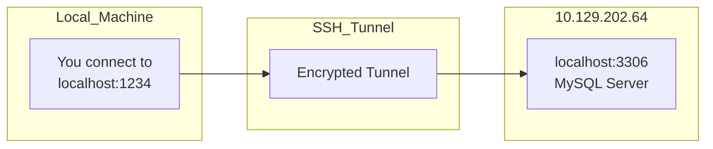
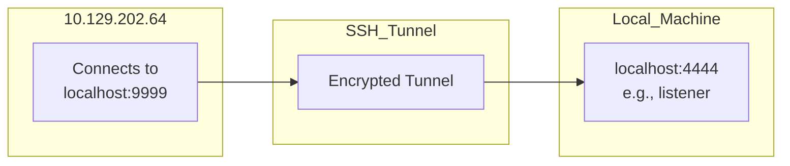
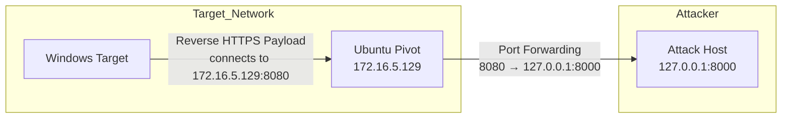
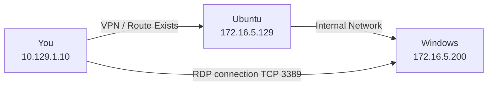

# SSH Tunneling and Reverse Connections

## SSH Tunneling
SSH tunneling is a method of securely forwarding network traffic over an encrypted SSH connection. It can be used to bypass firewalls and access internal networks or services that are not directly accessible from the internet.

Example 1:

Example 2:

Example 3:

Example 4:

## Techniques and Tactics
These examples demonstrate techniques related to SSH tunneling and reverse connections, which are part of the MITRE ATT&CK framework.

- **T1003 - Exploitation of Remote Services**: This technique involves exploiting a remote service to gain access to a system. SSH tunneling can be used to bypass network restrictions and gain access to internal services.

- **T1132 - Reverse Shell**: A reverse shell is a type of shell connection where the attacker's shell is established on the target machine, and the connection is tunneled back to the attacker's machine. This is often used to maintain persistence and gain access to the target system.

- **T1555 - Reverse HTTPS**: This technique involves using HTTPS to establish a reverse shell or other types of connections. It can be used to bypass firewalls and other network security measures.

